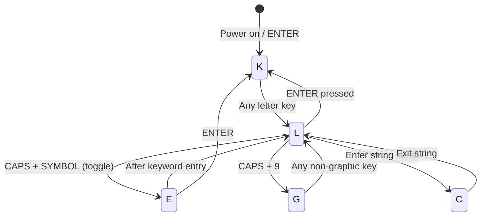
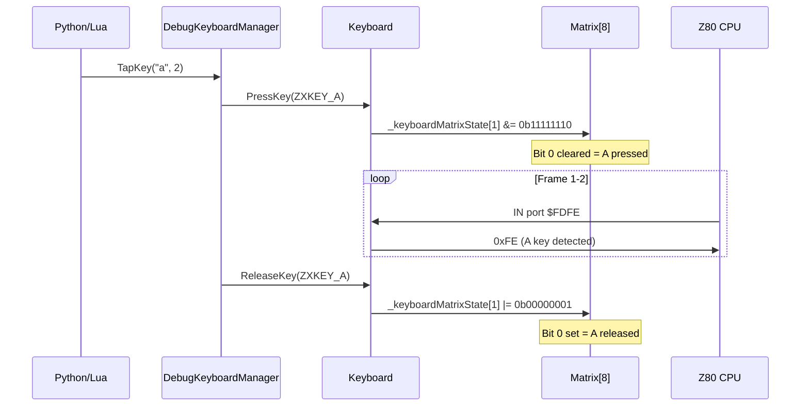
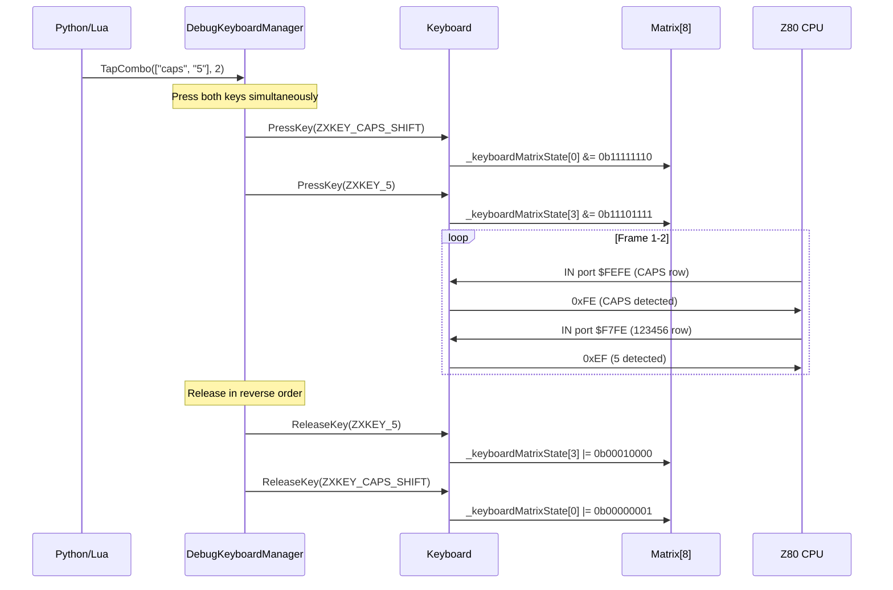
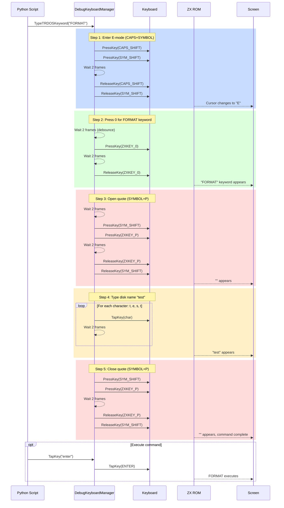
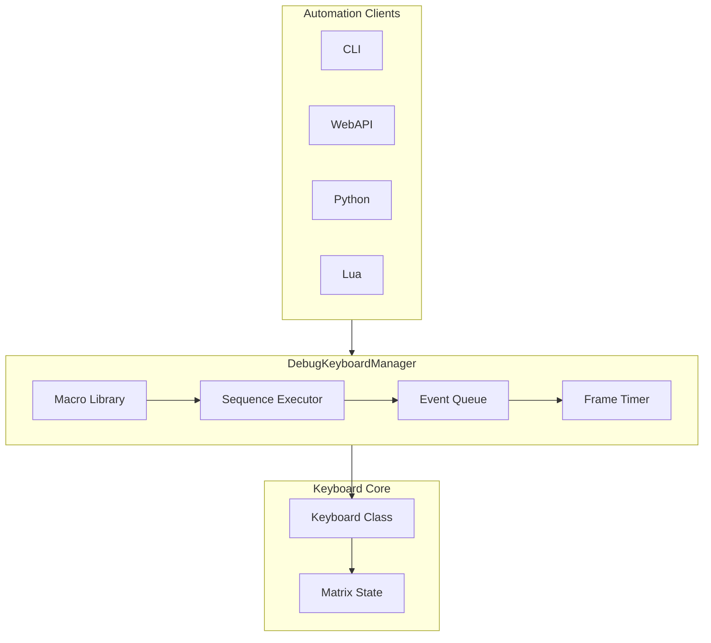
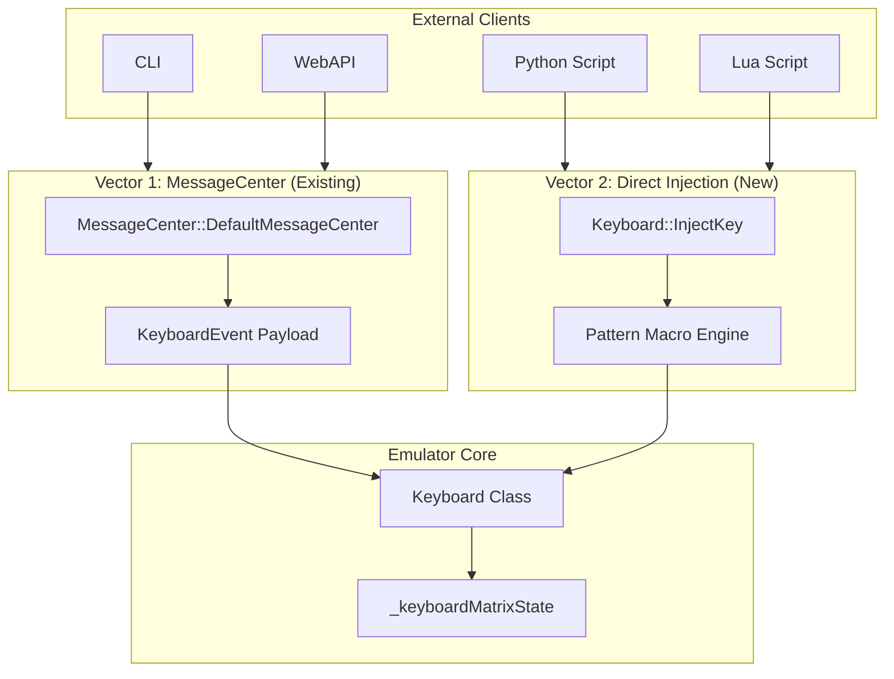

# Keyboard Event Injection Design

Design proposal for programmatic keyboard event injection to the emulated ZX Spectrum system.

> [!TIP]
> Reference: http://slady.net/Sinclair-ZX-Spectrum-keyboard/

## Implementation Status

> **Status**: ✅ Core Implementation Complete (2026-01-28)

| Feature | Status | Notes |
|---------|--------|-------|
| **DebugKeyboardManager** | ✅ Complete | Core orchestrator in `core/src/debugger/keyboard/` |
| **OnFrame() integration** | ✅ Complete | Called from MainLoop for automatic sequence processing |
| **Key tap/press/release** | ✅ Complete | Single key operations via API |
| **Combo tap** | ✅ Complete | Modifier+key combos (e.g., SS+P for quote) |
| **Combo release order** | ✅ Complete | Reverse order release to prevent ghost keypresses |
| **Debounce after combo** | ✅ Complete | 1-frame delay after combo release |
| **Case handling** | ✅ Complete | Uppercase = CAPS+letter, lowercase = just letter |
| **TypeText** | ✅ Complete | Type text strings with auto-modifiers |
| **TypeBasicCommand** | ✅ Complete | K-mode tokenized typing for BASIC commands |
| **WebAPI endpoints** | ✅ Complete | `/keyboard/*` endpoints in `keyboard_api.cpp` |
| **Macro library** | ✅ Complete | Predefined sequences (e_mode, format, cat, etc.) |

### WebAPI Endpoints (Implemented)

```
POST /keyboard/tap         - Tap single key
POST /keyboard/press       - Press and hold key
POST /keyboard/release     - Release held key
POST /keyboard/combo       - Modifier+key combo
POST /keyboard/macro       - Execute predefined macro
POST /keyboard/type        - Type text (with tokenized parameter)
POST /keyboard/release_all - Release all keys
POST /keyboard/abort       - Abort current sequence
GET  /keyboard/status      - Get keyboard state
GET  /keyboard/keys        - List recognized key names
```

### Key Fixes Applied

1. **MainLoop OnFrame()**: Added `pDebugManager->GetKeyboardManager()->OnFrame()` call
2. **Combo release order**: Keys released in reverse order (P before SS for SS+P combo)
3. **CharToKeys letter mapping**: Uses `ResolveKeyName()` for proper ZXKEY enum lookup
4. **Case handling**: Uppercase letters use CAPS_SHIFT combo, lowercase just the letter

## Background

For debugging and automation purposes, we need the ability to inject keyboard press/release events directly to an emulator instance without requiring physical user input. This enables:

1. **Automated testing**: Scripted input sequences for regression tests
2. **BASIC injection completion**: Type commands automatically (e.g., `LOAD ""`, `RUN`)
3. **Game testing**: Replay input sequences for TAS or bug reproduction
4. **Accessibility**: External input device integration
5. **TR-DOS command entry**: Inject keywords like `FORMAT`, `COPY`, `MOVE` via mode sequences

---

## ZX Spectrum Keyboard Modes

The ZX Spectrum has 5 edit modes that affect which keywords/symbols result from key presses:

| Mode | Name | Entry Method | Exit Method |
|------|------|--------------|-------------|
| **K** | Keyword | Default after ENTER, at line start | Any key (transitions to L) |
| **L** | Letter | After first character | ENTER returns to K |
| **E** | Extended | CAPS + SYMBOL SHIFT | After keyword/next key |
| **C** | Cursor | Type inside string/quotes | Exit string |
| **G** | Graphics | GRAPHICS mode (CAPS+9) | Any non-graphic key |

### Mode Transition Diagram



### Extended Mode (E) Keywords

In E mode, keys produce extended keywords and symbols critical for TR-DOS:

| Key | E-Mode Result | Typical Use |
|-----|---------------|-------------|
| 0 | `FORMAT` | TR-DOS disk format |
| 1 | `DEF FN` | Function definition |
| 2 | `FN` | Function call |
| 3 | `LINE` | Line number |
| 4 | `OPEN #` | Open channel |
| 5 | `CLOSE #` | Close channel |
| 6 | `MOVE` | TR-DOS move file |
| 7 | `ERASE` | TR-DOS erase file |
| 8 | `POINT` | Graphics point |
| 9 | `CAT` | TR-DOS catalog |
| A-Z | Extended tokens | Various BASIC keywords |

### Example: Injecting TR-DOS FORMAT Command

To inject `FORMAT"test"` (tokenized - no spaces) we need this sequence:

```
Step  Action                      Mode After   Result
─────────────────────────────────────────────────────
1     Press SYM+CAPS              E            Enter Extended mode
2     Release SYM+CAPS            E            (stay in E)
3     Wait 1-2 frames             E            Allow mode switch
4     Press 0                     L            "FORMAT" keyword appears
5     Release 0                   L
6     Wait 1-2 frames             L            Allow debounce
7     Press SYMBOL+P              C            '"' (enter string)
8     Release SYMBOL+P            C
9     Wait 1-2 frames             C
10    Press T                     C            "t"
11    Release T                   C
12    Press E                     C            "e"
13    Release E                   C
14    Press S                     C            "s"
15    Release S                   C
16    Press T                     C            "t"
17    Release T                   C
18    Wait 1-2 frames             C
19    Press SYMBOL+P              L            '"' (exit string)
20    Release SYMBOL+P            L
21    Press ENTER (optional)      K            Execute FORMAT
```

> [!NOTE]
> TR-DOS uses tokenized BASIC format: `FORMAT "diskname"` has no space between 
> the keyword and the opening quote. The keyword is a single token "FORMAT ", not typed 
> letter-by-letter in 48k mode or in TR-DOS console. Only 128k mode editor allows letter-by-letter typing, but once transitioned to TRDOS - same tokenization rules apply.

#### Input Format to Produce This Sequence

**C++ - Explicit Sequence Object:**
```cpp
// Structure: {Action, {keys...}, frames}
// 
// 'frames' meaning depends on action:
//   PRESS/COMBO_PRESS:   wait N frames after pressing (keys stay held)
//   RELEASE/COMBO_RELEASE: wait N frames after releasing
//   TAP/COMBO_TAP:       hold for N frames, then auto-release
//   WAIT:                pause for N frames (no key action)

KeyboardSequence formatTest;
formatTest.name = "format_test";
formatTest.events = {
    // E-mode: press SYM+CAPS for 2 frames, release, wait 2 frames
    {Action::COMBO_PRESS, {ZXKEY_SYM_SHIFT, ZXKEY_CAPS_SHIFT}, 2},   // Hold for the 2 frames to allow ROM keyscan loop to capture keypresses
    {Action::COMBO_RELEASE, {ZXKEY_SYM_SHIFT, ZXKEY_CAPS_SHIFT}, 2}, // Wait 2 after keypresses release
    
    // FORMAT keyword: tap 0 for 2 frames, wait 2 frames
    {Action::TAP, {ZXKEY_0}, 2},   // Press, hold 2 frames, release
    {Action::WAIT, {}, 2},         // Pause 2 frames
    
    // Opening quote: SYMBOL+P held for 2 frames
    {Action::COMBO_TAP, {ZXKEY_SYM_SHIFT, ZXKEY_P}, 2},
    {Action::WAIT, {}, 2},
    
    // Disk name "test": each key held for 2 frames
    {Action::TAP, {ZXKEY_T}, 2},
    {Action::TAP, {ZXKEY_E}, 2},
    {Action::TAP, {ZXKEY_S}, 2},
    {Action::TAP, {ZXKEY_T}, 2},
    {Action::WAIT, {}, 2},
    
    // Closing quote
    {Action::COMBO_TAP, {ZXKEY_SYM_SHIFT, ZXKEY_P}, 2}
};
dkm->ExecuteSequence(formatTest);

// Or use high-level helper:
dkm->TypeTRDOSCommand("FORMAT", "test");
```

**Python - List of Tuples:**
```python
# Low-level explicit sequence
emu.keyboard.sequence([
    ("combo", ["symbol", "caps"], 2),     # E-mode
    ("wait", 2),
    ("tap", ["0"], 2),                     # FORMAT keyword
    ("wait", 2),
    ("combo", ["symbol", "p"], 2),         # Opening "
    ("wait", 2),
    ("tap", ["t"], 2),                     # t
    ("tap", ["e"], 2),                     # e
    ("tap", ["s"], 2),                     # s
    ("tap", ["t"], 2),                     # t
    ("wait", 2),
    ("combo", ["symbol", "p"], 2)          # Closing "
])

# Or use high-level helper:
emu.keyboard.type_trdos_command("FORMAT", "test")
```

**Lua - Table of Events:**
```lua
-- Low-level explicit sequence
emu.keyboard:sequence({
    {action = "combo", keys = {"symbol", "caps"}, hold = 2},  -- E-mode
    {action = "wait", frames = 2},
    {action = "tap", keys = {"0"}, hold = 2},                 -- FORMAT
    {action = "wait", frames = 2},
    {action = "combo", keys = {"symbol", "p"}, hold = 2},     -- Opening "
    {action = "wait", frames = 2},
    {action = "tap", keys = {"t"}, hold = 2},
    {action = "tap", keys = {"e"}, hold = 2},
    {action = "tap", keys = {"s"}, hold = 2},
    {action = "tap", keys = {"t"}, hold = 2},
    {action = "wait", frames = 2},
    {action = "combo", keys = {"symbol", "p"}, hold = 2}      -- Closing "
})

-- Or use high-level helper:
emu.keyboard:type_trdos("FORMAT", "test")
```

**CLI - Compact String Syntax:**
```bash
# Full explicit sequence (space-separated events)
> key sequence combo:symbol+caps:2 wait:2 tap:0:2 wait:2 combo:symbol+p:2 wait:2 tap:t:2 tap:e:2 tap:s:2 tap:t:2 wait:2 combo:symbol+p:2

# Or use high-level command:
> trdos FORMAT "test"
```

**WebAPI - JSON Array:**
```json
POST /api/v1/emulator/{id}/input/sequence
{
  "events": [
    {"action": "combo", "keys": ["symbol", "caps"], "holdFrames": 2},
    {"action": "wait", "frames": 2},
    {"action": "tap", "keys": ["0"], "holdFrames": 2},
    {"action": "wait", "frames": 2},
    {"action": "combo", "keys": ["symbol", "p"], "holdFrames": 2},
    {"action": "wait", "frames": 2},
    {"action": "tap", "keys": ["t"], "holdFrames": 2},
    {"action": "tap", "keys": ["e"], "holdFrames": 2},
    {"action": "tap", "keys": ["s"], "holdFrames": 2},
    {"action": "tap", "keys": ["t"], "holdFrames": 2},
    {"action": "wait", "frames": 2},
    {"action": "combo", "keys": ["symbol", "p"], "holdFrames": 2}
  ]
}

// Or use high-level endpoint:
POST /api/v1/emulator/{id}/input/trdos
{"command": "FORMAT", "argument": "test"}
```

### Sequence Diagrams

#### Simple Key Press/Release



#### Modifier + Key Combo (e.g., CAPS+5 = LEFT arrow)



#### Complex Sequence: TR-DOS FORMAT Command



---

## Input Format Examples

This section shows the exact input format for all keyboard injection types across all automation interfaces.

### Type 1: Single Key Press/Release

Press a single key (no modifiers).

````carousel
**C++ (Native)**
```cpp
// Press and hold
dkm->PressKey(ZXKEY_A);
dkm->PressKey("a");  // String variant

// Release
dkm->ReleaseKey(ZXKEY_A);
dkm->ReleaseKey("a");

// Tap (press + auto-release after N frames)
dkm->TapKey(ZXKEY_ENTER, 2);
dkm->TapKey("enter", 2);
```
<!-- slide -->
**Python**
```python
# Press and hold
emu.keyboard.press("a")

# Release
emu.keyboard.release("a")

# Tap (press + auto-release)
emu.keyboard.tap("a", frames=2)
emu.keyboard.tap("enter")  # Default 1 frame
```
<!-- slide -->
**Lua**
```lua
-- Press and hold
emu.keyboard:press("a")

-- Release
emu.keyboard:release("a")

-- Tap (press + auto-release)
emu.keyboard:tap("a", 2)
emu.keyboard:tap("enter")  -- Default 1 frame
```
<!-- slide -->
**CLI**
```bash
> key press a
> key release a
> key tap a 2
> key tap enter
```
<!-- slide -->
**WebAPI**
```json
POST /api/v1/emulator/{id}/input/key
{"action": "press", "key": "a"}

POST /api/v1/emulator/{id}/input/key
{"action": "release", "key": "a"}

POST /api/v1/emulator/{id}/input/key
{"action": "tap", "key": "a", "holdFrames": 2}
```
````

### Type 2: Modifier + Key Combo

Press modifier key(s) + another key simultaneously (e.g., CAPS+5 = LEFT arrow).

````carousel
**C++ (Native)**
```cpp
// Press combo (all keys at once)
dkm->PressCombo({ZXKEY_CAPS_SHIFT, ZXKEY_5});
dkm->PressCombo({"caps", "5"});  // String variant

// Release combo
dkm->ReleaseCombo({ZXKEY_CAPS_SHIFT, ZXKEY_5});

// Tap combo (press + hold + release)
dkm->TapCombo({ZXKEY_CAPS_SHIFT, ZXKEY_5}, 2);
dkm->TapCombo({"caps", "5"}, 2);

// Extended keys auto-decompose
dkm->TapKey(ZXKEY_EXT_LEFT);  // Same as TapCombo({CAPS, 5})
```
<!-- slide -->
**Python**
```python
# Press combo
emu.keyboard.combo_press(["caps", "5"])

# Release combo
emu.keyboard.combo_release(["caps", "5"])

# Tap combo (press + hold + release)
emu.keyboard.combo(["caps", "5"], frames=2)

# Extended keys (auto-decompose)
emu.keyboard.tap("left")  # CAPS+5 internally
emu.keyboard.tap("up")    # CAPS+7 internally
```
<!-- slide -->
**Lua**
```lua
-- Press combo
emu.keyboard:combo_press({"caps", "5"})

-- Release combo
emu.keyboard:combo_release({"caps", "5"})

-- Tap combo
emu.keyboard:combo({"caps", "5"}, 2)

-- Extended keys (auto-decompose)
emu.keyboard:tap("left")  -- CAPS+5 internally
```
<!-- slide -->
**CLI**
```bash
> key combo caps+5
Keys pressed: CAPS_SHIFT + 5 (LEFT arrow)

> key combo caps+5 2
Keys pressed for 2 frames

> key tap left
Key tapped: LEFT (CAPS+5)
```
<!-- slide -->
**WebAPI**
```json
POST /api/v1/emulator/{id}/input/key
{
  "action": "combo",
  "keys": ["caps", "5"],
  "holdFrames": 2
}

POST /api/v1/emulator/{id}/input/key
{"action": "tap", "key": "left", "holdFrames": 1}
```
````

### Type 3: Event Sequence

Execute a series of events with precise timing (e.g., E-mode entry).

````carousel
**C++ (Native)**
```cpp
KeyboardSequence seq;
seq.name = "custom_sequence";
seq.events = {
    {Action::COMBO_PRESS, {ZXKEY_CAPS_SHIFT, ZXKEY_SYM_SHIFT}, 2},
    {Action::COMBO_RELEASE, {ZXKEY_CAPS_SHIFT, ZXKEY_SYM_SHIFT}},
    {Action::WAIT, {}, 2},
    {Action::TAP, {ZXKEY_0}, 2},
    {Action::WAIT, {}, 1},
    {Action::TAP, {ZXKEY_SPACE}, 1}
};
dkm->ExecuteSequence(seq);
```
<!-- slide -->
**Python**
```python
# Low-level sequence
emu.keyboard.sequence([
    ("combo_press", ["caps", "symbol"], 2),
    ("combo_release", ["caps", "symbol"]),
    ("wait", 2),
    ("tap", ["0"], 2),
    ("wait", 1),
    ("tap", ["space"], 1)
])

# Check execution status
while emu.keyboard.is_sequence_running():
    emu.run_frames(1)
```
<!-- slide -->
**Lua**
```lua
-- Low-level sequence
emu.keyboard:sequence({
    {action = "combo_press", keys = {"caps", "symbol"}, hold = 2},
    {action = "combo_release", keys = {"caps", "symbol"}},
    {action = "wait", frames = 2},
    {action = "tap", keys = {"0"}, hold = 2},
    {action = "wait", frames = 1},
    {action = "tap", keys = {"space"}, hold = 1}
})
```
<!-- slide -->
**CLI**
```bash
# Compact sequence syntax: action:key[:frames]
> key sequence combo:caps+symbol:2 release:caps+symbol wait:2 tap:0:2 wait:1 tap:space:1
Executing 6 events...

# Or line by line
> key combo caps+symbol 2
> key release caps+symbol
> run 2
> key tap 0 2
> run 1
> key tap space
```
<!-- slide -->
**WebAPI**
```json
POST /api/v1/emulator/{id}/input/sequence
{
  "events": [
    {"action": "combo_press", "keys": ["caps", "symbol"], "holdFrames": 2},
    {"action": "combo_release", "keys": ["caps", "symbol"]},
    {"action": "wait", "frames": 2},
    {"action": "tap", "keys": ["0"], "holdFrames": 2},
    {"action": "wait", "frames": 1},
    {"action": "tap", "keys": ["space"], "holdFrames": 1}
  ]
}
```
````

### Type 4: Predefined Macros

Use built-in macros for common operations.

````carousel
**C++ (Native)**
```cpp
// Execute named macro
dkm->ExecuteNamedSequence("format");  // E-mode + 0
dkm->ExecuteNamedSequence("cat");     // E-mode + 9
dkm->ExecuteNamedSequence("break");   // CAPS + SPACE
dkm->ExecuteNamedSequence("e_mode");  // CAPS + SYMBOL

// High-level helpers (build and execute)
dkm->EnterExtendedMode();
dkm->TypeTRDOSKeyword("FORMAT");
```
<!-- slide -->
**Python**
```python
# Execute named macro
emu.keyboard.macro("format")
emu.keyboard.macro("cat")
emu.keyboard.macro("break")

# High-level helpers
emu.keyboard.enter_e_mode()
emu.keyboard.type_trdos_keyword("FORMAT")
emu.keyboard.type_trdos_keyword("CAT")
```
<!-- slide -->
**Lua**
```lua
-- Execute named macro
emu.keyboard:macro("format")
emu.keyboard:macro("cat")
emu.keyboard:macro("break")

-- High-level helpers
emu.keyboard:enter_e_mode()
emu.keyboard:type_trdos("FORMAT")
```
<!-- slide -->
**CLI**
```bash
> key macro format
Executed macro: format (5 events)

> key macro cat
Executed macro: cat (4 events)

> key macro break
Executed macro: break (2 events)
```
<!-- slide -->
**WebAPI**
```json
POST /api/v1/emulator/{id}/input/macro
{"name": "format"}

POST /api/v1/emulator/{id}/input/macro
{"name": "cat"}
```
````

### Type 5: Text Typing

Type a string with automatic modifier handling.

````carousel
**C++ (Native)**
```cpp
// Type text (auto-handles modifiers for symbols)
dkm->TypeText("LOAD \"\"", 2);  // 2 frames between chars
dkm->TypeText("RUN");           // Default delay
```
<!-- slide -->
**Python**
```python
# Type text with auto-modifiers
emu.keyboard.type_text('LOAD ""', char_delay_frames=2)
emu.keyboard.type_text("RUN")

# Type followed by ENTER
emu.keyboard.type_text('LOAD ""')
emu.keyboard.tap("enter")
```
<!-- slide -->
**Lua**
```lua
-- Type text with auto-modifiers
emu.keyboard:type_text('LOAD ""', 2)
emu.keyboard:type_text("RUN")
```
<!-- slide -->
**CLI**
```bash
> type 'LOAD ""'
Typing 8 characters... done

> type RUN
Typing 3 characters... done
```
<!-- slide -->
**WebAPI**
```json
POST /api/v1/emulator/{id}/input/type
{
  "text": "LOAD \"\"",
  "charDelayFrames": 2
}
```
````

### Event Action Reference

| Action | Description | Keys Required | HoldFrames Meaning |
|--------|-------------|---------------|-------------------|
| `press` | Press key, keep held | 1+ | N/A (stays pressed) |
| `release` | Release held key | 1+ | N/A |
| `tap` | Press + auto-release | 1+ | How long to hold |
| `combo_press` | Press multiple keys together | 2+ | N/A (stays pressed) |
| `combo_release` | Release multiple keys | 2+ | N/A |
| `combo` | Press + hold + release combo | 2+ | How long to hold |
| `wait` | Pause sequence execution | 0 | Frames to wait |
| `release_all` | Release all pressed keys | 0 | N/A |

---

## DebugKeyboardManager

A high-level orchestrator for complex keyboard injection scenarios with proper timing.

### Architecture



### Core Data Structures

```cpp
/// Single keyboard event in a sequence
struct KeyboardSequenceEvent {
    enum class Action { 
        PRESS,           // Press and hold
        RELEASE,         // Release specific key
        TAP,             // Press + auto-release after holdFrames
        COMBO_PRESS,     // Press multiple keys simultaneously
        COMBO_RELEASE,   // Release multiple keys
        RELEASE_ALL,     // Release all pressed keys
        WAIT             // Wait N frames (no key action)
    };
    
    Action action;
    std::vector<ZXKeysEnum> keys;  // One or more keys
    uint16_t holdFrames = 1;       // Duration for TAP, delay for WAIT
};

/// A sequence of keyboard events with timing
struct KeyboardSequence {
    std::string name;              // e.g., "enter_e_mode", "type_format"
    std::vector<KeyboardSequenceEvent> events;
    uint16_t defaultGapFrames = 2; // Default gap between events
};

/// Main manager class
class DebugKeyboardManager {
public:
    // Construct with owning emulator
    explicit DebugKeyboardManager(EmulatorContext* context);
    
    /// region <Single Key Operations>
    
    /// Press a single key (stays pressed until release)
    void PressKey(ZXKeysEnum key);
    void PressKey(const std::string& keyName);
    
    /// Release a specific key
    void ReleaseKey(ZXKeysEnum key);
    void ReleaseKey(const std::string& keyName);
    
    /// Tap a key (press + release after holdFrames)
    void TapKey(ZXKeysEnum key, uint16_t holdFrames = 1);
    void TapKey(const std::string& keyName, uint16_t holdFrames = 1);
    
    /// Release all currently pressed keys
    void ReleaseAllKeys();
    
    /// endregion </Single Key Operations>
    
    /// region <Modifier + Key Operations>
    
    /// Press modifier+key combo (e.g., CAPS+5 for LEFT arrow)
    void PressCombo(const std::vector<ZXKeysEnum>& keys);
    void PressCombo(const std::vector<std::string>& keyNames);
    
    /// Tap modifier+key combo
    void TapCombo(const std::vector<ZXKeysEnum>& keys, uint16_t holdFrames = 1);
    void TapCombo(const std::vector<std::string>& keyNames, uint16_t holdFrames = 1);
    
    /// Release a combo
    void ReleaseCombo(const std::vector<ZXKeysEnum>& keys);
    
    /// endregion </Modifier + Key Operations>
    
    /// region <Sequence Operations>
    
    /// Execute a sequence of events with timing
    void ExecuteSequence(const KeyboardSequence& sequence);
    
    /// Execute a named predefined sequence (e.g., "e_mode", "format_command")
    void ExecuteNamedSequence(const std::string& name);
    
    /// Queue a sequence for asynchronous execution
    void QueueSequence(const KeyboardSequence& sequence);
    
    /// Check if any sequence is currently executing
    bool IsSequenceRunning() const;
    
    /// Abort current sequence
    void AbortSequence();
    
    /// endregion </Sequence Operations>
    
    /// region <High-Level Helpers>
    
    /// Enter Extended mode (CAPS + SYMBOL SHIFT)
    void EnterExtendedMode();
    
    /// Enter Graphics mode (CAPS + 9)
    void EnterGraphicsMode();
    
    /// Type a TR-DOS keyword (handles E-mode entry automatically)
    void TypeTRDOSKeyword(const std::string& keyword);
    
    /// Type text string with proper mode handling
    void TypeText(const std::string& text, uint16_t charDelayFrames = 2);
    
    /// endregion </High-Level Helpers>
    
    /// Called every frame to process pending events
    void OnFrame();
    
private:
    EmulatorContext* _context;
    Keyboard* _keyboard;
    
    // Pending events queue
    std::queue<KeyboardSequenceEvent> _pendingEvents;
    uint16_t _frameCountdown = 0;
    
    // Currently executing sequence
    std::optional<KeyboardSequence> _currentSequence;
    size_t _currentEventIndex = 0;
    
    // Predefined sequences
    static std::map<std::string, KeyboardSequence> _macroLibrary;
    
    void ProcessNextEvent();
};
```

### Predefined Macros

```cpp
// Initialize standard macro library
std::map<std::string, KeyboardSequence> DebugKeyboardManager::_macroLibrary = {
    {"e_mode", {
        "e_mode",
        {
            {Action::COMBO_PRESS, {ZXKEY_CAPS_SHIFT, ZXKEY_SYM_SHIFT}, 2},
            {Action::COMBO_RELEASE, {ZXKEY_CAPS_SHIFT, ZXKEY_SYM_SHIFT}},
            {Action::WAIT, {}, 2}  // Allow mode switch
        }
    }},
    {"format", {
        "format",
        {
            // Enter E-mode first
            {Action::COMBO_PRESS, {ZXKEY_CAPS_SHIFT, ZXKEY_SYM_SHIFT}, 2},
            {Action::COMBO_RELEASE, {ZXKEY_CAPS_SHIFT, ZXKEY_SYM_SHIFT}},
            {Action::WAIT, {}, 2},
            // Press 0 for FORMAT keyword
            {Action::TAP, {ZXKEY_0}, 2},
            {Action::WAIT, {}, 2}
        }
    }},
    {"cat", {
        "cat",
        {
            // Enter E-mode, press 9 for CAT
            {Action::COMBO_PRESS, {ZXKEY_CAPS_SHIFT, ZXKEY_SYM_SHIFT}, 2},
            {Action::COMBO_RELEASE, {ZXKEY_CAPS_SHIFT, ZXKEY_SYM_SHIFT}},
            {Action::WAIT, {}, 2},
            {Action::TAP, {ZXKEY_9}, 2}
        }
    }},
    {"break", {
        "break",
        {
            {Action::COMBO_PRESS, {ZXKEY_CAPS_SHIFT, ZXKEY_SPACE}, 3},
            {Action::COMBO_RELEASE, {ZXKEY_CAPS_SHIFT, ZXKEY_SPACE}}
        }
    }}
};
```

### Automation API Additions

**WebAPI:**
```json
POST /api/v1/emulator/{id}/input/sequence
{
  "events": [
    {"action": "combo_press", "keys": ["caps", "symbol"], "holdFrames": 2},
    {"action": "combo_release", "keys": ["caps", "symbol"]},
    {"action": "wait", "frames": 2},
    {"action": "tap", "keys": ["0"], "holdFrames": 2}
  ]
}

POST /api/v1/emulator/{id}/input/macro
{
  "name": "format"
}
```

**CLI:**
```bash
> key sequence caps+symbol:2 wait:2 0:2
Executed 4 events

> key macro format
Executed macro: format (5 events)

> key macro e_mode
Entered Extended mode
```

**Python:**
```python
# Low-level sequence
emu.keyboard.sequence([
    ("combo_press", ["caps", "symbol"], 2),
    ("combo_release", ["caps", "symbol"]),
    ("wait", 2),
    ("tap", ["0"], 2)
])

# Named macro
emu.keyboard.macro("format")

# High-level helpers
emu.keyboard.enter_e_mode()
emu.keyboard.type_trdos_keyword("FORMAT")
emu.keyboard.type_text('FORMAT "$MYDISK"')
```

**Lua:**
```lua
-- Low-level sequence
emu.keyboard:sequence({
    {action = "combo_press", keys = {"caps", "symbol"}, hold = 2},
    {action = "combo_release", keys = {"caps", "symbol"}},
    {action = "wait", frames = 2},
    {action = "tap", keys = {"0"}, hold = 2}
})

-- Named macro
emu.keyboard:macro("format")

-- High-level helpers
emu.keyboard:enter_e_mode()
emu.keyboard:type_trdos("FORMAT")
```

---

## Existing Infrastructure Analysis

### Keyboard Matrix (`keyboard.h/cpp`)

The ZX Spectrum keyboard is an 8×5 matrix scanned via port `#FE`:

```
Port    Address    D0          D1          D2    D3    D4
$FEFE   A8         Caps Shift  Z           X     C     V
$FDFE   A9         A           S           D     F     G
$FBFE   A10        Q           W           E     R     T
$F7FE   A11        1           2           3     4     5
$EFFE   A12        0           9           8     7     6
$DFFE   A13        P           O           I     U     Y
$BFFE   A14        Enter       L           K     J     H
$7FFE   A15        Space       Sym Shift   M     N     B
```

**Key State Storage**:
```cpp
uint8_t _keyboardMatrixState[8];  // 8 half-rows, bit=0 means pressed
std::map<ZXKeysEnum, uint8_t> _keyboardPressedKeys;  // Reference counting
```

### MessageCenter Event Pattern

The existing `Keyboard` class already subscribes to MessageCenter events:

```cpp
// Message topics
const char* const MC_KEY_PRESSED = "KEY_PRESSED";
const char* const MC_KEY_RELEASED = "KEY_RELEASED";

// Event payload
struct KeyboardEvent {
    std::string targetEmulatorId;  // Instance routing (empty = broadcast)
    uint8_t zxKeyCode;             // ZXKeysEnum value
    KeyEventEnum eventType;        // KEY_PRESSED or KEY_RELEASED
};
```

**Handler Methods** (already implemented):
- `Keyboard::OnKeyPressed(int id, Message* message)` 
- `Keyboard::OnKeyReleased(int id, Message* message)`

Both handlers support:
- Instance targeting via `targetEmulatorId`
- Extended key decomposition (e.g., `ZXKEY_EXT_LEFT` → `CAPS_SHIFT + 5`)
- Reference counting for overlapping modifiers

### Direct Matrix Methods

```cpp
void Keyboard::PressKey(ZXKeysEnum key);   // Set bit in matrix
void Keyboard::ReleaseKey(ZXKeysEnum key); // Clear bit in matrix
```

---

## Design Approach

### Two Injection Vectors



### Vector 1: MessageCenter Pattern (Existing, Recommended for Remote)

Best for CLI, WebAPI, and inter-process communication. Already implemented.

**Usage**:
```cpp
MessageCenter& mc = MessageCenter::DefaultMessageCenter();
auto* event = new KeyboardEvent(ZXKEY_A, KEY_PRESSED, emulatorId);
mc.SendMessage(MC_KEY_PRESSED, event);
```

### Vector 2: Direct Injection (New, Recommended for Scripting)

Best for Python/Lua bindings with tight emulator coupling.

**New Methods**:
```cpp
class Keyboard {
public:
    // Direct injection (bypasses MessageCenter, instant)
    void InjectKeyPress(ZXKeysEnum key);
    void InjectKeyRelease(ZXKeysEnum key);
    void InjectKeyTap(ZXKeysEnum key, uint16_t durationFrames = 1);
    
    // High-level convenience
    void InjectKeyCombo(std::vector<ZXKeysEnum> keys, uint16_t holdFrames = 1);
    void InjectText(const std::string& text, uint16_t charDelayFrames = 2);
    
    // State query
    bool IsKeyPressed(ZXKeysEnum key) const;
    std::vector<ZXKeysEnum> GetPressedKeys() const;
};
```

---

## Data Structures

### Key Name Mapping

```cpp
// String-to-enum lookup for automation interfaces
static const std::map<std::string, ZXKeysEnum> keyNameMap = {
    // Letters
    {"a", ZXKEY_A}, {"b", ZXKEY_B}, ..., {"z", ZXKEY_Z},
    
    // Numbers
    {"0", ZXKEY_0}, {"1", ZXKEY_1}, ..., {"9", ZXKEY_9},
    
    // Modifiers
    {"shift", ZXKEY_CAPS_SHIFT}, {"caps", ZXKEY_CAPS_SHIFT},
    {"symbol", ZXKEY_SYM_SHIFT}, {"sym", ZXKEY_SYM_SHIFT},
    
    // Special
    {"enter", ZXKEY_ENTER}, {"return", ZXKEY_ENTER},
    {"space", ZXKEY_SPACE}, {" ", ZXKEY_SPACE},
    
    // Extended (decomposed internally)
    {"left", ZXKEY_EXT_LEFT}, {"right", ZXKEY_EXT_RIGHT},
    {"up", ZXKEY_EXT_UP}, {"down", ZXKEY_EXT_DOWN},
    {"delete", ZXKEY_EXT_DELETE}, {"backspace", ZXKEY_EXT_DELETE},
    {"break", ZXKEY_EXT_BREAK},
    
    // Symbols
    {".", ZXKEY_EXT_DOT}, {",", ZXKEY_EXT_COMMA},
    {"+", ZXKEY_EXT_PLUS}, {"-", ZXKEY_EXT_MINUS},
    {"*", ZXKEY_EXT_MULTIPLY}, {"/", ZXKEY_EXT_DIVIDE},
    {"=", ZXKEY_EXT_EQUAL},
    {"\"", ZXKEY_EXT_DBLQUOTE},
};
```

### Text-to-Key Conversion

For `type` command and `InjectText()`:

```cpp
struct TextKeyMapping {
    char character;
    ZXKeysEnum baseKey;
    ZXKeysEnum modifier;  // ZXKEY_NONE, ZXKEY_CAPS_SHIFT, or ZXKEY_SYM_SHIFT
};

// ASCII to ZX Spectrum key mapping
static const std::map<char, TextKeyMapping> asciiToKey = {
    {'A', {ZXKEY_A, ZXKEY_CAPS_SHIFT}},  // Uppercase = CAPS + letter
    {'a', {ZXKEY_A, ZXKEY_NONE}},
    // ... etc
    {'"', {ZXKEY_P, ZXKEY_SYM_SHIFT}},
    {'!', {ZXKEY_1, ZXKEY_SYM_SHIFT}},
    // ... full symbol table
};
```

---

## Automation Module Exposure

### WebAPI (JSON)

**Endpoints**:

| Method | Path | Description |
|--------|------|-------------|
| POST | `/api/v1/emulator/{id}/input/key` | Press, release, or tap a key |
| POST | `/api/v1/emulator/{id}/input/type` | Type a string of text |
| GET | `/api/v1/emulator/{id}/input/keyboard` | Get current keyboard state |

**Request Schema (key)**:
```json
{
  "action": "press|release|tap",
  "key": "a",
  "holdFrames": 2
}
```

**Request Schema (type)**:
```json
{
  "text": "LOAD \"\"",
  "charDelayFrames": 2
}
```

**Response Schema (keyboard state)**:
```json
{
  "pressedKeys": ["caps", "a"],
  "matrixState": [255, 255, 255, 255, 255, 255, 254, 255]
}
```

### CLI Commands

| Command | Arguments | Description |
|---------|-----------|-------------|
| `key press <key>` | key name | Press and hold a key |
| `key release <key>` | key name | Release a held key |
| `key tap <key> [frames]` | key name, duration | Press and release (default: 1 frame) |
| `key combo <keys>` | key1+key2+... | Press multiple keys simultaneously |
| `type <text>` | string | Auto-type text with proper modifiers |
| `key list` | | List pressed keys |
| `key clear` | | Release all pressed keys |

**CLI Output Examples**:
```bash
> key press a
Key pressed: A

> key tap enter
Key tapped: ENTER (1 frame)

> key combo shift+5
Keys pressed: CAPS_SHIFT + 5 (LEFT arrow)

> type 'LOAD ""'
Typing 8 characters... done

> key list
Currently pressed: [none]

> key clear
All keys released
```

### Python Bindings

```python
# Direct key control
emu.keyboard.press("a")
emu.keyboard.release("a")
emu.keyboard.tap("enter", frames=2)
emu.keyboard.combo(["shift", "5"])  # LEFT arrow

# Text injection
emu.keyboard.type('LOAD ""', char_delay_frames=2)

# Query state
pressed = emu.keyboard.pressed_keys  # list[str]
is_pressed = emu.keyboard.is_pressed("space")  # bool
matrix = emu.keyboard.matrix_state  # list[int] len=8

# Timing helpers
emu.keyboard.tap_and_wait("enter", wait_frames=50)  # Tap + run N frames
```

### Lua Bindings

```lua
-- Direct key control
emu.keyboard:press("a")
emu.keyboard:release("a")
emu.keyboard:tap("enter", 2)  -- 2 frames
emu.keyboard:combo({"shift", "5"})  -- LEFT arrow

-- Text injection
emu.keyboard:type('LOAD ""', 2)  -- char_delay_frames

-- Query state
local pressed = emu.keyboard:get_pressed()  -- table
local is_pressed = emu.keyboard:is_pressed("space")  -- boolean
local matrix = emu.keyboard:get_matrix()  -- table of 8 integers

-- Timing helpers
emu.keyboard:tap_and_wait("enter", 50)
```

---

## Implementation Hooks

### Direct Injection Methods

Add to `Keyboard` class:

```cpp
// keyboard.h additions
public:
    /// region <Injection Methods>
    
    /// Directly press a key without MessageCenter
    void InjectKeyPress(ZXKeysEnum key);
    
    /// Directly release a key without MessageCenter
    void InjectKeyRelease(ZXKeysEnum key);
    
    /// Press and auto-release after specified frames (requires frame hook)
    void InjectKeyTap(ZXKeysEnum key, uint16_t durationFrames = 1);
    
    /// Press multiple keys simultaneously
    void InjectKeyCombo(const std::vector<ZXKeysEnum>& keys, uint16_t holdFrames = 1);
    
    /// Type text string with automatic modifier handling
    void InjectText(const std::string& text, uint16_t charDelayFrames = 2);
    
    /// Release all currently pressed keys
    void ReleaseAllKeys();
    
    /// endregion </Injection Methods>
    
    /// region <State Queries>
    
    /// Check if specific key is pressed
    bool IsKeyPressed(ZXKeysEnum key) const;
    
    /// Get list of all currently pressed keys
    std::vector<ZXKeysEnum> GetPressedKeys() const;
    
    /// Get raw matrix state (for debugging)
    std::array<uint8_t, 8> GetMatrixState() const;
    
    /// endregion </State Queries>
    
    /// region <Key Name Resolution>
    
    /// Convert string key name to enum
    static ZXKeysEnum ResolveKeyName(const std::string& name);
    
    /// Convert enum to display name
    static std::string GetKeyDisplayName(ZXKeysEnum key);
    
    /// endregion </Key Name Resolution>

private:
    // Pending taps queue (for frame-based timing)
    struct PendingTap {
        ZXKeysEnum key;
        uint16_t framesRemaining;
    };
    std::vector<PendingTap> _pendingTaps;
    
    // Called per-frame to process pending taps
    void ProcessPendingTaps();
```

### Frame Hook Integration

For timed key releases:

```cpp
// In emulator frame loop (e.g., EmulatorContext::OnFrameEnd)
void Keyboard::ProcessPendingTaps() {
    auto it = _pendingTaps.begin();
    while (it != _pendingTaps.end()) {
        if (--it->framesRemaining == 0) {
            ReleaseKey(it->key);
            it = _pendingTaps.erase(it);
        } else {
            ++it;
        }
    }
}
```

---

## File Changes Summary

### [MODIFY] `core/src/emulator/io/keyboard/keyboard.h`
- Add injection methods (`InjectKeyPress`, `InjectKeyRelease`, `InjectKeyTap`, etc.)
- Add state query methods (`IsKeyPressed`, `GetPressedKeys`, `GetMatrixState`)
- Add static key name resolution methods
- Add `_pendingTaps` queue for timed releases

### [MODIFY] `core/src/emulator/io/keyboard/keyboard.cpp`
- Implement all new injection methods
- Implement `ProcessPendingTaps()` for frame-based timing
- Implement key name resolution tables

### [NEW] `core/src/debugger/keyboard/debugkeyboardmanager.h`
- `DebugKeyboardManager` class declaration
- `KeyboardSequenceEvent` struct with Action enum
- `KeyboardSequence` struct for event sequences
- Predefined macro library static map

### [NEW] `core/src/debugger/keyboard/debugkeyboardmanager.cpp`
- Implementation of sequence executor and event queue
- Frame-based timing and countdown logic
- Predefined macros: `e_mode`, `format`, `cat`, `break`
- High-level helpers: `EnterExtendedMode()`, `TypeTRDOSKeyword()`

### [MODIFY] `core/automation/webapi/`
- Add `/api/v1/emulator/{id}/input/key` endpoint
- Add `/api/v1/emulator/{id}/input/type` endpoint
- Add `/api/v1/emulator/{id}/input/keyboard` endpoint

### [MODIFY] `core/automation/cli/`
- Add `key press <key>`, `key release <key>`, `key tap <key>` commands
- Add `key combo <keys>`, `type <text>`, `key list`, `key clear` commands

### [MODIFY] `core/automation/python/src/emulator/python_emulator.h`
- Add `emu.keyboard` submodule with all methods

### [MODIFY] `core/automation/lua/src/emulator/lua_emulator.h`
- Add `emu.keyboard` table with all methods

### [MODIFY] `docs/emulator/design/control-interfaces/command-interface.md`
- Update Input Injection section from 🔮 Planned to ✅ Implemented

---

## Verification Plan

### Automated Tests (Unit)

| Test | Description |
|------|-------------|
| `keyboard_injection_basic` | Verify `InjectKeyPress`/`InjectKeyRelease` update `_keyboardMatrixState` correctly |
| `keyboard_injection_tap` | Verify `TapKey` presses, holds for N frames, then releases |
| `keyboard_combo_press` | Verify `PressCombo` presses multiple keys simultaneously |
| `keyboard_extended_decomposition` | Verify `ZXKEY_EXT_LEFT` decomposes to `CAPS_SHIFT + 5` |
| `keyboard_sequence_execution` | Verify `ExecuteSequence` processes events with correct timing |
| `keyboard_macro_library` | Verify predefined macros (`e_mode`, `format`, `cat`, `break`) execute correctly |
| `keyboard_reference_counting` | Verify overlapping modifier presses don't cause early release |
| `debugkeyboardmanager_typetext` | Verify `TypeText("LOAD")` produces correct key sequence |

### Integration Tests (Automation Interfaces)

| Test | Description |
|------|-------------|
| `webapi_input_key` | POST `/input/key` with press/release/tap actions |
| `webapi_input_sequence` | POST `/input/sequence` with multi-event array |
| `webapi_input_trdos` | POST `/input/trdos` with command/argument |
| `cli_key_commands` | Test `key press/release/tap/combo/sequence/macro` commands |
| `python_keyboard_bindings` | Test all `emu.keyboard.*` methods from Python |
| `lua_keyboard_bindings` | Test all `emu.keyboard:*` methods from Lua |

### Manual Verification

#### Test 1: Simple Key Press (Python)
```python
# Boot to BASIC, verify "A" appears on screen
emu.keyboard.tap("a")
emu.run_frames(10)
# Expected: lowercase "a" on screen
```

#### Test 2: Modifier Combo - Cursor Keys (Python)
```python
# In a game menu, verify cursor movement
emu.keyboard.tap("left")   # CAPS+5
emu.keyboard.tap("right")  # CAPS+8
emu.keyboard.tap("up")     # CAPS+7
emu.keyboard.tap("down")   # CAPS+6
```

#### Test 3: TR-DOS FORMAT Command (Python)
```python
# Boot to TR-DOS, execute FORMAT"test"
emu.keyboard.type_trdos_command("FORMAT", "test")
emu.keyboard.tap("enter")
emu.run_frames(100)
# Expected: Screen shows FORMAT"test" prompt or disk format begins
```

#### Test 4: E-Mode Keyword Entry (CLI)
```bash
> key macro e_mode
> key tap 0
# Expected: FORMAT keyword appears on screen
```

#### Test 5: Full Sequence via WebAPI
```bash
curl -X POST http://localhost:8080/api/v1/emulator/1/input/sequence \
  -H "Content-Type: application/json" \
  -d '{"events":[{"action":"tap","keys":["a"],"holdFrames":2}]}'
# Expected: "a" appears on screen
```

### Visual Verification Checklist

- [ ] Single key tap appears on screen within 1-2 frames
- [ ] Modifier combos produce correct symbol/cursor movement
- [ ] E-mode entry changes cursor indicator to "E"
- [ ] TR-DOS keywords appear as single tokens (not letter-by-letter)
- [ ] Text typing handles uppercase (CAPS+letter) correctly
- [ ] Quote characters appear with SYMBOL+P
- [ ] Sequences execute with visible timing between events

---

## Design Decisions

### Decision 1: Dual-Vector Approach

**Choice**: Support both MessageCenter (for remote) and direct injection (for scripting)

**Rationale**:
- MessageCenter already exists and is thread-safe for cross-process
- Direct injection avoids overhead for tight loops in Python/Lua
- Both share common `PressKey`/`ReleaseKey` core methods

### Decision 2: Frame-Based Timing

**Choice**: Use frame count instead of milliseconds for tap duration

**Rationale**:
- ZX Spectrum keyboard scanning is tied to interrupt (~50Hz)
- Frame-based timing is deterministic and reproducible
- Avoids real-time clock issues in turbo/headless modes

### Decision 3: Extended Key Abstraction

**Choice**: Support both raw keys (A-Z, 0-9) and extended keys (LEFT, UP, symbols)

**Rationale**:
- Raw keys map 1:1 to matrix positions (simple automation)
- Extended keys auto-decompose to modifier+key (user-friendly)
- Existing `getExtendedKeyBase`/`getExtendedKeyModifier` already handle this

---

## Mode-Specific Testing Requirements

Keyboard injection must be tested in all three operating modes:

### 48K BASIC Mode

| Test | Expected Behavior |
|------|-------------------|
| Letter keys | Appear as typed (lowercase in K-mode, uppercase in L-mode) |
| ENTER | Executes current line |
| CAPS+SYMBOL | Switches to E-mode, cursor shows "E" |
| E-mode + 0 | `FORMAT` keyword appears (if tokenizable context) |
| Cursor keys | CAPS+5/6/7/8 produce movement |

### 128K BASIC Mode  

| Test | Expected Behavior |
|------|-------------------|
| Letter keys | Letter-by-letter typing works (no auto-tokenization until ENTER) |
| Extended mode | CAPS+SYMBOL → E-mode cursor |
| Menu navigation | From 128K menu, can inject keys to select options |
| PLAY command | 128K-specific keyword available |

### TR-DOS Mode

| Test | Expected Behavior |
|------|-------------------|
| E-mode entry | CAPS+SYMBOL switches to E-mode |
| E-mode + 0 | `FORMAT` keyword token appears |
| E-mode + 9 | `CAT` keyword token appears |
| Disk name | After keyword, quotes and text work correctly |
| Output | Commands execute against virtual disk |

### Mode Detection Integration

Use `BasicEncoder::detectState()` to determine current mode before injection:

```cpp
BasicEncoder::BasicState state = BasicEncoder::detectState(memory, z80->SP);

switch (state) {
    case BasicEncoder::BasicState::Basic48K:
        // Standard keyboard matrix timing works
        break;
    case BasicEncoder::BasicState::Basic128K:
        // Letter-by-letter with 128K tokenization on ENTER
        break;
    case BasicEncoder::BasicState::TRDOS_Active:
    case BasicEncoder::BasicState::TRDOS_SOS_Call:
        // E-mode keywords, tokenized format
        break;
    case BasicEncoder::BasicState::Menu128K:
        // Need to navigate to BASIC first
        break;
}
```

---

## Future Unification: Input Injection Framework

> [!IMPORTANT]
> This keyboard injection is part of a larger unified input injection framework.
> See [basicencoder.h](core/src/debugger/analyzers/basic-lang/basicencoder.h) for existing input buffer injection methods.

### Existing Injection Methods (BasicEncoder)

| Method | Injection Type | Use Case |
|--------|---------------|----------|
| `injectKeypress(memory, keyCode)` | Input buffer (LAST_K + FLAGS) | Instant key injection bypassing matrix |
| `injectText(memory, text)` | Input buffer | Inject string char-by-char |
| `injectTo48K(memory, command)` | E_LINE buffer | Inject tokenized command to 48K editor |
| `injectTo128K(emulator, command)` | SLEB buffer | Inject command to 128K screen editor |
| `injectToTRDOS(memory, command)` | E_LINE buffer | Inject raw ASCII to TR-DOS |

### New Keyboard Injection (DebugKeyboardManager)

| Method | Injection Type | Use Case |
|--------|---------------|----------|
| `TapKey(key, frames)` | Matrix state | Simulate physical keypress with timing |
| `ExecuteSequence(seq)` | Matrix state | Complex multi-key sequences |
| `TypeTRDOSCommand(cmd, arg)` | Matrix state | Mode-aware TR-DOS keyword entry |

### Future Unified API

```cpp
class InputInjector {
public:
    enum class Method {
        KeyboardMatrix,   // Physical key simulation (timing-dependent)
        InputBuffer,      // LAST_K/FLAGS injection (instant)
        EditBuffer        // E_LINE/SLEB direct write (instant)
    };
    
    // High-level: auto-selects best method based on context
    void injectCommand(const std::string& command, Method hint = Method::Auto);
    
    // Low-level: specific injection vectors
    void injectViaKeyboard(const KeyboardSequence& seq);
    void injectViaInputBuffer(const std::string& text);
    void injectViaEditBuffer(const std::string& command);
};
```

**Unification Benefits**:
- Single API for all injection types
- Mode-aware automatic method selection
- Consistent behavior across automation interfaces
- Easier testing with multiple injection paths

---

## Implementation Status

**Status: 📋 DESIGN COMPLETE** 

Pending implementation after design review.

### Implementation Order

1. **Phase 1**: Core `DebugKeyboardManager` class
   - Single key press/release/tap
   - Combo press/release
   - Sequence executor with frame timing

2. **Phase 2**: Predefined macros and helpers
   - E-mode, format, cat, break macros
   - `TypeTRDOSCommand()` helper
   - Key name resolution

3. **Phase 3**: Automation interface exposure
   - CLI commands
   - WebAPI endpoints + OpenAPI definitions
   - Python/Lua bindings

4. **Phase 4**: Testing across modes
   - 48K BASIC tests
   - 128K BASIC tests
   - TR-DOS tests

5. **Phase 5**: Future unification with `BasicEncoder`
   - Unified `InputInjector` class
   - Auto-method selection
   - Shared test suite

