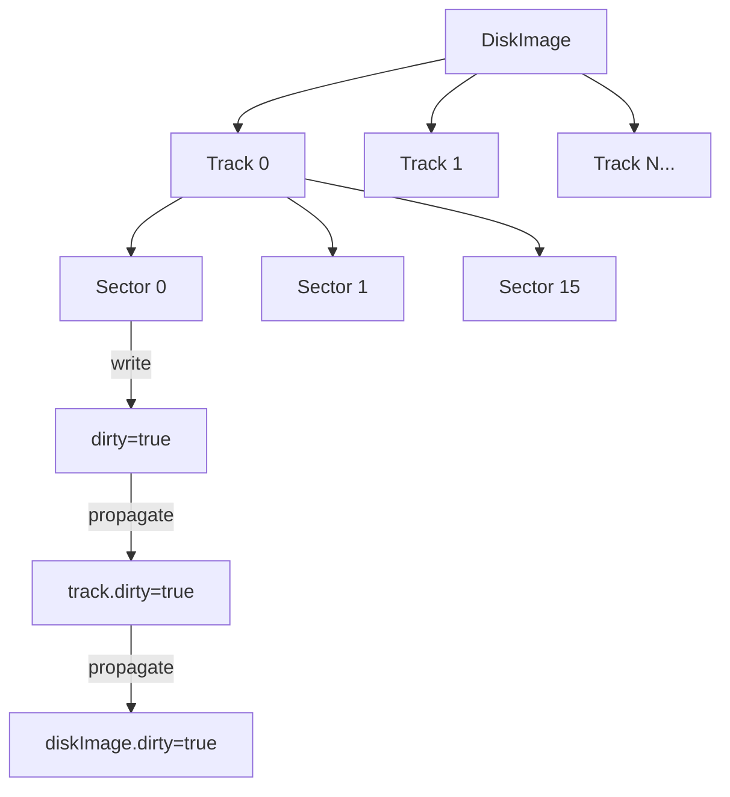

# Disk Image Change Tracking & Save Implementation

## 1. Overview

This document describes the design for:
1. **Change Tracking** - Multi-level dirty flag propagation (sector → track → disk image)
2. **TRD Save** - Saving disk images to TRD format via LoaderTRD
3. **SCL Save** - Saving disk images to SCL format via LoaderSCL

## 2. Requirements

### 2.1 Change Tracking
- Track modifications at sector data level
- Track modifications at raw track level (for WRITE_TRACK operations)
- Propagate dirty state upward: sector → track → disk image
- Provide query methods at all levels: `isDirty()`
- Support clearing dirty state after successful save

### 2.2 Save Functionality  
- Save must be performed via loader classes (LoaderTRD, LoaderSCL)
- Support "Save" to original path and "Save As" to new path
- Validate data integrity before/after save
- Clear dirty flags after successful save

## 3. Architecture

### 3.1 Change Tracking Hierarchy



### 3.2 Dirty Flag Locations

| Level | Structure | Flag | Trigger |
|-------|-----------|------|---------|
| Sector | `RawSectorBytes` | `_dirty` | Any data[] modification |
| Track | `Track` | `_dirty` | Any sector dirty OR raw track write |
| Image | `DiskImage` | `_dirty` | Any track dirty |

### 3.3 Public Accessors

| Class | Method | Access | Purpose |
|-------|--------|--------|---------|
| `RawSectorBytes` | `isDirty()` | public | Query dirty state |
| `RawSectorBytes` | `markClean()` | public | Clear after save |
| `RawSectorBytes` | `setData()` | public | Write accessor (auto-marks dirty) |
| `Track` | `isDirty()` | public | Query dirty state |
| `Track` | `isRawTrackDirty()` | public | Query raw MFM write state |
| `Track` | `hasAnySectorDirty()` | public | Scan sectors for dirty |
| `Track` | `markClean()` | public | Clear after save |
| `DiskImage` | `isDirty()` | public | Query dirty state |
| `DiskImage` | `computeDirtyState()` | public | Recompute from all tracks |
| `DiskImage` | `markClean()` | public | Clear after save |

### 3.4 Protected Methods (Auto-Detection)

`markDirty()` is **protected** at all levels - exposed via CUT wrappers for testing only.

| Class | Method | Access | Trigger |
|-------|--------|--------|---------|
| `RawSectorBytes` | `markDirty()` | protected | Called by `setData()`, `recalculateDataCRC()` |
| `Track` | `markDirty()` | protected | Called by sector write accessors |
| `Track` | `markRawTrackDirty()` | protected | Called by WD1793 WRITE_TRACK |
| `DiskImage` | `markDirty()` | protected | Called by Track dirty propagation |

## 4. Detailed Design

### 4.1 RawSectorBytes Changes

```cpp
struct RawSectorBytes
{
    // Existing fields...
    uint8_t data[256] = {};
    uint16_t data_crc = 0xFFFF;
    
    // Change tracking
protected:
    bool _dirty = false;
    void markDirty() { _dirty = true; }  // Protected - only via write accessors
    
public:
    bool isDirty() const { return _dirty; }
    void markClean() { _dirty = false; }
    
    // Write accessor - auto-marks dirty only if content actually changes
    void setData(const uint8_t* src, size_t len)
    {
        if (len > sizeof(data)) len = sizeof(data);
        
        // Only mark dirty if content actually changed
        if (std::memcmp(data, src, len) != 0)
        {
            std::memcpy(data, src, len);
            markDirty();
            // Auto-propagate to track
            if (_track) _track->markDirty();
        }
    }
};
```

### 4.2 Track Changes

```cpp
struct Track : public FullTrack
{
    // Existing fields...
    
    // Change tracking
protected:
    bool _dirty = false;
    bool _rawTrackDirty = false;  // For WRITE_TRACK operations
    
    // Protected - called by write accessors and WD1793 only
    void markDirty() 
    { 
        _dirty = true;
        if (_diskImage) _diskImage->markDirty();
    }
    
    void markRawTrackDirty()  // Called by WD1793 WRITE_TRACK handler
    {
        _rawTrackDirty = true;
        _dirty = true;
        if (_diskImage) _diskImage->markDirty();
    }
    
    // Grant WD1793 friend access for WRITE_TRACK
    friend class WD1793;

public:
    void markClean()
    {
        _dirty = false;
        _rawTrackDirty = false;
        // Also clear all sector dirty flags
        for (auto& sector : sectors)
        {
            sector.markClean();
        }
    }
    
    // Convenience: Check if any sector is dirty
    bool hasAnySectorDirty() const
    {
        for (const auto& sector : sectors)
        {
            if (sector.isDirty()) return true;
        }
        return false;
    }
};
```

### 4.3 DiskImage Changes

```cpp
class DiskImage
{
    // Existing fields...
    bool _loaded = false;
    std::vector<Track> _tracks;
    
    // Change tracking
protected:
    bool _dirty = false;
    void markDirty() { _dirty = true; }  // Protected - called by Track
    
    // Grant Track friend access for dirty propagation
    friend struct Track;
    
public:
    bool isDirty() const { return _dirty; }
    
    void markClean()
    {
        _dirty = false;
        for (Track& track : _tracks)
        {
            track.markClean();
        }
    }
    
    // Convenience: Recompute dirty from all tracks
    bool computeDirtyState() const
    {
        for (const Track& track : _tracks)
        {
            if (track.isDirty()) return true;
        }
        return false;
    }
};
```

### 4.4 LoaderTRD::writeImage() Enhancement

Current implementation (L61-90) writes all sectors sequentially. Enhancements:

```cpp
bool LoaderTRD::writeImage()
{
    return writeImage(_filepath);  // Delegate to new overload
}

bool LoaderTRD::writeImage(const std::string& path)
{
    bool result = false;

    if (_diskImage && _diskImage->isDirty())  // Only save if dirty
    {
        FILE* file = FileHelper::OpenFile(path, "wb");
        if (file)
        {
            size_t trackCount = _diskImage->getCylinders() * _diskImage->getSides();
            for (size_t tracks = 0; tracks < trackCount; tracks++)
            {
                DiskImage::Track* track = _diskImage->getTrack(tracks);
                for (size_t sectors = 0; sectors < TRD_SECTORS_PER_TRACK; sectors++)
                {
                    uint8_t* sectorData = track->getDataForSector(sectors);
                    FileHelper::SaveBufferToFile(file, sectorData, TRD_SECTORS_SIZE_BYTES);
                }
            }
            
            FileHelper::CloseFile(file);
            
            // Clear dirty flags after successful save
            _diskImage->markClean();
            result = true;
        }
    }

    return result;
}

bool LoaderTRD::writeImageForce()
{
    // Force write even if not dirty (for "Save As" operations)
    // ... same logic but without isDirty() check
}
```

### 4.5 LoaderSCL::writeImage() Implementation

SCL format structure:
- Header: 8 bytes "SINCLAIR" + 1 byte file count
- File descriptors: N × 14 bytes (TRDOSDirectoryEntryBase)
- File data: concatenated sector data
- CRC: 4 bytes (sum of all preceding bytes)

```cpp
bool LoaderSCL::writeImage()
{
    return writeImage(_filepath);
}

bool LoaderSCL::writeImage(const std::string& path)
{
    bool result = false;
    
    if (!_diskImage) return false;
    
    // 1. Read TR-DOS catalog from track 0
    DiskImage::Track* track = _diskImage->getTrack(0);
    DiskImage::RawSectorBytes* systemSector = track->getSector(TRD_VOLUME_SECTOR);
    TRDVolumeInfo* volumeInfo = (TRDVolumeInfo*)systemSector->data;
    
    if (!volumeInfo || volumeInfo->fileCount == 0)
        return false;  // Empty disk or invalid
    
    // 2. Calculate total size
    size_t headerSize = 9;  // SINCLAIR + file count
    size_t catalogSize = volumeInfo->fileCount * sizeof(TRDOSDirectoryEntryBase);
    size_t dataSize = 0;
    
    // Scan catalog to calculate data size
    std::vector<TRDOSDirectoryEntry*> entries;
    for (uint8_t i = 0; i < volumeInfo->fileCount; i++)
    {
        uint16_t offset = i * sizeof(TRDOSDirectoryEntry);
        uint8_t sectorNo = offset / TRD_SECTORS_SIZE_BYTES;
        DiskImage::RawSectorBytes* dirSector = track->getRawSector(sectorNo);
        TRDOSDirectoryEntry* entry = (TRDOSDirectoryEntry*)(dirSector->data + (offset & 0xFF));
        entries.push_back(entry);
        dataSize += entry->SizeInSectors * TRD_SECTORS_SIZE_BYTES;
    }
    
    // 3. Allocate and populate buffer
    size_t totalSize = headerSize + catalogSize + dataSize + 4;  // +4 for CRC
    std::vector<uint8_t> buffer(totalSize);
    uint8_t* ptr = buffer.data();
    
    // Header
    std::memcpy(ptr, "SINCLAIR", 8);
    ptr[8] = volumeInfo->fileCount;
    ptr += 9;
    
    // File descriptors (14 bytes each - without sector/track)
    for (auto* entry : entries)
    {
        std::memcpy(ptr, entry, sizeof(TRDOSDirectoryEntryBase));
        ptr += sizeof(TRDOSDirectoryEntryBase);
    }
    
    // File data
    for (auto* entry : entries)
    {
        uint16_t sectorLocator = entry->StartTrack * TRD_SECTORS_PER_TRACK + entry->StartSector;
        for (uint8_t s = 0; s < entry->SizeInSectors; s++, sectorLocator++)
        {
            uint8_t trackNo = sectorLocator / TRD_SECTORS_PER_TRACK;
            uint8_t sectorNo = sectorLocator % TRD_SECTORS_PER_TRACK;
            DiskImage::Track* dataTrack = _diskImage->getTrack(trackNo);
            DiskImage::RawSectorBytes* dataSector = dataTrack->getSector(sectorNo);
            std::memcpy(ptr, dataSector->data, TRD_SECTORS_SIZE_BYTES);
            ptr += TRD_SECTORS_SIZE_BYTES;
        }
    }
    
    // Calculate and append CRC (sum of all bytes except last 4)
    uint32_t crc = 0;
    for (size_t i = 0; i < totalSize - 4; i++)
    {
        crc += buffer[i];
    }
    std::memcpy(ptr, &crc, 4);
    
    // 4. Write to file
    result = FileHelper::SaveBufferToFile(path, buffer.data(), totalSize);
    
    if (result)
    {
        _diskImage->markClean();
    }
    
    return result;
}
```

## 5. Testing Strategy

### 5.1 Unit Tests - Change Tracking

**File**: `core/tests/emulator/io/fdc/diskimage_test.cpp`

```cpp
// Test sector dirty via write accessor
TEST_F(DiskImage_Test, SectorDirtyViaSetData)
{
    DiskImage disk(1, 1);
    Track* track = disk.getTrack(0);
    RawSectorBytes* sector = track->getRawSector(0);
    
    EXPECT_FALSE(sector->isDirty());
    
    // Write via accessor - auto-marks dirty
    uint8_t testData[256] = {0xAA};
    sector->setData(testData, sizeof(testData));
    
    EXPECT_TRUE(sector->isDirty());
    sector->markClean();
    EXPECT_FALSE(sector->isDirty());
}

// Test dirty propagation via write accessors
TEST_F(DiskImage_Test, DirtyPropagation)
{
    DiskImage disk(80, 2);
    Track* track = disk.getTrack(42);
    
    EXPECT_FALSE(disk.isDirty());
    EXPECT_FALSE(track->isDirty());
    
    // Modify sector via write accessor - should auto-propagate
    uint8_t testData[256] = {0xBB};
    track->getRawSector(5)->setData(testData, sizeof(testData));
    
    EXPECT_TRUE(track->isDirty());
    EXPECT_TRUE(disk.isDirty());
    
    // Clear
    disk.markClean();
    EXPECT_FALSE(track->isDirty());
    EXPECT_FALSE(disk.isDirty());
}
```

### 5.2 Unit Tests - TRD Save

**File**: `core/tests/loaders/loader_trd_test.cpp`

```cpp
// Round-trip test: load → modify → save → reload → verify
TEST_F(LoaderTRD_Test, SaveAndReload)
{
    std::string srcPath = getTestDataPath("wd1793/test.trd");
    std::string dstPath = getTempPath("test_saved.trd");
    
    // Load
    LoaderTRD loader(_context, srcPath);
    ASSERT_TRUE(loader.loadImage());
    DiskImage* disk = loader.getImage();
    
    // Modify via write accessor - auto-marks dirty
    Track* track = disk->getTrack(1);
    uint8_t modifiedData[256];
    std::memcpy(modifiedData, track->getDataForSector(1), 256);
    modifiedData[0] = 0xAA;
    track->getRawSector(0)->setData(modifiedData, 256);
    
    // Save
    LoaderTRD saver(_context, dstPath);
    saver.setImage(disk);
    ASSERT_TRUE(saver.writeImage());
    EXPECT_FALSE(disk->isDirty());  // Cleared after save
    
    // Reload and verify
    LoaderTRD reloader(_context, dstPath);
    ASSERT_TRUE(reloader.loadImage());
    DiskImage* reloaded = reloader.getImage();
    
    uint8_t* reloadedData = reloaded->getTrack(1)->getDataForSector(1);
    EXPECT_EQ(reloadedData[0], 0xAA);
    
    // Cleanup
    std::remove(dstPath.c_str());
}
```

### 5.3 Unit Tests - SCL Save

**File**: `core/tests/loaders/loader_scl_test.cpp`

```cpp
// Test SCL save with verification
TEST_F(LoaderSCL_Test, saveAndReload)
{
    std::string srcPath = getTestDataPath("scl/test.scl");
    std::string dstPath = getTempPath("test_saved.scl");
    
    // Load original
    LoaderSCL loader(_context, srcPath);
    ASSERT_TRUE(loader.loadImage());
    DiskImage* disk = loader.getImage();
    
    // Save to SCL
    LoaderSCL saver(_context, dstPath);
    saver.setImage(disk);
    ASSERT_TRUE(saver.writeImage());
    
    // Reload and compare
    LoaderSCL reloader(_context, dstPath);
    ASSERT_TRUE(reloader.loadImage());
    DiskImage* reloaded = reloader.getImage();
    
    // Compare file count and content hashes
    // ... detailed comparison
    
    std::remove(dstPath.c_str());
}

// Test SCL CRC calculation
TEST_F(LoaderSCL_Test, crcCalculation)
{
    // Verify CRC matches reference implementation
}
```

## 5. Unreal-Qt UI Integration

### 5.1 Menu Structure

Add disk save options to the File menu in `MenuManager`:

```
File
├── Open...                 (existing)
├── Open Snapshot...        (existing)
├── Open Tape...            (existing)
├── Open Disk...            (existing)
├── ─────────────           (separator)
├── Save Snapshot ▶         (existing submenu)
│   ├── Save as SNA...
│   └── Save as Z80...
├── Save Disk ▶             (NEW submenu)
│   ├── Save Disk           (Ctrl+D) - Save to original path (TRD only)
│   ├── Save Disk as TRD... (Ctrl+Shift+D)
│   └── Save Disk as SCL...
├── ─────────────           (separator)
└── Exit
```

### 5.2 MenuManager Changes

```cpp
// menumanager.h - Add new members
class MenuManager : public QObject, public Observer
{
signals:
    // NEW disk save signals
    void saveDiskRequested();       // Save to original path
    void saveDiskAsTRDRequested();  // Save As TRD
    void saveDiskAsSCLRequested();  // Save As SCL

private:
    // NEW: Disk save menu and actions
    QMenu* _saveDiskMenu;
    QAction* _saveDiskAction;       // Save (Ctrl+D)
    QAction* _saveDiskTRDAction;    // Save as TRD (Ctrl+Shift+D)
    QAction* _saveDiskSCLAction;    // Save as SCL
};
```

### 5.3 MainWindow Changes

```cpp
// mainwindow.h - Add new slots
private slots:
    void saveDiskDialog();          // Save to original path
    void saveDiskAsTRDDialog();     // Save as TRD with file dialog
    void saveDiskAsSCLDialog();     // Save as SCL with file dialog

// mainwindow.cpp - Connect signals
connect(_menuManager, &MenuManager::saveDiskRequested, this, &MainWindow::saveDiskDialog);
connect(_menuManager, &MenuManager::saveDiskAsTRDRequested, this, &MainWindow::saveDiskAsTRDDialog);
connect(_menuManager, &MenuManager::saveDiskAsSCLRequested, this, &MainWindow::saveDiskAsSCLDialog);

// Implementation
void MainWindow::saveDiskDialog()
{
    if (!_emulator) return;
    
    // Get FDC from emulator
    auto fdc = _emulator->get...;  // Access WD1793/FDC
    DiskImage* disk = fdc->getDiskImage(drive);
    
    if (disk && disk->isDirty())
    {
        // Save to original path
        LoaderTRD loader(_emulator->context(), disk->getFilePath());
        loader.setImage(disk);
        if (loader.writeImage())
        {
            // Show success status
        }
    }
}

void MainWindow::saveDiskAsTRDDialog()
{
    QString path = QFileDialog::getSaveFileName(
        this,
        tr("Save Disk Image as TRD"),
        _lastSaveDirectory,
        tr("TRD Files (*.trd);;All Files (*)")
    );
    
    if (!path.isEmpty())
    {
        // Similar logic with new path
    }
}

void MainWindow::saveDiskAsSCLDialog()
{
    // Similar to TRD but uses LoaderSCL
}
```

### 5.4 Menu State Management

Enable/disable disk save actions based on:
- Emulator state (running with disk loaded)
- Disk dirty state
- Original file format (Save only works for TRD source files)

```cpp
void MenuManager::updateMenuStates(std::shared_ptr<Emulator> activeEmulator)
{
    // ... existing code ...
    
    // Disk save state
    bool hasDiskLoaded = false;
    bool diskIsDirty = false;
    bool canSaveToOriginal = false;
    
    if (activeEmulator)
    {
        // Check if disk is loaded and dirty
        // hasDiskLoaded = ...;
        // diskIsDirty = disk->isDirty();
        // canSaveToOriginal = originalFormat is TRD;
    }
    
    _saveDiskAction->setEnabled(hasDiskLoaded && diskIsDirty && canSaveToOriginal);
    _saveDiskTRDAction->setEnabled(hasDiskLoaded);
    _saveDiskSCLAction->setEnabled(hasDiskLoaded);
}
```

## 6. Files to Modify

| File | Changes |
|------|---------|
| `core/src/emulator/io/fdc/diskimage.h` | Add dirty flags to RawSectorBytes, Track, DiskImage |
| `core/src/emulator/io/fdc/diskimage.cpp` | Add markClean() implementations |
| `core/src/loaders/disk/loader_trd.h` | Add writeImage(path) overload, setImage() |
| `core/src/loaders/disk/loader_trd.cpp` | Enhance writeImage(), add dirty-aware save |
| `core/src/loaders/disk/loader_scl.h` | Add writeImage(path) overload, setImage() |
| `core/src/loaders/disk/loader_scl.cpp` | Implement writeImage() fully |
| `unreal-qt/src/menumanager.h` | Add saveDiskMenu, saveDisk actions, signals |
| `unreal-qt/src/menumanager.cpp` | Create Save Disk submenu, connect actions |
| `unreal-qt/src/mainwindow.h` | Add saveDisk* slots |
| `unreal-qt/src/mainwindow.cpp` | Implement save disk dialogs, connect signals |
| `core/tests/emulator/io/fdc/diskimage_test.cpp` | Add dirty tracking tests |
| `core/tests/loaders/loader_trd_test.cpp` | Add save/reload tests |
| `core/tests/loaders/loader_scl_test.cpp` | Add save/reload tests |

## 7. Verification Plan

### 7.1 Automated Tests
```bash
# Run all core tests
cd /Volumes/TB4-4Tb/Projects/Test/unreal-ng
cmake --build cmake-build-debug --target core-tests
./cmake-build-debug/unreal-qt/tests/core-tests --gtest_filter="*DiskImage*:*LoaderTRD*:*LoaderSCL*"
```

### 7.2 Manual Verification
1. Load a TRD file in unreal-qt
2. Modify disk contents (copy file, delete file)
3. Save disk image
4. Reload and verify changes persisted
5. Load same TRD → save as SCL → reload SCL → verify content matches

## 8. Design Decisions

| Decision | Resolution |
|----------|------------|
| Track raw MFM writes separately? | **Yes** - `isRawTrackDirty()` separate from `isDirty()` for MFM layout changes |
| Auto-propagation | **Yes** - Based on content change detection (`memcmp`), not just write call |
| Save overwrite protection | **UI: Yes** - Prompt before overwrite. **Automation: Optional param** (like snapshots) |
