# Speed Trace Feature — Comprehensive Documentation

**Feature**: Speed Control Widget (Speed Trace)
**Initial Spec**: 2026-02-07
**Implemented**: 2026-02-23
**Status**: Implemented
**Component**: `unreal-qt/src/debugger/widgets/speedcontrolwidget.h/.cpp` + `core/src/emulator/emulator.cpp`

---

## Table of Contents

- [Overview](#overview)
- [Visual Design](#visual-design)
- [Controls](#controls)
- [Speed Presets](#speed-presets)
- [Architecture](#architecture)
- [Execution Methods](#execution-methods)
- [Widget Integration](#widget-integration)
- [Execution State Machine](#execution-state-machine)
- [Preset System](#preset-system)
- [Timer-Based Auto-Stepping](#timer-based-auto-stepping)
- [Integration with Breakpoints](#integration-with-breakpoints)
- [Visual Styling](#visual-styling)
- [Testing](#testing)
- [Performance Characteristics](#performance-characteristics)
- [Future Enhancements](#future-enhancements)
- [Files](#files)
- [References](#references)

---

## Overview

The Speed Trace feature provides an audio player-style step granularity control integrated into the unreal-qt debugger toolbar window. It allows the user to control Z80 emulation execution speed from full-speed (1×) down to single CPU opcodes, with all timing adapted dynamically to the active emulator model's frame parameters.

**Key Capabilities:**

| Capability | Description |
|---|---|
| **Per-Frame Stepping** | Execute complete video frames (`config.frame` t-states) |
| **Per-Line Stepping** | Execute N scanlines with drift-free anchor tracking |
| **Per-Opcode Stepping** | Execute N CPU cycles (typically 1 instruction per cycle) |
| **Per-T-State Stepping** | Execute exact N t-states (1 T = 2 ULA pixels) |
| **Auto-Stepping** | Timer-based automatic stepping at configurable intervals (1–5000 ms) |
| **Dynamic Model Adaptation** | All T-state calculations read from `CONFIG` at runtime, not hardcoded |

---

## Visual Design

### Mockups

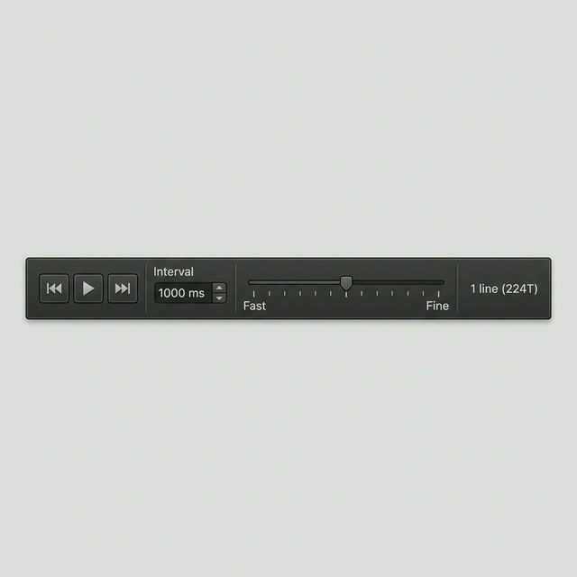

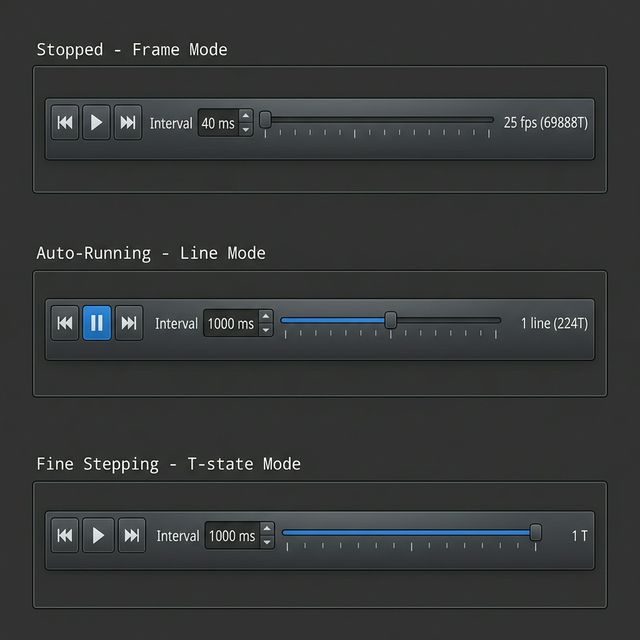

### Widget Layout

```
┌─────────────────────────────────────────────────────────────────────────────┐
│ Speed Control                                                               │
├─────────────────────────────────────────────────────────────────────────────┤
│  ⏮  ▶  ⏭  │  Interval: [1000] ms  │  Fast ─●────────── Fine  │  1 line     |
│            │                       │        │ │ │ │ │ │ │      │  (224T)    │
└─────────────────────────────────────────────────────────────────────────────┘
    │  │  │            │                         │                      │
    │  │  │      Spinbox (1..5000)           Slider 0–8            Preset details
    │  │  │                                 + tick marks           (label + T-count)
    │  │  └── Step Forward (⏭)
    │  └────── Play/Pause (▶/⏸)
    └───────── Step Back (⏮) [hidden, wired but not visible]
```

---

## Controls

| Element | Icon | Function |
|---|---|---|
| **Step Back** | ⏮ | Move slider one position left (coarser granularity). Currently hidden (`setVisible(false)`) but wired and functional. |
| **Play/Pause** | ▶ / ⏸ | Start/stop auto-run timer. Toggles between play and pause icons. For FullSpeed preset, resumes emulator directly. |
| **Step Forward** | ⏭ | Execute one step at current granularity (single-shot, no timer). |
| **Interval** | *spinbox* | Adjustable auto-run timer interval (1–5000 ms, default 1000 ms). Only enabled for presets with `fixedIntervalMs == 0`. |
| **Slider** | *0–8* | 9-position granularity selector with tick marks. Left = fast (full speed), Right = fine (1 opcode). |
| **Label** | *text* | Shows preset name + computed T-state count in monospace (e.g., `"1 line (224T)"`). |

---

## Speed Presets

All presets read frame timing dynamically from the `CONFIG` struct (defined in `core/src/emulator/platform.h`):

- `config.frame` (**F**) — total t-states per frame
- `config.t_line` (**L**) — t-states per scanline (including hblank)

### Implemented Presets (9 positions)

| Position | Label | StepType | Method Called | Interval | T-State Count | Example (48K) |
|----------|--------|-----------|---------------|-----------|---------------|---------------|
| 0 | 1× (50fps) | FullSpeed | `Resume()` | — (no timer) | Full speed | — |
| 1 | 25 fps | Frame | `RunFrame()` | 40 ms fixed | F | 69888 T/step |
| 2 | 5 fps | Frame | `RunFrame()` | 200 ms fixed | F | 69888 T/step |
| 3 | 1 fps | Frame | `RunFrame()` | 1000 ms fixed | F | 69888 T/step |
| 4 | 1 frame | Frame | `RunFrame()` | User spinbox | F | 69888 T |
| 5 | 100 lines | Scanlines | `RunNScanlines(100)` | User spinbox | L × 100 | 22400 T |
| 6 | 10 lines | Scanlines | `RunNScanlines(10)` | User spinbox | L × 10 | 2240 T |
| 7 | 1 line | Scanlines | `RunNScanlines(1)` | User spinbox | L | 224 T |
| 8 | 1 Op | Opcodes | `RunNCPUCycles(1)` | User spinbox | 4–23 T (varies) | ~4 T |

### Dynamic Model Adaptation

| Model | `config.frame` | `config.t_line` | 1 frame | 1 line | 100 lines |
|---|---|---|---|---|---|
| ZX Spectrum 48K | 69888 | 224 | 69888 T | 224 T | 22400 T |
| ZX Spectrum 128K | 70908 | 228 | 70908 T | 228 T | 22800 T |
| Pentagon | 71680 | 224 | 71680 T | 224 T | 22400 T |

> **Note (design evolution):** The original specification (2026-02-07) defined 13 presets (positions 0–12) that included fractional-line granularity (½ line, ¼ line, ⅛ line, 1/16 line) and a single T-state preset. The implementation simplified this to 9 presets — using `RunNScanlines()` for line-based stepping (with anti-drift anchor) and `RunNCPUCycles()` for opcode-level stepping. The sub-line presets are planned as [future enhancements](#future-enhancements).

---

## Architecture

### Design Principles

1. **No custom execution logic** — all stepping uses existing `Emulator` methods (`RunFrame()`, `RunNScanlines()`, `RunNCPUCycles()`, `RunTStates()`)
2. **Timer is orchestrator only** — `QTimer` triggers step calls at configurable intervals; it does not control emulation timing
3. **Dynamic adaptation** — preset T-state counts read from `CONFIG` at runtime, not hardcoded
4. **Non-intrusive integration** — existing debugger buttons (Continue, StepIn, StepOver, etc.) auto-stop the speed control

### Integration with Existing Controls

```
User clicks Continue → m_speedControl->stop() → Resume()
User clicks StepIn   → m_speedControl->stop() → RunSingleCPUCycle()
User clicks StepOver → m_speedControl->stop() → StepOver()
User clicks Pause    → m_speedControl->stop() → Pause()
Frame Step           → m_speedControl->stop() → RunFrame()
Breakpoint hit       → m_speedControl->stop() → updateState()
```

### System Overview

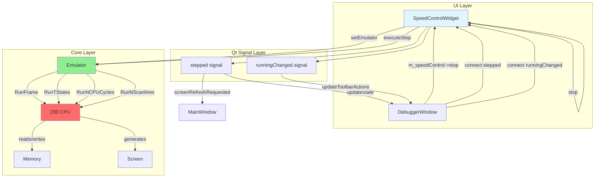

### Component Hierarchy

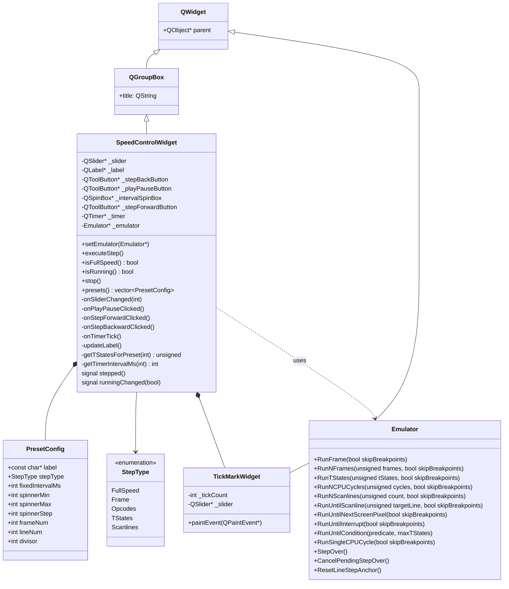

### Class Hierarchy (Text View)

```
QWidget
  └── QGroupBox
        └── SpeedControlWidget
              ├── QToolButton  _stepBackButton    (⏮) [hidden]
              ├── QToolButton  _playPauseButton   (▶/⏸)
              ├── QToolButton  _stepForwardButton (⏭)
              ├── QSpinBox     _intervalSpinBox   (1–5000 ms)
              ├── QSlider      _slider            (0–8)
              ├── TickMarkWidget                  (custom tick marks)
              ├── QLabel       _label             (preset name + T count)
              └── QTimer       _timer             (auto-run orchestrator)
```

---

## Execution Methods

All step methods in `Emulator` follow a common pattern:

1. `CancelPendingStepOver()` + reset tracking flags
2. Pause emulator if currently running
3. Set up INT interrupt timing from `CONFIG`
4. Execute Z80 instructions in a loop until condition is met
5. Handle frame boundaries (`AdjustFrameCounters` → `OnFrameEnd` → `OnFrameStart` → `ResetPrevTstate`)
6. Post `NC_EXECUTION_CPU_STEP` notification to debugger

### Per-Frame Stepping

**Method**: `Emulator::RunFrame(bool skipBreakpoints)`

**File**: `core/src/emulator/emulator.cpp:1295`

**Behavior**:
- Two-phase execution:
  1. Run until the frame counter increments (crosses frame boundary)
  2. Continue to persistent target position (`_frameStepTargetPos`) within the new frame
- Uses persistent target to prevent cumulative drift across repeated frame steps
- Handles INT interrupt timing to match Z80FrameCycle pattern
- Processes frame boundaries (`OnFrameEnd` → `OnFrameStart`)

**Flowchart**:
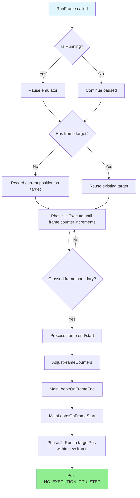

**Implementation** (simplified):
```cpp
void Emulator::RunFrame(bool skipBreakpoints)
{
    CancelPendingStepOver();
    ResetLineStepAnchor();

    // Pause if running — step commands always leave emulator paused
    if (IsRunning() && !IsPaused())
        Pause();

    const CONFIG& config = _context->config;
    Z80& z80 = *_core->GetZ80();
    EmulatorState& state = _context->emulatorState;

    // Use persistent target to prevent cumulative drift
    if (!_hasFrameStepTarget) {
        _frameStepTargetPos = z80.t % config.frame;
        _hasFrameStepTarget = true;
    }
    unsigned targetPos = _frameStepTargetPos;

    // INT interrupt timing — critical for HALT to resume
    unsigned int_start = config.intstart * state.current_z80_frequency_multiplier;
    unsigned int_end = (config.intstart + config.intlen) * state.current_z80_frequency_multiplier;
    uint32_t frameLimit = config.frame * state.current_z80_frequency_multiplier;
    bool int_occurred = false;

    if (int_end >= frameLimit) {
        int_end -= frameLimit;
        z80.int_pending = true;
        int_occurred = true;
    }

    // Phase 1: Execute until frame counter increments
    uint64_t startFrame = _context->emulatorState.frame_counter;
    while (_context->emulatorState.frame_counter == startFrame && !_stopRequested) {
        z80.ProcessInterrupts(int_occurred, int_start, int_end);
        z80.Z80Step(skipBreakpoints);
        z80.OnCPUStep();

        // Handle frame boundary
        if (z80.t >= frameLimit) {
            _core->AdjustFrameCounters();
            if (_mainloop) {
                _mainloop->OnFrameEnd();
                _mainloop->OnFrameStart();
            }
            _context->pScreen->ResetPrevTstate();
        }
    }

    // Phase 2: Continue to persistent target position within new frame
    // (omitted for brevity — runs to targetPos for drift-free alignment)

    // Notify debugger
    MessageCenter::DefaultMessageCenter().Post(NC_EXECUTION_CPU_STEP);
}
```

---

### Per-Line Stepping (Drift-Free)

**Method**: `Emulator::RunNScanlines(unsigned count, bool skipBreakpoints)`

**File**: `core/src/emulator/emulator.cpp:1579`

**Behavior**:
- Executes N complete scanlines from current position
- Uses **persistent anchor offset** to prevent horizontal drift
- Handles frame boundaries (scanlines can cross frame borders)
- Anti-drift strategy: captures initial horizontal offset on first call and reuses it for all subsequent calls

**Anti-Drift Strategy**:
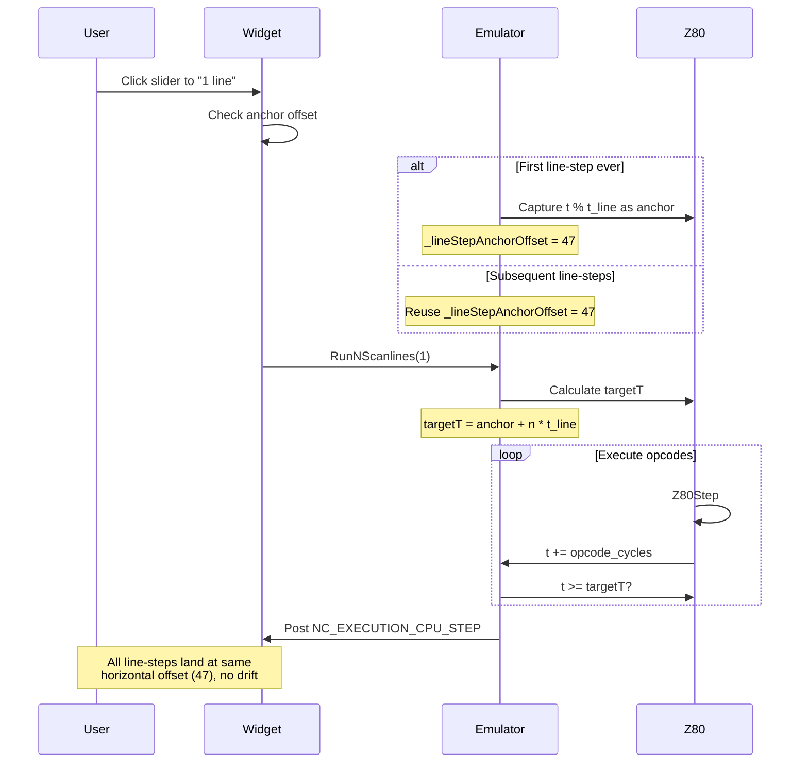

**The Problem**: Z80 instructions are 4–23 T-states wide, so each instruction overshoot its target by a variable amount. Without correction, repeated line-steps drift rightward across the scanline.

**The Solution**: On the first `RunNScanlines()` call, the method captures `z80.t % t_line` as a persistent anchor offset. All subsequent calls compute the target T-state as the nearest anchor-aligned position, ensuring every step lands at the same horizontal pixel.

**Implementation** (key anti-drift logic):
```cpp
void Emulator::RunNScanlines(unsigned count, bool skipBreakpoints)
{
    CancelPendingStepOver();
    _hasFrameStepTarget = false;

    if (IsRunning() && !IsPaused())
        Pause();

    const CONFIG& config = _context->config;
    Z80& z80 = *_core->GetZ80();
    EmulatorState& state = _context->emulatorState;

    const unsigned t_line = config.t_line;

    // ================================================================
    // Anti-drift strategy: persistent anchor offset within scanline
    // ================================================================
    if (_lineStepAnchorOffset < 0) {
        _lineStepAnchorOffset = static_cast<int>(z80.t % t_line);
    }

    const unsigned anchor = static_cast<unsigned>(_lineStepAnchorOffset);

    // Calculate ideal target (where we'd land with infinite resolution)
    unsigned idealT = z80.t + count * t_line;

    // Find two anchor-aligned positions that bracket idealT
    unsigned anchorBefore = (idealT / t_line) * t_line + anchor;
    if (anchorBefore > idealT)
        anchorBefore -= t_line;
    unsigned anchorAfter = anchorBefore + t_line;

    // Pick whichever anchor point is closest to ideal target
    unsigned targetT;
    if (idealT - anchorBefore <= anchorAfter - idealT)
        targetT = anchorBefore;
    else
        targetT = anchorAfter;

    // Safety: target must advance past current position
    if (targetT <= z80.t)
        targetT += t_line;

    // Execute until targetT reached
    while (z80.t < targetT && !_stopRequested) {
        z80.ProcessInterrupts(int_occurred, int_start, int_end);
        z80.Z80Step(skipBreakpoints);
        z80.OnCPUStep();

        // Handle frame boundary (scanlines can cross frames)
        if (z80.t >= frameLimit) {
            _core->AdjustFrameCounters();
            _context->pScreen->ResetPrevTstate();
            if (targetT >= frameLimit)
                targetT -= frameLimit;
        }
    }

    MessageCenter::DefaultMessageCenter().Post(NC_EXECUTION_CPU_STEP);
    MessageCenter::DefaultMessageCenter().Post(NC_SCANLINE_BOUNDARY);
}
```

**Anchor Reset**: The anchor is reset (`_lineStepAnchorOffset = -1`) whenever the user switches to a non-scanline stepping mode (e.g., `RunFrame()`, `RunNCPUCycles()`, `RunTStates()`), so a new anchor is established on the next scanline step.

---

### Per-Opcode Stepping

**Method**: `Emulator::RunNCPUCycles(unsigned cycles, bool skipBreakpoints)`

**File**: `core/src/emulator/emulator.cpp:1244`

**Behavior**:
- Executes exactly N CPU cycles (opcodes)
- Each cycle = one `Z80Step()` call = one complete Z80 instruction
- Handles frame boundaries (cycles can span multiple frames)
- Updates frame counters when crossing frame limits
- Resets both frame-step target and line-step anchor

**Implementation**:
```cpp
void Emulator::RunNCPUCycles(unsigned cycles, bool skipBreakpoints)
{
    CancelPendingStepOver();
    _hasFrameStepTarget = false;
    ResetLineStepAnchor();

    if (IsRunning() && !IsPaused())
        Pause();

    const CONFIG& config = _context->config;
    Z80& z80 = *_core->GetZ80();
    EmulatorState& state = _context->emulatorState;

    unsigned int_start = config.intstart * state.current_z80_frequency_multiplier;
    unsigned int_end = (config.intstart + config.intlen) * state.current_z80_frequency_multiplier;
    uint32_t frameLimit = config.frame * state.current_z80_frequency_multiplier;
    bool int_occurred = false;

    if (int_end >= frameLimit) {
        int_end -= frameLimit;
        z80.int_pending = true;
        int_occurred = true;
    }

    // Execute exactly N cycles
    for (unsigned i = 0; i < cycles && !_stopRequested; i++) {
        z80.ProcessInterrupts(int_occurred, int_start, int_end);
        z80.Z80Step(skipBreakpoints);
        z80.OnCPUStep();

        // Handle frame boundary
        if (z80.t >= frameLimit) {
            _core->AdjustFrameCounters();
            if (_mainloop) {
                _mainloop->OnFrameEnd();
                _mainloop->OnFrameStart();
            }
            _context->pScreen->ResetPrevTstate();
        }
    }

    MessageCenter::DefaultMessageCenter().Post(NC_EXECUTION_CPU_STEP);
}
```

---

### Per-T-State Stepping

**Method**: `Emulator::RunTStates(unsigned tStates, bool skipBreakpoints)`

**File**: `core/src/emulator/emulator.cpp:1461`

**Behavior**:
- Executes until at least N t-states have elapsed (1 T = 2 ULA pixels)
- Most fine-grained stepping available (though not currently exposed via a preset)
- Since Z80 instructions are 4+ T-states, actual execution always overshoots the target by 0–19 T
- Handles frame boundaries — target T wraps when crossing frame limit

**Implementation**:
```cpp
void Emulator::RunTStates(unsigned tStates, bool skipBreakpoints)
{
    CancelPendingStepOver();
    _hasFrameStepTarget = false;
    ResetLineStepAnchor();

    if (IsRunning() && !IsPaused())
        Pause();

    const CONFIG& config = _context->config;
    Z80& z80 = *_core->GetZ80();
    EmulatorState& state = _context->emulatorState;

    unsigned int_start = config.intstart * state.current_z80_frequency_multiplier;
    unsigned int_end = (config.intstart + config.intlen) * state.current_z80_frequency_multiplier;
    uint32_t frameLimit = config.frame * state.current_z80_frequency_multiplier;
    bool int_occurred = false;

    if (int_end >= frameLimit) {
        int_end -= frameLimit;
        z80.int_pending = true;
        int_occurred = true;
    }

    unsigned targetT = z80.t + tStates;

    while (z80.t < targetT && !_stopRequested) {
        z80.ProcessInterrupts(int_occurred, int_start, int_end);
        z80.Z80Step(skipBreakpoints);
        z80.OnCPUStep();

        // Handle frame boundary
        if (z80.t >= frameLimit) {
            _core->AdjustFrameCounters();
            if (_mainloop) {
                _mainloop->OnFrameEnd();
                _mainloop->OnFrameStart();
            }
            _context->pScreen->ResetPrevTstate();

            // targetT wraps with frame counter adjustment
            if (targetT >= frameLimit)
                targetT -= frameLimit;
        }
    }

    MessageCenter::DefaultMessageCenter().Post(NC_EXECUTION_CPU_STEP);
}
```

---

### Additional Execution Methods

The `Emulator` class provides several other stepping methods not directly used by the speed control widget but available in the debugger:

| Method | File / Line | Description |
|---|---|---|
| `RunSingleCPUCycle(bool)` | `emulator.cpp:1196` | Execute one Z80 instruction. Used by StepIn. |
| `RunNFrames(unsigned, bool)` | `emulator.cpp:1411` | Execute N complete frames (t-state based). |
| `RunUntilScanline(unsigned, bool)` | `emulator.cpp:1517` | Run to a specific scanline number. If past it, completes frame first. |
| `RunUntilNextScreenPixel(bool)` | `emulator.cpp:1666` | Run to `pScreen->GetPaperStartTstate()`, wrapping frame if needed. |
| `RunUntilInterrupt(bool)` | `emulator.cpp:1745` | Run until Z80 accepts INT (`iff1=1`, `int_pending=true`), with 2-frame safety limit. Uses inline INT generation. |
| `RunUntilCondition(predicate, maxTStates)` | `emulator.cpp` | Run until arbitrary predicate on `Z80State` becomes true. |
| `StepOver()` | `emulator.cpp` | Step over CALL/RST instructions. |

---

## Widget Integration

### Signal Flow

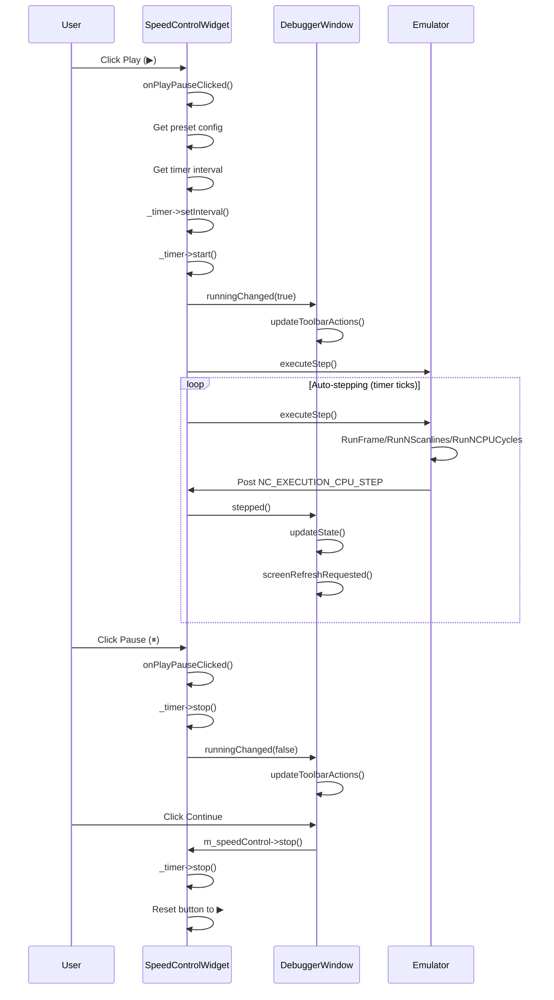

### Integration with DebuggerWindow

**File**: `unreal-qt/src/debugger/debuggerwindow.cpp`

**Construction** (layout insertion):
```cpp
// Speed control widget — inserted below toolbar
m_speedControl = new SpeedControlWidget(this);
m_speedControl->setEmulator(_emulator);
m_speedControl->setSizePolicy(QSizePolicy::Preferred, QSizePolicy::Fixed);

auto* speedRow = new QHBoxLayout();
speedRow->setContentsMargins(0, 0, 0, 0);
speedRow->addWidget(m_speedControl, 1);  // 50% stretch
speedRow->addStretch(1);                 // 50% spacer
ui->verticalLayout_2->insertLayout(1, speedRow);
```

**Signal connections:**
```cpp
// Signal: stepped — emitted after each step
connect(m_speedControl, &SpeedControlWidget::stepped, this, [this]() {
    updateState();
    emit screenRefreshRequested();
});

// Signal: runningChanged — emitted when auto-stepping starts/stops
connect(m_speedControl, &SpeedControlWidget::runningChanged, this, [this](bool running) {
    _speedControlActive = running;  // Track synchronously

    if (running) {
        // Speed widget is auto-stepping: disable Continue/Step, enable Pause
        updateToolbarActions(false, true, false, true, true, true);
    } else {
        // Speed widget stopped: enable Continue/Step, disable Pause
        updateToolbarActions(true, false, true, true, true, true);
    }
});
```

**Emulator propagation** — `m_speedControl->setEmulator()` is called in `onBindingBound()`, `onBindingUnbound()`, and `setBinding()` to keep the widget synchronized with the active emulator instance.

### Manual Actions Stop Speed Control

Any manual debugger action automatically stops the speed control timer to prevent conflicting execution:

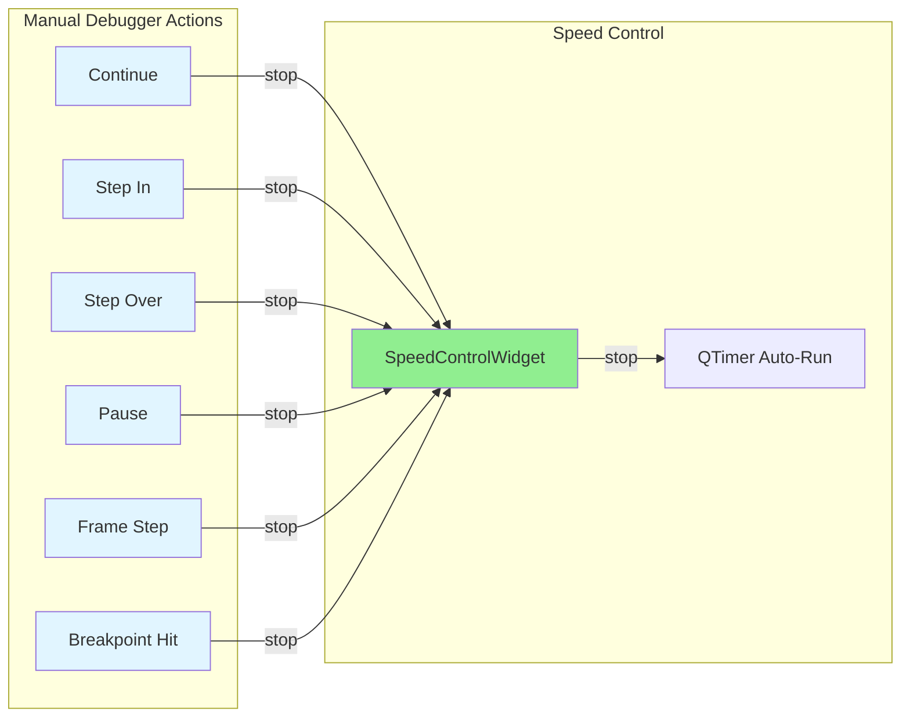

**Call sites** in `debuggerwindow.cpp`:

| Method | Line | Trigger |
|---|---|---|
| `handleBreakpointHitMessage()` | ~887 | Breakpoint hit notification |
| `continueExecution()` | ~923 | User clicks Continue |
| `pauseExecution()` | ~946 | User clicks Pause |
| `stepIn()` | ~969 | User clicks Step In |
| `stepOver()` | ~989 | User clicks Step Over |
| `frameStep()` | ~1077 | User clicks Frame Step |

**Implementation examples:**
```cpp
void DebuggerWindow::continueExecution()
{
    _breakpointTriggered = false;

    // Stop speed control auto-run when user manually continues
    if (m_speedControl)
        m_speedControl->stop();

    if (_emulator && _emulator->IsPaused()) {
        _emulator->Resume();
        updateToolbarActions(false, true, false, true, true, true);
        updateState();
    }
}

void DebuggerWindow::stepIn()
{
    _breakpointTriggered = false;

    // Stop speed control auto-run when user manually steps
    if (m_speedControl)
        m_speedControl->stop();

    if (_emulator) {
        bool skipBreakpoints = true;
        _emulator->RunSingleCPUCycle(skipBreakpoints);
        updateState();
    }
}

void DebuggerWindow::frameStep()
{
    _breakpointTriggered = false;

    // Stop speed control auto-run when user manually frame-steps
    if (m_speedControl)
        m_speedControl->stop();

    if (_emulator) {
        bool skipBreakpoints = true;
        _emulator->RunFrame(skipBreakpoints);
        updateState();
    }
}
```

---

## Execution State Machine

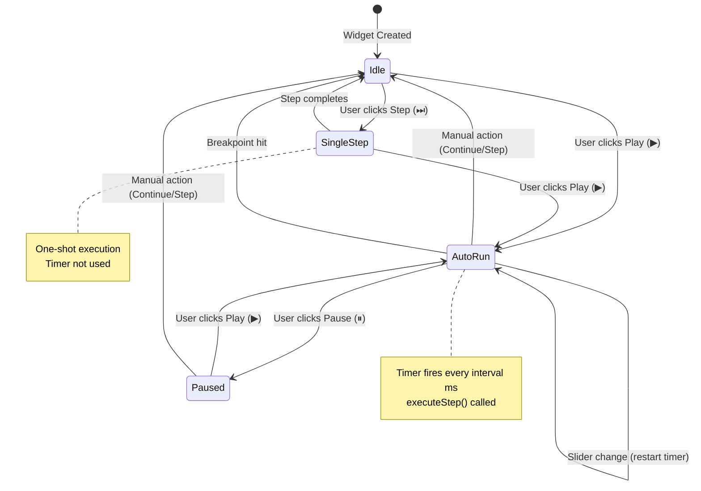

---

## Preset System

### PresetConfig Structure

Defined in `unreal-qt/src/debugger/widgets/speedcontrolwidget.h`:

```cpp
struct PresetConfig
{
    const char* label;       // Display label (e.g., "1 line")
    StepType stepType;       // How to execute
    int fixedIntervalMs;     // -1 = no timer, 0 = use spinner, >0 = fixed interval
    int spinnerMin;          // Spinner minimum (ms), 0 = disabled
    int spinnerMax;          // Spinner maximum (ms), 0 = disabled
    int spinnerStep;         // Spinner step increment (ms)

    // T-state calculation: result = (F * frameNum + L * lineNum) / divisor
    // F = config.frame (t-states per frame)
    // L = config.t_line (t-states per scanline)
    int frameNum = 0;        // Frame multiplier numerator
    int lineNum = 0;         // Scanline multiplier numerator
    int divisor = 1;         // Divisor for fractional values
};
```

### StepType Enumeration

```cpp
enum class StepType {
    FullSpeed,   // Resume normal execution — no stepping
    Frame,       // Call Emulator::RunFrame()
    Opcodes,     // Call Emulator::RunNCPUCycles(N)
    TStates,     // Call Emulator::RunTStates(N)
    Scanlines    // Call Emulator::RunNScanlines(N)
};
```

### Preset Array

```cpp
static const std::vector<PresetConfig>& getPresets()
{
    static const std::vector<PresetConfig> presets =
    {
        //  label          stepType           fixedMs  min   max   step  fN  lN  div
        { "1x (50fps)",   StepType::FullSpeed,   -1,    0,    0,    0,   0,  0,  1 },
        { "25 fps",       StepType::Frame,       40,    0,    0,    0,   1,  0,  1 },
        { "5 fps",        StepType::Frame,      200,    0,    0,    0,   1,  0,  1 },
        { "1 fps",        StepType::Frame,     1000,    0,    0,    0,   1,  0,  1 },
        { "1 frame",      StepType::Frame,        0,   10, 5000,   10,   1,  0,  1 },
        { "100 lines",    StepType::Scanlines,    0,   10, 5000,   10,   0,100,  1 },
        { "10 lines",     StepType::Scanlines,    0,    1, 5000,    1,   0, 10,  1 },
        { "1 line",       StepType::Scanlines,    0,    1, 5000,    1,   0,  1,  1 },
        { "1 Op",         StepType::Opcodes,      0,    1, 5000,    1,   0,  1,  1 },
    };
    return presets;
}
```

### T-State Calculation

```cpp
unsigned SpeedControlWidget::getTStatesForPreset(int position) const
{
    if (!_emulator)
        return 0;

    const auto& presets = getPresets();
    if (position < 0 || position >= static_cast<int>(presets.size()))
        return 0;

    const PresetConfig& cfg = presets[position];

    // Special case: if both multipliers are zero, return 1
    // (prevents displaying "0T" for FullSpeed)
    if (cfg.frameNum == 0 && cfg.lineNum == 0)
        return 1;

    auto* ctx = _emulator->GetContext();
    unsigned F = ctx->config.frame;    // t-states per frame
    unsigned L = ctx->config.t_line;   // t-states per scanline

    // Formula: result = (F * frameNum + L * lineNum) / divisor
    return (F * cfg.frameNum + L * cfg.lineNum) / cfg.divisor;
}
```

### executeStep() Dispatch

```cpp
void SpeedControlWidget::executeStep()
{
    if (!_emulator)
        return;

    int pos = _slider->value();
    const auto& presets = getPresets();
    const PresetConfig& cfg = presets[pos];

    switch (cfg.stepType) {
        case StepType::FullSpeed:
            if (_emulator->IsPaused())
                _emulator->Resume();
            break;

        case StepType::Frame:
            _emulator->RunFrame(true);       // skipBreakpoints = true
            break;

        case StepType::Opcodes:
            _emulator->RunNCPUCycles(cfg.lineNum, true);  // lineNum used as cycle count
            break;

        case StepType::TStates:
            _emulator->RunTStates(getTStatesForPreset(pos), true);
            break;

        case StepType::Scanlines:
            _emulator->RunNScanlines(cfg.lineNum, true);  // lineNum used as scanline count
            break;
    }
}
```

> **Note**: For `Opcodes` and `Scanlines` step types, `cfg.lineNum` is reused as the step count parameter (cycle count or scanline count respectively). This works because `lineNum` holds the appropriate numeric value (e.g., 100, 10, 1) for each preset.

---

## Timer-Based Auto-Stepping

### Timer Configuration

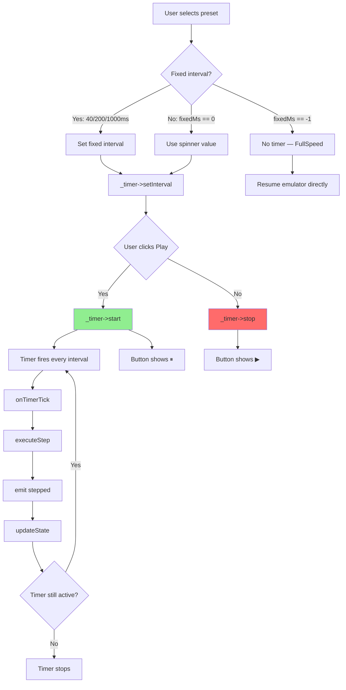

**Timer Behavior**:
- **Single-shot disabled**: Timer repeats indefinitely while auto-stepping
- **Interval sources**:
  - Fixed intervals for fps presets: 40ms (25 fps), 200ms (5 fps), 1000ms (1 fps)
  - User-configurable via spinner for other presets: 1–5000 ms
  - No timer for FullSpeed (`fixedIntervalMs == -1`)
- **Thread safety**: All operations execute on the main Qt thread
- **Deferred start**: When switching from full-speed to a timed preset, the timer starts with a 50ms `QTimer::singleShot` delay to avoid racing with the emulator thread

### Timer Tick Implementation

```cpp
void SpeedControlWidget::onTimerTick()
{
    if (!_emulator)
        return;

    executeStep();
    emit stepped();
}
```

### Dynamic Interval Adjustment

```cpp
// When interval changes during auto-run, update the timer immediately
connect(_intervalSpinBox, QOverload<int>::of(&QSpinBox::valueChanged),
    this, [this](int value) {
        if (_timer->isActive()) {
            _timer->setInterval(value);  // Takes effect on next tick
        }
    });
```

---

## Integration with Breakpoints

### Breakpoint Interaction Flow

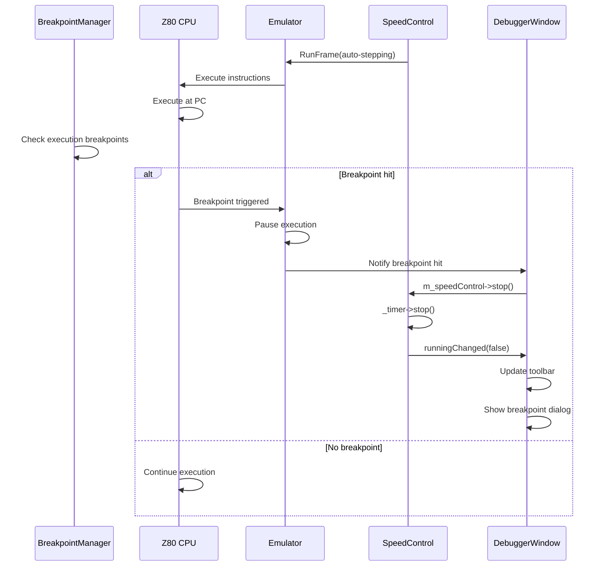

### Skip Breakpoints Mode

All speed control stepping methods accept a `skipBreakpoints` parameter:
- `true` — Breakpoints are ignored during auto-stepping (default for speed control)
- `false` — Breakpoints trigger normally (default for manual debugger actions)

**Rationale**: Speed control auto-stepping is designed for continuous visual observation. It should continue until the user manually stops it, not pause unexpectedly at breakpoints.

```cpp
// In executeStep() — all calls pass skipBreakpoints = true
switch (cfg.stepType) {
    case StepType::FullSpeed:
        if (_emulator->IsPaused())
            _emulator->Resume();
        break;

    case StepType::Frame:
        _emulator->RunFrame(true);           // skipBreakpoints = true
        break;

    case StepType::Opcodes:
        _emulator->RunNCPUCycles(cycles, true);
        break;

    case StepType::Scanlines:
        _emulator->RunNScanlines(count, true);
        break;
}
```

---

## Visual Styling

### Dark Theme Stylesheet

The widget uses Qt palette-based CSS for automatic dark/light theme adaptation:

```css
SpeedControlWidget {
    font-family: "Consolas", "Monaco", "Courier New", monospace;
    font-size: 11px;
    border: 1px solid palette(mid);
    border-radius: 4px;
    margin-top: 8px;
    padding: 6px 6px 4px 6px;
}

QToolButton {
    background-color: palette(button);
    border: 1px solid palette(mid);
    border-radius: 3px;
    color: palette(button-text);
    padding: 2px;
    min-width: 24px;
    min-height: 24px;
    font-size: 14px;
}

QToolButton:hover {
    background-color: palette(light);
    border-color: palette(dark);
}

QToolButton:pressed {
    background-color: palette(dark);
}

QToolButton:checked {
    background-color: palette(highlight);
    border-color: palette(highlight);
    color: palette(highlighted-text);
}

QSlider::groove:horizontal {
    background: palette(mid);
    height: 4px;
    border-radius: 2px;
}

QSlider::handle:horizontal {
    background: palette(button);
    border: 1px solid palette(mid);
    width: 12px;
    height: 16px;
    margin: -6px 0;
    border-radius: 3px;
}

QSlider::sub-page:horizontal {
    background: palette(highlight);
    border-radius: 2px;
}
```

### Tick Mark Widget

A custom `TickMarkWidget` draws evenly-spaced tick marks aligned to the slider groove:

```cpp
/// Custom widget that draws evenly-spaced tick marks below the slider
class TickMarkWidget : public QWidget
{
public:
    explicit TickMarkWidget(int tickCount, QSlider* slider, QWidget* parent = nullptr)
        : QWidget(parent), _tickCount(tickCount), _slider(slider)
    {
        setFixedHeight(10);
    }

protected:
    void paintEvent(QPaintEvent*) override
    {
        if (_tickCount < 2 || !_slider)
            return;

        QPainter p(this);
        p.setRenderHint(QPainter::Antialiasing, false);

        // Map slider's left/right edges to coordinate space
        QPoint sliderTopLeft = _slider->mapTo(parentWidget(), QPoint(0, 0));
        QPoint myTopLeft = mapTo(parentWidget(), QPoint(0, 0));
        int sliderLeft = sliderTopLeft.x() - myTopLeft.x();
        int sliderRight = sliderLeft + _slider->width();

        // Inset by handle half-width to align with groove endpoints
        const int handleHalf = 7;
        const int left = sliderLeft + handleHalf;
        const int right = sliderRight - handleHalf;
        const int usable = right - left;

        if (usable <= 0)
            return;

        const int midIndex = (_tickCount - 1) / 2;
        const QColor majorColor = palette().color(QPalette::Text);
        const QColor minorColor = palette().color(QPalette::Mid);

        for (int i = 0; i < _tickCount; ++i) {
            bool isMajor = (i == 0 || i == _tickCount - 1 || i == midIndex);
            int x = left + (usable * i) / (_tickCount - 1);
            int tickHeight = isMajor ? height() : height() / 2;

            QPen pen(isMajor ? majorColor : minorColor);
            pen.setWidth(1);
            p.setPen(pen);
            p.drawLine(x, 0, x, tickHeight - 1);
        }
    }

private:
    int _tickCount;
    QSlider* _slider;
};
```

Major ticks (first, middle, last positions) are drawn full-height in text color; minor ticks are half-height in mid color.

---

## Testing

### Unit Tests

```cpp
// Test: Preset T-state calculations match expected values for 48K model
TEST(SpeedControlWidget, TStatePresets48K) {
    // config.frame = 69888, config.t_line = 224
    SpeedControlWidget widget;
    Emulator* emulator = createTestEmulator(ZX48K);
    widget.setEmulator(emulator);

    EXPECT_EQ(widget.getTStatesForPreset(POS_1_FRAME),   69888);
    EXPECT_EQ(widget.getTStatesForPreset(POS_100_LINES), 22400);
    EXPECT_EQ(widget.getTStatesForPreset(POS_10_LINES),  2240);
    EXPECT_EQ(widget.getTStatesForPreset(POS_1_LINE),    224);
    EXPECT_EQ(widget.getTStatesForPreset(POS_1_OP),      0);  // Dynamic per-opcode
}

// Test: Preset T-state calculations for 128K model (different scanline width)
TEST(SpeedControlWidget, TStatePresets128K) {
    // config.frame = 70908, config.t_line = 228
    SpeedControlWidget widget;
    Emulator* emulator = createTestEmulator(ZX128K);
    widget.setEmulator(emulator);

    EXPECT_EQ(widget.getTStatesForPreset(POS_1_LINE),    228);
}

// Test: Timer intervals
TEST(SpeedControlWidget, TimerIntervals) {
    SpeedControlWidget widget;

    EXPECT_EQ(widget.getTimerIntervalMs(POS_1X),       0);    // No timer
    EXPECT_EQ(widget.getTimerIntervalMs(POS_25_FPS),   40);
    EXPECT_EQ(widget.getTimerIntervalMs(POS_5_FPS),    200);
    EXPECT_EQ(widget.getTimerIntervalMs(POS_1_FPS),    1000);

    // User-configurable presets return spinner value
    widget._intervalSpinBox->setValue(500);
    EXPECT_EQ(widget.getTimerIntervalMs(POS_1_FRAME),  500);
}

// Test: isFullSpeed()
TEST(SpeedControlWidget, IsFullSpeed) {
    SpeedControlWidget widget;

    widget._slider->setValue(0);  // 1× preset
    EXPECT_TRUE(widget.isFullSpeed());

    widget._slider->setValue(1);  // 25 fps
    EXPECT_FALSE(widget.isFullSpeed());
}

// Test: stop() stops timer and resets button state
TEST(SpeedControlWidget, StopResetsState) {
    SpeedControlWidget widget;
    Emulator* emulator = createTestEmulator();

    // Start auto-run
    widget.onPlayPauseClicked();
    EXPECT_TRUE(widget.isRunning());

    // Call stop()
    widget.stop();
    EXPECT_FALSE(widget.isRunning());
    EXPECT_EQ(widget._playPauseButton->text(), "\u25B6");  // ▶
}
```

### Integration Tests

| Test | Steps | Expected Result |
|------|---------|----------------|
| **Step Forward at 1 line** | Set slider to pos 7, click ⏭ | PC advances by ~1 instruction per 224T, no horizontal drift |
| **Auto-run at 1 fps** | Set slider to pos 3, click ▶ | Screen updates once per second |
| **Auto-run at 1 Op** | Set slider to pos 8, click ▶ | Disassembler advances 1 instruction per tick |
| **Stop on Continue** | Start auto-run, click Continue | Timer stops, emulator runs at full speed |
| **Stop on breakpoint** | Set breakpoint, start auto-run | Timer stops when breakpoint hit |
| **Model switch** | Switch 48K → 128K while widget visible | Label updates from "224T" to "228T" |
| **Interval adjustment** | Set to 500 ms during auto-run | Step rate doubles immediately |
| **Line stepping drift test** | Run 100 consecutive 1-line steps | All steps land at same horizontal offset |

---

## Performance Characteristics

### Auto-Stepping Throughput

| Preset | Interval | Steps/Second | T-States/Second (48K) | Use Case |
|---------|-----------|--------------|------------------------|-----------|
| 25 fps | 40 ms | 25 | ~1,747,200 | Fast frame-by-frame review |
| 5 fps | 200 ms | 5 | ~349,440 | Moderate speed observation |
| 1 fps | 1000 ms | 1 | ~69,888 | Careful frame inspection |
| 1 line (500 ms) | 500 ms | 2 | ~448 | Line-by-line timing analysis |
| 1 Op (1000 ms) | 1000 ms | 1 | ~4–23 | Instruction-level tracing |

### Overhead Analysis

**Timer Overhead**:
- QTimer triggers on main Qt thread
- Single `executeStep()` call per tick
- Negligible compared to emulation time

**Step Method Overhead**:
- All step methods have minimal overhead
- Direct Z80 execution via `Z80Step()`
- No state serialization/deserialization
- Breakpoint check skipped during auto-stepping (`skipBreakpoints = true`)

**UI Update Overhead**:
- `updateState()` called after each step
- Only runs when emulator is paused
- Most overhead comes from debugger window refresh (disassembly, registers, memory views), not speed control itself

---

## Future Enhancements

The original specification (2026-02-07) included sub-line precision presets that were deferred to a future iteration. These and other planned improvements:

### 1. T-State Precision Presets

Sub-line stepping using `RunTStates()` for pixel-level precision:

```cpp
{ "½ line",    StepType::TStates, 0, 1, 5000, 1, 0, 1,  2 },  // L/2 (112T @ 48K)
{ "¼ line",    StepType::TStates, 0, 1, 5000, 1, 0, 1,  4 },  // L/4 (56T @ 48K)
{ "⅛ line",    StepType::TStates, 0, 1, 5000, 1, 0, 1,  8 },  // L/8 (28T @ 48K)
{ "1/16 line", StepType::TStates, 0, 1, 5000, 1, 0, 1, 16 },  // L/16 (14T @ 48K)
{ "1 T",       StepType::TStates, 0, 1, 5000, 1, 0, 1,  1 },  // 1 T-state
```

### 2. Variable Intervals via Slider

Replace spinbox with logarithmic slider for more intuitive interval control:

```cpp
QSlider* intervalSlider;
intervalSlider->setRange(1, 5000);
intervalSlider->setTickPosition(QSlider::TicksBelow);
intervalSlider->setTickInterval(100);
```

### 3. Loop Detection in Auto-Stepping

Detect tight loops (PC not advancing) and auto-pause:

```cpp
if (lastPC == currentPC) {
    loopCount++;
    if (loopCount > LOOP_THRESHOLD) {
        stop();  // Auto-pause on infinite loop
        emit notifyLoopDetected();
        return;
    }
}
```

### 4. Speed Preset Customization

User-defined presets stored in settings:

```cpp
struct CustomPreset {
    QString name;
    StepType stepType;
    int stepParam;  // frame count, line count, or t-state count
    int interval;
};

QSettings settings;
settings.setValue("custom_presets", savePresets());
```

### 5. Visual Step Feedback

Highlight the executed range in the disassembly view:

```cpp
uint16_t startPC = z80State->pc;
executeStep();
uint16_t endPC = z80State->pc;
disassemblerWidget->highlightRange(startPC, endPC);
```

---

## Files

| File | Type | Description |
|---|---|---|
| `unreal-qt/src/debugger/widgets/speedcontrolwidget.h` | NEW | Widget class, `PresetConfig`, `StepType`, `TickMarkWidget` declarations |
| `unreal-qt/src/debugger/widgets/speedcontrolwidget.cpp` | NEW | Widget implementation (604 lines) with dark styling, preset table, step dispatch |
| `unreal-qt/src/debugger/debuggerwindow.h` | MODIFIED | Added `SpeedControlWidget* m_speedControl` and `bool _speedControlActive` fields |
| `unreal-qt/src/debugger/debuggerwindow.cpp` | MODIFIED | Construction, layout, signal wiring, stop-on-manual-action (6 call sites) |
| `core/src/emulator/emulator.h` | EXISTING | Step method declarations (12 methods) |
| `core/src/emulator/emulator.cpp` | EXISTING | Step method implementations (~650 lines, starting at line 1196) |
| `core/src/emulator/platform.h` | EXISTING | `CONFIG` struct with `t_line`, `frame`, `intstart`, `intlen` |

---

## References

- [Core Speed Control System](../../../docs/emulator/design/core/speed-control.md) — CPU frequency multiplier and turbo mode
- [Emulator Binding Architecture](../../../docs/emulator/design/ui/emulator-binding-architecture.md) — EmulatorBinding pattern for UI-core decoupling
- [Qt6 Documentation](https://doc.qt.io/qt-6/) — QTimer, QSlider, QToolButton, QGroupBox APIs
- [Z80 Instruction Set](https://www.z80.info/) — Cycle counts for each instruction (4–23 T-states)
