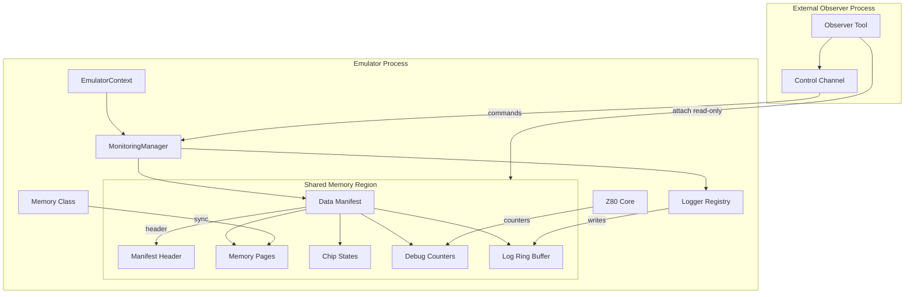

# Real-Time Monitoring Subsystem — Architectural Design

**Created:** 2026-02-01  
**Status:** Draft — Awaiting Review

## Overview

This document defines the high-level architecture for a **blazing-fast, cross-platform real-time monitoring subsystem** that extends the existing shared memory infrastructure with a flexible **Data Manifest Protocol** for exposing heterogeneous data sections (emulator state, debugging counters, logging) to external observer tools.



---

## 1. Design Goals

| Priority | Goal | Rationale |
|----------|------|-----------|
| **P0** | Zero-cost when disabled | Critical for production emulation performance |
| **P0** | Lock-free hot paths | Logging and state updates must not block emulation |
| **P1** | Runtime reconfiguration | Enable/disable categories without restart |
| **P1** | Cross-platform | POSIX shm_open / Windows CreateFileMapping |
| **P2** | Coherent reads | Observers see consistent snapshots, not torn states |

---

## 2. Shared Memory Layout

Extends existing 5MB memory block with manifest header and section descriptors:

```
┌──────────────────────────────────────────────────────────┐
│  Manifest Header (64 bytes)                              │
│  ├─ magic: 0x554E524C ("UNRL")                           │
│  ├─ version: uint16_t                                    │
│  ├─ section_count: uint16_t                              │
│  ├─ total_size: uint64_t                                 │
│  ├─ epoch: atomic<uint64_t>  ← coherency                 │
│  └─ reserved: 40 bytes                                   │
├──────────────────────────────────────────────────────────┤
│  Section Descriptors (32 bytes × N)                      │
│  ├─ type: enum (MEMORY_PAGES, CHIP_STATE, LOG, ...)      │
│  ├─ offset: uint32_t                                     │
│  ├─ length: uint32_t                                     │
│  ├─ epoch: atomic<uint64_t>  ← per-section version       │
│  └─ flags: uint16_t (ENABLED, BIDIRECTIONAL)             │
├──────────────────────────────────────────────────────────┤
│  Section Data Blocks                                     │
│  ├─ [Section 0] Memory Pages (~5MB, existing)            │
│  ├─ [Section 1] Chip States (Z80, AY, FDC)               │
│  ├─ [Section 2] Debug Counters                           │
│  └─ [Section 3] Log Ring Buffer (4MB)                    │
└──────────────────────────────────────────────────────────┘
```

---

## 3. Section Catalog

| Section Type | Size | Update Frequency | Notes |
|--------------|------|-----------------|-------|
| `MEMORY_PAGES` | ~5MB | Per-frame | Existing, read-only |
| `CHIP_STATE_Z80` | ~128B | Per-instruction | Registers, flags, IM |
| `CHIP_STATE_AY` | ~32B | Per-frame | 16 registers |
| `CHIP_STATE_FDC` | ~64B | On-demand | WD1793 state |
| `DEBUG_COUNTERS` | ~128KB | Per-instruction | R/W/X per address |
| `LOG_STREAM` | 4MB | On-log | SPSC ring buffer |
| `INPUT_STATE` | 16B | On-change | Keyboard/joystick (bidirectional) |
| `LOGGER_STATE` | 64B | Per-frame | Module enable masks, submodule masks, levels |

---

## 4. Existing Primitives — Foundation

### Primary: RingBuffer (`core/src/common/ringbuffer.h`)
**Added:** 2026-01-21 (commit `6fbc026f`) for AnalyzerManager  
**Status:** Production-ready, actively used

```cpp
template<typename T>
class RingBuffer {
    void push(T&& event);              // Thread-safe, FIFO eviction
    std::vector<T> getAll() const;
    std::vector<T> getSince(uint64_t timestamp) const;
    std::vector<T> getRange(size_t start, size_t count) const;
    void clear();
    
    // Statistics
    uint64_t totalEventsProduced() const;
    uint64_t totalEventsEvicted() const;
};
```

**Features:**
- Thread-safe with `std::shared_mutex` (reader-writer lock)
- FIFO eviction when full
- `getSince(timestamp)` filtering — perfect for incremental reads
- Statistics tracking (produced/evicted counts)

**For IPC Log Stream:** Extend with lock-free SPSC variant or use directly if contention is acceptable.

---

### Supporting Primitives

| Component | Location | Use Case |
|-----------|----------|----------|
| `OpcodeProfiler` | `cpu/opcode_profiler.h` | Trace buffer pattern (atomic head) |
| `CallTraceBuffer` | `memory/calltrace.h` | Hot/cold segmentation |
| `ma_rb` | `3rdparty/miniaudio/` | Lock-free SPSC (optional fallback) |

---

## 5. Coherency Protocol

### Epoch-Based Reads

```cpp
// Producer (Emulator)
void updateChipState() {
    section->epoch.store(UPDATING, std::memory_order_release);
    // ... write data ...
    section->epoch.store(globalEpoch++, std::memory_order_release);
}

// Consumer (Observer) - retry if torn
bool readChipState(ChipState* out) {
    uint64_t before = section->epoch.load(std::memory_order_acquire);
    if (before == UPDATING) return false;
    
    memcpy(out, section->data, sizeof(ChipState));
    std::atomic_thread_fence(std::memory_order_acquire);
    
    return (before == section->epoch.load(std::memory_order_acquire));
}
```

---

## 6. Modular Logging

Hierarchical categories with atomic enable flags:

```cpp
// Definition
EMU_LOG_DEFINE_CATEGORY(log_fdc_read, "fdc.read");

// Usage (zero-cost when disabled)
EMU_LOG_TRACE(log_fdc_read, "Sector T%d/H%d/S%d", track, head, sector);

// Runtime control
LoggerRegistry::instance().setEnabled("fdc.*", true, Level::Trace);
```

---

## 7. Design Decisions

| # | Question | Decision |
|---|----------|----------|
| 1 | **Manifest naming** | `/unreal_monitor_{short_id}` — consistent with existing `/zxspectrum_memory-XXXX` |
| 2 | **Section resize** | Fixed at init for most sections. Ring buffers expose R/W pointers. Video/Audio sections may need reallocation on resolution change (e.g., modern clone screen modes) — handle via section versioning. |
| 3 | **Video/Audio** | **Separate opt-in regions** with own lifecycle. Future: consider compressed video stream. |
| 4 | **Control channel** | **TBD** — Need to evaluate cross-platform trade-offs (macOS, Windows, Linux). Candidates: shared memory polling vs Unix Domain Sockets vs Named Pipes. |
| 5 | **Telemetry integration** | **Yes, modular approach** — Expose multiple telemetry channels as sections: logging, traces, heatmaps, counters, etc. |

### Section Types Summary

```
┌─────────────────────────────────────────────────────────────┐
│  CORE MANIFEST (always present)                             │
│  ├─ Manifest Header + Section Descriptors                   │
│  ├─ Memory Pages (existing 5MB)                             │
│  ├─ Chip States (Z80, AY, FDC)                              │
│  ├─ Input State (keyboard/joystick, bidirectional)          │
│  └─ Logger State (module enable masks, levels)              │
├─────────────────────────────────────────────────────────────┤
│  TELEMETRY SECTIONS (modular, enable per-section)           │
│  ├─ Log Stream (RingBuffer, hierarchical categories)        │
│  ├─ Opcode Traces (existing OpcodeProfiler format)          │
│  ├─ Call Traces (existing CallTraceBuffer format)           │
│  ├─ Memory Heatmaps (MemoryAccessTracker counters)          │
│  └─ Performance Counters                                    │
├─────────────────────────────────────────────────────────────┤
│  MEDIA SECTIONS (separate opt-in regions)                   │
│  ├─ Framebuffer(s) — may resize on screen mode change       │
│  └─ Audio Buffer(s) — stereo PCM                            │
└─────────────────────────────────────────────────────────────┘
```

---

## 8. POC Roadmap

Organized by data flow patterns with distinct update characteristics:

### POC 1: High-Frequency State (Registers)
**Challenge:** Z80 registers change every instruction (~3.5 MHz). Must determine:
- Throttling strategy (frame-sync vs sample rate?)
- Maximum useful refresh rate for observers
- Coherency with epoch-based reads

**Deliverable:** Chip state section + observer benchmark

---

### POC 2: Periodic Media Buffers (50 Hz)
**Challenge:** Large buffers (framebuffer ~50KB, audio ~4KB/frame) refreshed at display rate.
- Double-buffering or single buffer with epoch?
- Separate shared memory regions vs inline sections
- Handle resolution changes gracefully

**Deliverable:** Framebuffer + audio buffer sections with frame-sync

---

### POC 3: Append-Only Telemetry
**Challenge:** Continuous logging, traces, heatmaps — not time-critical but must never block emulation.
- RingBuffer-based with getSince() for incremental reads
- Category filtering and runtime enable/disable
- Statistics (produced/evicted/overflow)

**Deliverable:** Log stream + heatmap sections using existing `RingBuffer`

---

## 9. Phased Rollout Plan

**Strategy:** Feature-by-feature ("Vertical Slice") — one complete slice per data flow pattern before expanding.

### Phase 1: Foundation (Week 1-2)
```
├─ MonitoringManager skeleton
├─ Manifest header + section descriptors  
├─ Section enable/disable flags
└─ CLI: `monitor status` (dumps active sections)
```
**Validation:** External tool can discover and enumerate sections.

---

### Phase 2: Append-Only Telemetry (Week 3)
```
├─ Log Stream section using existing RingBuffer
├─ One category: fdc.* (proof of concept)
├─ Simple observer tool that polls getSince()
└─ Runtime enable/disable via control channel
```
**Validation:** FDC operations visible in real-time from external process.

---

### Phase 3: Periodic Media (Week 4)
```
├─ Framebuffer section (reuse existing screen memory pointer)
├─ Frame-sync epoch bumping (OnFrameComplete hook)
├─ Separate shared memory region for media
└─ Validate with Screen Viewer
```
**Validation:** Screen Viewer switches to manifest-based discovery.

---

### Phase 4: High-Frequency State (Week 5)
```
├─ Chip state section (Z80 registers)
├─ Throttling benchmark (per-instruction vs sampled)
├─ Coherency stress test
└─ Observer benchmark: max usable refresh rate
```
**Validation:** External debugger shows live register values.

---

### Why Phased?

| Benefit | Rationale |
|---------|-----------|
| **Early feedback** | Each POC validates one pattern before investing in others |
| **Rollback safety** | Disable individual sections without affecting others |  
| **Reuse validation** | Manifest/epoch infrastructure proven before complexity |
| **Parallel work** | Observer tools develop against stable sections |

---

## 10. Hazards & Considerations

### Buffer Reallocation (Media Sections)
Media sections (framebuffer, audio) may need resizing on resolution change. Strategy:
1. **Separate shared memory regions** for media sections
2. **Epoch-protected swap**: allocate new → update descriptor → epoch bump → cleanup old
3. Pattern: Reuse existing `MigratePointersAfterReallocation()` approach

### Zero-Copy Coherency
For sections updated at high frequency:
- Use **epoch-based reads** (observer retries on torn read)
- **Never block emulation** — drop oldest on overflow
- Consider **frame-sync batching** for telemetry sections

---

## 11. IPC Research: Browser Patterns

Research into high-throughput IPC in modern browsers (Chromium, Firefox) reveals patterns directly applicable to our control channel decision.

### Chromium: Mojo IPC

**Architecture:**
- **SharedBuffer** — Anonymous shared memory sections for zero-copy data transfer
- **DataPipe** — Streaming primitive with two-phase I/O (acquire buffer → write → commit)
- **Message Pipes** — Bidirectional channels for control messages and handle passing

**Key Pattern:** Hybrid architecture — Mojo uses **platform pipes for signaling** + **shared memory for data**.

### Firefox: IPDL

**Architecture:**
- **mozilla::ipc::Shmem** — IPDL-managed shared memory, transfers handles without copying
- **Actors** — Protocol-defined components that can span processes
- **Message ordering** — IPDL compiler generates C++ with guaranteed message ordering

**Key Pattern:** Protocol-driven — Shared memory regions managed by higher-level actors.

---

## 12. Control Channel Decision

### Cross-Platform Performance Comparison

| Mechanism | Linux | macOS | Windows | Notes |
|-----------|-------|-------|---------|-------|
| **Shared Memory** | ~250 ns | ~650 ns | ~300 ns | Fastest. Requires user-level sync. |
| **Unix Domain Sockets** | ✓ Fast | ✓ Fast | ✗ WSL only | Bidirectional, FD passing |
| **Named Pipes** | ✓ | ✓ | ✓ Native | Built-in sync, file-based |
| **eventfd** | ✓ Native | ✗ | ✗ | Lightweight wakeup (Linux only) |

### Recommended: Hybrid Architecture

```
┌─────────────────────────────────────────────────────────────┐
│  DATA PLANE (Shared Memory)                                  │
│  ├─ Manifest + all section data                              │
│  ├─ RingBuffers for telemetry                                │
│  └─ Zero-copy, epoch-based coherency                         │
├─────────────────────────────────────────────────────────────┤
│  CONTROL PLANE (Platform-Specific)                           │
│  ├─ Linux: Unix Domain Socket                                │
│  ├─ macOS: Unix Domain Socket                                │
│  └─ Windows: Named Pipe                                      │
│                                                              │
│  Messages: enable/disable sections, set log levels,          │
│            request section enumeration, acknowledge resize   │
└─────────────────────────────────────────────────────────────┘
```

**Rationale:**
1. **Shared memory for data** — Already proven pattern (existing Memory class)
2. **Sockets/Pipes for control** — Blocking reads simplify observer implementation (no polling)
3. **Platform abstraction** — Thin wrapper: `ControlChannel::send(cmd)`, `ControlChannel::recv()`

### Alternative: Pure Shared Memory (Polling)

If control channel traffic is minimal (< 1 msg/sec), embed a command ring buffer in the manifest itself:
- Observer writes to `COMMAND_RING` section
- Emulator polls on frame boundary (~50 Hz)
- **Pros:** Simpler, no socket code
- **Cons:** 20ms latency floor, requires polling loop

---

## 13. Frame Sync Notification (Cross-Process)

**Problem:** Observer processes need near-zero-jitter notification when a new frame is complete. Your current audio-hardware-driven timing (buffer half-full signal) provides excellent accuracy. We need to propagate this to external processes.

### Browser Pattern: Audio-Driven Clock (Chromium)

Chromium's video renderer polls an **audio-driven global clock** before each VSync to request decoded frames. The audio renderer updates this clock as data is fed to the sound card. This provides hardware-accurate timing.

**Our equivalent:** `SoundManager::handleFrameEnd()` → audio callback invocation

### Cross-Platform Frame Notification Mechanisms

| Platform | Mechanism | Latency | API |
|----------|-----------|---------|-----|
| **Linux** | `eventfd` + `epoll` | ~5-10 µs | `eventfd_write()` / `epoll_wait()` |
| **macOS** | POSIX named semaphore | ~10-20 µs | `sem_post()` / `sem_wait()` |
| **Windows** | Named Event | ~5-15 µs | `SetEvent()` / `WaitForSingleObject()` |

### Recommended: Hybrid Frame Sync

```cpp
// In SoundManager::handleFrameEnd(), after audio callback:
void MonitoringManager::signalFrameComplete() {
    // 1. Bump epoch in shared memory (for polling observers)
    _manifest->frameEpoch.fetch_add(1, std::memory_order_release);
    
    // 2. Signal waiting observers (for blocking observers)
#ifdef _WIN32
    SetEvent(_frameReadyEvent);  // Named event: "unreal_frame_{short_id}"
#elif __APPLE__
    sem_post(_frameSemaphore);   // Named: "/unreal_frame_{short_id}"
#else  // Linux
    uint64_t val = 1;
    write(_frameEventFd, &val, sizeof(val));  // eventfd
#endif
}
```

**Observer side:**
```cpp
// Option A: Blocking (for dedicated observer thread)
#ifdef _WIN32
WaitForSingleObject(frameEvent, INFINITE);  // ~5µs wakeup latency
#elif __APPLE__
sem_wait(frameSem);
#else
struct pollfd pfd = {.fd = eventfd, .events = POLLIN};
poll(&pfd, 1, -1);
uint64_t val; read(eventfd, &val, sizeof(val));
#endif

// Option B: Polling shared memory (simpler, no IPC setup)
while (lastEpoch == manifest->frameEpoch.load(std::memory_order_acquire)) {
    std::this_thread::sleep_for(std::chrono::microseconds(100));
}
```

### Memory Ordering Guarantee

Windows `SetEvent`/`WaitForSingleObject` and POSIX semaphores provide **full memory barrier semantics**: writes before `sem_post()` are visible after `sem_wait()` returns. This ensures the observer sees consistent frame data.

### Naming Convention

| Object | Name Pattern |
|--------|--------------|
| Shared Memory | `/unreal_monitor_{short_id}` |
| Frame Semaphore | `/unreal_frame_{short_id}` |
| Control Socket | `/tmp/unreal_ctl_{short_id}` (Linux/macOS) |
| Control Pipe | `\\.\pipe\unreal_ctl_{short_id}` (Windows) |

