# macOS fullscreen transition — glitch-free native Space entry and exit

**Status:** solved and in use. Reference state: local git stash
`fullscreen-teleport-zoom-clean-v2`.

**Component:** `tools/poc/qt-gui/src/platform/macos/` (`FullscreenHelper.mm`,
`MetalScreenWidget.mm`) and `tools/poc/qt-gui/src/MainWindow.cpp`.

**Platform:** macOS 15, Qt 6.9, `CAMetalLayer` rendering into a Qt host widget.

---

## Executive summary

Entering and leaving native macOS fullscreen moves the window into a separate
Space. AppKit's default behaviour is to freeze the window into a snapshot and
zoom the snapshot — seamless, but the emulator picture is a still image for
roughly half a second in each direction. Opting out of the snapshot (by
returning the window from `customWindowsToEnter/ExitFullScreenForWindow:`) buys
a live picture, and hands the application a problem: it must now animate the
transition itself, against an AppKit state machine that does not report its
state synchronously, does not honour the duration it supplies, and shares the
display with a compositor in another process.

The goal was a transition in which the emulator keeps running and stays
correctly positioned throughout — no snapshots, no drift, no jumps, no black
frames. That goal is met. The cost is roughly 1.5 s of AppKit-side overhead per
exit that cannot be removed from inside a Space (see
[Known remaining costs](#known-remaining-costs)).

This folder records the working design, every approach that failed and why, the
complete code, and how to debug the subsystem when it regresses.

## The one-paragraph explanation

Two animators cannot be synchronised. `NSWindow`'s animator is an app-side timer
with a non-bezier curve; Core Animation interpolates on the render server in a
different process. Any design that animates the window frame *and* the layer at
the same time matches only at the endpoints and drifts in between — that drift
was every "content slides off to the bottom right" artefact. The fix is to leave
exactly one thing moving: **the window teleports straight to its destination
with `setFrame:display:NO animate:NO`, and the entire visible zoom is a single
`CABasicAnimation` on the Metal layer's `transform`.** The drawable is frozen
for the duration, the scale is uniform and computed content-to-content with the
same letterbox math the render viewport uses, and finalization is idempotent
because AppKit and our own timer disagree by hundreds of milliseconds about when
the transition ended.

```mermaid
flowchart LR
    A["User toggles fullscreen"] --> B["Hide chrome + bars,<br/>commit synchronously"]
    B --> C["toggleFullScreen:"]
    C --> D["AppKit offers a<br/>custom animation slot"]
    D --> E["Window TELEPORTS<br/>display:NO animate:NO"]
    E --> F["ONE CABasicAnimation<br/>on layer.transform"]
    F --> G["Idempotent finalize:<br/>timer OR AppKit callback,<br/>whichever is first"]
    G --> H["endZoom(): settle geometry<br/>+ render INSIDE one transaction"]
    style E fill:#dfd,stroke:#4a4
    style F fill:#dfd,stroke:#4a4
```

## Documents in this folder

| Document | What it answers |
|---|---|
| [architecture.md](architecture.md) | How the working solution is built: the enter and exit sequences as diagrams, what each piece is for, which specific bug each piece prevents, and the coordinate conventions |
| [implementation.md](implementation.md) | The complete code — letterbox math, the transform, `prepareZoom`/`animateZoom`/`endZoom`, the geometry freeze, both present paths, the AppKit delegate including forwarding to Qt's delegate, and the remaining hardcoded timeouts with the events that should replace them |
| [dead-ends.md](dead-ends.md) | Every approach that was implemented, measured and reverted, grouped into animation strategy, frame pacing, and timing/handoff — each with its symptom and its *measured* reason, plus the two options rejected by design |
| [diagnostics.md](diagnostics.md) | How to debug this subsystem: instrumentation setup, what to log and what each measurement proves, log-analysis one-liners with annotated healthy and pathological traces, the sources that lie, reference performance numbers, a symptom → cause → next-measurement triage table, and how to reason about compositor-side artefacts that never reach a log |

### On self-containment

The reference state is a **local git stash name**, which means nothing to anyone
but the machine it was created on and will not survive a clone, a fresh
checkout, or another developer. The documents are therefore written to stand on
their own: [implementation.md](implementation.md) carries the complete code, not
excerpts or diffs, and [architecture.md](architecture.md) and
[dead-ends.md](dead-ends.md) quote the measurements inline rather than
referencing a run. The folder is sufficient to rebuild the solution from
scratch without access to that stash.

## Start here

Pick the entry point that matches what you are doing.

### You are fixing a bug in the transition

1. **[diagnostics.md](diagnostics.md) §8** — the triage table. Find your symptom;
   it names the likely cause and the next measurement.
2. **[diagnostics.md](diagnostics.md) §2** — get a log before changing anything.
   Nothing in this subsystem is guessable, and the most plausible hypotheses
   were all wrong.
3. **[dead-ends.md](dead-ends.md)** — check whether the fix you are about to
   attempt has already been tried and measured. Several of them look obviously
   correct and are not.
4. **[architecture.md](architecture.md)**, the "pieces and the bug each one
   prevents" table — if you are removing something, this says what it was load-
   bearing for.

### You are porting this to another app or another renderer

1. **[architecture.md](architecture.md)** — the principle and the two sequence
   diagrams. Read the coordinate notes carefully; the flipped Qt host view and
   `anchorPoint (0,0)` are assumptions the transform math depends on.
2. **[implementation.md](implementation.md)** — the code, in order: letterbox
   math, transform, the three zoom entry points, the freeze, the delegate.
3. **[dead-ends.md](dead-ends.md)** — the "rejected by design" section first: if
   a separate Space is not a product requirement for you, a borderless
   full-screen window removes every timing problem in this folder and you should
   stop reading.
4. **[diagnostics.md](diagnostics.md) §6** — the sources that lie. These are
   platform behaviours, not project quirks, and they will bite an independent
   implementation identically.

### You are reviewing the change

1. **This page** — the one-paragraph explanation is the whole design.
2. **[architecture.md](architecture.md)**, the pieces table — each row is an
   invariant a reviewer can check against the diff.
3. **[implementation.md](implementation.md) §5** — the remaining hardcoded
   timeouts, which are the known debt in the change, including the documented
   trap for the first of them (the fix must land as two coordinated changes,
   not one).
4. **[diagnostics.md](diagnostics.md) §7** — the reference performance numbers,
   so the claims in the code comments can be checked against measurements.

### You just want to know why the code looks like this

Read the one-paragraph explanation above, then the pieces table in
[architecture.md](architecture.md). Everything unusual in the code — the
teleport, the static pre-transform, the idempotent finalization, the render
inside the geometry transaction — is a specific artefact that was observed and
removed.

## Current status

| Aspect | State |
|---|---|
| Live picture throughout enter and exit | Working |
| Aspect ratio preserved across the zoom | Working — uniform, content-to-content scale |
| No drift, no jumps, no black frames | Working |
| Correct final geometry in both directions | Working, including the maximized-before-fullscreen case |
| Keyboard focus after a transition | Working, with retries on the first enter |
| Stuck modifier after the toggle shortcut | Fixed (`releaseAllKeys()` on will-enter/will-exit) |
| Qt delegate forwarding (close button quits the app) | Fixed |
| Hardcoded timeouts | 3 remaining, listed with their event replacements |
| AppKit-side transition overhead | Not removable inside a Space — see below |

## Known remaining costs

These are measured, understood, and accepted. They are properties of using a
Space, not defects in the implementation.

| Cost | Measured | Why it stays |
|---|---|---|
| AppKit Space teardown before `windowDidExitFullScreen` | ~576 ms | Happens in the window server after our animation completes. Every attempt to act before AppKit reports its state broke either the coordinates or the first animation frames |
| `restoreNormalStyle` — three bar `show()`s during that teardown | ~949 ms | Slow for the same reason: the window server is busy. Deferring or async-ing it reintroduced garbage snapshots at the start of the animations |
| Three hardcoded timeouts | see [implementation.md](implementation.md) §5 | Each has an identified event-based replacement; the first was attempted and failed for a documented reason and must land together with passing the final size explicitly into `endZoom()` |

Removing the first two requires abandoning Spaces entirely in favour of a
borderless full-screen window. That is a different feature with different
product behaviour (no separate Space, no Mission Control integration), not an
optimisation of this one.
