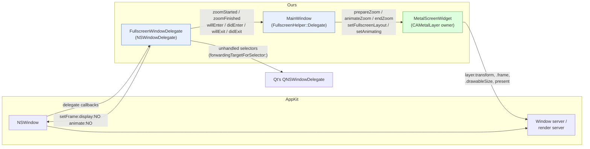
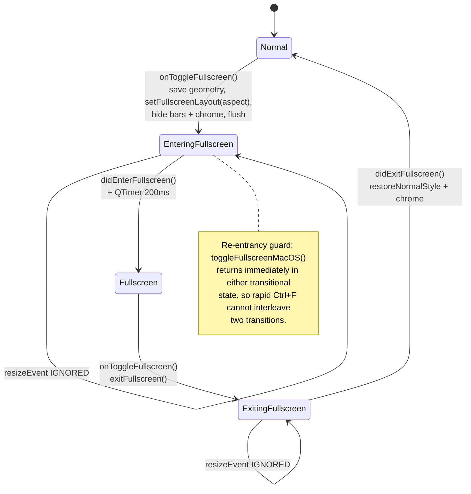

# Glitch-free macOS native fullscreen for a CAMetalLayer-backed Qt window

**Subsystem:** `tools/poc/qt-gui` — macOS fullscreen transition
**Status:** solved. Reference state: git stash `fullscreen-teleport-zoom-clean-v2`
(currently applied to the `new-gui` working tree).
**Primary sources:** `src/platform/macos/FullscreenHelper.{h,mm}`,
`src/platform/macos/MetalScreenWidget.{h,mm}`, `src/MainWindow.{h,cpp}`.
**Companion documents:** [README.md](README.md) (index),
[dead-ends.md](dead-ends.md) (every failed approach and its measured cause),
[diagnostics.md](diagnostics.md) (how to trace this), and
[implementation.md](implementation.md) (the complete quoted code).

---

## 1. Overview / executive summary

### 1.1 What this document describes

The emulator's screen is drawn by Metal into a `CAMetalLayer` that is hosted
directly by the Qt content view (`[view setLayer:...]` + `setWantsLayer:YES`).
Entering and leaving macOS **native** fullscreen — the kind that creates a
separate Space, keeps the menu bar on hover, and shows the green-button
behaviour users expect — must keep that picture **live, correctly positioned and
correctly proportioned** for the whole transition. No frozen snapshot, no drift,
no aspect squash, no flash of garbage.

### 1.2 The core principle

> **The window teleports. Only the layer animates.**

`NSWindow` offers an animation slot during a custom fullscreen transition. We
accept the slot and then decline to use it for the window frame: the window is
moved to its destination in a single non-animated `setFrame:display:NO
animate:NO` call, and the *entire* visible zoom is one `CABasicAnimation` on the
Metal layer's `transform`.

The reason is not aesthetic, it is structural. There are two independent
interpolators in play:

| Interpolator | Runs where | Clock | Curve |
|---|---|---|---|
| `NSWindow`'s `animator` proxy | In-process, AppKit timer on the main run loop | ~55 Hz measured, jitter to 65 ms | AppKit's own, not a documented bezier |
| Core Animation | Out-of-process, in the render server | Display refresh, driven by the compositor | The `CAMediaTimingFunction` we set |

Two interpolations of the same motion agree **only at the endpoints**. Every
"content slides off to the bottom right" artefact in this investigation was that
disagreement made visible. Removing one interpolator removes the entire class of
bug. Since we cannot remove Core Animation (the layer *is* Core Animation) and
we cannot make AppKit's animator frame-accurate, we remove AppKit's animator by
never asking it to animate anything.

### 1.3 What the reader should take away

1. Returning the window from `customWindowsToEnterFullScreenForWindow:` is the
   switch that turns off AppKit's snapshot zoom. Everything else in this design
   exists because that switch was flipped.
2. Geometry ownership of the Metal layer is **exclusive and time-sliced**: Qt
   owns it, then the zoom owns it, then Qt owns it again. Overlap is the bug.
3. Every window-side change and its matching layer-side change must land in the
   **same** `CATransaction`, and on exit inside `NSDisableScreenUpdates` as well.
   Split them and the eye sees the ~30 ms between them.
4. Handoff is **event-driven and idempotent**, because AppKit does not honour the
   duration it hands us — measured finishing **576 ms early**.

---

## 2. Background: how macOS native fullscreen actually works

### 2.1 Spaces

Native fullscreen is not "a big window". `-[NSWindow toggleFullScreen:]` asks the
window server to construct a **new Space** — a separate virtual desktop — move
the window into it, and switch the display to it. The window's `styleMask` gains
`NSWindowStyleMaskFullScreen`, the Dock and menu bar become auto-hiding, and the
Mission Control model of the machine changes. Tearing that Space down again on
exit is real work performed by the window server, and it is the origin of the
irreducible costs listed in §10.

### 2.2 The default animation, and why it is not acceptable here

By default AppKit animates the transition by taking a **bitmap snapshot** of the
window, zooming the snapshot, and swapping the live window in at the end. This
is genuinely seamless — it is what Safari and VLC do — and it is the *correct*
choice for most applications. It is unacceptable for an emulator front-end for
exactly one reason: the picture is a still image for the duration. A running
machine visibly stops.

### 2.3 The custom-animation delegate protocol

`NSWindowDelegate` exposes an opt-out. Four methods matter:

| Method | Called when | What our implementation does |
|---|---|---|
| `customWindowsToEnterFullScreenForWindow:` | Just before entering; AppKit asks which windows *we* will animate | Saves `_originalFrame` / `_originalContentRect` **while the styleMask is still the windowed one**, and returns `@[window]` |
| `window:startCustomAnimationToEnterFullScreenWithDuration:` | Immediately after; the window is already resident in the new Space's coordinate context | Teleports the window and starts the layer animation, in one commit |
| `customWindowsToExitFullScreenForWindow:` | Symmetric, on exit | Returns `@[window]` |
| `window:startCustomAnimationToExitFullScreenWithDuration:` | Symmetric, on exit | Starts the reverse layer animation and *defers* the teleport to the end |

**What returning the window means.** Returning a non-empty array is a contract:
"do not snapshot-zoom these windows, I will animate them myself." AppKit stops
producing the bitmap and leaves the real, live window on screen throughout. This
single fact is what makes a live picture possible at all — and it is also why
every subsequent problem in this document exists, because we have now taken
responsibility for correctness that AppKit previously guaranteed.

**What AppKit does with snapshots anyway.** Even with a custom animation, AppKit
captures the window's appearance at toggle time for other purposes (the Mission
Control thumbnail, the cross-Space transition). If the toolbar, menu bar or
title bar are still visible at that instant, they are baked into that capture and
appear on top of our transition. Hence the pre-toggle chrome flush in §6.1
step 1–3.

**AppKit is not bound by the duration it gives us.** The `duration` argument is
advisory in both directions. Tracing showed AppKit completing its own side and
firing `windowDidEnterFullScreen:` / `windowDidExitFullScreen:` **576 ms before**
a `dispatch_after` scheduled on that duration. Any design that treats the
duration as authoritative will be wrong by roughly half a second.

### 2.4 Why a Qt application is a hard case

Three properties of the Qt/AppKit boundary compound the difficulty:

| Property | Consequence |
|---|---|
| **The Metal layer is layer-*hosting*, not layer-*backed*** (`[view setLayer:]` before `setWantsLayer:YES`) | AppKit does not manage the layer's geometry for us, and `NSView.layerContentsPlacement` **does not apply** to a hosting view's own layer. `CAMetalLayer` simply stretches the drawable to the bounds. |
| **Qt owns child-view geometry, asynchronously** | Qt's widget sizes lag AppKit by one or more ticks during a transition. Reading `QWidget::width()` mid-transition returns a stale value; even `NSView.bounds` is stale at finalization time (§10.3). |
| **Qt installs its own `QNSWindowDelegate`** | Ours must replace it and forward everything it does not override via `respondsToSelector:` + `forwardingTargetForSelector:`, or Qt stops receiving window lifecycle events — the visible symptom is that closing the window no longer quits the app (F13). |

Additionally, the render loop is a `CVDisplayLink` running on its **own thread**
(the VLC/IINA/MoltenVK pattern), which was adopted precisely because the main
thread is monopolised by AppKit during a Space switch. That introduces the
threading constraints in §8.

---

## 3. Problem statement

### 3.1 Requirements

| # | Requirement | Acceptance |
|---|---|---|
| R1 | Native fullscreen semantics are preserved | A real Space is created; menu bar reveals on hover; green button and `Ctrl+F`/`F11` both work |
| R2 | The emulator picture is live throughout | No interval in which the same frame is shown twice at 60 Hz for a perceptible time |
| R3 | The picture never changes aspect ratio | Content-to-content uniform scale at every instant, not just at the endpoints |
| R4 | The picture never leaves its correct position | No drift, no slide, no jump at either endpoint |
| R5 | No visual garbage | No stale-drawable crop, no flash of the pre-transition chrome, no black frames |
| R6 | The transition is monotonic | Exactly one motion; no "there and back" corrections |
| R7 | Keyboard survives the transition | First responder is the Qt view afterwards; no stuck ZX modifier |
| R8 | Qt window lifecycle keeps working | Closing the window still quits the app |

### 3.2 Non-goals

| Non-goal | Rationale |
|---|---|
| Removing the AppKit Space teardown cost (~576 ms) | Not removable from inside a Space. Every attempt to act before AppKit reports its state broke either the coordinates or the first animation frames (§10.1). |
| A borderless non-Space "fake" fullscreen | Would remove every timing problem, because AppKit would not participate — but the result is not a separate Space. **Rejected as a product decision, not a technical one.** |
| Matching AppKit's default animation curve exactly | We use `kCAMediaTimingFunctionEaseInEaseOut`; visually close enough, and irrelevant because nothing else is animating against it. |
| Windows and Linux parity | `MainWindow` has separate `toggleFullscreenWindows()` / `toggleFullscreenLinux()` paths that use plain `showFullScreen()`. This document covers macOS only. |
| Multi-monitor drag-between-screens during a transition | Untested. Unknown behaviour. |

---

## 4. Design principles derived from measurement

Each principle is a generalisation of a specific measured failure. They are
stated as rules because the code enforces them as rules.

| # | Principle | How the code enforces it | The measured failure it generalises |
|---|---|---|---|
| **P1** | **One animator.** Never let two systems interpolate the same motion. | The window frame is only ever set with `animate:NO`; the layer transform changes either instantaneously (inside `setDisableActions:YES`) or via exactly one `CABasicAnimation` keyed `@"fsZoom"`. | Animating the window with `[[window animator] setFrame:]` while the renderer chased it produced drift that matched only at the endpoints. |
| **P2** | **Single source of geometry truth.** The viewport math and the zoom math must be the same function. | `zoomContentRect()` reproduces `render()`'s viewport computation exactly; the transform is derived from two calls to it. | Any divergence shifts the picture at the animation's endpoints — a snap precisely where the user is looking. |
| **P3** | **Atomicity of window + layer changes.** They must reach the screen in one commit. | One `CATransaction` per handoff; on exit additionally wrapped in `NSDisableScreenUpdates()`. | The layer settled ~30 ms before the window move landed: a small rectangle drawn at the fullscreen window's origin, i.e. the screen's top-left corner. |
| **P4** | **Event-driven, idempotent handoff.** Multiple triggers, exactly one execution, before any observable callback. | `_zoomFinished` latch in `finishZoomForWindow:`, invoked from both the timer and the AppKit notification. | Waiting only for our timer left an un-teleported fullscreen-sized window that Qt read as "maximized" (phantom 3840×2055 frame) with the transform still attached. |
| **P5** | **Do not trust anything that lags.** | Real geometry is read from the authoritative side at the authoritative moment, or passed explicitly. | Qt widget sizes, off-thread `presentationLayer`, `NSView.bounds` at finalization, and AppKit's advertised duration are all documented liars ([diagnostics.md](diagnostics.md)). |
| **P6** | **Do the expensive, visible work before the transition starts.** | Bars hidden, `layout()->activate()`, `repaint()` and `[CATransaction flush]` all run synchronously before `toggleFullScreen:`. | Asynchronous relayout left old chrome baked into AppKit's capture, floating on top of the transition. |

---

## 5. Architecture

### 5.1 Component responsibilities

| Component | File | Owns | Explicitly does **not** |
|---|---|---|---|
| `FullscreenWindowDelegate` (Obj-C, private) | `FullscreenHelper.mm` | The `NSWindowDelegate` contract; saving/restoring window frames; the teleport; finalization idempotency; forwarding to Qt's delegate | Touch the Metal layer, or know what a drawable is |
| `FullscreenHelper` (C++ namespace) | `FullscreenHelper.{h,mm}` | Install/uninstall; `enterFullscreen`/`exitFullscreen`; chrome hide/restore; `flushGraphics`; `ensureKeyboardFocus`; the `Delegate` interface | Hold any transition state |
| `MainWindow` | `MainWindow.{h,cpp}` | The application-level state machine (`FullscreenState`); Qt chrome (menu/tool/status bars, palette); translating `zoomStarted`/`zoomFinished` into renderer calls; geometry restore | Compute any zoom geometry itself — it forwards the numbers verbatim |
| `MetalScreenWidget` | `MetalScreenWidget.{h,mm}` | The `CAMetalLayer`, its `frame`/`drawableSize`/`transform`; the letterbox math; `prepareZoom`/`animateZoom`/`endZoom`; both present paths; the `CVDisplayLink` | Know anything about `NSWindow`, Spaces, or fullscreen state — it only knows "a zoom is active" |
| `EmulatorWidget` | `emulator/EmulatorWidget.{h,cpp}` | Releasing held ZX keys at `willEnter`/`willExitFullscreen` (§10.5) | Anything graphical |

The dependency direction is strictly one-way: `FullscreenHelper` knows only the
abstract `Delegate`; `MainWindow` implements it; only `MainWindow` talks to
`MetalScreenWidget`. That is why the renderer has no fullscreen concepts in it
and can be unit-reasoned about with a single boolean, `m_zoomActive`.



### 5.2 Ownership of layer geometry over time

This is the single most important invariant in the subsystem. `m_zoomActive` is
the token; whoever holds it may write `metalLayer.frame`, `.drawableSize` and
`.transform`, and nobody else may.

| Phase | Owner | Enforcement |
|---|---|---|
| Idle / interactive resize | Qt, via `resizeEvent` → `updateDrawableSize()` | `m_zoomActive == false` |
| `prepareZoom()` … `endZoom()` | The zoom | `m_zoomActive == true`; **both** `updateDrawableSize()` and `resizeEvent()` early-return |
| After `endZoom()` | Qt again | `m_zoomActive` cleared as the *first* statement of `endZoom()`, before the settle transaction |

Two guards are required, not one, because they block different routes.
`updateDrawableSize()` opens with `if (m_zoomActive.load(...)) return;` —
*"while the zoom owns the layer nobody else touches its geometry"* — which
covers every caller of it. `resizeEvent()` needs its own, because it also
renders:

```objc
void MetalScreenWidget::resizeEvent(QResizeEvent* event)
{
    QWidget::resizeEvent(event);
    // During the zoom the layer is driven by the CA animation only; AppKit
    // reframes the window several times around the transition and rendering
    // those would fight the animation.
    if (m_zoomActive.load(std::memory_order_relaxed)) {
        emit resized(event->size());
        return;
    }
    updateDrawableSize();
    render(true);
    emit resized(event->size());
}
```

`resizeEvent` still emits `resized()` while frozen — listeners (the zoom-menu
check) care about the logical size and must not be starved — it just performs no
drawable churn and no render. The `render(true)` on the normal path is
transaction-tied, so a freshly-sized frame lands in the same `CATransaction` as
the geometry change; that is what keeps content glued to the window edges during
ordinary live resize. `m_zoomActive` is `std::atomic<bool>` with relaxed
ordering: it is read from the `CVDisplayLink` thread too, and relaxed suffices
because it is a pure advisory gate that publishes no data.

### 5.3 State machines

`MainWindow` tracks the application-visible state; `FullscreenWindowDelegate`
tracks the finalization state. They are deliberately separate.



The `resizeEvent` suppression in the transitional states is at the `MainWindow`
level and is separate from the renderer's `m_zoomActive` freeze — it prevents
Qt-level relayout churn (which would reflow the bars and the content frame),
whereas `m_zoomActive` prevents layer writes. Both are needed; neither implies
the other.

The delegate's own state is a two-variable machine:

| Variable | Meaning | Enter | Exit |
|---|---|---|---|
| `_zoomFinished` | Idempotency latch for `finishZoomForWindow:` | Set `NO` at animation start, `YES` on first finish | same |
| `_pendingTeleport` | Frame to jump to *at the end* | `NSZeroRect` — enter teleports immediately | `_originalFrame` — exit teleports at the end |

`_pendingTeleport == NSZeroRect` is the flag that says "no teleport is owed",
which is why the same `finishZoomForWindow:` body serves both directions.

---

## 6. The enter sequence

### 6.1 Diagram

```mermaid
sequenceDiagram
    autonumber
    participant U as User
    participant MW as MainWindow
    participant FH as FullscreenWindowDelegate
    participant AK as AppKit / window server
    participant ML as MetalScreenWidget

    U->>MW: Ctrl+F / F11 / green button
    MW->>MW: guard: already transitioning? → return
    MW->>MW: save m_normalGeometry, state = EnteringFullscreen
    MW->>ML: setFullscreenLayout(screenAspect)
    MW->>ML: setAnimating(true)
    MW->>MW: applyFullscreenStyle() — hide menu/tool/status, black palette
    MW->>FH: hideWindowChrome() — buttons, title, black bg (styleMask untouched)
    MW->>MW: layout()->activate(); repaint()
    MW->>AK: flushGraphics() — [CATransaction flush]
    Note over MW,AK: 50 ms: one run-loop turn so the window server<br/>picks up the chrome-less frame
    MW->>AK: toggleFullScreen:

    AK->>FH: customWindowsToEnterFullScreenForWindow:
    FH->>FH: save _originalFrame / _originalContentRect<br/>(styleMask is still the windowed one)
    FH-->>AK: @[window] — do NOT snapshot-zoom

    AK->>FH: startCustomAnimationToEnterFullScreenWithDuration:

    rect rgb(228, 244, 228)
    Note over FH,ML: ONE CATransaction, setDisableActions:YES
    FH->>AK: setFrame:screenFrame display:NO animate:NO  ← TELEPORT
    FH->>FH: compute fromX / fromYTop (flipped)
    FH->>MW: zoomStarted(dur, 3840, 2160, fromX, fromY, oldW, oldH, reverse=NO)
    MW->>ML: prepareZoom(layerSize, contentBox) — freeze + static transform
    ML->>ML: render(false) — one frame at the new layout
    MW->>ML: animateZoom(fromRect, dur, reverse=NO)
    ML->>ML: model transform := identity; add CABasicAnimation "fsZoom"
    end

    FH->>FH: dispatch_after(dur + 0.03) → finishZoom(reason="timer")
    AK-->>FH: windowDidEnterFullScreen: (measured ~576 ms EARLY)
    FH->>FH: finishZoom(reason="didEnterFullScreen") — first one wins
    FH->>MW: zoomFinished() → endZoom()
    FH->>MW: didEnterFullscreen()
    MW->>ML: setAnimating(false)
    MW->>MW: 200/700/1500 ms: state = Fullscreen, ensureKeyboardFocus
```

### 6.2 Step-by-step, with reasons

**1–3. Guard, save, set state.** `toggleFullscreenMacOS()` returns immediately if
`m_fullscreenState` is either transitional value. Without it, a second `Ctrl+F`
during the ~1 s transition would start an exit mid-enter and overwrite
`_originalFrame` with the fullscreen frame — after which the window "restores" to
fullscreen forever.

**4. `setFullscreenLayout(screenAspect)`** tells `render()` to letterbox inside a
frame of the *screen's* aspect ratio rather than the widget's. Set **before** the
transition, so the first frame drawn at the new layout (the one from
`prepareZoom`) already matches the final fullscreen composition. Set after, the
animation's endpoints would disagree and snap.

**5–8. Chrome removal, synchronously.** The source comment states the requirement
precisely:

```cpp
// Hide the bars and commit the bar-less black layout to the window
// server BEFORE toggleFullScreen: AppKit snapshots the window for the
// zoom animation immediately, and an async relayout would leave the
// OLD chrome (title/toolbar/status) baked into that snapshot, visible
// on top of the transition until it ends.
m_screen->setAnimating(true);
applyFullscreenStyle();
FullscreenHelper::hideWindowChrome(windowHandle());
if (layout())
    layout()->activate();   // synchronous relayout
repaint();                  // synchronous paint of remaining widgets
FullscreenHelper::flushGraphics();  // [CATransaction flush]
```

Three things are load-bearing. `layout()->activate()` forces the relayout **now**
rather than at the next event-loop iteration, which would be after
`toggleFullScreen:` has already captured the window. `repaint()` — not `update()`
— paints synchronously. `flushGraphics()` is `[CATransaction flush]`, pushing the
resulting layer tree to the window server instead of waiting for the run loop's
own commit.

`hideWindowChrome()` batches the button/title/background changes into one
non-animated `NSAnimationContext` + `CATransaction` group and deliberately **does
not touch the `styleMask`** — its source comment records that
`NSWindowStyleMaskFullSizeContentView` set here *"leaks through the Space
transition and breaks the responder chain"*, i.e. the keyboard stops working. The
separate `hideTitleBar()` helper, which does set it, is not used on this path.

**9. The 50 ms timer.** One run-loop turn for the window server to pick up the
chrome-less frame before the toggle. This is acknowledged debt (§10.2) — the
synchronous `activate()` + `repaint()` + `flush()` triple *should* make it
unnecessary, but that has not been verified.

**11–13. `customWindowsToEnterFullScreenForWindow:`** — three lines, all of them
load-bearing:

```objc
// Save frames while the styleMask is still the windowed one
_originalFrame = [window frame];
_originalContentRect = [window contentRectForFrameRect:_originalFrame];

return @[window];
```

The save must happen *here*: once `NSWindowStyleMaskFullScreen` is applied,
`contentRectForFrameRect:` uses fullscreen insets (no title bar) and returns the
wrong content rect for a windowed frame. Both rects are kept — `_originalFrame`
is the exit teleport target, `_originalContentRect` feeds the geometry math.
Conflating them costs 28 px (§7.5).

**15–20. Teleport and animation start, in one commit.** From the source:

```objc
// Teleport + animation start in ONE commit: no frame may show the layer
// full-size at identity before the animation is attached.
[CATransaction begin];
[CATransaction setDisableActions:YES];

[window setFrame:screenFrame display:NO animate:NO];
NSRect newContent = [window contentRectForFrameRect:screenFrame];

// Where the old content sits inside the new content area (flipped coords)
CGFloat fromX = oldContent.origin.x - newContent.origin.x;
CGFloat fromYTop = (newContent.origin.y + newContent.size.height)
                 - (oldContent.origin.y + oldContent.size.height);

if (_delegate) {
    _delegate->zoomStarted(animDuration,
                           (int)newContent.size.width, (int)newContent.size.height,
                           (int)fromX, (int)fromYTop,
                           (int)oldContent.size.width, (int)oldContent.size.height,
                           false);
}
[CATransaction commit];
```

`setDisableActions:YES` suppresses Core Animation's *implicit* animations on
every property touched inside the block — without it, changing `layer.frame`
inside `prepareZoom` would itself animate over the default 0.25 s, adding a
third interpolator. `display:NO` avoids a synchronous window-server round trip.

**17–19. `prepareZoom` — freeze and pre-place.** The window is now fullscreen but
the picture must still *appear* small. `prepareZoom` resizes the layer to the
fullscreen content size and simultaneously applies a **static** transform that
maps the now-huge content back onto the rectangle it occupied a moment ago:

```objc
@autoreleasepool {
    CGFloat scale = devicePixelRatioF();
    [CATransaction begin];
    [CATransaction setDisableActions:YES];
    m_impl->metalLayer.frame = CGRectMake(0, 0, layerSize.width(), layerSize.height());
    m_impl->metalLayer.drawableSize =
        CGSizeMake(layerSize.width() * scale, layerSize.height() * scale);
    // Static transform: the oversized layer already appears exactly where
    // the content is now, so switching to the zoom layout is invisible.
    m_impl->metalLayer.transform =
        contentBox.isEmpty() ? CATransform3DIdentity : zoomTransformFor(contentBox);
    [CATransaction commit];
}

m_zoomActive.store(true, std::memory_order_relaxed);
render(false);   // one frame at the new layout, plain async present
```

Without the static transform there is a one-frame **pop** — the oversized layer
at full size for exactly one frame before the animation's first interpolated
value arrives. The trailing `render(false)` fills the freshly reallocated
3840×2160 drawable, whose contents would otherwise be undefined; it uses the
*async* path because a `waitUntilScheduled` inside AppKit's callback would block
the main thread while the compositor is mid-Space-switch (`nextDrawable`
measured up to ~680 ms there). Ordering: `m_zoomActive` is set **after** the
geometry transaction — the zoom writes that geometry itself and must not be
blocked by its own guard — but **before** the render.

**20. `animateZoom` — the single animator.**

```objc
CATransform3D small = zoomTransformFor(fromRect);

// Model goes to its final value immediately; the animation only drives
// presentation. One animator (the render server) — nothing to desync.
[CATransaction begin];
[CATransaction setDisableActions:YES];
m_impl->metalLayer.transform = reverse ? small : CATransform3DIdentity;
[CATransaction commit];

CABasicAnimation* a = [CABasicAnimation animationWithKeyPath:@"transform"];
a.fromValue = [NSValue valueWithCATransform3D:(reverse ? CATransform3DIdentity : small)];
a.toValue = [NSValue valueWithCATransform3D:(reverse ? small : CATransform3DIdentity)];
a.duration = duration > 0 ? duration : 0.4;
a.timingFunction =
    [CAMediaTimingFunction functionWithName:kCAMediaTimingFunctionEaseInEaseOut];
a.removedOnCompletion = NO;
a.fillMode = kCAFillModeForwards;
[m_impl->metalLayer addAnimation:a forKey:@"fsZoom"];
```

Four deliberate choices:

| Choice | Why |
|---|---|
| Model value set to the **final** state up front | If the model stayed at the start value, removing the animation would snap back. Setting it first means the model is already correct and the animation is purely presentational. |
| `removedOnCompletion = NO` + `fillMode = Forwards` | Holds the end state visually until `endZoom()` explicitly removes it. Belt and braces given the model is already final; it also covers the case where AppKit's clock and ours disagree. |
| Keyed `@"fsZoom"` | `endZoom()` removes it by that exact key, so an unrelated animation on the layer would survive. |
| `duration > 0 ? duration : 0.4` | AppKit has been observed to pass 0. |

**21–24. Finalization.** Covered in §6.4 — it is identical for both directions.

### 6.3 The exit sequence

```mermaid
sequenceDiagram
    autonumber
    participant U as User
    participant MW as MainWindow
    participant FH as FullscreenWindowDelegate
    participant AK as AppKit / window server
    participant ML as MetalScreenWidget

    U->>MW: Ctrl+F / F11 / green button
    MW->>MW: state = ExitingFullscreen
    MW->>AK: exitFullscreen() → toggleFullScreen:

    AK->>FH: windowWillExitFullScreen:
    FH->>MW: willExitFullscreen()
    MW->>ML: setFullscreenLayout(0) — back to widget-aspect letterboxing
    MW->>MW: emulator->releaseAllKeys()
    MW->>ML: setAnimating(true)

    AK->>FH: customWindowsToExitFullScreenForWindow: → @[window]
    AK->>FH: startCustomAnimationToExitFullScreenWithDuration:

    rect rgb(244, 236, 236)
    Note over FH,ML: ONE CATransaction — NO teleport yet
    FH->>FH: targetFrame = _originalFrame; _pendingTeleport = targetFrame
    FH->>FH: compute toX / toYTop from the CURRENT (fullscreen) content rect
    FH->>MW: zoomStarted(dur, 3840, 2160, toX, toY, targetW, targetH, reverse=YES)
    MW->>ML: prepareZoom(layerSize, QRect()) — identity, just freeze
    MW->>ML: animateZoom(toRect, dur, reverse=YES) — identity → small
    end

    Note over FH: window stays FULLSCREEN for the whole zoom:<br/>a shrinking picture needs a big window to live in

    par whichever fires first
        FH->>FH: dispatch_after(dur + 0.03) → finishZoom("timer")
    and
        AK-->>FH: windowDidExitFullScreen: → finishZoom("didExitFullScreen")
    end

    rect rgb(236, 236, 244)
    Note over FH,ML: NSDisableScreenUpdates + ONE CATransaction
    FH->>AK: setFrame:_pendingTeleport display:NO animate:NO ← TELEPORT
    FH->>MW: zoomFinished() → endZoom() (settle + render inside the transaction)
    end

    FH->>MW: didExitFullscreen()
    MW->>ML: setAnimating(false)
    MW->>MW: state = Normal; restoreNormalStyle(); restoreWindowChrome()
    MW->>MW: QTimer 0 ms: setGeometry(m_normalGeometry); ensureKeyboardFocus
```

**Why exit is not simply enter reversed.** In *both* directions the window must
be big for the whole animation, because in both directions the picture is
small-looking inside a big window at one end. Enter therefore teleports first and
exit teleports last. Were exit to teleport first, the layer would be clipped to
the small window and the large end of the animation would be invisible.

**Why `setFullscreenLayout(0)` fires in `willExitFullscreen` and not later.** The
reverse animation's small end must be computed with the *windowed* letterbox
rule, since that is how the content will actually be laid out afterwards.
Resetting it mid-animation would change the meaning of the transform in flight.

**Why the rects are in fullscreen coordinates.** The contract in
`FullscreenHelper.h` — *"animate the layer from/to the given rect (in the
coordinates of the window during the zoom)"* — resolves to the **fullscreen**
window in both directions: on exit because the teleport is deferred, on enter
because the teleport has already happened. The layer is fullscreen-sized while
animating either way, which is why one renderer implementation serves both.

**Why `prepareZoom(..., QRect())` on exit.** The layer is already at the correct
fullscreen geometry and identity transform; an empty content box means "apply
identity", i.e. change nothing visually. The call is still made because it is
what sets `m_zoomActive` and freezes the geometry.

### 6.4 Finalization — shared by both directions

```objc
// Idempotent: runs on whichever trigger comes first — our timer or AppKit's
// own did-enter/did-exit. AppKit does NOT honour our duration (traced: it
// finished 576ms before our timer), so waiting only for the timer left the
// window un-teleported with the zoom transform still attached.
- (void)finishZoomForWindow:(NSWindow*)window reason:(const char*)reason
{
    if (_zoomFinished)
        return;
    _zoomFinished = YES;

    FS_LOG("zoom finish (" << reason << ")");

    // Teleport (exit only) and layer settle must reach the screen together
    NSDisableScreenUpdates();
    [CATransaction begin];
    [CATransaction setDisableActions:YES];
    if (!NSEqualRects(_pendingTeleport, NSZeroRect))
        [window setFrame:_pendingTeleport display:NO animate:NO];
    if (_delegate)
        _delegate->zoomFinished();
    [CATransaction commit];
    NSEnableScreenUpdates();

    _pendingTeleport = NSZeroRect;
}
```

| Element | Why it is exactly this |
|---|---|
| `_zoomFinished` latch | Two triggers, one execution. Running twice would remove an already-removed animation and re-teleport an already-teleported window. |
| `NSDisableScreenUpdates()` | The window move and the layer settle travel to the window server by different routes and were measured landing ~30 ms apart. The lock makes them appear together. |
| `display:NO` | With `display:YES` the same lock froze the whole display for **400–690 ms**, because `setFrame:display:YES` blocks on a window server that is busy tearing the Space down. |
| **No** `[CATransaction flush]` | Same reason — a flush blocks on the same busy server. The transaction commits normally on the run loop. |
| Called **before** `didEnter/didExitFullscreen` | Those callbacks let `MainWindow` relayout and restore chrome. If the zoom were still attached at that point, Qt would compute geometry against a transformed layer. |

Both `windowDidEnterFullScreen:` and `windowDidExitFullScreen:` call
`finishZoomForWindow:` as their **first** statement, before forwarding
`didEnterFullscreen()` / `didExitFullscreen()` to the C++ delegate.

**`endZoom()` — settle atomically.**

```objc
m_zoomActive.store(false, std::memory_order_relaxed);

@autoreleasepool {
    NSView* view = (__bridge NSView*)(void*)winId();
    NSRect vb = [view bounds];           // Qt's size still lags here
    CGFloat scale = devicePixelRatioF();

    [CATransaction begin];
    [CATransaction setDisableActions:YES];
    [m_impl->metalLayer removeAnimationForKey:@"fsZoom"];
    m_impl->metalLayer.transform = CATransform3DIdentity;
    if (vb.size.width > 0 && vb.size.height > 0) {
        m_impl->metalLayer.frame = CGRectMake(0, 0, vb.size.width, vb.size.height);
        m_impl->metalLayer.drawableSize =
            CGSizeMake(vb.size.width * scale, vb.size.height * scale);
    }

    // Draw the first frame at the new size INSIDE this transaction, with a
    // transaction-tied present. Rendering after the commit left the layer
    // already small while its contents were still the old full-screen
    // drawable: TopLeft placement showed that as a garbage crop in the top
    // left corner, and the real frame arriving a moment later read as a
    // jump there and back.
    render(true);

    [CATransaction commit];
}
```

`render(true)` selects the synchronous path, binding the present to *this*
transaction. This is the one place where blocking is correct — the alternative is
a visible garbage frame. Note the `NSView.bounds` read and its comment: §10.3
explains why that line is the obstacle to removing the last hardcoded timer.

### 6.5 The two present paths

```objc
[encoder endEncoding];
if (syncPresent) {
    m_impl->metalLayer.presentsWithTransaction = YES;
    [cmdBuffer commit];
    [cmdBuffer waitUntilScheduled];
    [drawable present];
} else {
    m_impl->metalLayer.presentsWithTransaction = NO;
    [cmdBuffer presentDrawable:drawable];
    [cmdBuffer commit];
}
```

| Path | `presentsWithTransaction` | Blocking | Caller | Used for |
|---|---|---|---|---|
| Sync | `YES` | `waitUntilScheduled`, measured 10–50 ms under load | Main thread only | `resizeEvent` (normal path), `endZoom` |
| Async | `NO` | Never | Any thread | `CVDisplayLink` callback, `prepareZoom`, emulator frame updates |

The per-frame toggle is the SDL2 pattern. Calling the sync path off the main
thread, or during the Space switch, is what produced the 7 fps and ~680 ms
`nextDrawable` measurements in [dead-ends.md](dead-ends.md).

---

## 7. Coordinate systems

### 7.1 The three spaces involved

| Space | Origin | Y direction | Used by |
|---|---|---|---|
| AppKit screen coordinates | Bottom-left of the primary display | Up | `NSWindow.frame`, `NSScreen.frame`, `contentRectForFrameRect:` |
| Qt / flipped view coordinates | Top-left of the view | Down | `QRect` arguments to `zoomStarted`, `NSView.bounds` on a flipped view |
| Layer coordinates | Layer's own `bounds` origin | Follows the host view (down, here) | `metalLayer.bounds`, `transform` |

The Qt content view is **flipped**, so view and layer coordinates both run
top-down. That is why the delegate converts once, at the boundary, and everything
downstream is uniformly top-down.

### 7.2 The flip conversion

```objc
CGFloat fromX = oldContent.origin.x - newContent.origin.x;
CGFloat fromYTop = (newContent.origin.y + newContent.size.height)
                 - (oldContent.origin.y + oldContent.size.height);
```

`fromX` is a plain difference — X needs no flip. `fromYTop` is
`top(new) − top(old)` where `top(r) = r.origin.y + r.size.height` in AppKit's
bottom-up coordinates: the distance from the top edge of the new content area
down to the top edge of the old one, i.e. a top-down offset ready for layer
space. The exit path computes the mirror, `curContent` → `targetContent`, with
the same expression. Both are truncated to `int` when passed through
`zoomStarted`; the resulting sub-pixel error of up to 1 px is accepted in
exchange for keeping the `Delegate` interface free of platform types.

### 7.3 Why `anchorPoint (0,0)` and frame origin `(0,0)` matter

The layer's frame origin is set to `(0,0)` everywhere it is set — in
`updateDrawableSize`, in `prepareZoom`, and in `endZoom`. With `anchorPoint` at
`(0,0)` (top-left, on a flipped host) and a frame origin of `(0,0)`, layer
coordinates *are* window-content coordinates, and a `CATransform3D` built as
"scale about the top-left, then translate" is a complete description of the
motion. `position` never has to move, which removes an entire property from the
animation and therefore an entire opportunity for desync.

### 7.4 The content-to-content uniform scale

The transform must map **content onto content**, not box onto box. A box-to-box
scale (`sx = fromW/layerW`, `sy = fromH/layerH`) squashes the picture whenever
the window aspect differs from the screen aspect — which is essentially always.

The letterbox rect of the content inside a box is computed by a function that
mirrors `render()`'s viewport math exactly:

```objc
// Letterbox rect of the content inside a box — identical math to render()'s
// viewport, so a transform built from these maps content exactly onto content.
static CGRect zoomContentRect(CGFloat boxW, CGFloat boxH,
                              double targetAspect, double contentAspect)
{
    if (boxW <= 0 || boxH <= 0 || contentAspect <= 0)
        return CGRectMake(0, 0, boxW, boxH);

    CGFloat frameW = boxW, frameH = boxH;
    if (targetAspect > 0) {
        if (boxW / boxH > targetAspect) { frameH = boxH; frameW = boxH * targetAspect; }
        else                            { frameW = boxW; frameH = boxW / targetAspect; }
    }
    CGFloat w, h;
    if (contentAspect > (frameW / frameH)) { w = frameW; h = frameW / contentAspect; }
    else                                   { h = frameH; w = frameH * contentAspect; }
    return CGRectMake((boxW - w) / 2, (boxH - h) / 2, w, h);
}
```

It is a two-stage fit. Stage one (only when `targetAspect > 0`, i.e. fullscreen
layout) fits a virtual frame of the target aspect inside the box. Stage two fits
the content inside that frame. Both stages centre.

And the transform:

```objc
CATransform3D MetalScreenWidget::zoomTransformFor(const QRect& rect) const
{
    const double contentAspect = (m_impl->textureWidth > 0 && m_impl->textureHeight > 0)
        ? (double)m_impl->textureWidth / (double)m_impl->textureHeight : 4.0 / 3.0;

    CGRect lb = m_impl->metalLayer.bounds;
    CGRect cLayer = zoomContentRect(lb.size.width, lb.size.height,
                                    m_impl->targetAspect, contentAspect);
    CGRect cSmall = zoomContentRect(rect.width(), rect.height(), 0.0, contentAspect);

    // UNIFORM scale: content-to-content, so the picture never gets squashed
    CGFloat k = (cLayer.size.width > 0) ? (cSmall.size.width / cLayer.size.width) : 1.0;
    CGFloat tx = rect.x() + cSmall.origin.x - k * cLayer.origin.x;
    CGFloat ty = rect.y() + cSmall.origin.y - k * cLayer.origin.y;

    return CATransform3DConcat(CATransform3DMakeScale(k, k, 1),
                               CATransform3DMakeTranslation(tx, ty, 0));
}
```

Derivation. Let `C_L` be the content rect inside the (large) layer and `C_S` the
content rect inside the small box, the small box itself being positioned at
`rect.origin` within layer coordinates. We want a similarity transform
`p ↦ k·p + t` that carries `C_L` onto `C_S` in layer coordinates:

```
k    = width(C_S) / width(C_L)            (uniform — same k for x and y)
t.x  = rect.x + C_S.origin.x − k · C_L.origin.x
t.y  = rect.y + C_S.origin.y − k · C_L.origin.y
```

`CATransform3DConcat(A, B)` applies `A` first, then `B`, so
`Concat(Scale(k), Translate(t))` is exactly `p ↦ k·p + t`. Note that `cSmall` is
computed with `targetAspect = 0`: the small end is the *windowed* layout, which
has no screen-aspect frame.

`k` is derived from widths alone, and because both rects were produced by the
same aspect-preserving function, `height(C_S) / height(C_L)` equals it to within
floating-point error. That is the whole reason the two rects must come from the
same function (principle P2).

### 7.5 Worked numeric example

Given: emulator content **352 × 288**, screen **3840 × 2160**, pre-fullscreen
content area **704 × 605**.

*(The 605 is treated here as the content height. In the real code the
window frame is taller than its content area by the title-bar height — see the
28 px note below.)*

Assume the windowed content rect is horizontally centred and roughly vertically
centred on the screen, at AppKit screen origin `(1568, 778)`.

**Steps 1–3 — aspects and the two content rects.**

```
contentAspect = 352 / 288   = 1.222222
targetAspect  = 3840 / 2160 = 1.777778

cLayer = zoomContentRect(3840, 2160, 1.777778, 1.222222):
    boxW/boxH = 1.777778, not > targetAspect → frameW = 3840, frameH = 2160
    contentAspect (1.2222) > frameW/frameH (1.7778)?  no
        → h = 2160,  w = 2160 × 1.222222 = 2640
    origin = ((3840 − 2640)/2, (2160 − 2160)/2)   = (600, 0)
    cLayer = (600, 0, 2640, 2160)          ← 600 px pillarbox each side

cSmall = zoomContentRect(704, 605, 0.0, 1.222222):
    targetAspect == 0 → frameW = 704, frameH = 605, ratio = 1.163636
    contentAspect (1.222222) > 1.163636?  yes
        → w = 704,  h = 704 / 1.222222 = 576
    origin = ((704 − 704)/2, (605 − 576)/2)       = (0, 14.5)
    cSmall = (0, 14.5, 704, 576)           ← 14.5 px letterbox top and bottom
```

**Step 4 — the offset of the small box in layer coordinates.**

```
newContent = (0, 0, 3840, 2160)          (fullscreen content rect)
oldContent = (1568, 778, 704, 605)

fromX    = 1568 − 0                      = 1568
fromYTop = (0 + 2160) − (778 + 605)      = 777
rect     = (1568, 777, 704, 605)
```

**Step 5 — the transform.**

```
k  = 704 / 2640                          = 0.266667
tx = 1568 + 0    − 0.266667 × 600        = 1568 − 160 = 1408
ty = 777  + 14.5 − 0.266667 × 0          = 791.5
```

**Step 6 — verification.** Apply `p ↦ k·p + t` to `cLayer`:

| Point | Layer coords | Transformed | Expected (`rect.origin + cSmall`) |
|---|---|---|---|
| Content top-left | (600, 0) | (0.2667·600 + 1408, 0.2667·0 + 791.5) = **(1568, 791.5)** | (1568 + 0, 777 + 14.5) = **(1568, 791.5)** ✓ |
| Content size | 2640 × 2160 | 0.2667 × (2640, 2160) = **(704, 576)** | **(704, 576)** ✓ |

The picture lands exactly on the pixels it occupied before the teleport, at
exactly its original size, with no aspect change. That equality at `t = 0` is
what makes the teleport invisible; the animation then interpolates from this
transform to identity, and identity is by construction the correct fullscreen
composition.

**The 28 px trap.** On exit, the teleport target must be `_originalFrame`, not
`_originalContentRect`. Using the content rect made the window 28 px (one title
bar) too short; AppKit noticed and corrected the frame afterwards, producing a
**second, visible jump** after the animation had already finished. The code
guards this explicitly:

```objc
// The window stays fullscreen for the whole zoom and teleports at the end.
NSRect targetFrame = NSEqualRects(_originalFrame, NSZeroRect)
    ? [window frame] : _originalFrame;
NSRect targetContent = NSEqualRects(_originalContentRect, NSZeroRect)
    ? targetFrame : _originalContentRect;
```

`targetFrame` drives the teleport; `targetContent` drives the geometry math. They
are different rects and are used for different things.

---

## 8. Threading model

### 8.1 The threads

| Thread | Created by | Runs |
|---|---|---|
| Main / AppKit thread | The process | Qt event loop, all `NSWindowDelegate` callbacks, `resizeEvent`, `prepareZoom`, `animateZoom`, `endZoom`, all window and layer geometry writes |
| `CVDisplayLink` thread | `CVDisplayLinkCreateWithActiveCGDisplays` in `MetalDisplayLinkHelper` | `MetalScreenWidget::displayLinkCallback()` → `render(false)` |
| Emulator thread(s) | `EmulatorWidget` | `updateFrame()` / `refresh()` texture uploads |

Rendering happens **directly on the display-link thread**, not dispatched to the
main queue. The source records why:

```objc
// Render directly on the CVDisplayLink thread (VLC/IINA/MoltenVK pattern).
// This keeps frames flowing even while the main thread is monopolized by
// AppKit's fullscreen Space transition — the cause of the ~1s render pause
// when rendering was dispatched to the main queue.
```

### 8.2 Synchronisation primitives

| Primitive | Guards | Held during |
|---|---|---|
| `MetalScreenWidget::m_renderMutex` (`std::mutex`) | The whole body of `render()`, the texture upload in `updateFrame()`/`refresh()`, and `cleanupMetal()` | Encoding, commit, and (on the sync path) `waitUntilScheduled` |
| `MetalDisplayLinkHelper::_widgetMutex` (`std::mutex`) | The `_widget` back-pointer | The entire callback, and `stop()` while detaching |
| `m_zoomActive`, `m_animating`, `m_renderingEnabled`, `m_inTransition` (`std::atomic<bool>`) | Advisory gates read from both threads | — |

`_widgetMutex` is a teardown race guard, and the comment on `stop()` states the
contract:

```objc
{
    // Blocks until any in-flight callback finishes, then detaches the widget
    std::lock_guard<std::mutex> lock(_widgetMutex);
    _widget = nullptr;
}
```

Without it, `~MetalScreenWidget` could free the object while a callback was
inside `render()`.

`m_renderMutex` means a texture upload from the emulator thread can never
interleave with encoding, and that the display-link thread and main thread never
encode simultaneously. Since the sync path holds the mutex across
`waitUntilScheduled` (10–50 ms under load), a display-link tick that collides
with a resize simply waits — acceptable, and preferable to a torn frame.

### 8.3 What is safe where

| Call | Main thread | Display-link thread | Note |
|---|---|---|---|
| `render(false)` (async present) | ✔ | ✔ | The normal path |
| `render(true)` (sync, transaction-tied) | ✔ | ✘ | Must be inside a main-thread `CATransaction` |
| `metalLayer.frame` / `.drawableSize` / `.transform` writes | ✔ | ✘ | The display-link callback explicitly documents this: *"No Qt geometry access, no layer.frame changes here — resizeEvent (main thread) owns drawable size updates."* |
| `NSView.bounds`, `winId()`, `devicePixelRatioF()` | ✔ | ✘ | Qt/AppKit APIs |
| `[layer presentationLayer]` | ✔ | ✘ | **Unsynchronised off-thread.** Measured returning 704×522 for a 3840×2160 model. |
| `[window setFrame:...]` | ✔ | ✘ | AppKit |
| Texture upload (`replaceRegion:`) | ✔ | ✔ (emulator thread) | Protected by `m_renderMutex` |

---

## 9. Failure modes and the safeguard for each

| # | Safeguard (where) | Artefact it prevents | Measured evidence |
|---|---|---|---|
| F1 | Window teleports; only the layer's `transform` animates (`startCustomAnimationTo*`) | Content drifting off to the bottom right on enter, mirrored on exit | Two interpolators (AppKit ~55 Hz app-side timer vs. render-server CA) agree only at endpoints |
| F2 | `prepareZoom()` applies a **static** transform before `animateZoom()` | One-frame pop: the oversized layer visible at full size for a single frame | Direct observation; removing the static transform reproduces it |
| F3 | `zoomTransformFor()` uses **uniform** `k` derived content-to-content | Aspect squash whenever window aspect ≠ screen aspect (i.e. always) | Per-axis `sx`/`sy` visibly distorts a 4:3 picture on a 16:9 screen |
| F4 | `zoomContentRect()` duplicates `render()`'s viewport math exactly | Position snap at the animation endpoints | Any divergence shifts the picture where the eye is focused |
| F5 | `m_zoomActive` freeze in **both** `resizeEvent()` and `updateDrawableSize()` | Qt writing layer geometry underneath a running animation | AppKit reframes the window several times around the transition |
| F6 | Idempotent `finishZoomForWindow:` on first-of-two triggers, run **before** the delegate callback | Un-teleported fullscreen-sized window that Qt reads as "maximized" (phantom 3840×2055 frame) with the transform still attached | AppKit finished **576 ms** before our `dispatch_after` |
| F7 | Teleport + settle inside `NSDisableScreenUpdates()` and one `CATransaction` | A small rectangle drawn at the fullscreen window's origin — the screen's top-left corner — for ~2 frames | Layer settled **~30 ms** before the window move reached the screen |
| F8 | `display:NO` on the teleport and **no** `[CATransaction flush]` inside the lock | Whole display frozen, everything appearing at once at the end | With `display:YES` or a flush: **400–690 ms** freeze; the window server is busy tearing the Space down |
| F9 | `endZoom()` renders **inside** the geometry transaction with a transaction-tied present | Garbage crop in the top-left corner on exit | Layer already small while contents were the old fullscreen drawable; `TopLeft` placement showed the crop until the next frame |
| F10 | Chrome hidden + `layout()->activate()` + `repaint()` + `[CATransaction flush]` **before** `toggleFullScreen:` | Old title bar / toolbar / status bar baked into AppKit's capture and floating on top of the transition | Reproducible whenever the relayout is left asynchronous |
| F11 | `hideWindowChrome()` does **not** touch the `styleMask` | `NSWindowStyleMaskFullSizeContentView` leaking through the Space transition and breaking the responder chain (dead keyboard) | Source comment records the measurement |
| F12 | Exit teleports to `_originalFrame`, not `_originalContentRect` | Second visible jump after the animation, as AppKit corrects a 28 px-short window | Title-bar height, reproducible |
| F13 | `respondsToSelector:` + `forwardingTargetForSelector:` to Qt's delegate | Closing the window no longer quits the app (Qt never sees the lifecycle events) | Immediate, deterministic |
| F14 | `EmulatorWidget::releaseAllKeys()` in `willEnter`/`willExitFullscreen` | Stuck `SYM_SHIFT`: Cmd from the `Ctrl+F` shortcut enters the ZX matrix and its release is lost in the transition; keyboard dead until reset | Deterministic on every `Ctrl+F` |
| F15 | Application-level key filter forwards only when `obj == windowHandle()` | Every key delivered four times (once per node of the Qt delivery chain) | Deterministic |
| F16 | `ensureKeyboardFocus()` retried at 200 / 700 / 1500 ms | No keyboard input at all after the first fullscreen enter — AppKit leaves `firstResponder` on a transient chrome view or `nil`, which Qt-level `setFocus()` cannot fix | AppKit can re-steal `firstResponder` after our first restore |
| F17 | `MainWindow::resizeEvent` early-returns in both transitional states | Qt-level relayout churn (bars reflowing) competing with the transition | — |
| F18 | Re-entrancy guard at the top of `toggleFullscreenMacOS()` | A second toggle mid-transition overwriting `_originalFrame` with the fullscreen frame | — |
| F19 | `_widgetMutex` in `MetalDisplayLinkHelper::stop()` | Use-after-free: a callback in flight while the widget is destroyed | — |
| F20 | `setFullscreenLayout(screenAspect)` before the transition, `setFullscreenLayout(0)` in `willExitFullscreen` | Endpoint mismatch: the animation's identity end not matching the actual rendered composition | — |

---

## 10. Remaining costs and technical debt

### 10.1 Irreducible costs (measured on the dev machine)

3840×2160 non-retina display, Qt 6.9, macOS 15.

| Cost | Measured | Status |
|---|---|---|
| AppKit Space teardown after our animation, before `windowDidExitFullScreen` | **~576 ms** | Not removable from inside a Space. Every attempt to act before AppKit reports its state broke either the coordinates or the first animation frames. |
| `restoreNormalStyle()` (three bar `show()`s) during that teardown | **~949 ms** | Slow for the same reason — the window server is busy. Already batched inside `setUpdatesEnabled(false)`/`(true)`. |
| `nextDrawable` when the compositor is mid-Space-switch | up to **~680 ms** | Avoided by never taking the sync path during the switch. |
| `waitUntilScheduled` per synced present under load | **10–50 ms** | Inherent to the sync path; used only where correctness requires it. |
| On-glass latency for a present | **~25 ms** | Inherent. |
| AppKit animator tick rate during a custom window animation | **~55 Hz**, jitter to 65 ms | Irrelevant now — we no longer use the animator. |

Removing the first two requires abandoning Spaces entirely (a borderless
full-screen window). That is a **different feature, not an optimisation**, and it
was rejected as a product decision.

### 10.2 Hardcoded timeouts still in the code

| Location | Current | Event that should replace it | Risk |
|---|---|---|---|
| `FullscreenHelper.mm`, both `startCustomAnimationTo*` | `dispatch_after(animDuration + 0.03)` → `finishZoomForWindow:reason:"timer"` | A `CATransaction` completion block registered around `addAnimation` | **Attempted and reverted — see §10.3** |
| `MainWindow::didEnterFullscreen` | `QTimer::singleShot(200, ...)` before setting `state = Fullscreen` | `windowDidEnterFullScreen:` itself | Low; the 200 ms exists to swallow spurious resizes |
| `MainWindow::didEnterFullscreen` | `QTimer::singleShot(700/1500, ...)` for `ensureKeyboardFocus` | No known event. AppKit re-steals `firstResponder` asynchronously with no notification. | **Unknown** — this may be irreducible |
| `MainWindow::toggleFullscreenMacOS` | `QTimer::singleShot(50, ...)` before `toggleFullScreen:` | Verify that the synchronous `layout()->activate()` + `repaint()` + `flushGraphics()` triple is already sufficient | Low; needs a trace, not a redesign |

Note that the timer is currently the *secondary* trigger in practice: AppKit's
notification fires ~576 ms earlier and wins the idempotency race. The timer is
the safety net for the case where the notification is late or absent, so it
cannot simply be deleted — it must be *replaced*.

### 10.3 The documented trap in replacing the finalization timer

This was implemented, measured and reverted. It is recorded because the idea is
correct and will be tried again.

**Symptom:** Metal jumps to the top-left, still at fullscreen size, and then the
Space disappears.

**Cause:** the `CATransaction` completion block fires when the animation's
transaction completes — which is *before* the teleport has propagated to the
`NSView`. `endZoom()` then executes this line:

```objc
NSRect vb = [view bounds];           // Qt's size still lags here
```

and reads the **stale, fullscreen** bounds. It therefore sets the layer frame and
drawable size back to 3840×2160 at identity — hence "full size, top-left".

**The fix, which must land as one change:** `endZoom()` must take the final size
as an explicit parameter instead of reading it back from the view.
`finishZoomForWindow:` already knows it — it is the size of the frame it has just
set, i.e. `_pendingTeleport` (or the current frame on enter). Concretely:

1. Change the signature to something like `endZoom(const QSize& finalSize)` and
   use `finalSize` in place of `vb.size`, keeping the `NSView.bounds` read only
   as a fallback when `finalSize` is empty.
2. Extend `Delegate::zoomFinished()` to carry that size.
3. Only then replace the `dispatch_after` with a completion block.

Doing (3) without (1) and (2) reproduces the failure exactly.

### 10.4 The display link is silent during a transition — settled

An earlier revision of these notes claimed the opposite, and the first drafts of
this document and of [dead-ends.md](dead-ends.md) were written from that claim.
It was wrong, and the discrepancy has been resolved **in favour of the code**:
the guard stays. See [dead-ends.md](dead-ends.md) §D5a for the full record of
the two removal attempts.

The reference state (`fullscreen-teleport-zoom-clean-v2`) reads:

```objc
void MetalScreenWidget::displayLinkCallback()
{
    // Runs on the CVDisplayLink thread. No Qt geometry access, no layer.frame
    // changes here — resizeEvent (main thread) owns drawable size updates.
    if (!m_animating || !m_metalInitialized)
        return;

    // SILENT during fullscreen transitions (Apple CAMetalLayer-resize sample
    // pattern): the ONLY renders are the synchronous transaction-tied ones
    // from resizeEvent on the main thread — each animation step's CATransaction
    // carries exactly one glued frame. Async presents here would drain the
    // drawable pool (traced: nextDrawable blocking ~1s) and land between
    // transactions, making content swim against the window frame.
    if (m_inTransition)
        return;

    render(false);
}
```

`m_inTransition` is set unconditionally as the first line of `setAnimating()`,
and `setAnimating(true)` is called in `toggleFullscreenMacOS()`,
`willEnterFullscreen()` and `willExitFullscreen()`. The guard is therefore
**active** for the whole transition — and since `resizeEvent` also early-returns
while `m_zoomActive` is set, the only frames produced during the zoom are the
single one from `prepareZoom()` and the single one from `endZoom()`.

**This is settled, and the guard is correct.** It is not residual. Removing it
was tried twice — the second time in isolation, with no other change in the tree
— and rejected both times on a user-visible regression: the zoom becomes
noticeably worse and slower, showing jerky, stale frames.

The tempting argument for removal ("the drawable is frozen and only the
transform moves, so async presents are safe") confuses two different hazards.
Freezing `drawableSize` removes the **resize** hazard that killed the "video
player mode" attempt in [dead-ends.md](dead-ends.md); it does nothing about the
**phase** hazard. The render server interpolates the transform every display
frame, so a present that is not tied to a transaction puts a surface on screen
that no longer matches where the layer currently is.

| | Guard in place — **reference state** | Guard removed |
|---|---|---|
| During the zoom | Smooth; the transform supplies the motion | Jerky, stale frames |
| Dead zones before/after the zoom | Frozen for a few frames | Live |

The consequence for R2 is honest and accepted: the picture is **not** live for
the whole transition. It is live up to the moment the zoom starts and again once
it ends, and during the zoom itself the last rendered frame is transformed
rather than re-rendered. Visually the motion is smooth; the emulator simply does
not advance for those ~0.4 s.

If the dead-zone freeze is ever attacked, the fix is neither async presents nor
a synthetic timer (see D3 on independent frame clocks) — it would have to be
additional *transaction-tied* frames at exactly those moments.

### 10.5 Other debt

| Item | Detail |
|---|---|
| Dead API surface | `FullscreenHelper::setCallbacks()` still takes `screenZoomIn`/`screenZoomOut` `std::function`s, and the delegate stores `_screenZoomIn`/`_screenZoomOut`, `_hideQtUI`, `_showQtUI`, `_originalScreenFrame`. None are invoked any more — the `Delegate` interface replaced them. Removing them would shrink the surface meaningfully. |
| `static bool installed` in `toggleFullscreenMacOS()` | Function-local static, so a second `MainWindow` would never get a delegate installed. Fine for a single-window PoC; a latent bug otherwise. |
| `hideTitleBar()` / `showTitleBar()` | Unused on the fullscreen path (they touch the `styleMask`, see F11) but still exported. Their presence invites the F11 bug. |
| `setRenderingEnabled()` | Declared as "block all rendering during fullscreen transitions" but not used by the transition path. |
| `NSViewLayerContentsPlacement` toggling in `setAnimating()` | Documented as a "safety net for animation frames BETWEEN our synced presents". With the teleport design there are no intermediate synced presents, so it may be residual. Unverified — and note that the analogous "obviously residual" argument about the display-link guard turned out to be wrong twice (§10.4), so test in isolation before removing. |
| Multi-monitor | Untested. `[window screen] ?: [NSScreen mainScreen]` is the only screen selection, evaluated once at animation start. |
| Retina | `devicePixelRatioF()` is applied consistently, but all measurements were taken on a **non-retina** 3840×2160 display. Retina behaviour is unverified. |

---

## 11. Testing and verification checklist

### 11.1 Instrumentation

```bash
./build/unreal-ng-ui.app/Contents/MacOS/unreal-ng-ui > fullscreen-trace.log 2>&1 &
```

Tags: `[FS]` (delegate / AppKit callbacks), `[MW]` (MainWindow state machine),
`[EV]` (renderer events). All lines are prefixed with
`QDateTime::currentMSecsSinceEpoch()`. Find the gaps rather than reading
linearly:

```bash
grep -E "\[EV\]|\[FS\]|\[MW\]" fullscreen-trace.log \
  | awk 'NR>1{g=$1-p; if(g>50) print "---- gap " g "ms ----"} {p=$1; print}'
```

### 11.2 Functional checklist

| # | Case | Expected |
|---|---|---|
| T1 | Enter via `Ctrl+F`, `F11`, and the green button | Picture zooms smoothly from its windowed position to fullscreen, stays live, no drift — identical for all three entry points |
| T2 | Exit via each of the three | Mirror of T1; **one** motion, no second jump at the end |
| T3 | Window dragged to a corner before entering | The zoom originates from the window's actual position, not the screen centre |
| T4 | Window maximized before entering | Restores to maximized, not to `m_normalGeometry` |
| T5 | Rapid `Ctrl+F` × 5 | Guard holds; no interleaved transitions; final state consistent with the completed toggles |
| T6 | Enter, wait 5 s, exit; then enter/exit ten times in a row | No state-dependent race, no cumulative drift in the restored geometry |
| T7 | Type on the ZX keyboard immediately after entering and after exiting | Keys register; no stuck `SYM_SHIFT` (F14); exactly one matrix event per key (F15) |
| T8 | Close the window with the red button after a full cycle | Application quits (F13) |
| T9 | Change video mode (different content aspect), then enter fullscreen | Correct pillar/letterboxing at both endpoints, no squash |
| T10 | Enter fullscreen with the emulator **paused** | Static picture but correct geometry — isolates geometry bugs from frame-pacing bugs |
| T11 | Menu bar reveals on hover; Mission Control shows the app as its own Space | Confirms R1 — it really is a native Space |

### 11.3 Trace assertions

| # | Assertion | Why |
|---|---|---|
| A1 | `zoom finish` appears exactly **once** per transition | F6 idempotency |
| A2 | Its `reason` is `didEnterFullScreen` / `didExitFullScreen`, not `timer`, in the common case | Confirms AppKit still finishes early |
| A3 | `[MW] zoomFinished` precedes `[FS] didEnterFullScreen` / `didExitFullScreen` in the log | Finalization must run before the delegate callback |
| A4 | No `[MW] resizeEvent` is *processed* (not merely logged) between `zoomStarted` and `zoomFinished` | F5, F17 |
| A5 | Present count between `zoomStarted` and `zoomFinished` | Expected: **1** (from `prepareZoom`). The display link is silent during a transition by design — §10.4. A higher count means the guard was removed; see dead-ends §D5a |
| A6 | No gap > 50 ms between `zoomStarted` and `zoomFinished` | A gap there is a dropped-frame window |
| A7 | Gap after `zoomFinished` before `didExitFullScreen` ≈ 576 ms | Confirms the known Space-teardown cost, and that it has not grown |
| A8 | `restoreNormalStyle START` → `END` ≈ 949 ms | Same |

### 11.4 What to log when something is wrong

From [diagnostics.md](diagnostics.md) — nothing here is guessable, and several
plausible hypotheses (implicit layer animations, gravity, drawable-pool
exhaustion) were disproved by tracing. Log:

- Every resize tick with the branch it took (zoom active / post-zoom / normal).
- Full geometry at each handoff: window frame, view rect within the window, layer
  frame, `drawableSize`, `transform` (`sx`, `tx`, `ty`), and the number of
  attached animations.
- `nextDrawable` duration, `waitUntilScheduled` duration, and the
  `addPresentedHandler` callback ("on glass") with the delay from request.

That last triple separates "we are not drawing" from "we are drawing and the
compositor is not showing it" — a distinction that misled this work for hours.

**Do not read `[layer presentationLayer]` from the display-link thread.** It is
unsynchronised and was measured returning 704×522 for a 3840×2160 model.
