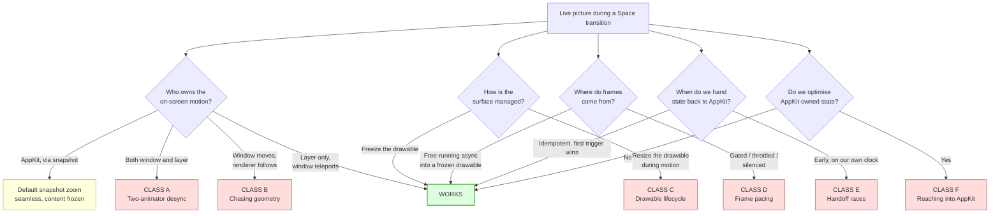
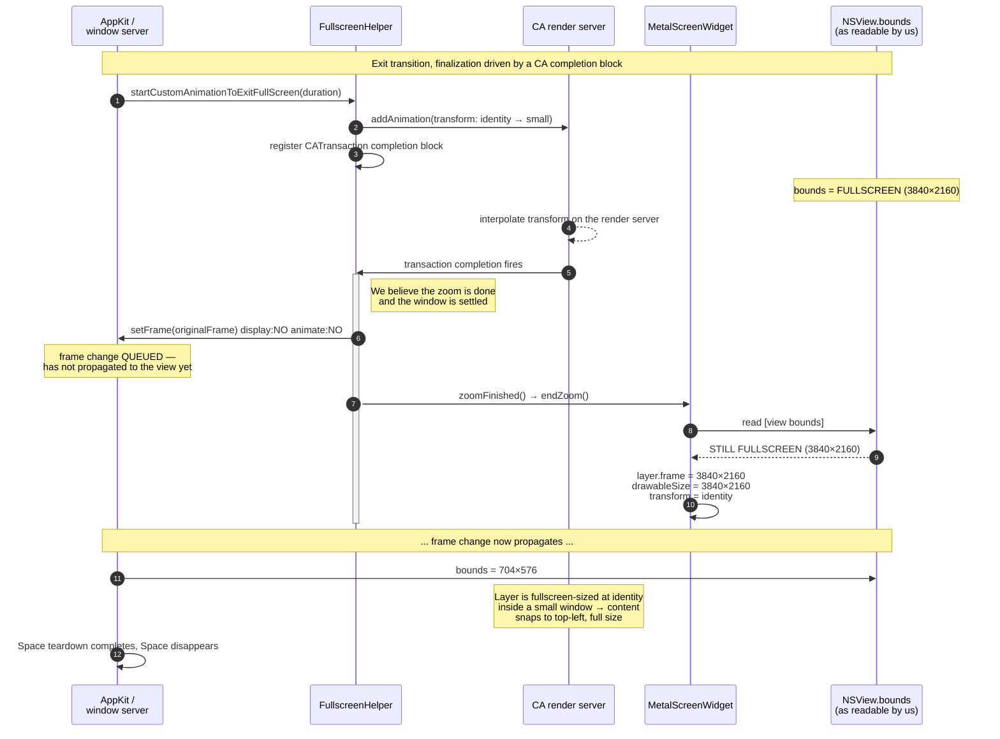
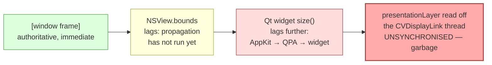
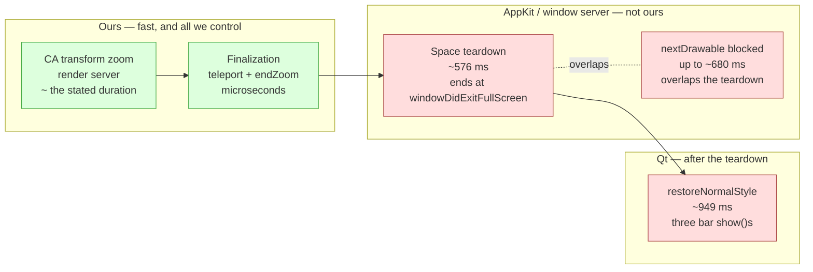

# Dead ends: a catalogue of failed approaches to a live macOS fullscreen transition

**Scope.** Every approach listed here was actually implemented against the real
application, observed on a real display, measured with timestamped tracing, and
then reverted. Nothing in this document is speculative. Each entry records what
was built, what the user actually saw, what the trace said, why it happened, and
— crucially — why the *obvious* follow-up fix also failed.

**Companion documents**

| File | Contents |
|---|---|
| [README.md](README.md) | The one-paragraph summary and the remaining known costs |
| [architecture.md](architecture.md) | The solution that works, and the bug each piece prevents |
| [implementation.md](implementation.md) | Complete code, sufficient to rebuild from scratch |
| [diagnostics.md](diagnostics.md) | How to trace this subsystem and which sources lie |

---

## 1. Overview

### 1.1 Why this document exists

The problem statement is deceptively small: when the user toggles native
fullscreen on macOS, the emulator picture should stay **live** and **correctly
positioned** for the whole transition. No frozen snapshot, no drift, no jump, no
black flash, no garbage in a corner.

This is the most valuable document in the set because the solution is *short*
and the space of plausible-but-wrong solutions is *enormous*. Almost every
approach below is one an experienced graphics or AppKit engineer would consider
reasonable — several are exactly what the platform documentation nudges you
toward.

If you are about to "just fix" something in the fullscreen path, jump to
[section 7](#7-if-you-are-about-to-try-x-read-this-first) first. There is a good
chance your idea is already there with a measurement attached.

### 1.2 The meta-lesson

> **Every plausible hypothesis in this investigation was disproved by tracing,
> and several "obvious" fixes made things measurably worse.**

Three patterns recurred often enough to be worth naming.

**Pattern 1 — the hypothesis that sounds like a root cause but is a symptom.**
"The layer has an implicit animation on it" is a real phenomenon, it explains
the symptom perfectly, and it was wrong. Disabling implicit animations
(`actions = NSNull`) changed nothing, because the lag was in *when* `setFrame:`
was called, not in how the layer interpolated afterwards.

**Pattern 2 — the fix that trades a visible artefact for an invisible one.**
Gating on "previous frame is on glass" produced a clean, perfectly consistent
**30 fps** — halving the frame rate to solve a problem that was not a frame-rate
problem. `NSDisableScreenUpdates` with `display:YES` and a `CATransaction flush`
removed the split-frame artefact by freezing the entire display for 400–690 ms.
Both "worked". Both were worse.

**Pattern 3 — the correct idea that fails because of ordering.** Replacing the
hardcoded finalization timer with a `CATransaction` completion block is
unambiguously the right design. It failed anyway, and failed spectacularly
(content teleported to the screen's top-left corner at full size), because the
completion block fires *before* the window teleport has propagated to
`NSView.bounds`. The idea was right; it needed a second, non-obvious change to
land at the same time. This is the failure most likely to be re-attempted by
someone who reads only the architecture notes.

### 1.3 What "measured" means here

Every number below came from stdout tracing with
`QDateTime::currentMSecsSinceEpoch()` timestamps on three tag families —
`[FS]` (AppKit callbacks), `[MW]` (window state machine), `[EV]` (renderer) —
read by looking for *gaps* rather than linearly. See
[diagnostics.md](diagnostics.md) for the exact incantations. Reference hardware:
a 3840×2160 non-retina display, Qt 6.9, macOS 15.

| Measurement | Value |
|---|---|
| AppKit Space teardown after our animation completes | ~576 ms |
| `restoreNormalStyle` (three bar `show()`s) during teardown | ~949 ms |
| `nextDrawable` while the compositor is mid-Space-switch | up to ~680 ms |
| `waitUntilScheduled` per synced present under load | 10–50 ms |
| On-glass latency for a present | ~25 ms |
| Animator tick rate during a custom window animation | ~55 Hz, jitter to 65 ms |
| Frame spacing when the compositor throttles async presents | 100–150 ms |
| Layer lag when chasing window geometry | 16–65 ms ≈ up to 400 px |
| Window motion speed during the transition | ~6 px/ms |

---

## 2. A taxonomy of the failure classes

The failures are not independent. They cluster into six classes, and within a
class the failures share a root cause — which means fixing one member of a class
without understanding the class simply moves the artefact somewhere else.



### The six classes at a glance

| Class | Mechanism | Diagnostic signature | Members |
|---|---|---|---|
| **A** — two-animator desynchronisation | Two independent interpolators drive one visible motion. `NSWindow`'s animator is an **app-side timer** with a non-bezier curve; Core Animation interpolates on the **render server**, another process, another clock. They agree at t=0 and t=duration and nowhere between | Artefact largest at the animation's midpoint, zero at both ends; drift direction consistent (down-right on enter, mirrored on exit) | A1, A2 |
| **B** — chasing geometry one step behind | Only one thing is *animated*, but the follower is driven by discrete notifications or ticks. Every such source reports geometry already stale when read, and every commit lands one step behind. At ~6 px/ms, a 16–65 ms lag is a **16–400 px** positional error | Artefact magnitude tracks tick jitter rather than animation phase; lag proportional to window velocity | B1, B2 |
| **C** — drawable / surface lifecycle | `CAMetalLayer` couples `bounds`, `drawableSize` and the surface binding. Changing `drawableSize` recreates the binding, pulling the surface out from under a running animation. Separately, the drawable is **stretched to fill bounds**, and `layerContentsPlacement` does not apply to a layer-hosting view's own layer | Black frames, content "arriving from the side" late, or a correctly-shaped but wrongly-cropped picture | C1, C2 |
| **D** — frame pacing / back-pressure | During a Space switch the window server does not composite async presents on its normal schedule. Gating, throttling or silencing starves the picture at the moment it moves fastest | Picture correct but stuttering or stale; the trace shows renders happening on time and *presents* not landing | D1–D5 |
| **E** — handoff / ordering races | AppKit's transition has several observable points and one unobservable one: when a requested frame change actually propagates into the view hierarchy. Acting on your own clock, or at a callback that fires before propagation, gives coordinate errors that look like rendering bugs | Geometry is *exactly* wrong (fullscreen-sized content in a small window, content pinned to (0,0)) rather than approximately wrong — exact wrongness means a stale read | E1–E4 |
| **F** — optimising AppKit-owned state | The ~576 ms Space teardown and ~949 ms `restoreNormalStyle` are not our code being slow; they are our code running while the window server is busy. Optimising them from inside the Space breaks correctness elsewhere or converts a distributed cost into one frozen block | The change removes the artefact you targeted and introduces one somewhere unrelated, often *earlier* in the sequence | F1, F2 |

Class D deserves a warning of its own: it wasted the most time, because "we are
not drawing" and "we are drawing and the compositor is not showing it" look
identical from the user's side. Distinguishing them requires logging
`nextDrawable` duration, `waitUntilScheduled` duration, **and** the
`addPresentedHandler` callback with its delay from request. Two out of three is
not enough.

---

## 3. The catalogue

Each entry follows the same shape: **Attempt** (with code where it can be
reconstructed) → **Symptom** (in user terms) → **Trace evidence** → **Root
cause** → **Why the obvious next fix also failed**.

---

### 3.A Class A — two-animator desynchronisation

#### A1. Animate the window frame with the AppKit animator and let the renderer follow

**Attempt.** The textbook approach: accept the animation slot AppKit offers in
`startCustomAnimationToEnterFullScreenWithDuration:`, drive the window frame
through the animator proxy, and have the renderer keep the layer in step.

```objc
- (void)window:(NSWindow*)window
        startCustomAnimationToEnterFullScreenWithDuration:(NSTimeInterval)duration
{
    NSRect screenFrame = [[window screen] frame];
    [NSAnimationContext runAnimationGroup:^(NSAnimationContext* ctx) {
        ctx.duration = duration;
        [[window animator] setFrame:screenFrame display:YES];
    } completionHandler:^{ /* renderer settles here */ }];
}
```

**Symptom.** On entering fullscreen the picture visibly *detaches* from the
window and slides off toward the bottom right, growing at a different rate than
the window it lives in; grossly displaced near the midpoint, snapping back into
position at the end. Mirrored on exit.

**Trace evidence.** Logging window frame and layer model geometry per animator
tick: endpoints matched exactly, intermediate values diverged progressively,
peaking near the midpoint. The animator fired at **~55 Hz with jitter to 65 ms**
— not a fixed cadence, and not the display's.

**Root cause.** Two interpolators, two clocks, two curves. `NSWindow`'s animator
is an **app-side timer** computing frames in the application process on a curve
that is not a standard Core Animation bezier. Core Animation interpolates on the
**render server**, in a separate process, on the display's cadence. Both are
pinned at the endpoints; everywhere else the error is the difference of two
unrelated easing curves sampled on two unrelated clocks.

**Why the obvious next fix failed.** "Match the curve" cannot work: the AppKit
curve is not exposed and is not a bezier, so matching it means
reverse-engineering an undocumented, version-dependent detail — and even a
perfect match leaves the *clock* mismatch, since a ~55 Hz app-side timer with
65 ms jitter cannot sample at the render server's frame instants. At 6 px/ms a
reduced drift is still visible.

**Class-level conclusion.** Do not have two animators. This is a property of the
design, not a bug within it. The working solution eliminates one: the window
teleports (`setFrame:display:NO animate:NO`), only the `transform` is animated.

---

#### A2. Chase the window from `NSWindowDidResizeNotification`

**Attempt.** Keep the window animating, but stop *predicting* where it is —
observe it, and reposition the layer at each notification.

```objc
[[NSNotificationCenter defaultCenter]
    addObserverForName:NSWindowDidResizeNotification object:window
                 queue:[NSOperationQueue mainQueue]
            usingBlock:^(NSNotification* n) {
                NSView* view = (__bridge NSView*)(void*)widget->winId();
                NSRect vb = [view bounds];              // <- stale
                layer.frame = CGRectMake(0, 0, vb.size.width, vb.size.height);
                widget->render(true);
            }];
```

**Symptom.** The same drift as A1, slightly smaller, identical in character.

**Trace evidence.** The window frame at notification time and the
`NSView.bounds` read inside the handler disagreed by one animation step,
consistently.

**Root cause.** The notification fires with the **previous** view bounds. The
host view is a Qt child view and Qt updates child geometry asynchronously, so
when the handler runs the window has a new frame but the child view has not been
laid out to match. Class B leaking into Class A: still two animators, plus an
extra observation lag — hence a smaller drift that never goes away.

**Why the obvious next fix failed.** "Read the window, not the view" (compute
from `[window frame]`, current at notification time) removes the Qt lag but
leaves the window in charge of the motion, so the layer is still committed one
step behind the animator's next move. That is B1, also a failure. Observation
cannot beat a moving target; it can only reduce the size of the miss.

---

### 3.B Class B — chasing geometry with a commit that is always one step behind

#### B1. Drive layer geometry from Qt resize ticks

**Attempt.** Let Qt be the clock. Qt delivers a real `resizeEvent` for each
animator step; use each one to set layer frame and drawable size and present a
transaction-tied frame. (This is the *correct* code for interactive live resize
and is what the working solution still uses outside a transition.)

```cpp
void MetalScreenWidget::resizeEvent(QResizeEvent* event)
{
    QWidget::resizeEvent(event);
    updateDrawableSize();     // layer.frame + drawableSize from width()/height()
    render(true);             // sync, transaction-tied present
    emit resized(event->size());
}
```

**Symptom.** The layer visibly lags the window; content trails the window edge
by a gap that opens and closes, at peak roughly a tenth of the screen width.

**Trace evidence.** Animator tick → Qt resize tick → commit measured at
**16–65 ms** end to end. The window moves at ~**6 px/ms**, so 65 ms of lag is
**~400 px** of positional error.

**Root cause.** Two compounding delays: Qt resize ticks arrive at Qt's jitter,
not the window's (AppKit → QPA → widget, dispatched on a busy main runloop); and
the resulting commit is applied to a *later* screen refresh than the window
frame it was computed from. The event pipeline is not a bottleneck you can tune
away; it is the pipeline.

**Why the obvious next fix failed.** Prediction — extrapolate where the window
will be at the next refresh — needs the animator's curve and its next tick time,
both unavailable (A1). A misprediction looks *worse* than a lag: the error
changes sign and the picture jitters rather than trails. "Faster ticks" does not
help either; the problem is latency, not frequency.

---

#### B2. Disable implicit layer animations (`actions = NSNull`)

**Attempt.** Hypothesis: the layer *is* set correctly and on time, but Core
Animation adds an implicit animation to each `frame`/`bounds` change, so every
commit is itself interpolated — a follower that lags by construction.

```objc
m_impl->metalLayer.actions = @{
    @"bounds"    : [NSNull null],
    @"position"  : [NSNull null],
    @"transform" : [NSNull null],
    @"contents"  : [NSNull null],
};
```

(Equivalently, wrapping each write in `[CATransaction setDisableActions:YES]`.)

**Symptom.** **No change whatsoever.** The drift was identical, frame for frame.

**Trace evidence.** Logging `[layer animationKeys]` at each commit showed the
count was already zero. There were no implicit animations to disable.

**Root cause.** A clean, plausible, well-known Core Animation gotcha that was
simply not what was happening. The lag was in **when** `setFrame:` was called —
the pipeline latency of B1 — not in how the layer behaved once called.

**Why this entry matters more than its size suggests.** It is the archetypal
meta-lesson. The hypothesis explained the symptom perfectly, matched observed
behaviour, and matched documented platform behaviour. Only a trace that counted
attached animations showed it was wrong; reasoning would have confirmed it.

`setDisableActions:YES` **is** used throughout the working solution — not
because it fixes anything, but as hygiene when setting model values that a
separate explicit animation will drive.

---

### 3.C Class C — drawable and surface lifecycle mistakes

#### C1. Freeze `drawableSize` without compensating the viewport

**Attempt.** A step toward the eventual solution, taken halfway. The insight was
right — stop resizing the drawable so the surface binding stays stable — but the
renderer kept computing its viewport as though the layer were still the size it
was rendering for.

```objc
void MetalScreenWidget::updateDrawableSize()
{
    if (m_zoomActive.load(std::memory_order_relaxed))
        return;                       // frozen — correct
    /* ... */
}
// but render() still derived the viewport from the live layer bounds,
// not from the frozen drawable dimensions
```

**Symptom.** Black frames interleaved with real ones, and the picture "arriving
from the side" late rather than growing in place.

**Trace evidence.** `drawableSize` and `layer.bounds` diverged as soon as the
freeze engaged, with the viewport computed from the wrong one of the pair.

**Root cause.** Two `CAMetalLayer` facts, easy to forget together:

1. **The drawable is stretched to fill `bounds`** — not clipped, not
   letterboxed. Frozen drawable + different bounds = everything silently
   rescaled by the ratio.
2. **`layerContentsPlacement` does not apply to a layer-hosting view's own
   layer.** It governs AppKit-managed contents; a `CAMetalLayer` you installed is
   not that.

So the freeze was correct but incomplete: a frozen drawable means the renderer
must target a fixed-size surface and place content within it using the *same
letterbox math* the transform uses, or the two disagree.

**Why the obvious next fix failed.**
`layerContentsPlacement = NSViewLayerContentsPlacementScaleProportionallyToFit`
is precisely the knob whose inertness is fact 2. The property *is* set in the
working code — on the **view**, as a safety net for frames between synced
presents, where it does affect AppKit-managed content during resize. It is not,
and cannot be, what makes a frozen drawable correct. The working solution
instead shares one function, `zoomContentRect()`, between the transform and the
render viewport; see
[implementation.md](implementation.md#letterbox-math-shared-with-the-render-viewport).

---

#### C2. "Video player mode": present new drawables during the window animation

**Attempt.** A video player renders continuously while its window resizes and
looks fine, so keep producing fresh, correctly-sized frames throughout —
resizing the drawable each step to match the current geometry.

```objc
// each animation step, on the main thread
m_impl->metalLayer.drawableSize = CGSizeMake(w * scale, h * scale);
id<CAMetalDrawable> d = [m_impl->metalLayer nextDrawable];
/* encode ... */
[cmdBuffer presentDrawable:d];
[cmdBuffer commit];
```

**Symptom.** A black square where the picture should be, with the real content
arriving late, after the animation had substantially progressed.

**Trace evidence.** This resisted diagnosis longest, because the natural
hypothesis — "presents too slow / pool exhausted" — was measurable and *was
measured*: `nextDrawable` really did block up to **~680 ms** mid-Space-switch,
which made the wrong hypothesis look confirmed. The distinguishing measurement
was to hold the presents constant and vary only `drawableSize`. The artefact
tracked `drawableSize`, not the present rate.

**Root cause.** It is not the presents. **Changing `drawableSize` mid-animation
recreates the underlying surface binding under the animator.** The layer Core
Animation is interpolating has its backing store swapped out from beneath it,
and the render server has nothing valid to composite until the new surface has
content — the black square, and the late arrival.

**Why the obvious next fix failed.** Enlarging the drawable pool (or raising
`maximumDrawableCount`) addresses the ~680 ms `nextDrawable`, which is real,
without touching the cause — so the black square remains. Worse, it *looks* like
progress, because the stall shrinks while the artefact does not.

**Class-level conclusion.** Pick one: either the drawable is stable and the layer
moves, or the drawable resizes and the layer does not. Never both at once.

---

### 3.D Class D — frame pacing and compositor back-pressure

> **During a Space switch, the window server does not composite async presents
> on its normal schedule.** You can render as fast as you like. The frames will
> not appear at that rate.

Five designs ran into that one fact from five directions.

#### D1. Async presents from the display-link thread as the only frame source

**Attempt.** Let the CVDisplayLink pump frames as it always does, on the normal
non-blocking path, and let that be the entire frame source for the transition.

```objc
void MetalScreenWidget::displayLinkCallback()
{
    if (!m_animating || !m_metalInitialized)
        return;
    render(false);   // presentsWithTransaction = NO, presentDrawable, commit
}
```

**Symptom.** Approximately **7 fps**. The picture is correct and correctly
positioned, updating in visible discrete steps.

**Trace evidence.** The renderer's tick rate was fine — called at display
cadence, completing its work. `inFlight` (drawables outstanding) was **pinned at
3**, and `addPresentedHandler` showed frames landing every **100–150 ms**. That
combination is the signature: we produce frames on time, they queue, and the
compositor releases them at its own throttled rate. `inFlight` pinned at maximum
means we are blocked waiting for the compositor, not the reverse.

**Root cause.** Compositor back-pressure during the Space switch. No client-side
setting changes it.

**Why the obvious next fix failed.** "Render fewer, bigger frames" and "skip
frames we know are late" are both attempts to be cooperative with a queue that
is not congested because of us. They reduce the frame count further (see D4).

**How the working solution deals with it.** It does not fix D1 — it makes D1
harmless. With the drawable frozen and only the `transform` animated, the motion
is interpolated by the render server independently of our present rate; presents
only need to keep the *emulator picture* fresh. A slow present rate degrades the
emulator frame rate for a few hundred milliseconds and does not degrade the
zoom. The display link therefore pumps async frames through the whole
transition, safe precisely because it no longer owns the animation.

---

#### D2. Gate rendering on "previous frame on glass" (`addPresentedHandler`)

**Attempt.** If the compositor is back-pressured, stop pushing: request the next
frame only once the previous one is confirmed visible. A standard, well-regarded
frame-pacing technique.

```objc
__block BOOL onGlass = YES;
// in render():
if (!onGlass) return;               // gate
onGlass = NO;
[drawable addPresentedHandler:^(id<MTLDrawable> d) { onGlass = YES; }];
[cmdBuffer presentDrawable:drawable];
[cmdBuffer commit];
```

**Symptom.** Exactly **30 fps**, rock-steady, with occasional stalls of 8–20
ticks.

**Trace evidence.** On-glass latency measured at **~25 ms**; the display ticks
every ~16.7 ms.

**Root cause.** Arithmetic. With ~25 ms confirmation and ~16.7 ms ticks the gate
is still closed at tick N+1 and open by N+2 — every second tick skipped,
deterministically. The *exactness* is the giveaway: a resource problem produces
a noisy frame rate, a gate produces an exact divisor. The 8–20 tick stalls have
a second cause: **Core Animation batches the presented handlers**, so they
arrive in clusters and a cluster boundary starves the gate for the whole batch
interval.

**Why the obvious next fix failed.** A depth-2 or depth-3 gate restores the
frame rate and restores D1's problem with it, because the gate never solved a
correctness issue — the frames were fine, the compositor was slow. A gate can
only *reduce* throughput; applying one to a throughput problem is backwards.

---

#### D3. `displaySyncEnabled = NO` during the zoom

**Attempt.** Remove vsync coupling for the transition so presents are not held
for the next refresh, on the theory that the pacing problem was a scheduling
one.

```objc
m_impl->metalLayer.displaySyncEnabled = NO;    // for the duration of the zoom
/* ... restore to YES in endZoom() ... */
```

**Symptom.** Jerky drift — the picture no longer merely lags; it jumps forward
and hesitates.

**Trace evidence.** Presents landing at irregular offsets relative to the
`CATransaction` boundaries.

**Root cause.** Unpaced presents land **mid-transaction**. One arriving between
the geometry commit and its display leaves the layer showing new content at old
geometry (or the reverse) for that refresh. With vsync on, the present is
aligned to a refresh boundary and that window does not exist. Turning off
display sync is a throughput optimisation; applied while geometry is *changing*
it converts a latency problem into a correctness problem.

**Why the obvious next fix failed.** Keeping `displaySyncEnabled = NO` but
presenting only inside transactions (`presentsWithTransaction = YES`) leaves the
presents transaction-paced anyway, so the flag does nothing — the change reverts
itself. The working solution uses both present paths, chosen per frame:
transaction-tied for geometry-changing renders, plain async for the free-running
display-link pump. See
[implementation.md](implementation.md#the-two-present-paths).

---

#### D4. Cooldown after a slow `nextDrawable`

**Attempt.** `nextDrawable` was measured blocking up to ~680 ms during a Space
switch. Treat that as saturation and back off — skip the next few display-link
ticks rather than queueing more work.

```objc
uint64_t t0 = now_ms();
id<CAMetalDrawable> drawable = [m_impl->metalLayer nextDrawable];
if (now_ms() - t0 > kSlowDrawableMs)
    m_cooldownUntil = now_ms() + kCooldownMs;   // skip ticks until then
```

**Symptom.** Drift during the cooldown window — the picture stops updating while
continuing to move.

**Trace evidence.** Cooldown periods aligned exactly with the intervals in which
the on-screen picture was stale relative to the geometry.

**Root cause.** During the cooldown the layer keeps being repositioned while its
**contents are frozen at the last presented frame**. A skipped tick is not a
neutral no-op during a transition; it is stale content shown at moving geometry,
and the mismatch grows with the cooldown. Class B from the pacing side: the
follower lags by exactly the cooldown duration.

**Why the obvious next fix failed.** A shorter cooldown reduces the drift
proportionally and never eliminates it — and one short enough to be invisible is
short enough to be pointless. Backing off is only correct when the content is
static. During a transition it never is.

---

#### D5. Silence the display link for the whole transition

**Attempt.** The most aggressive version of D4, following Apple's
`CAMetalLayer`-resize sample pattern: during a transition the *only* renders
should be the synchronous, transaction-tied ones from `resizeEvent` on the main
thread, so each animation step's `CATransaction` carries exactly one glued
frame. Async presents from the display-link thread would drain the drawable pool
and land between transactions.

```objc
void MetalScreenWidget::displayLinkCallback()
{
    if (!m_animating || !m_metalInitialized)
        return;
    if (m_inTransition)
        return;              // silent for the whole transition
    render(false);
}
```

That reasoning is sound **for the design it was written for** — the
chase-the-window design of Class B, where every animator tick produces a resize
and therefore a frame. It stops being sound the moment the window teleports.

**Symptom.** A frozen picture in the "dead zones": after the transition begins
but before the zoom starts, and after the zoom finishes but before AppKit
reports completion. With the ~576 ms Space teardown on exit, the second dead
zone is unmistakable.

**Trace evidence.** With the window teleporting there are no per-step resizes.
The only frames rendered during the entire transition were the single one from
`prepareZoom()` and the single one from `endZoom()` — two frames in total.

**Root cause of the freeze.** The teleport design removes the resize stream the
silence policy depended on as its frame source. During a transition the only
frames rendered are the single one from `prepareZoom()` and the single one from
`endZoom()`.

#### D5a. Removing the silence — TRIED TWICE, REJECTED TWICE

The obvious conclusion from D5 is that the guard is a leftover and should go:
the drawable is frozen, only the transform moves, so async presents cannot
desynchronise against anything. That reasoning is **wrong**, and this is the
single most important correction in this document.

```objc
// The change that was tried — DO NOT reinstate it
void MetalScreenWidget::displayLinkCallback()
{
    if (!m_animating || !m_metalInitialized)
        return;
    render(false);      // pump through the transition
}
```

**Symptom.** The zoom becomes visibly worse and slower, with jerky playback of
stale frames. Verbatim from the second test: *"так сильно хуже и медленнее,
рывки показ каких-то stale snapshots"*.

**Root cause.** Async presents land **outside** the transactions that carry the
geometry. During the zoom the layer's transform is being interpolated by the
render server every frame, so a present that is not tied to a transaction shows
a surface that no longer matches where the layer is. Freezing the drawable
removes the *resize* hazard, not the *phase* hazard.

**Verification history.** Removed once as part of a batch that also changed
finalization; reverted with the batch. Removed a second time **in isolation**,
with no other change in the tree, and rejected again on the same symptom. This
is settled.

**The accepted trade.**

| | Guard in place — **reference state** | Guard removed |
|---|---|---|
| During the zoom | Smooth; motion supplied by the transform | Jerky, stale frames |
| Dead zones before/after the zoom | Frozen for a few frames | Live |

The dead-zone freeze is accepted. If it is ever attacked, the answer is **not**
async presents and **not** a synthetic timer (D3 covers why an independent frame
clock is harmful) — it would have to be additional *transaction-tied* frames at
those specific moments.

> **Reference state.** `MetalScreenWidget::displayLinkCallback()` **keeps** the
> `if (m_inTransition) return;` guard. Two independent attempts to remove it were
> rejected on user-visible regression.

---

### 3.E Class E — handoff and ordering races with AppKit

The sequence below is the race behind E2, the most instructive failure in the
investigation. Every step is individually correct; the failure is that step 8's
read happens before step 15's write, and nothing in the API surface makes that
ordering visible.



---

#### E1. Restore window chrome as soon as the zoom finishes, instead of waiting for `didExitFullScreen`

**Attempt.** The exit has a long tail: after our zoom completes, AppKit spends
roughly **576 ms** tearing the Space down before delivering
`windowDidExitFullScreen`. Restoring the bars during that dead time would hide
the latency behind the teardown instead of adding to it.

```cpp
void MainWindow::zoomFinished()
{
    m_screen->endZoom();
    restoreNormalStyle();            // <- moved here from didExitFullscreen()
    FullscreenHelper::restoreWindowChrome(windowHandle());
}
```

**Symptom.** Coordinates jump: the contents reposition once when the bars return
and again a moment later — a visible double shift at the end of every exit.

**Trace evidence.** `[MW] restoreNormalStyle START` landed ~576 ms before
`[FS] windowDidExitFullScreen`, with a Qt relayout in between and an AppKit
reframe after it.

**Root cause.** **AppKit still holds the fullscreen `styleMask` for that entire
~576 ms.** Restoring the bars triggers a Qt relayout against a window AppKit is
about to reframe; AppKit then applies its own frame and Qt lays out again. Two
layouts, two positions, one visible jump. The dead time is not idle time — it is
time during which the window's authoritative state is mid-flight.

**Why the obvious next fix failed.** Suppressing the intermediate layout
(`setUpdatesEnabled(false)`, or restoring the bars with the layout deactivated)
hides the *first* position but not the reframe, and leaves the widget tree in a
state Qt must reconcile against AppKit's frame — reintroducing the second shift.
The chrome restore genuinely cannot be moved earlier from inside a Space.

Related: the ~949 ms `restoreNormalStyle` cost is not three slow `show()` calls;
it is three `show()` calls competing with a busy window server. See F1.

---

#### E2. Replace the finalization timer with a `CATransaction` completion block

**Attempt.** The working implementation finalizes on a `dispatch_after` timed at
`animDuration + 0.03` — a hardcoded timeout and known debt. The obviously better
design is to be told when the animation actually ends, by the entity that ran
it.

```objc
[CATransaction begin];
[CATransaction setCompletionBlock:^{
    [weakSelf finishZoomForWindow:window reason:"catransaction"];
}];
/* ... addAnimation:forKey:@"fsZoom" ... */
[CATransaction commit];
```

**Symptom.** The Metal content jumps to the **top-left corner of the screen at
full size**, still fullscreen-shaped, and stays there — then the Space
disappears out from under it. Dramatically worse than the timer it replaced.

**Trace evidence.** `NSView.bounds` inside `endZoom()` reported the
**pre-teleport (fullscreen)** dimensions, despite `setFrame:display:NO
animate:NO` having been called earlier in the same function. See the diagram
above.

**Root cause.** The completion block fires **before the teleport reaches the
view**. `endZoom()` reads geometry back from `NSView.bounds` (see
[implementation.md](implementation.md#endzoom--settle-atomically)), so it sized
the layer and drawable to the fullscreen dimensions at `transform = identity` —
a full-screen-sized layer inside a small window, which
`NSViewLayerContentsPlacementTopLeft` renders as the picture pinned to the
screen's top-left at full scale.

Note the diagnostic signature: the geometry was **exactly** wrong, not
approximately wrong. Exactly-wrong geometry always means a stale read, never an
interpolation problem. That distinction located the bug.

**Why the obvious next fix failed.** Adding a delay before reading the bounds
reintroduces the timer this change was meant to remove, now with two clocks.
Reading `[window frame]` gives a current value, but the view rect inside the
window is not derivable from the window frame alone once chrome state is in
flux.

**The fix that would work.** The design is right and should be revisited, but it
needs a companion change: **`endZoom()` must be given the final size
explicitly**, passed down from `finishZoomForWindow:` where it is known from the
frame just set, instead of being read back from the view. Both changes must land
in the same commit. The completion block alone reproduces this failure exactly.

---

#### E3. Teleport to the original content rect instead of the original window frame

**Attempt.** Both `_originalFrame` and `_originalContentRect` are captured in
`customWindowsToExitFullScreenForWindow:`, and the content rect looks like the
natural choice because all the zoom math is in content coordinates.

```objc
[window setFrame:_originalContentRect display:NO animate:NO];   // WRONG
```

**Symptom.** A second jump at the very end of the exit: the window arrives, then
visibly corrects itself upward and grows slightly.

**Trace evidence.** The teleported window was **28 px too short** — precisely the
title bar height — and AppKit reframed it immediately afterwards.

**Root cause.** `setFrame:` takes a *frame* rect (including chrome), not a
*content* rect, so the window's total height became the content height, short by
exactly the title bar; AppKit then applied its own correction. This is a race
entry rather than a trivial typo because of the timing: the correction arrives
after our transaction has committed and after `NSEnableScreenUpdates`, so it is
a separate visible event rather than absorbed.

**Why the obvious next fix failed.** Converting with `frameRectForContentRect:`
at teleport time is arithmetically right, but the window's `styleMask` is still
the fullscreen one, so the conversion computes a zero chrome inset and returns
the content rect unchanged. The conversion must be done against the *original*
style — which is exactly what `_originalFrame` already is. Capturing the frame
up front and using it verbatim is both simpler and the only correct version.

---

#### E4. Render in `endZoom()` after the geometry transaction commits, instead of inside it

**Attempt.** `endZoom()` removes the animation, resets the layer to its final
geometry at identity, and renders a frame. The apparently tidier ordering is to
commit the geometry first and then render, so the render targets a settled
layer.

```objc
[CATransaction begin];
[CATransaction setDisableActions:YES];
[m_impl->metalLayer removeAnimationForKey:@"fsZoom"];
m_impl->metalLayer.transform = CATransform3DIdentity;
m_impl->metalLayer.frame = /* final */;
m_impl->metalLayer.drawableSize = /* final */;
[CATransaction commit];

render(true);              // <- AFTER the commit. Wrong.
```

**Symptom.** On exit, a flash of garbage in the top-left corner of the newly
restored window, lasting until the next frame arrives.

**Trace evidence.** The garbage was recognisably a crop of the previous
fullscreen frame.

**Root cause.** Between the commit and the render the layer is **already small**
while its contents are **still the old full-screen drawable**. With
`NSViewLayerContentsPlacementTopLeft` that oversized content is cropped to the
new bounds from the top-left — a corner of the old fullscreen picture at 1:1 —
until the next frame lands.

**Why the obvious next fix failed.** Switching placement to
`ScaleProportionallyToFit` scales the stale content instead of cropping it,
replacing recognisable garbage with a briefly wrong-scaled picture — less
alarming, still an artefact — and it changes the placement mode used for
interactive live resize, where `TopLeft` is better. The correct fix is ordering,
not placement: **the render must be inside the same transaction as the geometry
change**, on the transaction-tied present path.

---

### 3.F Class F — optimisations that reached into state AppKit owns

#### F1. Use the async present path for resizes while `m_inTransition`, to kill the 949 ms `restoreNormalStyle`

**Attempt.** `restoreNormalStyle()` — three bar `show()` calls — was measured at
**~949 ms**. Each `show()` triggers a resize, each resize takes the synchronous
transaction-tied present path, and that path does `waitUntilScheduled` (10–50 ms
under load) plus a `nextDrawable` that can block up to ~680 ms mid-Space-switch.
The fix looks obvious: while `m_inTransition`, use the non-blocking async path.

```cpp
void MetalScreenWidget::resizeEvent(QResizeEvent* event)
{
    QWidget::resizeEvent(event);
    updateDrawableSize();
    render(!m_inTransition);     // async while transitioning — "just don't block"
    emit resized(event->size());
}
```

**Symptom.** Garbage snapshots at the **start** of the animations — the opposite
end of the sequence from the cost being optimised.

**Trace evidence.** `m_inTransition` is set by `setAnimating(true)`, which runs
*before* `toggleFullScreen:`, so it also covers the resizes that happen while the
menu, tool and status bars are being hidden in preparation. Those resizes
silently switched to the async path.

**Root cause.** The synchronous, transaction-tied present exists to glue a
freshly rendered frame to the geometry change that caused it. Switching the
pre-transition resizes to async decoupled them: the bars disappeared and the
layer resized in one commit while the matching frame landed in a later one, and
AppKit captured the in-between state. The flag was a coarse instrument — it was
introduced to mean "we are mid-Space-switch" and it also means "we are preparing
to enter one".

**Why the obvious next fix failed.** A second, narrower flag set only between
`startCustomAnimation…` and finalization is a real improvement but does not
recover the 949 ms: the resizes that cost it come from `restoreNormalStyle`,
*after* the zoom, during Space teardown, when the compositor is busy regardless
of which present path we use. The blocking is in the window server, not in our
choice of present. Making our call non-blocking moves the wait; it does not
remove it.

**Status.** The ~949 ms cost is unresolved, documented as a known cost in
[README.md](README.md), and not removable from inside a Space.

---

#### F2. `NSDisableScreenUpdates` around the teleport **with** `display:YES` and a `CATransaction flush`

**Attempt.** The exit teleport and the layer settle must become visible
together, and `NSDisableScreenUpdates()`/`NSEnableScreenUpdates()` is the
mechanism. The first version used the belt-and-braces variant of everything
inside the lock: `display:YES` on the frame change, and a `[CATransaction
flush]` to push the layer change to the window server before releasing.

```objc
NSDisableScreenUpdates();
[CATransaction begin];
[CATransaction setDisableActions:YES];
[window setFrame:_pendingTeleport display:YES animate:NO];   // display:YES
if (_delegate) _delegate->zoomFinished();
[CATransaction commit];
[CATransaction flush];                                        // flush
NSEnableScreenUpdates();
```

**Symptom.** The **entire display freezes for 400–690 ms**, then everything
appears at once. Not just the app — the whole screen.

**Trace evidence.** The wall-clock gap between `NSDisableScreenUpdates()` and
`NSEnableScreenUpdates()` was 400–690 ms, entirely inside the `setFrame:` and
the flush.

**Root cause.** Both `setFrame:display:YES` and `[CATransaction flush]` **block
on the window server**, which at that exact moment is tearing down the Space
(the ~576 ms cost). Blocking on a busy window server while holding a
screen-update lock freezes the display for the duration of the block. The
sharpest example of Class F: the lock is the right tool, and combining it with
two synchronous round-trips to the entity the lock is holding back turns a
correctness fix into a system-wide stall.

**Why the obvious next fix failed.** Shortening the lock by moving the flush
outside it trades back the artefact the lock was introduced to solve — without
the flush *inside* the lock, the layer settle and the window move can still
reach the screen separately.

**What actually works.** `display:NO` and **no** flush, both inside the lock:

```objc
NSDisableScreenUpdates();
[CATransaction begin];
[CATransaction setDisableActions:YES];
[window setFrame:_pendingTeleport display:NO animate:NO];    // display:NO
if (_delegate) _delegate->zoomFinished();                    // endZoom renders inside
[CATransaction commit];
NSEnableScreenUpdates();
```

The lock holds for microseconds; both changes are queued and become visible on
the same update when it is released. Nothing synchronous is requested, so there
is nothing to wait for.

For the record, the artefact this fixes: without the lock, **the layer settled
~30 ms before the window move reached the screen**, showing a small rectangle
drawn at the *fullscreen window's* origin — a small picture in the screen's
top-left corner, for two refreshes.

---

## 4. Approaches rejected by design rather than by failure

Two viable designs are absent from the solution not because they failed but
because they were rejected. Both are legitimate answers to a slightly different
question, and someone will eventually propose them as though they had not been
considered.

### 4.1 Fully custom non-Space fullscreen (borderless window)

**The design.** Do not use `toggleFullScreen:` at all. Make the window
borderless, set its frame to the screen frame, raise its window level, hide the
menu bar via `NSApplicationPresentationOptions`, and animate however you like.

**What it gets you.** Every problem in this document disappears, because AppKit
is not participating. No second animator, no Space teardown, no ~576 ms tail, no
~949 ms chrome restore, no handoff race, no compositor back-pressure from a
Space switch. You own the whole timeline. By a wide margin the simplest way to
get a glitch-free live fullscreen zoom.

**What it costs.** The fullscreen window is **no longer a separate Space**: no
Mission Control tile of its own, no three-finger swipe between the fullscreen
app and the desktop, no per-Space app assignment, no green-button semantics
matching the rest of the system, and different multi-display behaviour.

**Why it was rejected.** A **product decision**, not a technical one — the
separate Space is a feature users expect from a native macOS application. Worth
stating plainly, because the technical case for the borderless approach is
overwhelming: if the product requirement ever changes, this is the design to
adopt, and most of this document becomes irrelevant.

### 4.2 AppKit's default snapshot zoom

**The design.** Do nothing. Do not implement
`customWindowsToEnterFullScreenForWindow:`. Let AppKit take a bitmap snapshot of
the window and animate that.

**What it gets you.** Genuinely seamless. Zero artefacts of any kind — no drift,
no jump, no black frame, no garbage crop, no pacing problem — because there is
no live content to get out of sync. This is what **VLC and Safari use** in
native fullscreen, which is a strong signal about how hard the alternative is.

**What it costs.** The picture is **static for the duration of the zoom** —
roughly half a second of frozen emulator output per transition.

**Why it was rejected.** The whole point of the feature was a live picture. It is
listed because it is the correct fallback: if the live-zoom implementation ever
becomes unmaintainable across a macOS release, reverting is a one-line change
(stop returning the window from `customWindowsToEnter/ExitFullScreenForWindow:`)
and is guaranteed correct.

Returning the window from those methods is precisely the switch that tells
AppKit *not* to snapshot-zoom. It is the single line that makes a live picture
possible at all — and the single line that makes every other problem in this
document possible.

---

## 5. Cross-cutting lessons

### 5.1 What `CAMetalLayer` actually guarantees

Much of Class C came from assuming guarantees that do not exist.

| Assumption | Reality |
|---|---|
| The drawable is placed inside the layer's bounds according to a placement policy | **The drawable is stretched to fill `bounds`.** There is no letterboxing, no clipping, no policy. If drawable aspect ≠ bounds aspect, the content is distorted, silently |
| `layerContentsPlacement` controls that | It **does not apply** to a layer-hosting view's own layer. It governs AppKit-managed contents, which a `CAMetalLayer` you installed is not |
| Setting `drawableSize` is a cheap property write | It **recreates the surface binding**. Doing it under a running animation pulls the backing store out from under the render server |
| A present goes to the screen | A present goes to a **queue**. `addPresentedHandler` tells you when it reached the glass; the delay is ~25 ms nominally and unbounded under compositor back-pressure |
| Rendering fast means displaying fast | During a Space switch the window server throttles composition. `inFlight` pins at its maximum and frames land every 100–150 ms regardless of your render rate |

The practical rule: **during any geometry transition, freeze `drawableSize` and
move only the `transform`.** The renderer's job then reduces to placing content
correctly inside a fixed-size surface, using the same letterbox math the
transform uses.

### 5.2 Why presentation and geometry must share a transaction

A `CATransaction` is the unit of atomic visual change. Two things committed in
different transactions become visible at different refreshes, and during a fast
transition that is a visible artefact:

- Geometry first, content second → **E4** (garbage crop in the corner).
- Content first, geometry second → the mirror image (correct picture at the
  wrong size for a frame).
- Content unpaced relative to transactions → **D3** (jerky, mid-transaction
  landings).
- Window move and layer settle in different commits → the ~30 ms split in
  **F2** (small rectangle at the screen's top-left).

Hence the two present paths in the working code — not an optimisation and a
fallback, but two different semantics:

| Path | Mechanism | When |
|---|---|---|
| Sync, transaction-tied | `presentsWithTransaction = YES`; `commit`; `waitUntilScheduled`; `[drawable present]` | Any render that accompanies a geometry change. The present lands in the current `CATransaction` |
| Async, non-blocking | `presentsWithTransaction = NO`; `presentDrawable:`; `commit` | Free-running frames from the display link, where no geometry is changing |

The sync path costs 10–50 ms of `waitUntilScheduled` under load. That is the
price of atomicity, and it is worth paying only where atomicity is required.

### 5.3 Why Qt's widget size, and even `NSView.bounds`, lie

There is a hierarchy of staleness, and knowing which level you are reading is
the difference between a correct fix and E2.



- **Qt widget size** lags AppKit by one or more ticks during any transition,
  because the geometry has to travel AppKit → QPA → widget and be dispatched on
  the main runloop. Never use `width()`/`height()` for transition geometry.
- **`NSView.bounds`** is better and is what the working `endZoom()` uses — but it
  is *also* stale at finalization time, because the teleport we just performed
  has not propagated to the view yet. This is exactly E2.
- **`presentationLayer` read from the CVDisplayLink thread** is not merely stale,
  it is unsynchronised: it returned **704×522 for a 3840×2160 model**. Only read
  it on the main thread, and preferably not at all.

The rule: **if you just changed geometry, do not read it back — pass it
forward.** Reading back is how E2 happens. The value is known at the point where
the change was made; carry it as a parameter.

### 5.4 Why AppKit's stated animation duration is not a contract

`startCustomAnimationToEnterFullScreenWithDuration:` hands you a duration. It
reads like a contract; it is not. AppKit was measured finishing the transition
**576 ms early** relative to the duration it supplied, so a `dispatch_after`
scheduled on that duration fires *after* AppKit has already delivered
`windowDidEnter/ExitFullScreen`. Consequences observed:

- Waiting only for the timer left an un-teleported, fullscreen-sized window that
  Qt read as "maximized", producing a **phantom 3840×2055 frame** with the zoom
  transform still attached.
- Waiting only for the delegate callback fails in the other direction whenever
  AppKit is *slower* than stated.

The only design that survives both is **idempotent finalization triggered by
whichever event arrives first**, running *before* the `didEnter/didExit`
delegate forwarding:

```objc
- (void)finishZoomForWindow:(NSWindow*)window reason:(const char*)reason
{
    if (_zoomFinished) return;      // first trigger wins
    _zoomFinished = YES;
    /* teleport + settle, atomically */
}

- (void)windowDidExitFullScreen:(NSNotification*)n
{
    [self finishZoomForWindow:[n object] reason:"didExitFullScreen"];   // BEFORE
    if (_delegate) _delegate->didExitFullscreen();
}
```

### 5.5 The transition timeline, with its real costs

The exit sequence with the measured durations that matter — this is why the
Class E and F optimisations were attempted, and why they could not succeed.



- The **zoom** is the only part we control and the only part that is fast.
- The **~576 ms Space teardown** begins as soon as we finalize and ends when
  `windowDidExitFullScreen` arrives. Nothing shortens it; touching window state
  during it races AppKit (**E1**), and anything synchronous blocks (**F2**).
- The **~949 ms `restoreNormalStyle`** runs after the teardown, slow because the
  window server is still recovering — not because three `show()` calls are
  expensive (**F1**).
- The **up-to-~680 ms `nextDrawable`** overlaps the teardown and is why the
  Class D pacing failures all look like resource exhaustion when traced from the
  render side only.

---

## 6. Decision matrix

### 6.1 Strategy viability

| Strategy | Live picture | Separate Space | Artefacts | Verdict |
|---|:---:|:---:|---|---|
| AppKit default snapshot zoom | No | Yes | None | **Viable** — correct fallback; what VLC/Safari do |
| Window animator + layer animator | Yes | Yes | Drift, up to ~400 px | **Dead** (A1) — two clocks, two curves, unfixable |
| Window animator + chase via notification | Yes | Yes | Drift, slightly smaller | **Dead** (A2) — observation cannot beat a moving target |
| Window animator + chase via Qt resize ticks | Yes | Yes | 16–65 ms lag ≈ up to 400 px | **Dead** (B1) — pipeline latency, not tunable |
| Live drawable resize during motion | Yes | Yes | Black frames, late arrival | **Dead** (C2) — surface rebind under the animator |
| **Window teleports + layer transform animates** | **Yes** | **Yes** | **None** | **WORKS** — the shipped design |
| Borderless non-Space fullscreen | Yes | **No** | None | **Viable** — rejected on product grounds, not technical |

### 6.2 Frame-source viability during a transition

| Frame source | Result | Verdict |
|---|---|---|
| Async display-link presents, drawable resizing | ~7 fps, `inFlight` pinned at 3 | **Dead** (D1) |
| Gated on `addPresentedHandler` | Exactly 30 fps + 8–20 tick stalls | **Dead** (D2) |
| `displaySyncEnabled = NO` | Jerky, mid-transaction landings | **Dead** (D3) |
| Cooldown after slow `nextDrawable` | Stale content at moving geometry | **Dead** (D4) |
| Display link silenced entirely | Frozen picture in the dead zones | **Dead** (D5) |
| Sync transaction-tied presents from resize ticks only | Correct *only* while resizes exist — none after a teleport | Correct outside transitions |
| **Async display-link presents into a frozen drawable** | **Live picture, pacing irrelevant** | **WORKS** |

### 6.3 Where to act, and with what

| You want to… | Do | Do not |
|---|---|---|
| Move the window during a transition | `setFrame:display:NO animate:NO` (teleport) | `[[window animator] setFrame:]` (A1) |
| Animate the visible motion | One `CABasicAnimation` on the layer `transform` | Anything driven by an app-side clock |
| Know the layer's final size at finalization | Pass it forward from where the frame was set | Read `NSView.bounds` (E2) or Qt `size()` (5.3) |
| Make a geometry change atomic with its frame | Render **inside** the transaction, sync present path | Render after the commit (E4) |
| Make two commits appear together | `NSDisableScreenUpdates`, `display:NO`, no flush | `display:YES` or `CATransaction flush` (F2) |
| Restore chrome after exit | Wait for `windowDidExitFullScreen` | Act on zoom completion (E1) |
| End the zoom | Idempotent finalization, first trigger wins | Trust the supplied duration (5.4) |
| Keep the emulator picture live | Free-running async presents into a frozen drawable | Gate, throttle, or silence (Class D) |

---

## 7. "If you are about to try X, read this first"

An index by intention. Find what you are about to do; read the referenced
section before you do it.

| If you are about to… | Read | One-line reason |
|---|---|---|
| Animate the window frame and the layer together | [A1](#a1-animate-the-window-frame-with-the-appkit-animator-and-let-the-renderer-follow) | Two interpolators on two clocks agree only at the endpoints |
| Match the CA timing function to AppKit's curve | [A1](#a1-animate-the-window-frame-with-the-appkit-animator-and-let-the-renderer-follow) | The curve is undocumented and non-bezier; the clock mismatch remains anyway |
| Subscribe to `NSWindowDidResizeNotification` to follow the window | [A2](#a2-chase-the-window-from-nswindowdidresizenotification) | It fires with the previous view bounds |
| Drive the layer from Qt `resizeEvent` during a transition | [B1](#b1-drive-layer-geometry-from-qt-resize-ticks) | 16–65 ms of pipeline lag ≈ up to 400 px at 6 px/ms |
| Set `layer.actions = NSNull` to stop implicit animations | [B2](#b2-disable-implicit-layer-animations-actions--nsnull) | Already zero animations attached; changed nothing |
| Freeze the drawable during the zoom | [C1](#c1-freeze-drawablesize-without-compensating-the-viewport) | Correct — but the render viewport must use the same letterbox math |
| Reach for `layerContentsPlacement` to fix drawable scaling | [C1](#c1-freeze-drawablesize-without-compensating-the-viewport) | Inert for a layer-hosting view's own layer |
| Resize `drawableSize` each animation step ("video player mode") | [C2](#c2-video-player-mode-present-new-drawables-during-the-window-animation) | Rebinds the surface under the running animator → black square |
| Enlarge the drawable pool to fix the ~680 ms `nextDrawable` | [C2](#c2-video-player-mode-present-new-drawables-during-the-window-animation) | Real stall, wrong cause; the artefact survives |
| Use async presents as the only frame source in the transition | [D1](#d1-async-presents-from-the-display-link-thread-as-the-only-frame-source) | ~7 fps; the compositor throttles during a Space switch |
| Gate on `addPresentedHandler` ("wait for on glass") | [D2](#d2-gate-rendering-on-previous-frame-on-glass-addpresentedhandler) | ~25 ms confirmation vs 16.7 ms ticks = exactly 30 fps |
| Set `displaySyncEnabled = NO` for the transition | [D3](#d3-displaysyncenabled--no-during-the-zoom) | Presents land mid-transaction; correctness, not speed |
| Back off after a slow `nextDrawable` | [D4](#d4-cooldown-after-a-slow-nextdrawable) | A skipped tick is stale content at moving geometry |
| Silence the display link during transitions | [D5](#d5-silence-the-display-link-for-the-whole-transition) | Frozen picture in the dead zones once the window teleports — **but this is the accepted trade, see D5a** |
| **Remove** the display-link silence so frames keep pumping | [D5a](#d5a-removing-the-silence--tried-twice-rejected-twice) | Jerky, stale frames during the zoom. Tried twice, rejected twice — the guard stays |
| Restore the bars/chrome as soon as the zoom ends | [E1](#e1-restore-window-chrome-as-soon-as-the-zoom-finishes-instead-of-waiting-for-didexitfullscreen) | AppKit holds the fullscreen `styleMask` ~576 ms longer |
| Replace the `dispatch_after` with a CA completion block | [E2](#e2-replace-the-finalization-timer-with-a-catransaction-completion-block) | Right idea — fails alone; `endZoom()` must be given the size explicitly |
| Teleport to `_originalContentRect` | [E3](#e3-teleport-to-the-original-content-rect-instead-of-the-original-window-frame) | 28 px short; AppKit corrects it → second jump |
| Use `frameRectForContentRect:` to convert at teleport time | [E3](#e3-teleport-to-the-original-content-rect-instead-of-the-original-window-frame) | The style mask is still fullscreen; the conversion is a no-op |
| Move the `render()` in `endZoom()` after the commit | [E4](#e4-render-in-endzoom-after-the-geometry-transaction-commits-instead-of-inside-it) | Small layer + old fullscreen contents = garbage crop top-left |
| Switch to `ScaleProportionallyToFit` to hide a stale-content flash | [E4](#e4-render-in-endzoom-after-the-geometry-transaction-commits-instead-of-inside-it) | Hides the symptom, breaks interactive live resize |
| Use async presents while `m_inTransition` to speed up chrome restore | [F1](#f1-use-the-async-present-path-for-resizes-while-m_intransition-to-kill-the-949-ms-restorenormalstyle) | The flag also covers the pre-transition resizes → garbage snapshots |
| Optimise the ~949 ms `restoreNormalStyle` | [F1](#f1-use-the-async-present-path-for-resizes-while-m_intransition-to-kill-the-949-ms-restorenormalstyle) | It is window-server contention, not our three `show()` calls |
| Add `display:YES` or a `CATransaction flush` inside the screen-update lock | [F2](#f2-nsdisablescreenupdates-around-the-teleport-with-displayyes-and-a-catransaction-flush) | Both block on the busy window server → 400–690 ms display freeze |
| Read `NSView.bounds` or Qt `size()` for transition geometry | [5.3](#53-why-qts-widget-size-and-even-nsviewbounds-lie) | Both lag; pass the value forward instead of reading it back |
| Read `presentationLayer` from the display-link thread | [5.3](#53-why-qts-widget-size-and-even-nsviewbounds-lie) | Unsynchronised: returned 704×522 for a 3840×2160 model |
| Trust the duration AppKit hands you | [5.4](#54-why-appkits-stated-animation-duration-is-not-a-contract) | Measured finishing 576 ms early; finalization must be idempotent |
| Drop Spaces for a borderless fullscreen window | [4.1](#41-fully-custom-non-space-fullscreen-borderless-window) | Technically superior; loses the separate Space — a product decision |
| Give up and use the default snapshot zoom | [4.2](#42-appkits-default-snapshot-zoom) | Perfectly valid; costs a static picture for ~half a second |

---

## 8. Closing note

The working solution is one sentence: **the window teleports to its destination
and a single Core Animation transform on the Metal layer provides the visible
zoom, with the drawable frozen for the duration.**

Almost everything in this document is a consequence of one of two mistakes:
letting something other than the render server own the on-screen motion, or
reading back a value instead of passing it forward. If a new idea in this area
does either of those, it is very likely already documented above.
