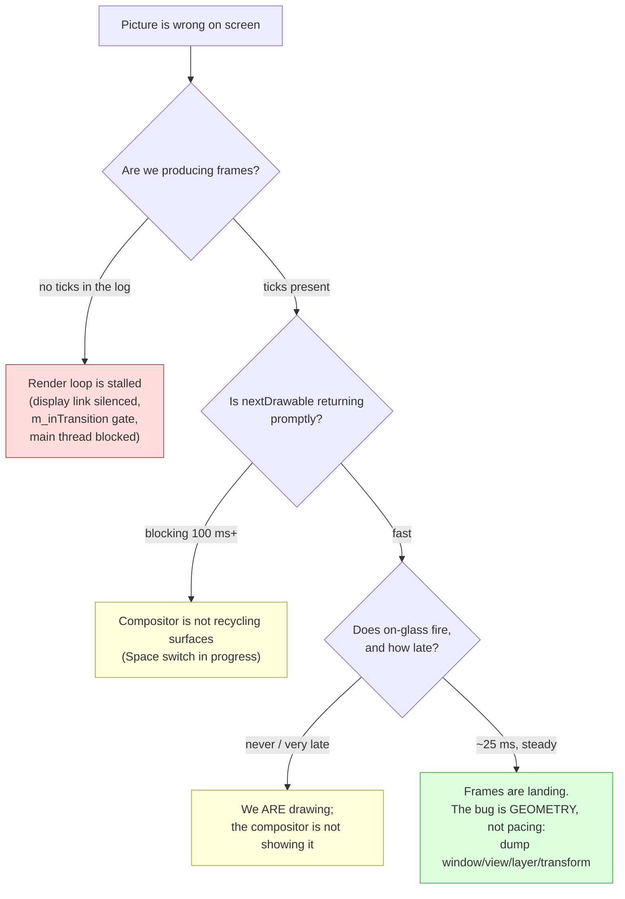
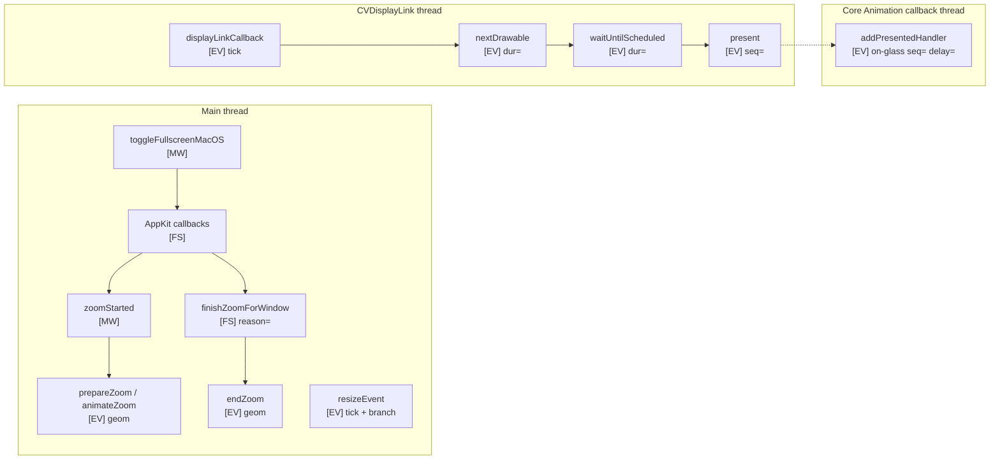

# Diagnosing the macOS fullscreen transition

A field guide to debugging the native-fullscreen (Space) transition in the Qt +
`CAMetalLayer` renderer. It covers how to instrument the subsystem, what to
measure, how to read the resulting logs, which observations are trustworthy and
which are not, and what the healthy numbers look like on the reference machine.

Companion documents: [architecture.md](architecture.md) (how the working
solution is built), [dead-ends.md](dead-ends.md) (what failed and why),
[implementation.md](implementation.md) (the complete code).

---

## 1. Scope and the core methodology lesson

### 1.1 What this subsystem is

Four independent actors share one picture during a transition, and only one of
them is ours:

| Actor | Runs on | Owns |
|---|---|---|
| AppKit's fullscreen machinery | main thread + window server | window frame, `styleMask`, Space creation/teardown, the animation *slot* it offers us |
| Core Animation render server | separate process | interpolation of the layer `transform`, final compositing |
| Qt | main thread, asynchronously | widget geometry, layout, `resizeEvent` delivery |
| Our renderer | `CVDisplayLink` thread + main thread | `drawableSize`, drawable acquisition, presents |

Every bug in this area is a *disagreement between two of these actors about
where the content is at a given instant*. None of them reports its state
synchronously to the others, and three of the four can be observed only
indirectly.

### 1.2 The lesson: nothing here is guessable

This is the single most important thing to carry into a debugging session.

Every real cause found during this investigation was found by timestamped
tracing. Not one was found by reading code and reasoning about it. Worse — the
hypotheses that *sounded* most convincing were, without exception, wrong, and
the traces are what killed them:

| Plausible hypothesis | Why it was believable | What the trace showed |
|---|---|---|
| An implicit CA animation on the layer is fighting our explicit one | Classic Core Animation footgun; `setFrame:` on a layer animates by default | Disabling implicit actions (`layer.actions = NSNull`) changed nothing. The lag was in **when** `setFrame:` was called, not in an animation attached to it |
| `contentsGravity` / `layerContentsPlacement` is stretching the frozen drawable | The symptom (content arriving from the side, wrong scale) looks exactly like a gravity problem | `layerContentsPlacement` does not apply to a layer-*hosting* view's own layer at all. The stretch came from `CAMetalLayer` mapping the drawable onto its bounds |
| The drawable pool is exhausted, so we cannot draw | `nextDrawable` was blocking for up to ~680 ms mid-transition — textbook pool exhaustion | The pool was fine. The *compositor* was not recycling surfaces during the Space switch. Presents that did complete were still landing on glass ~25 ms later. We were drawing; the compositor was not showing it |
| Presenting more frames during the animation will smooth it | "More frames = smoother" | The window server does not composite async presents during a Space switch: `inFlight` pinned at 3, frames landing every 100–150 ms — roughly 7 fps |

Three of those four cost hours each. All four would have been eliminated in
minutes by a single trace containing `nextDrawable` duration, present-to-glass
delay, and a geometry dump.

> **Rule.** Before you change a line of transition code, add the probe that
> would tell you whether your hypothesis is true. If you cannot name the
> measurement that would falsify your idea, you do not yet have an idea.

### 1.3 The one distinction that matters most

Almost every visual symptom in this subsystem reduces to one of three states,
and they are indistinguishable by eye:



The branch between C and D is the one that misled this work for hours. Without
an on-glass probe, "we are not drawing" and "we are drawing and nothing is
being shown" produce identical logs and identical screens. With it, the two
separate immediately.

---

## 2. Instrumentation setup

### 2.1 Running with a durable log

`qDebug()` writes to **stderr**, and the app is a bundle, so launching it from
Finder discards the output. Always run the binary directly and redirect both
streams:

```bash
cd /Users/dev/Projects/Test/unreal-ng/tools/poc/qt-gui
./build/unreal-ng-ui.app/Contents/MacOS/unreal-ng-ui > fullscreen-trace.log 2>&1 &
```

Points that matter in practice:

- **`2>&1` is not optional.** Without it the interesting half of the log is
  gone; `qDebug`/`qWarning` both go to stderr.
- **Background it (`&`).** The transition is interactive: you need the shell
  back to watch the log while you toggle fullscreen.
- **Watch it live in a second terminal** — `tail -f fullscreen-trace.log`.
  Fullscreen takes over the display, so reading the log on the same screen
  during the transition is impossible; either use a second display, or toggle
  a few times and read afterwards.
- **The log survives the app.** A crash, a hang, or a wedged window server
  still leaves everything up to the last flush on disk. This is the main reason
  for a file rather than a console.
- If output appears truncated after a hard kill, force line buffering:
  `stdbuf -oL -eL ./build/.../unreal-ng-ui > fullscreen-trace.log 2>&1 &`.

### 2.2 Tag convention

Three tags, one per layer, so a grep isolates a layer and a sort by timestamp
interleaves them:

| Tag | Emitted by | Covers |
|---|---|---|
| `[FS]` | `platform/macos/FullscreenHelper.mm` | AppKit delegate callbacks, teleports, finalization, chrome |
| `[MW]` | `src/MainWindow.cpp` | the state machine: toggle, style apply/restore, `zoomStarted`/`zoomFinished`, resize events |
| `[EV]` | `platform/macos/MetalScreenWidget.mm` | renderer events: ticks, drawable acquisition, presents, geometry dumps |

Every line begins with `QDateTime::currentMSecsSinceEpoch()` as a bare integer,
so `$1` in `awk` is always the timestamp. This is the whole reason the analysis
recipes in §5 are one-liners.

`FullscreenHelper.mm` already defines the pattern:

```objc
#define FS_LOG(msg) \
    qDebug().nospace() << QDateTime::currentMSecsSinceEpoch() << " [FS] " << msg
```

Add the two matching macros so all three layers are symmetric. In
`MainWindow.cpp`:

```cpp
#define MW_LOG(msg) \
    qDebug().nospace() << QDateTime::currentMSecsSinceEpoch() << " [MW] " << msg
```

In `MetalScreenWidget.mm`:

```objc
#define EV_LOG(msg) \
    qDebug().nospace() << QDateTime::currentMSecsSinceEpoch() << " [EV] " << msg
```

> **Thread note.** `[EV]` lines are emitted from the `CVDisplayLink` thread and,
> for `addPresentedHandler`, from a Core Animation callback thread. `qDebug()`
> serialises per statement, so lines do not interleave *within* a line, but
> ordering between `[EV]` and main-thread tags is only as good as the
> timestamps. Trust the numbers, not the line order.

### 2.3 Why epoch milliseconds

- Directly subtractable in `awk` with no parsing.
- Comparable across the three tags without a shared clock source.
- Millisecond resolution is enough: the phenomena of interest here are 16 ms
  (a frame) to 950 ms (a chrome restore). Sub-millisecond precision would add
  noise, not information.

If you ever need finer granularity for a single probe (GPU submission, for
example), use `std::chrono::steady_clock` locally and log the **delta** in
microseconds — but keep the line's leading timestamp in epoch ms so the
one-liners keep working.

---

## 3. What to log, and what each measurement proves

### 3.1 Probe map



### 3.2 Resize ticks with the branch taken

The most common failure mode is not "the wrong geometry was computed" but "the
geometry was computed by code that should not have run at all". Log the branch,
not just the event.

```objc
void MetalScreenWidget::resizeEvent(QResizeEvent* event)
{
    QWidget::resizeEvent(event);

    const bool zoom = m_zoomActive.load(std::memory_order_relaxed);
    EV_LOG("resize " << event->oldSize().width() << "x" << event->oldSize().height()
           << " -> " << event->size().width() << "x" << event->size().height()
           << " branch=" << (zoom ? "zoom-frozen"
                                  : (m_inTransition.load(std::memory_order_relaxed)
                                        ? "transition-sync" : "normal-sync")));

    if (zoom) {
        emit resized(event->size());
        return;                       // no drawable churn, no render
    }
    updateDrawableSize();
    render(true);
    emit resized(event->size());
}
```

`MainWindow::resizeEvent` already logs its own ignore-branch; keep both. A
resize that Qt delivers, `MainWindow` ignores, and `MetalScreenWidget` acts on
(or vice versa) is a bug class of its own, and only a two-sided log shows it.

**What it proves:** whether the freeze is actually holding. If you see
`branch=normal-sync` between `zoomStarted` and `zoomFinished`, Qt is writing
layer geometry underneath a running animation — that is the "content swims"
family of artefacts, and no amount of animation tuning will fix it.

### 3.3 Full geometry at every handoff point

There are five handoff points where the four actors exchange authority:
`startCustomAnimationToEnter/ExitFullScreen`, `prepareZoom`, `animateZoom`,
`finishZoomForWindow`, `endZoom`. Dump everything at each of them. Partial
dumps are near-worthless — the bugs are *disagreements*, so you need both sides
in the same line.

```objc
static void logGeom(const char* where)
{
    NSView*  view  = /* (__bridge NSView*)(void*)winId() */;
    NSWindow* win  = [view window];
    CAMetalLayer* layer = /* m_impl->metalLayer */;

    const NSRect wf = [win frame];                              // screen coords
    const NSRect vb = [view bounds];                            // view coords
    const NSRect vw = [view convertRect:vb toView:nil];         // rect in window
    const CGRect lf = layer.frame;
    const CGSize ds = layer.drawableSize;
    const CATransform3D t = layer.transform;
    const NSUInteger anims = [[layer animationKeys] count];

    qDebug().nospace() << QDateTime::currentMSecsSinceEpoch() << " [EV] geom " << where
        << " win=("  << wf.origin.x << "," << wf.origin.y << " "
                     << wf.size.width << "x" << wf.size.height << ")"
        << " viewInWin=(" << vw.origin.x << "," << vw.origin.y << " "
                     << vw.size.width << "x" << vw.size.height << ")"
        << " layer=(" << lf.origin.x << "," << lf.origin.y << " "
                     << lf.size.width << "x" << lf.size.height << ")"
        << " drawable=" << ds.width << "x" << ds.height
        << " sx=" << t.m11 << " sy=" << t.m22
        << " tx=" << t.m41 << " ty=" << t.m42
        << " anims=" << (int)anims;
}
```

| Field | Answers |
|---|---|
| `win` | Has the teleport happened yet? Is the window at the screen frame or the original frame? |
| `viewInWin` | Where Qt has actually placed the host view inside the window — catches chrome that has not been laid out away yet |
| `layer` | Whether the layer bounds match the frozen size we asked for, or something wrote over them |
| `drawable` | Whether the surface was recreated mid-animation (the "black square, late arrival" failure) |
| `sx`, `tx`, `ty` | The **model** transform. Compare against the value the animation should be interpolating to |
| `anims` | `0` at rest, `1` while `fsZoom` is attached. `2+` means an implicit animation got in; `1` after `endZoom` means `removeAnimationForKey:` did not run |

The `anims` counter is cheap and disproportionately useful: it is what turned
the "implicit animations" hypothesis from a belief into a measurement.

**Sanity invariants to check by eye in the dump:**

- On enter, immediately after `prepareZoom`: `layer` size equals the *new*
  content size, `sx` is well below 1, and the content rectangle implied by
  `sx`/`tx`/`ty` sits exactly where the old window's content was.
- `sx == sy` always. If they differ, someone reintroduced non-uniform scaling
  and the picture is being squashed.
- `tx`/`ty` are in points, not pixels. A factor-of-`devicePixelRatio` error
  shows up as a translation that is exactly 2× too large on a retina display.

### 3.4 `nextDrawable` duration

```objc
const qint64 t0 = QDateTime::currentMSecsSinceEpoch();
m_impl->metalLayer.allowsNextDrawableTimeout = YES;
id<CAMetalDrawable> drawable = [m_impl->metalLayer nextDrawable];
const qint64 dtDrawable = QDateTime::currentMSecsSinceEpoch() - t0;
if (!drawable) {
    EV_LOG("nextDrawable NIL after " << dtDrawable << "ms");
    return;
}
if (dtDrawable > 4)
    EV_LOG("nextDrawable slow dur=" << dtDrawable << "ms");
```

Threshold the log at a few milliseconds — a healthy acquisition is
sub-millisecond, and logging every one of them at 60 Hz buries the signal.

**What it proves:** how long the *producer* side was blocked. A long
`nextDrawable` means no free surface was available, which during a Space switch
means the compositor is not recycling them. Crucially, this measures our stall,
not the user's perceived stall — a fast `nextDrawable` with a bad picture on
screen points at geometry or at the compositor, never at the drawable pool.

### 3.5 `waitUntilScheduled` duration

Only on the synchronous path:

```objc
[encoder endEncoding];
if (syncPresent) {
    m_impl->metalLayer.presentsWithTransaction = YES;
    [cmdBuffer commit];
    const qint64 tw = QDateTime::currentMSecsSinceEpoch();
    [cmdBuffer waitUntilScheduled];
    const qint64 dtSched = QDateTime::currentMSecsSinceEpoch() - tw;
    if (dtSched > 4)
        EV_LOG("waitUntilScheduled dur=" << dtSched << "ms");
    [drawable present];
} else {
    m_impl->metalLayer.presentsWithTransaction = NO;
    [cmdBuffer presentDrawable:drawable];
    [cmdBuffer commit];
}
```

**What it proves:** the cost of gluing a frame to the current `CATransaction`.
This is the price paid for the synchronous path, and it is what makes the sync
path unusable from the display-link thread. If a transition feels "heavy" on
the main thread but the picture is correct, this is usually where the time went.

### 3.6 The on-glass probe — the decisive measurement

```objc
static std::atomic<uint64_t> s_presentSeq{0};
const uint64_t seq = s_presentSeq.fetch_add(1, std::memory_order_relaxed) + 1;
const qint64 tReq = QDateTime::currentMSecsSinceEpoch();

[drawable addPresentedHandler:^(id<MTLDrawable> d) {
    const qint64 delay = QDateTime::currentMSecsSinceEpoch() - tReq;
    qDebug().nospace() << QDateTime::currentMSecsSinceEpoch()
                       << " [EV] on-glass seq=" << seq << " delay=" << delay << "ms";
}];
EV_LOG("present req seq=" << seq
       << (syncPresent ? " sync" : " async")
       << " ndDur=" << dtDrawable << "ms");
```

**What it proves — and why it is the probe to add first:**

| Observation | Conclusion |
|---|---|
| `present req` lines stop | We are not drawing. Look at the tick source and the transition gates |
| `present req` continues, `on-glass` never arrives for those `seq`s | We are drawing and the compositor is discarding or deferring. Nothing on the producer side will help |
| `on-glass` arrives, delay ~25 ms, steady | The pipeline is healthy. Any remaining artefact is **geometry** — go to §3.3 |
| `on-glass` arrives in bursts after a long gap | Core Animation is batching the handlers. Do **not** build a frame-pacing scheme on top of this signal (see below) |

Two warnings, both learned the hard way:

1. **Do not gate rendering on this signal.** Waiting for "previous frame on
   glass" before drawing the next produced exactly 30 fps: on-glass latency is
   ~25 ms, so every second 60 Hz tick was skipped. It is a diagnostic, not a
   scheduler input.
2. **The handler is a cost.** It allocates a block per drawable and fires on a
   CA thread. Leave the probe compiled out (or behind a runtime flag) in normal
   builds.

### 3.7 The finalization reason

`finishZoomForWindow:` already takes a `reason` string and logs it. Never
remove it. It is a one-word answer to "which trigger won this time" — our
`dispatch_after` timer, `didEnterFullScreen`, or `didExitFullScreen` — and the
answer differs between runs, between directions, and under load. A regression
where finalization suddenly always fires on `timer` is visible in this field
alone.

### 3.8 Summary: the probe set

| Probe | Site | Cost | Keep in normal builds? |
|---|---|---|---|
| Resize tick + branch | `MetalScreenWidget::resizeEvent`, `MainWindow::resizeEvent` | negligible | yes |
| Geometry dump | 5 handoff points | ~1 line each, main thread | yes |
| `nextDrawable` dur | `render()` | one clock read/frame | yes, thresholded |
| `waitUntilScheduled` dur | `render()` sync path | one clock read/sync frame | yes, thresholded |
| `present req` seq | `render()` | one line/frame at 60 Hz | debug only |
| `on-glass` handler | `render()` | block allocation/frame | debug only |
| AppKit callbacks | `FullscreenHelper.mm` | negligible | yes |
| Finalization `reason` | `finishZoomForWindow:` | negligible | yes |

---

## 4. Reproducing cleanly

Before analysing anything, make the run reproducible:

1. **Single display, known resolution.** Multi-display setups add a second
   `NSScreen` and a second window-server path; debug on one display first.
2. **Toggle at least three times per run.** The first enter behaves differently
   — AppKit creates the Space, and `ensureKeyboardFocus` needs retries only on
   the first transition. Never draw conclusions from transition #1 alone.
3. **Toggle from a keyboard shortcut, not the green button.** The button path
   goes through a different AppKit entry point and carries no modifier key.
4. **Note the window state before entering.** Maximized vs. normal changes
   `_originalFrame` and therefore the exit teleport target.
5. **Do not touch the mouse during the transition.** A cursor move over the
   menu-bar hot zone at the top of a Space triggers AppKit's menu-bar reveal
   animation and pollutes the trace.
6. **Record the wall-clock time you saw the artefact.** With epoch-ms
   timestamps you can jump straight to that second in the log.

---

## 5. Log analysis recipes

All recipes assume the format `<epoch-ms> [TAG] message`, so `$1` is the
timestamp.

### 5.1 Find the gaps rather than reading linearly

The primary tool. Transitions are ~1–2 s of log; the interesting thing is
almost always a *hole*, not a line.

```bash
grep -E "\[EV\]|\[FS\]|\[MW\]" fullscreen-trace.log \
  | awk 'NR>1{g=$1-p; if(g>50) print "---- gap " g "ms ----"} {p=$1; print}'
```

Lower the threshold to `>20` once the big holes are gone; a 20 ms hole at 60 Hz
is already a dropped frame.

### 5.2 Relative timestamps from the start of a transition

Absolute epoch milliseconds are unreadable. Rebase them:

```bash
awk '/\[MW\] toggleFullscreenMacOS/ {t0=$1}
     t0 && $1 ~ /^[0-9]+$/ {printf "%+7d  %s\n", $1-t0, substr($0, index($0,"["))}' \
  fullscreen-trace.log
```

### 5.3 Extract a single transition

The Nth toggle through the following `did*Fullscreen`, plus 500 ms of tail so
the post-transition settle is included:

```bash
awk -v n=2 '
  /\[MW\] toggleFullscreenMacOS/ { c++ }
  c==n {
      if (end && $1 > end) exit
      print
      if (/did(Enter|Exit)Fullscreen/ && !end) end = $1 + 500
  }' fullscreen-trace.log
```

### 5.4 The transition skeleton

Strip the per-frame noise and look only at state changes:

```bash
grep -E "\[FS\]|\[MW\] (toggle|zoom|will|did|applyFullscreenStyle|restoreNormalStyle)" \
  fullscreen-trace.log
```

This is the first thing to read on any new trace. Nine times out of ten the
ordering anomaly is visible here without touching the frame data.

### 5.5 `nextDrawable` distribution

```bash
grep -o 'ndDur=[0-9]*' fullscreen-trace.log \
  | cut -d= -f2 \
  | awk '{s+=$1; n++; if($1>max) max=$1; if($1>16) slow++}
         END {printf "n=%d avg=%.1fms max=%dms over16ms=%d (%.1f%%)\n",
                     n, s/n, max, slow, 100*slow/n}'
```

### 5.6 Effective frame rate, in 100 ms buckets

```bash
awk '/\[EV\] present req/ {print int($1/100)}' fullscreen-trace.log \
  | uniq -c \
  | awk '{printf "%s  %s  %s\n", $2, $1, ($1<3 ? "<-- STALL" : "")}'
```

Ten frames per bucket is 100 fps (impossible), six is 60 fps, three is 30 fps,
one is a stall. This one command answers "is the pipeline running" faster than
any other.

### 5.7 Correlate presents with on-glass

```bash
awk '/present req seq=/ {
        match($0, /seq=[0-9]+/); s=substr($0, RSTART+4, RLENGTH-4); req[s]=$1
     }
     /on-glass seq=/ {
        match($0, /seq=[0-9]+/); s=substr($0, RSTART+4, RLENGTH-4);
        printf "seq=%-6s req=%s glass=+%dms\n", s, req[s], $1-req[s]; delete req[s]
     }
     END { for (s in req) printf "seq=%-6s req=%s glass=NEVER\n", s, req[s] }' \
  fullscreen-trace.log
```

The `END` block is the payoff: it lists every frame that was submitted and never
reached the screen. A run of `glass=NEVER` entries that starts at
`startCustomAnimation` and ends at `didEnterFullScreen` is the signature of the
compositor withholding during a Space switch.

### 5.8 Correlate resize ticks with presents

```bash
grep -E "\[EV\] (resize|present req)" fullscreen-trace.log \
  | awk 'NR>1 {printf "%+5dms  %s\n", $1-p, substr($0, index($0,"["))} {p=$1}'
```

Every `resize` on the sync path should be followed within a few milliseconds by
a `present req ... sync`. A `resize` with no present after it is a frame where
the window moved and the content did not — the drift signature.

### 5.9 Annotated example: a healthy enter

Reconstructed composite, times rebased to the toggle. The numeric costs are the
reference values from §7.

```
     +0  [MW] toggleFullscreenMacOS state=0
     +0  [MW] entering fullscreen
     +1  [MW] setFullscreenLayout aspect=1.77778
     +1  [MW] applyFullscreenStyle START
     +9  [MW] applyFullscreenStyle END              # bars gone, one batched repaint
    +10  [FS] hideWindowChrome done
    +12  [EV] resize 1280x960 -> 1280x1004 branch=transition-sync
    +14  [EV] present req seq=8412 sync ndDur=0ms
    +18  [EV] on-glass seq=8412 delay=4ms           # chrome-less frame is committed
    +62  [FS] calling toggleFullScreen              # the 50ms runloop turn
    +64  [FS] willEnterFullScreen
    +64  [MW] willEnterFullscreen
    +66  [FS] customWindowsToEnterFullScreenForWindow
    +71  [FS] startCustomAnimationToEnterFullScreen duration=0.5
    +71  [EV] geom prepareZoom win=(0,0 3840x2160) viewInWin=(0,0 3840x2160)
              layer=(0,0 3840x2160) drawable=3840x2160
              sx=0.333 sy=0.333 tx=1280 ty=578 anims=0
    +73  [EV] present req seq=8413 async ndDur=1ms
    +74  [EV] geom animateZoom  ... sx=1.000 sy=1.000 tx=0 ty=0 anims=1
    +90  [EV] present req seq=8414 async ndDur=0ms
   +105  [EV] on-glass seq=8413 delay=32ms
    ...                                              # ~55Hz of async presents
   +496  [FS] didEnterFullScreen
   +496  [FS] zoom finish (didEnterFullScreen)       # AppKit won the race
   +497  [MW] zoomFinished
   +497  [EV] geom endZoom win=(0,0 3840x2160) layer=(0,0 3840x2160)
              drawable=3840x2160 sx=1.000 tx=0 ty=0 anims=0
   +499  [EV] present req seq=8441 sync ndDur=0ms
   +503  [EV] waitUntilScheduled dur=2ms
   +524  [EV] on-glass seq=8441 delay=25ms
   +697  [MW] didEnterFullscreen
```

Read it as five assertions:

1. `applyFullscreenStyle` + `hideWindowChrome` + a **synced** present all
   complete *before* `calling toggleFullScreen`. If a present lands after the
   toggle, AppKit captured chrome that is no longer there.
2. `prepareZoom` reports `sx≈0.333` and `anims=0` — the static transform is in
   place before any animation exists. This is what prevents the one-frame pop.
3. `animateZoom` reports the **model** already at identity (`sx=1.000`) with
   `anims=1`. The model jumps; only the presentation is animated.
4. Presents continue at roughly display rate throughout, and on-glass keeps
   arriving. The picture is live.
5. `zoom finish` names its trigger, and it runs *before* `[MW] didEnterFullscreen`.

### 5.10 Annotated example: a pathological exit

Same format. This is the shape of the trace during the two-animator era.

```
     +0  [MW] toggleFullscreenMacOS state=2
     +0  [MW] exiting fullscreen
     +2  [FS] willExitFullScreen
     +2  [MW] willExitFullscreen
     +4  [FS] startCustomAnimationToExitFullScreen duration=0.5
     +5  [EV] geom animateZoom win=(0,0 3840x2160) layer=(0,0 3840x2160)
              sx=1.000 tx=0 ty=0 anims=1
     +7  [EV] present req seq=9130 async ndDur=0ms
   +120  [EV] present req seq=9131 async ndDur=113ms      # <-- compositor stopped recycling
   +240  [EV] present req seq=9132 async ndDur=118ms
---- gap 680ms ----
   +920  [EV] present req seq=9133 async ndDur=680ms      # <-- worst case
   +921  [EV] on-glass seq=9130 delay=914ms               # first frame finally shown
   +922  [EV] on-glass seq=9131 delay=802ms               # ...batched
     ...
   +530  [FS] zoom finish (timer)                         # our timer won
  +1106  [FS] didExitFullScreen                           # 576ms later
  +1106  [MW] didExitFullscreen
  +1107  [MW] restoreNormalStyle START
  +2056  [MW] restoreNormalStyle END                      # 949ms of three bar show()s
  +2058  [MW] resizeEvent 3840x2160 -> 3840x2055          # phantom "maximized" frame
```

Every pathology in one trace:

| Line | Reading |
|---|---|
| `ndDur=113ms`, then `680ms` | ~7 fps. The window server is not compositing async presents during the Space switch. The producer is not the problem — the consumer is |
| `on-glass delay=914ms`, arriving in a batch | Confirmation: the frames existed, they were just not shown. This is the C-vs-D branch of §1.3 resolving to C |
| `zoom finish (timer)` at +530, `didExitFullScreen` at +1106 | The 576 ms disagreement between our timer and AppKit's own state. Whatever the direction, never assume they agree |
| `restoreNormalStyle` 949 ms | Three bar `show()`s while the window server is busy tearing down the Space |
| `3840x2055` | The phantom frame: a fullscreen-sized window that Qt reads as "maximized" because the teleport never happened (2160 minus chrome) |

If you see the `3840x2055`-shaped line, stop reading everything else and check
whether `finishZoomForWindow:` ran and whether `_pendingTeleport` was non-zero.

---

## 6. Sources that lie

Each of these was believed, acted upon, and disproved. They are listed with the
evidence so the next reader does not have to re-derive it.

### 6.1 `presentationLayer` read from the `CVDisplayLink` thread

**The claim:** `layer.presentationLayer` gives you the true, currently-composited
geometry, so the renderer can chase the animation from the display-link thread.

**The evidence:** it returned **704×522 for a 3840×2160 model**. Not a lagging
value, not an interpolated value — an unsynchronised read of a structure the
render server owns, sampled from the wrong thread.

**Rule:** read `presentationLayer` on the main thread or not at all. In this
design, not at all: the whole point of teleport-plus-transform is that nothing
needs to chase anything.

### 6.2 Qt widget size during a transition

**The claim:** `width()`/`height()` on the widget tell you the current size.

**The evidence:** Qt's geometry is updated asynchronously from AppKit's. During
a transition it lags by one or more ticks. Chasing the window from
`NSWindowDidResizeNotification` produced the same drift as animating the frame
directly, "slightly smaller" — the notification fires with the *previous* view
bounds because the host view is a Qt child.

**Scale of the error:** during a frame animation the window moves at roughly
6 px/ms, and Qt's ticks arrive with 16–65 ms of jitter — up to **400 px** of
disagreement.

**Rule:** during a transition, Qt sizes are for logging, not for arithmetic.

### 6.3 `NSView.bounds` at finalization time

**The claim:** `NSView.bounds` is the AppKit truth, so `endZoom()` can read the
final size back from the view.

**The evidence:** at finalization the teleport has been *issued* but has not
reached the view. `endZoom()` reads the pre-teleport size. This is exactly why
the attempt to replace the finalization timer with a `CATransaction` completion
block failed: the completion fires before the teleport propagates, `endZoom()`
read stale fullscreen bounds, and the content snapped to the top-left at full
size.

**Rule:** `NSView.bounds` is trustworthy at rest and untrustworthy inside the
transaction that is changing it. The fix is to pass the final size *in*
explicitly from `finishZoomForWindow:`, where it is known from the frame just
set — see the trap note at the end of [implementation.md](implementation.md).

### 6.4 The duration AppKit hands the custom-animation delegate

**The claim:** `startCustomAnimationToEnter/ExitFullScreenWithDuration:` tells
you how long AppKit will wait, so a `dispatch_after` on that duration is a valid
completion signal.

**The evidence:** AppKit does not honour it. The measured disagreement between
our timer and AppKit's own state change is **576 ms** — large enough that
waiting only for the timer left an un-teleported fullscreen-sized window with
the transform still attached, which Qt then read as "maximized" (the phantom
3840×2055 frame).

**Rule:** treat the duration as a *hint for the animation curve only*.
Finalization must be idempotent and must fire on whichever of the two triggers
arrives first — and it must run before the `didEnter`/`didExit` delegate
callback. The `reason=` field in the log is how you tell which one won.

### 6.5 Quick reference

| Source | Trustworthy when | Lies when | Observed error |
|---|---|---|---|
| `layer.presentationLayer` | main thread, at rest | any read from the display-link thread | 704×522 vs. 3840×2160 |
| Qt `width()`/`height()` | at rest | during any transition | up to ~400 px |
| `NSView.bounds` | at rest | inside the transaction changing it | full pre-teleport size |
| AppKit's animation duration | never as a completion signal | always | 576 ms |
| `addPresentedHandler` timing | as a diagnostic | as a scheduler input | forces 30 fps |
| `layer.frame` after `setFrame:` | immediately (model value) | as "what is on screen" | whole animation delta |

---

## 7. Reference performance numbers

Dev machine: **3840×2160 non-retina display, Qt 6.9, macOS 15.** Measured
repeatedly across sessions. Use them as the baseline: a number 2× off here is a
regression worth chasing, a number within the stated range is normal.

### 7.1 Transition costs

| Thing | Cost |
|---|---|
| AppKit Space teardown after our animation | ~576 ms |
| `restoreNormalStyle` (three bar `show()`s) during teardown | ~949 ms |
| `nextDrawable` when the compositor is mid-Space-switch | up to ~680 ms |
| `waitUntilScheduled` per synced present under load | 10–50 ms |
| On-glass latency for a present | ~25 ms |
| Animator tick rate during a custom window animation | ~55 Hz, jitter to 65 ms |

### 7.2 What "bad" looked like in the rejected designs

Useful as calibration — if a new experiment reproduces one of these numbers, it
has reproduced the corresponding dead end.

| Configuration | Observed |
|---|---|
| Async presents as the only frame source during the transition | ~7 fps; `inFlight` pinned at 3; frames every 100–150 ms |
| Rendering gated on "previous frame on glass" | exactly 30 fps, with 8–20 tick stalls |
| Layer geometry driven from Qt resize ticks | 16–65 ms lag ≈ up to 400 px, window moving ~6 px/ms |
| `NSDisableScreenUpdates` + `display:YES` + `CATransaction flush` | display frozen 400–690 ms |
| Exit teleport to `_originalContentRect` instead of `_originalFrame` | window 28 px short, then a second corrective jump |

### 7.3 Interpreting deviations

| Deviation | Likely meaning |
|---|---|
| `nextDrawable` consistently >16 ms **outside** a transition | Real drawable-pool pressure, or `maximumDrawableCount` was lowered |
| On-glass latency well above ~25 ms at rest | Another app is saturating the window server; re-run clean |
| Animator ticks far below 55 Hz | Main thread is blocked — look for a synchronous present on the main thread inside the animation |
| `restoreNormalStyle` well under 949 ms | Good, but verify the bars actually came back; this cost is dominated by the window server being busy, so a fast restore may mean it ran too early |

---

## 8. Triage table: symptom → cause → next measurement

| Symptom | Likely cause | Measure next |
|---|---|---|
| Content slides toward the bottom-right on enter (mirrored on exit) | Two animators: the window frame and the layer are both moving | Geometry dump at each animator tick. Confirm the window frame is changing *at all* after `startCustomAnimation` — it must not |
| Content is squashed or stretched | Non-uniform scale: separate `sx`/`sy` instead of a content-to-content uniform `k` | `sx` vs `sy` in the geometry dump. They must be equal |
| One-frame pop at full size when the animation starts | `prepareZoom`'s static transform missing or computed from the wrong box | `geom prepareZoom` line: `sx` must already be the small value with `anims=0` |
| Picture freezes for ~0.5 s in the middle of the transition | The frame pump is gated off, or presents are being withheld | `present req` bucket rate (§5.6) first; then on-glass (§5.7) to split "not drawing" from "not shown" |
| ~7 fps during the transition | Async presents during a Space switch are not being composited | `ndDur` distribution (§5.5). Values in the 100–680 ms band confirm it |
| Exactly 30 fps | Rendering is gated on the on-glass signal | Remove the gate. Confirm via on-glass delay ≈ 25 ms against a 16.7 ms tick |
| Small rectangle appears at the screen's top-left corner at the end of exit | The layer settled before the window teleport reached the screen | `geom endZoom` `win=` field: is it still the screen frame? Check `NSDisableScreenUpdates` bracketing and that `display:NO` is used |
| Garbage crop in the top-left corner at the end of exit | `render()` ran *after* the geometry commit instead of inside it | Confirm the `present req ... sync` timestamp falls between `geom endZoom` and the transaction commit |
| Whole display freezes for 0.4–0.7 s | `display:YES` or a `CATransaction flush` inside the `NSDisableScreenUpdates` bracket | Time the bracket; the freeze is the bracket duration |
| Window ends up fullscreen-sized but out of the Space; Qt thinks it is maximized | Finalization never ran, or ran without `_pendingTeleport` | `zoom finish (reason)` present? A `resizeEvent ... -> 3840x2055` afterwards confirms it |
| A second jump right after the exit settles | Teleported to the content rect instead of the frame (28 px short) | Compare the `win=` height in `geom endZoom` against `_originalFrame` |
| Chrome (title bar, toolbar) visible on top of the transition | Bars were hidden asynchronously; AppKit captured the old layout | Ordering in §5.4: `applyFullscreenStyle END` and a synced present must both precede `calling toggleFullScreen` |
| Keyboard dead after a transition | A modifier press entered the ZX matrix and its release was lost | Not a rendering bug — see the `releaseAllKeys()` note in [implementation.md](implementation.md) |
| App no longer quits when the window is closed | Qt's `QNSWindowDelegate` was replaced without forwarding | Check `respondsToSelector:`/`forwardingTargetForSelector:` and that `_qtDelegate` was captured before install |
| Everything is correct on transition #2 and #3, wrong on #1 | First-transition-only AppKit behaviour (Space creation, first-responder theft) | Compare the three transitions side by side with §5.3 |

---

## 9. Artefacts that never appear in the logs

A significant fraction of the visual bugs in this subsystem are **compositor-side**.
The window server decides what to draw from state we handed it earlier; by the
time the artefact is on the glass there is nothing left in our process to log.
The producer trace can be perfectly healthy — presents at 60 Hz, on-glass at
25 ms, geometry exactly as intended — and the screen can still be wrong.

### 9.1 Which artefacts are compositor-side

| Artefact | Why nothing logs it |
|---|---|
| Stale or garbage content in a corner during resize | The compositor is stretching/cropping the *last* surface we gave it under `layerContentsPlacement`. We never drew that pixel |
| A one-frame flash of the old chrome | AppKit's own snapshot, taken inside the window server. Our process is not involved |
| Content "swimming" against the window edge | Two committed transactions reaching the screen at different times. Both commits logged fine |
| A black frame at the start or end of the zoom | A surface was recreated and the compositor had nothing valid to show for one refresh |
| The whole display freezing | The window server is blocked. Our log simply has a hole, with no line saying why |

### 9.2 How to reason about them anyway

Since you cannot observe them directly, convert them into something you *can*
observe:

1. **Bracket the artefact in time.** Screen-record the transition (macOS
   ⇧⌘5 at 60 fps), then step frame by frame to find the exact frame where it
   appears. A 60 fps recording gives ±17 ms. Correlate that offset against the
   `[FS]`/`[MW]` skeleton — the artefact almost always lands on a specific
   handoff point.
2. **Reason about what the compositor was last given.** At the artefact's
   timestamp, look at the most recent `geom` dump and the most recent
   `on-glass`. The compositor is showing *that* surface at *that* geometry. The
   corner-garbage bug was solved exactly this way: at the artefact's instant the
   layer had already been resized small while its contents were still the
   full-screen drawable.
3. **Bisect by removing one commit at a time.** If the artefact is a
   disagreement between two commits, collapsing them into one transaction
   either fixes it or proves it was not that. This is a cheap, decisive
   experiment; the `endZoom` fix is its outcome.
4. **Use `NSDisableScreenUpdates` as a probe, not only a fix.** Bracketing a
   suspect region and seeing the artefact disappear proves the artefact is a
   *tearing* between two commits rather than a wrong value in either. (Watch the
   cost: with `display:YES` or a flush inside the bracket the display freezes
   400–690 ms.)
5. **Change the compositor's fallback behaviour and see if the artefact
   changes shape.** `layerContentsPlacement` is `TopLeft` normally and
   `ScaleProportionallyToFit` during a transition. If flipping it moves the
   garbage from the corner to a stretched full-frame, you have confirmed the
   artefact is compositor fill of a stale surface, not our rendering.
6. **Slow the animation down.** Temporarily forcing a 3–5 s duration turns a
   one-frame artefact into something you can look at directly. Many of the
   drift bugs were only *identifiable* at 5×; at 0.5 s they were all just "a
   flicker".

### 9.3 The negative result is data

If the trace is healthy across the whole window in which the artefact appears —
ticks steady, `ndDur` low, on-glass at ~25 ms, geometry exactly as designed —
then you have *proved* the bug is not in the producer. That is a real result:
it eliminates the entire renderer and points at commit ordering, at
`NSDisableScreenUpdates` bracketing, or at what the compositor was handed
earlier. Do not keep re-instrumenting the renderer after it has been cleared.

---

## 10. Debugging checklist

For a fresh regression, in order:

- [ ] Reproduce with §4's clean-run rules; at least three toggles.
- [ ] Read the skeleton (§5.4). Is the callback ordering intact?
- [ ] Run the gap finder (§5.1) at 50 ms, then 20 ms.
- [ ] Check `zoom finish (reason)` — which trigger won, in each direction?
- [ ] Check the frame-rate buckets (§5.6). Producer alive or not?
- [ ] If alive: on-glass correlation (§5.7). Any `glass=NEVER`?
- [ ] If frames are landing: the bug is geometry. Diff the five `geom` dumps
      against the invariants in §3.3.
- [ ] `sx == sy`? `anims` 0/1 as expected? Does `win=` show the teleport?
- [ ] Still nothing in the logs? It is compositor-side — go to §9.
- [ ] Before committing a fix, re-run and confirm the §7 numbers have not
      regressed, especially `restoreNormalStyle` and `nextDrawable`.
