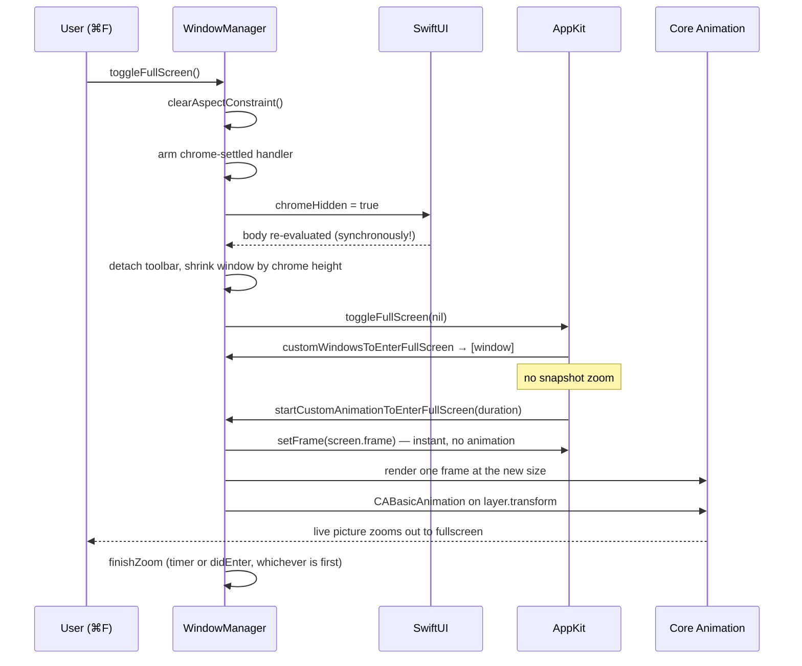

# Native macOS POC — fullscreen transition

Findings from making `tools/poc/macos-native` (Swift + SwiftUI + Metal) enter and
leave macOS fullscreen with live content, no AppKit snapshots, and no window
chrome in the animation.

This is a companion to `docs/inprogress/2026-08-09-fullscreen-transition/`, which
covers the same problem in the Qt POC. The architecture is shared; everything
here is about what is **different** when the host is SwiftUI instead of Qt, plus
the one piece of maths that was wrong in this port and cost most of the session.

---

## 1. The requirement

* Entering fullscreen must put the window on its own Space (the user was explicit:
  "мне нужен именно бесшовный вход на new space").
* The zoom must show **live** emulator output at 50 Hz, not a bitmap.
* Title bar, toolbar and status bar must be gone **before** the animation starts,
  so the animation runs on a bare device frame already at the target aspect ratio.
* Coming back must land the window exactly where it was.

---

## 2. Architecture: teleport + layer zoom

Identical in shape to the Qt POC.



Two rules that come straight from the Qt work and still hold:

* **The window teleports; only the layer animates.** NSWindow's animator is an
  app-side timer with its own curve, Core Animation interpolates on the render
  server. Two animators agree only at the endpoints, never mid-motion.
* **Finalisation is idempotent** and runs on whichever arrives first, our timer or
  AppKit's did-callback, because AppKit does not honour the duration it handed us.

---

## 3. The bug that cost the session: anchorPoint

**Symptom.** The picture did not zoom into place. On the way back it slid away
towards the bottom-left corner while shrinking, then snapped to the target frame.

**Wrong model.** The transform was built as a difference of *centres*:

```swift
// WRONG — assumes the layer scales about its middle
var offset = CATransform3DMakeTranslation(rect.midX - viewRect.midX,
                                          rect.midY - viewRect.midY, 0)
offset = CATransform3DScale(offset, scale, scale, 1)
```

**Ground truth.** A view's backing layer has `anchorPoint = (0, 0)` — logged and
confirmed at runtime:

```
[WindowManager] zoom out target={{1216,515},{1408,1152}} picture={{600,0},{2640,2160}} anchor=0.0,0.0 scale=0.533
```

Scaling therefore happens about the layer's **corner**. A centre-based offset
leaves a residual displacement of `(1-k)·size/2`, which drags the shrinking
picture towards that corner. With `k = 0.533` on a 3840×2160 layer that is roughly
900×500 pt of drift — exactly the "уезжает вниз налево" that was reported.

**Fix — map corner to corner**, in the layer's own coordinates, the way
`MetalScreenWidget::zoomTransformFor` already did it in the Qt POC:

```swift
let scale = target.height / picture.height
let offset = CATransform3DConcat(
    CATransform3DMakeScale(scale, scale, 1),
    CATransform3DMakeTranslation(target.minX - scale * picture.minX,
                                 target.minY - scale * picture.minY, 0))
```

Note `Concat(Scale, Translate)` — scale first, then translate. Reversing the order
scales the translation too.

Two further details:

* The transform is built around the **picture**, not the view. In fullscreen the
  view is the whole screen and the picture is pillarboxed inside it; scaling by
  the view's height sizes the image wrong at t=0 and pops.
* All rects must be converted from screen coordinates into the layer's space
  first. The layer does not know where the window is.

---

## 4. SwiftUI publishes synchronously

**Symptom.** The chrome came off only *after* the transition, no matter how early
`chromeHidden = true` was set. Instrumentation said the opposite — the flag was
set half a second before the transition began.

**Ground truth.** Logging the body evaluation next to the setter:

```
17:55:44.902 [ContentView] body: chromeHidden=yes    ← 2 ms EARLIER
17:55:44.904 [WindowManager] chrome hidden (was 0x60)
17:55:46.478 [WindowManager] chrome settle timed out
```

SwiftUI re-evaluates the body **synchronously, inside the assignment**. A
subscription installed on the next line therefore misses the only notification it
will ever get, and the wait always timed out — handing over to AppKit with the
bars still on screen.

**Fix.** Arm the wait *before* mutating the state:

```swift
whenChromeSettled { window.toggleFullScreen(nil) }   // first
hideChromeForFullScreen(reframe: true)               // then
```

`ContentView` reports the event back via `.onChange(of: windowManager.chromeHidden)`,
which fires only once the body has genuinely been re-evaluated. After the fix:

```
[WindowManager] chrome applied by SwiftUI after 2ms, picture 1152
```

Screenshot taken 1 s after ⌘F went from "old Space, window with title and status
bar" to a clean fullscreen picture — the decisive before/after.

---

## 5. The AppKit snapshot cannot be beaten by timing

**Symptom.** A ghost image of the chromed window zooming, while the live window
underneath had none.

**Why.** Snapshotting the window is the *first* thing AppKit's zoom does, and it
happens **before** `windowWillEnterFullScreen`. Nothing a delegate does can keep
the bars out of that bitmap. Two separate attempts to fix this by hiding the
chrome earlier in the callback chain failed for this reason.

**Fix.** Return the window from `customWindowsToEnterFullScreen(for:)` /
`customWindowsToExitFullScreen(for:)`. That takes AppKit's snapshot zoom out of
the picture entirely — and obliges us to provide the animation.

---

## 6. Direction of travel: never ask the style mask

**Symptom.** Entering fullscreen restored the chrome half-way through, then AppKit
finished the transition around it — fullscreen *with* a title bar and status bar.
Coming back landed maximised instead of at the original size.

**Ground truth.**

```
17:14:57.984 [WindowManager] finish zoom (enter-timer)
17:14:57.987 [WindowManager] chrome restored      ← on the way IN
```

Finalisation decided "we are leaving" with
`isExiting || !window.styleMask.contains(.fullScreen)`. With a **custom**
transition AppKit only sets `.fullScreen` at its did-callback, which lands *after*
our finalisation — so on the way in the window still looks windowed, and the exit
branch ran by mistake. It also cleared `savedFrame`, which is why the subsequent
exit had no target to animate to and stayed maximised.

**Fix.** Direction comes from `windowWillEnter/ExitFullScreen` and nothing else.
The same applies to publishing `isFullScreen`.

---

## 7. Publishes during the animation

**Symptom.** Four discrete redraws of the device frame at different positions and
zoom levels instead of one smooth zoom.

**Why.** Every `@Published` write rebuilds the SwiftUI tree and re-runs the
toolbar's Combine sink; each rebuild relayouts the view the transform is anchored
to, and the picture jumps. `isFullScreen` was being set from the did-callback,
i.e. mid-flight.

**Fixes.**

* Set `isFullScreen` in finalisation, when nothing is moving any more.
* `.ignoresSafeArea(.all, edges: chromeHidden ? .all : [])` — otherwise SwiftUI
  keeps reserving 28 pt for a title bar that is not there and re-decides that
  mid-animation (view came out 3840×2132 instead of 3840×2160).
* Hide the chrome *before* asking for the transition, not inside it, so the
  layout has settled while nothing is in motion.

---

## 8. The drawable comes up cleared

**Symptom.** A black flash at the start of the zoom.

**Why.** The teleport gives the view its fullscreen bounds instantly;
`autoResizeDrawable` reallocates the drawable, which arrives cleared. The frame
pump is deliberately silent during a transition, so nothing ever filled it.

**Fix.** `renderForTransition()` — one synchronous frame at the new geometry,
inside a `CATransaction` with actions disabled, using the transaction-tied present
path (`presentsWithTransaction` + `waitUntilScheduled` + `drawable.present()`).
Then the transform shrinks that real picture back to where the window used to be.

Deliberately **not** done: clearing `autoResizeDrawable`. MTKView only recomputes
`drawableSize` from a bounds change; a bounds change that happens while the flag
is off is lost forever and the picture stays stuck at its windowed size in the
corner.

---

## 9. The toolbar comes back by itself

**Symptom.** Fullscreen still showed a toolbar strip over the picture, even though
`toolbar.isVisible = false` had been set.

**Why.** AppKit takes over toolbar visibility in fullscreen and re-presents a
hidden toolbar as a titlebar overlay. With the content spanning the whole window
(`ignoresSafeArea`) that overlay lands on top of the picture.

**Fix.** Detach it — `savedToolbar = window.toolbar; window.toolbar = nil` — and
put it back on exit. A window with no toolbar has nothing to re-present. Plus
`willUseFullScreenPresentationOptions` returning `.autoHideToolbar`,
`.autoHideMenuBar`, `.autoHideDock`.

**Watch out:** re-attaching resets `toolbarStyle`. Declaring `.unified` in
`install(on:)` while the scene declared `.unifiedCompact` made the measured chrome
74 pt at launch and 50 pt after a round trip, and that 24 pt difference showed up
as a resize jerk at the end of every exit. Both declarations must agree.

---

## 10. NSDisableScreenUpdates is expensive here

Measured inside finalisation:

```
17:20:46.743 finish zoom (exit-timer)
17:20:47.267 chrome restored          ← 524 ms of dead time in between
```

That is the performance problem its deprecation note warns about. Replaced with a
`CATransaction` with `setDisableActions(true)`, which is enough because nothing in
that block reallocates a drawable.

It is still used around the *enter* teleport, where several window-level changes
must reach the screen as one frame. Rules carried over from the Qt POC: use
`display: false`, and **never** add a `CATransaction flush` — that froze the
display for 400–690 ms.

---

## 11. AppKit re-asserts its own idea of the frame

At the end of an exit, AppKit restores the frame it recorded when the transition
began — which is the shrunk, chrome-less one, because the chrome comes off before
we ask for fullscreen. It lands *after* our finalisation, leaving the window
offset by the height of the bars.

**Fix.** Re-assert the real pre-fullscreen frame one runloop turn later, and only
if it actually differs.

---

## 12. Dead ends

| Attempt | Result |
|---|---|
| Hide chrome in `windowWillEnterFullScreen` | Too late — the snapshot is already taken. Made the ghost worse, since the live window then differed from the bitmap. |
| Hide chrome without reframing the window | The picture grows into the freed space; only the height changes, so the aspect breaks. This was the "ratio distortion before the animation". |
| Poll geometry to detect that SwiftUI had relayouted | Every quantity worth comparing already held its final value, so the wait passed on attempt 0. Logged "settled after 0 passes" while the bars were still on screen. |
| `layoutSubtreeIfNeeded()` to force a SwiftUI update | Lays out the existing tree; does not make SwiftUI re-evaluate a body for a changed `@Published`. |
| Centre the exit target on the screen | A fix for a misdiagnosis (the real cause was the anchor point) that also moved the window away from where the user left it. Reverted. |
| Decide direction from `styleMask` | Not authoritative during a custom transition. See §6. |
| `.fullSizeContentView` in the style mask | Not attempted on purpose: per the Qt notes it leaks through the Space transition and breaks the responder chain. |

---

## 13. How to debug this

Guessing does not converge here; three things gave ground truth.

* **Log to a file, not to the console.** `UN_GEOMETRY_LOG=1` plus stdout
  redirection. Unified logging did not capture `NSLog` from this app reliably.
* **Screenshots.** A capture 1 s into the transition settled several arguments
  that timing logs could not — most importantly that the end state was already
  correct while the animation was not.
* **Drive the transition from the shell** so the run is reproducible:

```bash
osascript -e 'tell application "System Events" to set frontmost of \
  (first process whose name contains "unreal-ng") to true'
osascript -e 'tell application "System Events" to keystroke "f" using command down'
screencapture -x shot.png
```

`screencapture -V 6 rec.mov` records the whole transition when a single frame is
not enough; ffmpeg can then split it into frames.

**Testing hazard:** macOS window restoration persists the frame across launches.
A run that ended with a broken (maximised) frame starts the next one at that size
— seen as `sizing … scale=9`, which then poisons the next measurement. Check the
first `sizing` line in the log before trusting a run.

---

## 14. Still open

* The forward transition has not been signed off by eye; the backward one has.
* Debug instrumentation (ContentView body log, verbose zoom lines) is still in,
  gated behind `UN_GEOMETRY_LOG`.
* File menu: snapshot load/save (SNA/Z80) to match unreal-qt is not started.
