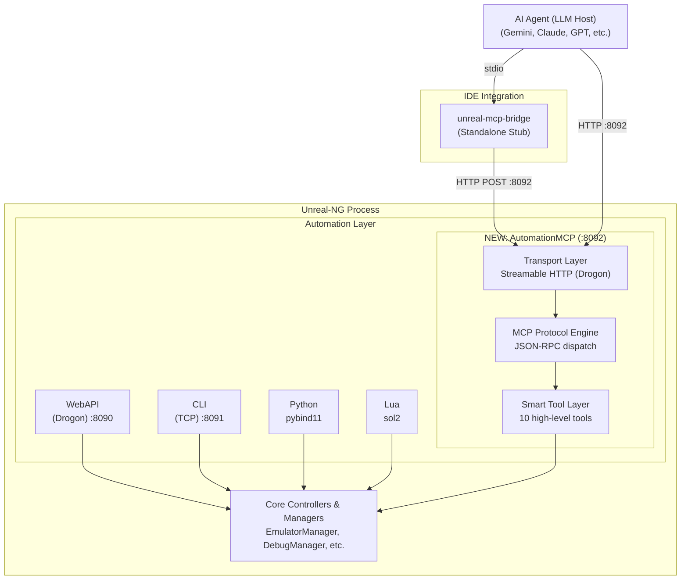
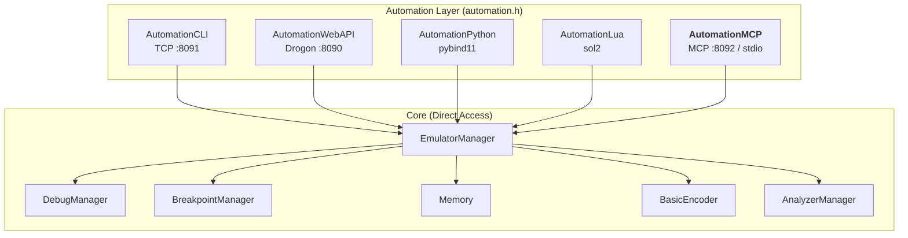
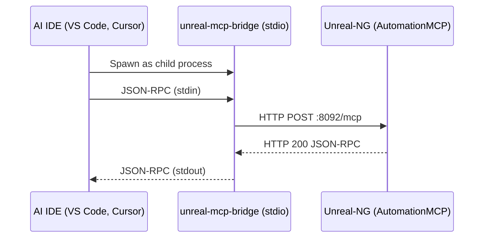

# MCP Server for Unreal-NG: Technical Design

> **Status**: Draft  
> **Date**: 2026-08-14  
> **Author**: AI-Assisted Design  
> **Scope**: Embedded C++ MCP automation module enabling AI agents to interact with the Unreal-NG emulator

---

## 1. Motivation & Problem Statement

Unreal-NG exposes a rich automation surface through four first-class interfaces (CLI, WebAPI, Python/pybind11, Lua/sol2). The WebAPI alone registers **100+ REST endpoints** across 16 domain-specific API files. While this granularity is excellent for human developers and purpose-built scripts, it creates a severe impedance mismatch for AI agents:

| Challenge | Impact |
|:---|:---|
| **Tool Count Explosion** | LLM agents have limited tool-calling budgets per turn. 100+ tools overwhelm context windows and reduce selection accuracy. |
| **Semantic Fragmentation** | Achieving a single logical goal (e.g., "load a game and check if it runs") requires orchestrating 5-10 sequential API calls with correct IDs, state checks, and delays. |
| **State Management Burden** | Agents must track emulator UUIDs, pause states, ROM modes, and timing constraints — all foreign to the LLM's training distribution. |
| **Error Recovery Complexity** | Raw APIs return transport-level errors (404, 400) that require domain-specific interpretation for recovery. |

### Design Principle: The Hybrid "80/20" Strategy

Instead of blindly exposing every WebAPI endpoint (which would yield 100+ tools and crush the LLM context window) or forcing the agent to discover everything (which adds latency), we employ a **hybrid strategy**:
1. **The Core 5 (The 80%)**: A tightly curated set of high-level "smart" tools exported permanently in the system prompt. These aggregate multi-step workflows (like typing text or stepping the CPU) into atomic operations, providing immediate situational awareness with near-zero context cost.
2. **The Universal Router (The 20%)**: Two dedicated tools (`search_api` and `invoke_api`) that wrap the entire WebAPI surface. This provides 100% feature coverage, allowing the agent to dynamically discover and execute specialized edge-cases (like configuring the sound chip or pulling opcode profiles) without polluting the static context.

---

## 2. Architecture Overview

### 2.1 Embedded Module Architecture

The MCP server is implemented as a **native C++ automation module** — the fifth module alongside CLI, WebAPI, Python, and Lua. It follows the established `Automation` singleton pattern and the **Common Controller Rule**: all business logic lives in core managers, with the MCP module acting as a thin smart-proxy layer.



### 2.2 Key Architectural Decisions

| Decision | Choice | Rationale |
|:---|:---|:---|
| **Module Type** | Embedded C++ (`AutomationMCP`) | Same pattern as `AutomationLua`, `AutomationCLI`, etc. Direct core access, zero serialization overhead, single process. |
| **Core Access** | Direct pointer calls via `EmulatorManager`, `EmulatorContext` | Follows Common Controller Rule. No HTTP round-trips. Same resolution chain as all other modules. |
| **MCP Transport (Primary)** | Streamable HTTP on port 8092 via Drogon | Reuse existing Drogon dependency. Supports the 2026-07-28 stateless spec. Separate port from WebAPI (8090) for clean isolation. |
| **MCP Transport (Secondary)** | stdio (stdin/stdout) | Via standalone `unreal-mcp-bridge` executable for IDE integration, forwarding requests to HTTP :8092. |
| **JSON Library** | `nlohmann/json` or Drogon's built-in `Json::Value` | Already available in the project for WebAPI serialization. |
| **Thread Model** | Dedicated worker thread with task queue | Same pattern as `AutomationLua`. Tool calls are dispatched to the MCP thread for safe core access. |
| **Build Integration** | `ENABLE_MCP_AUTOMATION` CMake option | Conditional compilation following the existing `ENABLE_*_AUTOMATION` pattern. |

### 2.3 Relationship to Existing Architecture



The MCP module is a **peer** to the other automation modules. It follows the same resolution chain:
1. **Resolve Emulator**: `EmulatorManager::GetInstance()->GetEmulator(id)`
2. **Access Context**: `emulator->GetContext()`
3. **Resolve Managers**: `context->pDebugManager`, `context->pMemory`, etc.
4. **Return POD**: Tool implementations return structured data (JSON objects), not pre-formatted strings.

---

## 3. C++ Module Structure

### 3.1 Source Layout

```
core/automation/mcp/
├── CMakeLists.txt                      # Build configuration
├── src/
│   ├── automation-mcp.h                # AutomationMCP class (lifecycle, thread)
│   ├── automation-mcp.cpp              # Module lifecycle (start/stop/thread)
│   │
│   ├── mcp-protocol.h                  # JSON-RPC 2.0 dispatcher
│   ├── mcp-protocol.cpp                # tools/list, tools/call, resources/* handling
│   │
│   ├── mcp-transport-http.h            # Streamable HTTP transport (Drogon)
│   ├── mcp-transport-http.cpp          # POST /mcp endpoint on port 8092
│   │
│   ├── bridge/                         # Standalone IDE bridge executable
│   │   ├── CMakeLists.txt              # Builds unreal-mcp-bridge
│   │   └── main.cpp                    # stdio-to-HTTP forwarder
│   │
│   ├── mcp-resolver.h                  # Auto-resolution & pause guard utilities
│   ├── mcp-resolver.cpp                # resolveEmulator("auto"), withPauseGuard()
│   │
│   ├── tools/                          # Smart tool implementations
│   │   ├── mcp-tool-base.h             # Base class for all tools
│   │   ├── mcp-tool-emulator.cpp       # emulator_manage
│   │   ├── mcp-tool-load.cpp           # load_software
│   │   ├── mcp-tool-basic.cpp          # run_basic
│   │   ├── mcp-tool-execution.cpp      # control_execution
│   │   ├── mcp-tool-inspect.cpp        # inspect_state
│   │   ├── mcp-tool-modify.cpp         # modify_state
│   │   ├── mcp-tool-input.cpp          # type_input
│   │   ├── mcp-tool-storage.cpp        # manage_storage
│   │   ├── mcp-tool-analyze.cpp        # analyze_execution
│   │   └── mcp-tool-system.cpp         # query_system
│   │
│   └── resources/                      # MCP Resources (read-only context)
│       ├── mcp-resource-keyboard.cpp   # ZX Spectrum keyboard reference
│       ├── mcp-resource-basic.cpp      # BASIC command reference
│       └── mcp-resource-memory.cpp     # Memory map reference
```

### 3.2 Core Classes

#### `AutomationMCP` — Module Lifecycle

Follows the exact same pattern as `AutomationLua`:

```cpp
// automation-mcp.h
#pragma once

#include <thread>
#include <mutex>
#include <queue>
#include <condition_variable>
#include <functional>
#include <atomic>

class MCPProtocol;
class MCPTransportHTTP;
class MCPTransportStdio;

class AutomationMCP
{
protected:
    std::thread* _thread = nullptr;
    std::atomic<bool> _stopThread{false};

    MCPProtocol* _protocol = nullptr;
    MCPTransportHTTP* _httpTransport = nullptr;

    // Task queue (same pattern as AutomationLua)
    std::queue<std::function<void()>> _taskQueue;
    std::mutex _queueMutex;
    std::condition_variable _queueCV;

    // Init synchronization
    std::mutex _initMutex;
    std::condition_variable _initCV;
    bool _initialized = false;

public:
    AutomationMCP() = default;
    virtual ~AutomationMCP();

    void start();
    void stop();

    std::string getStatusString() const;

    // Thread-safe synchronous dispatch (mirrors AutomationLua pattern)
    template<typename Func>
    auto dispatchSync(Func&& func) -> decltype(func());

protected:
    static void threadFunc(AutomationMCP* mcp);
};
```

#### `MCPProtocol` — JSON-RPC 2.0 Dispatcher

```cpp
// mcp-protocol.h
#pragma once

#include <string>
#include <map>
#include <functional>
#include <json/json.h>  // or nlohmann/json

class MCPToolBase;

class MCPProtocol
{
public:
    // Process a raw JSON-RPC request string, return response string
    std::string handleRequest(const std::string& jsonRequest);

    // Register tool implementations
    void registerTool(std::unique_ptr<MCPToolBase> tool);

private:
    // JSON-RPC method handlers
    Json::Value handleToolsList(const Json::Value& params);
    Json::Value handleToolsCall(const Json::Value& params);
    Json::Value handleResourcesList(const Json::Value& params);
    Json::Value handleResourcesRead(const Json::Value& params);

    // Registered tools
    std::map<std::string, std::unique_ptr<MCPToolBase>> _tools;

    // MCP server info
    static constexpr const char* SERVER_NAME = "unreal-ng-mcp";
    static constexpr const char* SERVER_VERSION = "1.0.0";
    static constexpr const char* PROTOCOL_VERSION = "2026-07-28";
};
```

#### `MCPToolBase` — Tool Interface

```cpp
// mcp-tool-base.h
#pragma once

#include <json/json.h>
#include <string>

class Emulator;

class MCPToolBase
{
public:
    virtual ~MCPToolBase() = default;

    // Tool metadata for tools/list
    virtual std::string name() const = 0;
    virtual std::string title() const = 0;
    virtual std::string description() const = 0;
    virtual Json::Value inputSchema() const = 0;
    virtual Json::Value outputSchema() const { return Json::nullValue; }

    // Execute the tool and return MCP result
    virtual Json::Value execute(const Json::Value& arguments) = 0;

protected:
    // Shared utilities available to all tools

    // Auto-resolve emulator: "auto" → first running, or create one
    Emulator* resolveEmulator(const std::string& target = "auto");

    // Pause guard: auto-pause, execute, auto-resume
    template<typename Func>
    auto withPauseGuard(Emulator* emu, Func&& fn)
        -> decltype(fn());

    // Build standard MCP content response
    Json::Value textResult(const std::string& summary);
    Json::Value errorResult(const std::string& message);
    Json::Value structuredResult(const std::string& summary,
                                  const Json::Value& data);
};
```

---

## 4. MCP Protocol Implementation

### 4.1 JSON-RPC 2.0 Message Handling

The MCP protocol engine handles the following methods per the 2026-07-28 spec:

| Method | Direction | Purpose |
|:---|:---|:---|
| `tools/list` | Client → Server | Return catalog of available tools with schemas |
| `tools/call` | Client → Server | Execute a tool with arguments |
| `resources/list` | Client → Server | Return available read-only resources |
| `resources/read` | Client → Server | Read a specific resource |
| `notifications/tools/list_changed` | Server → Client | Notify when tool set changes (not needed for static set) |

#### Request Flow

```cpp
std::string MCPProtocol::handleRequest(const std::string& jsonRequest)
{
    Json::Value request;
    // Parse JSON-RPC request...

    const std::string method = request["method"].asString();
    const Json::Value& params = request["params"];

    Json::Value result;

    if (method == "tools/list") {
        result = handleToolsList(params);
    } else if (method == "tools/call") {
        result = handleToolsCall(params);
    } else if (method == "resources/list") {
        result = handleResourcesList(params);
    } else if (method == "resources/read") {
        result = handleResourcesRead(params);
    } else {
        // Return JSON-RPC error: method not found
        return makeErrorResponse(request["id"], -32601, "Method not found");
    }

    // Wrap in JSON-RPC response envelope
    Json::Value response;
    response["jsonrpc"] = "2.0";
    response["id"] = request["id"];
    response["result"] = result;
    return Json::writeString(Json::StreamWriterBuilder(), response);
}
```

### 4.2 Transport: Streamable HTTP

Uses Drogon on a **separate port (8092)** from the existing WebAPI (8090). A single POST endpoint handles all MCP traffic:

```cpp
// mcp-transport-http.cpp
// Registered in Drogon on port 8092

void MCPTransportHTTP::handleMCPRequest(
    const drogon::HttpRequestPtr& req,
    std::function<void(const drogon::HttpResponsePtr&)>&& callback)
{
    // Extract JSON-RPC from request body
    std::string body = std::string(req->body());

    // Read MCP headers per 2026-07-28 spec
    // Mcp-Method, Mcp-Name headers for gateway routing
    std::string mcpMethod = req->getHeader("Mcp-Method");
    std::string mcpName = req->getHeader("Mcp-Name");

    // Dispatch to protocol engine
    std::string jsonResponse = _protocol->handleRequest(body);

    // Return JSON-RPC response
    auto resp = drogon::HttpResponse::newHttpResponse();
    resp->setContentTypeCode(drogon::CT_APPLICATION_JSON);
    resp->setBody(jsonResponse);

    // CORS headers (same pattern as WebAPI)
    resp->addHeader("Access-Control-Allow-Origin", "*");

    callback(resp);
}
```

### 4.3 Transport: stdio (Bridge Executable)

Standard stdio transport is problematic for GUI applications like Unreal-NG because the AI host/IDE needs to bind directly to the process's `stdin`/`stdout`. To keep the architecture clean and isolate the emulator, the stdio transport is implemented as a **lightweight standalone bridge executable** (`unreal-mcp-bridge`).



The bridge is a simple C++ program that forwards lines between `stdin`/`stdout` and the emulator's HTTP MCP port. The emulator must already be running (the bridge does not manage the emulator's lifecycle).

```cpp
// unreal-mcp-bridge/main.cpp
int main() {
    std::string line;
    while (std::getline(std::cin, line)) {
        if (line.empty()) continue;

        // Forward JSON-RPC request to running emulator
        std::string response = HttpPost("http://localhost:8092/mcp", line);

        // Write response back to IDE
        std::cout << response << std::endl;
    }
    return 0;
}
```

---

## 5. Tool Catalog (The Core 5 + Router)

### Design Philosophy
The static context budget is strictly limited to tools that represent the most frequent **complete user intents**. All other functionality is deferred to the Universal Router.

| # | Tool Name | Intent | Category |
|:---|:---|:---|:---|
| 1 | `emulator_manage` | Create, list, start, stop, reset emulators | Core 5 |
| 2 | `load_software` | Load snapshots, disks, or tapes by file path | Core 5 |
| 3 | `control_execution` | Pause, resume, step, run-to-breakpoint | Core 5 |
| 4 | `inspect_state` | Read registers, memory, disassembly, screen | Core 5 |
| 5 | `type_input` | Simulate keyboard input (keys, text, macros) | Core 5 |
| 6 | `search_api` | Search the OpenAPI spec for advanced endpoints | Universal Router |
| 7 | `invoke_api` | Execute any raw WebAPI endpoint | Universal Router |

---

### 5.1 Tool Specifications

#### Tool 1: `emulator_manage`

**Purpose**: Lifecycle management of emulator instances. The agent never needs to remember UUIDs.

```json
{
  "name": "emulator_manage",
  "title": "Emulator Lifecycle Manager",
  "description": "Manage ZX Spectrum emulator instances. Create, list, start/stop, reset, or remove instances. Use target='auto' (default) to automatically select or create an instance.",
  "inputSchema": {
    "type": "object",
    "properties": {
      "action": {
        "type": "string",
        "enum": ["list", "create", "start", "stop", "pause", "resume", "reset", "remove"],
        "description": "Lifecycle action to perform"
      },
      "target": {
        "type": "string",
        "default": "auto",
        "description": "Emulator ID, 'auto' for first available, or 'new' to force creation"
      },
      "model": {
        "type": "string",
        "enum": ["PENTAGON", "SPECTRUM128", "SPECTRUM48", "SCORPION"],
        "default": "PENTAGON",
        "description": "Hardware model. PENTAGON recommended for TR-DOS disk support."
      }
    },
    "required": ["action"]
  }
}
```

**C++ Implementation Sketch** (`mcp-tool-emulator.cpp`):

```cpp
Json::Value MCPToolEmulator::execute(const Json::Value& args)
{
    const std::string action = args.get("action", "list").asString();
    const std::string target = args.get("target", "auto").asString();

    EmulatorManager* mgr = EmulatorManager::GetInstance();
    if (!mgr) return errorResult("EmulatorManager not available");

    if (action == "list") {
        auto ids = mgr->GetEmulatorIds();
        Json::Value list(Json::arrayValue);
        for (const auto& id : ids) {
            Emulator* emu = mgr->GetEmulator(id);
            Json::Value entry;
            entry["id"] = id;
            entry["state"] = emu->GetStateString();
            entry["model"] = emu->GetModelName();
            list.append(entry);
        }
        return structuredResult(
            std::to_string(ids.size()) + " emulator instance(s) found",
            list);
    }

    if (action == "create") {
        std::string model = args.get("model", "PENTAGON").asString();
        std::string newId = mgr->CreateEmulator(model);
        mgr->StartEmulator(newId);
        return structuredResult(
            "Created " + model + " instance " + newId + " and started it.",
            {{"id", newId}, {"model", model}, {"state", "running"}});
    }

    // ... pause, resume, reset, stop, remove ...

    Emulator* emu = resolveEmulator(target);
    if (!emu) return errorResult("No emulator instance found");

    if (action == "reset") {
        emu->Reset();
        return textResult("Emulator reset to power-on state.");
    }
    // ...
}
```

---

#### Tool 2: `load_software`

Auto-detects file type from extension and uses the correct core loader.

```json
{
  "name": "load_software",
  "title": "Software Loader",
  "description": "Load software into the emulator. Auto-detects file type from extension: .sna/.z80 (snapshots), .trd/.scl (disks), .tap/.tzx (tapes). Handles pause/resume automatically.",
  "inputSchema": {
    "type": "object",
    "properties": {
      "path": { "type": "string", "description": "Absolute path to the file" },
      "drive": { "type": "string", "enum": ["A","B","C","D"], "default": "A" },
      "auto_run": { "type": "boolean", "default": false, "description": "Attempt to auto-run after loading" },
      "target": { "type": "string", "default": "auto" }
    },
    "required": ["path"]
  }
}
```

**Core Calls**:
```cpp
// Snapshot: SnapshotLoader::Load(emulator, path)
// Disk: emulator->GetContext()->pFDD->InsertDisk(driveIndex, path)
// Tape: emulator->GetContext()->pTapeManager->Load(path)
// Auto-run: BasicEncoder::runCommand(emulator, "RANDOMIZE USR 15616")
```

---

#### Tool 3: `control_execution`

```json
{
  "name": "control_execution",
  "title": "Execution Controller",
  "description": "Control CPU execution. Pause, resume, step through instructions, or run frames. Returns CPU state after stepping.",
  "inputSchema": {
    "type": "object",
    "properties": {
      "action": { "type": "string", "enum": ["pause", "resume", "step", "step_over", "step_n", "run_frame", "run_frames", "run_to_interrupt"] },
      "count": { "type": "integer", "default": 1 },
      "include_disasm": { "type": "boolean", "default": true },
      "target": { "type": "string", "default": "auto" }
    },
    "required": ["action"]
  }
}
```

**Core Calls**: `Emulator::Pause()`, `Emulator::Resume()`, `Emulator::RunSingleCPUCycle()`, `Emulator::RunFrame()`

---

#### Tool 4: `inspect_state`

```json
{
  "name": "inspect_state",
  "title": "State Inspector",
  "description": "Inspect emulator state. Query multiple aspects simultaneously: registers, memory, disassembly, screen OCR, audio, breakpoints, stack.",
  "inputSchema": {
    "type": "object",
    "properties": {
      "aspects": {
        "type": "array",
        "items": { "type": "string", "enum": ["registers", "memory", "disasm", "screen_ocr", "screen_image", "audio", "breakpoints", "memory_banks", "stack"] },
        "description": "Which aspects to inspect"
      },
      "memory_address": { "type": "string", "description": "Hex address for memory reads (e.g. '0x4000')" },
      "memory_length": { "type": "integer", "default": 64 },
      "disasm_address": { "type": "string", "description": "Disassembly start address (default: PC)" },
      "disasm_count": { "type": "integer", "default": 16 },
      "target": { "type": "string", "default": "auto" }
    },
    "required": ["aspects"]
  }
}
```

**Core Calls**: `Z80::GetState()`, `Memory::Read()`, `Disassembler::Disassemble()`, `ScreenCapture::OCR()`

---

#### Tool 5: `type_input`

```json
{
  "name": "type_input",
  "title": "Keyboard Input",
  "description": "Simulate keyboard input on the ZX Spectrum. Type text, tap keys, press combos, or run macros.",
  "inputSchema": {
    "type": "object",
    "properties": {
      "action": { "type": "string", "enum": ["type", "tap", "press", "release", "combo", "macro", "release_all"] },
      "text": { "type": "string", "description": "Text for 'type' or key name for 'tap'" },
      "keys": { "type": "array", "items": { "type": "string" }, "description": "Key names for 'combo'" },
      "wait_frames": { "type": "integer", "default": 0 },
      "target": { "type": "string", "default": "auto" }
    },
    "required": ["action"]
  }
}
```

**Core Calls**: `DebugKeyboardManager::tap()`, `::type()`, `::combo()`, `::macro()`

---

#### Tool 6: `search_api` (Universal Router)

```json
{
  "name": "search_api",
  "title": "API Discovery Router",
  "description": "Search the full Unreal-NG WebAPI OpenAPI specification. Use this when the Core 5 tools cannot satisfy the user's intent (e.g., configuring sound, reading disk catalogs, setting specific breakpoints). Returns the endpoint path, method, and required schema.",
  "inputSchema": {
    "type": "object",
    "properties": {
      "query": { "type": "string", "description": "Semantic search query (e.g., 'read disk catalog' or 'add breakpoint')" },
      "limit": { "type": "integer", "default": 5 }
    },
    "required": ["query"]
  }
}
```

**Core Calls**: Parses and searches `/api/v1/openapi.json` locally.

---

#### Tool 7: `invoke_api` (Universal Router)

```json
{
  "name": "invoke_api",
  "title": "Raw API Invoker",
  "description": "Execute any WebAPI endpoint discovered via search_api. Wraps the REST interface directly.",
  "inputSchema": {
    "type": "object",
    "properties": {
      "method": { "type": "string", "enum": ["GET", "POST", "PUT", "DELETE"] },
      "path": { "type": "string", "description": "Endpoint path (e.g., '/api/v1/disk/A/catalog')" },
      "body": { "type": "object", "description": "JSON payload if required by the endpoint" },
      "target": { "type": "string", "default": "auto", "description": "Auto-injects the resolved emulator ID into {id} path variables" }
    },
    "required": ["method", "path"]
  }
}
```

---

## 6. Smart Method Implementation Patterns

### 6.1 Auto-Resolution Pattern

```cpp
Emulator* MCPToolBase::resolveEmulator(const std::string& target)
{
    EmulatorManager* mgr = EmulatorManager::GetInstance();
    if (!mgr) return nullptr;

    if (target == "auto" || target.empty()) {
        // 1. Try first running instance
        auto ids = mgr->GetEmulatorIds();
        for (const auto& id : ids) {
            Emulator* emu = mgr->GetEmulator(id);
            if (emu && emu->IsRunning())
                return emu;
        }
        // 2. Try first initialized instance, start it
        for (const auto& id : ids) {
            Emulator* emu = mgr->GetEmulator(id);
            if (emu) {
                mgr->StartEmulator(id);
                return emu;
            }
        }
        // 3. Create new PENTAGON instance
        std::string newId = mgr->CreateEmulator("PENTAGON");
        mgr->StartEmulator(newId);
        return mgr->GetEmulator(newId);
    }

    return mgr->GetEmulator(target);  // Literal UUID
}
```

### 6.2 Pause Guard Pattern

```cpp
template<typename Func>
auto MCPToolBase::withPauseGuard(Emulator* emu, Func&& fn) -> decltype(fn())
{
    bool wasRunning = emu->IsRunning() && !emu->IsPaused();

    if (wasRunning) {
        emu->Pause(false);  // Silent pause (no UI notification)
        // Wait for confirmation via synchronous quiescence
    }

    try {
        auto result = fn();
        if (wasRunning) {
            emu->Resume(false);  // Silent resume
        }
        return result;
    } catch (...) {
        if (wasRunning) {
            emu->Resume(false);
        }
        throw;
    }
}
```

### 6.3 Response Builder Pattern

All tool responses include both machine-parseable structured content AND a human-readable summary:

```cpp
Json::Value MCPToolBase::structuredResult(
    const std::string& summary,
    const Json::Value& data)
{
    Json::Value result;
    result["resultType"] = "complete";
    result["isError"] = false;

    // Human-readable content for the LLM
    Json::Value textContent;
    textContent["type"] = "text";
    textContent["text"] = summary;
    result["content"].append(textContent);

    // Machine-readable structured content
    result["structuredContent"] = data;

    return result;
}
```

---

## 7. Build Integration

### 7.1 CMake Configuration

New option in `core/automation/CMakeLists.txt`:

```cmake
option(ENABLE_MCP_AUTOMATION "Enable MCP (Model Context Protocol) server" ON)

if (ENABLE_MCP_AUTOMATION)
    add_subdirectory(mcp)
    set(AUTOMATION_MCP_TARGET automation_mcp)
endif()
```

Module-level `core/automation/mcp/CMakeLists.txt`:

```cmake
project(automation_mcp LANGUAGES CXX)

set(SOURCES
    src/automation-mcp.cpp
    src/mcp-protocol.cpp
    src/mcp-transport-http.cpp
    src/mcp-resolver.cpp
    src/tools/mcp-tool-emulator.cpp
    src/tools/mcp-tool-load.cpp
    src/tools/mcp-tool-basic.cpp
    src/tools/mcp-tool-execution.cpp
    src/tools/mcp-tool-inspect.cpp
    src/tools/mcp-tool-modify.cpp
    src/tools/mcp-tool-input.cpp
    src/tools/mcp-tool-storage.cpp
    src/tools/mcp-tool-analyze.cpp
    src/tools/mcp-tool-system.cpp
    src/resources/mcp-resource-keyboard.cpp
    src/resources/mcp-resource-basic.cpp
    src/resources/mcp-resource-memory.cpp
)

add_library(${PROJECT_NAME} STATIC ${SOURCES})

target_include_directories(${PROJECT_NAME} PUBLIC
    ${CMAKE_CURRENT_SOURCE_DIR}/src
)

target_link_libraries(${PROJECT_NAME}
    PUBLIC unrealng::core
    # Drogon is already linked via automation_webapi
)
```

### 7.2 Integration into `automation.h`

```cpp
// automation.h additions:
#if ENABLE_MCP_AUTOMATION
    AutomationMCP* _mcp = nullptr;
#endif

// Helper methods:
    bool startMCP();
    void stopMCP();

#if ENABLE_MCP_AUTOMATION
    AutomationMCP* getMCP() { return _mcp; }
#endif
```

### 7.3 Compile Definition

```cmake
target_compile_definitions(${PROJECT_NAME} PRIVATE
    $<$<BOOL:${ENABLE_MCP_AUTOMATION}>:ENABLE_MCP_AUTOMATION>
)
```

---

## 8. MCP Resources (Read-Only Context)

Resources provide static reference data that agents can query to understand the ZX Spectrum domain:

| Resource URI | Description | Implementation |
|:---|:---|:---|
| `unreal://docs/keyboard-layout` | ZX Spectrum keyboard layout and key names | Hardcoded string constant |
| `unreal://docs/basic-reference` | ZX BASIC command reference | Hardcoded string constant |
| `unreal://docs/z80-instruction-set` | Z80 instruction set quick reference | Hardcoded string constant |
| `unreal://docs/trdos-commands` | TR-DOS command reference | Hardcoded string constant |
| `unreal://docs/memory-map` | ZX Spectrum memory map (48K/128K/Pentagon) | Hardcoded string constant |
| `unreal://state/emulators` | Current emulator instances and states | Dynamic via `EmulatorManager` |

---

## 9. Transport Configuration

### 9.1 Dual Transport Support

The module supports two transports simultaneously, selectable at startup:

| Transport | Port/Channel | Use Case | Configuration |
|:---|:---|:---|:---|
| **Streamable HTTP** | `:8092` | Remote AI agents, web-based IDEs, cloud services | Default. Uses Drogon (shared dependency with WebAPI). |
| **stdio** | stdin/stdout | Local IDE integration (Antigravity, VS Code, Cursor) | Activated via `--mcp-stdio` CLI flag or when stdin is a pipe. |

### 9.2 HTTP Endpoint Layout

```
POST http://localhost:8092/mcp          # JSON-RPC 2.0 endpoint
GET  http://localhost:8092/mcp/health   # Health check
```

### 9.3 Configuration in Host

For Antigravity / IDE integration:

```json
{
  "mcpServers": {
    "unreal-ng": {
      "url": "http://localhost:8092/mcp",
      "description": "ZX Spectrum emulator — load software, debug Z80, inspect hardware"
    }
  }
}
```

---

## 10. Error Handling

### 10.1 Error Classification

All errors are returned as valid MCP tool results with `isError: true` and human-readable recovery suggestions:

| Error Class | Detection | MCP Response |
|:---|:---|:---|
| **No Emulator** | `EmulatorManager` returns empty list | `"No emulator instances. Use emulator_manage to create one."` |
| **Emulator Stopped** | `emu->IsRunning() == false` | Auto-start, then retry. If that fails: `"Emulator is stopped. Start it first."` |
| **Invalid File** | File doesn't exist or unrecognized extension | `"File not found: /path. Supported: .sna, .z80, .trd, .scl, .tap, .tzx"` |
| **State Conflict** | e.g., pause when already paused | Silently absorb (idempotent). Return success. |
| **Core Crash** | Exception from core manager | Catch, return `isError: true` with exception message |

### 10.2 JSON-RPC Error Codes

| Code | Meaning |
|:---|:---|
| `-32600` | Invalid JSON-RPC request |
| `-32601` | Method not found |
| `-32602` | Invalid params |
| `-32603` | Internal error (core exception) |

---

## 11. Example Agent Interaction Flows

### 11.1 "Load and test a game"

```
Agent → tools/call { name: "emulator_manage", arguments: { action: "list" } }
  ← { content: [{ type: "text", text: "1 PENTAGON instance running (abc-123)" }],
      structuredContent: [{ id: "abc-123", state: "running", model: "PENTAGON" }] }

Agent → tools/call { name: "load_software", arguments: { path: "/games/jetpac.sna" } }
  ← { content: [{ type: "text", text: "Loaded 'jetpac.sna'. PC=0x7A00, model=Spectrum48K." }] }

Agent → tools/call { name: "inspect_state", arguments: { aspects: ["screen_ocr"] } }
  ← { content: [{ type: "text", text: "Screen: 'JETPAC' title. 'PRESS ANY KEY'" }] }

Agent → tools/call { name: "type_input", arguments: { action: "tap", text: "ENTER" } }
  ← { content: [{ type: "text", text: "Pressed ENTER." }] }
```

### 11.2 "Debug a Z80 routine"

```
Agent → tools/call { name: "control_execution", arguments: { action: "pause" } }
Agent → tools/call { name: "modify_state", arguments: { operation: "add_breakpoint", address: "0x8000" } }
Agent → tools/call { name: "control_execution", arguments: { action: "resume" } }
  [breakpoint hit]
Agent → tools/call { name: "inspect_state", arguments: { aspects: ["registers", "disasm", "stack"] } }
  ← "At 0x8000: LD HL,0x4000. A=0x00 BC=0x1234 DE=0x5678 HL=0x0000 SP=0xFF58"
Agent → tools/call { name: "control_execution", arguments: { action: "step_n", count: 5 } }
```

---

## 12. WebAPI Endpoint to MCP Tool Mapping

This table demonstrates how the hybrid strategy routes intents:

### The 80% (Routed to Core 5 Tools)
| WebAPI Equivalent | MCP Tool Action |
|:---|:---|
| `GET /emulator`, `POST /emulator/create` | `emulator_manage` |
| `POST /step`, `/run_frame` | `control_execution` |
| `GET /registers`, `GET /memory` | `inspect_state` |
| `POST /snapshot/load`, `POST /disk/A/insert` | `load_software` |
| `POST /keyboard/tap`, `/type` | `type_input` |

### The 20% (Discovered via `search_api` -> `invoke_api`)
All other 95+ endpoints (e.g., `PUT /memory`, `POST /breakpoints`, `GET /disk/A/catalog`, `POST /basic/run`) are handled dynamically. The agent queries `search_api("add breakpoint")`, receives the schema for `POST /breakpoints`, and calls `invoke_api` with the payload.

---

## 13. Implementation Phases

### Phase 1: Foundation
- [ ] Create `core/automation/mcp/` module with CMake build integration
- [ ] Implement `AutomationMCP` lifecycle (start/stop/thread) following `AutomationLua` pattern
- [ ] Implement `MCPProtocol` JSON-RPC 2.0 dispatcher (`tools/list`, `tools/call`)
- [ ] Implement Streamable HTTP transport on port 8092 via Drogon
- [ ] Integrate into `Automation` singleton (`ENABLE_MCP_AUTOMATION`)
- [ ] Implement `MCPToolBase` with auto-resolution and pause guard
- [ ] Implement core tools: `emulator_manage`, `inspect_state`, `control_execution`

### Phase 2: Full Tool Coverage
- [ ] Implement: `load_software`, `run_basic`, `type_input`, `modify_state`
- [ ] Implement: `manage_storage`, `analyze_execution`, `query_system`
- [ ] Implement MCP Resources (`resources/list`, `resources/read`)
- [ ] Add static reference content (keyboard layout, BASIC reference, memory map)

### Phase 3: stdio Transport & Polish
- [ ] Implement stdio transport for local IDE integration
- [ ] Add `--mcp-stdio` CLI flag and auto-detection of piped stdin
- [ ] Response enrichment with contextual suggestions
- [ ] Error recovery with retry logic
- [ ] Comprehensive integration tests

### Phase 4: Distribution & Documentation
- [ ] MCP server discovery endpoint (`/.well-known/mcp.json`)
- [ ] Configuration documentation for Antigravity, VS Code, Claude Desktop
- [ ] Startup visibility logging (version, port, transport mode)
- [ ] Performance benchmarking (tool call latency vs WebAPI)

---

## 14. Dependencies

| Dependency | Status | Usage |
|:---|:---|:---|
| **Drogon** | Already in project (WebAPI) | HTTP transport for MCP on port 8092 |
| **Json::Value** (jsoncpp) | Already in project (via Drogon) | JSON-RPC request/response serialization |
| **unrealng::core** | Already in project | Direct access to all emulator managers |
| **No new external dependencies** | ✅ | MCP protocol is simple enough to implement directly |

---

## 15. Open Questions

1. **Port Sharing vs. Dedicated Port**: Should MCP share port 8090 with WebAPI (using path routing, e.g., `/mcp` prefix) or use a dedicated port 8092? Dedicated port is simpler and avoids Drogon routing conflicts.

2. **Screen Capture Format**: When `inspect_state` returns `screen_image`, should we return base64 PNG (large but AI-consumable) or just OCR text? Could support both via the aspect name (`screen_ocr` vs `screen_image`).

3. **Breakpoint Hit Notifications**: Should the MCP server support push notifications when breakpoints are hit? The 2026-07-28 spec supports server-initiated notifications, but this requires the HTTP transport to use Server-Sent Events (SSE) or a polling mechanism.

4. **MCP Spec Conformance**: The 2026-07-28 spec deprecated the `initialize`/`initialized` handshake. Our implementation should be fully stateless. Confirm that `_meta` headers with `protocolVersion` on each request are sufficient.

5. **JSON Library Choice**: Drogon uses `jsoncpp` (`Json::Value`). Should we standardize on this, or use `nlohmann/json` for better C++ ergonomics? Using what's already in the project reduces build complexity.
