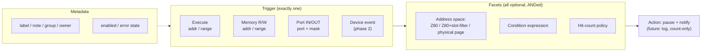
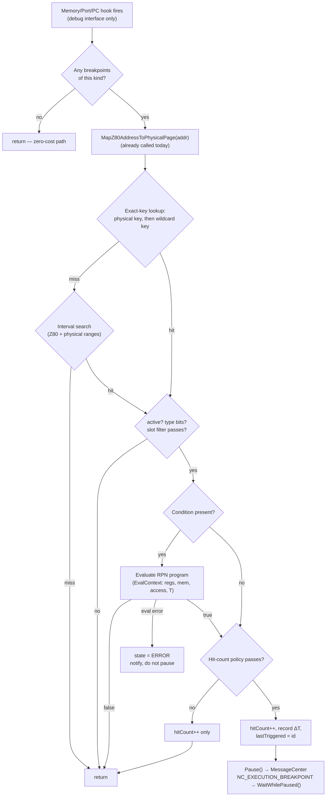
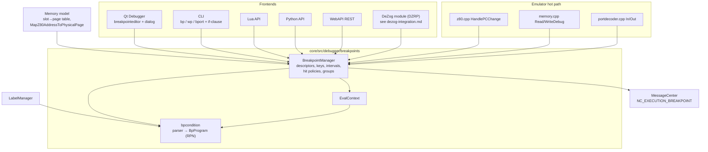
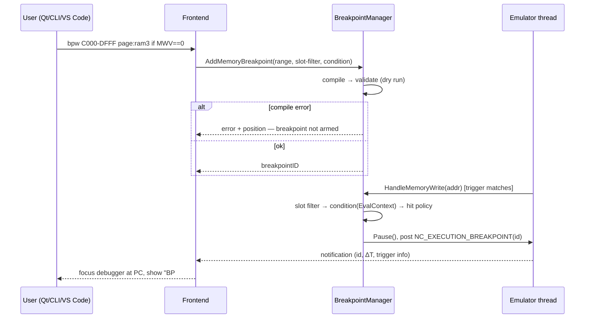

# Conditional Breakpoints — Design

Date: 2026-08-17
Status: draft for review
Inputs: [`research.md`](research.md) (comparative research: Unreal Speccy, SpecEmu, Spectaculator, ZX-M8XXX, DeZog), [`codebase-survey.md`](codebase-survey.md) (existing infrastructure), [`dezog-integration.md`](dezog-integration.md) (DZRP module proposal), [`performance.md`](performance.md) (hot-path strategy — authoritative for §5.2 matching/evaluation details).

---

## 1. Current state of the breakpoint subsystem

`BreakpointManager` (`core/src/debugger/breakpoints/breakpointmanager.h/.cpp`) is the single source of truth; all five frontends (Qt UI, CLI, Lua, Python, WebAPI) and the hot-path hooks go through it.

### What works today

| Capability | Status | Mechanism |
|---|---|---|
| Execute breakpoints | ✅ | `HandlePCChange()` hook in `z80.cpp:200` |
| Memory read/write breakpoints | ✅ | `HandleMemoryRead/Write()` in `MemoryReadDebug/WriteDebug` |
| Port IN/OUT breakpoints | ✅ | `HandlePortIn/Out()` in `portdecoder.cpp` |
| Page-bound breakpoints (single Z80 addr + specific page) | ✅ | `BRK_MATCH_BANK_ADDR`, key = `(pageType<<24)\|(page<<16)\|z80addr` |
| Combined access types (R+W+X on one bp) | ✅ | `memoryType` bit mask |
| Groups, owners, notes, activate/deactivate | ✅ | descriptor fields + group APIs |
| Zero-cost when no breakpoints | ✅ | empty-map early return; fast/debug memory interface swap |
| Last-triggered info for automation | ✅ | `GetLastTriggeredBreakpointInfo()` |

### What is missing

| Gap | Detail |
|---|---|
| **Conditions** | No expression parser/evaluator anywhere in the codebase. No `condition` field in `BreakpointDescriptor`. |
| **Address ranges** | `BreakpointRangeDescription` is declared (`breakpointmanager.h:82-103`) but wired to nothing. |
| **Physical (any-slot) breakpoints** | Page-bound key stores the *full Z80 address*, not offset-in-page — a page-bound bp only matches through the slot it was defined at. "Break on access to RAM page 7 wherever it is mapped" is inexpressible. |
| **Hit counts** | No counters, no skip/ignore policies. |
| **Port masks** | Port breakpoints match exact 16-bit port only — useless for partially-decoded Spectrum I/O. |
| **Persistence** | Breakpoints are not saved/restored across sessions. |
| **Error state** | No per-breakpoint error status (needed once conditions can fail to evaluate). |
| Known bug | `Memory::MapZ80AddressToPhysicalPage()` leaves `page` **uninitialized** for `BANK_CACHE`/`BANK_INVALID` (`memory.cpp:1109-1120`). Must be fixed before physical keys are built on it. |

## 2. Full comparison matrix

Unreal-ng "now" vs. the four researched references vs. this design ("target"). Details per emulator in `research/`.

| Capability | Unreal 0.38 | SpecEmu 3.4 | Spectaculator 9.1 | ZX-M8XXX | **unreal-ng now** | **unreal-ng target** |
|---|---|---|---|---|---|---|
| Exec / mem R/W / port BPs | ✅/✅/via cbp | ✅/✅/✅ | ✅/✅/✅ | ✅/✅/✅ | ✅/✅/✅ | ✅/✅/✅ |
| Address ranges | ✅ | via bus vars | ❌ | mem-view ranges | ❌ (dead type) | ✅ first-class |
| Conditions: full boolean expressions | ✅ C-like | ❌ AND-only comparisons | ✅ C-like | ❌ single comparison | ❌ | ✅ C-like, compiled |
| Conditions compose with access BPs | ❌ (separate systems) | via bus vars only | ✅ | ✅ | ❌ | ✅ one entity |
| Memory deref in conditions | `M(x)`, `x->y` | `(a)`, `(a.w)` | `rb() rw() rwb()` | `(HL)`, `(nnnn)`, `(IX+n)` | ❌ | ✅ `(a)`, `(a).w` |
| Flag mnemonics in conditions | ❌ (mask F) | ❌ (mask F) | mask constants | ✅ `Z NZ C NC…` | ❌ | ✅ mnemonics + `F` masks |
| Access addr/value in conditions | fork: `RD/WR/MDT` | ✅ `MRA/MWA/MRV/MWV` | ❌ | `VAL`/`PORT` | ❌ | ✅ full set |
| Paging state in conditions | `DOS`, `FD` | ✅ `P0-P3`, `PAGING` | ❌ | ❌ | ❌ | ✅ `PG0-3`, `DOS`, … |
| Bank-bound breakpoints | ❌ | ❌ | ✅ checkbox (one bank) | screen page dropdown | ✅ single addr | ✅ incl. ranges |
| Physical (any-slot) breakpoints | ❌ | ❌ | ❌ | ❌ | ❌ | ✅ **unique** |
| Beyond-7FFD paging (ATM/Evo, 256 pages) | ❌ | ❌ | ❌ | ❌ | model ready | ✅ **unique** |
| Hit counts / skip | ❌ | ❌ | ✅ 4 policies + live counter | skip counts on triggers | ❌ | ✅ Spectaculator model |
| Port masks | via `out&mask` | via `out&mask` | ✅ field | ❌ | ❌ | ✅ field + cond fallback |
| T-states in conditions | ❌ | `TS` (16-bit!) | ❌ | `T/TSTATES` | ❌ | ✅ 32-bit frame T + ΔT |
| Compiled (not re-parsed) conditions | ✅ RPN | ? | ✅ | ❌ regex per hit | — | ✅ RPN/bytecode |
| Error state on bad condition | msgbox at entry | silent | ✅ 3rd icon state | try/catch false | — | ✅ validate + error state |
| Screen region breakpoints | ❌ | byte-level only | pixel/attr byte | ✅ rects + page select | ❌ | phase 2 |
| Tape/disk event triggers | ❌ | run-until menu | ❌ | ✅ + skip counts | ❌ | phase 2 |
| Persistence | bpx.ini (not cbp) | ❌ | ✅ .dzx projects | localStorage | ❌ | ✅ per-project file |
| Scripting/API surface | ❌ | `stop`, `/bpc` | ❌ | JS API | CLI/Lua/Py/Web | ✅ all + DeZog |
| Labels/symbols in conditions | ❌ | ❌ | ❌ | ❌ | LabelManager exists | ✅ via LabelManager |

## 3. What we are adding

| # | Feature | Summary | Phase |
|---|---|---|---|
| F1 | **Condition expressions** | C-like boolean expression per breakpoint, compiled once to RPN bytecode, evaluated only after the address/port trigger matches. Registers, flags (mnemonics + masks), memory deref, access address/value, port/value, T-states, paging state, labels. | 1 |
| F2 | **Address ranges** | `bpw C000-DFFF` as a first-class trigger; interval list checked alongside the exact-match hash. | 1 |
| F3 | **Slot-filtered breakpoints** | Range/address + "only when page X is mounted in the accessed slot". Bound to the Memory slot→page table, therefore works identically for 7FFD, 1FFD, ATM 2+, ZX Evolution — any paging mechanism. | 1 |
| F4 | **Physical-page breakpoints** | Trigger addressed as `ram7:0000-1FFF` / `rom1:xxxx` — fires through *whatever* slot the page is currently mapped in. Checked after `MapZ80AddressToPhysicalPage`, which the hot path already calls. | 1 |
| F5 | **Hit counts** | Per-breakpoint counter + policy: always / ==N / multiple-of-N / >=N, live counter, reset. Also serves as skip-count for phase-2 triggers. | 1 |
| F6 | **Error state** | Conditions are validated at entry (compile + dry-run); runtime evaluation failure flips the breakpoint into `BRK_STATE_ERROR`, surfaced in UI/CLI — never a silent pass or a crash. | 1 |
| F7 | **Port masks** | `bport FE mask:FF` style match field on IO breakpoints (Spectaculator model), replacing exact-only matching. | 1 |
| F8 | **ΔT counter** | T-states accumulated since the last breakpoint fired (any type); exposed as `DT` condition variable and in break reports. | 1 |
| F9 | **Persistence** | Breakpoints (including conditions) saved per emulated-program context, auto-restored — Spectaculator `.dzx` idea, JSON file next to snapshot / in project dir. | 1.5 |
| F10 | **Canned helpers** | Named presets encoding platform knowledge: keyboard half-rows with correct masks, `7FFD`/`1FFD`/`EFF7`/ATM ports, TR-DOS entry. Presented in UI dropdown and as CLI shortcuts. | 1.5 |
| F11 | **Screen region breakpoints** | Rect `C,R,W,H` (cells) or px; bitmap/attr; target Normal/Shadow/Both — implemented as physical-page breakpoints over precomputed address sets (ZX-M8XXX model). | 2 |
| F12 | **Device triggers** | Tape block loaded, disk sector read (`TT:SS`), FDC command, frame/interrupt events — with skip counts (F5). Live in tape/Beta-disk/FDC code, funnel into the same descriptor + condition machinery. | 2 |
| F13 | **DeZog fast conditions** | Remote-side condition evaluation for the DZRP module reusing F1's engine (see `dezog-integration.md` §5). | 3 |

## 4. Unified breakpoint model

One breakpoint = **trigger** (what event arms it) + optional **facets** (filters that must all pass). GUI dialogs, CLI syntax, and scripting APIs are thin frontends over this one entity.



### 4.1 Addressing modes

```
bp C000                      ; Z80 address, any page (wildcard)         — exists today
bp C000 page:ram3            ; Z80 address, only when ram3 is in slot 3 — exists (key fix needed)
bpw C000-DFFF page:ram3      ; range + slot filter                     — F2+F3
bpw ram7:0000-1FFF           ; physical: page 7, any slot, any mapping — F4
bp rom1:0000                 ; physical ROM page (e.g. TR-DOS entry)   — F4
```

The slot filter compares against the **Memory model's live slot→page table** (`GetRAMPageForBank`/`GetROMPageForBank`/`GetMemoryBankMode`), never against port latches — so ATM 2+/ZX Evolution paging (up to 256 RAM pages, any window remappable including `0000-3FFF`) is covered by construction. Page identifiers form one namespace: `ram0..ram255`, `rom0..rom63`, `cache0..cache1`.

### 4.2 Condition expression language

Design goals: readable by anyone (SpecEmu/ZX-M8XXX friendliness), full C-like composition (Spectaculator/Unreal power), compiled once (Unreal architecture), no known footguns from the research.

**Operands**

| Class | Tokens |
|---|---|
| Registers | `A F B C D E H L AF BC DE HL IX IY IXH IXL IYH IYL SP PC I R IM` + primed `A' F' … HL'` |
| Flags | Standalone mnemonics `Z NZ CY NC PE PO FP FM FS FN FH` (booleans) — plus `F & $40` style masks for power users. `CY` is carry (bare `C` stays the register; the #1 ambiguity of all reference grammars, resolved in favor of the register) |
| Memory | `(expr)` byte, `(expr).w` little-endian word — address is any sub-expression: `(HL)`, `($5C78)`, `(IX+5)`, `(HL+DE)` |
| Access bus | `MRA MWA MRV MWV` (memory read/write address & value of the triggering access), aliases `ADDR`/`VAL` inside memory-trigger conditions |
| Port bus | `PRA PWA PRV PWV`, aliases `PORT`/`VAL` inside port-trigger conditions |
| Paging | `PG0 PG1 PG2 PG3` (RAM page in slot, `$FF` if ROM/cache), `ROMPG` (ROM page in slot 0 or `$FF`), `DOS` (TR-DOS active), `SHADOW` (shadow screen selected) |
| Timing | `T` (T-states within frame, 32-bit), `FRAME` (frame counter), `DT` (T-states since last break, F8) |
| CPU state | `IFF1 IFF2 HALTED` |
| Labels | Any identifier resolved through `LabelManager` at compile time; recompiled when labels change |

**Literals**: pure digits → decimal (`255`); `$FF`, `#FF`, `0xFF`, `FFh` → hex; a bare token that contains `A-F` and parses as hex → hex (`FF`, `4000h` — matches ZX-M8XXX/user expectation). The one ambiguity (`4000` = decimal) is resolved to decimal and documented.

**Operators** (C precedence, with the Unreal footgun fixed): `! ~` unary → `* / %` → `+ -` → `<< >>` → `& ^ |` → comparisons `== != <> < > <= >=` → `&& ||`. Note **bitwise ops bind tighter than comparisons** (unlike C), so `OUT & $FF == $FE` means `(OUT & $FF) == $FE` — the intuitive reading that Unreal's docs had to warn about. `=` accepted as alias of `==`.

**Examples**

```
A==0 && (HL) != $FF
bpw 5C78 if MWV==0                      ; who zeroes this system variable?
bpw C000-FFFF if PG3==7 && MWV>=$80     ; writes of high bytes into page 7 via slot 3
bp rom1:1234 if BC!=DE
bport FE mask:FF out if VAL & $10       ; speaker bit set
bp $8000 if Z && DT > 20000
bp main_loop if (score).w >= 1000       ; label + word deref
```

**Compilation**: tokenize → shunting-yard → RPN bytecode (`std::vector<BpOp>`, fixed opcode set), validated by a dry run against a null context at entry. Evaluation is a ~30-line stack machine, no allocation, no recursion. Memory dereference uses `Memory::DirectReadFromZ80Memory` (side-effect-free, no recursive breakpoint hits).

## 5. Implementation

### 5.1 Data model changes (`breakpointmanager.h`)

```cpp
enum BreakpointAddressMatchEnum : uint8_t {
    BRK_MATCH_ADDR,        // Z80 address, any page (existing)
    BRK_MATCH_BANK_ADDR,   // Z80 address + slot filter (existing; key fixed, see 5.2)
    BRK_MATCH_PHYS,        // NEW: physical page:offset, any slot
};

struct BreakpointHitPolicy {           // F5
    enum Mode : uint8_t { Always, Equal, MultipleOf, AtLeast } mode = Always;
    uint32_t n = 0;
    uint32_t hitCount = 0;             // live counter, resettable
};

struct BreakpointDescriptor {
    // ... existing fields unchanged ...
    uint16_t z80addressEnd = 0xFFFF;   // F2: == z80address for single-address
    uint16_t portMask = 0xFFFF;        // F7: match if (port & portMask) == (z80address & portMask)
    std::string conditionSource;       // F1: original text ("" = unconditional)
    std::shared_ptr<const BpProgram> condition;  // F1: compiled RPN; shared_ptr for lock-free swap
    BreakpointHitPolicy hits;          // F5
    BreakpointState state = BRK_STATE_OK;  // F6: OK | DISABLED | ERROR(+message)
};
```

New evaluator component (same directory):

```
core/src/debugger/breakpoints/
├── breakpointmanager.{h,cpp}     # extended as above
├── bpcondition.{h,cpp}           # tokenizer, parser (shunting-yard), BpProgram, validator
└── bpcontext.h                   # EvalContext: Z80State*, Memory*, trigger kind,
                                  # access addr/value, port/value, ΔT baseline
```

### 5.2 Matching & the hot path

> Performance-critical details of this section are specified in [`performance.md`](performance.md) (tiered funnel: per-kind flags → O(1) two-load prefilter → descriptor resolve → fast-predicate/RPN condition → hit policy). Summary below; `performance.md` is authoritative where they differ.

Storage gains three structures next to the existing hash maps:

- **Prefilter (new)** — `z80Flags[0x10000]` (exec/read/write bits, ranges painted at set-time) plus per-physical-page 16 K slices with 4 `slotSlice[bank]` pointers reassigned in `UpdateZ80Banks()` on every remap. Hot-path miss = two L1 loads + branch (~2–4 ns) — cheaper than today's armed path by an order of magnitude; physical breakpoints cost O(1) per remap.
- **Exact map (existing)** — keys fixed: `BRK_MATCH_BANK_ADDR` re-keyed to `(pageType<<24)|(page<<16)|addressInPage` and `BRK_MATCH_PHYS` uses the same physical key — so a page-bound breakpoint now matches through **any** slot (this alone upgrades today's page breakpoints from "slot-bound" to "physical"); a separate slot-filter facet restores the "only via this slot" semantics when asked for.
- **Interval vector (new, F2)** — per access type (X/R/W), sorted `{start,end,descriptor*}` in both Z80 and physical spaces; consulted only after a prefilter hit misses the exact map. Expected entries: tens, not thousands.

Conditions are compiled once at set-time (off the emulation thread): tokenize → shunting-yard → RPN over `int64_t` with all symbols resolved to direct-accessor opcodes; expressions matching dominant shapes (`reg==const`, masked compares, `MWV==k`, …) are stored as tagged **fast predicates** evaluated by a single switch+compare (~2–5 ns), with the RPN VM (~5–30 ns, fixed stack, no allocation, no exceptions) as the general fallback and reference implementation. A false condition returns to the emulation loop with **zero** side effects (no allocation, no notification, no counter increment); evaluation errors flip the breakpoint into ERROR state and clear its filter bits so a broken condition cannot tax the loop.

Prerequisite fix: initialize `MemoryPageDescriptor.page` for `BANK_CACHE` (and assert on `BANK_INVALID`) in `MapZ80AddressToPhysicalPage`.



Ordering rationale: the condition is evaluated **only after** an address/port trigger matched — unlike Unreal's "all cbp before every instruction". Cost for unrelated code paths stays where it is today (one page-map call + hash lookups). The fast (non-debug) memory interface remains untouched; `features.ini [breakpoints]` gating unchanged.

**Threading**: descriptors are mutated from UI/automation threads while the emulator thread reads them. Compiled programs are immutable (`shared_ptr<const BpProgram>` swapped atomically); descriptor field edits keep the existing manager locking discipline. Label changes trigger recompilation of label-referencing conditions via `NC_BREAKPOINT_CHANGED`-style notification.

### 5.3 Component overview



### 5.4 Frontend wiring

**CLI** (`core/automation/cli/`). Extend existing commands with an `if` clause and new address forms — `if` delimits the condition, fixing the "trailing args become note" collision (note moves behind `--note` or quotes):

```
bp <addr|range|page:addr> [if <expr>] [--group g] [--note "..."]
wp <addr|range|page:range> r|w|rw [if <expr>]
bport <port> [mask:<m>] i|o|io [if <expr>]
bphits <id> [reset | ==N | %N | >=N]        ; hit-count policy (F5)
stop <expr>                                  ; one-shot conditional (SpecEmu homage)
```

Parser lives in one place (`bpcondition` + a small spec-string parser for `ram7:0000-1FFF` forms) and is shared by CLI, WebAPI, and Qt — no per-frontend grammar drift.

**Qt UI** (`unreal-qt/src/debugger/`). `breakpointeditor` gains: address/range field accepting all spec forms, page/slot selector fed by the live Memory model (machine-aware: 8 pages on 128K, 256 on Evo), condition line edit with compile-on-edit validation (red border + message via `validateInput()`), hit-count group (policy combo + N + live counter + Reset), helper dropdown (F10). `breakpointdialog` list adds Condition, Hits, and State columns; gutter/list get the third **error** icon state. `disassemblerwidget` context menu: "Edit condition…" on an existing breakpoint.

**Lua / Python / WebAPI**. Additive API surface, same names in all three: `add_breakpoint{addr=|range=|page=, kind=, condition=, mask=, hits=}` returning id; `set_condition(id, expr)`; `set_hit_policy(id, mode, n)`; `reset_hits(id)`. WebAPI POST body gains the same optional fields; OpenAPI spec updated. Existing thin calls stay untouched for compatibility.

**DeZog** (phase 3). The DZRP module (separate doc) initially ignores condition strings — DeZog evaluates client-side. Once F1 lands, `CMD_ADD_BREAKPOINT`'s condition string is compiled with `bpcondition` (DeZog's syntax is register/mem comparisons — a dialect flag on the parser) and evaluated remote-side ("fast" mode).

### 5.5 Hit sequence (frontend perspective)



### 5.6 Testing

- `core/tests/debugger/bpcondition_test.cpp` — grammar unit tests: literals (incl. the decimal/hex ambiguity table), precedence (esp. `&` vs `==`), flag mnemonics vs `C` register, deref, error cases; golden RPN dumps.
- `breakpoints_test.cpp` extensions — range matching, physical vs slot-filtered semantics across remaps (test on Pentagon *and* an ATM/Evo config with pages > 7), hit policies, port masks, error-state transitions.
- Perf smoke: measure debug-loop throughput with 0 / 10 unconditional / 10 conditional breakpoints armed; budget documented against `docs/inprogress/2026-01-10-performance-optimizations/discovery.md` baselines.

## 6. Phasing

| Phase | Contents |
|---|---|
| **1** | Bug fix (CACHE page init) → key re-encoding (`addressInPage`, `BRK_MATCH_PHYS`) → intervals (F2) → `bpcondition` engine (F1) → slot filter (F3) / physical (F4) → hit counts (F5), error state (F6), port masks (F7), ΔT (F8). CLI + Qt wiring; Lua/Py/Web additive APIs. |
| **1.5** | Persistence (F9), canned helpers (F10), label integration polish. |
| **2** | Screen region breakpoints (F11), device triggers with skip counts (F12) — reusing descriptors, conditions, hit policies. |
| **3** | DeZog fast conditions (F13); condition dialect flag; possible `RunUntilCondition` unification (today's `std::function` predicate can be replaced by a compiled expression, giving CLI/UI "run until <expr>" for free). |

## 7. Design decisions & rejected alternatives

- **Conditions evaluated at the trigger, not per-instruction** (rejected: Unreal's global cbp scan) — keeps cost proportional to actual matches.
- **One entity with facets, not parallel breakpoint kinds** (rejected: Spectaculator/SpecEmu split dialogs; Unreal's non-composable cbp vs bpx) — composition was the most-requested missing feature in the Unreal community research.
- **Slot/page semantics from the Memory model, not port state** (rejected: `FD`-style latch variables as the primary mechanism; they remain available as condition operands) — required for ATM/Evo correctness.
- **Bitwise binds tighter than comparisons** (deviation from C, matching user intuition) — the single most-documented footgun across references; expressions are always re-printable from the compiled form fully parenthesized, so there is no ambiguity for the reader.
- **Interval vector, not a 64K bit array** (rejected: Unreal's `membits`) — membits can't carry per-range descriptors, conditions, or physical/bank dimensions; our counts are small.
- **`CY` for carry flag, `C` stays a register** — every reference either forbids flag mnemonics (SpecEmu, Spectaculator) or lives with the ambiguity (ZX-M8XXX); we make it explicit.
