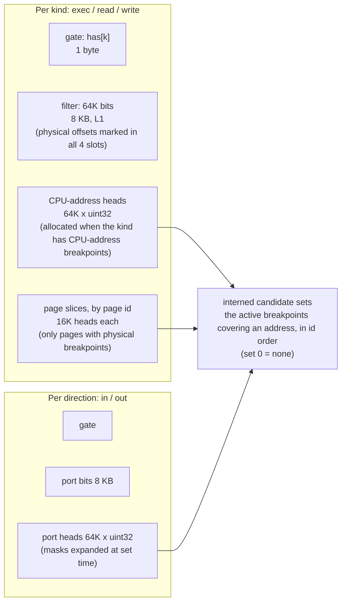
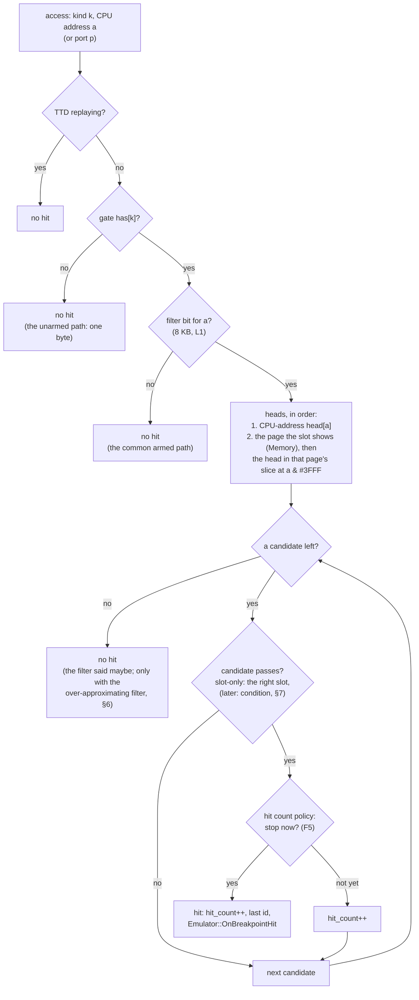
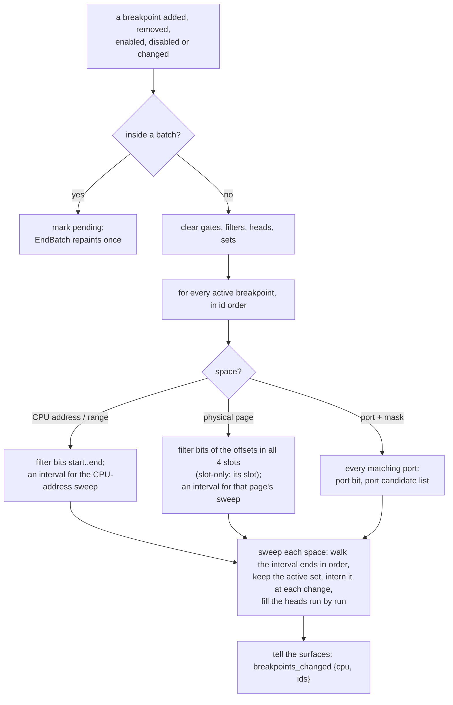

# Breakpoint matching on the hot path

- **Date:** 2026-10-03
- **Status:** implemented (2026-10-04, branch `bp-matching`): ranges, physical and slot-only page
  breakpoints, masked ports, hit counts, on every automation surface and in the unreal-qt editor; filter
  `globalbits` (§6). Measured in [PoC 022](../../../tools/poc/022-breakpoint-matching/README.md) and by
  the A/B of §8.
- **Part of:** the conditional-breakpoints track. It makes [design.md](design.md) §5.2 concrete for the
  address part of a breakpoint (exact addresses, ranges, physical pages, slot filters, port masks, hit
  counts). Conditions (F1) plug into the hit path later (§7).

## 1. The question this answers

Every memory access and every port access of the emulated CPU asks the debugger one question while debug
mode is on: **does this access hit a breakpoint?** That is several million questions per emulated second
(3.5-4 accesses per instruction, see the [PoC traces](../../../tools/poc/022-breakpoint-matching/recorder/README.md)),
and almost all of them answer "no". So the "no" has to be as cheap as possible, the "yes" can cost a little
more, and neither may grow with the number of breakpoints.

Today (master 7eca03436) the check is a per-address byte filter and two hash lookups. It knows single
addresses and slot-bound pages only. Ranges, breakpoints on a physical page wherever it is mapped, port
masks and hit counts are missing ([design.md](design.md) §1).

## 2. Words used here

| Word | Meaning |
|:--|:--|
| CPU address | The 16-bit address the Z80 puts on the bus (`#C000`). |
| Slot | One of the four 16K windows of the CPU address space (`#0000`, `#4000`, `#8000`, `#C000`). |
| Page | A 16K block of ROM, RAM or cache (fast RAM) memory. Paging decides which page each slot shows. |
| Remap | A slot starts showing another page (an `OUT` to #7FFD, an ATM or TS-Conf page register, ...). |
| Physical breakpoint | Page + offset, for example `ram7:1234`: fires through whatever slot shows RAM page 7. |
| Slot-bound breakpoint | CPU address + page: fires at `#C000` only while RAM page 3 is in that slot (today's page breakpoints). |
| Kind | What an access is: exec (instruction start), read (data read, opcode and operand fetch), write, port in, port out. |
| Gate | One flag per kind: "is there any breakpoint of this kind at all?". |
| Filter | A bit per address: "there may be a breakpoint here". 64K addresses = 8 KB, small enough for the fastest CPU cache (L1). |
| Painting | Writing a range into a table at set time, address by address, so the hot path needs no search. |
| Candidate | A breakpoint the tables point at for an address; the hit path checks it fully. |

## 3. Data

All structures belong to `BreakpointManager`, per kind (exec, read, write; in, out for ports). They are
rebuilt when the breakpoint set changes, never on the hot path.

- A **head** is the number of a candidate set: the active breakpoints that cover that address, in id order
  (0 = none). Several breakpoints can cover one address (a code point inside a watched range, two ranges
  overlapping), so a set can hold several.
- **Sets are interned.** The covering set changes only at a range boundary, so N ranges make at most 2N + 1
  distinct sets. The same set is shared between kinds and pages. (A first version extended sets breakpoint
  by breakpoint and made 758 000 sets for 10 000 overlapping ranges; the sweep of §5.1 makes at most 20 001.)
- **Physical breakpoints** (`BRK_MATCH_BANK_ADDR`: page + offsets) live in their page's slice. The resolve
  asks `Memory::MapZ80AddressToPhysicalPage` which page the slot shows, so paging needs no tracking (§5.2).
  A slot-only breakpoint sits in the same slice and is skipped when the access comes through another slot.
- Only **active** breakpoints are painted. Disabling one repaints, so the hot path never meets a disabled
  one.
- **Hidden** breakpoints (step-over, step-out, traps) are painted like the others: they must stop the run.
  They are only left out of what the surfaces are told ([protocol](../2026-09-28-debugger-model/protocol.md) §5).
- Footprint when armed: 8 KB filter plus a 256 KB head table per memory kind with CPU-address breakpoints,
  64 KB per page with physical breakpoints, the same per port direction. A kind with no breakpoints costs its
  gate byte.

## 4. One access (the hot path)

The call sites stay where they are (`Z80` instruction start, `Memory::MemoryReadDebug` /
`MemoryWriteDebug`, the port decoder's debug in / out). The kind is known at each call site, so there is no
dispatch on it.

**The gate and the filter bit are inline at the call site** (a header-inline check); only a set bit calls
`BreakpointManager` out of line. Today every access calls `HandleMemoryRead` / `HandleMemoryWrite` / ...
out of line, and that call alone is most of today's cost: 1.5-1.7 ns per access with one breakpoint armed,
against 0.42-0.54 ns for the inline bit test (PoC 022, experiments 01 and 02).

Ports take the same shape with their own gate, an 8 KB port filter and the port heads. A masked port
breakpoint (`#FE` with mask `#00FF`) is painted into every port it matches when it is set, so the hot path
never applies a mask.

What each path costs (PoC 022: ns per access above the unarmed path, minimum of three interleaved
repetitions on the loaded dev machine, four real programs):

| Path | When | Work | Measured |
|:--|:--|:--|:--|
| unarmed | debug mode on, no breakpoint of this kind | the gate byte | 0 (the reference, 0.49-0.51 ns with the replay loop) |
| armed miss / hit, CPU addresses and ranges | the overwhelming case | gate + one L1 bit test (+ one load on a hit) | 0.42-0.54, flat from 1 to 10 000 breakpoints (02, 03) |
| physical / slot-only | page breakpoints armed | the same bit test; on a set bit the page from Memory and the page slice | 0.93-1.21; 1.2-1.4 paging every 64 accesses (04) |
| ports | port breakpoints armed | gate + port bit (+ one load) | 0.33, flat (05) |
| whole matcher, mixed set | everything armed at once, one dispatching function | as above | 1.2-1.5 up to 1 000; 1.6-2.0 at 10 000 (06; includes a dispatch the inline call sites do not have) |
| today, for comparison | one breakpoint of the kind armed | an out-of-line call, filter, up to two hash lookups | 1.6-1.7 empty, 2.6-3.7 with 10 000 hitting (01) |

## 5. Changing the set, and paging

### 5.1 Set changes (add, remove, enable, disable, change)

The rebuild is O(64K + N log N) per kind. Ten thousand overlapping 256-byte ranges build in about 40 ms in one
batch. `BreakpointManager::Batch` (or `BeginBatch` / `EndBatch`) is for an import or a script that sets many
breakpoints: one repaint and one `breakpoints_changed` at the end, instead of one per breakpoint (which would
make N additions cost N rebuilds).

### 5.2 Remap: nothing to do

The filter does not depend on what a slot shows (§6: a physical offset is marked in all four slots), and the
resolve asks the memory model for the page of the access only after a filter hit. So paging does no work for
the debugger at all, and there is no notification that could be forgotten on some paging path.

The PoC rejected the alternatives that do work on a remap. Rebuilding per-slot id tables costs 21-335 ns per
access on a trace that switches pages every 64 accesses (experiment 04, `merged`). An exact per-slot filter
recombined on each remap costs up to 1.9 ns more there (experiment 06, `slotbits`).

### 5.3 Stepping on from a stop

A run stopped at an execution breakpoint executes that instruction when it goes on. The emulator arms a pass
for that address (`ArmExecPass`, from `DirectStepScope`); the check skips it once, without a hit and without
counting it. A hit-count policy therefore sees each arrival once. The emulator's own run needs no pass: its
breakpoint parks on the hit and continues the same instruction on resume.

## 6. The one open choice: which filter

Three filters were measured on whole mixed sets (experiment 06). All three keep §3's tables; they differ
only in the bit the armed miss tests and in what a remap does:

| Variant | The bit tested | Exact? | Remap work |
|:--|:--|:--|:--|
| `globalbits` | one 8 KB filter over CPU addresses; a physical breakpoint marks its offsets in all four slots | over-approximates for physical and slot-bound breakpoints (a "maybe" that the heads then answer "no") | pointers only |
| `slotbits` | a per-slot filter = CPU-address bits OR the shown page's bits OR the slot-bound bits | exact | recombine 2 KB per armed kind (a copy when the page has no slices) |
| `threebits` | the three bits read and ORed before one branch | exact | pointers only |

Measured (PoC 022 experiment 06, ns per access above unarmed, mixed sets):

| | recorded traces, N up to 1 000 | N = 10 000, cold | paging every 64 accesses |
|:--|:--|:--|:--|
| `globalbits` | 1.2-1.5 | 1.6-2.0 | 1.25-1.9 |
| `slotbits` | 1.2-1.5 | 1.4-1.6 | 1.8-3.6 |
| `threebits` | 2.0-2.6 | 2.4-2.5 | 2.0-2.3 |

**Decision rule:** take `slotbits` if its remap-heavy cost stays within 0.5 ns of `globalbits` while it wins
on every recorded trace; otherwise take `globalbits`, whose cost does not depend on how often a program
pages (ATM / TS-Conf / Sprinter software pages far more than a 128K game).

**Decision: `globalbits`.** `slotbits` only ties on the recorded traces and costs up to 1.9 ns more when code
pages often. The price of `globalbits` shows only at about 700 physical ranges in one set (the 10 000 mixed
set), where its shared filter says "maybe" more often. If such sessions matter, resolve a "maybe" through the
page's 2 KB bit slice before the id slices.

## 7. What plugs in later

- **Conditions (F1):** a third check in the candidate loop of §4, after the slot filter. It runs only on a
  candidate, never on a miss, so the miss path above stays as it is. The fast predicates of
  [performance.md](performance.md) §3 go there.
- **Hit counts (F5):** the counter and policy sit on the descriptor. The loop counts and continues until
  the policy says stop.
- **Screen-region and device breakpoints (F11, F12):** a screen region is painted as physical breakpoints
  over the precomputed addresses. Device events do not use this path.
- **More CPUs** (the debugger model's `cpu` field): one manager and one set of tables per CPU. The GS / NeoGS
  card CPU gets its own, filled the same way.

## 8. How it is checked

- **PoC 022** decides the structures: real-program traces, every candidate verified against a brute-force
  reference on every access before it is timed. See the
  [final report](../../../tools/poc/022-breakpoint-matching/README.md).
- **Unit tests** of the manager, one per rule:
  - a range hits at its ends and misses one byte outside;
  - a physical breakpoint fires through every slot that shows its page, and stops firing after a remap away;
  - a slot-bound one fires only in its slot;
  - a masked port fires on every matching port;
  - two breakpoints on one address are both seen;
  - a disabled one never fires;
  - the hit-count policies;
  - the TTD-replay suppression.
- **A/B on the emulator**, each against master, with interleaved runs on a quiet machine
  ([performance guidelines](../../guidelines/performance-guidelines.md)):
  - `core-benchmarks` for debug mode off (must be unchanged);
  - debug mode on with no breakpoints (the unarmed path, must not be slower);
  - debug mode on with 10, 1 000 and 10 000 mixed breakpoints (frames per second against today's
    single-address equivalent).

### 8.1 Measured on the emulator (2026-10-04)

`BM_BreakpointFrame_*` (`core/benchmarks/debugger/breakpoint_frame_benchmark.cpp`): one 48K frame idling in
BASIC per iteration. The same file was built against master `c0cf88cab` and against the branch (it uses only
the single-address API both have), and the two ran interleaved, 4 rounds x 3 repetitions, on the shared
machine at load 45-63. Median of 12 runs, µs per frame:

| State | master | branch | change | above "debug off": master -> branch |
|:--|--:|--:|--:|:--|
| debug mode off | 1674 | 1673 | -0.1% | - |
| debug mode on, no breakpoint | 1767 | 1735 | -1.8% | +5.5% -> +3.7% |
| 10 breakpoints (never hit) | 1786 | 1738 | -2.7% | +6.7% -> +3.9% |
| 1 000 | 1774 | 1743 | -1.8% | +6.0% -> +4.2% |
| 10 000 | 1831 | 1800 | -1.7% | +9.4% -> +7.6% |

- With debug mode off nothing changes: the fast memory interface never reaches the check.
- Every debug state got faster, while ranges, physical pages, masks and hit counts were added. The inline
  gate saves the call that today's code makes on every access.
- What remains above "debug off" (about 3.7%) is the debug memory interface itself (access tracking, TTD
  probes), not the breakpoint check.

