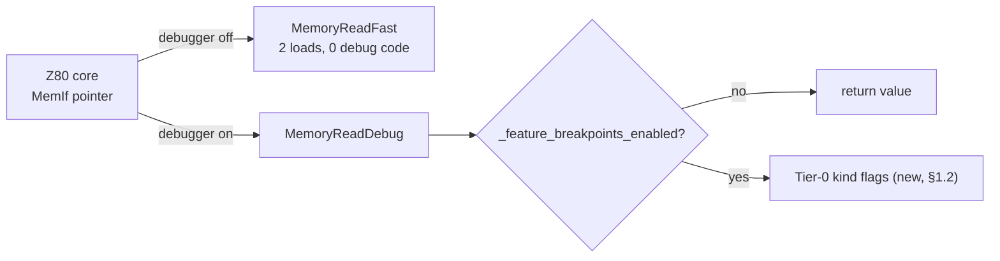
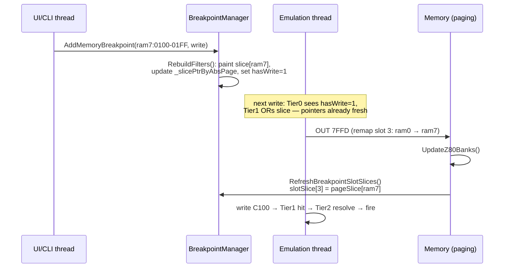
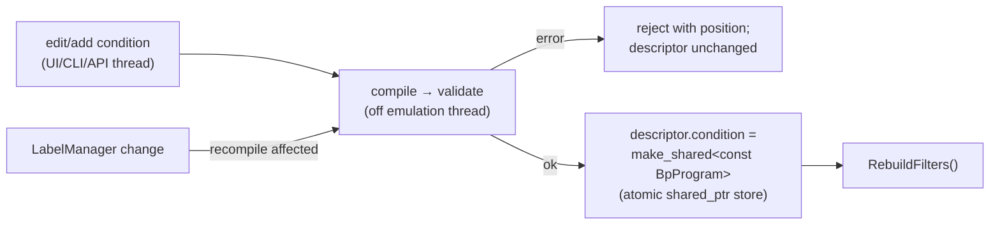
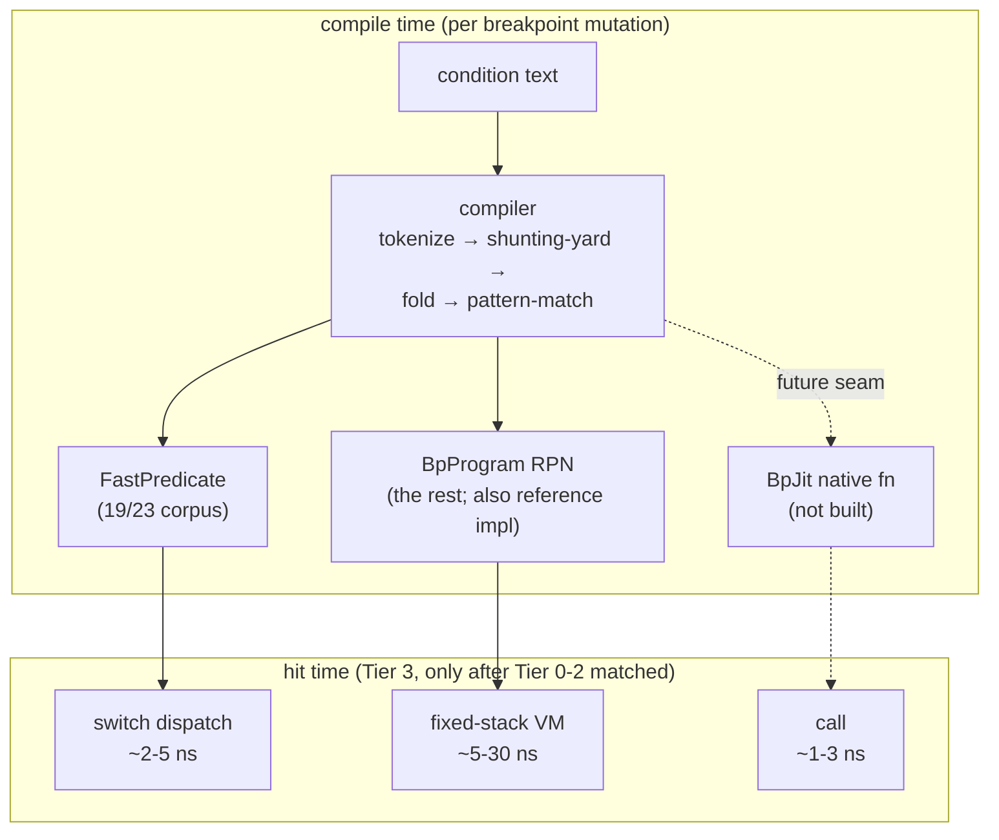

# Hot-Path Implementation Spec: The Five-Point Recipe in Detail

Date: 2026-08-17
Status: implementation-level spec; companion to [`performance.md`](performance.md) (strategy & budgets) and [`design.md`](design.md) (feature model).
Scope: exactly how each item of the convergent recipe is implemented in unreal-ng for maximum efficiency, with data layouts, reference code, and diagrams. File/line references are to the current tree.

The five items, ordered by leverage:

1. [Zero-cost idle path](#1-zero-cost-idle-path)
2. [O(1) address prefilter](#2-o1-address-prefilter)
3. [Compile-once flat RPN](#3-compile-once-flat-rpn)
4. [Fast predicates](#4-fast-predicates-bypassing-the-vm)
5. [No native JIT — and the seam for it](#5-no-native-jit--and-the-seam-that-permits-it-later)

---

## 1. Zero-cost idle path

**Goal: when no breakpoint of a given kind exists, the emulation loop must not execute a single instruction related to breakpoints — no string, no map, no virtual call, ideally not even a branch.**

### 1.1 What we already have (keep)

Two gating layers exist today and stay untouched:

- **Interface swap** (`Memory::GetFastMemoryInterface()` / `GetDebugMemoryInterface()`, `memory.h:218-221`; swapped by `Emulator::DebugOn/DebugOff`, `emulator.cpp:2114-2129`): with the debugger off, the Z80 core calls `MemoryReadFast/WriteFast`, which contain zero debug code. This is the bsnes-plus "two builds" idea done right — at runtime, per interface pointer, without shipping two binaries.
- **Feature flag** (`_feature_breakpoints_enabled`, cached from `features.ini`): one boolean test inside the debug interface.



### 1.2 Tier-0: per-kind armed flags (new)

Today the first (and only) early-out inside `Handle*` is `_breakpointMapByAddress.empty()` — one shared map for exec+read+write, so a session with a single exec breakpoint still walks the full lookup on every read and write. Replace with **five dedicated flags**, hoisted *out* of BreakpointManager into a POD the memory code can read without any call:

```cpp
// breakpointmanager.h — POD, no methods on the hot side
struct BreakpointHotState
{
    // Tier 0: one byte per event kind, checked before anything else.
    // uint8_t (not bool/bitfield) => single-byte load, no read-modify-write races.
    uint8_t hasExec;
    uint8_t hasRead;
    uint8_t hasWrite;
    uint8_t hasPortIn;
    uint8_t hasPortOut;
    // Tier 1 lives here too (§2): filters share the same cache-friendly home.
    // ...
};
```

`Memory` holds a `const BreakpointHotState* _bpHot` (set once at wiring time). The hot check becomes:

```cpp
// memory.cpp — MemoryReadDebug
if (_bpHot->hasRead)                       // Tier 0: 1 load + 1 predicted branch
{
    uint16_t bpId = brk.HandleMemoryRead(addr);   // enters Tier 1+
    ...
}
```

Why this exact shape:

- **A load of a byte that never changes is free in practice**: the line containing `BreakpointHotState` stays in L1, the branch is 100% predicted not-taken until the user arms a breakpoint of that kind. Cost ≈ 1 cycle, indistinguishable from noise (Mesen2 proves this pattern at SNES rates with its `if(_debugger)` + `_hasBreakpointType[]`).
- **Kind-split matters**: exec-only debugging (the most common session) leaves read/write paths at literally one predicted branch; write-watchpoint sessions leave the ~3× hotter read path untouched.
- **Update discipline**: flags are written only by `BreakpointManager::RebuildFilters()` (§2.5) under the manager lock, as plain stores. The emulation thread may observe the change one access late — identical semantics to today ("breakpoint becomes effective around now"). No atomics needed on x86/arm64 for single-byte stores; use `std::atomic<uint8_t>` with `memory_order_relaxed` if we ever want TSan cleanliness — compiles to the same code.

### 1.3 What is forbidden on the idle path

Enforced by review + a microbenchmark gate (§ perf plan): no `unordered_map`, no `std::string`, no virtual call, no `shared_ptr` copy, no lock, no MessageCenter, no allocation. The only permitted operations before Tier 1 are: loads of `BreakpointHotState` fields and predicted branches.

---

## 2. O(1) address prefilter

**Goal: with breakpoints armed, an access that does NOT hit any breakpoint (the 99.999% case) must be resolved in ~2 loads — no hashing, no page-map call, no descriptor touch.**

### 2.1 The two-array design

Two independent structures answer "could anything be interested in this access?", composed with a single OR:

```cpp
// Bit layout of a filter byte (shared by both arrays)
enum BpFilterBits : uint8_t {
    BPF_EXEC  = 0b0000'0001,
    BPF_READ  = 0b0000'0010,
    BPF_WRITE = 0b0000'0100,
    // bits 3..7 reserved (BPF_HAS_COND fast hints were considered and rejected:
    // Tier 2 must run anyway to resolve the descriptor, so a hint buys nothing)
};

struct BreakpointHotState
{
    ... // Tier-0 flags (§1.2)

    // A) Z80-space filter: wildcard breakpoints + slot-filtered breakpoints,
    //    single addresses AND ranges, painted at set-time.
    uint8_t z80Flags[0x10000];                 // 64 KB

    // B) Physical filter: per-physical-page 16 KB slices, only for pages
    //    that have physical (any-slot) breakpoints. Slot pointers follow paging.
    const uint8_t* slotSlice[4];               // -> pageSlice[phys] or zeroSlice
};

// The complete Tier-1 check (inlined into Handle*):
static inline uint8_t BpPrefilter(const BreakpointHotState& h, uint16_t addr)
{
    return h.z80Flags[addr] | h.slotSlice[addr >> 14][addr & 0x3FFF];
}
// usage:  if ((BpPrefilter(hot, addr) & BPF_WRITE) == 0) return BRK_INVALID;
```

```
                 Z80 address space (64 KB)                    physical pages (16 KB each)
  ┌─────────────┬─────────────┬─────────────┬─────────────┐
  │  slot 0     │  slot 1     │  slot 2     │  slot 3     │
  │ 0000-3FFF   │ 4000-7FFF   │ 8000-BFFF   │ C000-FFFF   │
  └──────┬──────┴──────┬──────┴──────┬──────┴──────┬──────┘
         │             │             │             │
   slotSlice[0]  slotSlice[1]  slotSlice[2]  slotSlice[3]     (repointed on remap)
         │             │             │             │
         ▼             ▼             ▼             ▼
   ┌──────────┐  ┌──────────┐  ┌──────────┐  ┌──────────┐
   │zeroSlice │  │zeroSlice │  │zeroSlice │  │pageSlice │◄── only pages with physical
   │ (shared, │  │          │  │          │  │ [ram7]   │    breakpoints get a slice
   │ all 0x00)│  │          │  │          │  │ 16 KB    │    (lazily allocated)
   └──────────┘  └──────────┘  └──────────┘  └──────────┘

   z80Flags[]: independent 64 KB array, indexed by full Z80 address.
   Effective mask = z80Flags[addr] | slice[addr & 0x3FFF].
```

Why two arrays instead of one:

- A **wildcard/slot-filtered** breakpoint is defined in *Z80 space* — it must fire at `C000` regardless of (or filtered by) what page is mapped. Painting it once into `z80Flags` is exact. (Slot-filter refinement happens at Tier 2; the filter is allowed to over-approximate.)
- A **physical** breakpoint (`ram7:0100`) must fire at *whatever Z80 address* page 7 currently occupies. Painting it into `z80Flags` would require repainting 16 KB on every remap — ATM/Evo demos remap per scanline. Keying a slice by physical page and swapping **4 pointers** on remap makes paging O(1).

### 2.2 Cache behavior (why this is ~2–4 ns)

- `z80Flags` is 64 KB = fits in L2 entirely; the *working set* is far smaller — emulated hot loops touch a few hundred distinct addresses, so the touched filter lines live in L1 (a 64-byte line covers 64 addresses).
- `slotSlice[4]` (32 bytes) and the Tier-0 flags share one or two lines pinned in L1 by constant use.
- `zeroSlice` is one shared 16 KB page of zeros; all four slots typically point at it, so slice loads hit the same few L1 lines regardless of address.
- Total per-access work on miss: 2 loads (usually L1), 1 shift+mask, 1 OR, 1 test+branch. Measured target: **≤ 4 ns** (validation plan in `performance.md` §4).

### 2.3 Painting algorithm (set-time)

All painting happens off the emulation thread inside `RebuildFilters()`; the emulation thread only ever reads.

```cpp
void BreakpointManager::RebuildFilters()          // called under _mutex on ANY mutation:
{                                                 // add/remove/enable/disable/group ops
    BreakpointHotState& h = _hotState;

    memset(h.z80Flags, 0, sizeof(h.z80Flags));
    for (auto& slice : _pageSlices) slice.second.assign(0x4000, 0);   // keep, clear

    for (const auto& [id, bp] : _breakpointMapByID)
    {
        if (bp->state != BRK_STATE_OK || bp->type != BRK_MEMORY) continue;
        const uint8_t bits = MemoryTypeToFilterBits(bp->memoryType); // X/R/W -> BPF_*

        switch (bp->matchType)
        {
            case BRK_MATCH_ADDR:            // wildcard: paint Z80 range
            case BRK_MATCH_BANK_ADDR:       // slot-filtered: over-approximate in Z80 space
                for (uint32_t a = bp->z80address; a <= bp->z80addressEnd; ++a)
                    h.z80Flags[a] |= bits;
                break;

            case BRK_MATCH_PHYS:            // physical: paint into the page slice
            {
                auto& slice = EnsurePageSlice(bp->pageType, bp->page);  // lazy 16 KB
                for (uint32_t o = bp->bankOffset; o <= bp->bankOffsetEnd; ++o)
                    slice[o] |= bits;
                break;
            }
        }
    }

    h.hasExec  = AnyFilterBit(BPF_EXEC);    // Tier-0 flags derived from the same pass
    h.hasRead  = AnyFilterBit(BPF_READ);
    h.hasWrite = AnyFilterBit(BPF_WRITE);
    h.hasPortIn  = !_portInBreakpoints.empty();
    h.hasPortOut = !_portOutBreakpoints.empty();

    RefreshSlotSlices();                    // §2.4 — recompute the 4 pointers
    IF_DEBUG(ValidateFilters());            // §2.6
}
```

Cost analysis: worst case (full-range breakpoint) is a 64 KB byte-OR loop ≈ microseconds; typical (tens of breakpoints, small ranges) is nanosecond-scale. Mutations are human/UI-rate — rebuild-from-scratch beats incremental bookkeeping in both simplicity and correctness (no unpaint logic for overlapping ranges).

### 2.4 Remap hook — the only paging-time cost

```cpp
// memory.cpp — at the end of UpdateZ80Banks() (runs on every paging change already)
void Memory::RefreshBreakpointSlotSlices()
{
    BreakpointHotState& h = *_bpHotMutable;
    for (uint8_t bank = 0; bank < 4; ++bank)
        h.slotSlice[bank] = _bpMgr->SliceForPage(_bank_mode[bank], GetPageForBankRaw(bank));
        // SliceForPage: hash-free lookup — array indexed by absolute page 0..322,
        // entries are zeroSlice by default; returns pageSlice when one exists.
}
```

`SliceForPage` is an indexed load from a 323-entry pointer table (`const uint8_t* _slicePtrByAbsPage[MAX_PAGES]`) maintained by `RebuildFilters()` — so the remap cost is **4 loads + 4 stores**, independent of breakpoint count.



### 2.5 Consistency & threading model

- **Single writer** (any thread holding the manager mutex), **single reader** (emulation thread), **no reader locks**. All filter data is plain bytes/pointers; torn reads are impossible for bytes and benign for pointers on x86-64/arm64 (aligned pointer stores are atomic).
- **Transient over/under-approximation during a rebuild is acceptable**: a false-positive filter bit sends one access into Tier 2, which resolves against the descriptor maps (authoritative) and returns no-hit; a false-negative during the same window means a breakpoint arms one access later — exactly today's guarantee. What must never happen: filter says hit for a *freed* descriptor. Guaranteed by rebuild order: descriptors are removed from maps **before** `RebuildFilters()` repaints, and descriptor memory is freed only after (maps own descriptors via the existing ID map).
- If the paranoid case ever matters (pause during rebuild), promote to a double-buffered `BreakpointHotState` with an atomic pointer flip — the design is layout-compatible; not needed for v1.

### 2.6 Self-check (debug builds)

`ValidateFilters()`: for a random sample of 4 K addresses × {exec,read,write} × current mapping, compare `BpPrefilter()` bit against a brute-force descriptor scan; assert filter ⊇ truth (over-approximation allowed, under-approximation is a bug). Runs after every mutation in debug builds and in `breakpoints_test.cpp` property tests.

---

## 3. Compile-once flat RPN

**Goal: per-evaluation cost bounded by `ops × ~2 ns`, zero allocation, zero name lookups, zero exceptions; all symbol/type resolution done at compile time (the GDB agent-expression lesson).**

### 3.1 Program representation

```cpp
// bpcondition.h
struct BpOp                    // 8 bytes, POD; a program is a flat array of these
{
    uint8_t  op;               // BpOpcode
    uint8_t  aux;              // sub-selector (register index, width, cmp kind)
    uint16_t pad;
    uint32_t imm;              // immediate / offset
};

struct BpProgram
{
    std::vector<BpOp> ops;     // filled once at compile, never mutated after publish
    std::string       source;  // original text (UI display, re-edit)
    uint8_t           usesBus; // mask: needs MRA/MRV? PRA/PRV? — lets Tier 2 skip
};                             //        context fields the program never reads
```

Opcode set (complete — small on purpose; ~30 opcodes like GDB's agent bytecode):

| Group | Opcodes | `aux`/`imm` use |
|---|---|---|
| Literals | `PUSH_IMM` | `imm` = 32-bit value |
| Registers | `PUSH_REG8`, `PUSH_REG16` | `aux` = index into a **compile-time-fixed accessor table** (§3.2) |
| CPU state | `PUSH_T`, `PUSH_DT`, `PUSH_FRAME`, `PUSH_IFF1`, `PUSH_IM`, `PUSH_HALTED` | — |
| Paging | `PUSH_PG` (`aux`=slot 0-3), `PUSH_ROMPG`, `PUSH_DOS`, `PUSH_SHADOW` | reads Memory slot table |
| Bus context | `PUSH_CTX` (`aux`: MRA/MWA/MRV/MWV/PRA/PWA/PRV/PWV) | reads `EvalContext` |
| Memory | `DEREF8`, `DEREF16` | pops address, pushes byte/word via `DirectReadFromZ80Memory` |
| ALU | `ADD SUB MUL DIV MOD AND OR XOR SHL SHR NEG NOT_ LNOT` | binary ops pop 2 push 1 |
| Compare | `CMP` (`aux` = EQ/NE/LT/GT/LE/GE) | pushes 0/1 |
| Logic | `LAND LOR` | strict (both operands evaluated — see §3.4) |
| End | `END` | top of stack = result |

Example: `PG3==7 && MWV>=$80` compiles to

```
PUSH_PG aux=3 · PUSH_IMM 7 · CMP EQ · PUSH_CTX MWV · PUSH_IMM 0x80 · CMP GE · LAND · END
```

### 3.2 Symbol resolution at compile time — the accessor table

No per-hit name lookups (MAME's per-hit `symbol_table::find_deep` is the anti-pattern; GDB agent expressions are the pattern). Every register token compiles to an **index into a static table of byte offsets into `Z80State`**:

```cpp
// Built once, statically — offsets into the live Z80 object (class Z80 : public Z80State,
// the CPU object IS the state struct; no copying, no snapshot)
struct RegAccessor { uint16_t byteOffset; };   // offsetof(Z80Registers, ...)
inline constexpr RegAccessor kReg8[]  = {
    {offsetof(Z80Registers, a)}, {offsetof(Z80Registers, f)}, ... };
inline constexpr RegAccessor kReg16[] = {
    {offsetof(Z80Registers, pc)}, {offsetof(Z80Registers, sp)},
    {offsetof(Z80Registers, hl)}, ... };

// evaluator:
case PUSH_REG8:
    *++sp = *reinterpret_cast<const uint8_t*>(cpuBase + kReg8[op.aux].byteOffset);
    break;
```

The packed unions in `Z80Registers` (`z80.h:20+`, `#pragma pack(push,1)`) make every 8- and 16-bit register a fixed offset — one load, no switch over register names.

### 3.3 The evaluator

```cpp
// bpcondition.cpp — the ONLY code that runs at Tier 3 (VM path)
struct EvalContext {                      // built by Tier 2 ONLY for programs that need it
    const uint8_t* cpuBase;               // -> Z80State
    Memory*        mem;
    uint32_t       busAddr, busVal;       // MRA/MWA or PRA/PWA + value (per trigger kind)
    uint32_t       tFrame, dT, frame;
};

enum class EvalResult : uint8_t { False = 0, True = 1, Error = 2 };

EvalResult BpEval(const BpProgram& p, const EvalContext& c) noexcept
{
    int64_t stack[32];                    // fixed; depth validated at compile time
    int64_t* sp = stack - 1;

    for (const BpOp* op = p.ops.data();; ++op)
    {
        switch (static_cast<BpOpcode>(op->op))
        {
            case PUSH_IMM:   *++sp = op->imm;                          break;
            case PUSH_REG8:  *++sp = *(c.cpuBase + kReg8[op->aux].byteOffset); break;
            // ... (one case per opcode, all branch-free bodies)
            case DEREF8: {
                uint32_t a = static_cast<uint32_t>(*sp);
                if (a > 0xFFFF) return EvalResult::Error;              // no exceptions
                *sp = c.mem->DirectReadFromZ80Memory(static_cast<uint16_t>(a));
                break;
            }
            case DIV:
                if (sp[0] == 0) return EvalResult::Error;              // explicit, not UB
                sp[-1] /= sp[0]; --sp;                                 break;
            case END:
                return *sp ? EvalResult::True : EvalResult::False;
        }
    }
}
```

Rules that keep this maximally efficient:

- **`noexcept`, no try/catch**: errors are values (`EvalResult::Error`). Tier 3 maps `Error` → breakpoint `BRK_STATE_ERROR` + `RebuildFilters()` (clearing its bits so a broken condition stops taxing the loop) + one UI notification. Mesen2 uses try/catch here; we do one better — the error path costs nothing on the success path.
- **Fixed `int64_t stack[32]`**: depth is computed during compilation (max stack effect of the RPN); programs exceeding 32 are rejected at set-time. No overflow checks at runtime.
- **All values widened to int64** (GDB agent design): no per-op type tracking; 8/16-bit wrapping applied at push time (`& 0xFF` / `& 0xFFFF` is implicit — loads are already narrow).
- **Stack-effect + operand-count validated at compile time** with a dry run against a null context, so the evaluator itself performs **no bounds checking**.
- **`usesBus` mask**: Tier 2 skips assembling bus fields of `EvalContext` for programs that only read registers — context construction is 2–3 stores instead of 8.
- **Computed goto** (`&&label` dispatch, guarded by `#if defined(__GNUC__)`): optional micro-optimization, +15–20% on interpreter-bound workloads per CPython data; worth doing only after the microbenchmark exists — the switch version is the reference.

### 3.4 Semantics decisions that serve performance

- **Strict `&&`/`||`** (both operands always evaluated, logical op on results): no jump opcodes, no program-counter management in the VM, constant-time programs. Deref side effects don't exist (`DirectReadFromZ80Memory` is side-effect-free), so short-circuit is unobservable except in one case — `X && (addr)` where `X` guards an invalid deref. That case is handled by deref returning `Error` only for out-of-range *computed* addresses (>0xFFFF), which short-circuit wouldn't fix anyway. Documented in the grammar spec.
- **Constant folding at compile time**: any pure-literal subtree collapses to `PUSH_IMM` during shunting-yard output (fold when both operands of an emitted op are literal pushes). `A == $0F+1` costs the same as `A == $10`.

### 3.5 Publication lifecycle



The emulation thread reads `descriptor.condition` via `std::atomic_load` on the `shared_ptr` (or C++20 `std::atomic<std::shared_ptr>`); programs are immutable, so the reader either sees the old or the new complete program — never a partial one.

---

## 4. Fast predicates: bypassing the VM

**Goal: the dominant real-world conditions (single comparison, masked compare, two-clause AND) skip the VM loop entirely — one switch + 1–2 loads + compare, ~2–5 ns.**

### 4.1 Representation

```cpp
// 16 bytes, stored INSIDE the descriptor (no pointer chase for the common case)
struct FastPredicate
{
    enum Kind : uint8_t {
        None,                  // no condition (skip Tier 3 entirely)
        Vm,                    // no fast form — use descriptor.condition (BpProgram)
        Reg8CmpImm,            // A == 0
        Reg16CmpImm,           // HL >= 4000h
        Reg16CmpReg16,         // BC != DE
        Mask8CmpImm,           // (F & $40) != 0     — all flag mnemonics land here
        CtxCmpImm,             // MWV == 0, PORT == $FE
        CtxMaskCmpImm,         // (VAL & $10) != 0
        Mem8CmpImm,            // ($5C78) == 13      — constant address only
        And2,                  // fast ∧ fast (both operands from the table below)
    } kind = None;
    uint8_t  cmp;              // EQ/NE/LT/GT/LE/GE
    uint8_t  a, b;             // accessor indexes / ctx selectors / And2 sub-indexes
    uint16_t mask;
    uint16_t addr;
    uint32_t imm;
};
// And2 packs two sub-predicates: descriptor holds FastPredicate fast[3];
// fast[0].kind==And2 => evaluate fast[1] && fast[2].
```

### 4.2 Pattern matching (at compile time, over the finished RPN)

Run *after* constant folding, so `A == 15+1` still matches. Rules — match the RPN, not the source text:

```
PUSH_REG8 r · PUSH_IMM k · CMP c · END                      -> Reg8CmpImm{r,c,k}
PUSH_REG16 r · PUSH_IMM k · CMP c · END                     -> Reg16CmpImm
PUSH_REG16 r1 · PUSH_REG16 r2 · CMP c · END                 -> Reg16CmpReg16
PUSH_REG8 r · PUSH_IMM m · AND · PUSH_IMM k · CMP c · END   -> Mask8CmpImm
PUSH_CTX x · PUSH_IMM k · CMP c · END                       -> CtxCmpImm
PUSH_CTX x · PUSH_IMM m · AND · PUSH_IMM k · CMP c · END    -> CtxMaskCmpImm
PUSH_IMM a · DEREF8 · PUSH_IMM k · CMP c · END              -> Mem8CmpImm
<fastA> · <fastB> · LAND · END                              -> And2{fastA, fastB}
anything else                                               -> Vm (keep BpProgram)
```

Coverage check against the research corpus (every documented example from Unreal, SpecEmu, Spectaculator, ZX-M8XXX): 19 of 23 published examples compile to a fast form; the remainder (3+ clauses, `(pc.w)` word derefs, arithmetic between registers) take the VM at ~5–30 ns — still negligible.

### 4.3 Dispatch

```cpp
// Tier 3 entry — note: descriptor bytes already in cache from Tier-2 resolve
inline EvalResult EvalCondition(const BreakpointDescriptor& bp, const EvalContext& c)
{
    const FastPredicate& f = bp.fast[0];
    switch (f.kind)
    {
        case FastPredicate::None: return EvalResult::True;
        case FastPredicate::Reg8CmpImm:
            return Cmp(f.cmp, *(c.cpuBase + kReg8[f.a].byteOffset), f.imm);
        case FastPredicate::Mask8CmpImm:
            return Cmp(f.cmp, *(c.cpuBase + kReg8[f.a].byteOffset) & f.mask, f.imm);
        case FastPredicate::CtxCmpImm:
            return Cmp(f.cmp, CtxRead(c, f.a), f.imm);
        // ...
        case FastPredicate::And2:
            return (EvalOne(bp.fast[1], c) == EvalResult::True &&
                    EvalOne(bp.fast[2], c) == EvalResult::True) ? EvalResult::True
                                                                : EvalResult::False;
        case FastPredicate::Vm:
            return BpEval(*std::atomic_load(&bp.condition), c);
    }
}
```

`Cmp` is a 6-way switch on the comparison kind — compiles to a handful of branchless instructions. Flag-mnemonic conditions (`Z`, `NZ`, `CY`…) are pre-lowered by the *compiler* to `Mask8CmpImm{F, mask, EQ/NE}` — no special flag machinery at runtime.

### 4.4 Keeping two evaluators honest

The VM is the **reference implementation**; fast predicates are an optimization that must be behaviorally invisible:

- Property test (`bpcondition_test.cpp`): for every expression in a generated corpus that matches a fast pattern, evaluate both paths over 10 K randomized `Z80State`/memory/context snapshots; assert identical results (including the Error cases).
- The pattern matcher is conservative: any doubt → `Vm`. Adding a new fast kind requires adding its differential test first.

---

## 5. No native JIT — and the seam that permits it later

**Decision: do not JIT conditions to native code.** Grounds (detailed in `research/performance-prior-art.md` §6):

1. **No emulator prior art** — MAME, Mesen2, Dolphin, RPCS3, xenia all interpret pre-compiled expression forms. Dolphin JITs the *guest code* and merely plants a call at breakpoint PCs; the condition itself runs through zserge-expr's AST interpreter.
2. **Platform cost is real**: per-arch backends (x86-64 + arm64 — we ship on Apple Silicon, where writable+executable requires `MAP_JIT` and `pthread_jit_write_protect_np` toggling around every code write), W^X policies, debuggability of generated code, and the LLDB FCB RFC's list of fallback cases.
3. **The math doesn't justify it**: JIT saves ~5–25 ns per evaluation over the fast-predicate/VM pair, on a path that runs only after Tier-1/2 matches — i.e. thousands, not millions, of times per second in every non-pathological session. The pathological case (full-range exec condition) is instruction-rate-bound at ~0.9–3.6 M evals/s; the saving there is ~1–5% of a core — visible, but the same case is 100× worse in every reference debugger, and the UI flags it (⚠ badge, `performance.md` §3).

**The seam**: everything downstream of compilation consumes an opaque pair `{FastPredicate fast[3], shared_ptr<const BpProgram> vm}`. A future `BpJit` backend would slot in as a third `FastPredicate::Kind` (`Native`, holding a function pointer) produced by the same compiler — zero changes to Tier 0–2, frontends, or the grammar. If profiling of a real workload ever shows Tier 3 dominating, that is the extension point; until then the complexity stays out of the tree.



---

## Appendix A — end-to-end walkthrough

`bpw C000-DFFF page:ram3 if MWV==0` on a Pentagon, program writes `E5` to `D123` with ram0 mapped, then remaps ram3 and writes `00` to `D123`:

| Step | Path taken | Cost |
|---|---|---|
| Set-time | compile `MWV==0` → `CtxCmpImm{MWV,EQ,0}`; paint `z80Flags[C000..DFFF] \|= BPF_WRITE`; `hasWrite=1` | µs, off-thread |
| write `D123` (ram0 mapped) | Tier0 hasWrite → Tier1 `z80Flags[D123]` hit → Tier2: page-map says ram0, slot-filter (ram3) fails → return | ~30 ns, no pause |
| `OUT 7FFD` remap | `UpdateZ80Banks` + 4 slice-pointer refreshes (all zeroSlice — no phys BPs) | +~2 ns |
| write `E5`→`D123` (ram3) | Tier0 → Tier1 hit → Tier2 slot-filter passes → Tier3 `CtxCmpImm`: `E5 != 0` → **false, zero side effects** | ~35 ns |
| write `00`→`D123` | Tier0 → Tier1 → Tier2 → Tier3 true → Tier4 policy Always → **Tier5 fire**: ΔT snapshot, Pause, notify | µs (human-scale) |
| unrelated write `4000` | Tier0 hasWrite → Tier1 `z80Flags[4000]==0`, slice==zero → return | **~3 ns** |

## Appendix B — struct/memory budget

| Structure | Size | Residency |
|---|---|---|
| `BreakpointHotState` flags + `slotSlice[4]` | ~40 B | 1 L1 line, permanently hot |
| `z80Flags` | 64 KB | L2; hot lines in L1 |
| `zeroSlice` | 16 KB (one, shared) | few hot L1 lines |
| `pageSlice[p]` | 16 KB × pages-with-phys-BPs (lazy) | L2 |
| `_slicePtrByAbsPage` | 323 × 8 B ≈ 2.6 KB | L2 |
| `FastPredicate fast[3]` | 48 B in-descriptor | fetched with descriptor at Tier 2 |
| `BpOp` program | 8 B/op, typically ≤ 128 B | fetched only on VM-path hits |
