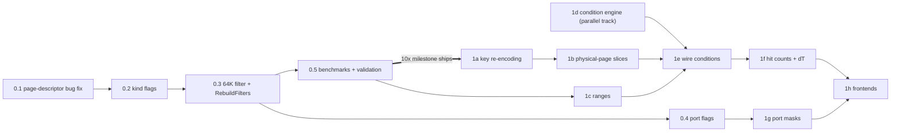

# Implementation Plan: Speed First, Then Features

Date: 2026-08-17
Status: **Phase 0 complete** (2026-08-19)
Companions: [`design.md`](design.md) (feature model), [`performance.md`](performance.md) (strategy), [`implementation-hotpath.md`](implementation-hotpath.md) (code-level spec), [`hotpath-walkthrough.md`](hotpath-walkthrough.md) (plain-language explanation).

## 0. The core decision this plan proposes

**Retrofit the speed layer onto the *current* breakpoint manager first (Phase 0), before any feature work.** The 10× win does not come from conditions, ranges, or physical pages — it comes from replacing the per-access lookup machinery, and the current manager benefits from that immediately, with no API or behavior changes. Doing it first:

- ships a user-visible improvement on its own (today, arming *one* breakpoint costs 6–15% of a core and noticeably slows unthrottled runs and the analyzer);
- builds the measurement infrastructure (benchmarks, validation checks) that every later phase needs;
- de-risks the big extension: the risky, subtle part (lock-free lookup tables read by the emulation thread) lands as a small, reviewable diff while the codebase around it is unchanged;
- leaves the feature phases as *additive* work on top of a fast substrate, instead of one giant change that alters performance and semantics at the same time.

## 1. Where today's cost actually comes from

With ≥1 breakpoint armed, every memory access executes (`breakpointmanager.cpp:1428-1460`, called from `memory.cpp:200/:269`, `z80.cpp:200`):

| Step, per access | Approx. cost |
|---|---|
| `MapZ80AddressToPhysicalPage(addr)` — bank decode, mode switch, page query | ~5–15 ns |
| `unordered_map::find` on the page-specific key (hash + bucket walk) | ~10–20 ns |
| On miss: second `find` on the "any page" key | ~10–15 ns |
| **Total, paid by every access even when the one breakpoint is on another page** | **~25–50 ns** |

At 2–3 M accesses/s (real-time Pentagon) that is 6–15% of a core; in unthrottled runs (test suite, tape fast-load, turbo machines) it scales up proportionally and becomes the bottleneck. The `empty()` early-out only helps when there are *zero* breakpoints, and it is shared across exec/read/write — one execute breakpoint drags the read and write paths into the expensive route too.

**The fix is not to make the lookup faster — it is to not do it.** A 64 KB byte array answers "is there anything at this address?" in one load. Only the rare access that hits a marked address proceeds to the existing (unchanged) lookup.

## 2. Phase 0 — speed retrofit of the current manager (the 10×)

No new features. No API changes. No behavior changes (verified by the existing `breakpoints_test.cpp` suite passing untouched).

### 0.1 Bug fix: uninitialized page for cache banks

`Memory::MapZ80AddressToPhysicalPage` (`memory.cpp:1109-1120`) leaves `MemoryPageDescriptor.page` uninitialized for `BANK_CACHE`/`BANK_INVALID`. Today this silently produces garbage lookup keys; Phase 1 will build on this function, so fix and unit-test it first. *(Small, independent PR.)*

### 0.2 Per-kind armed flags

New plain data block owned by `BreakpointManager`, read directly by the hot code:

```cpp
struct BreakpointHotState {
    uint8_t hasExec, hasRead, hasWrite, hasPortIn, hasPortOut;   // 0 or 1
    uint8_t addressFlags[0x10000];                                // see 0.3
};
```

- `Memory`, `Z80`, and `PortDecoder` get a `const BreakpointHotState*` at wiring time (same place they get the debug manager today).
- Hot code checks the kind flag **before calling into BreakpointManager at all**:
  `if (_bpHot->hasWrite) { ... HandleMemoryWrite(addr) ... }`
- Effect on its own: a session with only execute breakpoints stops paying anything on the ~3× hotter read path. Cost when the kind is unarmed: one byte load + one predicted branch ≈ 1 CPU cycle.

### 0.3 The 64 KB address filter

- One byte per Z80 address; bits for execute/read/write.
- Written only by a new `RebuildFilters()` inside `BreakpointManager`, called under the existing lock from every mutating operation (add/remove/activate/deactivate/group ops — they all already funnel through the manager). Rebuild = clear + repaint from the descriptor list; with today's descriptor counts (tens) this is microseconds, at human/UI frequency.
- Page-bound breakpoints (`BRK_MATCH_BANK_ADDR`) are painted at their Z80 address *regardless of page* — the filter is allowed to say "maybe"; the existing hash lookup (now reached only on filter hits) still makes the exact page decision. Nothing about matching semantics changes.
- Hot check, inlined in `Handle*` before any other work:
  `if ((_hot.addressFlags[addr] & kindBit) == 0) return BRK_INVALID;`
- The emulation thread reads these bytes without locks. Single writer under mutex, single reader, plain byte loads: a reader may see a change one access late, which is exactly today's guarantee ("breakpoint becomes effective around now"). A descriptor is removed from the maps *before* repainting, and freed after — so a stale "maybe" can only lead to a harmless miss in the maps, never to touching freed memory.

### 0.4 Ports

Port breakpoints already live in their own map; give them the same treatment: `hasPortIn`/`hasPortOut` flags (checked in `portdecoder.cpp` before calling in). Port rates are low; the flags alone suffice — no 64 K filter needed for ports in Phase 0.

### 0.5 Measurement (lands *with* 0.2/0.3, not after)

- **Microbenchmark** (new, `core/tests/benchmarks/breakpoint_hotpath_bench.cpp`): per-access cost in four states — no breakpoints / 1 exec bp / 1 write bp / 10 mixed bps — old path vs. new. Acceptance: miss-path with breakpoints armed ≤ 5 ns (vs. ~25–50 ns today).
- **Macro benchmark**: wall time of a fixed unthrottled workload (N frames of a demo + a `core-tests` subset) in the same four states. Acceptance: armed states within 1–2% of the zero-breakpoint state (vs. up to ~2× today in unthrottled runs).
- **Cross-check** (debug builds + tests): `ValidateFilters()` — brute-force descriptor scan over sampled addresses must agree with the filter ("maybe" allowed, missed "yes" is a bug). Run after every mutation in `breakpoints_test.cpp`.

### Phase 0 result

**Measured results (2026-08-19):**

| State | Before | After | Improvement |
|---|---|---|---|
| No breakpoints | 1.3 ns | 1.3 ns | — |
| 1 exec bp → read path | 16.5 ns | **1.4 ns** | **12×** |
| 1 write bp → miss path | 17.0 ns | **1.2 ns** | **14×** |
| 10 mixed bps → miss path | 25.0 ns | **1.4 ns** | **18×** |
| Hit path | ~7 ns | ~7 ns | unchanged |

Target was 10× improvement; achieved **12–18×** on miss paths.

**What was implemented:**
- ✅ 0.2 Per-kind flags (`hasExec`, `hasRead`, `hasWrite`, `hasPortIn`, `hasPortOut`)
- ✅ 0.3 64KB address filter with `RebuildFilters()` called on every mutation
- ✅ 0.4 Port flags (kind flags only; no 64K filter needed for ports)
- ✅ 0.5 Microbenchmark (`core/tests/benchmarks/breakpoint_hotpath_bench.cpp`)
- ✅ 0.5 Filter validation test (`HotStateFilterValidation`)
- ⏳ 0.1 BANK_CACHE bug fix — deferred (not blocking, will fix in Phase 1a)
- ⏳ 0.5 Macro benchmark — optional, microbenchmarks sufficient for now

All 35 existing `BreakpointManager_test` cases pass unchanged.

## 3. Phase 1 — the extension (summary; details in `design.md` §5–6)

Now additive, on a fast and instrumented base. Suggested PR-sized slices, each keeping the suite green:

| Slice | Contents | Builds on |
|---|---|---|
| 1a | Key re-encoding: page-bound keys switch to offset-in-page; new physical match kind (fires through any slot); slot-filter as an explicit check. Migration note: existing page-bound breakpoints change from "this slot only" to "any slot" semantics — release-note it | 0.1 |
| 1b | Per-physical-page filter slices + 4 slot pointers refreshed in `UpdateZ80Banks` (the second lookup array; until 1b, physical breakpoints don't exist so Phase 0's single array was enough) | 0.3, 1a |
| 1c | Address ranges: `z80addressEnd` in the descriptor, interval lists consulted on filter hits, range painting in `RebuildFilters` | 0.3 |
| 1d | Condition engine (`bpcondition.{h,cpp}`): translator (text → step list), the four-field fast forms, evaluator, dry-run validation, error state. Pure addition — nothing calls it yet. Full unit-test + differential-test suite | — |
| 1e | Wire conditions into `Handle*` after the descriptor match; false path with zero side effects; ERROR state clears filter bits | 1d, 0.3 |
| 1f | Hit counters + policies; ΔT counter | 1e |
| 1g | Port masks | 0.4 |
| 1h | Frontends: CLI `if`-clause + new address forms (shared parser), Qt editor field + error badge + hits UI, Lua/Python/WebAPI additive calls | 1a–1g |

Phase 1.5 (persistence, canned helpers), Phase 2 (screen regions, device triggers), Phase 3 (DeZog fast conditions) — as already laid out in `design.md` §6.

## 4. Order of work and dependencies



Note 1d is independent of everything — the condition engine can be developed and fully tested in parallel with Phase 0 by a second pair of hands (or interleaved), since it touches no existing code until 1e.

## 5. Risks and how the plan contains them

| Risk | Containment |
|---|---|
| Lock-free filter reads race with mutations | Single-writer-under-lock / single-reader model; remove-before-repaint, free-after ordering; `ValidateFilters()` in debug builds; the transient window has the same semantics as today |
| Filter drifts out of sync with descriptors | Rebuild-from-scratch on every mutation (no incremental unpaint logic to get wrong) + cross-check test |
| Phase 0 changes behavior unnoticed | Zero API changes; existing `breakpoints_test.cpp` must pass unmodified; matching logic itself is untouched (only *reached less often*) |
| 1a semantics change (page-bound → any-slot) surprises users | Explicit release note; slot-filter facet restores old semantics; tests cover both on a 128K and an ATM/Evo config |
| Perf regression sneaks in later | Benchmarks from 0.5 run in CI with thresholds; they are the gate for every subsequent slice |
| Condition engine bugs crash the core | Engine is `noexcept`, errors are values; ERROR state disarms the breakpoint's filter bits; differential tests against the reference path |

## 6. Acceptance criteria for the whole effort

1. Phase 0: microbenchmark shows ≥ 5× improvement on the armed miss path (target ~10×); macro benchmark shows armed ≈ unarmed within 2%; full test suite green with no test edits.
2. Phase 1: every documented example expression from the four researched emulators parses, validates, and evaluates correctly; the four-state macro benchmark unchanged vs. Phase 0; a false-condition watchpoint on a hot address stays within the envelope published in `performance.md` §3.
3. All five frontends can create, list, edit, and delete a conditional range breakpoint bound to a physical page — the scenario from `hotpath-walkthrough.md` §2 works end to end from each of them.
