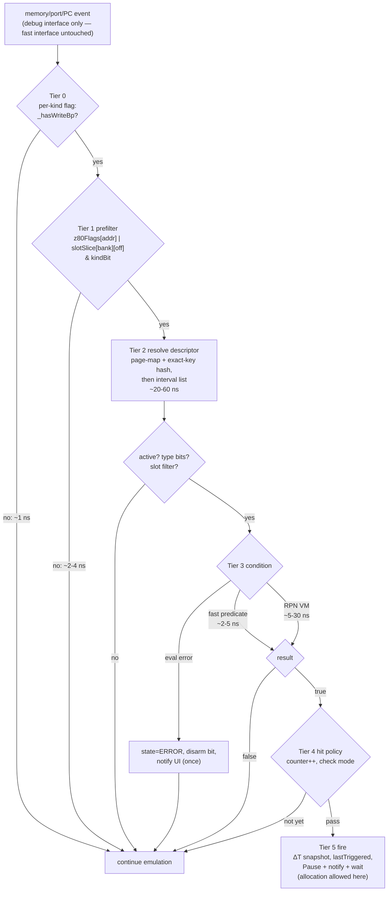
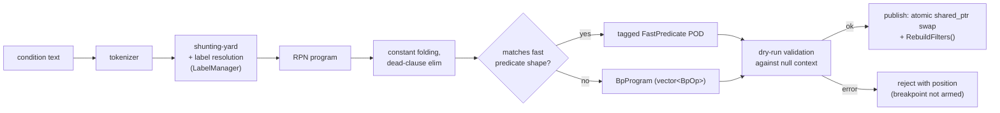

# Conditional Breakpoints — Performance Design

Date: 2026-08-17
Status: draft for review; companion to [`design.md`](design.md) (supersedes its §5.2 sketch where they differ). Implementation-level spec of each adopted item: [`implementation-hotpath.md`](implementation-hotpath.md). Plain-language walkthrough with a worked example and glossary: [`hotpath-walkthrough.md`](hotpath-walkthrough.md).
Prior-art research: [`research/performance-prior-art.md`](research/performance-prior-art.md) (GDB agent expressions, MAME, Mesen2, bsnes-plus, Dolphin, LLDB/lldb-eval, VS 2022)

---

## 1. Cost model: what we are protecting

### 1.1 Event rates

A Pentagon Z80 at 3.5 MHz executing ~4T average instructions produces, **per emulated second**:

| Event | Rate (3.5 MHz, real-time) | ×4 turbo (14 MHz ATM/Evo) | Unthrottled (tests, fast-forward) |
|---|---|---|---|
| Instructions (PC checks) | ~0.9 M/s | ~3.6 M/s | host-bound: 50–500 M/s |
| Memory reads (fetch+operands+data) | ~2–3 M/s | ~8–12 M/s | proportionally more |
| Memory writes | ~0.5–1 M/s | ~2–4 M/s | — |
| Port I/O | ~1–50 K/s | — | — |

Every nanosecond added to the per-access path multiplies by millions. At real-time speed the budget is soft (we only need to stay under 100% of a core with headroom); in unthrottled mode (test suite, tape fast-load, fast-forward) the per-access path **is** the bottleneck, so overhead translates 1:1 into wall-clock time. Memory `core-tests` already run ~5.5 min — regressing that matters.

### 1.2 What the debug path costs today

With `_feature_breakpoints_enabled` and ≥1 breakpoint armed, **every** memory access pays (`breakpointmanager.cpp:1428-1460`):

1. `MapZ80AddressToPhysicalPage(address)` — bank decode + switch + page query;
2. `unordered_map::find` on the physical key (hash, bucket walk);
3. on miss, a second `find` on the wildcard key.

That is ~20–50 ns per access on a modern host — i.e. **6–15% of a core at real-time 3.5 MHz, and a hard wall in unthrottled mode** — paid on *every* access even when the single armed breakpoint is for one address on another page. With zero breakpoints, the `empty()` early-out and the fast/debug interface swap already give a good idle path (kept as-is).

The three-audience summary of prior art (details and links in `research/performance-prior-art.md`):
- **The trap-based debugger world** (GDB host-side, VS): per-false-hit fixed costs give 100–2000× slowdowns; fixes = move evaluation to the target and defer all notification work until the condition is known true.
- **The emulator world** (Mesen2, MAME, Dolphin): converged on *(a)* zero-cost idle gating, *(b)* O(1) address prefilter before touching breakpoint lists, *(c)* conditions pre-compiled to flat RPN and evaluated only after an address match.
- **The JIT question** (LLDB FCB RFC vs lldb-eval): JIT-compiling the condition has no emulator prior art, real portability costs (W^X, macOS `MAP_JIT`), and loses to a good interpreter whenever fixed costs dominate — which they do at expression sizes of 3–15 ops.

## 2. Candidate strategies

### S1. Parse/interpret per hit (ZX-M8XXX model)

Re-parse the condition string (regex/recursive descent) on every hit.

- ✅ Trivial to implement; always in sync with source text.
- ❌ µs-class per hit; allocations in the hot path; unbounded worst case.
- **Verdict: rejected.** Fine in a JS webapp; disqualifying in a cycle-accurate C++ core.

### S2. Compile once → flat RPN bytecode, fixed-stack interpreter (GDB-agent / Mesen2 model)

Shunting-yard at breakpoint-set time → `std::vector<BpOp>` where `BpOp` is a POD `{opcode:u8, arg:u32}`; evaluated by a switch loop over a fixed `int64_t stack[32]`. All symbols resolved at compile time to direct-accessor opcodes (`PUSH_REG_A`, `PUSH_PG3`, `DEREF8`…) — **zero name lookups, zero allocation, zero exceptions on the hit path** (errors return a tri-state, see §4.4).

- ✅ ~5–30 ns for typical 3–15-op conditions; bounded worst case (ops × constant); portable; trivially testable (golden RPN dumps); the industry-convergent choice.
- ✅ Compile-time constant folding is free (fold at parse).
- ❌ ~2–5× slower than native code in principle — irrelevant below ~10⁷ evals/s.
- **Verdict: adopted as the general evaluator.**

### S3. Closure/tree-of-lambdas composition

Compile the AST into nested `std::function`s.

- ✅ Elegant; no VM to write.
- ❌ One indirect call + possible cache miss per node; heap allocation per node; harder to inspect/serialize; measured slower than flat RPN for small expressions (prior-art §8).
- **Verdict: rejected** in favor of S2.

### S4. Template-specialized fast predicates

At compile time, pattern-match the finished RPN against dominant shapes and store a tagged POD instead of a program:

```
REG8_CMP_CONST   {reg_offset, cmp, k}     // A==0, B>5
REG16_CMP_CONST  {reg_offset, cmp, k}     // HL>=4000h
REG16_CMP_REG16  {off1, cmp, off2}        // BC!=DE
MASK_CMP_CONST   {reg_offset, mask, cmp, k} // (F & $40)!=0, flag mnemonics
VAL_CMP_CONST    {which_bus, cmp, k}      // MWV==0, VAL&$10 (with mask)
MEM8_CMP_CONST   {addr, cmp, k}           // ($5C78)==13
ALWAYS_TRUE                                // empty condition
```

Evaluated by one `switch` + one or two loads + compare: **~2–5 ns**, no stack, no loop. Research shows these shapes cover the overwhelming majority of real conditions (every documented example from Unreal/SpecEmu/Spectaculator/ZX-M8XXX except multi-clause ones matches, and 2-clause `X && Y` where both clauses are fast shapes can be a `FAST_AND {p1, p2}` pair).

- ✅ Near-free for the common case; falls back to S2 transparently; invisible to the user.
- ❌ A second evaluator to maintain (mitigated: it is ~60 lines and the RPN path remains the reference implementation — differential-test one against the other).
- **Verdict: adopted as tier above S2.**

### S5. Native JIT of conditions (asmjit/xbyak)

- ✅ Absolute minimum per-eval cost (~1–3 ns).
- ❌ No emulator prior art (none of MAME/Mesen2/Dolphin/RPCS3 do it); per-arch backends (x86-64 + arm64 minimum — we ship on Apple Silicon, where `MAP_JIT` + `pthread_jit_write_protect_np` ceremony applies); W^X pages; debugging the generated code; the lldb-eval lesson — interpreter wins when expressions are tiny. Gains over S4+S2: single-digit ns on a path already gated to actual address matches.
- **Verdict: rejected for now.** The `BpProgram` abstraction leaves room to add a JIT backend later without touching frontends, if profiling ever shows conditions dominating (they won't — see budget, §5).

### S6. Transpile conditions to Lua (we vendor Lua/sol2)

- ✅ Reuses an existing VM; conditions could call user script functions.
- ❌ Lua call overhead (~100 ns+), GC pauses in the emulator thread, state marshalling per hit, cross-thread ownership questions with the existing Lua automation worker.
- **Verdict: rejected for the hot path.** Kept as a phase-3 idea for breakpoint *actions* (on-hit scripts), where rates are human-scale.

### S7. O(1) address prefilter (the decisive one)

The strategies above optimize the *condition*; the bigger win is not reaching the breakpoint machinery at all. Replace "page-map + 1–2 hash lookups on every access" with **two L1 loads and a branch**:

```cpp
// 64K Z80-space flags: wildcard + slot-filtered breakpoints, incl. ranges (painted at set-time)
uint8_t z80Flags[0x10000];          // bit0=exec bit1=read bit2=write (+bit3=has-phys-anywhere spare)

// per-physical-page 16K slices for physical (any-slot) breakpoints
// slotSlice[bank] repointed on every remap; pages with no phys-BPs share zeroSlice
const uint8_t* slotSlice[4];        // -> pageSlice[physPage][0x4000] or zeroSlice

inline uint8_t Prefilter(uint16_t addr) {
    return z80Flags[addr] | slotSlice[addr >> 14][addr & 0x3FFF];
}
// hot path:  if ((Prefilter(addr) & kindBit) == 0) return BRK_INVALID;
```

Key properties:

- **Miss path (the 99.999% case): ~2–4 ns**, no function calls, no hashing, no page-map call. This is *cheaper than today's path with breakpoints armed by an order of magnitude*.
- **Ranges are free at match time**: a range breakpoint paints its bits over the array once at set-time (16-bit space: worst case 64 K byte-writes, microseconds).
- **Physical breakpoints cost O(1) on remap**: `UpdateZ80Banks()` already runs on every paging change; it additionally assigns 4 pointers (`slotSlice[i] = pageHasBp[page] ? pageSlice[page] : zeroSlice`). No repainting, no copying — ATM/Evo per-scanline paging tricks stay cheap.
- Slices allocate 16 KB per physical page *that actually has a physical breakpoint* (lazily), not 323 × 16 KB.
- Memory: 64 KB + 4 pointers + 16 KB × (pages with phys-BPs) — trivially L1/L2-resident; the two loads hit at most 2 cache lines.

- ✅ Transforms the armed-but-not-hit cost from "hash machinery on every access" to "two loads"; makes ranges and physical BPs *cheaper* to check than today's single-address BPs.
- ❌ Must be kept in sync with the descriptor store (single `RebuildFilters()` on any breakpoint add/remove/enable/disable — descriptor counts are tens, repaint is µs) and with remaps (4 pointer stores). Two sources of truth — mitigated by a debug-build assertion mode that cross-checks filter bits against a full descriptor scan.
- **Verdict: adopted as the gate in front of everything.**

### S8. Finer-grained hook installation (MAME-tap / Mesen2-flag style)

Today the fast↔debug **memory interface swap** is all-or-nothing. Refinements, in increasing order of effort:

- **S8a — per-kind flags** (adopt): `_hasExecBp / _hasReadBp / _hasWriteBp / _hasPortInBp / _hasPortOutBp` booleans checked before the prefilter, so e.g. a session with only exec breakpoints pays nothing on the read/write paths (Mesen2's `_hasBreakpointType[]`). Nearly free to implement.
- **S8b — split debug interface variants** (defer): separate MemIf configurations for tracker-only / breakpoints-only / both, so enabling memory tracking doesn't imply breakpoint checks and vice versa. Moderate wiring in `Memory::GetDebugMemoryInterface`.
- **S8c — per-slot handler tables** (reject for now): MAME-style per-region tap installation would let unaffected 16 K slots run the fast path even with watchpoints elsewhere. Our S7 prefilter achieves ~the same effect for ~2 ns without restructuring the memory dispatch.

### S9. Around-the-hit fixed costs (the VS 2022 lesson — full before/after algorithm with sequence diagram in `research/performance-prior-art.md` §7)

When a condition evaluates **false**, nothing else may happen: no allocation, no MessageCenter post, no state snapshot, no `_lastTriggeredBreakpointID` write. Today's hit path allocates a `SimpleNumberPayload` per trigger — fine at pause-rate (human-scale), fatal if done at false-hit rate. The design must route false hits back to the emulation loop untouched. Additionally: hit-counters increment on a false *condition*? No — policy: **condition gates first, counters count condition-true hits only** (matches Spectaculator semantics and keeps the false path store-free).

## 3. The hybrid strategy (final)

Layered funnel; each tier is only entered when the previous one matched, and each tier is 10–100× rarer than the previous:



### Tier summary

| Tier | Check | Cost | Frequency |
|---|---|---|---|
| 0 | per-kind bool (S8a) | ~1 ns | every access of that kind |
| 1 | 2-load prefilter (S7) | ~2–4 ns | every access when kind armed |
| 2 | page-map + hash/interval resolve | ~20–60 ns | only on prefilter hits |
| 3 | condition: fast predicate (S4) or RPN VM (S2) | ~2–30 ns | only on descriptor matches |
| 4 | hit-count policy | ~2 ns | condition-true hits |
| 5 | pause/notify (S9: the only tier that may allocate) | µs+ | actual stops (human-scale) |

### Compilation pipeline (set-time, off the emulation thread)



- Programs are immutable after publish (`shared_ptr<const BpProgram>`); the emulation thread never sees a partially-built program. Label changes recompile affected programs and republish the same way.
- `RebuildFilters()` repaints `z80Flags`, allocates/frees page slices, refreshes per-kind flags — µs-scale, done under the existing manager lock, safe because the emulation thread reads filters without locks (stale-by-one-access is acceptable during arming: a breakpoint becomes effective "around now", same guarantee as today).
- Remap hook: `Memory::UpdateZ80Banks()` gains 4 pointer assignments (`slotSlice[i]`) — the only per-paging-change cost.

### Worst cases, stated honestly

| Scenario | Cost | Mitigation |
|---|---|---|
| Watchpoint on a hot loop's own address, condition false (e.g. `bpw 5C78 if MWV==$FF`, written every frame line) | tiers 2+3 per write to that address: ~30–90 ns × hit rate. 50 K hits/s → ~0.5% core. 1 M hits/s (pathological: watch the LDIR target) → ~3–9% core | acceptable by construction; the funnel caps it |
| Exec condition on every instruction (`bp 0000-FFFF if A==0` — Unreal-cbp emulation) | tiers 2+3 per instruction: ~30–90 ns × 0.9 M/s ≈ 3–8% at real-time; ×4 turbo ≈ 12–30%; unthrottled: dominates | explicit opt-in cost; UI shows a ⚠ "evaluated every instruction" badge on full-range exec BPs; still 100× better than a trap-based debugger |
| 100 range/physical breakpoints armed | tier 1 unchanged (~2–4 ns miss); tier 2 interval search only on prefilter hits | prefilter absorbs the scale |
| Paging storm (per-scanline 7FFD flips on ATM demo) | +4 pointer stores per remap | O(1) by design (S7) |

### What we deliberately did NOT do

- **No native JIT** (S5) — no prior art, real platform cost, negligible headroom over S4/S2 at our rates. The `BpProgram` seam allows it later.
- **No Lua in the hot path** (S6).
- **No per-slot handler tables** (S8c) — S7 gets the benefit for 2 loads.
- **No exceptions on the hit path** — evaluator returns `{value, ok}`; deref of an unmapped/cache address yields `ok=false` → tier-3 "eval error" → breakpoint enters ERROR state and its filter bits are cleared (so a broken condition cannot keep taxing the loop), user notified once.

## 4. Validation plan

1. **Microbenchmarks** (`core/tests/benchmarks/`, Google Benchmark or manual): prefilter miss; tier-2 resolve; fast predicates vs RPN VM for the canonical example set from all four researched emulators; RebuildFilters at 1/10/100 descriptors.
2. **Macro**: frames-per-second of a demo scene + `core-tests` wall time in four states — (a) breakpoints feature off, (b) on with 0 BPs, (c) 10 armed non-matching conditional BPs, (d) 1 hot false-condition watchpoint. Acceptance: (b) and (c) within noise of (a); (d) within the stated worst-case envelope.
3. **Differential correctness**: every fast predicate result cross-checked against the RPN VM over randomized register/memory states (property test); debug-build `ValidateFilters()` cross-checks filter bits against a full descriptor scan after every mutation.
4. Baselines recorded against `docs/inprogress/2026-01-10-performance-optimizations/discovery.md`.

## 5. Budget summary

At real-time Pentagon speed with a realistic debug session (a handful of address-targeted conditional BPs), total added cost over today's zero-breakpoint path: **tier 0+1 on every access ≈ 3–5 ns × ~3 M/s ≈ 1–1.5% of one core** — and this *replaces* today's 20–50 ns hash path when any breakpoint is armed, i.e. the new design is strictly faster than the current one in every armed state. Conditions themselves are only ever paid at addresses the user explicitly targeted.
