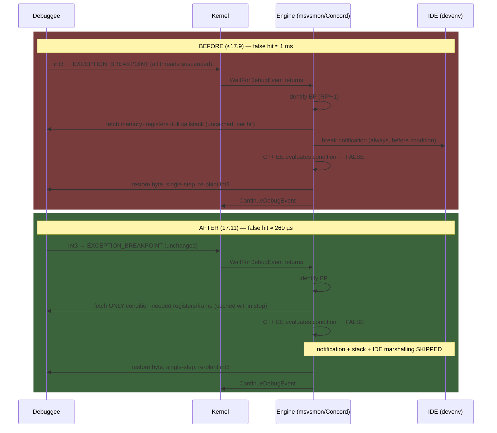

# Prior Art: Fast Conditional Breakpoint Evaluation in Debuggers and Emulators

Research report for the conditional-breakpoint performance design (`../performance.md`). All findings verified against primary sources (linked) in August 2026.

---

## 1. GDB Agent Expressions — bytecode compiled for target-side evaluation

**Sources:** [GDB manual, Agent Expressions appendix](https://sourceware.org/gdb/current/onlinedocs/gdb.html/Agent-Expressions.html), [General Bytecode Design](https://sourceware.org/gdb/current/onlinedocs/gdb.html/General-Bytecode-Design.html), [Break Conditions](https://sourceware.org/gdb/current/onlinedocs/gdb.html/Conditions.html)

**Why it exists.** GDB's default conditional breakpoint is trap-based: every hit stops the inferior, the condition is evaluated *in the debugger*, and execution resumes if false. For remote targets each false hit costs a full RSP round-trip. Agent expressions move evaluation to the target: GDB translates the condition into a tiny bytecode program shipped to the stub (gdbserver / in-process agent), which evaluates it locally and only reports back when the condition is true.

**Bytecode design — the key decisions:**
- **Pure stack machine**, ~40 single-byte opcodes, covering C arithmetic, shifts, comparisons, literals, `goto`, and sized memory reads (`ref8/16/32/64`).
- **Untyped stack**: "Stack elements carry no record of their type." All values are widened to full-size integers on push; an explicit `ext n` opcode does sign-extension when the *compiler* (GDB) knows it's needed. All type/symbol knowledge is pushed to compile time — the interpreter needs zero symbol tables, making the target-side VM tiny and its worst-case time/memory statically boundable (a stated design goal for real-time targets).
- Controlled via `set breakpoint condition-evaluation host|target|auto`.

**The performance problem it solves — numbers** ([werat.dev, "How conditional breakpoints work"](https://werat.dev/blog/how-conditional-breakpoints-work/)):
- Each trap hit = stop, restore original instruction, single-step, re-insert `int3`, resume — plus condition evaluation. At 1 ms remote latency that cycle alone is ~5 ms, i.e. **~200 condition checks/second ceiling**.
- Measured: a loop of 10,000 iterations runs in <1 ms free, ~2 s with a false conditional breakpoint — **~2000x slowdown**.
- GDB's In-Process Agent removes the stop/resume entirely; UDB (Undo) cites **~1000x improvement** from in-process evaluation.

**Lesson for an emulator:** this architecture exists to eliminate a process boundary the emulator *doesn't have* — but the compile-once-to-untyped-RPN, evaluate-many design, with all symbol resolution done at compile time, is exactly the right per-hit cost model.

---

## 2. MAME — pre-parsed postfix expressions + tap-based watchpoints

**Sources:** [src/emu/debug/express.cpp](https://github.com/mamedev/mame/blob/master/src/emu/debug/express.cpp), [src/emu/debug/debugcpu.cpp](https://github.com/mamedev/mame/blob/master/src/emu/debug/debugcpu.cpp)

**Expression engine (`parsed_expression`):**
- `parse()` runs once: `parse_string_into_tokens()` (dec/hex/oct/bin numbers, symbols, wordy operators like `and`/`or`, memory-access operators like `p@w` = program-space word read), then `infix_to_postfix()` (shunting-yard, 16 precedence levels). Result cached in `m_tokenlist`.
- Per evaluation, `execute_tokens()` walks the cached postfix list with a bounded, **reused** token stack — no allocation per hit. Symbols resolve lazily at eval time through `symbol_table` entries (raw pointer, constant, or getter/setter lambdas). Lookup uses `find_deep()` walking parent scopes — a real per-hit cost when tables are deep.
- Verdict: correctness/flexibility over speed; fine because of gating:

**Gating and watchpoints:**
- Instruction breakpoints: per-instruction `instruction_hook()` checks a flag first: `if ((m_flags & DEBUG_FLAG_LIVE_BP) != 0) breakpoint_check(curpc);`. `breakpoint_check` uses an **address-keyed multimap** (`equal_range(pc)`) — the condition executes only after a PC match, wrapped in try/catch on `expression_error`.
- Watchpoints use **memory taps** installed into the address-space dispatch tables (`install_write_tap(...)`), reinstalled per data width and **removed when no watchpoints remain**. Cost model: zero when no watchpoint exists on a space; when one exists, *every* access to that space goes through the tap lambda (handler-table dispatch = a table swap, not a global "if debugging" branch).

---

## 3. Mesen2 — cached RPN + per-operation-type breakpoint arrays + null-pointer-gated hooks

**Sources:** [Core/Debugger/ExpressionEvaluator.cpp](https://github.com/SourMesen/Mesen2/blob/master/Core/Debugger/ExpressionEvaluator.cpp), [Core/Debugger/BreakpointManager.cpp](https://github.com/SourMesen/Mesen2/blob/master/Core/Debugger/BreakpointManager.cpp), [Core/Shared/Emulator.h](https://github.com/SourMesen/Mesen2/blob/master/Core/Shared/Emulator.h)

The closest architectural template for a retro-emulator debugger; three layered techniques:

**(a) Non-debug path stays fast via inline null-check hooks.** The core is *always* compiled with hooks; no separate debug build. Every memory access calls an `__forceinline` template on `Emulator`:

```cpp
template<CpuType type, uint8_t accessWidth = 1, MemoryAccessFlags flags = MemoryAccessFlags::None, typename T>
__forceinline void ProcessMemoryRead(uint32_t addr, T& value, MemoryOperationType opType)
{
    if(_debugger) { _debugger->ProcessMemoryRead<type, accessWidth, flags>(addr, value, opType); }
}
```

With no debugger attached: one perfectly predicted null-pointer branch per access. CpuType/width/flags are **template parameters** — dispatch resolved at compile time.

**(b) BreakpointManager prefilters before any expression work.**
- Breakpoints bucketed into parallel arrays **indexed by `MemoryOperationType`** (`_breakpoints[i]`, `_rpnList[i]`), with `_hasBreakpointType[i]` booleans — a category with no breakpoints costs one flag test.
- Breakpoints for other CPUs dropped at `SetBreakpoints()` time — no runtime CPU comparison.
- `InternalCheckBreakpoint()` matches address/type first and evaluates the condition **only after a match**.
- Conditions **pre-compiled to RPN at breakpoint-set time**, never parsed per hit.

**(c) Expression evaluator = shunting-yard → cached RPN → flat int64 stack machine.**
- `ExpressionData` = `RpnQueue` (vector of int64_t tokens) + `Labels`; parsed expressions cached in a string-keyed map.
- `Evaluate()` runs the RPN over a fixed `int64_t operandStack[100]` — no heap allocation per hit. Special tokens (Value, Address, PC, per-CPU registers) resolve at eval time through per-CPU token functions; memory-dereference operators call the memory dumper.
- Outer `Evaluate()` wraps in try/catch returning `EvalResultType::Invalid` — errors can't take the core down.

---

## 4. bsnes-plus / higan / ares — compile-time debugger builds

**Source:** [devinacker/bsnes-plus](https://github.com/devinacker/bsnes-plus), `bsnes/snes/cpu/cpu.cpp`

bsnes-plus compiles the debugger **in or out** with the preprocessor: the debug build substitutes an instrumented CPU class wholesale (`CPUDebugger cpu;` vs `CPU cpu;` under `#if defined(DEBUGGER)`), wrapping `op_step`/`op_read`/`op_write` with hook callbacks. Zero cost in the release build, but two binaries, and the debug build pays the hooks unconditionally. Maps to a C++ template parameter on the CPU core if compile-time elimination without two source trees is wanted. Upstream ares has only minimal tracing — not useful prior art for conditions.

---

## 5. Dolphin — zserge `expr` library + breakpoint checks compiled into JIT blocks

**Sources:** [Source/Core/Core/PowerPC/Expression.cpp](https://github.com/dolphin-emu/dolphin/blob/master/Source/Core/Core/PowerPC/Expression.cpp), [PR #11274](https://github.com/dolphin-emu/dolphin/pull/11274), [Jit64/Jit.cpp](https://github.com/dolphin-emu/dolphin/blob/master/Source/Core/Core/PowerPC/Jit64/Jit.cpp), [PR #13302](https://github.com/dolphin-emu/dolphin/pull/13302)

**Expression engine.** Embeds zserge's single-header C `expr` library. `Expression::TryParse()` calls `expr_create()` **once** per breakpoint; per hit, `expr_eval()` on the retained AST. Variables (`r0..r31`, `pc`, SPRs) bind through a sorted compile-time lookup table; `SynchronizeBindings()` copies CPU state into expr variables before eval (registers used are computed once and cached, limiting sync cost). ~23 custom functions (guest-memory reads, callstack, etc.).

**JIT interaction.** Dolphin does **not** fall back to the interpreter for blocks with breakpoints. With debugging enabled, `DoJit()` bakes a check into the translated block **only at guest addresses that have a breakpoint at compile time**; adding/removing a breakpoint invalidates affected JIT blocks so they recompile. Cost model: debugging off = zero; a breakpoint = one host call at that guest PC only. [PR #13302](https://github.com/dolphin-emu/dolphin/pull/13302) fixed lag from redundant MMU/fastmem reconfiguration when loading many *memory* breakpoints — a reminder that **watchpoints on a fastmem system cost the fast path for whole pages**, not just the watched address.

---

## 6. JIT-compiling the condition itself — LLDB and the FCB RFC

**Sources:** [LLDB overview](https://lldb.llvm.org/resources/overview.html), [lldb-dev RFC: Fast Conditional Breakpoints](https://lists.llvm.org/pipermail/lldb-dev/2019-August/015370.html), [lldb-eval](https://github.com/google/lldb-eval), [werat.dev on lldb-eval](https://werat.dev/blog/blazing-fast-expression-evaluation-for-c-in-lldb/)

- **LLDB baseline**: conditions parsed by a full embedded Clang into LLVM IR; simple IR interpreted, complex IR JIT-compiled and **injected into the target process**. Powerful (full C++), but heavyweight: **50–100 ms per expression evaluation** measured.
- **Fast Conditional Breakpoints RFC (2019)**: patch the breakpoint site with a *branch* to a trampoline that saves context, calls the JIT-compiled condition checker, and only traps when true; cited as saving ~10x per hit. Limitations that stalled it: x86_64-only, fails when the patched instruction is a branch/too short, few DWARF ops, needs slow-path fallback. General shape of "JIT the condition" trade-offs: **architecture-specific codegen, W^X / MAP_JIT constraints (macOS arm64 needs `pthread_jit_write_protect_np` toggling), safety fallbacks, real complexity — repaid only at enormous hit frequency.**
- **lldb-eval** (Google): the counter-example — recursive-descent parser + AST interpreter over a C++ subset, host-side. **~1 ms vs LLDB's 50–100 ms** — for expression-sized programs a good interpreter beats a compiler+JIT pipeline whose fixed costs dominate.
- For an emulator the calculus is friendlier (no code patching — you own the dispatch loop), but at Z80 speeds a flat RPN interpreter at ~5–20 ns/hit already disappears into the noise; native JIT of conditions has **no emulator prior art** (MAME, Mesen2, Dolphin, RPCS3, xenia — none do it).

---

## 7. Visual Studio 17.10/17.11: the full before/after algorithm

**Sources:** [VS Blog: Accelerate C++ Debugging with Enhanced Conditional Breakpoints](https://devblogs.microsoft.com/visualstudio/accelerate-c-debugging-with-enhanced-conditional-breakpoints/), [C++ Team Blog: Enhanced Breakpoint Expressions](https://devblogs.microsoft.com/cppblog/enhanced-breakpoint-expressions-for-c-debugging-in-visual-studio/), [VS 2022 recent performance enhancements](https://devblogs.microsoft.com/visualstudio/visual-studio-2022-recent-performance-enhancements/), [Concord architecture wiki](https://github.com/microsoft/ConcordExtensibilitySamples/wiki/Overview-of-the-Concord-Architecture), [Concord CLR EE wiki](https://github.com/Microsoft/ConcordExtensibilitySamples/wiki/CLR-Expression-Evaluators), [MS Learn: using-breakpoints](https://learn.microsoft.com/en-us/visualstudio/debugger/using-breakpoints?view=vs-2022), [werat.dev: How conditional breakpoints work](https://werat.dev/blog/how-conditional-breakpoints-work/)

Evidence quality note: Microsoft's blogs describe the changes as *classes of work* cached/deferred/reduced — they never name components or APIs. The reconstruction below combines (a) the blogs (quoted), (b) documented Win32 debugging-API mechanics, (c) Microsoft's documented Concord (VS debug engine) architecture, (d) werat.dev's measured trap-pipeline analysis. Steps are tagged **FACT** (documented) or **INFERRED** (reconstructed, basis given).

**Components:** debuggee process (int3 `0xCC` patched at the BP address); **msvsmon.exe** hosting **Concord**, the debug engine (`vsdebugeng.dll`/`vsdebugeng.impl.dll`: Dispatcher, Base Debug Monitor, Breakpoint Manager, Expression Evaluators — FACT per Concord wiki; msvsmon hosting for local native debugging INFERRED from crash reports); **devenv.exe** (IDE UI — break mode, windows; Concord's Dispatcher "remotes the method call" across process boundaries — FACT). The native C++ EE *interprets* conditions engine-side; VS docs: "the breakpoint is skipped only if the condition is valid and evaluates to false" (invalid ⇒ break).

### BEFORE (≤17.9): one hit of a false-condition breakpoint

1. Debuggee thread executes the planted `int3` → `EXCEPTION_BREAKPOINT`. — FACT
2. Kernel **suspends all debuggee threads**, engine's loop returns from `WaitForDebugEvent` with `EXCEPTION_DEBUG_EVENT`. Two user↔kernel transitions + full-process suspend, per hit. — FACT
3. Engine identifies the breakpoint from the faulting address (RIP−1 rewind; Concord's Breakpoint Manager owns the mapping). — FACT (role) / FACT (int3 technique)
4. **Break state established and debugger notified BEFORE the condition is looked at** — the 17.11 blog states this ordering verbatim: "Previously, when a breakpoint was hit, the debugger was immediately notified before the condition was evaluated." — FACT. This notification pulled in, per hit:
   - 4a. **Uncached fetches** of "process memory and CPU registers" (blogs verbatim) — i.e. `ReadProcessMemory`/`GetThreadContext`-class calls (API names INFERRED — the only APIs that fetch that state).
   - 4b. **Broad stop-state population**: full call-stack retrieval and register context (blogs name these as the later-minimized items); breadth beyond that (module list, all-threads refresh) INFERRED.
   - 4c. **Break notifications flowed toward the IDE machinery even for hits that would evaluate false** — FACT (this is exactly what 17.11 defers/skips); cross-process marshalling msvsmon→devenv via the Dispatcher INFERRED from Concord's remoting model.
5. **Condition evaluated** by the native C++ EE against the fetched state — engine-side interpretation, no code injected into the debuggee (side-effect-free contract). — FACT (each-hit evaluation, skip-only-on-valid-false) / INFERRED (host-side interpretation).
6. False ⇒ **resume dance**: restore original byte (`WriteProcessMemory` + `FlushInstructionCache`), rewind RIP, set trap flag (`SetThreadContext`), single-step, catch `EXCEPTION_SINGLE_STEP`, re-write `0xCC`, `ContinueDebugEvent(DBG_CONTINUE)`. — FACT (standard int3 technique per werat.dev) / INFERRED (that VS follows it exactly).

**Measured:** 80,000-iteration benchmark = 80 s ⇒ **~1 ms per false hit**; generic trap-mechanism measurements agree on the order (~2000x vs free-running).

### AFTER

**17.10 — caching within a break state** (≥35% faster — FACT): steps 1–3, 5–6 unchanged; step 4a replaced — "expensive fetch operations… can be cached while on the same break state", some calls "eliminated entirely by using information already available through other sources" (verbatim). Cache invalidated on resume. Benefits all debugging, not just conditions. — FACT

**17.11 — reorder + minimize** (~70% over 17.10; combined 80 s → 21 s ≈ 3.8× — FACT):

1. Trap, event delivery, BP identification — **unchanged**. VS did *not* adopt target-side/in-process evaluation (FACT by omission; 21 s / 80 K ≈ 260 µs/hit is still trap-class).
2. **Condition evaluated FIRST, on minimal state**: "we delay debugger notifications until after the breakpoint condition is evaluated"; the engine "retrieves minimal, crucial information for evaluating breakpoint conditions" — only the registers/frame data the expression needs. — FACT (verbatim); lazy operand-driven fetching INFERRED.
3. **False ⇒ skip everything**: "the notification and related operations are skipped entirely" — no break-state broadcast, no IDE marshalling, no full stack population; resume dance runs immediately. — FACT
4. **True ⇒ full stop**: only now the previously-unconditional notification path runs. — FACT



**What was NOT changed:** no restricted fast expression language, no movement of evaluation into the debuggee, no bytecode/JIT — the cppblog post, despite its title, describes only the caching/deferral/minimal-fetch trio (verified by full-text extraction). The residual ~260 µs/hit is the irreducible trap + kernel round-trip floor.

**Takeaway for our design:** VS 2024 is a case study in optimizing *around* an unavoidable trap: (1) hoist the condition check to the front of the stop pipeline, (2) make state acquisition lazy and condition-scoped, (3) cache within a stop, (4) pay full break machinery only on condition-true. Done well, it still yields only ~4× because the trap floor remains — while in-line evaluation in the dispatch loop (GDB-IPA / Mesen2 / our design) has no stop at all and lives in a different cost class (ns). The transferable rule is the ordering: **evaluate on minimal state first; notification, snapshotting, and allocation happen only after the condition is known true** — which is our `performance.md` §S9 verbatim.

---

## 8. Classic implementation techniques

- **Threaded code / computed goto** for the RPN VM: GCC/Clang `&&label` dispatch removes the switch bounds-check and gives each opcode its own indirect branch. CPython documents **15–20%** interpreter speedup; for a ~5-opcode condition the win is small but free.
- **Closure composition**: compile the parse tree into a tree of `std::function`/lambdas. One indirect call per node — usually slower than a flat RPN array over `int64_t` unless nodes do real work, and it heap-allocates. A flat array of small POD ops interpreted by a switch (Mesen2/MAME style) is the sweet spot.
- **Template-specialized fast paths for trivial predicates**: recognize dominant shapes at condition-compile time — `reg == const`, `(reg & mask) == const`, `mem8[const] == const` — and store them as a tagged small-struct evaluated with a switch/direct compare, bypassing the VM. Mesen2's `HasCondition()` split and Dolphin's compile-time address gating are degenerate forms.
- **Bitmap / prefilter before full match**: a direct array indexed by address answering "any breakpoint here?" in one load, before touching breakpoint lists — Bloom-filter-style prefiltering. For Z80's 64 KB space a direct `uint8_t bpFlags[65536]` (bits = exec/read/write/has-condition) is the obvious structure; with paging, per-page "any watchpoint" slices keyed by the slot table keep the fast path at one or two loads.
- **Handler-table swapping instead of branching** (MAME taps, Dolphin recompile): install the instrumented read/write handler only while a watchpoint exists, uninstall when the last one is removed — zero cost in the common state.

---

## Comparative table

| System | Compile-once form | Per-hit evaluation | Per-hit cost class | Fast-path gating (no BP active) | Complexity | Portability |
|---|---|---|---|---|---|---|
| GDB (host-side) | expression AST in debugger | trap → context switch → host eval → resume | **ms** (~2000x slowdown measured) | trap only at BP address | low | full |
| GDB agent expr (target-side) | untyped stack bytecode, ~40 1-byte ops | bytecode interp in stub | **µs**; ~1000x better than host-side | trap/jump-pad at BP address | medium | trivially portable |
| MAME | infix → postfix token list | token-stack interp + symbol-map lookups | **~µs** (map lookups dominate) | live-BP flag + PC multimap; watchpoints = installed/removed taps | medium | full |
| Mesen2 | shunting-yard → cached int64 RPN | flat `operandStack[100]` interp | **tens–hundreds of ns** | inline `if(_debugger)` null check; per-op-type has-BP flags; condition only after addr match | medium | full |
| bsnes-plus | — (hooks, not expressions) | virtual hook callbacks | n/a | `#if DEBUGGER` separate build → zero | low | full (two binaries) |
| Dolphin | zserge `expr` AST, parsed once | `expr_eval` on AST + register sync | **~µs** | check compiled into JIT block only at BP PCs | medium-high | full |
| LLDB default | Clang → LLVM IR → interp or injected JIT | in-target call or host IR interp | **50–100 ms** | trap at BP address | very high | LLVM targets |
| LLDB FCB RFC | JIT-native condition + trampoline | native call, no context switch unless true | **ns–µs** | patched branch at BP site | very high (arch-specific, W^X) | poor |
| lldb-eval | typed AST | host-side AST interpretation | **~1 ms** (incl. DWARF types) | n/a | medium | full |
| VS 2022 17.11 C++ | (unchanged) | trap + cached fetch + deferred notify | trap-class, ~4x better | trap at BP address | — | Windows |

## Synthesis

The convergent recipe across every fast implementation, ordered by leverage:

1. **Zero-cost idle path**: inline null/flag check or handler installation/removal — never a string, map, or virtual call in the frame loop when no breakpoint is set.
2. **O(1) address prefilter** before anything else: for Z80, a direct 64 K flag array beats every multimap in the prior art.
3. **Compile conditions once** at set-time into a flat, allocation-free RPN over `int64_t` with a fixed operand stack; resolve every symbol to a direct accessor token at compile time (GDB agent-expression lesson: no name lookups per hit).
4. **Special-case trivial predicates** (`reg==const`, masked compares) as tagged structs bypassing the VM.
5. **Skip native JIT of conditions**: no emulator does it, the FCB RFC shows the portability/W^X cost, and lldb-eval demonstrates an interpreter wins when fixed costs dominate. At worst-case Z80 rates a ~10 ns RPN evaluation is affordable — and the prefilter means it only runs on address matches.
