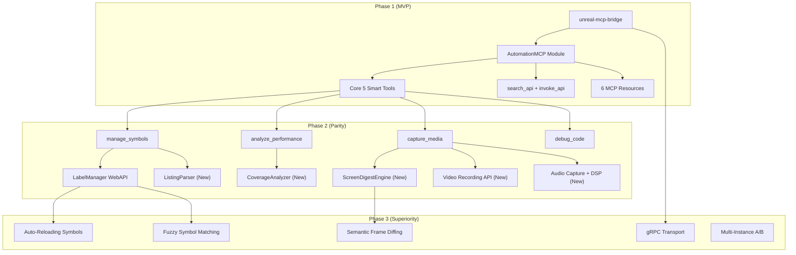

# MCP Implementation Roadmap

> **Date**: 2026-08-18
> **Status**: Phase 1 + Phase 2 **implemented** — see [Implementation Status](#implementation-status) below
> **Related**: [analysis_results.md](analysis_results.md) | [mcp_bridge_architecture.md](mcp_bridge_architecture.md) | [capabilities/](capabilities/)

---

## Implementation Status

Phase 1 (MVP) and Phase 2 (Parity) are complete and live-verified. Module:
`core/automation/mcp/` (+ `core/automation/mcp/bridge/`); usage and architecture in
`core/automation/mcp/README.md`.

| Area | Result |
|:---|:---|
| Transport | `POST /mcp` Streamable HTTP (stateless) on :8092, sharing the WebAPI drogon loop; JSON-RPC 2.0 dispatcher (drogon-free, unit-tested) |
| Tools (11) | Core 5 (`emulator_manage`, `load_software`, `control_execution`, `inspect_state`, `type_input`) + router 2 (`search_api` w/ auto-invoke, `invoke_api`) + Phase 2 4 (`manage_symbols`, `debug_code`, `analyze_performance`, `capture_media`) |
| Resources (6) | 5 embedded markdown + dynamic `unreal://emulator-state` |
| Bridge | `unreal-mcp-bridge` stdio daemon (zero deps) + `.mcp.json` + `scripts/mcp-smoke-test.sh` |
| Phase 2 core | `step_out`, `find_bytes`, `beam_position`, coverage analyzer, frame cost, screen digest (FNV-1a 64), labels load/resolve, `ListingParser` (.lst), `Z80TextAssembler`, AY logger + audio capture (RMS/peak/dominant-Hz + WAV), GIF video recording + `skip_until`, OpenAPI specs updated |
| Tests | 97 new gtest cases: MCP dispatcher/router/tools (FakeApiCaller, no drogon), Z80TextAssembler, ListingParser, CoverageAnalyzer, ScreenDigest, CallTraceBuffer (hot/cold incl. `FlushAllHotToCold` + Reset regression) |
| Deferred to Phase 3 | MP4/WebM recording, gRPC bridge transport, xxHash (FNV-1a fallback shipped), FFT audio analysis |

Notable deviations from the original plan: the assembler and listing parser live in
`core/src/debugger/{assembler,listing}/` (context-free, testable) rather than the
webapi layer; every_nth:"auto" digest quantum sampling uses max-gap over 10 frame
samples (conservative against frame-boundary jitter); AY logging taps TurboSound
chips where present.

---

## Executive Summary

This roadmap transforms the 13-document MCP design suite into a prioritized implementation plan across three phases. The guiding principle: **ship a working MCP server as fast as possible** (Phase 1), then close the parity gap with xspeccy-mcp (Phase 2), then deliver features xspeccy-mcp cannot match (Phase 3).

---

## Phase 1: MVP — "It Works" (Weeks 1–3)

**Goal**: A functional MCP server that an AI agent can use to load software, step through code, inspect state, and type input. Validates the architecture end-to-end.

### Core Infrastructure
| Task | Type | Depends On | Notes |
|:---|:---:|:---|:---|
| Create `AutomationMCP` module scaffold | New Code | CMake build system | Follow existing `ENABLE_*_AUTOMATION` pattern. Drogon on `:8092`. |
| JSON-RPC 2.0 dispatcher | New Code | — | Parse `tools/list`, `tools/call`, `resources/list`, `resources/read`. |
| `unreal-mcp-bridge` stdio daemon | New Code | — | Lightweight C++ process: stdin→HTTP POST, stdout←HTTP response. |
| `.mcp.json` IDE configuration | Config | Bridge | `{"mcpServers": {"unreal-ng": {"command": "unreal-mcp-bridge"}}}` |

### Smart Tools (Core 5 — Original Set)
| # | Tool | Core Dependencies | WebAPI Gaps |
|:---:|:---|:---|:---|
| 1 | `emulator_manage` | `EmulatorManager` | None — all endpoints exist |
| 2 | `load_software` | Snapshot/Tape/Disk loaders | None — all endpoints exist |
| 3 | `control_execution` | `DebugManager` | `step_out` missing — implement SP-tracking |
| 4 | `inspect_state` | Memory, Registers, OCR | None — all endpoints exist |
| 5 | `type_input` | `DebugKeyboardManager` | None — all endpoints exist |

### Router (2 Tools)
| # | Tool | Notes |
|:---:|:---|:---|
| 6 | `search_api` | Parse OpenAPI spec, keyword search, return matching endpoints with examples |
| 7 | `invoke_api` | Execute any WebAPI endpoint with auto-ID injection |

### MCP Resources (6 Static)
- `keyboard-layout`, `basic-reference`, `z80-isa`, `trdos-commands`, `memory-map`, `emulator-state`

### Deliverable
- AI agent can: create emulator → load `.sna` → step through code → read registers + OCR → type BASIC commands → search and invoke any WebAPI endpoint.

---

## Phase 2: Parity — "Match xspeccy-mcp" (Weeks 4–6)

**Goal**: Close the 16-tool gap identified in the analysis. Every xspeccy-mcp capability has an Unreal-NG equivalent.

### Smart Tools (Promote 4 → Total 9 Smart + 2 Router)
| # | Tool | New Core Code | WebAPI Changes |
|:---:|:---|:---|:---|
| 6 | `manage_symbols` | WebAPI endpoints for `LabelManager` (load, resolve, list) + new `ListingParser` class | 4 new endpoints |
| 7 | `debug_code` | None (disasm exists). Z80 assembler: adopt or port. | 2 new endpoints (assemble, trace) |
| 8 | `analyze_performance` | `CoverageAnalyzer` plugin + frame cost metrics | 3 new endpoints |
| 9 | `capture_media` | `ScreenDigestEngine` (xxHash) + video recording API + audio capture with DSP | 4 new endpoints |

### Detailed Core Work

#### Symbols (`manage_symbols`) — See [07-symbols-and-source-level.md](capabilities/07-symbols-and-source-level.md)
| Work Item | Type | Effort |
|:---|:---:|:---:|
| WebAPI: `POST /labels/load`, `GET /labels/resolve`, `GET /labels/list` | Wiring | Low |
| `ListingParser` class (parse sjasmplus `.lst` files) | New Code | Medium |
| WebAPI: `GET /listing/source_at`, `POST /listing/step_line` | New Code | Medium |
| Universal address resolver (`resolveAddress()` — accepts labels everywhere) | New Code | Low |

#### Analysis (`analyze_performance`) — See [08-analysis-and-profiling.md](capabilities/08-analysis-and-profiling.md)
| Work Item | Type | Effort |
|:---|:---:|:---:|
| `CoverageAnalyzer` plugin (bit-array of executed addresses) | New Code | Low |
| Frame cost tracking (`tstates_active` / `tstates_halted` per frame) | New Code | Low |
| Smart tool aggregation of 18+ profiler endpoints into single `action` enum | Wiring | Medium |

#### Media (`capture_media`) — See [06-vision-and-media.md](capabilities/06-vision-and-media.md) + [09-sound.md](capabilities/09-sound.md)
| Work Item | Type | Effort |
|:---|:---:|:---:|
| `ScreenDigestEngine` (xxHash of VRAM banks 5/7) | New Code | Low |
| Video recording API (GIF via gif-h, MP4/WebM via ffmpeg) | New Code | High |
| `skip_until` breakpoint integration | Wiring | Low |
| `every_nth:"auto"` via memcmp/digest diff | New Code | Medium |
| Audio capture with DSP pipeline (RMS/Peak/FFT) | New Code | Medium |
| AY Logger analyzer plugin (OUT write ring buffer) | New Code | Low |

### Other Gap Closures
| Gap | Solution | Effort |
|:---|:---|:---:|
| `set_register` (write CPU registers) | New WebAPI endpoint | Low |
| `find_bytes` (pattern search) | New WebAPI endpoint | Low |
| `beam_position` (ULA raster position) | New WebAPI endpoint | Low |
| `step_out` (run until SP rises) | DebugManager extension | Low |
| Breakpoint management in Smart Tools | Add `action` to `control_execution` | Low |

### Deliverable
- Full feature parity with xspeccy-mcp's 48 tools.
- AI agent can: load labels → step by source line → profile code → record video → capture audio.

---

## Phase 3: Superiority — "Crush It" (Weeks 7–10)

**Goal**: Deliver capabilities that xspeccy-mcp's monolithic architecture fundamentally cannot match.

### High-Performance Bridge
| Task | Notes |
|:---|:---|
| gRPC/Protobuf IPC transport in `unreal-mcp-bridge` | See [mcp_bridge_architecture.md](mcp_bridge_architecture.md) |
| Fix WebAPI encoding (JSON array → base64) | Reduces 2.96× bloat to 1.33× even for Phase 1 HTTP path |
| Shared memory for bulk data (screen buffers) | Zero-copy screen/memory extraction |

### Killer Features (No xspeccy-mcp Equivalent)
| Feature | Capability Doc | Description |
|:---|:---|:---|
| Multi-instance A/B comparison | [01-machine-and-lifecycle](capabilities/01-machine-and-lifecycle.md) | Run two Spectrums simultaneously, compare outputs |
| Auto-Reloading symbol tables | [07-symbols-and-source-level](capabilities/07-symbols-and-source-level.md) | File watcher hot-reloads `.map` files on recompile |
| Fuzzy symbol matching | [07-symbols-and-source-level](capabilities/07-symbols-and-source-level.md) | `pattern: "player_*_init"` regex search across symbol table |
| Batch address resolution | [07-symbols-and-source-level](capabilities/07-symbols-and-source-level.md) | Resolve 100 addresses in one RPC call |
| Semantic Frame Diffing | [06-vision-and-media](capabilities/06-vision-and-media.md) | Block-matching sprite detection with JSON motion vectors |
| Hierarchical flame graphs | [08-analysis-and-profiling](capabilities/08-analysis-and-profiling.md) | Calltrace profiler provides self vs. inclusive time |
| Concurrent AI clients | Architecture | HTTP naturally multiplexes; multiple agents debug simultaneously |
| `search_api` with `auto_invoke` | [analysis_results](analysis_results.md) | Single-match searches auto-execute, collapsing 3 calls to 1 |

### Deliverable
- Fastest, most capable MCP server for any retro-computing emulator.
- Architectural advantages (multi-instance, concurrent clients, binary IPC) that are impossible in a monolithic design.

---

## Dependency Graph

---

## MCP Protocol Version

> [!IMPORTANT]
> Target **MCP Protocol Version 2025-03-26** (latest stable). This version includes:
> - Streamable HTTP transport (required for our `:8092` endpoint)
> - `resources/list` and `resources/read` (required for our 6 static resources)
> - Tool annotations (`readOnlyHint`, `destructiveHint`)

---

## Risk Register

| Risk | Impact | Mitigation |
|:---|:---:|:---|
| Video recording library integration (ffmpeg/libvpx) is complex | High | Phase 2 starts with GIF-only (gif-h, header-only). MP4/WebM deferred to Phase 3. |
| Z80 assembler is hard to build from scratch | Medium | Evaluate porting xspeccy-mcp's assembler (it's ~50 lines of mnemonics-to-opcodes). |
| gRPC adds build complexity (protobuf compiler, grpc++ lib) | Medium | Phase 1 validates everything over HTTP first. gRPC is a drop-in transport swap. |
| `ListingParser` for sjasmplus has undocumented edge cases | Low | Start with basic `.lst` format; iterate with real project files from the demo scene. |
