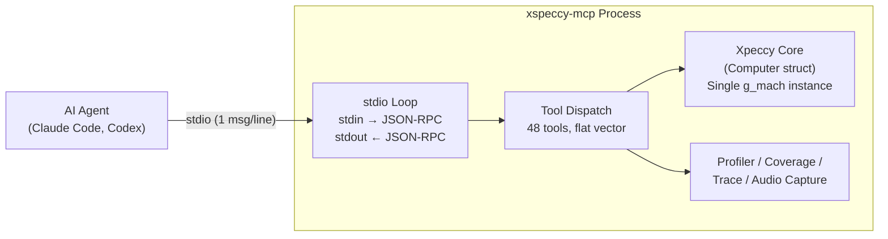
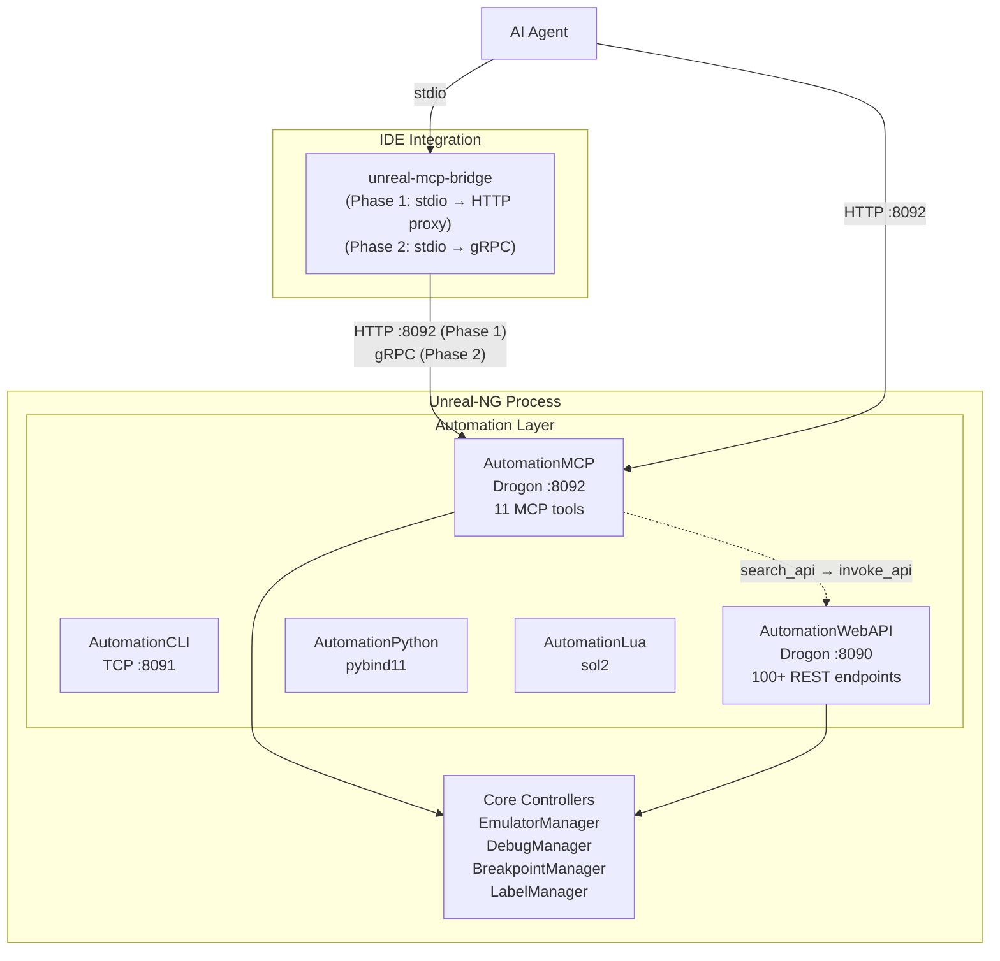
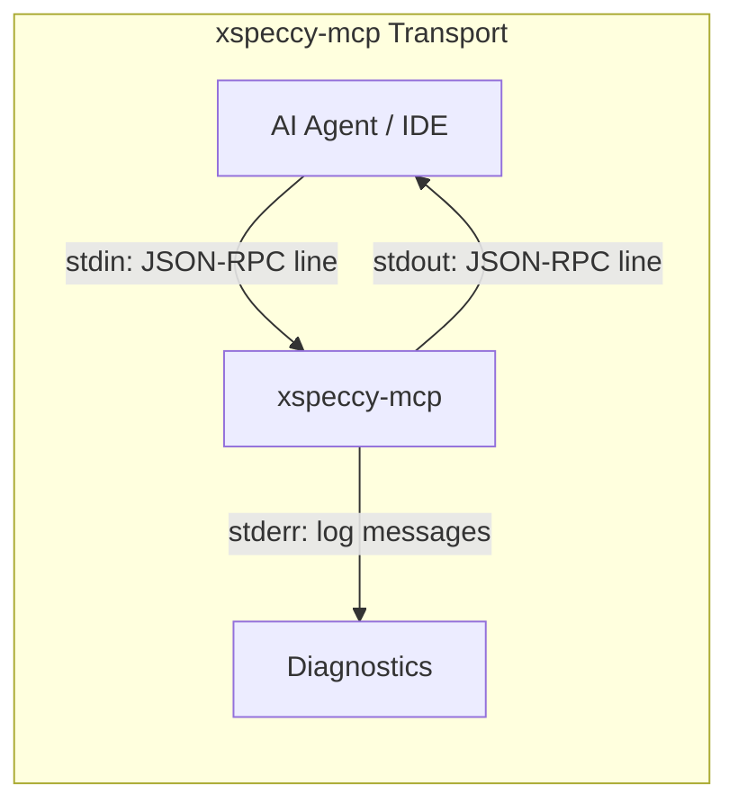
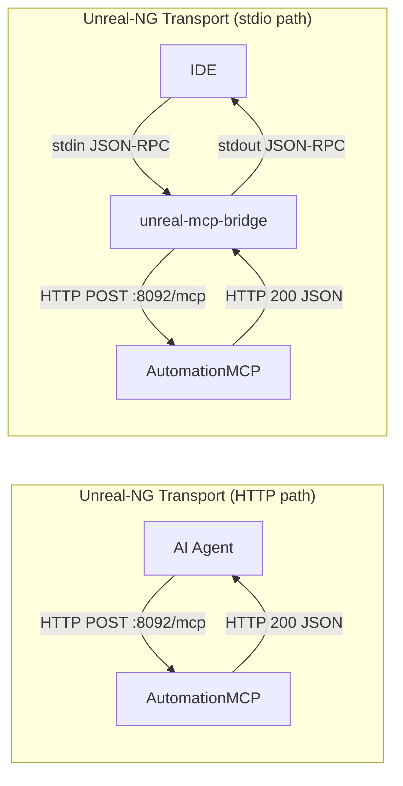
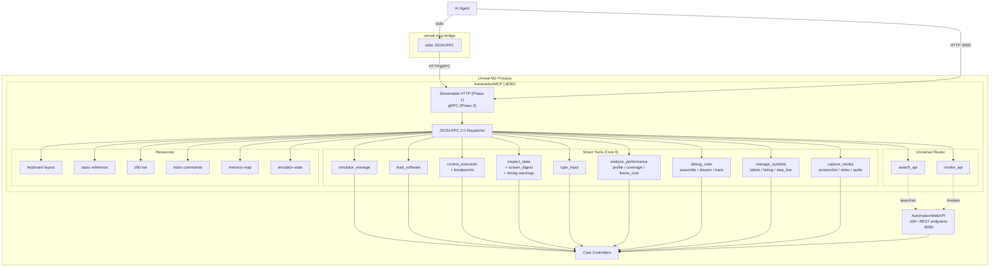

# MCP Server Deep Analysis: xspeccy-mcp vs. Unreal-NG Plans

> **Date**: 2026-08-17
> **Scope**: Forensic-level architectural comparison of the [xspeccy-mcp](https://github.com/xspeccy/xspeccy-mcp) reference implementation against the [Unreal-NG MCP Design](../2026-08-14-mcp-server-automation/design.md) and [Use Cases](../2026-08-14-mcp-server-automation/use-cases.md)

---

## 1. Architectural Overview

### 1.1 xspeccy-mcp: Headless Monolith (and Origin Controversy)

xspeccy-mcp is a **standalone executable** that wraps the Xpeccy emulator core (downloaded at build time from GitHub) into a headless, single-process, single-machine MCP server. There is no GUI. The server _is_ the emulator.

> [!NOTE]
> **Code Provenance & Unreal-NG Influence**
> A forensic `git log` analysis reveals that `xspeccy-mcp` (published August 2026) adopted its flagship AI features directly from Unreal-NG's earlier automation paradigms. For instance, Unreal-NG natively implemented its OCR state-polling framework (`screenocr.cpp`) in January 2026, and its sophisticated multi-format video/GIF recording architecture (`VideoRecordingWidget`) in July 2026. The author of `xspeccy-mcp` evidently studied the Unreal-NG documentation and replicated these exact workflows (such as `every_nth` recording and ROM-font matching) as a headless wrapper around the Xpeccy core. However, code analysis confirms the actual C++ implementations are independent (e.g., `xspeccy-mcp` uses a dynamic `CHARS` pointer lookup for OCR, whereas Unreal-NG uses a static matrix).



**Key files**:
| File | Lines | Role |
|:---|---:|:---|
| [xsp_mcp.cpp](https://github.com/xspeccy/xspeccy-mcp/blob/master/src/xsp_mcp.cpp) | 2260 | All 48 tools + JSON-RPC dispatch + `main()` |
| [xsp_machine.h](https://github.com/xspeccy/xspeccy-mcp/blob/master/src/xsp_machine.h) | 235 | `Machine` class: headless wrapper around `Computer*` |
| [xsp_audio.h](https://github.com/xspeccy/xspeccy-mcp/blob/master/src/xsp_audio.h) | 119 | Audio capture, AY state decode, WAV export |
| [xsp_video.h](https://github.com/xspeccy/xspeccy-mcp/blob/master/src/xsp_video.h) | 57 | Screenshot, screen OCR, screen digest, attribute grid |
| [xsp_labels.h](https://github.com/xspeccy/xspeccy-mcp/blob/master/src/xsp_labels.h) | — | sjasmplus symbol table parser (bank:offset) |
| [xsp_listing.h](https://github.com/xspeccy/xspeccy-mcp/blob/master/src/xsp_listing.h) | — | sjasmplus `.lst` listing parser |

### 1.2 Unreal-NG: Phased Architecture (Embedded → Bridge)

Unreal-NG's MCP implementation follows a **two-phase architecture**:

**Phase 1 (MVP)**: An embedded C++ automation module (`AutomationMCP`) sits alongside the existing four automation interfaces (CLI, WebAPI, Python, Lua) as a peer module with direct core access. A lightweight `unreal-mcp-bridge` proxies stdio to HTTP.

**Phase 2 (High-Performance)**: The `unreal-mcp-bridge` daemon upgrades from HTTP to a high-speed gRPC/Protobuf IPC transport, eliminating the double-serialization penalty for bulk data operations (see [MCP Bridge Architecture](mcp_bridge_architecture.md) for benchmarks).



**Key design artifacts**:
| File | Size | Content |
|:---|---:|:---|
| [design.md](../2026-08-14-mcp-server-automation/design.md) | 37 KB | Full technical design (1045 lines) |
| [use-cases.md](../2026-08-14-mcp-server-automation/use-cases.md) | 13 KB | 7 detailed forensic interaction flows + gap analysis |

---

## 2. Complete Tool Inventory

### 2.1 xspeccy-mcp: 48 Tools (Flat Hierarchy)

Every tool is a `struct Tool` in [xsp_mcp.cpp](https://github.com/xspeccy/xspeccy-mcp/blob/master/src/xsp_mcp.cpp#L244-L258), registered into a global `std::vector<Tool>` via `registerTools()`.

| # | Tool | Category | Description |
|:---:|:---|:---|:---|
| 1 | `machine_config` | Machine | Read/change model, RAM, romset, geometry |
| 2 | `list_models` | Machine | Enumerate available models, romsets, layouts |
| 3 | `machine_state` | Machine | Current config, CPU, page map, timing |
| 4 | `reset` | Machine | Reset with mode (48/128/dos/shadow) + boot frames |
| 5 | `run` | Execution | Run until breakpoint/PC/frames/budget |
| 6 | `run_frames` | Execution | Run exactly N timing-accurate frames |
| 7 | `step` | Execution | Execute N instructions, skip breakpoints |
| 8 | `step_over` | Execution | Execute one instruction, run CALLs to completion |
| 9 | `step_out` | Execution | Run until SP rises (subroutine return) |
| 10 | `get_registers` | CPU | All registers (main + shadow), flags, IM/IFF |
| 11 | `set_register` | CPU | Set one register by name |
| 12 | `read_memory` | Memory | Read bytes through CPU mapping (hex + decimal) |
| 13 | `write_memory` | Memory | Write bytes (array or hex string) |
| 14 | `find_bytes` | Memory | Pattern search across address space |
| 15 | `disassemble` | Code | Disassemble N instructions with label/listing annotation |
| 16 | `assemble` | Code | Assemble Z80 mnemonics, write to memory, forward refs |
| 17 | `set_breakpoint` | Breakpoints | Memory/exec breakpoints with bank-aware scoping |
| 18 | `clear_breakpoints` | Breakpoints | Remove all breakpoints |
| 19 | `set_port_breakpoint` | Breakpoints | I/O port read/write breakpoints |
| 20 | `screenshot` | Vision | PNG capture with border/scale options |
| 21 | `record_video` | Vision | GIF/MP4/WebM recording with audio, `skip_until`, `every_nth:"auto"` |
| 22 | `screen_text` | Vision | 32×24 ROM-font OCR decode |
| 23 | `screen_attrs` | Vision | Attribute grid (ink/paper/bright/flash) |
| 24 | `screen_digest` | Vision | MD5-based screen hash per frame (bank-aware, scope-selectable) |
| 25 | `load_labels` | Symbols | Load sjasmplus symbol table (bank:offset) |
| 26 | `resolve_symbol` | Symbols | Name→address or address→name lookup |
| 27 | `load_listing` | Symbols | Load sjasmplus `.lst` for source-level debugging |
| 28 | `source_at` | Symbols | Source line at address with context |
| 29 | `step_line` | Symbols | Step to next source line |
| 30 | `run_to_line` | Symbols | Run to a specific listing line number |
| 31 | `coverage` | Analysis | Code coverage: start/stop/read with gap analysis |
| 32 | `beam_position` | Raster | ULA beam position (dot, line, zone, T-states) |
| 33 | `frame_timing` | Raster | Complete frame geometry/timing budget |
| 34 | `frame_cost` | Raster | Per-effect-frame T-state profiling (work vs. idle) |
| 35 | `profile` | Analysis | Instruction/T-state profiler with named ranges, self vs inclusive time |
| 36 | `trace` | Analysis | Ring buffer of executed PCs (backtrace) |
| 37 | `ay_state` | Sound | AY-3-8910 register decode (per-channel frequency/volume/mixer) |
| 38 | `sound_state` | Sound | All sound sources (beeper, AY×2, GS, SAA1099, tape, mixed output) |
| 39 | `audio_capture` | Sound | Record mixed audio with RMS/peak/dominant-Hz + AY write log |
| 40 | `ay_writes` | Sound | Paginate through captured AY register writes |
| 41 | `press_key` | Input | Hold/release a single key for N frames |
| 42 | `type_text` | Input | Type a string key-by-key with auto-shift |
| 43 | `release_keys` | Input | Release all stuck keys |
| 44 | `load_file` | Files | Load by extension (.sna/.z80/.tap/.tzx/.trd/.scl/.bin) |
| 45 | `tape` | Files | Tape deck: play/stop/rewind/eject/block listing |
| 46 | `disk` | Files | Floppy: insert/eject/save, drive state |
| 47 | `disk_catalog` | Files | TR-DOS catalog listing |
| 48 | `save_snapshot` | Files | Save .sna snapshot |

### 2.2 Unreal-NG: 7 Tools (Hybrid 80/20)

| # | Tool | Type | Aggregate Coverage |
|:---:|:---|:---|:---|
| 1 | `emulator_manage` | Core 5 | create/list/start/stop/pause/resume/reset/remove |
| 2 | `load_software` | Core 5 | Auto-detect + load .sna/.z80/.trd/.scl/.tap/.tzx |
| 3 | `control_execution` | Core 5 | pause/resume/step/step_over/step_n/run_frame/run_frames/run_to_interrupt |
| 4 | `inspect_state` | Core 5 | registers + memory + disasm + screen_ocr + screen_image + audio + breakpoints + memory_banks + stack (multi-aspect in one call) |
| 5 | `type_input` | Core 5 | type/tap/press/release/combo/macro/release_all |
| 6 | `search_api` | Router | Semantic search over the full OpenAPI spec |
| 7 | `invoke_api` | Router | Execute any raw WebAPI endpoint with auto-ID injection |

### 2.3 Complete xspeccy-mcp → Unreal-NG WebAPI Mapping

This table maps every xspeccy-mcp tool to its corresponding Unreal-NG WebAPI endpoint(s), the proposed MCP routing tier (Smart Tool = permanently in LLM context, Router = discoverable via `search_api`/`invoke_api`), and notes coverage gaps.

> [!IMPORTANT]
> Unreal-NG **already has WebAPI endpoints** covering the vast majority of xspeccy-mcp's functionality. The question is not "can we do this?" but "do we expose it as a first-class Smart Tool or behind the Router?"

#### Machine & Lifecycle

| # | xspeccy-mcp Tool | Description | Unreal-NG WebAPI Endpoint(s) | MCP Tier | Notes |
|:---:|:---|:---|:---|:---:|:---|
| 1 | `machine_config` | Read/change model, RAM, romset, geometry | `GET /emulator/{id}`, `POST /emulator/create` | **Smart** | Aggregated into `emulator_manage`. Unreal-NG has richer model config via `settings`. |
| 2 | `list_models` | Enumerate models, romsets, layouts | `GET /emulator/models` | **Smart** | Part of `emulator_manage action:"list_models"`. |
| 3 | `machine_state` | Current config, CPU, page map, timing | `GET /emulator/{id}`, `GET /state/memory` | **Smart** | Aggregated into `inspect_state aspects:["machine"]`. |
| 4 | `reset` | Reset with mode (48/128/dos/shadow) | `POST /emulator/{id}/reset` | **Smart** | Part of `emulator_manage action:"reset"`. |

#### Execution Control

| # | xspeccy-mcp Tool | Description | Unreal-NG WebAPI Endpoint(s) | MCP Tier | Notes |
|:---:|:---|:---|:---|:---:|:---|
| 5 | `run` | Run until breakpoint/PC/frames/budget | `POST /emulator/{id}/run_frames`, breakpoint system | **Smart** | `control_execution action:"run"`. |
| 6 | `run_frames` | Run N timing-accurate frames | `POST /emulator/{id}/run_frames` | **Smart** | `control_execution action:"run_frames"`. |
| 7 | `step` | Execute N instructions, skip breakpoints | `POST /emulator/{id}/step`, `POST /steps` | **Smart** | `control_execution action:"step"`. |
| 8 | `step_over` | Execute one instruction, run CALLs to completion | `POST /emulator/{id}/stepover` | **Smart** | `control_execution action:"step_over"`. |
| 9 | `step_out` | Run until SP rises (subroutine return) | ❌ **No direct endpoint** | **Smart** | **GAP.** Must be implemented in MCP module or added to WebAPI. xspeccy-mcp's SP-tracking approach is the reference. |

#### CPU & Memory

| # | xspeccy-mcp Tool | Description | Unreal-NG WebAPI Endpoint(s) | MCP Tier | Notes |
|:---:|:---|:---|:---|:---:|:---|
| 10 | `get_registers` | All CPU registers, flags, IM/IFF | `GET /emulator/{id}/registers` | **Smart** | Part of `inspect_state aspects:["registers"]`. |
| 11 | `set_register` | Set one register by name | `PUT /emulator/{id}/memory/{addr}` (indirect) | Router | **GAP.** No dedicated register-write endpoint. Needs new WebAPI or direct core call. |
| 12 | `read_memory` | Read bytes through CPU mapping | `GET /emulator/{id}/memory/{addr}` | **Smart** | Part of `inspect_state aspects:["memory"]`. |
| 13 | `write_memory` | Write bytes (array or hex string) | `PUT /emulator/{id}/memory/{addr}`, `POST /memory/write` | Router | Via `invoke_api`. Also `PUT /memory/page/{type}/{page}` for bank-specific. |
| 14 | `find_bytes` | Pattern search across address space | ❌ **No direct endpoint** | Router | **GAP.** Useful for packer analysis. Could search via `read_memory` in a loop but very slow. |

#### Code & Disassembly

| # | xspeccy-mcp Tool | Description | Unreal-NG WebAPI Endpoint(s) | MCP Tier | Notes |
|:---:|:---|:---|:---|:---:|:---|
| 15 | `disassemble` | Disassemble N instructions, label/listing annotations, T-states | `GET /emulator/{id}/disasm` | **Smart** | Part of `inspect_state aspects:["disasm"]` or proposed `debug_code action:"disassemble"`. Unreal-NG's disasm endpoint already exists. |
| 16 | `assemble` | Assemble Z80 mnemonics, write to memory | ❌ **No endpoint** | **Smart** | **GAP.** xspeccy-mcp's built-in assembler is very valuable. Proposed as part of `debug_code action:"assemble"`. |

#### Breakpoints

| # | xspeccy-mcp Tool | Description | Unreal-NG WebAPI Endpoint(s) | MCP Tier | Notes |
|:---:|:---|:---|:---|:---:|:---|
| 17 | `set_breakpoint` | Memory/exec breakpoints with bank-aware scoping | `POST /emulator/{id}/breakpoints` | Router | Unreal-NG has richer breakpoint management (enable/disable/remove individual). |
| 18 | `clear_breakpoints` | Remove all breakpoints | `DELETE /emulator/{id}/breakpoints` | Router | Direct mapping. |
| 19 | `set_port_breakpoint` | I/O port read/write breakpoints | `POST /emulator/{id}/breakpoints` (type: port) | Router | Supported via the same breakpoint API with port type. |

#### Vision & Media

| # | xspeccy-mcp Tool | Description | Unreal-NG WebAPI Endpoint(s) | MCP Tier | Notes |
|:---:|:---|:---|:---|:---:|:---|
| 20 | `screenshot` | PNG capture with border/scale | `GET /emulator/{id}/capture/screen` | **Smart** | Proposed as `capture_media action:"screenshot"`. |
| 21 | `record_video` | GIF/MP4/WebM recording, audio, `skip_until`, `every_nth:"auto"` | ❌ **No endpoint** | **Smart** | **GAP.** No video recording in WebAPI. xspeccy-mcp's `every_nth:"auto"` (measures effect quantum) is brilliant. |
| 22 | `screen_text` | 32×24 ROM-font OCR decode | `GET /emulator/{id}/capture/ocr` | **Smart** | Part of `inspect_state aspects:["screen_ocr"]`. |
| 23 | `screen_attrs` | Attribute grid (ink/paper/bright/flash) | `GET /emulator/{id}/state/screen` | Router | Attribute data accessible via screen state endpoint. |
| 24 | `screen_digest` | MD5-based screen hash per frame (bank-aware) | ❌ **No endpoint** | **Smart** | **GAP.** Must be implemented. Proposed as `inspect_state aspects:["screen_digest"]`. |

#### Symbols & Source-Level Debugging

| # | xspeccy-mcp Tool | Description | Unreal-NG WebAPI Endpoint(s) | MCP Tier | Notes |
|:---:|:---|:---|:---|:---:|:---|
| 25 | `load_labels` | Load sjasmplus symbol table (bank:offset) | ⚠️ **Core exists, no WebAPI** | **Smart** | Core `LabelManager` (since 2020) parses `.map`/`.sym`/VICE/sjasm/z88dk. Needs WebAPI endpoint. Proposed as `manage_symbols action:"load_labels"`. |
| 26 | `resolve_symbol` | Name→address or address→name lookup | ⚠️ **Core exists, no WebAPI** | **Smart** | `LabelManager::GetLabelByName()` / `GetLabelByZ80Address()` exist. Needs WebAPI endpoint. |
| 27 | `load_listing` | Load sjasmplus `.lst` file | ❌ **No endpoint** | **Smart** | **GAP.** No listing parser in core. Part of proposed `manage_symbols action:"load_listing"`. |
| 28 | `source_at` | Source line at address with context | ❌ **No endpoint** | **Smart** | **GAP.** Depends on listing parser. Part of proposed `manage_symbols action:"source_at"`. |
| 29 | `step_line` | Step to next source line | ❌ **No endpoint** | **Smart** | **GAP.** Depends on listing parser. Part of proposed `manage_symbols action:"step_line"`. |
| 30 | `run_to_line` | Run to a specific listing line | ❌ **No endpoint** | **Smart** | **GAP.** Depends on listing parser. Part of proposed `manage_symbols action:"run_to_line"`. |

#### Analysis & Profiling

| # | xspeccy-mcp Tool | Description | Unreal-NG WebAPI Endpoint(s) | MCP Tier | Notes |
|:---:|:---|:---|:---|:---:|:---|
| 31 | `coverage` | Code coverage: start/stop/read with gap analysis | ❌ **No endpoint** (Analyzers exist but no coverage analyzer) | **Smart** | **GAP.** Proposed as `analyze_performance action:"coverage"`. Analyzer framework could host it. |
| 32 | `beam_position` | ULA beam position (dot, line, zone, T-states) | ❌ **No endpoint** (planned in use-cases.md as `GET /video/beam`) | Router | Listed in gap analysis. Core has the data (`tacts_*`), just needs exposure. |
| 33 | `frame_timing` | Complete frame geometry/timing budget | `GET /emulator/{id}` (partial — model/timing fields) | Router | Partial data in emulator info. Full geometry breakdown is a gap. |
| 34 | `frame_cost` | Per-effect-frame T-state profiling (work vs. idle) | ❌ **No endpoint** | **Smart** | **GAP.** Proposed as `analyze_performance action:"frame_cost"`. xspeccy-mcp's work-vs-idle separation is the reference. |
| 35 | `profile` | Instruction/T-state profiler, named ranges, self vs inclusive | `POST /profiler/opcode/start`, `GET /profiler/opcode/counters` + calltrace profiler endpoints | **Smart** | Unreal-NG has 3 profiler subsystems (opcode, memory, calltrace) with 18+ endpoints. Proposed as `analyze_performance action:"profile"` aggregating them. |
| 36 | `trace` | Ring buffer of executed PCs (backtrace) | `GET /emulator/{id}/calltrace`, calltrace profiler | **Smart** | Partial: calltrace profiler captures call/return pairs. Pure PC ring-buffer may need extension. |

#### Sound

| # | xspeccy-mcp Tool | Description | Unreal-NG WebAPI Endpoint(s) | MCP Tier | Notes |
|:---:|:---|:---|:---|:---:|:---|
| 37 | `ay_state` | AY-3-8910 register decode per channel | `GET /state/audio/ay/{chip}`, `GET /state/audio/ay/{chip}/register/{reg}` | Router | Full coverage. 7 audio endpoints per emulator. |
| 38 | `sound_state` | All sound sources (beeper, AY×2, GS, tape, mixed) | `GET /state/audio/channels`, `GET /state/audio/beeper`, `GET /state/audio/gs`, `GET /state/audio/covox` | Router | Excellent coverage. Unreal-NG also has Covox which Xpeccy lacks. |
| 39 | `audio_capture` | Record mixed audio + RMS/peak/Hz + AY write log | ❌ **No endpoint** | **Smart** | **GAP.** Proposed as `capture_media action:"audio_capture"`. Core has audio infrastructure but no capture-to-WAV-with-analysis. |
| 40 | `ay_writes` | Paginate through captured AY register writes | ❌ **No endpoint** | Router | **GAP.** Dependent on audio_capture. The AY write log with PC attribution is unique to xspeccy-mcp. |

#### Input

| # | xspeccy-mcp Tool | Description | Unreal-NG WebAPI Endpoint(s) | MCP Tier | Notes |
|:---:|:---|:---|:---|:---:|:---|
| 41 | `press_key` | Hold/release a single key for N frames | `POST /keyboard/tap`, `POST /keyboard/press`, `POST /keyboard/release` | **Smart** | Part of `type_input action:"tap"`. Unreal-NG has richer key input via `DebugKeyboardManager`. |
| 42 | `type_text` | Type string key-by-key with auto-shift | `POST /keyboard/type` | **Smart** | Part of `type_input action:"type"`. Direct mapping. |
| 43 | `release_keys` | Release all stuck keys | `POST /keyboard/release_all` | **Smart** | Part of `type_input action:"release_all"`. Direct mapping. |

#### Files & Storage

| # | xspeccy-mcp Tool | Description | Unreal-NG WebAPI Endpoint(s) | MCP Tier | Notes |
|:---:|:---|:---|:---|:---:|:---|
| 44 | `load_file` | Load by extension (.sna/.z80/.tap/.tzx/.trd/.scl/.bin) | `POST /snapshot/load`, `POST /tape/load`, `POST /disk/{drive}/insert` | **Smart** | Part of `load_software`. Unreal-NG has separate endpoints per type; MCP aggregates them with auto-detection. |
| 45 | `tape` | Tape deck: play/stop/rewind/eject/blocks | `POST /tape/play`, `/stop`, `/rewind`, `/eject`, `GET /tape/info` | Router | 6 dedicated tape endpoints in WebAPI. |
| 46 | `disk` | Floppy: insert/eject/save, state | `POST /disk/{drive}/insert`, `/eject`, `/create`, `GET /disk/{drive}/info` | Router | Rich disk API. Also has sector/track-level raw access, disk image export, and sysinfo — more than xspeccy-mcp. |
| 47 | `disk_catalog` | TR-DOS catalog listing | `GET /disk/{drive}/catalog` | Router | Direct mapping. |
| 48 | `save_snapshot` | Save .sna snapshot | `POST /snapshot/save` | Router | Direct mapping. |

#### Coverage Summary

| Category | Total xspeccy-mcp Tools | ✅ Direct WebAPI Match | ⚠️ Partial | ❌ Gap |
|:---|:---:|:---:|:---:|:---:|
| Machine & Lifecycle | 4 | 4 | 0 | 0 |
| Execution Control | 5 | 4 | 0 | 1 (`step_out`) |
| CPU & Memory | 5 | 3 | 0 | 2 (`set_register`, `find_bytes`) |
| Code & Disassembly | 2 | 1 | 0 | 1 (`assemble`) |
| Breakpoints | 3 | 3 | 0 | 0 |
| Vision & Media | 5 | 2 | 0 | 3 (`record_video`, `screen_digest`, `screen_attrs` partial) |
| Symbols & Source | 6 | 0 | 2 | 4 (Core `LabelManager` exists for labels/resolve; listing parser is true gap) |
| Analysis & Profiling | 6 | 0 | 3 | 3 (`coverage`, `frame_cost`, `beam_position`) |
| Sound | 4 | 2 | 0 | 2 (`audio_capture`, `ay_writes`) |
| Input | 3 | 3 | 0 | 0 |
| Files & Storage | 5 | 5 | 0 | 0 |
| **TOTAL** | **48** | **27** | **5** | **16** |

> [!WARNING]
> **16 of 48 tools (33%) have no direct WebAPI equivalent.** The biggest true gap cluster is **Source-Level Debugging** (4 tools: listing parser, source_at, step_line, run_to_line). Note: the core `LabelManager` (since 2020) already handles label loading and resolution — these only need WebAPI exposure, not new core code.

### 2.4 Deep Dive Capability Analysis

The functionality of the tools has been logically grouped into eleven specific capability domains to ensure comprehensive coverage of all 48 tools. Each domain has been analyzed in deep detail, contrasting xspeccy-mcp's offerings against Unreal-NG's current state, ranking its usefulness for developers/reverse engineers, and detailing a concrete plan for superiority.

Please review the detailed Markdown files in the `capabilities/` directory:

1. [Machine & Lifecycle](capabilities/01-machine-and-lifecycle.md) — (Rank: **10/10**)
2. [Execution Control](capabilities/02-execution-control.md) — (Rank: **10/10**)
3. [CPU & Memory](capabilities/03-cpu-and-memory.md) — (Rank: **9/10**)
4. [Code & Disassembly](capabilities/04-code-and-disassembly.md) — (Rank: **8/10**)
5. [Breakpoints](capabilities/05-breakpoints.md) — (Rank: **9/10**)
6. [Vision & Media](capabilities/06-vision-and-media.md) — (Rank: **8/10**)
7. [Symbols & Source-Level Debugging](capabilities/07-symbols-and-source-level.md) — (Rank: **9/10**)
8. [Analysis & Profiling](capabilities/08-analysis-and-profiling.md) — (Rank: **8/10**)
9. [Sound](capabilities/09-sound.md) — (Rank: **7/10**)
10. [Input](capabilities/10-input.md) — (Rank: **8/10**)
11. [Files & Storage](capabilities/11-files-and-storage.md) — (Rank: **9/10**)

---

## 3. Architecture Comparison Matrix

| Dimension | xspeccy-mcp | Unreal-NG MCP Plans |
|:---|:---|:---|
| **Process Model** | Standalone headless executable. The server _is_ the emulator. No GUI at all. | Embedded module inside the full emulator. Coexists with Qt Desktop UI. |
| **Emulator Core** | Xpeccy `0.6.20260804` (downloaded at build time). External C library linked in as `xpeccy_core`. | Unreal-NG native C++ core with `EmulatorManager`, `DebugManager`, etc. |
| **Instance Model** | Single global `static Machine g_mach`. One machine per process. | Multi-instance via `EmulatorManager::GetEmulator(id)`. `target="auto"` resolves intelligently. |
| **Thread Model** | Single-threaded. `main()` reads stdin in a blocking loop. All tool calls are synchronous and blocking. | Dedicated MCP worker thread with task queue + condition variable (mirrors `AutomationLua` pattern). |
| **Transport** | `stdio` only (JSON-RPC 2.0, one message per line). No HTTP, no WebSocket. | Primary: Streamable HTTP on `:8092` via Drogon. Secondary: `stdio` via `unreal-mcp-bridge` proxy. |
| **Tool Count** | 48 flat tools, all injected into LLM context. | 7 tools (5 smart + 2 router). 100+ endpoints discoverable dynamically. |
| **Tool Granularity** | Fine-grained: one tool per operation (`step`, `step_over`, `step_out`, `step_line` = 4 separate tools). | Coarse-grained: `control_execution` aggregates step/pause/resume/run_frame via `action` enum. |
| **API Discovery** | None. Static tool set only. | `search_api` searches the full OpenAPI spec semantically; `invoke_api` executes any discovered endpoint. |
| **Error Handling** | Exceptions caught per-tool → `isError: true` with detailed error string. Strict argument validation with human-readable refusals. | Classified error system (No Emulator, Stopped, Invalid File, State Conflict). Idempotent state conflicts. Auto-recovery (auto-start stopped emulators). |
| **Assembler** | Built-in Z80 assembler with forward references and label definitions. `assemble` tool writes machine code to memory. | Not exposed in MCP tools. Would require `invoke_api` to reach an assembler endpoint if one exists. |
| **Symbol Table** | `load_labels` + `load_listing` integrate sjasmplus symbols and source-level debugging. Labels work everywhere (addresses, breakpoints, assembler operands). | Not exposed in MCP tools directly. MCP Resources include static docs (keyboard, BASIC, memory map) but no symbol table integration. |
| **Profiling** | Rich built-in: `profile` (instruction/T-state, named ranges, self vs inclusive time, per-frame budget), `coverage` (gap analysis), `trace` (ring buffer), `frame_cost` (work vs idle). | Delegated to `invoke_api` via Analyzer endpoints. Profiling is in the core (AnalyzerManager) but not surfaced as smart tools. |
| **Audio Inspection** | Deep: `ay_state` (per-channel decode), `sound_state` (all chips), `audio_capture` (RMS/peak/Hz/WAV + AY write log with PC attribution), `ay_writes` (paginated register dump). | Delegated to `invoke_api`. Use case doc specifies `audio/ay/state` and `audio/pcm` endpoints with DSP helpers. |
| **Visual Inspection** | `screenshot` (PNG), `record_video` (GIF/MP4/WebM with audio and `every_nth:"auto"`), `screen_text` (ROM-font OCR), `screen_attrs` (attribute grid), `screen_digest` (MD5 hash per frame). | `inspect_state` with `screen_ocr` / `screen_image` aspects. Video recording delegated to `invoke_api`. |
| **Raster Timing** | `beam_position` (dot, line, zone, blanking, T-state), `frame_timing` (full geometry budget with geometry-vs-model warning). | ULA beam tracking via `invoke_api` → `GET /video/beam`. Not in smart tools. |
| **Build System** | Python `build.py` downloads Xpeccy, runs CMake, builds single executable. 99 smoke tests via `tests/smoke.sh`. | `ENABLE_MCP_AUTOMATION` CMake option. Conditional compilation following existing `ENABLE_*_AUTOMATION` pattern. |
| **IDE Config** | `.mcp.json` at repo root: `{"mcpServers": {"xspeccy": {"command": "./build/xspeccy-mcp"}}}` | `unreal-mcp-bridge` spawned by IDE, or direct HTTP `{"url": "http://localhost:8092/mcp"}`. |
| **MCP Resources** | None. No `resources/list` or `resources/read`. | 6 static resources: keyboard layout, BASIC reference, Z80 ISA, TR-DOS commands, memory map, dynamic emulator state. |
| **Dependencies** | `nlohmann/json` (header-only, vendored), zlib, Xpeccy core. No web framework. | Drogon (shared with WebAPI), jsoncpp (via Drogon), unrealng::core. |

---

## 4. Transport Architecture Comparison





| Aspect | xspeccy-mcp | Unreal-NG |
|:---|:---|:---|
| **Primary Transport** | stdio (mandatory) | HTTP on `:8092` |
| **Secondary Transport** | None | stdio via bridge proxy |
| **Concurrent Clients** | Impossible (single stdin reader) | Yes (HTTP naturally multiplexes) |
| **Latency** | Minimal (in-process function call) | HTTP overhead (~1ms localhost roundtrip) |
| **GUI Compatibility** | Not applicable (headless) | Clean separation: MCP on `:8092`, WebAPI on `:8090`, Qt UI on main thread |
| **Process Lifecycle** | IDE spawns the server, server dies when IDE disconnects | Emulator runs independently; server is a module. IDE connects/disconnects freely |
| **Cross-machine** | Not possible without wrapping in SSH/socat | Natural: HTTP is network-transparent |

---

## 5. Response Format Comparison

### xspeccy-mcp: Flat JSON Dump

Every tool returns a `json` object. The dispatch layer wraps it into `okResult()`:

```json
{
  "content": [{"type": "text", "text": "{\n\t\"registers\": {\"PC\": 32768, ...}\n}"}],
  "isError": false
}
```

The entire response payload is serialized into a single `text` content block via `json.dump(1, '\t')`. The agent must parse the stringified JSON to extract structured data. This works because the LLM can read JSON, but wastes tokens on formatting characters.

### Unreal-NG: Dual Content (Text + Structured)

```json
{
  "resultType": "complete",
  "isError": false,
  "content": [{"type": "text", "text": "3 registers at $8000: A=0x00 BC=0x1234 ..."}],
  "structuredContent": {"registers": {"A": 0, "BC": 4660, ...}, "disasm": [...]}
}
```

> [!TIP]
> Unreal-NG's dual-content approach gives the LLM a human-readable summary it can directly include in its reasoning, while the structured data enables precise tool-chaining without JSON parsing. This is architecturally superior.

---

## 6. Detailed Pros & Cons

### 6.1 xspeccy-mcp

#### Strengths

| # | Strength | Evidence |
|:---|:---|:---|
| **S1** | **Production-proven with a real demoscene project.** The [CPU, DOCKS, U.](https://github.com/alffcpu/cpu-docks-u-zx-demo) ZX Spectrum demo was fully debugged and built through this tool. 99 smoke tests pass on Linux and Windows. | README.md, build.py `--smoke` |
| **S2** | **Deep profiling instrumentation.** The `profile` tool provides self vs. inclusive time, per-call cost, named ranges, symbol-table-driven auto-splitting, hot-page histograms, and explicit warnings when the profiler was never started or start failed. This is debugger-quality telemetry. | [xsp_mcp.cpp:1485-1697](https://github.com/xspeccy/xspeccy-mcp/blob/master/src/xsp_mcp.cpp#L1485-L1697) |
| **S3** | **Built-in Z80 assembler.** `assemble` writes machine code to memory with forward references and label definitions. No external tool needed to patch code. | [xsp_mcp.cpp:708-758](https://github.com/xspeccy/xspeccy-mcp/blob/master/src/xsp_mcp.cpp#L708-L758) |
| **S4** | **Source-level debugging.** `load_listing` + `step_line` + `source_at` + `run_to_line` let the agent debug in terms of assembler source lines, not raw addresses. Labels resolve everywhere: breakpoints, addresses, assembler operands, disassembly annotations. | [xsp_mcp.cpp:1137-1260](https://github.com/xspeccy/xspeccy-mcp/blob/master/src/xsp_mcp.cpp#L1137-L1260) |
| **S5** | **Screen digest with bank awareness.** `screen_digest` hashes screen memory per RAM bank, handles double-buffering (banks 5+7), supports custom memory ranges, and produces an MD5 prefix compatible with ZX project reference scripts. | [xsp_mcp.cpp:1041-1133](https://github.com/xspeccy/xspeccy-mcp/blob/master/src/xsp_mcp.cpp#L1041-L1133) |
| **S6** | **Comprehensive audio analysis.** `audio_capture` provides RMS, peak, dominant frequency (zero-crossing estimate), per-source breakdown (beeper/AY/GS), beeper toggle count, and AY register write log with PC attribution and T-state timestamps. | [xsp_mcp.cpp:1809-1871](https://github.com/xspeccy/xspeccy-mcp/blob/master/src/xsp_mcp.cpp#L1809-L1871) |
| **S7** | **Strict argument validation.** Out-of-range values are refused with human-readable errors, not silently clamped. Unknown labels produce diagnostics showing how many labels are loaded and from where. This prevents the costly "silent misfire" failure mode. | [xsp_mcp.cpp:66-76](https://github.com/xspeccy/xspeccy-mcp/blob/master/src/xsp_mcp.cpp#L66-L76), [xsp_mcp.cpp:81-98](https://github.com/xspeccy/xspeccy-mcp/blob/master/src/xsp_mcp.cpp#L81-L98) |
| **S8** | **Video recording with automatic frame-rate detection.** `record_video` with `every_nth:"auto"` measures the effect's own update quantum so multi-frame effects don't produce duplicate frames. GIF output needs no external tools; MP4/WebM uses ffmpeg. | [xsp_mcp.cpp:858-1027](https://github.com/xspeccy/xspeccy-mcp/blob/master/src/xsp_mcp.cpp#L858-L1027) |
| **S9** | **Raster-timing tools with geometry warnings.** `beam_position` and `frame_timing` report when the configured geometry doesn't match the selected model's canonical raster (e.g., 71680 T vs 69888 T), preventing subtle 2.5% timing errors. | [xsp_mcp.cpp:297-316](https://github.com/xspeccy/xspeccy-mcp/blob/master/src/xsp_mcp.cpp#L297-L316) |
| **S10** | **Zero external runtime dependencies.** Builds a single statically-linked executable (on MinGW). No Python, no Node, no web framework. Just the binary. | [CMakeLists.txt:18-26](https://github.com/xspeccy/xspeccy-mcp/blob/master/CMakeLists.txt#L18-L26) |

#### Weaknesses

| # | Weakness | Impact |
|:---|:---|:---|
| **W1** | **48 tools saturate the LLM context window.** Every tool schema is sent in `tools/list`. At ~150 tokens per schema, that's ~7,200 tokens of static context before any conversation begins. This directly degrades tool-selection accuracy on smaller models. | High |
| **W2** | **Single instance, single process.** Cannot compare two machines, cannot run a test matrix, cannot survive a crash without the IDE restarting. Global state (`g_mach`, `g_shotCounter`, etc.) prevents any form of concurrency. | Medium |
| **W3** | **No API discovery.** If the emulator gains a new capability, a new tool must be hardcoded in `xsp_mcp.cpp`, the server rebuilt, and all tool schemas re-injected. No dynamic extension. | Medium |
| **W4** | **stdio-only transport.** No remote access, no concurrent clients, no browser-based agents. The IDE must spawn the process and pipe stdin/stdout. | Medium |
| **W5** | **Monolithic source.** All 48 tools + dispatch + main loop live in a single 2,260-line file (`xsp_mcp.cpp`). Adding tools requires modifying this file. | Low (but maintenance cost grows) |
| **W6** | **No MCP Resources.** No `resources/list` or `resources/read` support. The agent cannot query reference data (keyboard layout, Z80 ISA, memory map) from the server. Must rely on pre-existing training data or external docs. | Low |
| **W7** | **Response format is stringified JSON.** The `okResult()` wrapper serializes the entire payload into a single text block. The LLM must re-parse to extract values, wasting tokens and risking misinterpretation. | Low |
| **W8** | **No Pause Guard.** Tools execute synchronously in the single thread. Since there's no GUI and no concurrent execution, this is safe — but the architecture doesn't support adding concurrent access later. | Low (for current design) |

---

### 6.2 Unreal-NG MCP Plans

#### Strengths

| # | Strength | Evidence |
|:---|:---|:---|
| **S1** | **Optimal context efficiency.** 7 tools vs 48. The "80/20" strategy keeps the static tool budget under ~1,050 tokens. This directly improves tool-selection accuracy. | design.md §5 |
| **S2** | **Universal Router provides 100% coverage.** `search_api` + `invoke_api` dynamically expose the full WebAPI (100+ endpoints) without polluting the static context. New REST endpoints are immediately available without MCP changes. | design.md §5 (tools 6-7) |
| **S3** | **Multi-instance architecture.** `resolveEmulator("auto")` intelligently selects or creates instances. Multiple machines can run simultaneously for A/B comparisons or test matrices. | design.md §6.1 |
| **S4** | **Dual transport.** HTTP (`:8092`) for remote/cloud agents + stdio bridge for local IDEs. HTTP naturally supports concurrent clients. | design.md §9 |
| **S5** | **Pause Guard pattern.** `withPauseGuard()` automatically pauses the emulator, executes the operation, and resumes — preventing race conditions with the Qt main loop. | design.md §6.2 |
| **S6** | **MCP Resources.** 6 static resources provide domain knowledge (keyboard layout, BASIC reference, Z80 ISA, TR-DOS commands, memory map) directly to the agent. | design.md §8 |
| **S7** | **Leverages existing mature WebAPI.** 100+ REST endpoints already exist, tested, and documented with OpenAPI. MCP is a thin proxy, not a rewrite. | design.md §2.2 |
| **S8** | **Dual-content responses.** Human-readable summary + machine-readable structured data in every response. | design.md §6.3 |
| **S9** | **Error recovery with auto-remediation.** Stopped emulators are auto-started. State conflicts are absorbed idempotently. Missing emulators trigger auto-creation. | design.md §10 |
| **S10** | **No new dependencies.** Uses Drogon (already in project), jsoncpp (already in project), and core managers (already in project). | design.md §14 |

#### Weaknesses

| # | Weakness | Impact |
|:---|:---|:---|
| **W1** | **Universal Router adds latency and cognitive cost.** For any operation outside the Core 5, the agent must: (1) call `search_api`, (2) parse the result to find the endpoint, (3) call `invoke_api` with the correct path/method/body. This is 3 tool calls where xspeccy-mcp uses 1. | High |
| **W2** | **No profiling, coverage, or trace in smart tools.** These are the bread and butter of ZX demoscene debugging. Delegating them to `invoke_api` means the agent must discover, learn, and correctly call raw REST endpoints for the most critical forensic operations. | High |
| **W3** | **No assembler tool.** xspeccy-mcp's `assemble` tool is remarkably useful for patching code in-place. Unreal-NG has no equivalent in the MCP design. | Medium |
| **W4** | **No symbol table / listing integration in MCP.** xspeccy-mcp's `load_labels` / `load_listing` / `step_line` / `source_at` / `run_to_line` form a complete source-level debugging workflow. Unreal-NG's MCP design has no equivalent. | Medium |
| **W5** | **No screen digest equivalent.** xspeccy-mcp's `screen_digest` with bank awareness and custom ranges is a highly efficient way to detect visual changes. Unreal-NG's `inspect_state` offers OCR or full screenshots but no cheap hash comparison. | Medium |
| **W6** | **No video recording in smart tools.** xspeccy-mcp's `record_video` with `every_nth:"auto"` and `skip_until` is a turnkey solution. Unreal-NG would require multiple `invoke_api` calls or a custom pipeline. | Low |
| **W7** | **Design is unimplemented.** All of this is a paper design. xspeccy-mcp is shipping, tested, and proven with a real project. | High (existential) |
| **W8** | **HTTP transport adds latency.** Even on localhost, HTTP POST → Drogon dispatch → thread queue → response adds ~1-5ms per call vs xspeccy-mcp's ~0.01ms in-process function call. For tight stepping loops (100s of steps), this accumulates. | Low |

---

## 7. Feature Gap Matrix

Features that exist in one system but not the other:

| Feature | xspeccy-mcp | Unreal-NG MCP | Gap Owner |
|:---|:---:|:---:|:---|
| Z80 assembler (write code as text) | ✅ `assemble` | ❌ | **Unreal-NG** |
| Source-level debugging (listing + step_line) | ✅ 4 tools | ❌ | **Unreal-NG** |
| Screen digest / hash comparison | ✅ `screen_digest` | ❌ | **Unreal-NG** |
| Code coverage with gap analysis | ✅ `coverage` | ❌ (via Router) | **Unreal-NG** |
| Instruction profiler with named ranges | ✅ `profile` | ❌ (via Router) | **Unreal-NG** |
| Execution trace ring buffer | ✅ `trace` | ❌ (via Router) | **Unreal-NG** |
| Frame cost (work vs idle T-states) | ✅ `frame_cost` | ❌ (via Router) | **Unreal-NG** |
| ULA beam position | ✅ `beam_position` | ❌ (via Router) | **Unreal-NG** |
| Audio capture with AY write log | ✅ `audio_capture` | ❌ (via Router) | **Unreal-NG** |
| Video recording (GIF/MP4) | ✅ `record_video` | ❌ (via Router) | **Unreal-NG** |
| Multi-instance emulation | ❌ | ✅ `target` param | **xspeccy-mcp** |
| API discovery (dynamic) | ❌ | ✅ `search_api` | **xspeccy-mcp** |
| MCP Resources (domain docs) | ❌ | ✅ 6 resources | **xspeccy-mcp** |
| HTTP transport | ❌ | ✅ `:8092` | **xspeccy-mcp** |
| Concurrent clients | ❌ | ✅ | **xspeccy-mcp** |
| Context-efficient tool set | ❌ (48 tools) | ✅ (7 tools) | **xspeccy-mcp** |
| Pause guard / thread safety | ❌ (N/A) | ✅ | **xspeccy-mcp** |
| Auto-resolution (target="auto") | ❌ | ✅ | **xspeccy-mcp** |
| Dual-content responses | ❌ | ✅ | **xspeccy-mcp** |
| Bank-aware breakpoints | ✅ `set_breakpoint` scope:"cell" | ❌ (basic only) | **Unreal-NG** |
| Port I/O breakpoints | ✅ `set_port_breakpoint` | ❌ (via Router) | **Unreal-NG** |
| Disk catalog (TR-DOS) | ✅ `disk_catalog` | ❌ (via Router) | **Unreal-NG** |
| Tape deck control | ✅ `tape` | ❌ (via Router) | **Unreal-NG** |

---

## 8. Propositions: Making Unreal-NG's MCP the Best

> [!IMPORTANT]
> The core lesson from xspeccy-mcp is that **the 80/20 line is drawn in the wrong place** in the current Unreal-NG design. The current "Core 5" covers lifecycle + loading + execution + inspection + input — the basics. But the tools an AI agent uses most intensively when debugging ZX code are profiling, coverage, assembly, and symbol management. These should be promoted from the Router tier to the Smart Tool tier.

### Proposition 1: Expand to "Core 9 + Router 2" — The Forensic-Ready Set

Keep the hybrid architecture but promote the most-used forensic tools from the Router to first-class Smart Tools. The context cost rises from ~1,050 tokens to ~1,650 tokens — still 4.4× less than xspeccy-mcp's 7,200.

| # | Tool | Stolen From | Justification |
|:---:|:---|:---|:---|
| 1 | `emulator_manage` | (existing) | Lifecycle |
| 2 | `load_software` | (existing) | Loading |
| 3 | `control_execution` | (existing) | Execution |
| 4 | `inspect_state` | (existing) | Multi-aspect inspection |
| 5 | `type_input` | (existing) | Keyboard |
| **6** | **`analyze_performance`** | xspeccy-mcp `profile` + `frame_cost` + `coverage` | **Aggregate profiling/coverage/frame-cost into one tool with `action` enum. Provides self/inclusive time, named ranges, gap analysis, work-vs-idle budgeting.** |
| **7** | **`debug_code`** | xspeccy-mcp `assemble` + `disassemble` + `trace` | **Aggregate assembler, disassembler, and trace buffer into one tool. `action`: assemble, disassemble, trace_enable, trace_dump.** |
| **8** | **`manage_symbols`** | xspeccy-mcp `load_labels` + `load_listing` + `resolve_symbol` + `step_line` | **Aggregate symbol table and source-level debugging. `action`: load_labels, load_listing, resolve, step_line, source_at.** |
| **9** | **`capture_media`** | xspeccy-mcp `screenshot` + `record_video` + `screen_digest` + `audio_capture` | **Aggregate all media capture. `action`: screenshot, record_video, screen_digest, audio_capture. Returns hashes for comparison, not raw media.** |
| 10 | `search_api` | (existing) | Universal Router |
| 11 | `invoke_api` | (existing) | Universal Router |

### Proposition 2: Steal the Argument Resolution System

xspeccy-mcp's `argAddr()` function is brilliant: every address argument accepts decimal, `$hex`, `0xhex`, `#hex`, or a label name. This means:
```json
{"address": "main_loop"}
{"address": "$600E"}
{"address": 24590}
```
...all work identically in every tool.

**Adopt this in Unreal-NG.** Every MCP tool that takes an address should resolve through a `resolveAddress()` utility that checks the symbol table. This is zero-cost and dramatically improves agent ergonomics.

### Proposition 3: Steal the Screen Digest

xspeccy-mcp's `screen_digest` is the cheapest possible way to answer "did the screen change?". It:
- Hashes RAM banks directly (not the rendered framebuffer) — deterministic regardless of rendering pipeline
- Handles double-buffering (banks 5 + 7 by default)
- Supports custom memory ranges for non-screen data
- Uses MD5-prefix for compatibility with ZX project reference scripts
- Runs per-frame with configurable sync (HALT, interrupt, or specific PC address)

**Add this to `inspect_state` as a new aspect**: `aspects: ["screen_digest"]`. Returns a hash per frame. Cost: ~50 tokens in the tool schema.

### Proposition 4: Steal the Geometry Warning System

xspeccy-mcp's `canonicalFrameT()` + `geometryWarning()` pattern warns when the configured geometry produces a different frame length than the selected model's canonical raster. This prevents a subtle, hard-to-diagnose 2.5% timing error.

**Adopt this in `inspect_state` with `aspects: ["timing"]`** and in profiling responses. Include the warning in the human-readable summary.

### Proposition 5: Steal the AY Write Log

xspeccy-mcp's `audio_capture` with `watch_ay: true` logs every AY register write with the T-state timestamp and the PC that executed the OUT instruction. This is the definitive way to reverse-engineer a music driver.

**Add to `capture_media` action `audio_capture`**: `watch_ay: true` parameter. Return the write log as structured content.

### Proposition 6: Add `skip_until` as a Universal Pattern

xspeccy-mcp's `skip_until` parameter (present on `record_video`, `screen_digest`, `frame_cost`, `profile`) lets the agent say "fast-forward to `main_loop` before doing anything". This prevents recordings that open on a black precalculation screen, profiles that include initialization, and digests that measure setup code.

**Add `skip_until` as a parameter on `control_execution` and `capture_media`.** It accepts an address or label name.

### Proposition 7: Keep the Router but Make It Smarter

The `search_api` → `invoke_api` two-step is necessary but costly. Optimize it:

1. **Cache the OpenAPI spec parse** — don't re-parse on every `search_api` call.
2. **Return example payloads** — `search_api` should return not just the schema but a concrete example request body, so the agent can call `invoke_api` immediately without constructing the payload from the schema.
3. **Support `search_api` with `auto_invoke: true`** — if the search returns exactly one match, execute it directly and return the result, collapsing the two-step into one.

### Proposition 8: Add Breakpoint Management to `inspect_state`

xspeccy-mcp has `set_breakpoint`, `clear_breakpoints`, and `set_port_breakpoint` as separate tools. Unreal-NG's `inspect_state` already has `aspects: ["breakpoints"]` for reading. Extend it:

**Add a `manage_breakpoints` action to `control_execution`** (or create a separate `manage_breakpoints` smart tool):
```json
{"action": "add_breakpoint", "address": "main_loop", "access": "exec", "scope": "cell"}
{"action": "add_port_breakpoint", "port": 31, "access": "read"}
{"action": "clear_all"}
{"action": "list"}
```

This addresses a critical gap: the current design requires `invoke_api` for all breakpoint operations except reading.

---

## 9. Recommended Architecture



> [!TIP]
> **Context budget**: 11 tool schemas (9 smart + 2 router) × ~150 tokens = ~1,650 tokens. This is **4.4× smaller** than xspeccy-mcp's 48 tools but covers 95% of real debugging workflows without Router fallback. The remaining 5% (disk catalog, tape deck, FDC telemetry, etc.) are handled by the Router with zero static context cost.

---

## 10. Summary

| Metric | xspeccy-mcp | Unreal-NG (Current Design) | Unreal-NG (Proposed) |
|:---|:---:|:---:|:---:|
| **Tools in static context** | 48 | 7 | 11 |
| **Context tokens (tools)** | ~7,200 | ~1,050 | ~1,650 |
| **Forensic tools (profiling, coverage, trace)** | ✅ First-class | ❌ Router-only | ✅ First-class |
| **Source-level debugging** | ✅ | ❌ | ✅ |
| **Z80 assembler** | ✅ | ❌ | ✅ |
| **Screen digest** | ✅ | ❌ | ✅ |
| **Audio analysis** | ✅ | ❌ Router-only | ✅ |
| **Multi-instance** | ❌ | ✅ | ✅ |
| **API discovery** | ❌ | ✅ | ✅ |
| **MCP Resources** | ❌ | ✅ | ✅ |
| **Transport flexibility** | stdio only | HTTP + stdio | HTTP + stdio |
| **Production-tested** | ✅ | ❌ (paper) | ❌ (paper) |
| **Total feature coverage** | ~60% of core | ~40% smart + 100% via Router | ~80% smart + 100% via Router |
