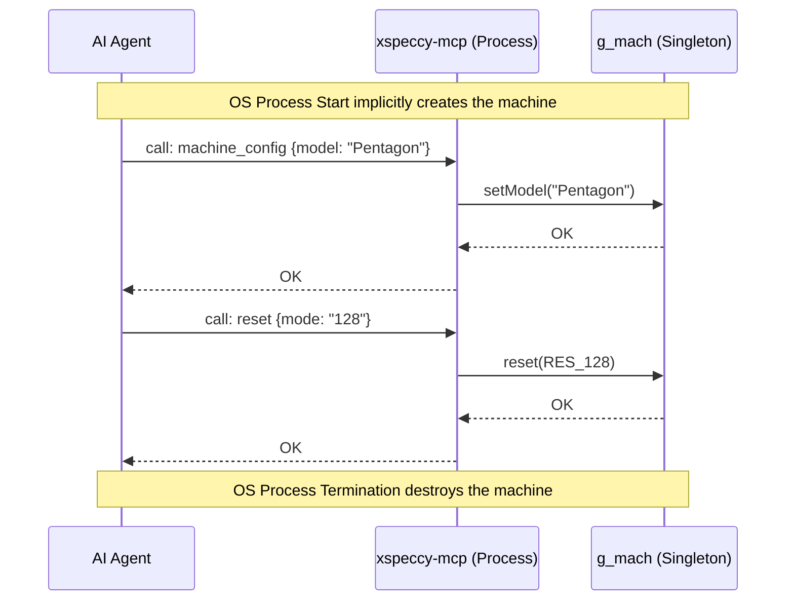
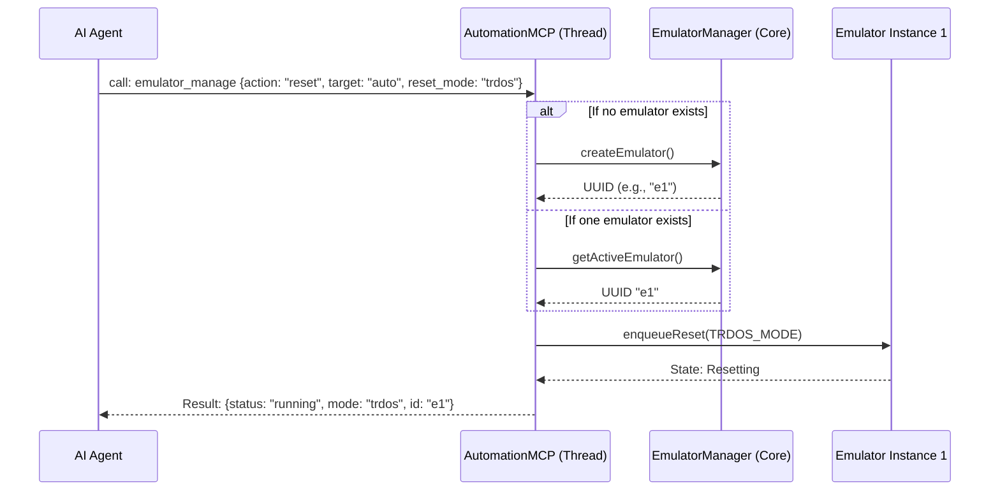

# Machine and Lifecycle Capabilities

## 1. Overview and Scope

This capability domain governs the fundamental existence and foundational state of the emulator instance. It encompasses operations to create, destroy, configure, enumerate, and reset the machine. Without these tools, the agent cannot bootstrap an environment to test code or begin reverse engineering.

### Scope Items
*   **Emulator Instantiation**: Spawning a new virtual machine.
*   **Destruction**: Terminating a virtual machine gracefully to free resources.
*   **Configuration**: Modifying base hardware specifications (e.g., ZX Spectrum 48k vs. 128k vs. Pentagon).
*   **State Enumeration**: Listing available models, layouts, and active emulator instances.
*   **Reset Mechanics**: Performing hard, soft, or specialized (e.g., TR-DOS) resets.

---

## 2. Developer & Reverse Engineer Usage Rank: **10/10**

### 2.1 Usage Frequency
**Constant**. Every single automated workflow or interactive debugging session must begin by resolving the machine lifecycle. 

### 2.2 Developer Perspective
For developers working on cross-platform ZX Spectrum software, the ability to instantly switch the machine model (from 48K to Pentagon 128K) is critical for regression testing. A single CI/CD run or AI test script might spawn five different instances, test a routine, and destroy them. 

### 2.3 Reverse Engineer Perspective
Reverse engineers frequently require "clean slate" environments. A malware analyst or demo reverse engineer needs a deterministic environment reset to trace memory corruption or setup hooks before a specific payload executes. The `reset` tool is their primary mechanism to replay a state trajectory.

---

## 3. xspeccy-mcp Offering Analysis

The `xspeccy-mcp` project provides four distinct tools in this category. Because it is a monolithic, headless wrapper over the Xpeccy core, its lifecycle is intrinsically tied to the OS process. 

### 3.1 `machine_config` Tool
*   **Description**: Reads or changes the current model, RAM size, ROM set, and geometry.
*   **Schema (Proposed/Observed)**:
    ```json
    {
      "model": "Pentagon",
      "ram": 128,
      "romset": "default",
      "geometry": "default"
    }
    ```
*   **Strengths**: Provides an all-in-one configuration mechanism.
*   **Limitations**: It mutates a global singleton (`g_mach`). If an agent configures the machine for one task, it breaks state for any concurrent task. 

### 3.2 `list_models` Tool
*   **Description**: Enumerates all hardcoded machine templates.
*   **Strengths**: Crucial for API discovery since the agent cannot guess valid model strings.

### 3.3 `machine_state` Tool
*   **Description**: Returns the current execution state, timing info, and configuration.
*   **Data Returned**: CPU type, base clock rate, active memory pages.

### 3.4 `reset` Tool
*   **Description**: Triggers an emulator reset.
*   **Parameters**: Supports different reset modes (`RES_DEFAULT`, `RES_48`, `RES_128`, `RES_DOS`).
*   **Strengths**: These modes force the machine to reset into a specific **ROM page** (or the default for the current configuration). In Unreal-NG, ROM pages are highly customizable via configuration files (e.g. `unreal.ini` defining `sys`, `sos`, `dos`, `128` banks per ROMSET). For example, forcing a reset into the TR-DOS ROM (mapped via `dos`) bypasses the need for the agent to type `RANDOMIZE USR 15616` and wait for UI animations.

### 3.5 Architectural Diagram (xspeccy-mcp Lifecycle)



---

## 4. Unreal-NG Current State

Unreal-NG possesses a massively superior architecture for lifecycle management, though it currently exposes these via standard REST WebAPI endpoints rather than LLM-optimized Smart Tools.

### 4.1 The `EmulatorManager` Architecture
Unreal-NG is built around the `EmulatorManager` singleton, which orchestrates an arbitrary number of concurrent `Emulator` instances. Each `Emulator` runs its own localized Z80 core, memory map, and peripheral set on isolated threads.

*   **Instance IDs**: Every emulator is addressed via a UUID or numeric index.
*   **Thread Isolation**: Lifecycle commands are dispatched securely across thread boundaries using Unreal-NG's robust `MessageCenter` and Notification Bridge.

### 4.2 Existing WebAPI Coverage
Unreal-NG currently supports:
*   `GET /api/v1/emulator` (List all instances)
*   `POST /api/v1/emulator/create` (Create new)
*   `GET /api/v1/emulator/models` (List hardware templates)
*   `DELETE /api/v1/emulator/{id}` (Destroy)
*   `POST /api/v1/emulator/{id}/reset` (Reset)

### 4.3 Feature Gaps in MCP
While the backend has 100% coverage, the current MCP design treats these as separate routed endpoints. If an agent wants to start testing code, it must:
1. Search for the create API.
2. Invoke the create API.
3. Parse the UUID.
4. Search for the reset API.
5. Invoke the reset API with the UUID.

This requires massive token overhead and round-trip latency.

---

## 5. Plan for Superiority: The `emulator_manage` Smart Tool

To surpass xspeccy-mcp, Unreal-NG will expose a unified, stateless **Smart Tool** called `emulator_manage`.

### 5.1 Stateless Execution Mode (`target="auto"`)
The defining superiority of Unreal-NG's MCP will be the `target="auto"` parameter. 
*   If the agent requests an action on `auto`, the server will check if exactly one emulator exists. If so, it uses it.
*   If zero emulators exist, the server will **automatically create one** before executing the action.
*   This entirely eliminates the setup boilerplate that plagues xspeccy-mcp scripts.

### 5.2 Tool Schema Definition
The `emulator_manage` tool will aggregate all lifecycle operations into a single LLM context.

```json
{
  "name": "emulator_manage",
  "description": "Manage the lifecycle and configuration of Unreal-NG emulator instances. Use this to create, destroy, reset, or list machines.",
  "inputSchema": {
    "type": "object",
    "properties": {
      "action": {
        "type": "string",
        "enum": ["create", "destroy", "reset", "list", "list_models", "status"],
        "description": "The lifecycle operation to perform."
      },
      "target": {
        "type": "string",
        "description": "The ID of the emulator. Use 'auto' to let the server manage a default instance automatically.",
        "default": "auto"
      },
      "model": {
        "type": "string",
        "description": "Used with 'create' or 'reset'. Specifies the hardware model (e.g., 'Pentagon', 'Spectrum 128K')."
      },
      "reset_rom_page": {
        "type": "string",
        "description": "Used with 'reset'. Forces the machine to reset into a specific ROM page defined by the active configuration (e.g. 'sys', 'sos', 'dos', '128' as mapped in unreal.ini) rather than the default configuration."
      }
    },
    "required": ["action"]
  }
}
```

### 5.3 Architectural Diagram (Unreal-NG MCP Lifecycle)



### 5.4 Conclusion on Lifecycle
By aggregating lifecycle management into a single `emulator_manage` Smart Tool and injecting the "auto" resolution pattern, Unreal-NG provides the multi-instance scalability of a modern backend while maintaining the ease-of-use of xspeccy-mcp's single-instance monolith. The LLM spends zero tokens on setup and proceeds directly to debugging.
