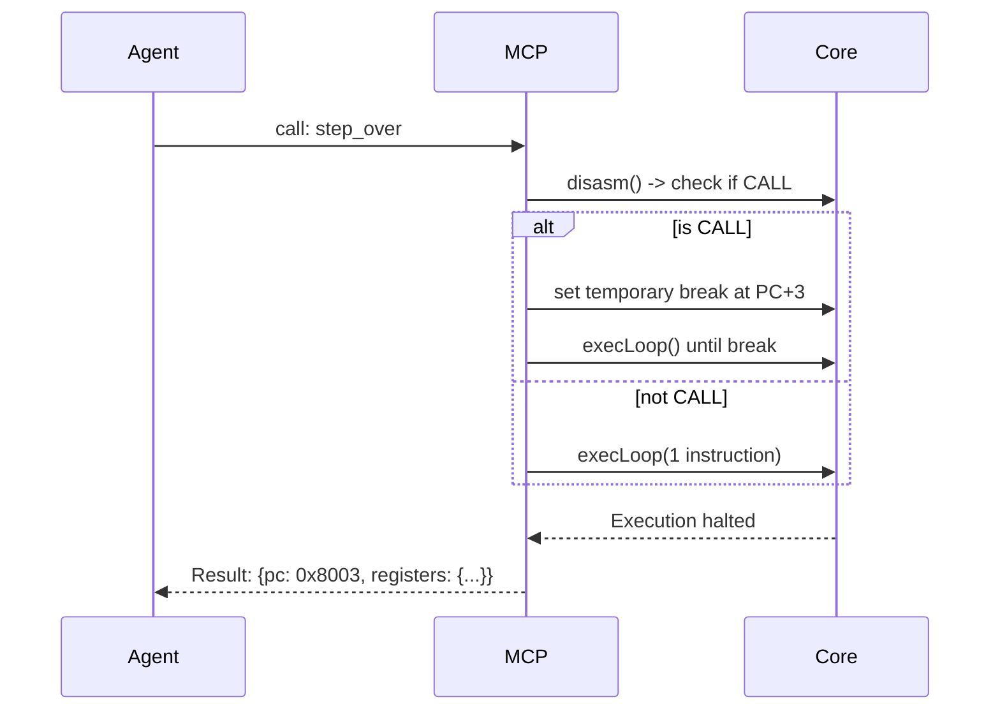
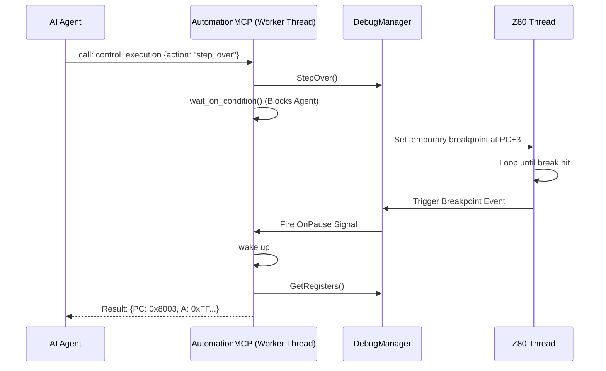

# Execution Control Capabilities

## 1. Overview and Scope

This capability domain covers the granular manipulation of the emulator's execution loop. It forms the backbone of dynamic analysis, allowing an AI agent to pause time, step through instructions, and run code up to specific landmarks. 

### Scope Items
*   **Stepping**: Advancing execution by discrete units (instructions, T-states, scanlines, frames).
*   **Subroutine Navigation**: Intelligent stepping logic (`step_over`, `step_out`).
*   **Resumption**: Continuous execution until conditions are met.
*   **Pause State Management**: Halting the emulator safely to inspect memory.

---

## 2. Developer & Reverse Engineer Usage Rank: **10/10**

### 2.1 Usage Frequency
**Constant.** A debugging session consists almost entirely of a feedback loop: `step`, `read_memory`, `step`, `get_registers`. 

### 2.2 Developer Perspective
Developers use these tools to isolate logical bugs. A typical flow involves running the emulator until the start of a newly written assembly routine, then stepping over calls to the OS ROM, and meticulously stepping into their own math functions to watch registers mutate. 

### 2.3 Reverse Engineer Perspective
Reverse engineers rely heavily on `step_over` and `step_out`. When analyzing an obfuscated loader, they want to bypass generic decryption loops or wait loops. `run_frames` is critical for allowing a packed demo to unpack itself in memory over several screen updates before dropping a payload.

---

## 3. xspeccy-mcp Offering Analysis

xspeccy-mcp handles execution control via several distinct, flat tools. Because it runs synchronously on a single thread, execution tools block the JSON-RPC response until the execution quantum completes.

### 3.1 The Tools
*   **`run`**: Runs execution. Accepts limits via parameters: `max_instructions`, `stop_pc`, `max_frames`.
*   **`run_frames`**: Specialized tool to run exactly N frames. Crucial for visual synchronization.
*   **`step`**: Executes exactly N instructions.
*   **`step_over`**: Identifies if the current instruction is a `CALL`, `LDIR`, or `CPIR`. If so, it sets a temporary breakpoint at the next PC and runs until it is hit.
*   **`step_out`**: The most complex. It records the current Stack Pointer (SP). It runs the emulator until the PC hits a `RET` instruction *and* the SP is greater than the recorded entry SP. This safely returns from the current subroutine, even if it was called recursively.

### 3.2 Limitations of xspeccy-mcp
*   **Tool Sprawl**: Having 5 different tools for what is essentially "advance the CPU" consumes excessive LLM context.
*   **Deadlock Risk**: If `step_out` is called on a subroutine that never returns (e.g., an infinite main loop), the headless process hangs forever because there is no out-of-band way to interrupt it.
*   **No T-state Granularity**: `step` only takes instructions, not raw clock cycles.

### 3.3 Architectural Diagram (xspeccy-mcp Execution)



---

## 4. Unreal-NG Current State

Unreal-NG has a sophisticated asynchronous execution model driven by the `DebugManager` and `MainLoop` classes. 

### 4.1 The Pause/Resume Synchronization Architecture
Unreal-NG cannot simply block its thread like xspeccy-mcp, because the Qt GUI and other API endpoints must remain responsive. 
Instead, Unreal-NG uses a **Landmark Pattern**. A command like `run_tstates` sets a "landmark" in the future. The high-speed emulator thread executes normally until it crosses that landmark, at which point it halts and emits a `Pause` signal.

### 4.2 Existing WebAPI Coverage
The WebAPI already exposes:
*   `POST /api/v1/emulator/{id}/step`
*   `POST /api/v1/emulator/{id}/stepover`
*   `POST /api/v1/emulator/{id}/run_tstates`
*   `POST /api/v1/emulator/{id}/run_to_scanline`
*   `POST /api/v1/emulator/{id}/run_to_pixel`
*   `POST /api/v1/emulator/{id}/run_frame`
*   `POST /api/v1/emulator/{id}/run_to_interrupt`

### 4.3 Feature Gaps in MCP
*   **Missing `step_out`**: The WebAPI does not have an endpoint that implements the SP-tracking logic required for a safe `step_out`.
*   **Asynchronous Complexity**: Because the WebAPI is asynchronous, an HTTP request to `step` might return `200 OK` *before* the step actually finishes if not careful. The MCP layer must wrap this in a synchronous "Pause Guard" that blocks the LLM's response until the core confirms it has halted.

---

## 5. Plan for Superiority: The `control_execution` Smart Tool

To surpass xspeccy-mcp, Unreal-NG will consolidate all execution primitives into a single `control_execution` Smart Tool and implement the missing `step_out` logic inside the MCP proxy layer (or push it down to `DebugManager`).

### 5.1 The "Pause Guard" Implementation
The MCP thread will use a `std::condition_variable`. When the LLM requests a `step`, the MCP:
1. Validates the emulator is paused.
2. Registers a one-shot callback on the emulator's `OnPause` event.
3. Issues the step command to the core.
4. Waits on the condition variable.
5. When the core halts and fires `OnPause`, the condition variable wakes the MCP thread.
6. The MCP returns the new PC and register state to the LLM.

### 5.2 Tool Schema Definition
By using an `action` enum, we compress 5 tools into 1.

```json
{
  "name": "control_execution",
  "description": "Advance the emulator execution state. Includes fine-grained stepping and frame execution. Automatically returns the new CPU register state upon completion.",
  "inputSchema": {
    "type": "object",
    "properties": {
      "action": {
        "type": "string",
        "enum": [
          "pause", "resume", "step", "step_over", "step_out", 
          "run_frame", "run_frames", "run_tstates", "run_to"
        ],
        "description": "The execution primitive to invoke."
      },
      "target": {
        "type": "string",
        "default": "auto"
      },
      "amount": {
        "type": "integer",
        "description": "Used with step, run_frames, or run_tstates to specify how many units to advance.",
        "default": 1
      },
      "address": {
        "type": "string",
        "description": "Used with 'run_to'. Can be a hex string ('0x8000') or a known symbol label ('main_loop')."
      }
    },
    "required": ["action"]
  }
}
```

### 5.3 Architectural Diagram (Unreal-NG Pause Guard)



### 5.4 Conclusion on Execution
By solving the asynchronous WebAPI gap via the Pause Guard pattern, Unreal-NG provides synchronous, safe debugging for the LLM without compromising the high-performance non-blocking nature of the underlying emulator core. Consolidating the tools saves significant context space while adding support for T-state and scanline granularity that xspeccy-mcp lacks.
