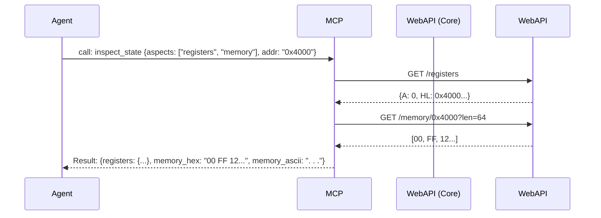

# CPU and Memory Modification

## 1. Overview and Scope

This capability domain provides the interface to the lowest level of the hardware simulation: the CPU registers and the raw physical/logical memory map. It is the fundamental mechanism through which an agent inspects state anomalies and patches logic dynamically.

### Scope Items
*   **Register Inspection**: Reading the standard Z80 registers (AF, BC, DE, HL), shadow registers (AF', BC', DE', HL'), index registers (IX, IY), and system states (PC, SP, I, R, IFF1, IFF2, IM).
*   **Register Mutation**: Altering any of the above registers.
*   **Memory Reads**: Extracting blocks of bytes from the Z80's 64K logical address space or specific physical RAM/ROM pages.
*   **Memory Writes**: Injecting bytes to alter data or patch code.
*   **Pattern Matching**: Searching memory for byte sequences or strings.

---

## 2. Developer & Reverse Engineer Usage Rank: **9/10**

### 2.1 Usage Frequency
**Very High.** While execution commands move the CPU through time, memory commands allow the agent to inspect the *results* of that time. 

### 2.2 Developer Perspective
Developers use this to verify struct layouts in memory, check that string buffers are populated correctly, or forcefully modify a loop counter register (e.g., `set B to 1`) to bypass a long initialization sequence during a test run.

### 2.3 Reverse Engineer Perspective
Reverse engineers rely on `read_memory` to dump decrypted payloads from RAM after an unpacker routine has executed. They use `find_bytes` to locate known signatures (like an encryption key or an anti-debugging trap). They use `write_memory` to NOP-out (inject `0x00`) anti-tamper checks.

---

## 3. xspeccy-mcp Offering Analysis

xspeccy-mcp provides excellent low-level tools, exposing the direct memory map of the `g_mach` instance.

### 3.1 The Tools
*   **`get_registers`**: Returns a massive JSON object with every Z80 register.
*   **`set_register`**: Takes a name (`HL`) and an integer value to modify the live CPU state.
*   **`read_memory`**: Reads N bytes from a 16-bit address. Returns both a hex string (`"00 FF 12"`) and a JSON array of integers `[0, 255, 18]` for ease of use by the LLM.
*   **`write_memory`**: Injects bytes at an address. Accepts either a hex string or an integer array.
*   **`find_bytes`**: Searches the 64K address space for a sequence.

### 3.2 Limitations of xspeccy-mcp
*   **Logical Only**: xspeccy-mcp's `read_memory` primarily operates through the CPU's current paging configuration. If you want to read RAM Bank 7, but Bank 0 is currently paged in at `0xC000`, you must first write to the memory paging port (`0x7FFD`) to swap the bank, read the memory, and then swap it back. This is highly intrusive.
*   **Tool Sprawl**: 5 tools dedicated to reading/writing basic bytes.

### 3.3 Architectural Diagram (xspeccy-mcp Memory Flow)

```mermaid
graph TD
    Agent[AI Agent]
    subgraph "xspeccy-mcp"
        Dispatch[JSON-RPC Dispatcher]
        MemTool[`read_memory` Tool]
        Core[xpeccy core: memRd()]
    end
    
    Agent -- "read_memory {addr: 49152, len: 16}" --> Dispatch
    Dispatch --> MemTool
    MemTool -- "Loop 16x" --> Core
    Core -- "Resolve Bank -> Read Byte" --> MemTool
    MemTool -- "Format Hex String" --> Agent
```

---

## 4. Unreal-NG Current State

Unreal-NG has deep introspection capabilities, but its WebAPI endpoints are highly REST-focused and lack a few convenience functions.

### 4.1 Existing WebAPI Coverage
*   `GET /api/v1/emulator/{id}/registers`
*   `GET /api/v1/emulator/{id}/memory/{addr}`
*   `PUT /api/v1/emulator/{id}/memory/{addr}`
*   `GET /api/v1/emulator/{id}/memory/{type}/{page}/{offset}` (Physical access)

### 4.2 Unreal-NG's Superiority: Physical Page Access
Unlike xspeccy-mcp, Unreal-NG's core allows out-of-band reads of specific physical RAM/ROM banks regardless of what the Z80 CPU is currently doing. The `/memory/page/` API means an agent can inspect off-screen buffers (Bank 7) without altering the live port states.

### 4.3 Feature Gaps in MCP
*   **No `set_register` endpoint**: The WebAPI can read registers, but there is no dedicated `PUT /registers/{name}` endpoint. Altering registers currently requires restoring a full machine snapshot or complex memory injection.
*   **No `find_bytes` endpoint**: The agent would have to dump the entire 64K block and search it in Python, which is terribly inefficient for LLM tokens.

---

## 5. Plan for Superiority: The `inspect_state` Aggregator

To beat xspeccy-mcp, we will implement the missing features in the core/WebAPI, and then aggregate them using an **Aspect-Oriented** Smart Tool.

### 5.1 Implement Missing Core Features
1.  **Register Setter**: Add a `setRegister(name, value)` method to `DebugManager` and expose it via WebAPI.
2.  **Pattern Scanner**: Add a high-speed Boyer-Moore search algorithm into the core to find byte sequences across logical memory and expose it as a WebAPI endpoint.

### 5.2 Aspect-Oriented Inspection
Instead of calling `get_registers`, parsing, and then calling `read_memory`, the AI should get everything at once. We will design the `inspect_state` tool to take an array of `aspects`.

```json
{
  "name": "inspect_state",
  "description": "Read multiple aspects of the emulator state simultaneously. Reduces round-trips.",
  "inputSchema": {
    "type": "object",
    "properties": {
      "target": { "type": "string", "default": "auto" },
      "aspects": {
        "type": "array",
        "items": {
          "type": "string",
          "enum": ["registers", "memory", "stack"]
        }
      },
      "memory_address": { "type": "string", "description": "Hex address to read if 'memory' aspect is used." },
      "memory_length": { "type": "integer", "default": 64 }
    },
    "required": ["aspects"]
  }
}
```

### 5.3 The `mutate_state` Smart Tool
For changing state, a unified mutator:

```json
{
  "name": "mutate_state",
  "description": "Alter CPU registers or inject bytes into memory.",
  "inputSchema": {
    "type": "object",
    "properties": {
      "target": { "type": "string", "default": "auto" },
      "register": { "type": "string", "description": "e.g., 'HL', 'A', 'PC'" },
      "register_value": { "type": "integer" },
      "memory_address": { "type": "string" },
      "memory_bytes": { "type": "string", "description": "Hex string of bytes to write, e.g., 'C9 00'" }
    }
  }
}
```

### 5.4 Architectural Diagram (Unreal-NG Aspect Read)



### 5.5 Conclusion on CPU & Memory
By providing aspect-oriented reads, we drastically cut down on the number of tool calls an agent must make to orient itself. By exposing Unreal-NG's physical page access, we allow non-intrusive memory inspection that xspeccy-mcp cannot perform.
