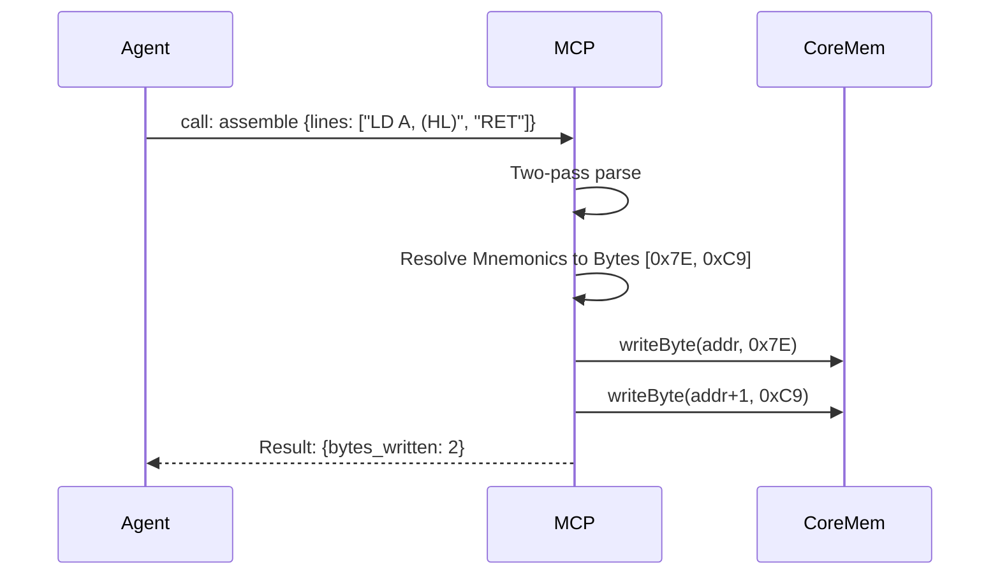
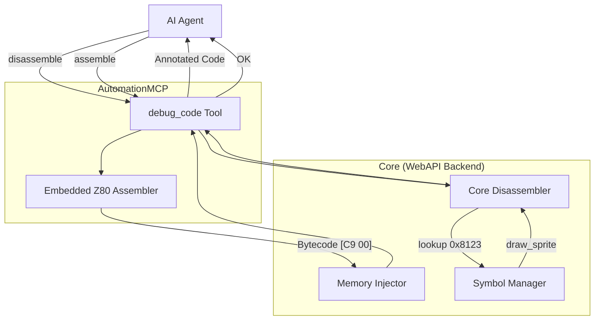

# Code, Assembly, and Disassembly

## 1. Overview and Scope

This capability domain governs the translation between raw hexadecimal opcodes and human-readable (or AI-readable) Z80 assembly language. It provides the mechanism for the agent to understand what the code is doing, and to write new routines dynamically.

### Scope Items
*   **Disassembly**: Translating memory blocks into Z80 mnemonics.
*   **Assembly**: Translating Z80 mnemonics into bytecode and injecting it into memory.
*   **Context Annotation**: Decorating disassembly with structural hints (jump arrows, labels, T-state timings).

---

## 2. Developer & Reverse Engineer Usage Rank: **8/10**

### 2.1 Usage Frequency
**High.** The disassembler is the primary "vision" the AI uses to navigate the logic of the program. 

### 2.2 Developer Perspective
Developers use disassembly to verify that their C compiler (like SDCC or z88dk) generated efficient code, or to check that their macros expanded correctly in memory.

### 2.3 Reverse Engineer Perspective
Reverse engineers rely entirely on the disassembler. Furthermore, the ability to assemble code dynamically allows them to write "inline patches" (e.g., replacing a complex checksum routine with `LD A, 0x01 ; RET`) directly from the AI interface without needing an external cross-compiler.

---

## 3. xspeccy-mcp Offering Analysis

xspeccy-mcp excels in this category because it integrated a lightweight assembler directly into the server.

### 3.1 The Tools
*   **`disassemble`**: Takes an address and a count of instructions. Returns highly annotated output.
*   **`assemble`**: Takes an address and an array of string mnemonics. It compiles them and writes them to memory immediately.

### 3.2 Deep Dive: xspeccy-mcp Assembler (`xsp_mcp.cpp:708`)
The `assemble` tool is remarkably powerful. It isn't just a 1-to-1 instruction encoder; it supports **forward references** and **label generation**.
```json
// AI Agent Request
{
  "address": 32768,
  "lines": [
    "loop: LD A, (HL)",
    "INC HL",
    "CP 0",
    "JR Z, end",
    "OUT (254), A",
    "JR loop",
    "end: RET"
  ]
}
```
The server performs a two-pass assembly internally, calculates the relative offsets for the `JR` instructions, updates its internal symbol table with `loop` and `end`, and injects the resulting bytecode.

### 3.3 Limitations of xspeccy-mcp
*   **Syntax Strictness**: The built-in assembler has undocumented quirks and might reject perfectly valid pasmo/sjasmplus syntax, confusing the AI.

### 3.4 Architectural Diagram (xspeccy-mcp Assembler)



---

## 4. Unreal-NG Current State

Unreal-NG has a robust disassembler inherited from the UnrealSpeccy legacy codebase, which powers the Qt GUI.

### 4.1 Existing WebAPI Coverage
*   `GET /api/v1/emulator/{id}/disasm?address=0x8000&lines=20`

### 4.2 Feature Gaps in MCP
*   **No Assembler**: Unreal-NG has absolutely no facility for assembling Z80 code from strings. The Qt GUI allowed crude hex-editing, but no text-to-opcode compilation. This means an AI agent would have to act as its own assembler, calculating relative jump offsets manually (e.g., "JR Z is 0x28, the target is 5 bytes away, so 0x28 0x05"), which LLMs are notoriously bad at.
*   **No T-state Annotation**: The current WebAPI disassembler endpoint returns mnemonics but does not annotate the instruction with its T-state cost, which is crucial for timing analysis.

---

## 5. Plan for Superiority: The `debug_code` Smart Tool

To achieve parity, Unreal-NG must embed an assembler.

### 5.1 Integrating a Lightweight Assembler
We will integrate a lightweight, header-only Z80 assembler library (such as a stripped-down version of `ksmn` or `z80asm`) directly into the `AutomationMCP` module. Since the agent only uses this for inline patching (a dozen lines at most), it does not need to support complex macros or file includes—just basic mnemonics and relative labels.

### 5.2 Enhancing the Disassembler
We will modify the `GET /disasm` endpoint to include:
1.  **Instruction Timing**: Return the T-state cost of each instruction (e.g., `LD A, B [4T]`).
2.  **Symbol Resolution**: If an address matches a known symbol (see `07-symbols`), output `CALL draw_sprite` instead of `CALL 0x8123`.

### 5.3 Tool Schema Definition

```json
{
  "name": "debug_code",
  "description": "Translate between raw memory and Z80 assembly. Use this to read code (disassemble) or inject new code (assemble).",
  "inputSchema": {
    "type": "object",
    "properties": {
      "action": {
        "type": "string",
        "enum": ["disassemble", "assemble"]
      },
      "target": { "type": "string", "default": "auto" },
      "address": { 
        "type": "string",
        "description": "Hex address or label name." 
      },
      "count": { 
        "type": "integer", 
        "description": "Number of instructions to disassemble (max 100)." 
      },
      "lines": {
        "type": "array",
        "items": { "type": "string" },
        "description": "Array of Z80 mnemonics to assemble and inject."
      }
    },
    "required": ["action", "address"]
  }
}
```

### 5.4 Architectural Diagram (Unreal-NG Code Pipeline)



### 5.5 Conclusion on Code
Without an embedded assembler, the AI is severely handicapped when trying to write patches. Integrating a lightweight assembler and bundling it with an enhanced disassembler creates a powerful `debug_code` Smart Tool that perfectly mirrors a human reverse engineer's workflow in tools like IDA Pro or Ghidra.
