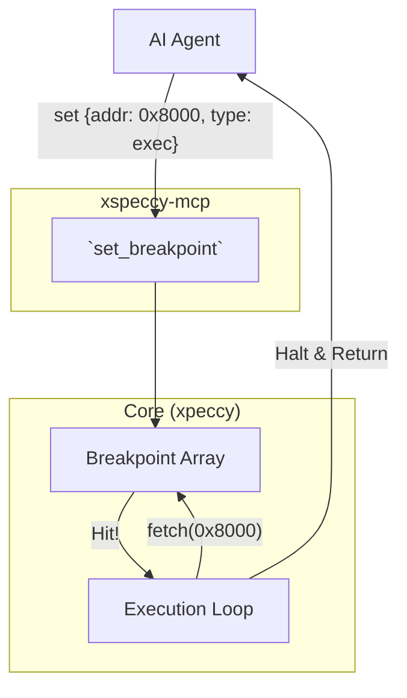
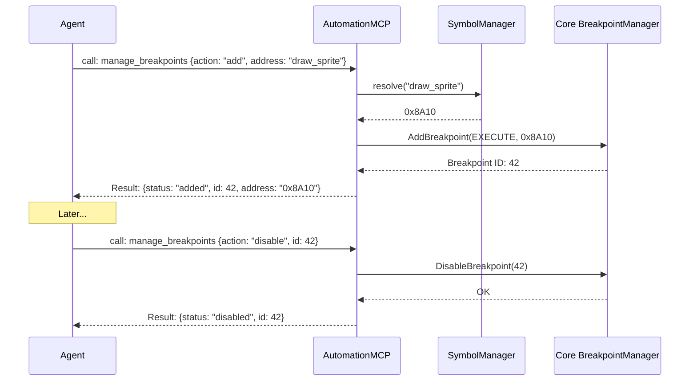

# Breakpoint Management Capabilities

## 1. Overview and Scope

This capability domain focuses entirely on the mechanisms used to halt execution when specific conditions are met. Breakpoints are the foundation of dynamic analysis, allowing an AI agent to fast-forward execution to a point of interest instead of single-stepping thousands of instructions.

### Scope Items
*   **Execution Breakpoints (PC)**: Halting when the Program Counter reaches a specific address.
*   **Memory Breakpoints (Watchpoints)**: Halting when a specific memory address is read from or written to.
*   **I/O Port Breakpoints**: Halting when an `IN` or `OUT` instruction targets a specific hardware port.
*   **Bank-Aware Scoping**: The ability to bind a breakpoint to a specific physical memory bank, rather than a logical address.
*   **Conditional Breakpoints**: Halting only if a specific register state or memory value matches an expression.

---

## 2. Developer & Reverse Engineer Usage Rank: **9/10**

### 2.1 Usage Frequency
**Very High.** Breakpoints are the first thing set after loading a binary.

### 2.2 Developer Perspective
Developers use breakpoints to catch assertions. If a routine expects `HL` to be non-zero, they might place a conditional breakpoint at the start of the routine that triggers if `HL == 0`. They also use port breakpoints extensively to debug their own audio routines (e.g., breaking on writes to the AY chip port `0xBFFD`).

### 2.3 Reverse Engineer Perspective
Reverse engineers rely heavily on watchpoints (memory read/write breakpoints). When analyzing unknown code, they will find a decrypted string in memory, set a read-breakpoint on the first byte, and run the code to see exactly which instruction consumes the string. 

---

## 3. xspeccy-mcp Offering Analysis

xspeccy-mcp provides robust, bare-metal breakpoint tools. It doesn't have complex conditional breakpoints, but it supports bank-awareness perfectly.

### 3.1 The Tools
*   **`set_breakpoint`**: Sets an execution or memory watchpoint.
*   **`clear_breakpoints`**: Erases all breakpoints globally.
*   **`set_port_breakpoint`**: Sets an I/O port watchpoint.

### 3.2 Deep Dive: Bank-Aware Scoping
The most powerful feature of xspeccy-mcp's `set_breakpoint` is the `bank` parameter. 
The ZX Spectrum uses memory paging. The logical address `0xC000` could point to RAM Bank 0, 1, 3, 4, 6, or 7. If you set a normal breakpoint at `0xC000`, the emulator halts every time *any* bank executes code there.
By specifying `{"address": "0xC000", "bank": "ROM0"}`, xspeccy-mcp binds the breakpoint to the physical page. It will only halt if `0xC000` is executed *and* TR-DOS ROM is currently paged in.

### 3.3 Limitations of xspeccy-mcp
*   **No Individual Deletion**: There is no `remove_breakpoint` tool. If the AI sets 5 breakpoints and wants to remove one, it must call `clear_breakpoints` and then re-add the other 4. This wastes LLM tokens and is error-prone.
*   **No Enable/Disable State**: Breakpoints are either active or deleted.

### 3.4 Architectural Diagram (xspeccy-mcp Breakpoints)



---

## 4. Unreal-NG Current State

Unreal-NG has a sophisticated Breakpoint Manager built into the core, supporting individual IDs, enable/disable toggles, and complex conditions.

### 4.1 Existing WebAPI Coverage
*   `GET /api/v1/emulator/{id}/breakpoints`
*   `POST /api/v1/emulator/{id}/breakpoints`
*   `DELETE /api/v1/emulator/{id}/breakpoints` (Clear all)
*   `DELETE /api/v1/emulator/{id}/breakpoints/{bp_id}` (Remove single)
*   `PUT /api/v1/emulator/{id}/breakpoints/{bp_id}/enable`
*   `PUT /api/v1/emulator/{id}/breakpoints/{bp_id}/disable`

### 4.2 Feature Gaps in MCP
*   **MCP Exposure**: None of this is exposed as a Smart Tool. The AI would have to use `invoke_api` and struggle with the raw REST paths.
*   **Symbol Resolution**: The WebAPI does not allow setting a breakpoint by label name (e.g., `POST /breakpoints {address: "main_loop"}`).

---

## 5. Plan for Superiority: The `manage_breakpoints` Smart Tool

To surpass xspeccy-mcp, we will expose Unreal-NG's superior backend through a unified Smart Tool, adding symbol resolution at the API boundary.

### 5.1 The `manage_breakpoints` Tool Schema
This tool will provide fine-grained control over individual breakpoints without forcing the AI to remember complex REST URIs.

```json
{
  "name": "manage_breakpoints",
  "description": "Create, list, modify, or remove execution and memory breakpoints.",
  "inputSchema": {
    "type": "object",
    "properties": {
      "action": {
        "type": "string",
        "enum": ["add", "remove", "clear", "list", "enable", "disable"]
      },
      "target": { "type": "string", "default": "auto" },
      "id": { 
        "type": "integer", 
        "description": "Used with remove, enable, disable to target a specific breakpoint." 
      },
      "type": {
        "type": "string",
        "enum": ["execute", "read", "write", "port_in", "port_out"],
        "description": "Used with 'add'."
      },
      "address": {
        "type": "string",
        "description": "Hex address, port number, or symbol label. Used with 'add'."
      },
      "bank": {
        "type": "string",
        "description": "Optional physical bank name (e.g., 'RAM7', 'ROM1') for bank-aware scoping."
      },
      "condition": {
        "type": "string",
        "description": "Optional expression (e.g., 'A == 0xFF')."
      }
    },
    "required": ["action"]
  }
}
```

### 5.2 Architectural Diagram (Unreal-NG Breakpoint Flow)



### 5.3 Conclusion on Breakpoints
By wrapping Unreal-NG's powerful core breakpoint manager into a single Smart Tool, we give the AI the ability to manage breakpoints individually (unlike xspeccy-mcp). Furthermore, by adding symbol resolution directly into the MCP layer, the AI can set breakpoints on semantic names (`draw_sprite`) instead of calculating hex offsets, massively reducing hallucination errors.
