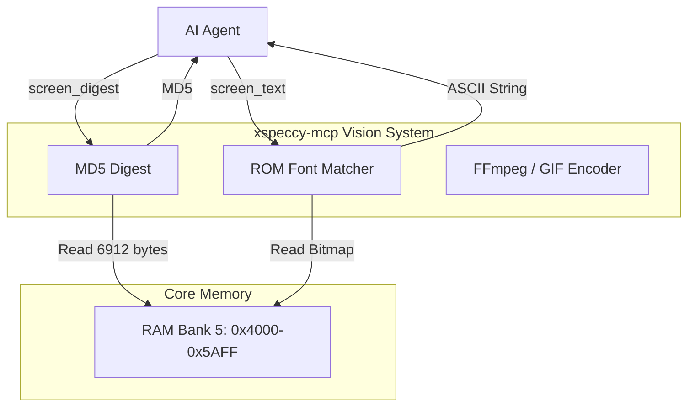
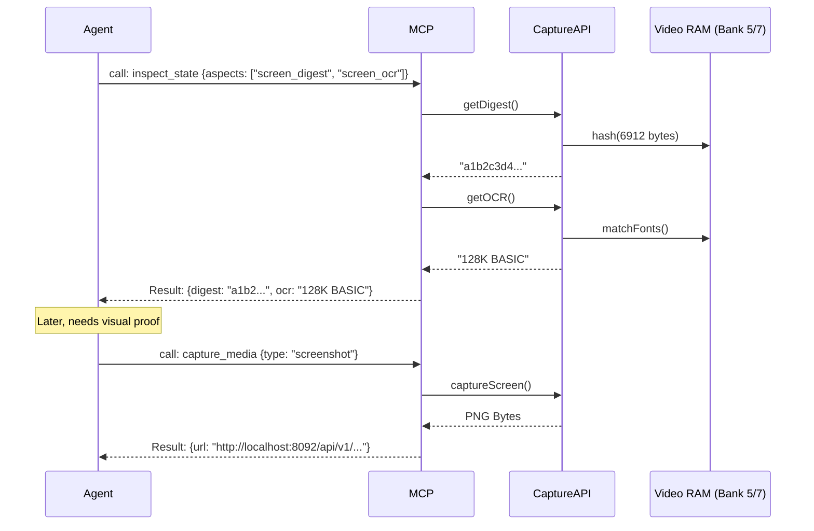

# Vision and Media Capture Capabilities

## 1. Overview and Scope

This capability domain serves as the primary non-memory sensory input for the AI agent. It allows the agent to visually and programmatically verify that the emulator is producing the correct graphical and textual output on the screen.

### Scope Items
*   **Still Capture**: Taking PNG screenshots of the emulator window.
*   **Video Recording**: Capturing motion (GIF, MP4, WebM) over a series of frames to analyze animations or multi-frame payloads.
*   **Optical Character Recognition (OCR)**: Translating the 32x24 ZX Spectrum screen grid into ASCII text using ROM font matching.
*   **Screen Hashing (Digest)**: Generating a cryptographic hash of the video RAM to cheaply detect visual changes without transferring images.
*   **Attribute Inspection**: Reading the color grid (ink, paper, brightness, flash) directly.

---

## 2. Developer & Reverse Engineer Usage Rank: **8/10**

### 2.1 Usage Frequency
**High.** While internal state (memory, registers) proves *what* happened, vision proves *that it worked*. 

### 2.2 Developer Perspective
A developer testing a new text-rendering routine cannot rely solely on memory dumps; they need to see the screen or use OCR to verify that "HELLO WORLD" actually appeared. Automated CI pipelines rely heavily on `screen_digest` to perform regression testing (e.g., "does frame 500 still hash to `A1B2...`?").

### 2.3 Reverse Engineer Perspective
Reverse engineers use video recording to capture demoscene effects or malware payloads that unpack over multiple frames. They use OCR to read password prompts or error messages generated by the software, allowing the AI to know *what* to type next.

---

## 3. xspeccy-mcp Offering Analysis

xspeccy-mcp has an incredibly rich set of vision tools designed specifically for AI consumption.

### 3.1 The Tools
*   **`screenshot`**: Captures a PNG. Supports `scale` and `border` (rendering the ULA border).
*   **`record_video`**: A highly advanced tool. It records GIF/WebM/MP4. Crucially, it supports `every_nth: "auto"`. This tells the server to analyze the memory and automatically determine the frame rate of the visual effect (e.g., 50fps vs 25fps) and only record the unique frames, saving massive amounts of bandwidth.
*   **`screen_text`**: Reads the standard 32x24 ZX Spectrum screen memory (Bank 5) and matches the bytes against the standard ROM font to return ASCII text.
*   **`screen_attrs`**: Returns the 32x24 attribute grid.
*   **`screen_digest`**: Returns an MD5 hash of the video RAM. 

### 3.2 Deep Dive: Screen Digest
`screen_digest` is the unsung hero of AI automation. Instead of calling `screenshot` and waiting for an LLM Vision model to analyze a 50KB image (which costs tokens and takes 10+ seconds), the AI calls `screen_digest`. It gets an MD5 hash instantly. The AI then calls `step` 1000 times. It calls `screen_digest` again. If the hash is the same, the screen hasn't changed. This loop takes milliseconds.

### 3.3 Architectural Diagram (xspeccy-mcp Vision)



---

## 4. Unreal-NG Current State

Unreal-NG has foundational endpoints for vision, but lacks the advanced AI-specific tools found in xspeccy-mcp.

### 4.1 Existing WebAPI Coverage
*   `GET /api/v1/emulator/{id}/capture/screen` (Returns raw image bytes)
*   `GET /api/v1/emulator/{id}/capture/ocr` (Returns ASCII)
*   `GET /api/v1/emulator/{id}/state/screen` (Returns attribute and flash state)

### 4.2 Feature Gaps in MCP
*   **No Video Recording**: Unreal-NG cannot currently capture MP4 or GIF over time via the WebAPI.
*   **No Screen Digest**: There is no endpoint that returns a hash of the video RAM.
*   **No `every_nth:"auto"`**: The core lacks the heuristics to detect visual frame updates.

---

## 5. Plan for Superiority: The `capture_media` Smart Tool

To surpass xspeccy-mcp, we must implement video recording and hashing in the core, and expose them cleanly.

### 5.1 Implement Core Dependencies
1.  **Video Encoder and Formats**: Integrate a dedicated media encoding pipeline into the `CaptureAPI` using FFmpeg or lightweight libraries. 
    *   **Supported Formats**: The system will support three distinct formats tailored to different AI needs:
        *   **GIF (Animated)**: Uses an optimized LZW encoder (e.g., `gif-h`). Ideal for short (<5 second) captures to be embedded directly into markdown reports or sent to basic Vision LLMs. Lossless, but high file size.
        *   **WebM (VP8/VP9)**: Uses `libvpx`. Ideal for medium-length captures. Highly efficient, widely supported by web browsers, and natively supported by advanced multi-modal LLMs for direct video reasoning.
        *   **MP4 (H.264)**: Uses `libx264`. The standard format for exporting captures to human developers or saving to disk.
    *   **The `skip_until` Implementation**: To save tokens and processing time, the AI can supply a `skip_until` condition (e.g., an address or label like `main_loop`). The implementation works by registering a silent execution breakpoint at that address via the `DebugManager`. The emulator runs at maximum unthrottled speed (no video rendering, no audio playback) until the `OnPause` signal is fired by that breakpoint. Once hit, the breakpoint is silently removed, the emulator drops back to normal 50Hz sync, and the `CaptureAPI` begins feeding the VRAM buffer into the video encoder for the requested duration. This guarantees frame-perfect capture starting exactly at the payload, without recording 10 seconds of loading screens.
    *   **The `every_nth:"auto"` Implementation**: Detects visual updates by running a fast `memcmp` (or checking the `screen_digest`) against the previous frame. If the screen hasn't changed, the encoder simply increments the duration of the previous frame using presentation timestamps (PTS) instead of encoding a duplicate full frame. This drastically reduces the final file size and LLM token processing cost.
2.  **Screen Digest Engine**: Add a fast hashing function (xxHash or MD5) to the `Emulator` class that specifically hashes `0x4000-0x5AFF` (taking active video memory banks into account, e.g., Bank 7 on 128K models).
3.  **Advanced Semantic Frame Diffing & Sprite Tracking**: Moving beyond basic XOR differences, the `CaptureAPI` will feature an algorithmic visual analyzer dedicated to extracting semantic motion. This prevents wasting tons of LLM tokens on full-frame bitmap analysis.
    *   **Algorithmic Sprite Tracking**: The system will employ block-matching algorithms (similar to motion estimation in video compression codecs like H.264) to detect discrete graphical blocks (sprites) moving across the screen. When an 8x8 or 16x16 block of pixels disappears from $(x_1, y_1)$ and appears at $(x_2, y_2)$, the core identifies this as a contiguous translation vector.
    *   **Contextual Fragment Extraction**: To allow the AI to understand exactly *what* moved without downloading the full screen, the engine extracts the *before* and *after* visual fragments. The JSON payload will contain a base64-encoded PNG of just the specific 16x16 bounding box of the moved sprite, alongside its immediate background.
    *   **AI Adapter Semantic Translation**: An intermediate AI Adapter layer will digest these raw vectors and present them as heavily semantic JSON objects tailored for LLM consumption. Instead of a raw diff, the LLM receives actionable visual events:
        ```json
        {
          "visual_events": [
            {
              "type": "sprite_translation",
              "dimensions": [16, 16],
              "from": [120, 80],
              "to": [124, 80],
              "vector": [4, 0],
              "previous_fragment_base64": "iVBORw0KGgo...",
              "current_fragment_base64": "iVBORw0KGgp..." 
            }
          ]
        }
        ```
    *   **Impact**: This sophisticated analyzer entirely bridges the gap between raster graphics and LLM cognition. The AI can instantly deduce "the main character moved 4 pixels right" and actually *see* the sprite via the embedded fragments, saving vast amounts of tokens and inference time compared to passing full-screen images to a vision model.

### 5.2 Integration into `inspect_state`
The `screen_digest` and `screen_ocr` capabilities should not be standalone tools. They should be **aspects** of the `inspect_state` tool.
When an AI calls `inspect_state {aspects: ["registers", "screen_digest", "screen_ocr"]}`, it instantly knows the CPU state, whether the screen changed, and any text on it, in one single JSON payload.

### 5.3 The `capture_media` Smart Tool
For actual media extraction (images/video), we provide a dedicated tool.

```json
{
  "name": "capture_media",
  "description": "Capture screenshots or record video from the emulator.",
  "inputSchema": {
    "type": "object",
    "properties": {
      "target": { "type": "string", "default": "auto" },
      "type": {
        "type": "string",
        "enum": ["screenshot", "video"]
      },
      "format": {
        "type": "string",
        "enum": ["png", "gif", "mp4"]
      },
      "video_frames": {
        "type": "integer",
        "description": "Number of frames to record (video only)."
      },
      "skip_until": {
        "type": "string",
        "description": "Do not start recording until this address/label is hit."
      }
    },
    "required": ["type"]
  }
}
```

### 5.4 Architectural Diagram (Unreal-NG Media Flow)



### 5.5 Conclusion on Vision
By embedding OCR and Digest into the standard state inspection loop, Unreal-NG makes the AI blazingly fast. It only has to download images or video when explicitly required, saving tokens and time while maintaining perfect visual awareness.
