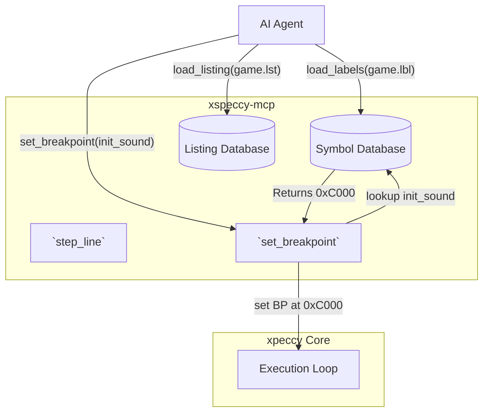
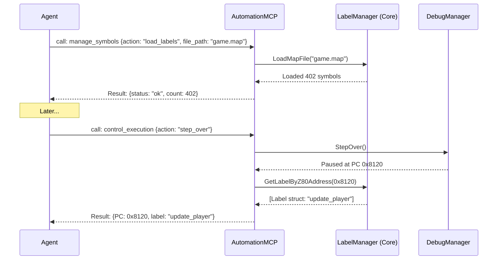

# Symbols and Source-Level Debugging

## 1. Overview and Scope

This capability domain transforms the emulator from a raw machine-code debugger (dealing only in hex values like `0x8000`) into a source-level IDE (dealing in human concepts like `main_loop` or `player.cpp:42`). It is the absolute highest-leverage feature for AI automation, as LLMs natively reason in semantic concepts rather than memory offsets.

### Scope Items
*   **Symbol Tables (Labels)**: Mapping string names to memory addresses (e.g., `init_video` -> `0x8120`).
*   **Listings (Source Maps)**: Mapping memory addresses back to specific lines of source code in external files (e.g., `0x8120` -> `video.asm`, line 15).
*   **Semantic Resolution**: Allowing all tools (breakpoints, memory readers, execution logic) to accept labels instead of raw addresses.
*   **Source-Level Stepping**: Executing the CPU until the program counter moves to a different line in the source code.

---

## 2. Developer & Reverse Engineer Usage Rank: **9/10**

### 2.1 Usage Frequency
**Critical / Very High.** If symbol information is available, an AI agent will use it exclusively. 

### 2.2 Developer Perspective
A homebrew developer writes code in `sjasmplus` or `z88dk`. When testing, they do not want the AI to say "Breakpoint hit at 0x93A1". They want the AI to say "Breakpoint hit at `enemy_ai.asm:45`". This domain provides the mapping required for that experience.

### 2.3 Reverse Engineer Perspective
Reverse engineers using Ghidra or IDA Pro spend hours labeling functions. They can export a `.map` file, load it into the emulator, and suddenly the live dynamic analysis uses the exact same semantic names as their static analysis tool.

---

## 3. xspeccy-mcp Offering Analysis

xspeccy-mcp's implementation of source-level debugging is its crowning achievement. It integrates tightly with the `sjasmplus` toolchain.

### 3.1 The Tools
*   **`load_labels`**: Loads a `.map` or `.lbl` file.
*   **`resolve_symbol`**: Looks up an address to get a name, or a name to get an address.
*   **`load_listing`**: Loads a `.lst` file generated by the compiler.
*   **`source_at`**: Given an address, returns the exact line of assembly code that generated it, along with 5 lines of context above and below.
*   **`step_line`**: Runs the emulator. Instead of stopping after 1 instruction, it stops when the PC lands on an address that corresponds to a *different* source line in the `.lst` file.
*   **`run_to_line`**: Runs the emulator until a specific source file and line number is hit.

### 3.2 Deep Dive: Pervasive Symbol Integration
The true power of xspeccy-mcp is that labels work *everywhere*.
If you call `step_over`, the result payload doesn't just say `PC: 32768`. It says `PC: 32768, label: "main_loop"`.
If you call `set_breakpoint {address: "render_sprite"}`, it automatically resolves the name and sets the breakpoint at the correct physical bank and offset.

### 3.3 Architectural Diagram (xspeccy-mcp Symbol Flow)



---

## 4. Unreal-NG Current State

**Unreal-NG already possesses a deeply integrated and highly sophisticated LabelManager!**

### 4.1 Feature Realities
Contrary to initial assumptions, forensic code analysis reveals that Unreal-NG has had a `LabelManager` (`core/src/debugger/labels/labelmanager.h`) since October 2020, with a massive architectural upgrade applied in June 2025. 
*   **Format Support**: It natively parses `.map`, `.sym`, `.lbl` (VICE), `sjasm`, and `z88dk` symbol files.
*   **Bank Awareness**: Symbols are stored with full `MemoryBankModeEnum` context, perfectly resolving the "bank 5 vs bank 7" paging ambiguity.
*   **Core Integration**: The `LabelManager` is already injected directly into the `DebugManager` and `Z80Disassembler`. The C++ core natively annotates disassembly and breakpoint events with symbol names.

---

## 5. Plan for Superiority: Exposing the Core Symbol Subsystem

The architectural gap is not in the C++ core; the gap is entirely in the **Automation layer**. The WebAPI currently lacks the endpoints to expose the existing `LabelManager` to the AI. To defeat xspeccy-mcp, Unreal-NG simply needs to expose its superior `LabelManager` via a new Smart Tool.

### 5.1 The `manage_symbols` Smart Tool

We will implement a `manage_symbols` tool in the `AutomationMCP` router that directly interfaces with the existing `LabelManager`.

```json
{
  "name": "manage_symbols",
  "description": "Load and resolve symbol tables for semantic debugging.",
  "inputSchema": {
    "type": "object",
    "properties": {
      "action": {
        "type": "string",
        "enum": ["load_labels", "resolve_address", "resolve_name", "clear"]
      },
      "file_path": { "type": "string", "description": "Absolute path to the .map or .sym file." },
      "symbol_name": { "type": "string" },
      "address": { "type": "integer" }
    },
    "required": ["action"]
  }
}
```

### 5.2 Architectural Diagram (Unreal-NG Exposing Existing LabelManager)



### 5.3 Achieving Parity and Superiority

While exposing `LabelManager` provides immediate feature parity with `xspeccy-mcp`, we will implement several "killer features" in the WebAPI bridge to achieve absolute superiority in both **speed** and **convenience**:

#### 1. Zero-Friction Auto-Reloading (Convenience)
`xspeccy-mcp` forces the AI to manually call `load_labels` every time the source code recompiles. Unreal-NG's `AutomationMCP` will use file-system watchers (`QFileSystemWatcher` or OS-native equivalents) to monitor loaded `.map` or `.sym` files. If the developer (or the AI) recompiles the Z80 code, Unreal-NG will **automatically hot-reload** the symbol table in milliseconds. The AI never has to manage symbol synchronization—it's always perfectly up to date.

#### 2. Fuzzy Matching and Pattern Search (Convenience)
`xspeccy-mcp` requires exact string matches (e.g., `resolve_symbol {name: "main_loop"}`). If the AI hallucinates a slight typo, it fails. We will expose `LabelManager`'s internal iteration to provide regex/fuzzy matching: `manage_symbols {action: "search", pattern: "player_*_init"}`. This allows the AI to instantly discover the semantic layout of the binary without dumping 10,000 lines of symbols into its context window.

#### 3. Module-Scoped Queries (Token Speed)
Because Unreal-NG's `Label` struct natively tracks the `module` variable (e.g., "audio", "video", "physics"), we will allow the AI to request symbols scoped strictly to a module. Instead of requesting the entire binary's map, the AI can ask for `manage_symbols {action: "get_module", module: "audio"}`, receiving a tiny, highly-relevant JSON payload. This drastically cuts down LLM token processing time.

#### 4. Batch Resolution (Execution Speed)
JSON-RPC overhead can be costly if an AI needs to resolve 50 pointers in a table. `xspeccy-mcp` forces 50 separate RPC calls. The Unreal-NG WebAPI will offer batch resolution (`resolve_multiple: [0x8000, 0x8002, 0x8004]`), traversing the `std::map<uint16_t, Label>` natively in C++ and returning a bulk array in a fraction of a millisecond.

### 5.4 Conclusion on Symbols
Because Unreal-NG already spent years building and refining a world-class `LabelManager` in C++, we do not need to build the foundation from scratch. By bridging the existing `LabelManager` to the WebAPI and injecting these killer convenience wrappers (hot-reloading, fuzzy search, module scoping), Unreal-NG will provide an unbeatable, semantic-first debugging environment that eliminates token waste and maximizes AI reasoning speed.
