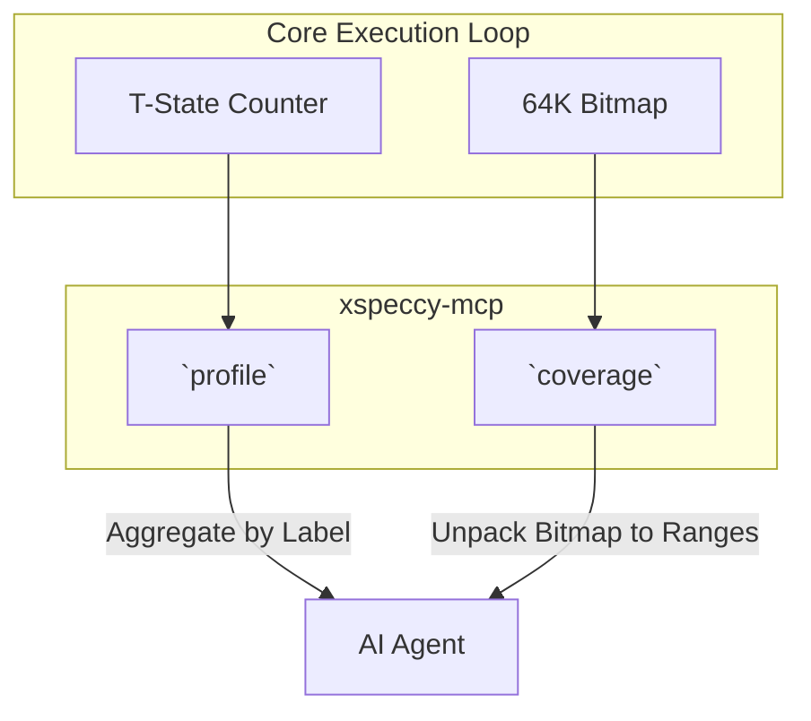
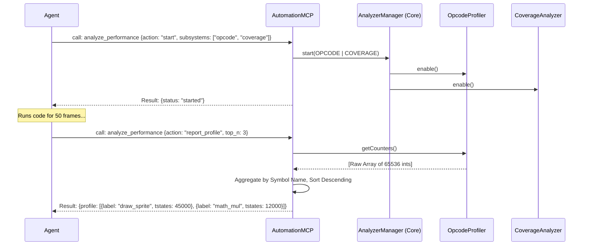

# Analysis and Profiling Capabilities

## 1. Overview and Scope

This capability domain covers the telemetry and metrics required to optimize code performance, track execution history, and ensure code path coverage. It moves beyond "is the code correct?" to answer "how fast is the code?" and "did all parts of the code actually run?".

### Scope Items
*   **Instruction & T-State Profiling**: Counting how many times specific instructions execute and how many clock cycles they consume.
*   **Call Tracing**: Recording a history of `CALL` and `RET` instructions to reconstruct a backtrace (execution ring buffer).
*   **Code Coverage**: Tracking a bitmap of physical memory addresses that have been executed to identify dead code or untested branches.
*   **Frame Cost Analysis**: Measuring the ratio of active execution time versus idle time (`HALT` loops) within a single 20ms frame.

---

## 2. Developer & Reverse Engineer Usage Rank: **8/10**

### 2.1 Usage Frequency
**High.** Used extensively during the final stages of development or when analyzing deeply obfuscated malware.

### 2.2 Developer Perspective
Demoscene and game developers operate under strict T-state budgets (e.g., exactly 69888 T-states per frame on a 48K machine). They use profilers to identify bottlenecks. Frame Cost Analysis is critical: if a frame takes 70000 T-states, the screen will tear. They use coverage tools to ensure their test suites actually exercise every branch of a new interrupt handler.

### 2.3 Reverse Engineer Perspective
Reverse engineers use trace ring buffers to figure out "how did I get here?" when a breakpoint hits deep inside an unknown binary. They use Code Coverage to identify which parts of an encrypted payload were actually decrypted and executed.

---

## 3. xspeccy-mcp Offering Analysis

xspeccy-mcp provides excellent built-in tools for this, heavily utilizing its symbol integration to make the output readable.

### 3.1 The Tools
*   **`profile`**: An advanced profiler. It doesn't just return raw addresses; it returns data grouped by symbol names (e.g., `draw_sprite: 14500 T-States, 20% of frame`). It supports self vs. inclusive time.
*   **`coverage`**: A simple but effective tool. You call `coverage {action: "start"}`, run the emulator, then `coverage {action: "stop"}`. It returns a list of memory ranges that were executed.
*   **`trace`**: Returns the last N executed Program Counters.
*   **`frame_cost`**: A dedicated tool that returns a breakdown of the last frame: `Total T-States: 69888, Active: 40000, Halted: 29888`.

### 3.2 Limitations of xspeccy-mcp
*   **Trace Context**: The `trace` tool just dumps PCs. It doesn't understand the call stack hierarchy, making it hard to read recursive calls.
*   **Overwhelming Output**: The `profile` tool can dump thousands of lines of JSON if not scoped properly, blowing up the LLM context limit.

### 3.3 Architectural Diagram (xspeccy-mcp Profiling)



---

## 4. Unreal-NG Current State

Unreal-NG has a massively powerful backend for this, but it is currently structured as raw WebAPI endpoints intended for a GUI or complex frontend, not an LLM.

### 4.1 The Analyzer Framework
Unreal-NG implements a pluggable `AnalyzerManager`. Currently, it has three subsystems:
1.  **Opcode Profiler**: Tracks execution counts and T-states per address.
2.  **Memory Profiler**: Tracks read/write frequencies per address.
3.  **Calltrace Profiler**: Highly advanced. Tracks the actual call hierarchy (`CALL` pushes to a stack, `RET` pops), allowing for flame-graph generation.

### 4.2 Existing WebAPI Coverage (18+ Endpoints)
*   `POST /api/v1/emulator/{id}/profiler/opcode/start`
*   `GET /api/v1/emulator/{id}/profiler/opcode/counters`
*   `GET /api/v1/emulator/{id}/profiler/calltrace/entries`
*   (And many more for pause/resume/clear/status).

### 4.3 Feature Gaps in MCP
*   **No Code Coverage Analyzer**: The core lacks a specific `CoverageAnalyzer` plugin.
*   **No Frame Cost tracking**: Idle vs Active time is not explicitly measured per-frame.
*   **MCP Exposure**: These 18 endpoints are currently relegated to the Router (`invoke_api`). Expecting the AI to coordinate starting, stopping, and reading 3 different profilers via raw HTTP paths is highly inefficient.

---

## 5. Plan for Superiority: The `analyze_performance` Smart Tool

To surpass xspeccy-mcp, we will build the missing core plugins and aggregate the 18 WebAPI endpoints into a single, highly intelligent Smart Tool.

### 5.1 Implement Core Plugins
1.  **CoverageAnalyzer**: A new C++ plugin in the core that maintains a bit-array of physical memory. It sets a bit whenever an address is executed.
2.  **Frame Cost Metrics**: Add `tstates_active` and `tstates_halted` tracking to the `Machine` class, updated every frame interrupt.

### 5.2 The `analyze_performance` Smart Tool Schema
This tool abstracts the complexity of the Analyzer Framework.

```json
{
  "name": "analyze_performance",
  "description": "Control profiling, tracing, and code coverage analysis.",
  "inputSchema": {
    "type": "object",
    "properties": {
      "action": {
        "type": "string",
        "enum": ["start", "stop", "clear", "report_profile", "report_trace", "report_coverage", "frame_cost"]
      },
      "target": { "type": "string", "default": "auto" },
      "subsystems": {
        "type": "array",
        "items": { "type": "string", "enum": ["opcode", "memory", "calltrace", "coverage"] },
        "description": "Which analyzers to start/stop. Defaults to all."
      },
      "top_n": {
        "type": "integer",
        "description": "For report_profile, only return the N most expensive functions to save LLM context.",
        "default": 10
      }
    },
    "required": ["action"]
  }
}
```

### 5.3 Architectural Diagram (Unreal-NG Profiling Flow)



### 5.4 Conclusion on Analysis
By aggregating Unreal-NG's superior backend (like hierarchical call tracing) behind a single Smart Tool, and limiting output using `top_n` aggregations, the AI can perform deep performance analysis without drowning in token-heavy JSON dumps.
