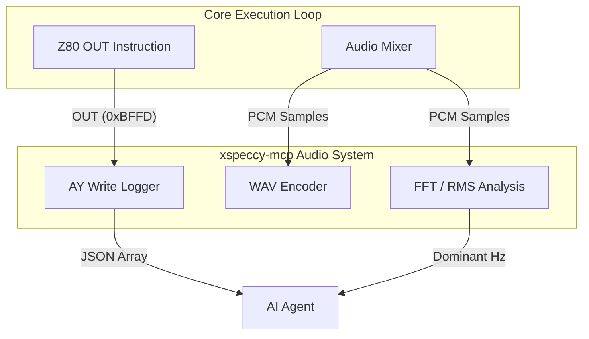
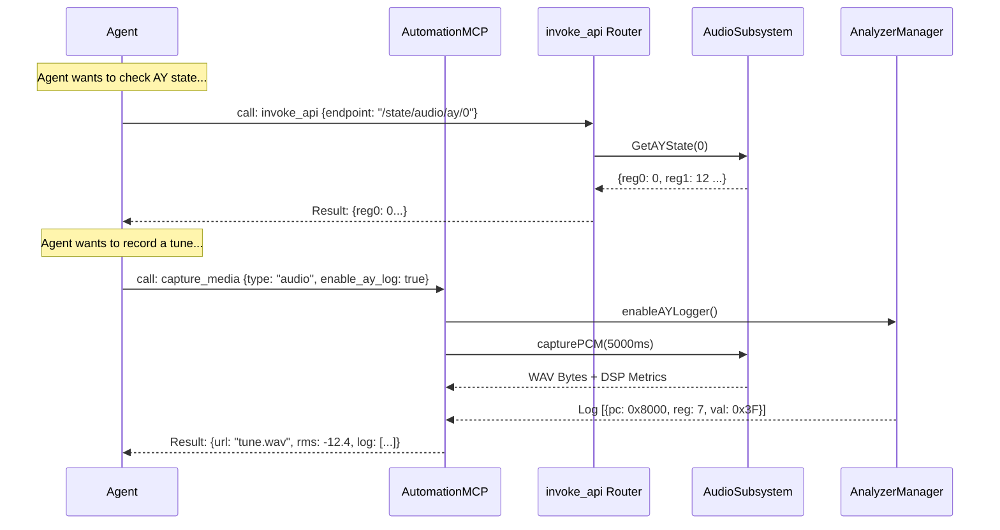

# Sound Capabilities

## 1. Overview and Scope

This capability domain covers the inspection and recording of the emulator's audio output. The ZX Spectrum is renowned for its diverse audio hardware upgrades, ranging from the original 1-bit beeper to the 3-channel AY-3-8910 (and dual AY setups like TurboSound), the General Sound (GS), and the Covox DAC.

### Scope Items
*   **Hardware State Inspection**: Reading the raw registers of audio chips (e.g., AY registers 0-15).
*   **Synthesized Output Analysis**: Inspecting the final mixed volumes and active frequencies of channels.
*   **Audio Capture (PCM)**: Recording the master audio output to a `.wav` file.
*   **Instruction-Level Audio Logging**: Logging the exact T-state, PC, and value of every `OUT` instruction that wrote to an audio port.

---

## 2. Developer & Reverse Engineer Usage Rank: **7/10**

### 2.1 Usage Frequency
**Moderate.** Used heavily by a specific subset of developers (demoscene coders, musicians writing trackers), but less frequently by general software developers or malware analysts.

### 2.2 Developer Perspective
A chiptune artist writing a new PT3 player routine needs to verify that their timing loop writes to the AY registers exactly once per frame. If the music sounds glitchy, they need to see a log of every `OUT (0xBFFD)` instruction to find the race condition.

### 2.3 Reverse Engineer Perspective
Reverse engineers occasionally use audio tools to rip music from undocumented formats. By capturing the AY register write log while a game plays, they can perfectly recreate the track in a modern player without understanding the proprietary playback engine.

---

## 3. xspeccy-mcp Offering Analysis

xspeccy-mcp has an incredibly deep offering tailored specifically for chiptune debugging.

### 3.1 The Tools
*   **`ay_state`**: Returns the decoded state of the AY chip (Channel A/B/C frequency, volume, envelope, noise).
*   **`sound_state`**: A master aggregate tool returning the state of all chips (beeper, AY, GS, SAA1099, mixed).
*   **`audio_capture`**: Starts capturing audio. When stopped, it returns standard metrics (RMS, peak volume, dominant frequency) AND a URL to a `.wav` file. Crucially, it also starts an `AY Write Log`.
*   **`ay_writes`**: Paginates through the `AY Write Log` captured by `audio_capture`.

### 3.2 Deep Dive: The AY Write Log
This is xspeccy-mcp's standout feature in this domain. When `audio_capture` is active, every single time the Z80 CPU executes an `OUT` instruction to an AY port, the server logs:
`{ "tstate": 1450000, "pc": "0x8154", "reg": 7, "val": 0x3F }`
This allows the AI to perfectly trace audio glitches back to the exact line of assembly code.

### 3.3 Architectural Diagram (xspeccy-mcp Audio Flow)



---

## 4. Unreal-NG Current State

Unreal-NG's audio inspection is extremely thorough, supporting more chips than Xpeccy, but it lacks the capture and logging capabilities.

### 4.1 Existing WebAPI Coverage
Unreal-NG has a rich set of state endpoints:
*   `GET /api/v1/emulator/{id}/state/audio/channels`
*   `GET /api/v1/emulator/{id}/state/audio/ay/{chip}/register/{reg}`
*   `GET /api/v1/emulator/{id}/state/audio/beeper`
*   `GET /api/v1/emulator/{id}/state/audio/gs`
*   `GET /api/v1/emulator/{id}/state/audio/covox`

### 4.2 Feature Gaps in MCP
*   **No PCM Capture**: The WebAPI cannot currently stream or save audio output.
*   **No AY Write Log**: There is no mechanism to log `OUT` instructions mapped to their PC and T-state.
*   **No DSP Analysis**: The WebAPI does not run FFTs to find dominant frequencies or RMS volumes.

---

## 5. Plan for Superiority: The `capture_media` and Router Tiers

To beat xspeccy-mcp, we will implement the missing logging in the core, but we will not elevate all audio tools to Smart Tools to save LLM context.

### 5.1 Core Implementation
1.  **AY Logger Plugin**: Build an Analyzer plugin that intercepts `OUT` writes to `0xBFFD`/`0xFFFD` and logs them in a ring buffer.
2.  **DSP Pipeline Architecture**: To provide the AI with actionable audio telemetry, the `CaptureAPI` will embed a high-performance DSP (Digital Signal Processing) pipeline (using KissFFT or a vectorized math block). The pipeline operates on the mixed PCM output buffer before it is encoded to WAV.
    *   **RMS (Root Mean Square) Volume**: Calculated across the captured PCM buffer to determine the perceived loudness. The formula is $RMS = \sqrt{\frac{1}{N} \sum_{i=1}^{N} x_i^2}$, where $x_i$ is the amplitude of each sample (normalized -1.0 to 1.0) and $N$ is the total samples. The result is converted to decibels Full Scale (dBFS) via $20 \times \log_{10}(RMS)$. This allows the AI to programmatically verify if sound is actually playing (e.g., RMS > -60dBFS) or if the channel is silent.
    *   **Peak Volume**: Scans the absolute value of all PCM samples in the buffer to find the maximum amplitude $\max(|x_i|)$. Also returned in dBFS. This metric is critical for the AI to detect audio clipping or distortion (where Peak approaches or hits 0.0 dBFS).
    *   **Dominant Frequency Analysis**: The PCM buffer is first passed through a windowing function (e.g., Hann window) to reduce spectral leakage, followed by a Fast Fourier Transform (FFT). The resulting frequency bins are scanned to find the bin with the highest magnitude. The formula $Frequency = BinIndex \times \frac{SampleRate}{FFTSize}$ yields the dominant frequency in Hertz (Hz). This is heavily utilized by AI agents to verify pitch accuracy in chiptune routines (e.g., verifying that a generated beep hits exactly 440Hz).

### 5.2 Smart Tool vs Router Strategy
Audio debugging is a niche activity. 
*   We will **NOT** create a dedicated `audio_state` Smart Tool. The sheer volume of JSON returned by 16 AY registers would bloat the LLM context.
*   Instead, audio state endpoints will remain accessible via the **Router** (`invoke_api`). An AI instructed to "debug the audio" will naturally search the OpenAPI spec, find `/state/audio/ay/0`, and invoke it.
*   The **Capture** functionality, however, will be added to the `capture_media` Smart Tool (see `06-vision-and-media`), as generating a `.wav` file is a high-level action.

### 5.3 Extension to `capture_media` Schema

```json
{
  "name": "capture_media",
  "inputSchema": {
    "type": "object",
    "properties": {
      "type": { "type": "string", "enum": ["screenshot", "video", "audio"] },
      "audio_duration": { "type": "integer", "description": "Milliseconds to record." },
      "enable_ay_log": { "type": "boolean", "description": "If true, returns the AY Write Log in the response." }
    }
  }
}
```

### 5.4 Architectural Diagram (Unreal-NG Audio Plan)



### 5.5 Conclusion on Sound
By keeping routine register inspection in the Router tier, Unreal-NG saves precious LLM context for 95% of tasks that don't involve audio. By building a high-performance AY Logger into the Analyzer core, we match xspeccy-mcp's best feature for the 5% of tasks that do.
