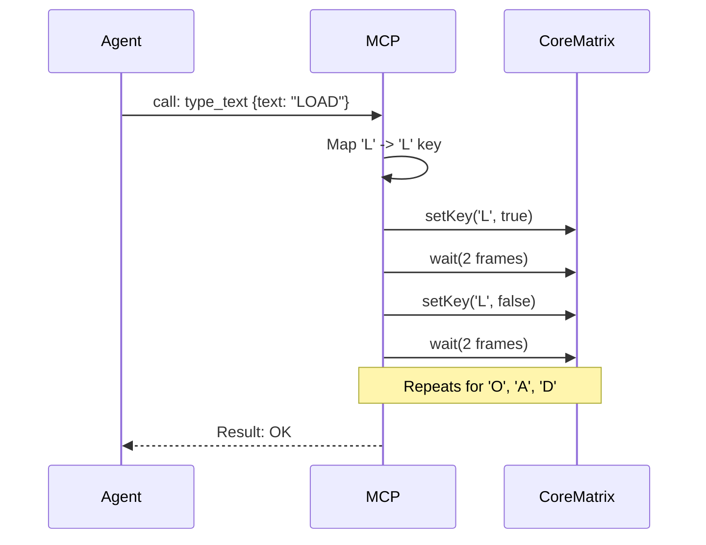
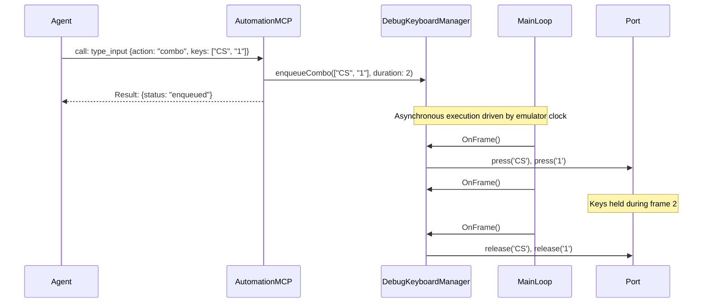

# Input Injection Capabilities

## 1. Overview and Scope

This capability domain governs the AI agent's ability to act as a human user sitting at the keyboard of the emulator. It is the primary means of interacting with the emulated software (e.g., typing `LOAD ""`, selecting menu options, or playing a game).

### Scope Items
*   **Single Key Operations**: Pressing, holding, and releasing individual ZX Spectrum keys (e.g., `Enter`, `Space`, `Symbol Shift`).
*   **String Typing**: Automatically converting ASCII strings into the correct sequence of ZX Spectrum keypresses and shifts.
*   **Key Combos**: Pressing multiple keys simultaneously (e.g., `CTRL + ALT + DEL` equivalents, or `Kempston Fire + Right`).
*   **Macro Execution**: Playing back pre-recorded sequences of inputs with frame-accurate timing.
*   **Hardware Interface**: Interacting directly with the 8x5 keyboard matrix at Port `#FE`.

---

## 2. Developer & Reverse Engineer Usage Rank: **8/10**

### 2.1 Usage Frequency
**High.** Almost every automated test or debugging session requires some form of input to bootstrap the environment or trigger the code path under investigation.

### 2.2 Developer Perspective
Developers use input injection to automate CI tests. For example, a script might load a game snapshot, wait 50 frames, inject `Press 1` to bypass the main menu, wait 100 frames, inject `Press Space` to start the level, and then verify the memory state.

### 2.3 Reverse Engineer Perspective
Reverse engineers use it similarly. If analyzing a copy-protection routine that demands a password, the AI agent needs a robust way to type that password into the emulated prompt without fighting the emulator's polling rate.

---

## 3. xspeccy-mcp Offering Analysis

xspeccy-mcp provides three direct tools for keyboard manipulation. They are functional but rudimentary.

### 3.1 The Tools
*   **`press_key`**: Takes a key name (e.g., "ENTER") and a duration in frames. It holds the key down for that duration.
*   **`type_text`**: Takes a string. It translates the string into ZX Spectrum keys, automatically pressing `Caps Shift` or `Symbol Shift` as needed.
*   **`release_keys`**: A panic button that clears the keyboard matrix if a script fails while holding a key.

### 3.2 Limitations of xspeccy-mcp
*   **Timing Fragility**: The `type_text` tool relies on hardcoded delays between keypresses. If the emulated software is polling the keyboard very slowly (e.g., inside a heavy game loop), the tool might "type" too fast, resulting in dropped characters.
*   **No Combos**: There is no tool to explicitly hold `Symbol Shift` + `P` simultaneously for N frames. `type_text` handles ASCII, but what about game controls (Up + Fire)?

### 3.3 Architectural Diagram (xspeccy-mcp Input)



---

## 4. Unreal-NG Current State

Unreal-NG is **massively superior** in this category due to its dedicated `DebugKeyboardManager`.

### 4.1 The `DebugKeyboardManager` Architecture
Instead of blindly writing to the `#FE` port matrix, Unreal-NG's input injection is decoupled from the hardware and driven by the `MainLoop` `OnFrame` hook. This ensures that every injected keypress is held for exactly the right number of VSYNC interrupts, guaranteeing that the Z80 CPU sees it regardless of its polling frequency.

### 4.2 Existing WebAPI Coverage
Unreal-NG exposes 10 endpoints for input:
*   `POST /api/v1/emulator/{id}/keyboard/tap`
*   `POST /api/v1/emulator/{id}/keyboard/press`
*   `POST /api/v1/emulator/{id}/keyboard/release`
*   `POST /api/v1/emulator/{id}/keyboard/combo`
*   `POST /api/v1/emulator/{id}/keyboard/macro`
*   `POST /api/v1/emulator/{id}/keyboard/type`
*   `POST /api/v1/emulator/{id}/keyboard/release_all`
*   `POST /api/v1/emulator/{id}/keyboard/abort`
*   `GET /api/v1/emulator/{id}/keyboard/status`
*   `GET /api/v1/emulator/{id}/keyboard/keys`

### 4.3 Feature Gaps in MCP
*   **None.** The backend is perfect. The only gap is that these endpoints need to be aggregated into a single Smart Tool so the LLM doesn't have to navigate 10 different OpenAPI paths.

---

## 5. Plan for Superiority: The `type_input` Smart Tool

We will expose the full power of the `DebugKeyboardManager` through a single `type_input` Smart Tool.

### 5.1 The `type_input` Tool Schema

```json
{
  "name": "type_input",
  "description": "Inject keyboard input into the emulator. Supports human-like typing, precise key tapping, and multi-key combos.",
  "inputSchema": {
    "type": "object",
    "properties": {
      "action": {
        "type": "string",
        "enum": ["type", "tap", "combo", "macro", "release_all"]
      },
      "target": { "type": "string", "default": "auto" },
      "text": { 
        "type": "string", 
        "description": "Used with 'type'. The ASCII string to type (e.g., 'LOAD \"\"')." 
      },
      "key": { 
        "type": "string", 
        "description": "Used with 'tap'. A specific ZX key name (e.g., 'ENTER', 'CS', 'SPACE')." 
      },
      "keys": {
        "type": "array",
        "items": { "type": "string" },
        "description": "Used with 'combo'. Array of keys to press simultaneously."
      },
      "frames": {
        "type": "integer",
        "description": "How long to hold the key(s) down. Default is 2 frames.",
        "default": 2
      }
    },
    "required": ["action"]
  }
}
```

### 5.2 Architectural Diagram (Unreal-NG Input Flow)



### 5.3 Conclusion on Input
Unreal-NG already won this category at the backend level. By wrapping the 10 WebAPI endpoints into a single, clean `type_input` Smart Tool, we provide the AI with perfectly synchronized, glitch-free input injection while using minimal LLM tokens. The ability to execute asynchronous `combos` and `macros` goes far beyond what xspeccy-mcp can offer.
