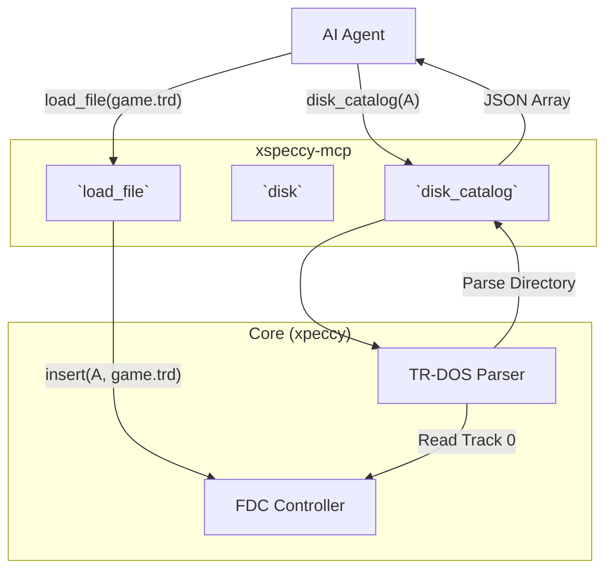
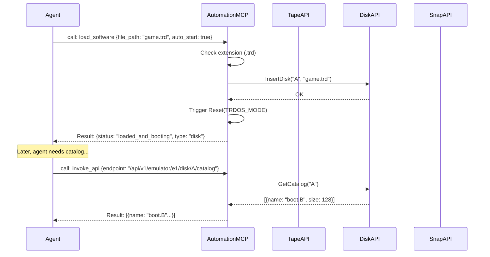

# Files and Storage Capabilities

## 1. Overview and Scope

This capability domain covers the loading and saving of emulator state via external files. This includes monolithic snapshots (`.sna`, `.z80`), virtual tape cassettes (`.tap`, `.tzx`), and virtual floppy disks (`.trd`, `.scl`).

### Scope Items
*   **File Loading**: Injecting a software image from the host filesystem into the emulator.
*   **Tape Management**: Controlling the virtual cassette deck (play, stop, rewind) and inspecting tape blocks.
*   **Disk Management**: Controlling the Floppy Disk Controller (FDC), inserting/ejecting virtual disks in drives A-D.
*   **Snapshot Saving**: Serializing the current state of the emulator to a file.
*   **Media Inspection**: Reading TR-DOS catalogs or raw disk sectors without booting the emulator.

---

## 2. Developer & Reverse Engineer Usage Rank: **9/10**

### 2.1 Usage Frequency
**Very High.** Every debugging session begins by loading a file.

### 2.2 Developer Perspective
A developer testing a new game build will compile it to a `.tap` or `.sna` file, then immediately ask the AI to "load the latest build and run it". They rely on the file loader to instantly inject their code into the test environment.

### 2.3 Reverse Engineer Perspective
Reverse engineers frequently work with disk images (`.trd`). They need to inspect the TR-DOS catalog to see what files are on the disk, extract specific sectors to bypass protection, and save memory snapshots (`.sna`) at critical moments (e.g., right after a payload decrypts) so they can resume analysis later without waiting for the unpacking process again.

---

## 3. xspeccy-mcp Offering Analysis

xspeccy-mcp provides a functional suite of file tools, heavily leveraging the underlying Xpeccy core's format parsing.

### 3.1 The Tools
*   **`load_file`**: An incredibly convenient tool. It takes a filepath. It auto-detects the type based on extension (`.sna`, `.tap`, `.trd`, etc.) and performs the correct insertion (e.g., putting a `.trd` in Drive A).
*   **`tape`**: A Swiss-army knife for cassettes. Accepts actions: `play`, `stop`, `rewind`, `eject`, `blocks`. `blocks` returns a JSON array of the tape structure (headers, data blocks, lengths).
*   **`disk`**: Manages floppy drives. Actions: `insert`, `eject`, `save`, `state` (returns drive motor/track info).
*   **`disk_catalog`**: Parses a TR-DOS disk in a specific drive and returns a JSON list of files, sizes, and start sectors.
*   **`save_snapshot`**: Dumps the current machine state to a `.sna` file.

### 3.2 Limitations of xspeccy-mcp
*   **No Raw Sector Access**: The `disk` tools manage the drives, but there is no tool to say "read Sector 5, Track 0, Side 1 of Drive A".
*   **Context Bloat**: `disk_catalog` and `tape` blocks are injected directly into the LLM context as Smart Tools. If a disk has 128 files, the AI is flooded with JSON.

### 3.3 Architectural Diagram (xspeccy-mcp Files)



---

## 4. Unreal-NG Current State

Unreal-NG is **massively superior** in this category. Its FDC (Floppy Disk Controller) emulation and media parsing is industry-leading, built for high-fidelity preservation.

### 4.1 Existing WebAPI Coverage
Unreal-NG exposes 21 endpoints for file management, separated logically:
*   **Tape**: `POST /tape/load`, `play`, `stop`, `rewind`, `eject`, `GET /tape/info`
*   **Snapshot**: `POST /snapshot/load`, `POST /snapshot/save`, `GET /snapshot/info`
*   **Disk Control**: `POST /disk/{drive}/insert`, `eject`, `create`, `GET /disk/{drive}/info`
*   **Disk Telemetry**: `GET /disk/{drive}/catalog` (TR-DOS), `GET /disk/sector`, `GET /disk/track`, `GET /disk/image`

### 4.2 Unreal-NG's Superiority: Deep Telemetry
Unreal-NG allows reading raw tracks and sectors via the WebAPI. This allows reverse engineers to inspect custom disk loaders or MFM timing protections that xspeccy-mcp cannot even see.

### 4.3 Feature Gaps in MCP
*   **No `load_file` Aggregator**: Because the WebAPI is strictly RESTful, an AI agent must know the file extension, decide if it's a tape or a disk, format the correct URL (`/tape/load` vs `/disk/A/insert`), and send the request. This is too much friction.

---

## 5. Plan for Superiority: The `load_software` Smart Tool and Router Segregation

To beat xspeccy-mcp, we will implement the auto-detecting `load_software` Smart Tool to minimize AI friction, while leaving the deep disk telemetry in the Router tier to protect LLM context.

### 5.1 The `load_software` Smart Tool
This tool replicates the convenience of xspeccy-mcp's `load_file`, automatically routing the file to the correct internal subsystem based on its extension or magic bytes.

```json
{
  "name": "load_software",
  "description": "Load a snapshot, tape, or disk image into the emulator. Auto-detects file type.",
  "inputSchema": {
    "type": "object",
    "properties": {
      "target": { "type": "string", "default": "auto" },
      "file_path": { 
        "type": "string",
        "description": "Absolute path to the .sna, .z80, .tap, .tzx, .trd, or .scl file." 
      },
      "drive": {
        "type": "string",
        "enum": ["A", "B", "C", "D"],
        "description": "Required only if loading a disk image. Defaults to 'A'.",
        "default": "A"
      },
      "auto_start": {
        "type": "boolean",
        "description": "If true, automatically issues a reset/play command to boot the software.",
        "default": true
      }
    },
    "required": ["file_path"]
  }
}
```

### 5.2 Router Segregation and Catalog Filtering
*   We will **NOT** create a `disk_catalog` Smart Tool. 
*   If an agent needs to read a TR-DOS (or any other supported FS) catalog, it will use the `search_api` to find `GET /disk/{drive}/catalog` and execute it via `invoke_api`.
*   **Optional Catalog Filtering**: To prevent massive context bloat when reading catalogs with dozens or hundreds of files (e.g., TR-DOS, +3DOS, FAT), the WebAPI `catalog` endpoint must support optional glob/regex filtering (e.g., `GET /disk/A/catalog?filter=*.B` or `?filter=boot.*`). The AI can use this to fetch only the metadata for the specific files it cares about, rather than dumping up to 128 file entries into its context window.
*   This ensures that the 7 "Core Smart Tools" remain incredibly focused on execution, state inspection, and bootstrapping, while the massive, niche capabilities of the FDC remain accessible but out of the default context window.

### 5.3 Architectural Diagram (Unreal-NG File Flow)



### 5.4 Conclusion on Files
By providing a unified, auto-detecting `load_software` tool, Unreal-NG matches the ease-of-use of xspeccy-mcp. By leveraging the Router pattern for complex disk inspections, Unreal-NG far exceeds xspeccy-mcp's analytical capabilities without suffering from JSON bloat in the AI's prompt.
