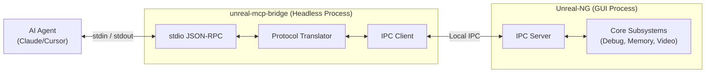

# MCP Stdin Bridge Architecture

## 1. The Architectural Challenge

The Model Context Protocol (MCP) standard dictates that local servers must communicate with AI agents (like Claude Desktop, Cursor, or Cline) using **JSON-RPC over `stdio`** (standard input/output). 

Unreal-NG is a heavy, multi-threaded, cross-platform Qt GUI application. Attempting to bind a standard `stdio` loop directly inside the main GUI process is architecturally fraught with peril:
1.  **Platform Limitations**: Windows GUI subsystem applications (`WinMain`) detach from the console by default. macOS `.app` bundles do not have a standard console attached when launched via Finder or double-click.
2.  **Blocking IO**: Reading from `cin` is blocking. Doing this safely in a Qt event-driven architecture requires dedicated threads and complex signal/slot marshalling.
3.  **Crash Resilience**: If the emulator crashes, the MCP server dies, leaving the AI agent hanging without a graceful error message.

## 2. The Solution: `unreal-mcp-bridge`

We will implement the MCP server as a **standalone, lightweight C++ daemon** called `unreal-mcp-bridge`. 

This bridge process acts as a protocol translator and IPC (Inter-Process Communication) proxy:
*   **The AI-Facing Interface**: It binds strictly to `stdin` and `stdout`, parsing incoming JSON-RPC messages from the AI agent and ensuring strict compliance with the MCP specification.
*   **The Emulator-Facing Interface**: It communicates with the running Unreal-NG GUI application over a fast local transport.



## 3. The Transport Debate: WebAPI vs gRPC/Protobuf

Currently, Unreal-NG's primary external automation layer is the Drogon-backed `AutomationWebAPI` (HTTP REST/JSON on port 8090). 

**Should the bridge just use the WebAPI, or is there a case for gRPC / Protobuf?**

**Answer: We absolutely must introduce a binary transport (gRPC/Protobuf or shared memory) for the bridge.**

### 3.1 The Problem with WebAPI (Double Serialization)

**Why is `xspeccy-mcp` currently more efficient in data transfer?**
Because `xspeccy-mcp` is a headless **monolith**. The MCP `stdio` loop, the JSON parser, and the emulator core all live inside the exact same C++ process and share the same memory space. When the AI requests a 48KB memory dump, `xspeccy-mcp` simply reads the emulator's memory pointer, Base64 encodes it, and writes it directly to `stdout`. It serializes the data exactly *once*.

Unreal-NG, however, requires a dual-process architecture (`unreal-mcp-bridge` + `Unreal-NG GUI`) to prevent the GUI from hanging. If the bridge uses the existing REST WebAPI to cross this IPC boundary, we incur a massive "Double Serialization" penalty:
1. AI Agent sends a JSON string via `stdin`.
2. Bridge parses the JSON.
3. Bridge serializes the request into a *new* HTTP JSON payload.
4. Bridge sends HTTP POST to Unreal-NG over loopback.
5. Unreal-NG parses the HTTP JSON payload.
6. Unreal-NG does the work (e.g., extracts a 48KB memory buffer).
7. Unreal-NG serializes the 48KB buffer into a massive Base64 JSON string.
8. Bridge parses the Base64 JSON string.
9. Bridge serializes it *again* into a JSON-RPC response and writes to `stdout`.

For simple commands (`step_over`), this overhead is negligible. For high-bandwidth AI tasks like **Semantic Frame Diffing**, **Video Recording Extraction**, or **Bulk Memory/Symbol Dumps**, this double-parsing of massive strings will introduce brutal latency and completely negate Unreal-NG's C++ speed advantage.

### 3.1.1 Real-World Benchmark: WebAPI vs The Real-Time Threshold
To validate this architectural bottleneck, a live benchmark was run against Unreal-NG's WebAPI (`/api/v1/emulator/{id}/memory/page/ram/5`), requesting a single 16KB memory page:

```text
--- 16KB PAGE READ BENCHMARK (WebAPI REST) ---
Raw RAM size requested:                 16,384 bytes
Actual JSON HTTP Payload size:          48,459 bytes
Bloat factor (JSON Array vs Raw Bytes): 2.96x
Drogon C++ Serialization + Network:     10.41 ms
Python JSON Parse time:                 0.98 ms
------------------------------------------------
Average TOTAL time per 16KB page:       11.39 ms
Estimated time for full 64KB dump:      45.54 ms
```

> [!NOTE]
> **Encoding Discrepancy**: The OpenAPI spec documents this endpoint as returning "base64 encoded" data, but the actual C++ implementation ([state_memory_api.cpp:L648](../../core/automation/webapi/src/api/state_memory_api.cpp)) builds a `Json::arrayValue` of integers (`[0,0,255,12,...]`), producing 2.96× bloat. Had it used proper base64 encoding, the bloat would be only ~1.33×, and total latency would drop to roughly ~15ms for a 64KB dump. Fixing the encoding to base64 is a worthwhile optimization regardless of whether gRPC is adopted.

**The Real-Time Failure**: The ZX Spectrum runs at 50 FPS, yielding a hard compute budget of **20ms per frame**. Over the WebAPI, extracting a full 64KB frame of memory takes ~45.5ms just to serialize and cross the IPC boundary. This makes cycle-accurate, real-time AI frame diffing physically impossible over REST JSON.

### 3.2 The Superiority of gRPC / Protobuf
By exposing a local **gRPC** server (or a raw Unix Domain Socket / Named Pipe with Protobuf framing) in Unreal-NG specifically for automation:
*   **Zero-Copy Binary Payloads**: A 48KB memory chunk is just 48KB of raw bytes in a Protobuf byte array. No Base64 encoding/decoding overhead.
*   **Single Serialization**: The Bridge parses the AI's JSON *once*, packs it into a highly efficient binary Protobuf struct in microseconds, and fires it over the IPC pipe.
*   **Strong Typing**: Protobuf guarantees the schema between the Bridge and the Emulator, eliminating a massive class of REST-related bugs (missing fields, wrong HTTP methods, malformed JSON).
*   **Streaming**: gRPC natively supports bi-directional streaming. This allows Unreal-NG to continuously stream profiling telemetry, audio buffers, or video frames to the Bridge, which can then batch them into MCP notifications for the AI.

### 3.3 Implementation Strategy
1.  **Phase 1 (Prototyping)**: The `unreal-mcp-bridge` will temporarily use the existing `AutomationWebAPI` (JSON over HTTP) to achieve MVP (Minimum Viable Product) and validate the 48 AI tools.
2.  **Phase 2 (High-Performance)**: We introduce `AutomationgRPC` into Unreal-NG using Protocol Buffers. The Bridge swaps its backend transport from HTTP to gRPC. All high-bandwidth data (video fragments, screen digests, memory ranges) bypass JSON entirely until the very last millisecond when the Bridge writes to `stdout`. 

This dual-process, Protobuf-backed architecture ensures Unreal-NG remains a completely stable GUI application, while providing the AI with the fastest, lowest-latency MCP server ever built for an emulator.
