# DeZog Workflows — What the Debugger Actually Does

> **Audience:** anyone wiring, extending, or debugging the unreal-ng DZRP server.
> **Scope:** the *client-side story*. This document narrates what DeZog (the VS Code
> extension) does during each debugging workflow, which DZRP commands it emits, in
> what order, and why — so that when our emulator answers a command we understand
> the larger intent behind it.
>
> **Companion docs:**
> - [`dzrp-protocol-spec.md`](./dzrp-protocol-spec.md) — the wire format and per-command byte layout.
> - [`reverse-debugging.md`](./reverse-debugging.md) — the TTD-backed history model and the per-frame decode cache.
> - [`module-design.md`](./module-design.md) — how our server, protocol codec, and adapter are layered.
>
> **Grounding:** command IDs and flows here are cross-checked against the DeZog
> sources (`src/remotes/dzrp/dzrpremote.ts`, `src/remotes/remotebase.ts`,
> `src/remotes/cpuhistory.ts`, `src/disassembler/*`) and against our implementation
> in `core/automation/dezog/`.

---

## Table of Contents

1. [Mental model: who drives whom](#1-mental-model-who-drives-whom)
2. [The cast of characters](#2-the-cast-of-characters)
3. [Workflow: the connection handshake](#3-workflow-the-connection-handshake)
4. [Workflow: fetching state on every stop](#4-workflow-fetching-state-on-every-stop)
5. [Workflow: running the binary (continue)](#5-workflow-running-the-binary-continue)
6. [Workflow: stepping (into / over / out)](#6-workflow-stepping-into--over--out)
7. [Workflow: breakpoints and conditions](#7-workflow-breakpoints-and-conditions)
8. [Workflow: disassembly](#8-workflow-disassembly)
9. [Workflow: the memory view](#9-workflow-the-memory-view)
10. [Workflow: watches, WATCHPOINTs, and expression evaluation](#10-workflow-watches-watchpoints-and-expression-evaluation)
11. [Workflow: reverse debugging](#11-workflow-reverse-debugging)
12. [Workflow: session close](#12-workflow-session-close)
13. [Cross-cutting concerns](#13-cross-cutting-concerns)
14. [Command reference quick-map](#14-command-reference-quick-map)
15. [Reverse debugging workflows in depth](#15-reverse-debugging-workflows-in-depth)
16. [Remote feature matrix: CSpect vs ZEsarUX vs MAME](#16-remote-feature-matrix-cspect-vs-zesarux-vs-mame)

---

## 1. Mental model: who drives whom

The single most important thing to internalise: **DeZog is the brain, the emulator is
the hands.** Almost every piece of intelligence — disassembly, call-stack
reconstruction, step-over logic, watch evaluation, reverse debugging — lives in the
VS Code extension. Our emulator is a comparatively dumb, fast oracle that answers a
small vocabulary of primitive questions:

- "What are your registers?"
- "Give me *N* bytes starting at address *A*."
- "Run until you hit one of these breakpoints, then tell me why you stopped."
- "Set/clear a breakpoint or watchpoint."

This asymmetry is *deliberate* and it is the reason the protocol is so small
(~20 commands cover everything). It also explains a recurring surprise: when you
click "Step Over" in VS Code, the emulator never receives a "step over" command.
It receives a breakpoint set plus a `CMD_CONTINUE`. DeZog computes *where* stepping
over should land and expresses that intent purely in terms of the primitives above.

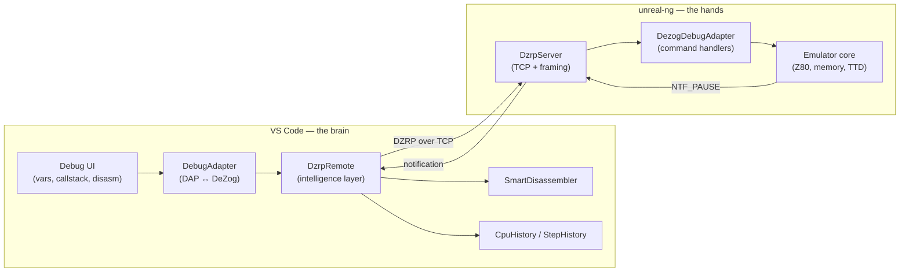
```mermaid
flowchart LR
    subgraph VSCode["VS Code — the brain"]
        UI["Debug UI<br/>(vars, callstack, disasm)"]
        DAP["DebugAdapter<br/>(DAP ↔ DeZog)"]
        REMOTE["DzrpRemote<br/>(intelligence layer)"]
        DISASM["SmartDisassembler"]
        HIST["CpuHistory / StepHistory"]
    end
    subgraph Emu["unreal-ng — the hands"]
        SRV["DzrpServer<br/>(TCP + framing)"]
        AD["DezogDebugAdapter<br/>(command handlers)"]
        CORE["Emulator core<br/>(Z80, memory, TTD)"]
    end
    UI --> DAP --> REMOTE
    REMOTE --> DISASM
    REMOTE --> HIST
    REMOTE -- "DZRP over TCP" --> SRV --> AD --> CORE
    CORE -- "NTF_PAUSE" --> SRV -- "notification" --> REMOTE
```

Keep this picture in mind through every workflow below: the arrows going *right*
are commands (DeZog asking), and the single arrow coming *left* is the notification
channel (the emulator volunteering that it stopped).

---

## 2. The cast of characters

| Component | Lives in | Responsibility |
|-----------|----------|----------------|
| **Debug UI** | VS Code | Renders variables, call stack, disassembly, memory, watches. Pure presentation. |
| **DebugAdapter** | DeZog | Translates the VS Code Debug Adapter Protocol (DAP) into DeZog's internal remote calls. |
| **DzrpRemote** | DeZog | The intelligence. Owns breakpoints, computes step targets, drives the continue loop, reconstructs the call stack. |
| **SmartDisassembler** | DeZog | Client-side Z80 disassembly from raw memory bytes. |
| **CpuHistory / StepHistory** | DeZog | Reverse-debugging engines that replay a recorded instruction history. |
| **DzrpServer** | unreal-ng | Accepts the TCP connection, does DZRP framing, dispatches payloads. |
| **DezogDebugAdapter** | unreal-ng | Implements each command against the live `Emulator`. Pauses on attach, records history. |
| **Emulator core** | unreal-ng | The Z80, memory banking, ports, and the Time-Travel (TTD) subsystem. |

Two framing rules govern every byte on the wire (full detail in
[`dzrp-protocol-spec.md`](./dzrp-protocol-spec.md)); they are repeated here because
*getting them wrong silently breaks every workflow*:

- **Command length (DeZog → us)** counts the **DATA only** — it excludes the seqNo
  and command bytes. This asymmetry was the root cause of the original
  "No response received from remote" failure.
- **Response / notification length (us → DeZog)** counts the seqNo (+ notifyId for
  notifications) plus the data.

---

## 3. Workflow: the connection handshake

**User action:** presses **F5** (with the emulator already running and listening —
the `cspect` remote is attach-only; DeZog never launches the emulator).

**Story.** DeZog opens a TCP socket to `localhost:12000` and immediately begins a
carefully ordered courtship. It will not show a single register until it has (a)
confirmed it is talking to a compatible protocol version, (b) learned which memory
model the machine uses, and (c) decided whether to stop the CPU or let it run. Each
of those is a distinct round-trip.

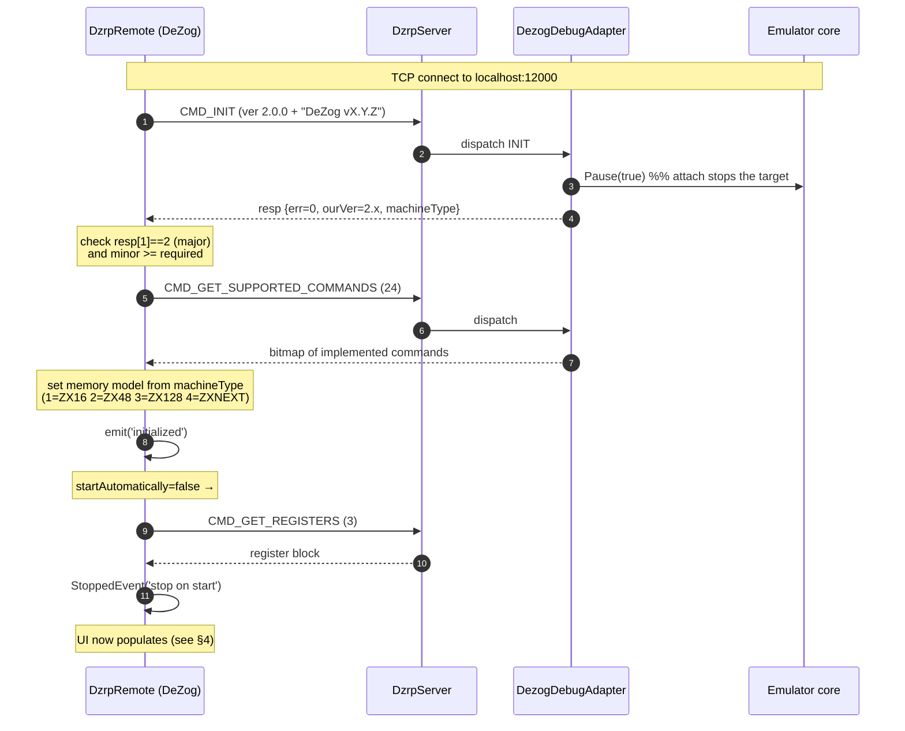
```mermaid
sequenceDiagram
    autonumber
    participant DZ as DzrpRemote (DeZog)
    participant SRV as DzrpServer
    participant AD as DezogDebugAdapter
    participant EMU as Emulator core

    Note over DZ,EMU: TCP connect to localhost:12000
    DZ->>SRV: CMD_INIT (ver 2.0.0 + "DeZog vX.Y.Z")
    SRV->>AD: dispatch INIT
    AD->>EMU: Pause(true)  %% attach stops the target
    AD-->>DZ: resp {err=0, ourVer=2.x, machineType}
    Note over DZ: check resp[1]==2 (major)<br/>and minor >= required
    DZ->>SRV: CMD_GET_SUPPORTED_COMMANDS (24)
    SRV->>AD: dispatch
    AD-->>DZ: bitmap of implemented commands
    Note over DZ: set memory model from machineType<br/>(1=ZX16 2=ZX48 3=ZX128 4=ZXNEXT)
    DZ->>DZ: emit('initialized')
    Note over DZ: startAutomatically=false →
    DZ->>SRV: CMD_GET_REGISTERS (3)
    SRV-->>DZ: register block
    DZ->>DZ: StoppedEvent('stop on start')
    Note over DZ: UI now populates (see §4)
```

**Why the pause matters.** DeZog's `cspect` remote assumes that after `CMD_INIT`
the target is *stopped* — attaching a debugger conceptually halts the machine. If
the emulator keeps running, VS Code shows the "running" spinner forever and the
Variables/Call-Stack panels stay empty, because those only render for a stopped
CPU. Our `DezogDebugAdapter::onSessionOpened()` therefore calls `emulator->Pause(true)`
on attach. This was the fix for the "I see the running indicator but no
registers" symptom.

**Version negotiation.** DeZog sends its *own* DZRP version in `CMD_INIT` and reads
ours back. It performs a strict `major == 2` check and a `minor >=` comparison. A
mismatch aborts the session before any debugging begins — so bumping our advertised
version is a compatibility decision, not a cosmetic one.

**Capability discovery.** `CMD_GET_SUPPORTED_COMMANDS` (24) is how DeZog 3.x learns
what we can do without probing-and-failing. We answer with a bitmap; DeZog greys out
UI affordances (e.g. ZX Next sprite views) whose backing commands we do not
advertise. This replaces the old `supportedCommands` array that launch.json used in
DeZog 1.x.

---

## 4. Workflow: fetching state on every stop

**Trigger:** *every* time the CPU stops — on attach, after a breakpoint, after a
step, after a reverse-step. DeZog treats "the machine just stopped" as a single
event that fans out into a burst of read commands to repaint the whole UI.

**Story.** A stop is expensive in round-trips, and understanding the fan-out is the
key to reasoning about latency. DeZog does *not* have a "give me everything" command;
it assembles the debugger view from primitives, and it does so lazily where it can
(collapsed panels are not fetched until expanded).

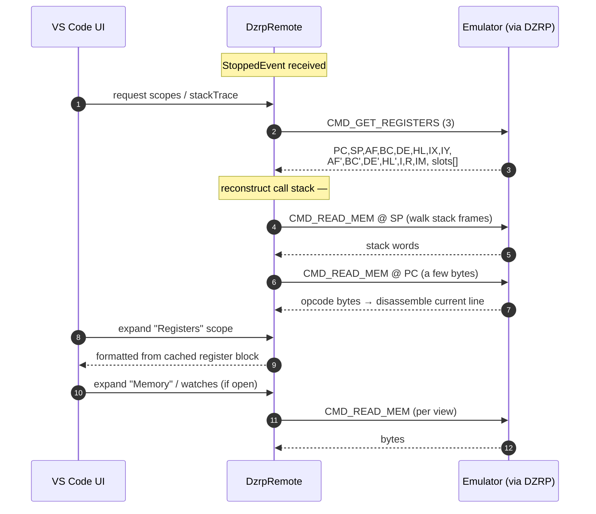
```mermaid
sequenceDiagram
    autonumber
    participant UI as VS Code UI
    participant DZ as DzrpRemote
    participant EMU as Emulator (via DZRP)

    Note over DZ: StoppedEvent received
    UI->>DZ: request scopes / stackTrace
    DZ->>EMU: CMD_GET_REGISTERS (3)
    EMU-->>DZ: PC,SP,AF,BC,DE,HL,IX,IY,<br/>AF',BC',DE',HL',I,R,IM, slots[]
    Note over DZ: reconstruct call stack —
    DZ->>EMU: CMD_READ_MEM @ SP (walk stack frames)
    EMU-->>DZ: stack words
    DZ->>EMU: CMD_READ_MEM @ PC (a few bytes)
    EMU-->>DZ: opcode bytes → disassemble current line
    UI->>DZ: expand "Registers" scope
    DZ-->>UI: formatted from cached register block
    UI->>DZ: expand "Memory" / watches (if open)
    DZ->>EMU: CMD_READ_MEM (per view)
    EMU-->>DZ: bytes
```

**The register block is the anchor.** `CMD_GET_REGISTERS` returns a fixed-order
block that DeZog's standard decoder indexes positionally: `PC, SP, AF, BC, DE, HL,
IX, IY, AF', BC', DE', HL'`, then `I` and `R` packed as `IR` (`I = IR >> 8`,
`R = IR & 0xFF`), then `IM`, then a slot descriptor (`slotCount` followed by the
slot values). Get the order or width wrong and DeZog will show plausible-looking but
entirely wrong register values — a nasty class of bug because nothing errors.

**Call-stack reconstruction is client-side.** There is no "get call stack" command.
DeZog reads the raw stack memory at `SP` and heuristically walks it, using its symbol
information to decide which words look like return addresses. This is why the call
stack can occasionally show speculative frames: the emulator only supplied bytes;
the interpretation is DeZog's.

**Slots travel with registers.** Because ZX memory is banked, a bare 16-bit PC is
ambiguous. The slot array in the register block lets DeZog map the 64k address to a
*long address* (bank + offset), which is what makes breakpoints and disassembly
bank-correct.

---

## 5. Workflow: running the binary (continue)

**User action:** presses **Continue (F5)** from a stopped state.

**Story.** This is the workflow where the emulator finally gets to *run*, and it is
also where the notification channel earns its keep. DeZog first flushes its
breakpoint set to the emulator, then issues a single `CMD_CONTINUE`, then goes quiet
— it does not poll. The emulator runs at full speed until it trips a breakpoint,
hits a watchpoint, or is explicitly paused, at which point it *volunteers* an
`NTF_PAUSE` notification carrying the reason.

```mermaid
sequenceDiagram
    autonumber
    participant DZ as DzrpRemote
    participant AD as DezogDebugAdapter
    participant EMU as Emulator core

    Note over DZ: build tmp breakpoint map<br/>(user bps + assertions + logpoints)
    DZ->>AD: CMD_ADD_BREAKPOINT (per bp)
    AD->>EMU: register breakpoint, return id
    AD-->>DZ: breakpoint id
    DZ->>AD: CMD_CONTINUE (6)
    AD->>EMU: Resume()
    AD-->>DZ: ack
    Note over DZ,EMU: emulator runs at full speed;<br/>DeZog waits, no polling
    EMU->>EMU: PC hits a breakpoint
    EMU->>AD: breakpoint fired (MessageCenter)
    AD-->>DZ: NTF_PAUSE {reason=breakpoint, bpId, PC}
    Note over DZ: StoppedEvent → re-run §4 state fetch
```

**Condition evaluation is split.** Simple breakpoints are evaluated in the emulator
(fast, in the run loop). But conditional breakpoints and logpoints carry expressions
DeZog understands and the emulator may not. DeZog's strategy is: set the breakpoint
unconditionally, and when `NTF_PAUSE` reports that particular breakpoint, evaluate
the condition client-side; if it is false, silently `CMD_CONTINUE` again. From the
user's perspective the program "didn't stop", but under the hood there may have been
several stop/evaluate/continue cycles. This is invisible unless you watch the wire.

**Why NTF_PAUSE, not a response.** `CMD_CONTINUE` is acknowledged immediately; the
actual stop arrives asynchronously as a notification (seqNo 0). This decoupling is
what lets the UI stay responsive ("running…") while the emulator is off executing
millions of instructions. On our side, the breakpoint hit arrives via the
MessageCenter — the same subsystem whose dispatch race is documented in the
[shutdown-crash fix](#13-cross-cutting-concerns).

---

## 6. Workflow: stepping (into / over / out)

**User action:** presses **Step Into (F11)**, **Step Over (F10)**, or **Step Out
(Shift+F11)**.

**Story.** Here is the workflow that surprises everyone. The emulator has *no step
command at all*. DeZog implements stepping entirely out of breakpoints and continue,
by computing exactly where control will be after the current instruction and putting
a temporary breakpoint there. The cleverness is in `calcStepBp`, which reads the
opcode at PC and reasons about its control flow.

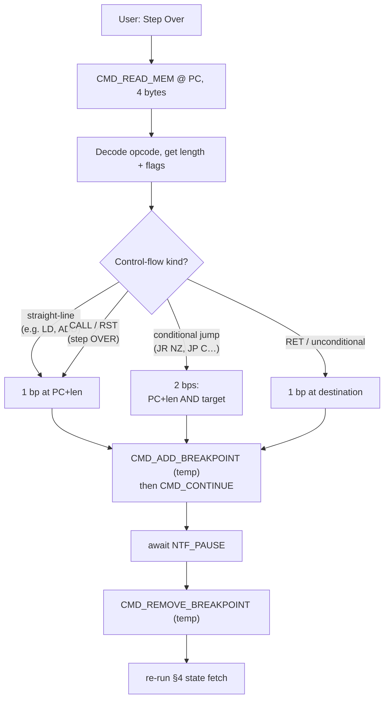
```mermaid
flowchart TD
    START["User: Step Over"] --> READ["CMD_READ_MEM @ PC, 4 bytes"]
    READ --> DECODE["Decode opcode, get length + flags"]
    DECODE --> BRANCH{Control-flow kind?}
    BRANCH -->|"straight-line<br/>(e.g. LD, ADD)"| ONE["1 bp at PC+len"]
    BRANCH -->|"CALL / RST<br/>(step OVER)"| ONE
    BRANCH -->|"conditional jump<br/>(JR NZ, JP C…)"| TWO["2 bps:<br/>PC+len AND target"]
    BRANCH -->|"RET / unconditional"| TGT["1 bp at destination"]
    ONE --> CONT["CMD_ADD_BREAKPOINT (temp)<br/>then CMD_CONTINUE"]
    TWO --> CONT
    TGT --> CONT
    CONT --> WAIT["await NTF_PAUSE"]
    WAIT --> CLEAN["CMD_REMOVE_BREAKPOINT (temp)"]
    CLEAN --> STATE["re-run §4 state fetch"]
```

**Step Over vs Step Into.** The *only* difference is how `CALL` and `RST` are
treated. For **step over**, DeZog ignores the branch and places the breakpoint at
`PC + length` — so the subroutine runs to completion and control returns before the
next stop. For **step into**, the branch is honoured and the breakpoint goes at the
call target, so execution stops at the first instruction of the callee.

**Conditional branches need two breakpoints.** A `JR NZ, dst` might either fall
through to `PC + 2` or jump to `dst`. DeZog cannot know which until it runs, so it
arms *both* addresses and removes whichever did not fire. This is why a single "step"
can install two temporary breakpoints.

**Step Out.** DeZog reads the current stack to find the return address, sets a
temporary breakpoint there, and continues. It is "step over" applied to the whole
remainder of the current subroutine.

**Implication for us.** Because stepping is just breakpoints + continue, the
emulator needs *fast, correct* breakpoint install/remove and a low-latency
`NTF_PAUSE`. A slow breakpoint path makes stepping feel sluggish even though there
is no "step" code path to optimise. Conversely, if reverse-stepping is desired, the
emulator *does* need first-class support because there is no "reverse continue to a
breakpoint" that DeZog can synthesise from forward primitives — see §11.

---

## 7. Workflow: breakpoints and conditions

**User action:** clicks the gutter to add a breakpoint, optionally with a condition
or hit count, or edits WPMEM/ASSERTION/LOGPOINT comments in source.

**Story.** DeZog distinguishes several breakpoint species, but collapses them onto
the same two DZRP commands. It maintains three internal arrays — ordinary
breakpoints, assertion breakpoints, and logpoints — and merges them into a single
temporary map before every continue (see §5). Each distinct address becomes one
`CMD_ADD_BREAKPOINT`; the emulator returns an id used later for removal.

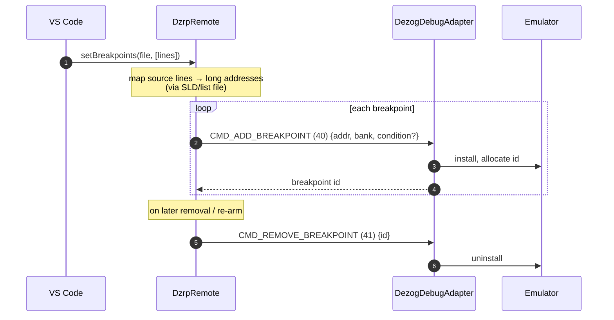
```mermaid
sequenceDiagram
    autonumber
    participant UI as VS Code
    participant DZ as DzrpRemote
    participant AD as DezogDebugAdapter
    participant EMU as Emulator

    UI->>DZ: setBreakpoints(file, [lines])
    Note over DZ: map source lines → long addresses<br/>(via SLD/list file)
    loop each breakpoint
        DZ->>AD: CMD_ADD_BREAKPOINT (40) {addr, bank, condition?}
        AD->>EMU: install, allocate id
        AD-->>DZ: breakpoint id
    end
    Note over DZ: on later removal / re-arm
    DZ->>AD: CMD_REMOVE_BREAKPOINT (41) {id}
    AD->>EMU: uninstall
```

**Address translation.** VS Code speaks in `(file, line)`. DeZog translates that to
a long address using the symbol/list file (`.sld` from sjasmplus). Without symbols,
source breakpoints cannot be placed — but address breakpoints (via the disassembly
view or `-e` commands) still work because they skip translation.

**Conditions and hit counts** ride along in `CMD_ADD_BREAKPOINT` when the emulator
advertises support; otherwise DeZog falls back to the "stop, evaluate client-side,
maybe continue" loop from §5. Either way the user sees identical behaviour; only the
wire traffic differs.

**Assertions and logpoints** are breakpoints with a twist: an assertion breaks only
when its expression is *false*; a logpoint never breaks but prints a message and
auto-continues. Both are implemented as ordinary breakpoints whose post-stop action
is decided by DeZog.

---

## 8. Workflow: disassembly

**User action:** opens the disassembly view, or it appears automatically when
stepping through code that has no source mapping.

**Story.** This is the purest illustration of the "brain vs hands" split. The
emulator never disassembles anything. DeZog reads raw bytes with `CMD_READ_MEM` and
runs them through its own `SmartDisassembler`, which is a genuinely sophisticated
piece of code: it follows control flow, labels branch targets, distinguishes code
from data, and can render text, flow charts, or call graphs.

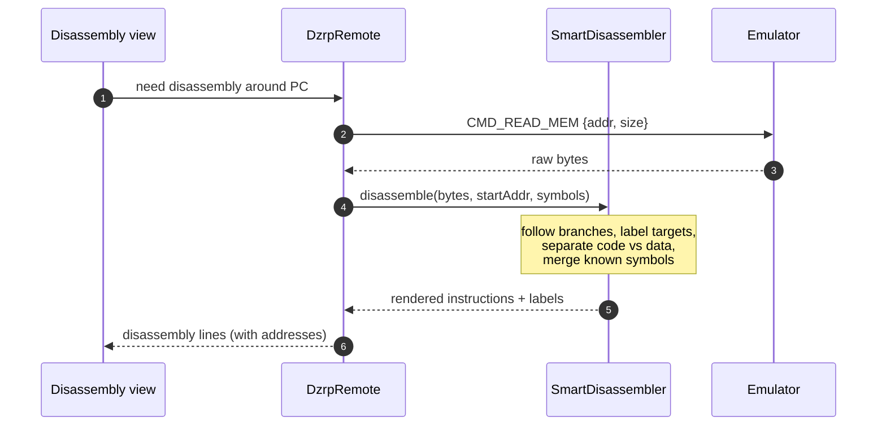
```mermaid
sequenceDiagram
    autonumber
    participant UI as Disassembly view
    participant DZ as DzrpRemote
    participant DIS as SmartDisassembler
    participant EMU as Emulator

    UI->>DZ: need disassembly around PC
    DZ->>EMU: CMD_READ_MEM {addr, size}
    EMU-->>DZ: raw bytes
    DZ->>DIS: disassemble(bytes, startAddr, symbols)
    Note over DIS: follow branches, label targets,<br/>separate code vs data,<br/>merge known symbols
    DIS-->>DZ: rendered instructions + labels
    DZ-->>UI: disassembly lines (with addresses)
```

**Two disassemblers exist.** `SimpleDisassembly` handles the quick "what's the one
instruction at PC" case used during stepping (`calcStepBp` reads 4 bytes and decodes
one opcode). `SmartDisassembler` handles the full interactive view with flow
analysis. Both consume bytes we supply; neither needs anything smarter from us than
`CMD_READ_MEM`.

**Banking correctness.** Because disassembly can span bank boundaries, DeZog uses the
slot information (from the register block, §4) to fetch the *right* bank's bytes.
If our slot reporting is wrong, disassembly silently shows the wrong bank's code —
another "no error, wrong answer" failure mode. Correct slot reporting is therefore
load-bearing for three workflows: breakpoints, disassembly, and memory view.

**Why this matters for performance.** Opening a large disassembly window can issue
several `CMD_READ_MEM` calls. These are cheap on our side (a memory copy), but the
disassembler's flow analysis is the actual cost — and it is entirely on the DeZog
side, so it is not something the emulator can speed up.

---

## 9. Workflow: the memory view

**User action:** opens a memory viewer on an address or expression, edits a byte, or
watches memory change colour as the program runs.

**Story.** The memory view is a thin skin over `CMD_READ_MEM` and `CMD_WRITE_MEM`,
but DeZog adds two touches of intelligence: *change highlighting* and *expression-
addressed windows*. Change highlighting works by DeZog keeping the previous snapshot
and diffing it against a freshly read one after each stop, painting changed cells.

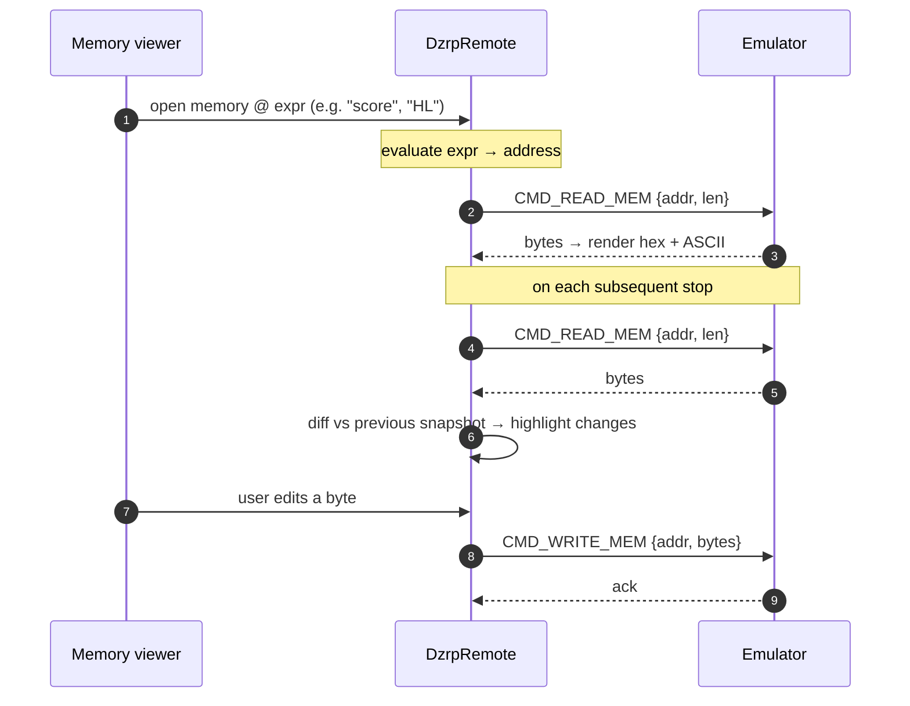
```mermaid
sequenceDiagram
    autonumber
    participant UI as Memory viewer
    participant DZ as DzrpRemote
    participant EMU as Emulator

    UI->>DZ: open memory @ expr (e.g. "score", "HL")
    Note over DZ: evaluate expr → address
    DZ->>EMU: CMD_READ_MEM {addr, len}
    EMU-->>DZ: bytes → render hex + ASCII
    Note over DZ,EMU: on each subsequent stop
    DZ->>EMU: CMD_READ_MEM {addr, len}
    EMU-->>DZ: bytes
    DZ->>DZ: diff vs previous snapshot → highlight changes
    UI->>DZ: user edits a byte
    DZ->>EMU: CMD_WRITE_MEM {addr, bytes}
    EMU-->>DZ: ack
```

**Reads are stateless; writes are immediate.** A memory read never changes emulator
state, so DeZog fires them freely — on every stop, for every open view. A write goes
straight to `CMD_WRITE_MEM` and takes effect at once; there is no transaction or
undo at the protocol level (undo, where it exists, is a reverse-debugging feature —
§11).

**Expression-addressed views** mean the viewer can follow a register or a symbol:
"memory at HL" re-evaluates HL after each stop and can therefore *move*. The address
resolution is the same expression engine used for watches (§10).

**Multiple views, multiple reads.** Each open memory view is independent; three open
viewers mean three `CMD_READ_MEM` calls per stop. Because our read handler is a
bounded memory copy, this scales fine, but it does explain bursty read traffic
right after a breakpoint.

---

## 10. Workflow: watches, WATCHPOINTs, and expression evaluation

Two things share the word "watch" and are constantly confused. This section pulls
them apart.

### 10a. Watch expressions (the WATCH panel)

**User action:** types an expression like `HL`, `score`, `(score)`, or
`words(hl, 4)` into the WATCH panel.

**Story.** A watch expression is evaluated *on demand, after each stop*, entirely by
DeZog's expression engine. The engine resolves symbols from the list/SLD file,
reads registers from the cached register block, and reads memory via `CMD_READ_MEM`
for dereferences. The emulator is only ever asked for raw bytes; all parsing,
arithmetic, and formatting is client-side.

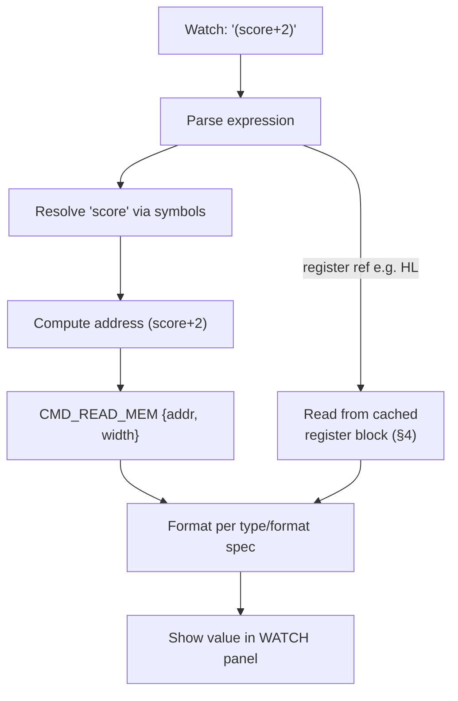
```mermaid
flowchart TD
    EXPR["Watch: '(score+2)'"] --> PARSE["Parse expression"]
    PARSE --> SYM["Resolve 'score' via symbols"]
    SYM --> ADDR["Compute address (score+2)"]
    ADDR --> READ["CMD_READ_MEM {addr, width}"]
    READ --> FMT["Format per type/format spec"]
    FMT --> SHOW["Show value in WATCH panel"]
    PARSE -->|"register ref e.g. HL"| REG["Read from cached<br/>register block (§4)"]
    REG --> FMT
```

**Formatting is expressive.** DeZog supports format specifiers and structured views
(`words()`, `byte`, arrays), all rendered from the same primitive byte reads. A watch
that "shows a struct" is just DeZog issuing one `CMD_READ_MEM` and slicing the result.

### 10b. WATCHPOINTs (break-on-memory-access)

**User action:** adds a `WPMEM` comment in source, or a data breakpoint.

**Story.** This is fundamentally different: it asks the *emulator* to break when a
memory range is read or written. DeZog cannot synthesise this from forward
primitives — watching every access in the client would be impossibly slow — so it
delegates to `CMD_ADD_WATCHPOINT`, and the emulator's memory subsystem enforces it,
signalling via `NTF_PAUSE` when the guarded region is touched.

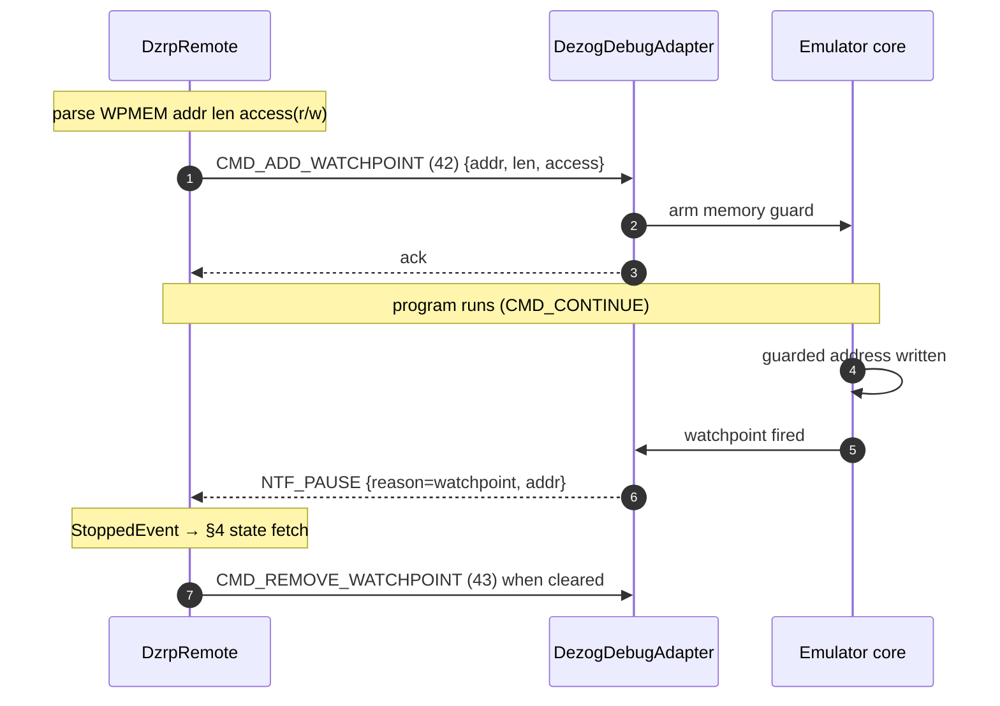
```mermaid
sequenceDiagram
    autonumber
    participant DZ as DzrpRemote
    participant AD as DezogDebugAdapter
    participant EMU as Emulator core

    Note over DZ: parse WPMEM addr len access(r/w)
    DZ->>AD: CMD_ADD_WATCHPOINT (42) {addr, len, access}
    AD->>EMU: arm memory guard
    AD-->>DZ: ack
    Note over DZ,EMU: program runs (CMD_CONTINUE)
    EMU->>EMU: guarded address written
    EMU->>AD: watchpoint fired
    AD-->>DZ: NTF_PAUSE {reason=watchpoint, addr}
    Note over DZ: StoppedEvent → §4 state fetch
    DZ->>AD: CMD_REMOVE_WATCHPOINT (43) when cleared
```

**The dividing line:** *watch expressions* are a client-side read loop (§10a);
*watchpoints* are an emulator-enforced hardware-style guard (§10b). The former costs
us nothing beyond memory reads; the latter requires real support in the memory core
and is the reason `CMD_ADD_WATCHPOINT`/`CMD_REMOVE_WATCHPOINT` exist as distinct
commands.

---

## 11. Workflow: reverse debugging

**User action:** presses **Step Back**, **Reverse Continue**, or scrubs the
instruction history.

**Story.** Reverse debugging is where DeZog's "brain" model reaches its limit and
must lean on real emulator capability — and where our TTD subsystem and the per-frame
decode cache come in. Forward stepping could be faked with breakpoints; *backward*
stepping cannot, because you cannot set a breakpoint in the past. Something has to
remember what already happened.

DeZog supports two history engines, and which one is active changes the whole
picture:

- **StepHistory (lite):** DeZog records only the *stops* it already caused (steps and
  breakpoints). "Step back" walks that thin list. No emulator support needed, but you
  can only reverse to places you already stopped.
- **CpuHistory (full):** DeZog expects a dense, per-instruction history it can replay
  — every instruction's registers and the memory/IO it touched. This is what enables
  true instruction-granular reverse stepping, and it requires the emulator to serve
  historical state on demand.

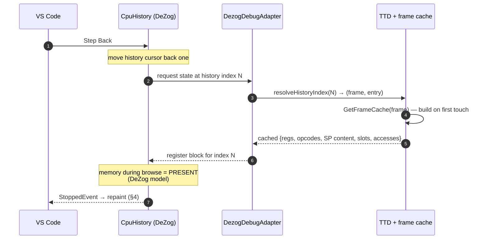
```mermaid
sequenceDiagram
    autonumber
    participant UI as VS Code
    participant HIST as CpuHistory (DeZog)
    participant AD as DezogDebugAdapter
    participant TTD as TTD + frame cache

    UI->>HIST: Step Back
    Note over HIST: move history cursor back one
    HIST->>AD: request state at history index N
    AD->>TTD: resolveHistoryIndex(N) → (frame, entry)
    TTD->>TTD: GetFrameCache(frame) — build on first touch
    TTD-->>AD: cached {regs, opcodes, SP content, slots, accesses}
    AD-->>HIST: register block for index N
    Note over HIST: memory during browse = PRESENT<br/>(DeZog model)
    HIST-->>UI: StoppedEvent → repaint (§4)
```

**Why a per-frame cache.** Replaying from a TTD checkpoint to reach one historical
instruction costs milliseconds; doing that for every reverse step or every history
scrub would make the UI crawl. The `TTDFrameCache` decodes a whole frame's worth of
instructions once, on first touch, into a compact hot/cold structure, then serves
any instruction in that frame in tens of nanoseconds. It is built lazily during
replay and *freed when we leave replay scope*, so it costs nothing during normal
forward execution. Full design, benchmarks, and the record-layout study are in
[`reverse-debugging.md`](./reverse-debugging.md).

**The memory model gotcha.** In DeZog's history model, register history is exact per
index, but *memory reads during a browse reflect the present*, not the historical
byte. Our cache-based implementation follows this model deliberately (documented in
`reverse-debugging.md`). It means a reverse-stepped watch shows current memory with
historical registers — a subtlety worth knowing before you file a "memory is wrong"
bug.

**Buffer size is ours to manage.** DeZog's launch.json exposes
`reverseDebugInstructionCount`. Because we back history with TTD (effectively
unlimited), we treat any externally requested buffer size as advisory: we respond OK
and auto-manage the real footprint. There is no reason to cap ourselves to a
client-suggested ring size when TTD already owns the timeline.

> **This section is the overview.** The individual reverse operations — step back,
> reverse continue, reverse step-into/out, and history scrubbing — each have their
> own control flow and their own failure modes. They are worked through in detail,
> with per-operation diagrams, in [§15 Reverse debugging workflows in depth](#15-reverse-debugging-workflows-in-depth).
> Where our TTD-backed engine sits relative to CSpect, ZEsarUX, and MAME is laid out
> in [§16 Remote feature matrix](#16-remote-feature-matrix-cspect-vs-zesarux-vs-mame).

---

## 12. Workflow: session close

**User action:** presses **Stop (Shift+F5)** or closes VS Code.

**Story.** DeZog tears the session down in the reverse order it built it. It sends
`CMD_CLOSE`, detaches, and the socket closes. On our side this is where lifecycle
discipline matters: the adapter must unsubscribe from MessageCenter events and the
server must free the connection *without* racing the emulator's background threads.

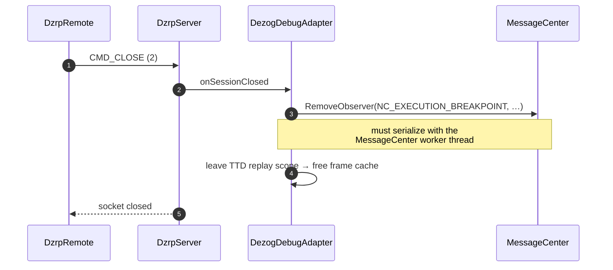
```mermaid
sequenceDiagram
    autonumber
    participant DZ as DzrpRemote
    participant SRV as DzrpServer
    participant AD as DezogDebugAdapter
    participant MC as MessageCenter

    DZ->>SRV: CMD_CLOSE (2)
    SRV->>AD: onSessionClosed
    AD->>MC: RemoveObserver(NC_EXECUTION_BREAKPOINT, …)
    Note over AD,MC: must serialize with the<br/>MessageCenter worker thread
    AD->>AD: leave TTD replay scope → free frame cache
    SRV-->>DZ: socket closed
```

**The shutdown race.** During teardown the MessageCenter worker thread may be
mid-dispatch to an observer exactly as the adapter/GUI object unsubscribes and is
destroyed. If `Dispatch` does not hold the observer lock across invocation, this is a
use-after-free — the exact SIGSEGV seen on emulator exit. The fix (holding
`m_mutexObservers` across dispatch so `RemoveObserver` blocks until any in-flight
dispatch completes) is covered in [Cross-cutting concerns](#13-cross-cutting-concerns).
The lesson for anyone adding a new command handler that subscribes to MessageCenter:
subscribe in `onSessionOpened`, unsubscribe in `onSessionClosed`, and never assume the
worker thread is idle during teardown.

---

## 13. Cross-cutting concerns

These themes recur across every workflow above and are worth stating once, plainly.

**Everything hangs off "stopped".** The single event `StoppedEvent` triggers the
whole state-fetch fan-out (§4). Optimising the debugger experience is largely about
making the stop → repaint path fast: quick `CMD_GET_REGISTERS`, quick `CMD_READ_MEM`,
low-latency `NTF_PAUSE`.

**The emulator answers primitives; DeZog composes.** Disassembly, call stacks, step
targets, watch values, and change highlighting are all *composed* client-side from
register blocks and memory reads. When something in the UI looks wrong but no command
failed, suspect the primitive that fed it — usually slot/bank reporting or register
ordering.

**Slots are load-bearing.** Correct slot reporting in the register block underpins
breakpoints (§7), disassembly (§8), and memory view (§9). A slot bug manifests as
"wrong bank" across all three simultaneously.

**Notifications are the only unsolicited channel.** `NTF_PAUSE` (seqNo 0) is how the
emulator tells DeZog it stopped — after continue (§5), after a step's temp breakpoint
(§6), after a watchpoint (§10b). Everything else is strictly request/response.

**MessageCenter dispatch must be thread-safe.** The breakpoint/pause path flows
through MessageCenter. `EventQueue::Dispatch` holds `m_mutexObservers` across the
whole iterate-and-invoke so a concurrent `RemoveObserver` (during session close, §12)
cannot delete an observer, or let its owner be destroyed, mid-dispatch. This closed
the exit-time SIGSEGV; a regression test
(`ClassicDispatch_RemoveObserverWaitsForInFlightDispatch`) pins the invariant.

**Framing asymmetry is silent when wrong.** Command length excludes seqNo+cmd;
response/notification length includes them. A framing error does not produce a clean
protocol error — it produces "No response received from remote" or a hang, because
the far side is waiting for bytes that will never come at the length it expects.

---

## 14. Command reference quick-map

Which commands each workflow relies on. Full byte layouts in
[`dzrp-protocol-spec.md`](./dzrp-protocol-spec.md).

| Workflow | Primary commands (DeZog → us) | Async (us → DeZog) |
|----------|-------------------------------|--------------------|
| Handshake (§3) | `CMD_INIT` (1), `CMD_GET_SUPPORTED_COMMANDS` (24), `CMD_GET_REGISTERS` (3) | — |
| State fetch (§4) | `CMD_GET_REGISTERS` (3), `CMD_READ_MEM` (8) | — |
| Continue (§5) | `CMD_ADD_BREAKPOINT` (40), `CMD_CONTINUE` (6) | `NTF_PAUSE` (1) |
| Stepping (§6) | `CMD_READ_MEM` (8), `CMD_ADD_BREAKPOINT` (40), `CMD_CONTINUE` (6), `CMD_REMOVE_BREAKPOINT` (41) | `NTF_PAUSE` (1) |
| Breakpoints (§7) | `CMD_ADD_BREAKPOINT` (40), `CMD_REMOVE_BREAKPOINT` (41) | `NTF_PAUSE` (1) |
| Disassembly (§8) | `CMD_READ_MEM` (8) | — |
| Memory view (§9) | `CMD_READ_MEM` (8), `CMD_WRITE_MEM` (9) | — |
| Watch expressions (§10a) | `CMD_READ_MEM` (8), `CMD_GET_REGISTERS` (3) | — |
| Watchpoints (§10b) | `CMD_ADD_WATCHPOINT` (42), `CMD_REMOVE_WATCHPOINT` (43) | `NTF_PAUSE` (1) |
| Reverse debug (§11) | `CMD_GET_REGISTERS` (3) at history indices, `CMD_READ_MEM` (8) | — |
| Pause (any) | `CMD_PAUSE` (7) | `NTF_PAUSE` (1) |
| Session close (§12) | `CMD_CLOSE` (2) | — |

---

## 15. Reverse debugging workflows in depth

Reverse debugging is not one feature; it is a family of operations that share a
recorded timeline but differ sharply in how they traverse it. This section walks each
one and — crucially — shows where the *engine* (lite vs full) changes the outcome.

### 15.0 Two engines, one UI

DeZog exposes identical buttons (Step Back, Reverse Continue, …) regardless of which
history engine is active, but the engine is chosen at connect time based on what the
remote can supply:

- **StepHistory (lite):** the default when the remote provides no per-instruction
  history. DeZog records only the machine states at points where *it already stopped*
  — every breakpoint hit and every forward step. "Reverse" then means walking that
  sparse list of past stops. You can revisit where you have been; you cannot land
  between two forward steps.
- **CpuHistory (full):** active when the remote can serve dense, per-instruction
  history. Now "reverse" is instruction-granular: every executed opcode is a landing
  point, and reverse-continue can scan backwards for a breakpoint condition.

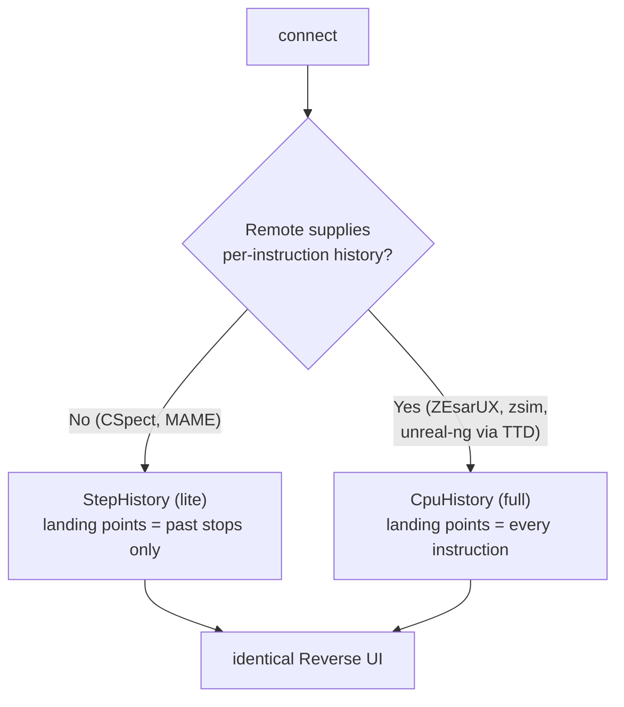
```mermaid
flowchart TD
    CONNECT["connect"] --> Q{Remote supplies<br/>per-instruction history?}
    Q -->|"No (CSpect, MAME)"| LITE["StepHistory (lite)<br/>landing points = past stops only"]
    Q -->|"Yes (ZEsarUX, zsim,<br/>unreal-ng via TTD)"| FULL["CpuHistory (full)<br/>landing points = every instruction"]
    LITE --> UI["identical Reverse UI"]
    FULL --> UI
```

The rest of this section describes the **full** (CpuHistory) flows, because that is
what unreal-ng provides via TTD. Where the lite engine behaves differently, it is
called out explicitly.

### 15.1 Step Back (reverse step-into)

**User action:** presses **Step Back**.

**Story.** The history cursor, which normally sits at "present", moves back by one
instruction. DeZog asks our adapter for the machine state at the new (earlier) index;
we translate that global index into a `(frame, entry-in-frame)` pair and serve the
cached register block. No emulation runs — this is a *lookup*, which is exactly why
the per-frame decode cache exists.

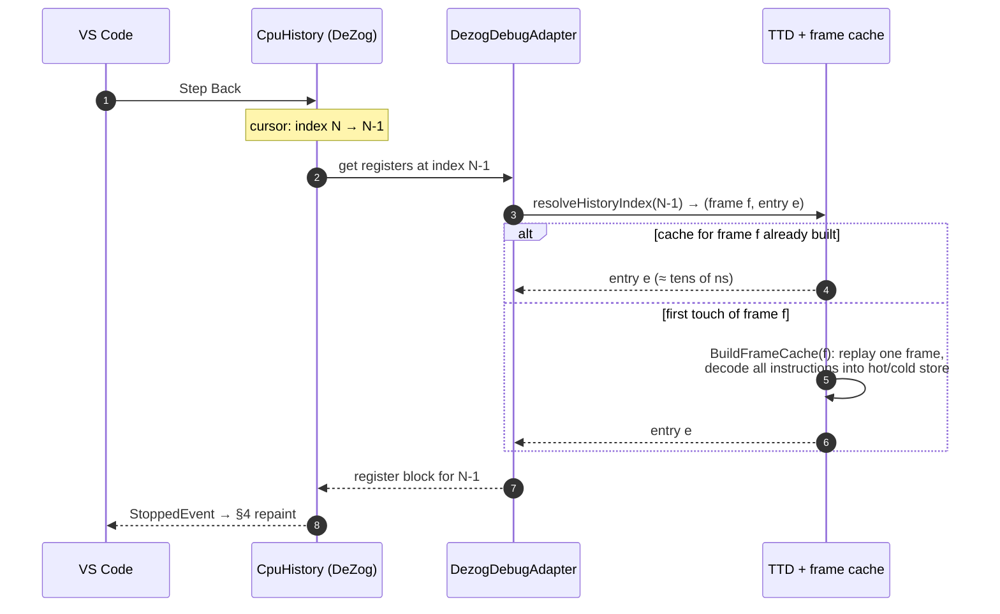
```mermaid
sequenceDiagram
    autonumber
    participant UI as VS Code
    participant HIST as CpuHistory (DeZog)
    participant AD as DezogDebugAdapter
    participant TTD as TTD + frame cache

    UI->>HIST: Step Back
    Note over HIST: cursor: index N → N-1
    HIST->>AD: get registers at index N-1
    AD->>TTD: resolveHistoryIndex(N-1) → (frame f, entry e)
    alt cache for frame f already built
        TTD-->>AD: entry e (≈ tens of ns)
    else first touch of frame f
        TTD->>TTD: BuildFrameCache(f): replay one frame,<br/>decode all instructions into hot/cold store
        TTD-->>AD: entry e
    end
    AD-->>HIST: register block for N-1
    HIST-->>UI: StoppedEvent → §4 repaint
```

**Within-frame vs cross-frame.** Most step-backs stay inside the same frame, so the
cache is already warm and the answer is a struct read. Crossing a frame boundary
backwards triggers a one-time `BuildFrameCache` for the previous frame — a few
milliseconds amortised across every instruction in that frame. The design study and
measured numbers are in [`reverse-debugging.md`](./reverse-debugging.md).

**Lite-engine difference.** With StepHistory, "Step Back" pops to the *previous
recorded stop*, which might be dozens of real instructions earlier. There is no
`BuildFrameCache`; there is simply a shorter list to walk. Precision is traded for
zero recording cost.

### 15.2 Reverse Continue

**User action:** presses **Reverse Continue** — "run backwards until something
interesting."

**Story.** This is the operation the lite engine fundamentally cannot do well.
Reverse-continue means scanning backwards through the timeline evaluating breakpoint
conditions at each step until one matches (or the recorded history is exhausted).
With full history every instruction is inspectable, so the scan is meaningful; with
lite history there is nothing between stops to inspect.

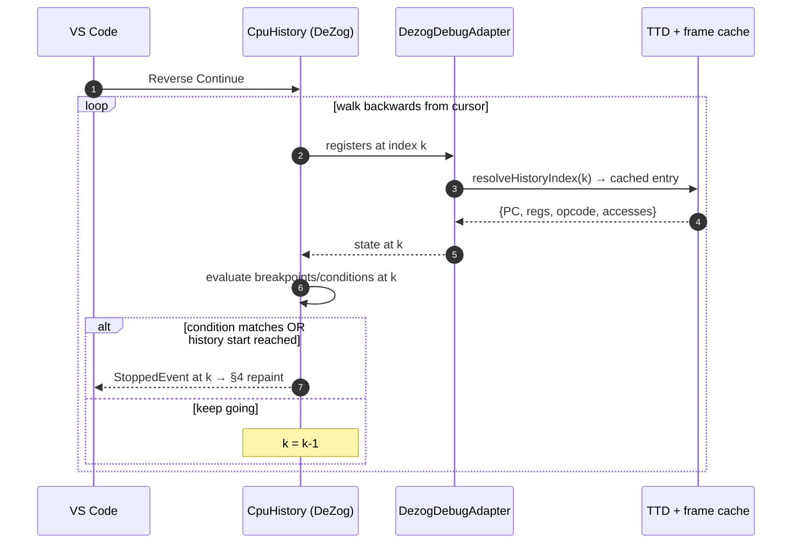
```mermaid
sequenceDiagram
    autonumber
    participant UI as VS Code
    participant HIST as CpuHistory (DeZog)
    participant AD as DezogDebugAdapter
    participant TTD as TTD + frame cache

    UI->>HIST: Reverse Continue
    loop walk backwards from cursor
        HIST->>AD: registers at index k
        AD->>TTD: resolveHistoryIndex(k) → cached entry
        TTD-->>AD: {PC, regs, opcode, accesses}
        AD-->>HIST: state at k
        HIST->>HIST: evaluate breakpoints/conditions at k
        alt condition matches OR history start reached
            HIST-->>UI: StoppedEvent at k → §4 repaint
        else keep going
            Note over HIST: k = k-1
        end
    end
```

**Why the cache is decisive here.** Reverse-continue can touch thousands of indices
in a single user gesture. Without the per-frame cache, each index would cost a full
replay-from-checkpoint (milliseconds) — turning one click into seconds or minutes.
With the cache, a whole frame's instructions are decoded once and then each condition
check is a struct read. This is the workflow that justified building the cache in the
first place.

**Lite-engine difference.** StepHistory's reverse-continue degrades to "jump to the
oldest recorded stop" — several of its finer methods are explicitly
not implemented for the lite class and return `undefined`. It is reverse *navigation*
of past stops, not reverse *execution*.

### 15.3 Reverse Step Over / Step Out

**Story.** Forward stepping synthesises step-over from breakpoints (§6). Backwards,
that trick is impossible — you cannot breakpoint the past. Instead DeZog uses the
recorded history directly: reverse-step-over walks the cursor backwards past the
matching `CALL`'s worth of instructions using the recorded call depth, and
reverse-step-out walks back to before the current subroutine was entered. Both are
pure history traversal; the emulator only ever serves state at an index.

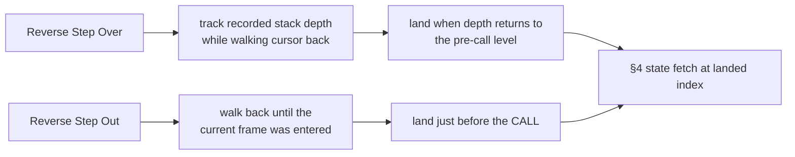
```mermaid
flowchart LR
    RSO["Reverse Step Over"] --> DEPTH["track recorded stack depth<br/>while walking cursor back"]
    DEPTH --> LAND1["land when depth returns to<br/>the pre-call level"]
    RSOUT["Reverse Step Out"] --> BACK["walk back until the<br/>current frame was entered"]
    BACK --> LAND2["land just before the CALL"]
    LAND1 --> FETCH["§4 state fetch at landed index"]
    LAND2 --> FETCH
```

**Implication.** These operations need the history entry to carry enough to know the
control-flow shape — which is why our cache stores the decoded opcode bytes and the
stack-pointer content per entry, not just registers. That richness is what lets DeZog
reason about call depth while moving backwards.

### 15.4 History scrubbing (the spot/coverage view)

**Story.** Beyond discrete steps, DeZog can show a *spot* — a short window of recent
instructions around the cursor — and code-coverage highlighting. Scrubbing the cursor
across history repaints this window continuously. Each cursor position is another
index lookup, so scrubbing is the most cache-sensitive gesture of all: dragging
across a frame boundary streams `BuildFrameCache` calls for each newly entered frame,
then every position within is instant.

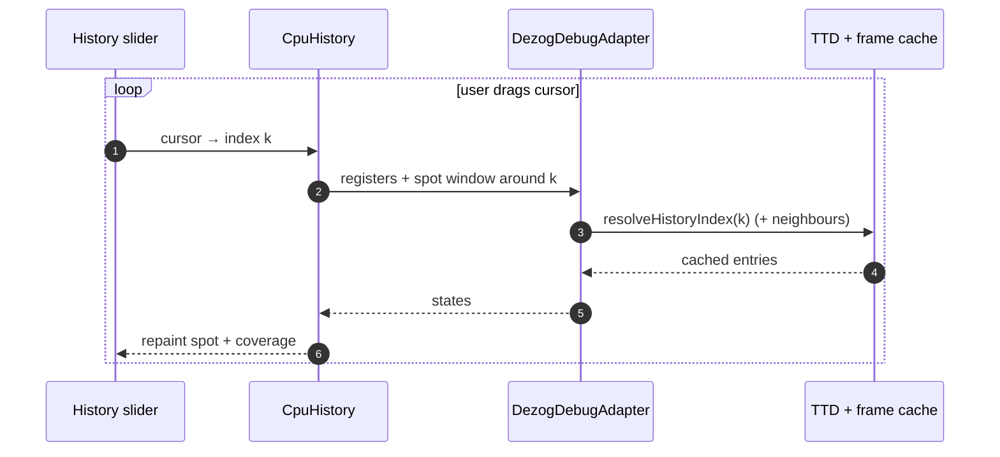
```mermaid
sequenceDiagram
    autonumber
    participant UI as History slider
    participant HIST as CpuHistory
    participant AD as DezogDebugAdapter
    participant TTD as TTD + frame cache

    loop user drags cursor
        UI->>HIST: cursor → index k
        HIST->>AD: registers + spot window around k
        AD->>TTD: resolveHistoryIndex(k) (+ neighbours)
        TTD-->>AD: cached entries
        AD-->>HIST: states
        HIST-->>UI: repaint spot + coverage
    end
```

**Coverage is recording-gated.** Code-coverage collection only makes sense while
*recording* the timeline, not while browsing it. Our TTD gates its coverage index to
the Recording state; during replay/browse we serve from the cache and do not re-index.
This keeps browsing side-effect free — a browse never mutates the recorded history.

### 15.5 The memory-during-browse contract (restated, because it bites)

Across every reverse operation above, one rule holds and surprises everyone:
**registers are historical, memory is present.** When the cursor sits at a past
index, `CMD_GET_REGISTERS`-equivalent data comes from the cache (the exact past
values), but a memory read still returns the *current* bytes. This is DeZog's model,
and our cache-based implementation follows it on purpose (see
[`reverse-debugging.md`](./reverse-debugging.md)). Practical effect: a watch on a
variable while reverse-stepping shows today's value next to yesterday's registers.
That is not a bug; it is the contract.

---

## 16. Remote feature matrix: CSpect vs ZEsarUX vs MAME

DeZog is a *multi-remote* debugger: the same UI drives several very different
back-ends over three different transports. Understanding the differences explains why
some features are missing on some remotes, and — importantly — where unreal-ng sits.

### 16.1 `remoteType` — naming quirk to internalise first

In launch.json you pick a back-end with `"remoteType": "<id>"`. The gotcha is that
**these identifiers are not all named after the emulator — some are named after the
protocol.** ZEsarUX speaks its own line-oriented text protocol called **ZRCP
(ZEsarUX Remote Control Protocol)** over TCP, so DeZog names that remote `zrcp`, not
`zesarux`. You can literally `telnet` into a running ZEsarUX and type ZRCP commands
by hand.

The complete set, straight from `src/remotes/remotefactory.ts`:

| `remoteType` | Selects | Transport / protocol | Nature |
|--------------|---------|----------------------|--------|
| `zsim` | DeZog's **internal Z80 simulator** | in-process (no socket) | Reference implementation; most complete; full CpuHistory. |
| `cspect` | **CSpect** (and **unreal-ng**) | **DZRP** over TCP | Binary little-endian ZX-Next protocol; DeZog attaches via the CSpect DZRP plugin. |
| `zrcp` | **ZEsarUX** | **ZRCP** over TCP | Rich native text protocol incl. built-in `cpu-history` → full reverse debugging. |
| `zxnext` | **Real ZX Spectrum Next hardware** | DZRP over **USB/serial** | Same DZRP command vocabulary as `cspect`, different physical link; debugs real silicon. |
| `mame` | **MAME** (Z80 driver) | **GDB remote stub** over TCP | Generic CPU-debug protocol; no ZX banking/coverage vocabulary. |

So it is really **three wire protocols across five remote types**: DZRP (`cspect`,
`zxnext`), ZRCP (`zrcp`), gdbstub (`mame`), plus in-process (`zsim`). **unreal-ng
speaks DZRP and therefore registers as a `cspect` remote** — DeZog does not know or
care that a Time-Travel engine sits behind it.

The critical structural fact: **transport dictates the ceiling.** DZRP and ZRCP were
designed for Z80/ZX debugging and expose banking, watchpoints, and (for ZRCP) dense
CPU history. The MAME gdbstub is a generic CPU-debug protocol and simply has no
vocabulary for ZX-style banking or code coverage, so those features are absent no
matter what MAME itself can do.

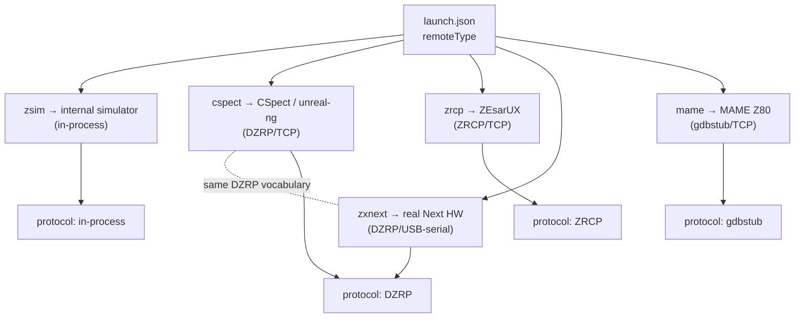
```mermaid
flowchart TD
    LJ["launch.json<br/>remoteType"] --> ZSIM["zsim → internal simulator<br/>(in-process)"]
    LJ --> CS["cspect → CSpect / unreal-ng<br/>(DZRP/TCP)"]
    LJ --> ZR["zrcp → ZEsarUX<br/>(ZRCP/TCP)"]
    LJ --> ZX["zxnext → real Next HW<br/>(DZRP/USB-serial)"]
    LJ --> MM["mame → MAME Z80<br/>(gdbstub/TCP)"]
    CS -.same DZRP vocabulary.- ZX
    ZSIM --> P1["protocol: in-process"]
    CS --> P2["protocol: DZRP"]
    ZX --> P2
    ZR --> P3["protocol: ZRCP"]
    MM --> P4["protocol: gdbstub"]
```

### 16.2 Feature matrix

Legend: ✅ full · ⚠️ partial / with caveats · ❌ not available · 🔷 via TTD (ours).
Columns are labelled by their launch.json `remoteType` string (§16.1); the emulator
each selects is in parentheses.

| Capability | `zsim` (sim) | `cspect` (CSpect) | `zrcp` (ZEsarUX) | `zxnext` (real HW) | `mame` (MAME) | **`cspect` (unreal-ng)** |
|------------|:----:|:------:|:-------:|:------:|:----:|:-------------:|
| Read/write registers | ✅ | ✅ | ✅ | ✅ | ⚠️ writes limited | ✅ |
| Read/write memory | ✅ | ✅ | ✅ | ✅ | ✅ | ✅ |
| Memory banking / long addresses | ✅ | ✅ | ✅ | ✅ | ❌ | ✅ |
| Execution breakpoints | ✅ | ✅ | ✅ | ✅ | ✅ | ✅ |
| Conditional breakpoints | ✅ | ⚠️ client loop | ✅ native | ⚠️ client loop | ⚠️ | ⚠️ client loop |
| Watchpoints (break on mem access) | ✅ | ✅ (DZRP) | ✅ native | ✅ (DZRP) | ⚠️ gdb `Z`/`z` | ✅ (DZRP) |
| Code coverage | ✅ | ✅ | ✅ | ✅ | ❌ warns & disables | ✅ |
| **Reverse debugging engine** | **full** | **lite** | **full** | **lite** | **lite** | **🔷 full via TTD** |
| Instruction-granular step back | ✅ | ❌ | ✅ | ❌ | ❌ | ✅ |
| Reverse continue (scan conditions) | ✅ | ❌ | ✅ | ❌ | ❌ | ✅ |
| History memory model | present-mem | present-mem | present-mem | present-mem | present-mem | present-mem |
| ZX Next sprites/registers | ⚠️ | ✅ | ⚠️ | ✅ | ❌ | ⚠️ (advertised via cmd 24) |
| Save/restore machine state | ✅ | ✅ | ✅ | ⚠️ HW-limited | ❌ | ✅ (TTD-native) |

> **Reverse-debug engine:** "full" = CpuHistory (instruction-granular, reverse
> continue); "lite" = StepHistory (navigates only past stop points). See §15.0.
> Note that `zxnext` debugs *real hardware*, which cannot record a dense instruction
> history on the fly — so despite sharing the DZRP transport with `cspect`, it is
> lite for the same reason CSpect is: no dense history is on the wire. unreal-ng is
> the outlier that turns a DZRP/`cspect` remote into a *full* engine, purely because
> TTD supplies the history the protocol itself never carries.

### 16.3 How the same feature is *served* differently

The matrix hides the interesting part: identical-looking features are implemented by
completely different mechanisms depending on the remote. Three examples.

**Reverse debugging — the headline difference.**

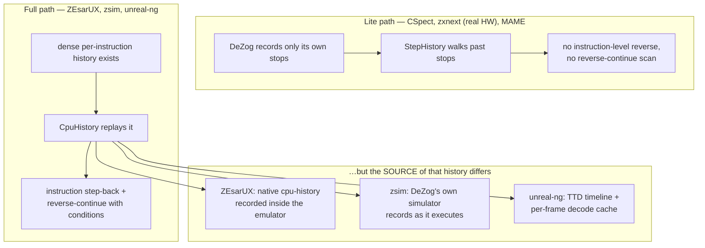
```mermaid
flowchart TD
    subgraph lite["Lite path — CSpect, zxnext (real HW), MAME"]
        L1["DeZog records only its own stops"] --> L2["StepHistory walks past stops"]
        L2 --> L3["no instruction-level reverse,<br/>no reverse-continue scan"]
    end
    subgraph full["Full path — ZEsarUX, zsim, unreal-ng"]
        F1["dense per-instruction history exists"] --> F2["CpuHistory replays it"]
        F2 --> F3["instruction step-back +<br/>reverse-continue with conditions"]
    end
    subgraph how["…but the SOURCE of that history differs"]
        H1["ZEsarUX: native cpu-history<br/>recorded inside the emulator"]
        H2["zsim: DeZog's own simulator<br/>records as it executes"]
        H3["unreal-ng: TTD timeline +<br/>per-frame decode cache"]
    end
    F2 --> H1
    F2 --> H2
    F2 --> H3
```

- **ZEsarUX** hands DeZog history from its *own* internal recorder (`ZesaruxCpuHistory`
  parses ZEsarUX's `cpu-history` responses). DeZog just consumes it.
- **zsim** is DeZog's own simulator, so it records every instruction as it runs
  (`ZSimCpuHistory`) — no protocol involved.
- **CSpect** provides no such history over DZRP, so DeZog silently falls back to the
  lite `StepHistory`. This is *not* a CSpect-plugin limitation DeZog can route
  around; the dense history simply is not on the wire.
- **unreal-ng** is the interesting case: we speak the same DZRP as CSpect, but we own
  a Time-Travel subsystem. So although DeZog treats us as a `cspect` remote, we can
  serve full CpuHistory-class reverse debugging that stock CSpect cannot — putting us
  in the ZEsarUX/zsim tier while using the CSpect transport. The per-frame decode
  cache is what makes serving that history fast enough to feel interactive.

**Watchpoints.**

- **ZEsarUX**: native watchpoint command in ZRCP; the emulator enforces it.
- **CSpect / unreal-ng**: `CMD_ADD_WATCHPOINT` (42) over DZRP; the emulator's memory
  subsystem enforces it.
- **MAME**: mapped onto the gdb `Z`/`z` set/clear commands, constrained to what the
  gdbstub allows.
- **zsim**: enforced directly inside the simulator's memory accessor.

Same button in the WATCH/WPMEM UI; four different enforcement points.

**Banking / long addresses.**

- **DZRP remotes (`cspect`, `zxnext`, unreal-ng) and ZRCP (`zrcp`/ZEsarUX)** carry
  slot/bank info, so a breakpoint or disassembly line is bank-correct (§4, §8).
- **MAME gdbstub (`mame`)** has no banking vocabulary — its decoder explicitly notes
  banking is unsupported, so addresses are plain 64k and long-address features degrade.

### 16.4 Where unreal-ng deliberately differs

Our design choices relative to a stock DZRP/CSpect remote:

1. **Full reverse debugging over the CSpect transport.** By backing history with TTD
   we deliver instruction-granular step-back and reverse-continue — features the
   `cspect` remote type normally cannot offer, because CSpect itself supplies no dense
   history. We serve it through the same DZRP DeZog already speaks.
2. **We auto-manage the history buffer.** `reverseDebugInstructionCount` from
   launch.json is treated as advisory; TTD owns the real timeline, so we ack and
   ignore the requested ring size (§11).
3. **Coverage gated to recording, browsing is side-effect free.** Matches DeZog's
   present-memory browse model and keeps reverse operations from mutating history
   (§15.4, §15.5).
4. **Lazy, scoped cache.** The per-frame decode cache is built on first touch during
   replay and freed on leaving replay scope, so normal forward execution pays nothing
   for the reverse-debugging capability (§11, and `reverse-debugging.md`).

The net effect: to DeZog we look like a well-behaved CSpect, but on the reverse-debug
axis we behave like ZEsarUX — the best of both the transport's simplicity and a full
history engine.

---

## Appendix: the one-diagram summary

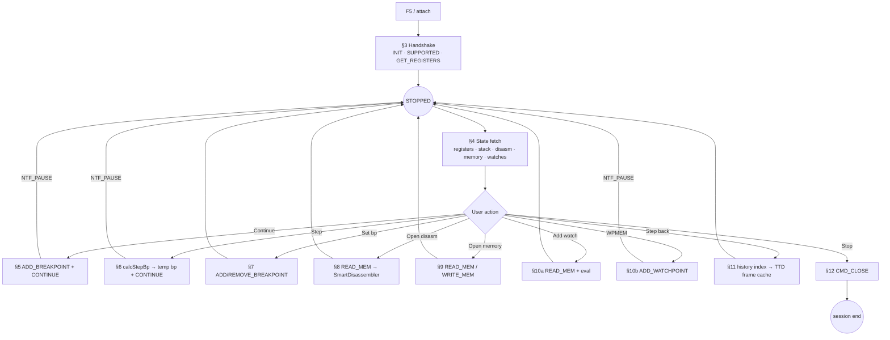
```mermaid
flowchart TD
    CONNECT["F5 / attach"] --> HS["§3 Handshake<br/>INIT · SUPPORTED · GET_REGISTERS"]
    HS --> STOPPED(("STOPPED"))
    STOPPED --> FETCH["§4 State fetch<br/>registers · stack · disasm · memory · watches"]
    FETCH --> CHOICE{User action}
    CHOICE -->|Continue| RUN["§5 ADD_BREAKPOINT + CONTINUE"]
    CHOICE -->|Step| STEP["§6 calcStepBp → temp bp + CONTINUE"]
    CHOICE -->|Set bp| BP["§7 ADD/REMOVE_BREAKPOINT"]
    CHOICE -->|Open disasm| DIS["§8 READ_MEM → SmartDisassembler"]
    CHOICE -->|Open memory| MEM["§9 READ_MEM / WRITE_MEM"]
    CHOICE -->|Add watch| WATCH["§10a READ_MEM + eval"]
    CHOICE -->|WPMEM| WP["§10b ADD_WATCHPOINT"]
    CHOICE -->|Step back| REV["§11 history index → TTD frame cache"]
    CHOICE -->|Stop| CLOSE["§12 CMD_CLOSE"]
    RUN -->|NTF_PAUSE| STOPPED
    STEP -->|NTF_PAUSE| STOPPED
    WP -->|NTF_PAUSE| STOPPED
    DIS --> STOPPED
    MEM --> STOPPED
    WATCH --> STOPPED
    REV --> STOPPED
    BP --> STOPPED
    CLOSE --> DONE(("session end"))
```

Every path returns to **STOPPED**, and every arrival at STOPPED re-runs §4. That loop
— stop, fetch, act, run, stop — is the whole debugger.
