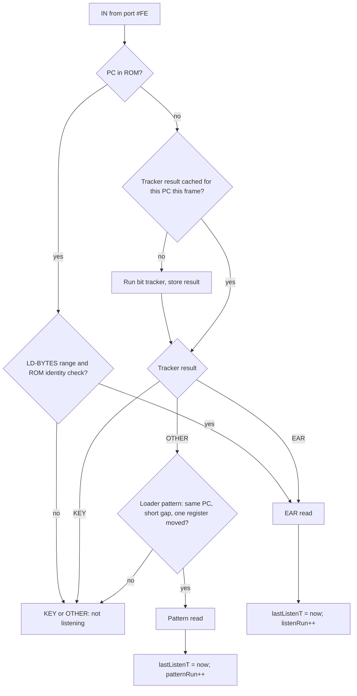
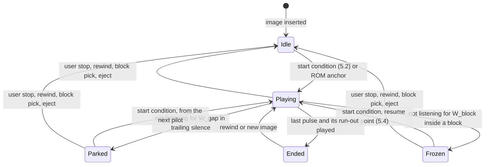
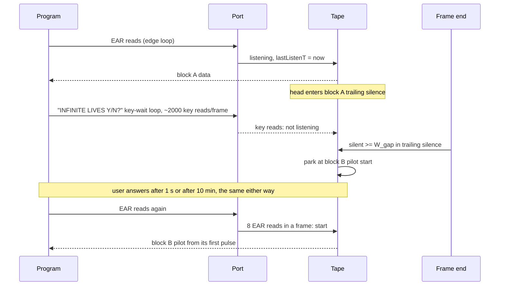
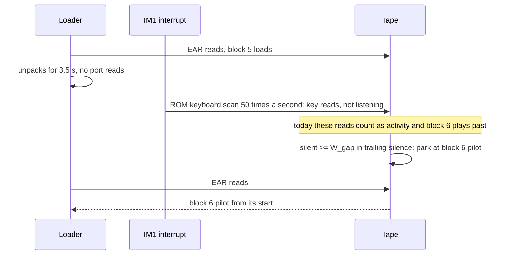
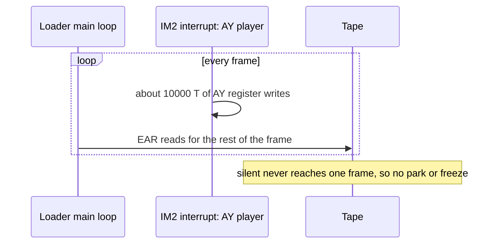
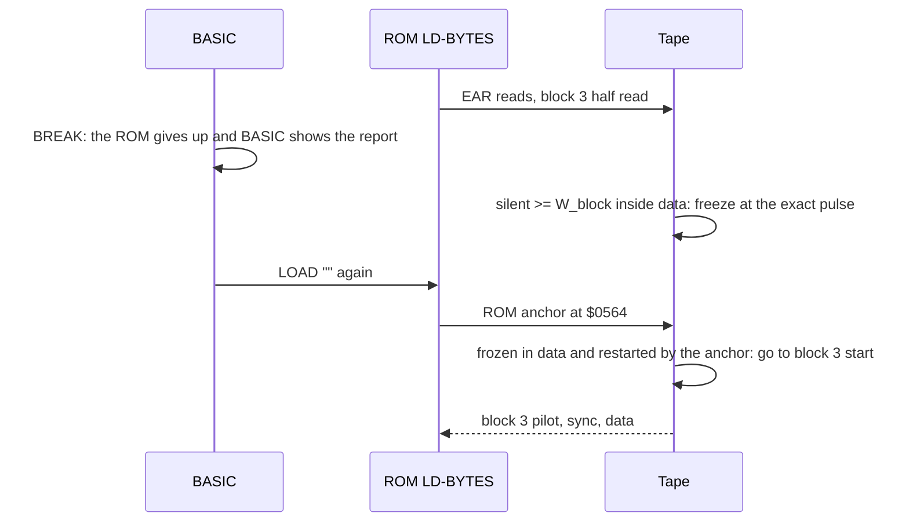
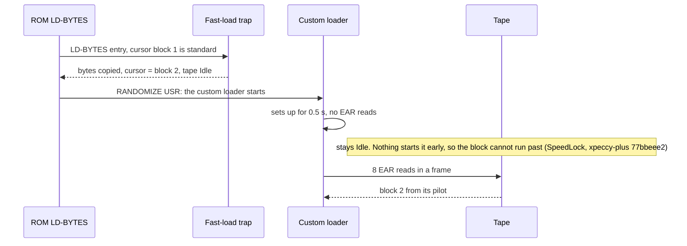

# The tape follows the loader: design for P3 and P4

**Date:** 2026-09-27
**Tracks:** PLAN #5 ([TODO.md](TODO.md)); proposal P3/P4 of
[nonstandard-loader-investigation.md](nonstandard-loader-investigation.md) §8
**Status:** P4 implemented in `ac200bb8` (2026-09-27): `TapeReadClassifier`
(`core/src/emulator/io/tape/tapereadclassifier.cpp`), the listening start, the park and the freeze in
`Tape`. First thresholds: start on 8 listening reads per frame, park after 2 frames in the gap,
freeze after 50 frames inside a block (`tape.h`). They are to be confirmed by the fixture sweep of §7.
Verified live with fast loading off: EMELYANOV on 48K (trainer menu held the tape at block 3, then
the game started), SAN-SAN on 48K and 128K.

## 1. The rule in one paragraph

The tape moves only while a program is listening to it. A program listens when it reads the
EAR bit (bit 6 of port `#FE`) and does something with that bit. When nobody has listened for a
while, the tape stops. If it stopped in the silence after a block, it waits at the start of the
next block's pilot tone. As soon as a program listens again, the tape starts from where it waits.
Reading the keyboard, playing music or unpacking data is not listening, however long it lasts.

This meets requirement R (investigation §8): a load that stops to wait for a key or to play
beeper or AY music continues by itself once the program polls the EAR bit again.

## 2. Terms

| Term | Meaning |
|:--|:--|
| EAR read | A read of port `#FE` whose code then tests bit 6 (the tape input). |
| Key read | A read of port `#FE` whose code then tests only bits 0–4 (the keyboard). |
| Other read | Neither can be told from the code. |
| Listening | EAR reads, or other reads that follow the loader pattern of §4.2. |
| Pilot | The long run of identical pulses at the start of a block that a loader locks onto. Replaying it from its start is always safe. |
| Trailing silence | The pause after a block's last data edge. In our engine it is the block's last entry in `edgePulseTimings` (`tape.cpp:916`). |
| Park | Stop the tape at the start of the next block's pilot. |
| Freeze | Stop the tape at the exact pulse where it is. |
| W | "Not listening for W T-states", the pause condition. Measured in T-states, not frames, so that 48K (69888 T per frame) and Pentagon (71680 T) behave the same. |

## 3. What is wrong with the current heuristics

| Today | Why it fails |
|:--|:--|
| Any port read while playing counts as "the loader is active" (`tape.cpp:531`). | The ROM keyboard scan in the 50 Hz interrupt reads the port every frame, so with interrupts on the tape never pauses. A key-wait prompt keeps it rolling (B6). |
| A frozen tape resumes on 256 reads of any port in one frame (`TAPE_EAR_POLL_RESUME_THRESHOLD`). | A tight key-wait loop makes about 2000 reads per frame, so it restarts the tape while the program still waits for a key. It also counts reads from ROM (TR-DOS calls BREAK-KEY while it works the disk). |
| The pause needs 150 frames (3 s) without reads. | A TAP gap is 1 s of silence plus about 2 s of pilot. A loader that is busy for 3 s has already missed the pilot (B3, SAN-SAN). |
| After a freeze inside the pilot, playback resumes in place. | The loader gets the rest of the pilot only. The ROM needs 256 pilot pulses to lock on, and a loader that times the pilot length (ATF, xpeccy-plus `529c8201`) refuses a short one. |

The prior art (investigation §7, §7.1) solves parts of this. We take the best part of each and
fix one gap they share:
- **Code analysis** (xpeccy-plus `zx_in_use()`): classify a read by the code after the `IN`. It
  looks for fixed byte patterns, so it misses `RLA; RLA`, `IN r,(C)` into a register other than
  A, and the ROM's `RRA; RET NC` BREAK check. §4.1 replaces the patterns with a small bit
  tracker.
- **Loader pattern** (Fuse, ZXMAK2): same PC, reads a few hundred T apart, one register ±1.
  Kept as the fallback for code the tracker cannot read (§4.2).
- **Asymmetry** (xpeccy-plus): starting on a false signal costs little, stopping on one costs a
  load. So the start is strict and the stop is patient.
- **Waiting between blocks** (SkoolKit, Spectral, pico-spec): park at the next pilot. None of
  the surveyed emulators combines this with a keyboard-aware notion of listening.

## 4. Classifying a read

### 4.1 The bit tracker

At each read of port `#FE`, look at the instructions after the `IN`. PC already points past the
`IN`, as the ROM anchor at `$0564` relies on. Follow the value that was read and track where the
EAR bit and the key bits end up. Stop at the first instruction that decides something about them.

The state is three things:
- `reg`: where the value lives (A, or the register of `IN r,(C)`);
- `ear`: the bit position of the EAR bit, or "in carry", or "lost";
- `keys`: the bit positions of the five key bits.

| Instruction on `reg` | Effect |
|:--|:--|
| `RRA`, `RRCA`, `SRL`, `SRA`, `RR`, `RRC` | positions −1; bit 0 goes to carry |
| `RLA`, `RLCA`, `ADD A,A`, `SLA`, `RL`, `RLC` | positions +1; bit 7 goes to carry |
| `CPL`, `XOR n`, `XOR r` | positions unchanged (the bit is still tested later) |
| `OR n` | a tracked bit covered by `n` is forced to 1 and lost |
| `AND n` | **decision**: covers the EAR bit → EAR; covers only key bits → KEY |
| `BIT b,reg` | **decision**: b is the EAR position → EAR; a key position → KEY |
| `JR`/`JP`/`RET`/`CALL` on C or NC | **decision** if the carry holds a tracked bit; otherwise follow the fall-through path |
| `LD A,r` from `reg` | `reg` becomes A |
| anything else that changes `reg`, an unconditional jump, or more than 6 instructions | stop: KEY if the EAR bit is already lost and key bits are still tracked, otherwise OTHER |

The EAR bit wins when both are tested, because a loader may check BREAK from the same `IN`.

Worked examples:

| Code after the `IN` | Tracker | Result |
|:--|:--|:--|
| ROM LD-SAMPLE: `RRA; RET NC; XOR C; AND #20` | RRA: EAR 6→5, key bit 0 → carry; RET NC tests a key but falls through; XOR keeps the positions; AND #20 covers EAR at 5 | EAR |
| ROM KEY-SCAN: `IN A,(C); CPL; AND #1F` | AND #1F covers key bits only | KEY |
| "Press any key": `IN A,(#FE); OR #E0; INC A; JR Z` | OR #E0 forces bits 5–7: EAR lost; INC stops the tracker with key bits still tracked | KEY |
| Custom loader: `IN A,(#FE); RLA; RLA; JR NC` | RLA: EAR 6→7; RLA: EAR → carry; JR NC | EAR |
| `IN E,(C); BIT 6,E` | `reg` = E | EAR |
| xpeccy-plus pattern `AND #40` | covers EAR | EAR |

**Cache.** A loader reads from the same one or two `IN`s thousands of times per frame. Cache
the result per PC and re-run the tracker once per frame, or when the PC changes. Code unpacked
into the same address later is reclassified on the next frame.

The instruction table needs only an opcode-length decoder for the handful of opcodes above. A
full disassembler is not needed.

### 4.2 The loader pattern for OTHER reads

Some loaders keep the mask in a register (`AND D`, where D = `#40`), so the tracker says OTHER.
For these, the read counts as listening when it matches the Fuse pattern, 10 reads in a row:
- same PC as the previous `#FE` read;
- at most 500 T since that read (1000 T while the tape is already playing, the looser test of
  xpeccy-plus);
- exactly one of B, C, D, E, H, L changed. A is left out because it holds the value read, which
  changes with the signal. "Exactly one" rather than "at most one": a wait loop moves nothing.

A key-wait loop would match this pattern too: same PC, nothing changed. That is why the pattern
is only asked about OTHER reads, and why the tracker must return KEY for every key-wait form
it can recognise. Negative test T7 in §9 guards this.

### 4.3 Reads from ROM

A read from code in ROM counts only if it is the ROM's own loader: the LD-BYTES range
`$0556..$0604` with the ROM identity check the anchor already does (`romBank[0x0564] == 0x1F`).
Every other ROM read is a key read or OTHER. This covers the TR-DOS BREAK-KEY case
(xpeccy-plus `08093597`).

### 4.4 Classification flowchart



## 5. The deck

### 5.1 States



`Idle`, `Parked` and `Frozen` all hold a *resume point*. Only a user action moves it: stop,
rewind, a block picked in the tape manager, a new image. After such an action the tape starts
at the start of the cursor block. This is the "nothing moved it since" rule of xpeccy-plus
`5e6c283e`.

### 5.2 Start condition (strict)

Any one of:
- the ROM anchor at `$0564`, as today;
- **8 EAR reads within one frame** *(test)*. A loader's edge loop makes about 1000 per frame,
  so this takes about 500 T (0.15 ms) of a 2 s pilot. A single EAR read, such as a game testing
  for an issue 2 or 3 machine at startup, never starts the tape;
- **10 pattern reads in a row** (§4.2), as in Fuse.

Key reads and ROM reads outside LD-BYTES never start the tape. This replaces the 256-reads
threshold.

### 5.3 Pause condition (patient)

At each frame end, while playing:

```
silent = now - lastListenT
if head is in trailing silence and silent >= W_gap:  park
elif head is inside a block and silent >= W_block:   freeze
```

- **W_gap** *(test)*: at least one frame. Parking early costs nothing. The loader has read the
  block and gets the next pilot from its start when it listens again. Real decks cannot do this,
  but no loader depends on a pilot starting before it listens.
- **W_block** *(test)*: several frames. Inside a block a loader never stops listening for a
  whole frame, except when it is gone. A false freeze here shifts data timing, so be patient.
- A frame always contains some listening while a load runs, even with an interrupt that plays
  music or scans keys. The main loop keeps reading the rest of the frame (Joe Blade 2 in
  xpeccy-plus). This is why the decision needs at least one whole frame.

Warp mode stands down on park or freeze and comes back on start, as it does today with the
read-gap freeze.

### 5.4 Resume point

| Where the tape stopped | Resume from | Why |
|:--|:--|:--|
| Trailing silence (Parked) | start of the next block's pilot | The block was read; the loader waits for the next pilot. |
| Pilot (Frozen) | start of the same pilot | A pilot is restartable. A partial pilot can be too short for the ROM (256 pulses) or for a loader that times its length. |
| Data, resumed by listening | exact pulse | The same custom loader continues; this is the only way the rest of the bytes arrive. |
| Data, restarted by the ROM anchor | start of the same block | A fresh LD-BYTES call needs a pilot (P3, as Unreal/BizHawk/ZXMAK2 do). |
| Block without a known pilot (TZX pulse sequences, direct recording) | exact pulse, or block start for the ROM anchor | There is no restartable prefix to go back to. |

This refines P3 of the investigation: mid-pilot rewinds to the pilot start instead of resuming
in place.

To find these points, each `TapeBlock` gets two indices into `edgePulseTimings`, filled by
`generateBitstream()`:
- `pilotEndIdx`: first index after the pilot, 0 if unknown;
- `dataEndIdx`: index of the trailing-silence entry, or the size of the vector if there is no
  pause.

## 6. Sequences

### 6.1 Key prompt between blocks (requirement R)



### 6.2 Busy loader between blocks (SAN-SAN, B3)



### 6.3 Music while loading (must not pause)



### 6.4 ROM restart after a freeze mid-data (P3)



### 6.5 Fast loading hands over to a custom block



## 7. Choosing the thresholds

The sweep of investigation §4 records, per tape and model, the longest time without listening
*inside* a block and *in a gap*. It runs with fast loading off and the prompt key pressed after
1 s, 10 s and 60 s.

- `W_block` = longest time without listening inside a block over all passing tapes × 2, and at
  least 2 frames.
- `W_gap` = the smallest value from 1 frame up with no regression. The expected answer is 1–2
  frames.
- Start run length: the smallest count with no false start. The false-start log covers ROM
  boot, BASIC, the TR-DOS menu with a tape inserted, and the gameplay of the passing tapes.

A false positive is either a start with no load running afterwards, or a freeze followed by a
failed load. The sweep reports both.

## 8. State to save for time travel

New fields: `lastListenT`, `listenRun`, `patternRun`, the pattern's last PC, time and registers,
the deck state (`Idle`/`Playing`/`Parked`/`Frozen`/`Ended`) and the resume point. The tracker
cache is not saved; it is rebuilt on the next read. The ERR_NR byte at offset 44 goes away (P1).
The tape state was a fixed 53-byte layout with no version. **Implemented:** the layout grew to 71
bytes (`_framesNotListened`, `_listenReadsThisFrame`, and the pattern's run, PC, time and
B..L). A checkpoint of the old size is reported as a size mismatch and not restored; the fixture
corpus in `testdata/ttd/` was re-recorded.

## 9. Tests

Synthetic, each near the 50 ms budget: a small TAP plus a few bytes of loader code poked into
RAM. Fast loading is off unless stated.

| # | Case | Expected |
|:--|:--|:--|
| T1 | Tracker unit tests: every row of the §4.1 examples, plus `IN r,(C)` for each r | EAR / KEY / OTHER as listed |
| T2 | Block A, then a key-wait loop for 5 s, then a key, then block B | Parked at B's pilot during the wait; B loads |
| T3 | Block A, then 5 s of unpacking with no reads, IM1 keyboard scan on | Parked; B loads |
| T4 | IM2 AY player during the whole load | Never parked or frozen; loads |
| T5 | Beeper tune (`OUT` only) between blocks | Parked; B loads |
| T6 | IM1 keyboard scan inside a block | Not frozen |
| T7 | Key-wait loop on a parked tape for 5 s | Never starts |
| T8 | One EAR read (issue 2/3 test) on an idle tape | Never starts |
| T9 | ROM BREAK-KEY loop (TR-DOS style) with a tape inserted | Never starts |
| T10 | Freeze mid-pilot, then resume | Full pilot played |
| T11 | Freeze mid-data, custom loader resumes | Bytes intact |
| T12 | Freeze mid-data, ROM anchor restarts | Same block from its start |
| T13 | Last block of the tape ends | The loader sees the final edge (xpeccy-plus `529c8201`) |
| T14 | Fast loading on: standard block, then a custom block after 0.5 s of setup | Custom block loads from its pilot |

Implemented in `ac200bb8`: T1 (`tapereadclassifier_test.cpp`); T2, T3/T5, T6, T8, T9, T10/T11 and
the §4.2 pattern (`TapeLoaderFollow_Test` in `tape_test.cpp`). Added 2026-09-28: T7, T12 (it found
the restart bug B4: `StartPlaybackAtCursor()` kept the frozen pulse), T13 (`tape_test.cpp`), T14
(`tapefastload_test.cpp`). T4 (an IM2 AY player over a whole load) is covered by the fixture sweep
on real tapes (`tapeloadingsweep_integration_test.cpp`).

Then the fixture sweep of investigation §9 step 5, extended with the key delays of §7.

## 10. Open points

- **The OTHER + pattern path is the weakest part.** If the sweep finds a loader that is neither
  EAR by the tracker nor a pattern match, extend the tracker table rather than loosening the
  pattern.
- **TZX `0x20`(0) and `0x2A` stops (B5)** fit this model as a forced park. Left for P5.
- **Interrupt-driven loaders** that read EAR only in an interrupt handler are not covered: they
  make a few reads per frame. None is known among the fixtures.
