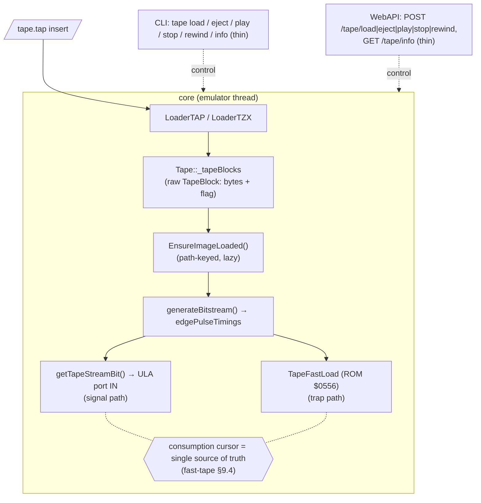
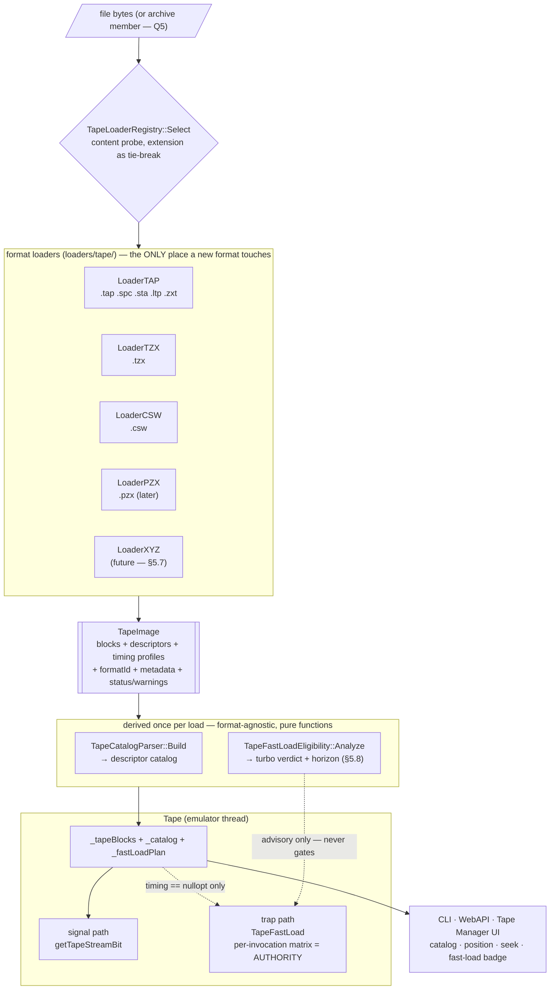

# Tape Manager: Full TAP Catalog, Seek/Rewind, and Non-Blocking UI Window

| | |
|---|---|
| **Status** | r0 — draft for review |
| **Date** | 2026-09-01 |
| **Feature** | Tape block catalog (full TAP parsing), position/seek/rewind API, Tape Manager window |
| **Affects** | `core/src/emulator/io/tape/`, `core/automation/cli/`, `core/automation/webapi/`, `unreal-qt/src/` |
| **Related** | `docs/inprogress/2026-08-30-fast-tape-loading/design.md` (§9.4 consumption cursor, §9.5 pause/resume lifecycle), `docs/inprogress/` TTD parent TDD (§4 tape session invalidation, §6.4 TTDSerializable) |

## Revision History

| Rev | Date | Notes |
|-----|------|-------|
| r0 | 2026-09-01 | Initial design: catalog model, seek/rewind semantics, control-plane extensions, Qt Tape Manager window |
| r1 | 2026-09-01 | Unified tape block model: per-block encoding/speed profile (standard vs turbo vs pulse stream), headerless classification, loader contract (`TapeImage`), full TZX design, CSW + PZX coverage, TAP-family variants (SPC/STA/LTP/ZXT), linearization policy |
| r2 | 2026-09-01 | Amendments from the TZX loader spec ([tzx-loader-design.md](tzx-loader-design.md)): **A1** timing profile period fields widened to u32 (TZX $11 u32 pilot; CSW long pulses), **A2** `TapeImage::parseWarnings`; cross-references wired
| r3 | 2026-09-01 | Review fixes and architecture hardening. Corrected the §5.4 TZX block-ID table ($22/$23/$24/$25/$27/$28 were mis-assigned). **A1 corrected**: `generateBitstream()`'s own parameters are `uint16_t` today — widening the profile *requires* widening the engine signature (§5.2). New `tapetypes.h` pure-data header resolves the `tape.h` ↔ `tapecatalog.h` include cycle (§5.1a). Loader contract v2: buffer-based `Load`, explicit status/error channel, self-registering registry with content probes replacing the closed extension switch (§5.3). New **§5.7** new-format checklist and **§5.8** fast-load eligibility pre-analysis (whole-image turbo verdict, stickiness horizon, advisory-not-authoritative contract). Fixture paths unified on `testdata/loaders/`; TTD blob change costed against the existing 41-byte assertions (§11)
| r4 | 2026-09-01 | **P1 + P1b implemented** (this rev records the as-built deviations). `ControlBlock` added to `FastLoadRejectEnum`: structural Control entries need an honest per-block encoding — `None` must never display as trap-shaped "yes" in the FAST column. `Empty` verdict also covers pause/structure-only images (no loadable byte payload). `acceleratedSeconds` counts encoding time only — pauses still elapse through the trap, and the ROM 1-second post-block pause is inherited by `StandardRom` profiles with `pauseMs == 0` (same rule as the duration model, §5.2). Truncated-tail-with-usable-prefix loads land as `Warnings`, never `Malformed` (§5.3) |
| r5 | 2026-09-02 | Registration anchoring fix (as-built deviation from §5.7 step 3 as written). The per-TU anonymous-namespace registrar flags were invisible to the static linker: `loader_tap.o` / `loader_tzx.o` were dead-stripped from binaries that never name a loader class (unreal-qt, headless automation), so the registry came up empty and every tape load failed with "no loader claims the buffer" (surfaced by the P5 WebAPI smoke test; unit tests passed because they reference the loader classes directly). Built-ins now register on first use inside `TapeLoaderRegistry::Instance()` (`loader_tape.cpp`) — the anchor pulls both objects into any link that already needs the registry, magic-static keeps it idempotent/thread-safe. §5.7 step 3 updated to point at that anchor. Still no changes outside `core/src/loaders/tape/`. **Also (same smoke test):** `TapeFastLoadEligibility::Analyze` now runs over the parser-filled catalog, not the raw `TapeImage` — loader descriptors are partial by contract (§5.5), so the old call site classified never-derived checksums/flags/durations (every app-level tape read "checksum_invalid" with `totalSeconds == 0` while unit tests, which hand-fill descriptors, stayed green). New `Analyze(descriptors, controlFlowLinearized)` overload; the image-taking form remains for tests; §5.6 flow updated |
| r6 | 2026-09-03 | **P6 implemented** (as-built deviations from §9 as written). (1) All window widgets live in the dedicated `unreal-qt/src/tape/` subfolder (`tapeuisnapshot.h`, `tapeblocktablemodel.h/.cpp`, `tapemanagerwindow.h/.cpp`) — portability/maintainability requirement; the UI is code-built, no `.ui` file (project builds with `AUTOUIC OFF`), superseding §9.2's `src/ui/tapemanagerwindow.ui` placement. (2) The frame-end producer is `EmulatorBinding`'s existing `NC_VIDEO_FRAME_REFRESH` callback (filtered by emulator id) — same emulator-thread frame-end point the design's GUIEmulatorContext hook designated; snapshot delivered via queued `tapeStateChanged(TapeUiSnapshot)` with `qRegisterMetaType`. (3) `TapeUiSnapshot` extends the §9.2 sketch with `fastTapeEnabled` (badge shows prediction + toggle state, §8.3 item 6), `formatId`/`catalogValid`/`emulatorId`; generation detection is the (path, loaded-format-id) pair — the `"tap"→""` transition on `stopTape()` re-ships the table exactly like `GET /tape`'s parse-once semantics. (4) Stop and Eject are one button: the control plane exposes exactly one drop op (`stopTape()`, CLI `tape stop` parity). (5) The §9.1 "Observed this session: N trapped" line is omitted — core keeps no observed-trap counter (would need a `TapeFastLoad` counter + snapshot field; candidate follow-up). (6) Menu: `View → Tape Manager` (Ctrl+3, checkable, hidden by default); the window emits `visibilityChanged` so its close box keeps the menu check in sync; registered with `DockingManager` at the bottom edge; Q2 resolved as non-persistent, matching the Debugger/Log windows. Exit gate: zero-warning build, suite 1899 passed / 7 pre-existing failures, live smoke per §8.3 notes |
| r7 | 2026-09-04 | **P6 usability fixes** (user feedback on the first hands-on session). (1) Menu action relocated `View → Tools → Tape Manager` (after Audio Settings; Ctrl+3 unchanged) — supersedes r6 note 6. (2) Badge "unreadable" flicker root-caused and fixed window-side: the generation-scoped snapshot fields (`catalogValid`/`plan`/`formatId`/catalog) ride ONLY the `catalogChanged` snapshot (§9.3 rule 3), but `updateBadge`/`updateToolbarEnabledState`/`updateDetails`/`updateWindowTitle` read them from EVERY per-tick snapshot — ~100 ms after any successful load the defaults flipped the badge to "Tape image unreadable" while the table (rebuilt only on generation change) stayed populated. The window now latches those fields into a generation cache when `catalogChanged` arrives; all refresh paths read the cache. (3) `EmulatorBinding::tapeStop()` now clears `coreState.tapeFilePath` after `stopTape()` — same sequence as the CLI/WebAPI eject handlers; the old binding left the path set, so the next generation snapshot re-parsed the same file and refilled the table right after Stop. (4) Double-click opens a block-content popup (`tapeblockdialog.h/.cpp`): data blocks paired with a `Program` header decode through the core `BasicExtractor` (body = raw data minus `$FF` flag and trailing checksum, verified raw 107 = declared 105 + 2 on `parallax-demo.tzx`); every other byte-payload block — headers included — shows a QHexView dump (same `QMemoryBuffer` + 8-bytes/line pattern as the debugger); pulse/control entries get a no-payload note. Payload leaves the emulator thread only as a pause-bracketed copy (`EmulatorBinding::tapeGetBlockData`). (5) FR-10 seek relocated from double-click to the table context menu; `activated()` dropped deliberately (fires on single click under macOS item-view styles and on Enter elsewhere) in favor of `doubleClicked()` + context menu. Hint texts reworded. Exit gate: zero-warning build (pre-existing `ld` duplicate-libraries note on `librecording.a` unchanged), suite 1906 ran / same 7 pre-existing failures (5 disassembler golden + 2 scroller boot, one flaky between runs), live macOS AX-automation smoke: menu placement, badge stability across ticks, BASIC/header/code dialogs, context-menu seek ("next: block 4"), Play→Stop image drop ("No tape inserted", 0 blocks) |
| r8 | 2026-09-04 | **TAP corpus vetting + pair-context display** (user report: "DIZZY_X_ALEX_S first data block is BASIC but shows as header + headerless data"). Analysis first: all 26 real `.tap` files in the repo (testdata/loaders, data/testsoft, data/testtapes, webapi resources) walked by an INDEPENDENT parser (`tools/verification/tape/tap/tap-audit.py`, new — framing + ROM header decode + XOR parity, mirrors the tzx tool trio) and cross-checked against the live WebAPI catalog — the core pairing/classification is CORRECT on every file (block 0/1 always pairs; DIZZY_X blocks 2+ are genuine headerless custom-loader payloads; EMELYANOV's 0x07/0x10/0x11/0x17 flags correctly classify as Custom → partial verdict). The defect was presentation: paired data rows rendered BLANK NAME/TYPE cells, making the BASIC program body visually indistinguishable from the headerless custom-loader blocks. Fix (UI-layer synthesis only — core descriptor semantics per §5.5 unchanged, headers stay the sole interpretation carriers): (1) `TapeBlockTableModel::pairedHeaderAt()` — paired data rows now show the paired header's NAME and TYPE in the table (row 1 reads `Data · no · DIZZY-X+ · Program · 803`); (2) HDRLS tooltip explains headerless rows ("custom-loader payload"); details pane adds "body of Program 'X', declared length N" and a "headerless — custom-loader payload" line; (3) popup title gains pair context ("Block 1 — Data · body of Program 'DIZZY-X+'"); (4) window title shows a friendly instance label (`TapeUiSnapshot.emulatorLabel`: symbolic id, else "#"+id tail) instead of a raw UUID. Regression: `ExtractBasic_TapProgramBlock_DizzyX` (core/tests) decodes the REAL block-1 body through `BasicExtractor` — asserts the "0 REM" opener and the "VIKTOR VIKTOROVICH TEL. 65-00-83" credit line survive the protected listing. Exit gate: zero-warning build (same pre-existing `ld` note), suite 1899 passed + new test / same 7 pre-existing failures, live OCR-verified UI: table row 1 shows Program 'DIZZY-X+', title `#<id-tail>`, popup listing renders the real protected BASIC (line-0 REM token soup + KHARKOV credit lines) |
| r9 | 2026-09-04 | **Interaction swap + readable BASIC listing** (two user requests on the DIZZY_X popup). (1) Table interactions swapped to the user's preferred mapping: **double-click = rewind/seek** (restores FR-10's original double-click; supersedes r7 note 5), and the **context menu carries both row actions** — "Rewind to block N" and "Details…" (the block-content popup). Hint text updated ("Double-click rewinds to a block · right-click opens the block menu"); `onBlockDoubleClicked` seeks, `onTableContextMenu` offers both. (2) Readable formatting for compacted single-line listings ("can we do readable formatting for the decoded basic even it was compacted single line?"): core gained a structured walk `BasicExtractor::extractBasicLines()` returning `BasicLine{lineNumber, text, startOffset, endOffset, leadingSpace, variablesArea}` / `BasicListing{lines, programEndOffset, variablesBytes}` — `extractBasic()` is now the exact plain-text join of that walk (byte-identical legacy output; all pinned tests unchanged). The variables area a SAVE'd program carries after the listing is detected by the first "line number" above the 9999 editor limit (`MaxLineNumber`; var-name bytes 0xA1+/0x41+ decode as huge numbers — DIZZY_X: 0xEE00 = 60928, 25 bytes). The popup listing renders into a QTextEdit with a grey right-aligned line-number gutter and a hanging indent (`QTextBlockFormat` leftMargin + negative textIndent), so wrapped continuations of the machine-code-stuffed line-0 REM stay visually distinct from new logical lines, and the vars tail renders as an italic note "— variables area: N bytes after the listing —" instead of the bogus "60928 \PNOT…" pseudo-line. Tests: synthetic `ExtractBasicLines_StructureAndVarsArea` (offsets, spacing rules, vars flag, exact legacy join) + real-file `ExtractBasicLines_TapProgramBlock_DizzyX` (structure, vars delimiting, join invariant on the actual tape). Exit gate: zero-warning build (same pre-existing `ld` note), suite 1909 ran / 1902 passed / same 7 pre-existing failures; live OCR-verified: gutter digit renders grey at the gutter column, all wrapped continuations align at one indent column (hanging indent works), vars note shows "25 bytes" (ground-truthed by an independent Python walk: vars start 776, 25 bytes, pseudo-number 60928), double-click row 1 → cursor 1, menu "Rewind to block 4" → cursor 4, "Details…" opens the pair-context dialog, dialog closes via Escape (Close button uses the canonical `rejected→reject` wiring — synthetic-click coordinate drift on this box made the button click itself untestable headless) |
| r10 | 2026-09-04 | **HEADER column rename/inversion + prev/next track buttons** (two user requests). (1) The block table's `HDRLS` column is now `HEADER` with inverted content — **YES only when a header is provided**: paired data bodies (DIZZY_X row 1, the Program body) show YES, headerless custom-loader payloads show "no", Header/Tone/Pulse/Control rows keep "—" (the display stays kind-guarded because `headerless` defaults false for non-payload blocks — DerivePairing only sets it for Data/Custom; a naive `!headerless` would YES every Tone row). Enum renamed `ColHeaderless`→`ColHeader`; pairing tooltips unchanged (they already matched the inverted semantics). CLI `tape blocks` mirrored: `FormatHeaderlessColumn`→`FormatHeaderColumn`, header label `HDRLS`→`HEADER` with setw 6→7 and the 86→87 dash rule (per-surface lowercase kept — CLI is lowercase throughout). (2) Fast previous/next track positioning: two toolbar buttons ⏪/⏩ (SP_MediaSeekBackward/Forward; Rewind keeps SP_MediaSkipBackward ⏮ to block 0) seek one block relative to the head — anchor `currentBlockIndex()` = in-flight block whenever the head is positioned (playing/paused/seeked), else the consumption cursor; boundary-aware enablement (prev disabled at block 0, next disabled at the last block), same `tapeSeekToBlock` path as double-click/context-menu rewind. Exit gate: zero-warning build (same pre-existing `ld` note), suite 1909 ran / 1902 passed / same 7 pre-existing failures; live-verified: UI table shows HEADER with row 0 "—", row 1 YES, rows 2–4 no (OCR of the DIZZY_X popup table); CLI `tape blocks` shows `HEADER` / row 1 `yes`, rows 2–4 `no`; AX-driven button clicks move the consumption cursor 0→1→2→1→2→3→4, Next at block 4 stays put, enabled flags flip at both boundaries while Play/Pause/Stop/Rewind keep their §9 states |
| r11 | 2026-09-04 | **Headerless blocks always show TYPE Code** (user request). The TYPE column's blank-cell case is gone: a data block with `headerless=true` renders `Code` (via the canonical `getTapeBlockTypeName(TAP_BLOCK_CODE)` — single source of the display string) in the UI table ([tapeblocktablemodel.cpp] ColType, after the headerValid/paired fallbacks) and in CLI `tape blocks` (TYPE cell: `headerValid ? name : headerless ? Code : "-"). No kind guard needed — `headerless` is only ever set for Data/Custom by DerivePairing, so Tone/Pulse/Control rows keep "—"/"-" and paired bodies keep the r8 pair-context type. Exit gate: zero-warning build (same pre-existing `ld` note), suite 1902 passed / same 7 pre-existing failures; live-verified on DIZZY_X: UI TYPE column reads Program/Program/Code/Code/Code (rows 0–4), CLI `tape blocks` shows `Code` on rows 2–4 with rows 0–1 unchanged |
| r12 | 2026-09-04 | **⚡ only for blocks the trap can actually serve — headerless rule wired** (user report: "fast indicator must appear only if block can be turboloaded; DIZZY_X code blocks are headerless and fall back to the hookless standard loader"). The reserved `FastLoadRejectEnum::Headerless` §5.8 row is now evaluated as **rule 1b** in `TapeFastLoadEligibility::ClassifyBlock`: a headerless Data block's consumer is a custom loader that never calls the hooked LD-BYTES — the trap can never serve it, whatever its encoding shape. Checked after the kind switch (Header/Control/PulseStream/Custom keep their existing reasons) and before rule 2 (timing), so the ROM-shaped headerless payloads that exposed the gap (DIZZY_X blocks 2–4: standard timing, $FF flag, valid checksum — the v1 rules passed them and ⚡ promised a fast path the runtime never took) now decline statically. No display-surface code changed: the enum already carried phrases everywhere — UI `no — headerless` (ColFast renders · instead of ⚡), CLI `hdrless`, WebAPI wire `"headerless"` + reason "is headerless" — they light up now that the classifier emits the value; the details-pane "Blocks from 2 on play at real speed (fallback stickiness)" sentence comes from the existing partial-verdict decline machinery. Tests: synthetic `HeaderlessDataRejected` (verdict None, firstReject Headerless, eligible 0) + real-fixture `RealTapHeaderlessPayloadsArePartial` (DIZZY_X through LoaderTAP → TapeCatalogParser::Build → Analyze: Partial, horizon 2, eligible 2, perBlock 2–4 = Headerless, perBlock 0–1 = None). Exit gate: zero-warning build (same pre-existing `ld` note), suite 1911 ran / 1904 passed / 7 failures = the known set (disassembler golden + scroller boot; this run's seventh was `KeyboardInjection TapKey_SingleCharacter`, proven flaky by A/B with the rule disabled — PASS/FAIL/FAIL/PASS on the unchanged binary, `formatOperandString` passed instead; a one-off process abort during the first full run did not recur). Live-verified on DIZZY_X (before r12: verdict Full, ⚡ on all 5 rows): WebAPI per-block `fast_load` yes/yes/headerless/headerless/headerless, plan `partial` with first_reject {index 2, reason "headerless"}, summary "fast load: partial — blocks 0-1 of 5; block 2 is headerless"; CLI FAST column `yes yes hdrless hdrless hdrless`; UI status bar "Fast load: PARTIAL - blocks 0-1 (~11.3s of 291.6s) • block 2 is headerless" and details panes row 1 "yes - ROM-standard, trap-shaped" vs row 2 "no - headerless. Blocks from 2 on play at real speed (fallback stickiness)" |

## 1. Goals and Motivation

### 1.1 User-facing goals

1. **See what is on the tape — for every format.** A parsed, human-readable block catalog: index, kind (Header / Data / Custom flag / tone / pulse stream / control), **with-header vs headerless** classification, **speed profile** (standard ROM 1500-baud / custom turbo with actual pulse timings / raw pulse stream), filename, declared type, length, params, checksum validity, estimated duration, header→data pairing. Identical information and identical UI regardless of whether the image is TAP, TZX or CSW.
2. **Move around the tape.** Rewind to start, and seek to an arbitrary block by index (double-click in UI, `tape seek` in CLI, `POST /tape/seek` in WebAPI). Re-loading an already-consumed block must be possible (explicit user intent wins over the consumption cursor).
3. **Tape Manager as a separate, non-blocking window.** A Qt top-level window (like the Debugger and Log windows) bound to the *active* emulator only: live position indicator, transport controls (play / pause / stop / eject / rewind / seek), block table, block details pane. It must never pause or stall the emulator by its mere existence or refresh cycle.
4. **Parity across control planes.** Everything the window does must also be scriptable: CLI subcommands and WebAPI endpoints expose the same catalog and the same seek/rewind/pause operations.
5. **Know before you press play whether this tape will turbo-load.** The image is analysed at load
   time into a fast-load verdict — *full* (the whole tape traps through the ROM loader in seconds),
   *partial* (a prefix traps, then a turbo or pulse block forces real speed for everything after), or
   *none* (custom loader — real speed throughout) — with the *reason* and the *responsible block*
   named. This answers "why is this tape taking eight minutes?" before it is asked (§5.8).
6. **One unified tape state across all loaders.** A single loader contract feeding a single block model: playback state machine, position reporting, seek, catalog and UI behave identically no matter which format the image came from. New formats plug into the contract instead of growing their own paths.

### 1.2 Technical motivations

- The current `tape info` (CLI) and `GET /tape/info` (WebAPI) are thin: file path plus "Ready" — both carry source comments admitting the gaps ("`_tapeStarted` is protected, cannot access directly"). `Tape::IsPlaying()` and `GetConsumptionCursor()` exist now; nothing surfaces them.
- The disk subsystem already has a rich inspection API (`GET /disk`, `/disk/:drive/catalog`, `/sector/...`) — the tape subsystem is the odd one out.
- Multi-stage custom loaders (e.g. `insult.tap`, see `2026-08-30-fast-tape-loading` §9.5 and the ongoing stuck-loader investigation) derail on specific headerless blocks. A block catalog plus manual seek gives users — and us — a direct "retry block N" lever without restarting the emulator.
- `TapeBlock` today carries only raw bytes + flag. All header semantics (name, type, params) are re-derived ad-hoc in tests and nowhere in the product.
- **TZX is accepted but broken**: `Emulator::LoadTape` validates `.tzx`, but `Tape::EnsureImageLoaded()` runs `LoaderTAP::loadTAP()` on the path unconditionally (tape.cpp L181-182) — a TZX file is mis-parsed as TAP length-prefixed blocks. `LoaderTZX` is a validation stub (231 lines: header + hardware-type logging, no block dispatch). The unified loader contract is the vehicle to make `.tzx` actually work, and to add CSW/PZX without a third and fourth special case.

## 2. Non-Goals (v1)

- **Audio-sample input** (WAV / VOC / Z80Em RAW). Requires audio DSP edge extraction — a different subsystem with its own accuracy problems. The standard workflow is WAV→CSW/PZX conversion (external tools); if ever needed, such an importer would emit the same `PrecomputedPulses` representation defined in §5.2, so the model leaves the door open without committing to the work.
- **Non-Spectrum-machine tape formats**: CDT (Amstrad CPC), ZX80/ZX81 (`.O/.P/.80/.81`). Different ROM loaders and header layouts; revisit only if the emulator ever hosts those machines.
- **TZX archival metadata editing / creation** (writing TZX, archive-info authoring). Read-only inspection.
- **Pulse-level seek** (seek *into* the middle of a block's waveform). v1 seek granularity is the block boundary — matching the physical reality that loaders resynchronize on pilot tones, never mid-block (§9.4 of the fast-tape design).
- **Tape image editing** (reordering, deleting, patching blocks).
- **Waveform visualization** of the tape signal.
- **Multiple simultaneous Tape Manager windows** (one window, re-bound to the active emulator; see §9.4).

## 3. Background: Current State

### 3.1 Core tape pipeline (as-is)



### 3.2 `Tape` public surface relevant to this design

| API | Notes |
|---|---|
| `reset()` | Rewind **and** drop the parsed image (session-invalidator) |
| `startTape()` / `stopTape()` | Legacy start/stop; `stopTape` drops the image |
| `stopPlayback()` | Stop, keep image, partially-played block counts as consumed (§9.4) |
| `pausePlayback()` | Freeze head mid-block; recoverable (§9.5) |
| `ResumePlaybackAfterPoll()` | Sustained-EAR-poll auto-resume (256 reads/frame threshold) |
| `EnsureImageLoaded()` | Lazy, path-keyed parse into `_tapeBlocks` |
| `GetConsumptionCursor()` / `ConsumeBlock(i)` / `StartPlaybackAtCursor()` | Fast-loading cursor interface |
| `GetBlocks()` | Raw `TapeBlock` const-ref (bytes + flag + pulses) |
| `IsPlaying()` | `_tapeStarted` only — no paused/frozen/end-of-tape distinction |

**Gaps:** no header interpretation, no catalog, no position getter (in-flight block / pulse index are protected), no playback-state enum (paused is invisible), no seek, no control-plane pause.

### 3.3 Control surfaces today

| Surface | Commands | Gaps |
|---|---|---|
| CLI (`cli-processor-tape.cpp`) | `tape load / eject / play / stop / rewind / info` | No block list, no seek, no pause, `info` lacks state/position/blocks |
| WebAPI (`tape_disk_api.cpp`) | `POST /tape/{load,eject,play,stop,rewind}`, `GET /tape/info` | Same as CLI; no catalog endpoint (contrast: disk has catalog/sector/track/sysinfo) |
| Qt | Menu-driven insert + implicit auto-start; no tape window at all | Everything |
| Format dispatch (`Emulator::LoadTape`) | Validates `.tap`/`.tzx` only; stores path; parse deferred to `EnsureImageLoaded()` | `.tzx` reaches `LoaderTAP` (tape.cpp L181) — parsed as TAP, produces garbage blocks or fails; `.csw`/`.pzx` rejected at the door |

Thread discipline (existing, kept): control commands pause the emulator briefly (`Pause()` → op → `Resume()`), same as `HandleTapePlay` etc. do today.

### 3.4 Qt infrastructure this design builds on

- **Non-modal top-level window pattern**: `MainWindow` creates `DebuggerWindow` / `LogWindow` with `new ...` + `show()` (mainwindow.cpp ~L135–L141) — separate windows, never modal, emulator keeps running.
- **`EmulatorBinding`** (`unreal-qt/src/emulator/emulatorbinding.h`): the sole bridge for window state; signals `bound()`, `unbound()`, `stateChanged()`, `ready()`, `notReady()`; cached accessors safe from the UI thread. The active emulator *is* the bound emulator — this design defines "active" exactly that way.
- **`DockingManager`** (`unreal-qt/src/common/dockingmanager.h`): optional edge-snapping for floating top-level windows — the Tape Manager window is a plain floating window and gets the same treatment for free.
- **Per-frame hook**: `GUIEmulatorContext` already runs per-frame code on the emulator thread (screen refresh path) — the snapshot producer (§9.3) hooks the same place.

### 3.5 Tape format landscape ("tzx? what else?")

Survey of formats used across ZX emulators (sources: libspectrum/Fuse support list, Sinclair Wiki tape-format pages, ZEsarUX README, Taper docs):

| Format | What it is | State today | Contribution to the unified model |
|---|---|---|---|
| **TAP** | Raw ZX block dumps: `[u16 len][flag…payload…checksum]…` | Working (LoaderTAP) | Bytes + standard flag per block; ROM-standard timing assumed |
| **SPC** | TAP variant: block length = TAP−2; parity excludes the flag byte (SP emulator, DOS) | Rejected | Same as TAP — one variant flag away (§5.4) |
| **STA** | TAP variant: length = TAP−2; parity byte not stored at all (Speculator, RISC OS) | Rejected | Same as TAP |
| **LTP** | TAP variant: length = TAP−2, otherwise identical (Nuclear ZX, DOS) | Rejected | Same as TAP |
| **ZXT** | TAP + 128-byte +3DOS header (`TAPEFILE`) for +3 DOS file handling | Rejected | Strip the header → identical to TAP |
| **Warajevo TAP** | `.tap` extension but different internal framing (Warajevo emulator) | Rejected | Read-only curiosity; lowest priority |
| **TZX** | Preservation standard, 30+ block types: standard/turbo speed data, pure tone, pulse sequences, direct recording, CSW-embedded, control flow (jump/loop/call/select), metadata (text/archive/hardware) | **Accepted but broken** — mis-parsed as TAP (§1.2) | Everything: per-block timings, custom encodings, pulse streams, control flow, image metadata |
| **CSW** v1/v2 | Compressed Square Wave: whole-signal pulse train (RLE / zlib-compressed half-period durations) | Rejected | One `PrecomputedPulses` stream; split into pseudo-blocks at long pauses (§5.4) |
| **PZX** | Open pulse-level format (`PULSE`/`DATA`/`CHUNK`/`STRS` records) | Rejected | Same as CSW; rarer in the wild — lowest priority |
| **VOC / Z80Em RAW** | Audio-sample family: Creative Voice files / Z80Em raw tape samples (both accepted as tape input by some tools/emulators) | Rejected | Same bucket as WAV (§2): needs edge extraction |
| **WAV** | Raw audio capture | Rejected | Out of scope (§2); would map to `PrecomputedPulses` via edge extraction if ever added |

Adjacent but **not** tape formats for this design: **RZX** (input recordings for playback verification — a different subsystem), **CDT** (Amstrad CPC sibling of TZX — different machine), **.O/.P/.80/.81** (ZX80/ZX81 tapes, supported by ZEsarUX — different machines), **ZIP/GZ/7Z containers** (Fuse/ZEsarUX load tapes from archives directly — a `FileHelper`-level concern, orthogonal to the tape model; see Q5).

Useful reuse already in tree: `LoaderTAP` provides checksum helpers and `dumpBlocks()` debug dumps
(loader_tap.h L124-136); `tape.h` documents the full ROM timing constant set — the timing profile
(§5.2) parameterizes exactly those constants. **`ZXTapeHeader` (loader_tap.h L76-96) is *not* reusable
as-is**: it is declared but referenced nowhere in the tree (dead since introduction), it carries no
`#pragma pack`, and its natural layout puts `dataLength` at offset 12 where the wire format has it at
11 — `sizeof` is 20, not the 18 header bytes it appears to describe. It also omits the leading flag
byte. Overlaying it on tape data silently produces garbage. §5.5 therefore specifies explicit
field-by-field decode; the struct is either packed and corrected or deleted during P1. No `.tzx`/`.csw` fixtures exist under `testdata/` yet — fixtures are part of the test plan (§8).

## 4. Requirements

### 4.1 Functional (FR)

| ID | Requirement |
|----|-------------|
| FR-1 | Parse every loaded tape image (TAP/TZX/CSW/PZX) into a block catalog: per block — index, raw size, kind (Header/Data/Custom/Tone/PulseStream/Control), **with-header vs headerless**, **speed profile + effective baud**, and for headers: filename, type, declared length, param1/param2, header validity; per block: checksum validity, playability, estimated duration, header↔data pairing. |
| FR-2 | Expose the catalog from `Tape` (const, cheap) and keep it coherent with `GetBlocks()` — same indexing, invalidated together on image change. |
| FR-3 | Report a playback state enum (`Idle / Playing / Paused / Ended`) and a position (`blockIndex`, `pulseIndex`, `offsetWithinPulse`, `secondsIntoBlock`) at any time. |
| FR-4 | `SeekToBlock(index)` positions the tape so the next delivery (signal or trap) starts at that block's pilot tone. Works forward and **backward**, including already-consumed blocks. |
| FR-5 | Rewind = seek to block 0 (public `RewindToStart()`), implemented without dropping the image (unlike legacy `reset()`). |
| FR-6 | Manual transport pause via control plane (`pausePlayback()`), and an explicit resume that un-pauses the frozen position (`ResumePlaybackFromPause()`) — distinct from the poll-driven auto-resume. |
| FR-7 | CLI: `tape blocks`, `tape seek <index>`, `tape pos`, `tape pause`; enrich `tape info` with state, position, block count, format, fast-tape flag. |
| FR-8 | WebAPI: `GET /tape` (catalog + state + position snapshot), `GET /tape/blocks/:index` (descriptor + hex preview), `POST /tape/seek`, `POST /tape/pause`; OpenAPI spec updated (`openapi_tape_disk.inc`). |
| FR-9 | Qt: `TapeManagerWindow` — non-modal top-level window for the active (bound) emulator: transport toolbar, block table with position marker, details pane; menu entry `View → Tape Manager`. |
| FR-10 | Double-clicking a block (UI) / `tape seek` (CLI) / `POST /tape/seek` (WebAPI) all perform the same core `SeekToBlock`. |
| FR-11 | **Unified loader contract**: every tape loader implements `LoaderTapeBase` and returns a `TapeImage`; playback state, position, seek, catalog, UI and control planes are format-agnostic. |
| FR-12 | **TZX actually works**: full block-type dispatch per §5.4, replacing the validation stub; `.tzx` never reaches `LoaderTAP`. |
| FR-13 | `.csw` (v1/v2) and `.pzx` accepted through the same contract; the TAP-family variants (`.spc`/`.sta`/`.ltp`/`.zxt`) ride along as LoaderTAP variant flags (§5.4); unsupported extensions (e.g. `.wav`, `.voc`) rejected with an explicit message pointing at conversion. |
| FR-14 | Per-block encoding surfaced uniformly across UI/CLI/WebAPI: kind, headerless, speed profile + baud, full timing parameters, playability. |
| FR-15 | **Fast-load pre-analysis**: at image load, derive a whole-image turbo verdict (`Full`/`Partial`/`None`) plus a per-block reject reason, from descriptors alone — no format-specific logic (§5.8). |
| FR-16 | Report the **stickiness horizon** — the block prefix fast loading actually covers under fast-tape §6.3 — not the raw eligible-block count, and the wall-clock the trap can remove. |
| FR-17 | Surface the verdict and the *reason for rejection* on all three control planes (badge in the Tape Manager, `Fast load:` line in `tape info`, `fast_load` object in `GET /tape`), plus the observed outcome for comparison against the prediction. |
| FR-18 | The pre-analysis is **advisory only**: the trap's per-invocation decline matrix stays the sole authority; no code path may treat `Eligible` as a guarantee (§5.8). |
| FR-19 | **Format extensibility**: adding a tape format touches only `core/src/loaders/tape/` — a loader, a `TapeFormatInfo`, one registry line, fixtures (§5.7). Loader selection probes content, with the extension as a tie-breaker only. |

### 4.2 Non-functional (NFR)

| ID | Requirement |
|----|-------------|
| NFR-1 | **Non-blocking UI**: snapshot delivery to the window never pauses/resumes the emulator and never holds the UI thread on an emulator lock; refresh cost per tick is a POD copy + table update. |
| NFR-2 | Thread discipline unchanged: mutating tape-control calls from CLI/WebAPI/Qt use the existing brief `Pause() → op → Resume()` bracket (discrete user actions only, ≤ ~20 ms). |
| NFR-3 | Zero warnings, cross-platform (Windows/macOS/Linux, gcc/clang/msvc/mingw), per project guidelines. |
| NFR-4 | TTD: seek/rewind are tape-control commands → session invalidation + TTD markers, consistent with fast-tape design §4.2 / parent TDD rules (details §11). |
| NFR-5 | Catalog parse is O(n) in image bytes, runs once per image load (inside `EnsureImageLoaded()`), never per frame. Fast-load analysis (§5.8) is O(blocks) over descriptors and runs at the same point. |
| NFR-6 | Naming per project rules: PascalCase methods, camelCase fields, no underscores in new file names (`tapecatalog.h/.cpp`, `tapemanagerwindow.h/.cpp`). |

## 5. Design: Unified Tape Block Model (core)

### 5.1 Model overview

Every loader produces the same `TapeImage`; `Tape` plays it, describes it and seeks in it identically regardless of source format:



The seam is the `TapeImage` boundary. Everything left of it is format-specific and lives in
`loaders/tape/`; everything right of it — catalog, eligibility, playback, seek, and all three control
planes — is written once and never learns a format's name (§5.7).

### 5.1a Header layering (`tapetypes.h`) — resolving the include cycle

A naive split puts `TapeTimingProfile` in `tapecatalog.h` and leaves `TapeBlock` in `tape.h`. That
cycles immediately: `tape.h` needs the profile (it becomes a `TapeBlock` member) while
`tapecatalog.h` needs `TapeBlock` (for `TapeImage::blocks`) and `ZXTapeBlockTypeEnum` (which lives in
`tape.h` L38, *not* in `loader_tap.h`) — and `tape.h` drags in the whole `Tape` class and its
`EmulatorContext`, which the "pure data, no `EmulatorContext`" contract forbids.

Resolution: one new leaf header owns the vocabulary types, and everything else depends on it.

```
core/src/emulator/io/tape/tapetypes.h        ← NEW leaf: zero project dependencies
    TapeBlockFlagEnum, ZXTapeBlockTypeEnum   (moved out of tape.h)
    TapeBlock                                (moved out of tape.h; gains `timing`)
    TapeBlockKindEnum, TapeSpeedProfileEnum, TapeTimingProfile
    TapeBlockDescriptor, TapeImage, TapeLoadStatus, TapeFormatInfo
        │
        ├── emulator/io/tape/tapecatalog.h   TapeCatalogParser, TapeFastLoadEligibility (pure functions)
        ├── loaders/tape/loader_tape.h       LoaderTapeBase, TapeLoaderRegistry
        └── emulator/io/tape/tape.h          Tape (owns _tapeBlocks + _catalog + _fastLoadPlan)
```

`tape.h` keeps backward-compatible `using` aliases for the moved enums so existing includes and the
`TapeCUT` wrapper compile unchanged. No forward declarations are needed anywhere in the chain, and
the dependency graph stays acyclic and one-directional.

### 5.2 Block kinds, encoding and timing profile

```cpp
// core/src/emulator/io/tape/tapetypes.h (new pure-data leaf header — see §5.1a)

enum class TapeBlockKindEnum : uint8_t
{
    Header,           // standard $00 flag, 19 bytes → interpretable ZX header
    Data,             // $FF flag byte-payload block
    Custom,           // non-standard flag byte-payload block (custom loaders)
    Tone,             // pilot/tone-only signal (TZX $12, loader custom pilot)
    PulseStream,      // precomputed pulse train, no byte payload (TZX $13/$15/$18, CSW, PZX)
    Control           // structural entry: pause/jump/loop/call/select/stop (TZX $20-$2B)
};

enum class TapeSpeedProfileEnum : uint8_t
{
    StandardRom,      // ROM timings (equivalent to TZX $10); flag-payload blocks from TAP default to this
    Custom,           // byte payload with non-ROM bit timings (TZX $11 turbo, $14 pure data)
    PulseStream       // timing IS the content; no byte encoding (tone/pulse/DR/CSW/PZX)
};

struct TapeTimingProfile      // all values in T-states; mirrors generateBitstream() parameters exactly
{
    TapeSpeedProfileEnum profile = TapeSpeedProfileEnum::StandardRom;
    uint32_t pilotPulses = 0;     // 0 = no pilot emitted (pure data / tone handled by PulseStream)
    uint32_t pilotHalfPeriod = 0; // 0 fields = inherit ROM constants (only valid for StandardRom)
    uint32_t sync1 = 0, sync2 = 0;
    uint32_t zeroHalfPeriod = 0, oneHalfPeriod = 0;
    uint16_t pauseMs = 0;
    uint8_t  bitsInLastByte = 8;  // TZX $11/$14 trailing-bit count
    bool     invertedLevel = false; // TZX $2B influence / CSW initial polarity
};                              // A1 (tzx-loader-design.md §1): period fields u32 — TZX $11 pilot is u32,
                                // CSW pulse trains exceed u16 on long pauses; edgePulseTimings is already u32
```

`TapeBlock` gains `std::optional<TapeTimingProfile> timing;`:

- **nullopt** → ROM-standard encoding of `data` — exactly today's behavior; every existing TAP image and test untouched.
- **Custom profile** → `generateBitstream()` is called with the profile's parameters instead of the ROM constants. The function already takes all of them as arguments (`tape.h` L268-275), **but its period parameters are `uint16_t` today** — `pilotHalfPeriod_tStates`, `synchro1_tStates`, `synchro2_tStates`, `zeroEncodingHalfPeriod_tState`, `oneEncodingHalfPeriod_tStates`. Amendment **A1** widens the profile to `uint32_t`, so the engine signature must widen with it, or a TZX $11 pilot above 65535 T truncates silently — the exact failure A1 exists to prevent. **This is a P1 change, not P2**: it lands with the profile type, before any TZX code exists to exercise it. (`pilotLength_periods` and `pause_ms` are already `size_t`.)
- **Parameter-name trap**: `pilotLength_periods` is named for periods but carries **pulses** — `tape.cpp` L632 reads *"Pilot length is specified in pulses (half-periods), one edge each"*, and the ROM call site passes `PILOT_DURATION_HEADER`/`_DATA` straight through. The profile field is therefore `pilotPulses`, mapped 1:1 with **no ×2 conversion**. Rename the parameter to `pilotLength_pulses` in P1 while the signature is being touched anyway.
- **PulseStream blocks** → loader fills `edgePulseTimings` directly; `data` stays empty; `Tape` plays pulses without re-encoding. `getTapeStreamBit()` already plays whatever `edgePulseTimings` holds — no engine change, only generation moves into the loader.

The per-block catalog entry (r1 — superset of r0):

```cpp
struct TapeBlockDescriptor
{
    // identity & payload
    size_t index;                      // == TapeBlock index
    TapeBlockKindEnum kind;            // Header / Data / Custom / Tone / PulseStream / Control
    size_t rawSize;                    // byte-payload size incl. flag+checksum; 0 for pulse blocks
    uint8_t rawFlag = 0;               // preserved for Custom blocks; $00/$FF otherwise
    std::vector<uint8_t> payloadPreview;// first 16 bytes for details pane / API preview

    // header interpretation (byte-payload blocks with flag $00)
    std::string name;                  // trimmed 10 chars
    ZXTapeBlockTypeEnum headerType;
    uint16_t declaredLength = 0;
    uint16_t param1 = 0, param2 = 0;
    bool headerValid = false;

    // classification (r1)
    bool headerless = false;           // byte-payload block not preceded by a valid Header (n/a for pulse/control)
    size_t pairedHeaderIndex = SIZE_MAX;  // inverse link from Data/Custom back to its Header
    size_t pairedDataIndex = SIZE_MAX;    // Header → following Data block

    // encoding (r1)
    TapeTimingProfile timing;          // full profile — details pane & API expose it verbatim
    uint32_t baudEstimate = 0;         // 3.5 MHz / (zeroHalf + oneHalf); 0 for pulse streams
    std::string groupLabel;            // TZX $21 group, attached to the following block

    // validation & derived
    bool checksumValid = false;        // XOR(byte payload) == 0; false + rawSize==0 → "n/a"
    bool playable = true;              // false: unplayable-in-v1 entries (TZX $19), control leftovers
    double estimatedSeconds = 0.0;     // profile model (bytes) or pulse sum (pulse blocks)
};
```

### 5.3 Loader contract

```cpp
// core/src/emulator/io/tape/tapetypes.h — the image and its status channel

enum class TapeLoadStatus : uint8_t
{
    Ok,            // clean parse
    Warnings,      // usable image, parseWarnings non-empty (degraded/quirky source)
    Unsupported,   // recognized format, but nothing in it is playable by this build
    Malformed,     // framing broken beyond recovery; blocks may hold a partial prefix
    IoError        // source unreadable — set by the caller, never by a loader
};

struct TapeImage
{
    std::vector<TapeBlock> blocks;                 // playable: bytes(+timing) or precomputed pulses
    std::vector<TapeBlockDescriptor> descriptors;  // loader-supplied ground truth (may be partial;
                                                   // TapeCatalogParser fills the rest — §5.5)
    std::string formatId;                          // "tap" / "tzx" / "csw" / "pzx" — see §5.7
    TapVariantEnum tapVariant = TapVariantEnum::Standard;  // meaningful when formatId == "tap" (§5.4)
    std::string title;                             // TZX $30/$32 archive info
    std::string hardwareNote;                      // TZX $33
    bool controlFlowLinearized = true;             // false if jump/loop expansion hit the bound (§5.4)
    std::vector<std::string> parseWarnings;        // A2: human-readable load anomalies (UI warning badge)

    TapeLoadStatus status = TapeLoadStatus::Ok;    // r3: explicit outcome channel
    std::string errorText;                         // populated for Unsupported / Malformed / IoError

    bool IsUsable() const { return !blocks.empty() &&
                            (status == TapeLoadStatus::Ok || status == TapeLoadStatus::Warnings); }
};
```

**`formatId` is a string, not an enum.** A closed `enum class { TAP, TZX, CSW, PZX }` makes every new
format a change to a core header that the whole tree recompiles against, and it has to be mapped to a
string at all three control-plane boundaries anyway. The id *is* the wire value in
`GET /tape` and `tape info`, so it is stable API surface; the registry owns the set (§5.7).

```cpp
// core/src/loaders/tape/loader_tape.h — the contract and its registry

struct TapeFormatInfo
{
    std::string id;                               // "tzx"
    std::string displayName;                      // "TZX (preservation)"
    std::vector<std::string> extensions;          // { "tzx" }
    /// Confidence 0-100 that this buffer is this format. Magic-bearing formats
    /// answer 100/0; structural formats (TAP family) walk the framing and answer
    /// a graded score. Never reads the filesystem, never throws.
    int (*Probe)(std::span<const uint8_t> bytes);
};

class LoaderTapeBase
{
public:
    virtual ~LoaderTapeBase() = default;

    /// Whole-image decode from memory. `sourceName` is diagnostics + extension
    /// hint only — loaders never touch the filesystem, which is what makes
    /// fixtures, fuzzing and archive containers (Q5) work without temp files.
    virtual TapeImage Load(std::span<const uint8_t> bytes, const std::string& sourceName) = 0;

    virtual const TapeFormatInfo& Format() const = 0;
};

class TapeLoaderRegistry
{
public:
    static TapeLoaderRegistry& Instance();
    void Register(std::unique_ptr<LoaderTapeBase> loader);   // called once per format at startup

    /// Content probe first, extension as tie-breaker. Returns nullptr when no
    /// loader claims the buffer (caller emits Unsupported + the conversion hint).
    LoaderTapeBase* Select(std::span<const uint8_t> bytes, const std::string& fileName) const;

    std::vector<std::string> SupportedExtensions() const;    // drives Emulator::LoadTape + file dialogs
};
```

**Why probe content instead of switching on extension.** Extension dispatch is wrong on real-world
input in three ways this design already knows about: Warajevo `.tap` files carry a different internal
framing behind the same extension (§3.5); the TAP-family variants `.spc`/`.sta`/`.ltp` are routinely
renamed to `.tap` in the wild; and archives (Q5) hand us a buffer whose name may be meaningless.
Probing is cheap — TZX (`"ZXTape!"` + `$1A`), CSW (`"Compressed Square Wave"` + `$1A`) and PZX
(`"PZXT"`) all have magic in the first bytes, and TAP's structural probe (walk `[u16 len]` framing to
EOF; clean landing = high score, early overrun = 0) doubles as the Warajevo discriminator the format
table punted on. Extension only breaks ties and selects the `TapVariantEnum`.

`Tape::EnsureImageLoaded()` replaces the unconditional `LoaderTAP` call (tape.cpp L181) with: read the
file once, `TapeLoaderRegistry::Instance().Select(bytes, path)`, `Load(bytes, path)`, then
`TapeCatalogParser::Build()` and `TapeFastLoadEligibility::Analyze()` (§5.8). `Emulator::LoadTape`
validates against `SupportedExtensions()` instead of its hardcoded `ext != "tap" && ext != "tzx"`
(emulator.cpp L1232) — fixing the accepted-but-broken `.tzx` path and opening `.csw`/`.pzx`.

### 5.4 Per-format coverage

**TAP-family variants (near-free win)**: `.spc`, `.sta`, `.ltp`, `.zxt` are TAP with a framing quirk (Sinclair Wiki "TAP format — Similar formats"). One loader, one variant enum:

```cpp
enum class TapVariantEnum : uint8_t
{
    Standard,        // .tap — [u16 len][flag…checksum], parity = XOR incl. flag
    Spc,             // .spc — len = TAP−2, parity excludes flag (SP emulator)
    Sta,             // .sta — len = TAP−2, no parity byte stored (Speculator)
    Ltp,             // .ltp — len = TAP−2, otherwise identical (Nuclear ZX)
    Zxt              // .zxt — 128-byte +3DOS 'TAPEFILE' header, then Standard
};
```

`LoaderTAP` takes the variant as a constructor/`loadTAP` parameter; the unified model and catalog see byte-payload blocks identical to plain TAP (checksum rule adjusts per variant so `checksumValid` stays honest). Warajevo `.tap` (different framing) is deliberately **not** a variant — separate read-only loader if ever demanded (Q4-adjacent).

**TZX block-type mapping** (full dispatch replaces the validation stub; expanded to byte-level layouts, linearizer algorithm, error policy and test plan in [tzx-loader-design.md](tzx-loader-design.md)):

| TZX ID | Block | Unified mapping |
|---|---|---|
| $10 | Standard speed | `bytes + StandardRom` → `Header`/`Data`/`Custom` by flag, same as TAP |
| $11 | Turbo speed | `bytes + Custom` timing profile → `Data`/`Custom` (or `Header` if flag $00 & size 19 — legal in TZX too) |
| $12 | Pure tone | `PulseStream` tone (repeating pulse), kind `Tone` |
| $13 | Pulse sequence | `PulseStream`, kind `PulseStream` |
| $14 | Pure data | `bytes + Custom` profile with `pilotPulses=0` |
| $15 | Direct recording | `PulseStream` (samples expanded to half-periods), kind `PulseStream` |
| $18 | CSW recording | decompress → `PulseStream` (same code path as `.csw` files) |
| $19 | Generalized data | catalog entry only, flagged unplayable in v1 (rare; symbols-table expansion deferred — risk R6) |
| $20 | Pause / stop the tape | kind `Control` (pause pseudo-block); ≤ 5 ms pauses merge into the previous block's `pauseMs`; length `0` = terminal stop marker |
| $21 / $22 | Group start / Group end | image metadata: the open group's label attaches to every block decoded until the matching `$22` (UI grouping) |
| $23 | Jump to block | control flow — signed relative offset; see linearization below |
| $24 / $25 | Loop start / Loop end | control flow — body repeats `count` times in total; see linearization below |
| $26 | Select block | v1: treated as Jump to the first branch (logged; all branches listed in a warning); interactive selection out of scope |
| $27 / $28 | Call sequence / Return | control flow — each called sub-sequence inlined in list order; see linearization below |
| $2A | Stop tape if 48K | honored when model is 48K: terminal stop marker; else ignored |
| $2B | Set signal level | recorded in next block's profile `invertedLevel` |
| $30–$33 | Text / Message / Archive info / Hardware | image metadata (`title`, `hardwareNote`); no blocks |
| $35/$5A | Custom info / Glue | skipped, logged once |

**Linearization policy (control flow)**: TZX Jump/Loop/Call are *playback* semantics, but this design's cursor is a linear block index. Resolution: the loader **linearizes at parse time** — evaluates jump/loop/call into a flat block sequence, duplicating loop bodies, bounded by `TAPE_LINEARIZE_MAX_BLOCKS` (default 4096 expansions, constant tunable). Within the bound: `controlFlowLinearized=true`, cursor/seek semantics stay pure. Over the bound: the tape still loads with `controlFlowLinearized=false`, control blocks remain as `Control` entries, playback proceeds linearly and the catalog carries a warning badge — honest degradation instead of silent mis-load. Loops with astronomical repeat counts are protection schemes that also need $19-level fidelity; they degrade to linear either way.

**CSW**: v1 = RLE, v2 = zlib (pulses at `pulseRate` samples/s scaled to T-states). Decompressed pulse train → single `PulseStream`; **pseudo-block splitting** at pauses ≥ 2 s (configurable) so seek/catalog granularity exists; each pseudo-block gets kind `PulseStream`, estimated duration from pulse sum, checksum n/a. **PZX**: same pipeline (`PULSE`/`DATA` records; `DATA` records with non-ROM timings map to `bytes + Custom`).

### 5.5 Catalog derivation rules (TapeCatalogParser over TapeImage)

Header field layout (standard TAP/TZX $10; `TapeBlock::data` includes flag and checksum). Decoded
**field by field from the byte buffer** — never by struct overlay, for the reasons in §3.5:

| Offset | Field |
|--------|-------|
| 0 | flag ($00) |
| 1 | header type byte (0=Program, 1=Number array, 2=Char array, 3=Code) → `ZXTapeBlockTypeEnum` |
| 2–11 | filename, 10 bytes, trim trailing spaces (bit 7 stripped on display) |
| 12–13 | declared length (LE) |
| 14–15 | param1 (LE): start address for Code / autostart line for Program |
| 16–17 | param2 (LE): var start for Code / program length for Program |
| 18 | checksum byte |

Descriptor assembly (loader hints win; parser derives the rest):

- **Kind**: byte-payload blocks → Header/Data/Custom by flag byte (with the $00+size-19 header-parse rule; malformed → `headerValid=false`); pulse blocks → Tone/PulseStream; structural → Control.
- **Headerless classification**: derived per byte-payload block — `pairedWithHeader` when the immediately preceding byte-payload block is a *valid* Header (of any speed profile); `headerless=true` otherwise. This is exactly the insult.tap distinction the user cares about: ROM-protocol blocks come in header+data pairs; custom loader payloads are headerless by construction. Tone/PulseStream blocks: n/a (shown `—`).
- **Speed display value**: `StandardRom` → "Std ~1500 baud"; `Custom` → effective baud from `3.5 MHz / (zeroHalf + oneHalf)`; `PulseStream` → "pulse stream". Raw profile stays in the descriptor for the details pane (§9.1).
- **Checksum**: XOR of byte-payload `data` == 0. Pulse blocks: n/a (`—`).
- **Duration**: profile-driven for byte blocks (same formula as `generateBitstream` — cannot disagree with playback); pulse-sum for pulse blocks.
- **Loader hints**: TZX group labels, $2B level, CSW pseudo-block boundaries arrive via `TapeImage::descriptors` and override parser guesses where present.

### 5.6 Ownership and lifecycle

```
Tape::EnsureImageLoaded()
   ├─ (path changed) → read file once → bytes
   │       ├─ loader = TapeLoaderRegistry::Instance().Select(bytes, path)   ← content probe (§5.3)
   │       ├─ image  = loader->Load(bytes, path)                            ← TapeImage + status
   │       ├─ _tapeBlocks    = image.blocks
   │       ├─ _catalog       = TapeCatalogParser::Build(image)              ← same invalidation point
   │       └─ _fastLoadPlan  = TapeFastLoadEligibility::Analyze(_catalog,   ← same invalidation point; over the
   │                                                          image.controlFlowLinearized)   FILLED catalog — loader
   │                                                                                        descriptors are partial (§5.5)
   └─ (same path) → no-op (catalog and plan survive; cursor untouched)

Tape::GetBlockCatalog() → const vector<TapeBlockDescriptor>&   (cheap, always coherent with GetBlocks())
Tape::GetFastLoadPlan() → const TapeFastLoadPlan&              (cheap, advisory — never gates the trap)
```

- Catalog **and fast-load plan** live in `Tape` next to `_tapeBlocks`; all three die together on `stopTape()`/`reset()`/new insert. There is deliberately **no** separate invalidation path for either derived structure — one source of truth, one invalidation point.
- `TapeCatalogParser` remains a free function (now over `const TapeImage&`) so tests and tools build catalogs without a live `Tape`.
- New files: `core/src/emulator/io/tape/tapetypes.h` (§5.1a), `tapecatalog.h/.cpp` (parser **and** eligibility analyzer), `core/src/loaders/tape/loader_tape.h/.cpp` (contract + registry), `loader_csw.h/.cpp`; `loader_tzx.h/.cpp` rewritten; `tape.h` loses the moved vocabulary types and gains `_catalog` / `_fastLoadPlan`.
- **`tapefastload` stays untouched.** The trap already declines non-vanilla blocks and its decline matrix row set is unchanged — §5.8 mirrors that matrix rather than modifying it, which is precisely why the prediction can be checked against the trap's real behaviour (`FastLoadPlanMatchesObservedTrapping`, §8.2) instead of merely agreeing with itself.


### 5.7 Adding a new format — the complete checklist

The contract is only "universal" if a new format costs a bounded, enumerable amount of work. It does.
Adding PZX, Warajevo TAP, an ancestral `.blk`, or a future preservation format requires exactly this,
and **nothing outside `core/src/loaders/tape/`**:

| # | Step | Cost |
|---|---|---|
| 1 | New `LoaderXYZ : LoaderTapeBase` in `core/src/loaders/tape/` | the format's own parsing — the irreducible part |
| 2 | Fill a `TapeFormatInfo` (id, display name, extensions, `Probe`) | ~15 lines |
| 3 | One `Register(std::make_unique<LoaderXYZ>())` line in the built-in registrar anchored inside `TapeLoaderRegistry::Instance()` (`loader_tape.cpp`) — a per-TU static-init flag is not linkable, see r5 | 1 line |
| 4 | Map each of the format's blocks onto **one of exactly three representations** (below) | the design work |
| 5 | Fixtures in `testdata/loaders/<id>/` + a `LoaderXYZ_Test` | per §8.0 |

**Zero changes** to: `Tape`, the playback state machine, `SeekToBlock`, `TapeCatalogParser`,
`TapeFastLoadEligibility`, the fast-load trap, the CLI, the WebAPI, the OpenAPI spec, or the Qt
window. That is the test of the seam, and it is why `formatId` is a string (§5.3) and why eligibility
is computed over descriptors rather than per loader (§5.8).

**The three representations are a complete basis.** Every tape format in §3.5 — and, as far as this
design can establish, every tape format that exists — decomposes into:

| # | Representation | `data` | `timing` | `edgePulseTimings` | Covers |
|---|---|---|---|---|---|
| 1 | ROM-standard bytes | payload | `nullopt` | generated by `Tape` | TAP (all variants), TZX $10, PZX `DATA` at ROM timings |
| 2 | Custom-timed bytes | payload | `Custom` profile | generated by `Tape` | TZX $11/$14, PZX `DATA` at other timings, turbo loaders |
| 3 | Precomputed pulses | empty | `PulseStream` | filled by the loader | TZX $12/$13/$15/$18, CSW, PZX `PULSE`, any future audio import |

A format that needs a fourth representation would be one whose signal is neither byte-encoded nor
expressible as a pulse train — which is to say, not a tape signal. Representation 3 is the escape
hatch: anything a loader can render to edges plays correctly, at the cost of losing byte-level
semantics (catalog names, checksums, fast-load eligibility). That degradation is *honest and visible*
rather than a parse failure, which is the property that makes the model safe to extend.

**What a loader must fill for the shared machinery to work** — the actual interface contract, since
everything downstream is derived from it:

| Field | Required for | If left default |
|---|---|---|
| `TapeBlock::data` / `edgePulseTimings` | playback | block is silent |
| `TapeBlock::timing` | speed display, `generateBitstream` parameterization | treated as ROM-standard |
| `descriptor.kind` | catalog, UI grouping, seek labels | `Data` |
| `descriptor.rawFlag`, `checksumValid` | header pairing, **fast-load eligibility (§5.8)** | block scores ineligible — safe, never wrong |
| `descriptor.playable` | seek targets, duration totals | `true` |
| `parseWarnings`, `status` | UI badge, error reporting | silent success |

Every default is the conservative one: an under-filled loader produces a tape that plays through the
signal path with a thin catalog, never one that mis-loads or falsely claims fast-load capability.

### 5.8 Fast-load eligibility — whole-image turbo pre-analysis

**The problem.** The fast-load trap decides per invocation, at `PC == $0556`, and its
[decline matrix](../2026-08-30-fast-tape-loading/design.md) is reactive. It also has
**fallback stickiness** (fast-tape §6.3): once a decline starts signal playback, fast loading stays
off for the remainder of that playback — *"a tape whose first block is non-vanilla plays entirely at
real speed even if later blocks are vanilla."* The consequence is that per-block optimism gives the
user no way to know, before pressing play, whether this tape will fast-load in seconds or grind
through eight minutes of real-time turbo signal. That question is answerable at parse time, for every
format, from data the loaders already produce.

**The analysis.** `TapeFastLoadEligibility::Analyze(const TapeImage&)` runs once per image load,
immediately after `TapeCatalogParser::Build()`, over descriptors only — no format knowledge, no
`Tape`, no `EmulatorContext`:

```cpp
// core/src/emulator/io/tape/tapecatalog.h

enum class FastLoadVerdictEnum : uint8_t
{
    Full,        // every block is trap-shaped: the whole tape can fast-load
    Partial,     // a trap-shaped prefix, then a block that forces the signal path forever after
    None,        // block 0 already forces the signal path
    Empty        // no playable blocks
};

enum class FastLoadRejectEnum : uint8_t
{
    None = 0,
    NonStandardTiming,   // timing profile != StandardRom — TZX $11/$14 turbo, custom-timed PZX DATA
    PulseStream,         // no byte payload at all — TZX $12/$13/$15/$18, CSW, PZX PULSE
    NonStandardFlag,     // flag not $00/$FF: custom-loader payload the ROM would never accept
    ChecksumInvalid,     // XOR != 0 — trap declines, signal path reproduces "R Tape loading error"
    Headerless,          // byte block with no preceding valid header
    Unplayable,          // catalogued but not playable in this build (TZX $19)
    ControlFlowInert,    // image linearization hit its bound; play order is no longer authoritative
    ControlBlock         // NOT a reject: structural Control entry, skipped by the horizon walk (r4)
};

struct TapeFastLoadPlan
{
    FastLoadVerdictEnum verdict = FastLoadVerdictEnum::Empty;
    std::vector<FastLoadRejectEnum> perBlock;   // parallel to descriptors; None == trap-shaped

    size_t eligibleBlocks = 0;                  // total trap-shaped blocks anywhere in the image
    size_t stickinessHorizon = 0;               // blocks [0, horizon) — what fast load ACTUALLY covers
    size_t firstRejectIndex = SIZE_MAX;         // == stickinessHorizon when < blockCount
    FastLoadRejectEnum firstRejectReason = FastLoadRejectEnum::None;

    double acceleratedSeconds = 0.0;            // wall-clock the trap can remove (prefix only)
    double totalSeconds = 0.0;
    std::string summary;                        // one line, ready for CLI / API / UI badge
};
```

**`stickinessHorizon` is the number that matters, and it is not `eligibleBlocks`.** Because of
fast-tape §6.3 stickiness, a tape of 26 blocks where block 0 is a turbo loader and blocks 1-25 are
vanilla has `eligibleBlocks = 25` and `stickinessHorizon = 0` — it fast-loads *nothing*. Reporting
25 there would be a lie the user pays for in wall-clock. Every surface displays the horizon;
`eligibleBlocks` exists only to explain the difference ("25 of 26 blocks are ROM-standard, but block 0
is a turbo loader, so none of them can be trapped").

**Per-block rule** — a block is trap-shaped iff all of:

1. `kind` ∈ { `Header`, `Data` } (byte payload present), and
2. `timing == nullopt` — ROM-standard encoding, and
3. `rawFlag` ∈ { `$00`, `$FF` }, and
4. `checksumValid`, and
5. `playable`, and
6. the image is `controlFlowLinearized`.

Rules 1-5 are exactly rows 6-8 of the runtime decline matrix, evaluated statically. Rule 6 is
image-wide: an unlinearized image has no trustworthy block order, so its plan is `None`.

**`Control` blocks are skipped, not rejected**, when walking for the horizon. They carry no byte
payload for the ROM loader to consume and the trap never sees them, so a leading TZX `$20` pause
pseudo-block must not drop the horizon to zero on an otherwise-vanilla tape. They are likewise
excluded from `eligibleBlocks`. (See [tzx-loader-design.md](tzx-loader-design.md) §8a.2 — this is the
one place where a format's structural blocks could silently poison a whole-image verdict.)

**The honesty contract — and it is asymmetric.** This is the part that must not be got wrong:

> **`Ineligible` is definitive. `Eligible` is necessary, never sufficient.**

A block the analysis rejects can never be trapped — rules 1-5 are the trap's own conditions and
nothing at runtime can make a turbo block ROM-standard. But a block the analysis *accepts* can still
be declined at runtime, by conditions that are unknowable at parse time: `Fc == 0` (VERIFY rather than
LOAD), `DE` not matching the payload length, the `fasttape` feature toggled off, an active TR-DOS
session, the LD-BYTES ROM not currently paged in at $0000, or signal playback already in flight
(matrix rows 1-5 and the arm check). And a tape of nothing but $10 blocks driven by a *custom in-RAM
loader* never reaches $0556 at all — the trap simply never fires, whatever the plan says.

Therefore:

- **The plan never gates the trap.** `TapeFastLoad::HandleLDBytesTrap()` keeps its per-invocation
  matrix as the sole authority. The plan is advisory, and every surface presents it as a
  prediction ("this tape *should* fast-load") rather than a promise.
- Skipping the arm check when `verdict == None` is permitted as a pure optimization, and only if it
  is provably behaviour-identical. It is not on the critical path (the check already only runs when
  `PC == $0556`), so P4 does not implement it.
- The UI reports the *observed* outcome alongside the prediction (§9.1). A tape predicted `Full` that
  fast-loads nothing is a bug worth seeing, and this is how it becomes visible instead of feeling
  like the emulator being slow.

**Why this is format-agnostic by construction.** `Analyze()` reads `kind`, `timing`, `rawFlag`,
`checksumValid` and `playable` — five descriptor fields every loader fills per §5.7. TAP images
score `Full` (that is what a TAP *is*). A TZX of only $10 blocks scores `Full` and fast-loads exactly
like the equivalent TAP — the property `UnifiedStateAcrossFormats` (§8.2) already tests. A TZX whose
block 3 is $11 turbo scores `Partial` with `stickinessHorizon = 3` and reason `NonStandardTiming`. A
CSW scores `None` / `PulseStream`, correctly and without `Analyze()` knowing that CSW exists. A future
PZX loader gets all of this for free on the day it fills its descriptors.

**Surfaces:**

| Surface | Presentation |
|---|---|
| `tape info` (CLI) | `Fast load: partial — blocks 0-2 of 26 (~14s of 612s); block 3 is a turbo block (non-standard timing)` |
| `tape blocks` (CLI) | `FAST` column: `yes` / reject reason per row |
| `GET /tape` | `"fast_load": { "verdict": "partial", "horizon": 3, "eligible_blocks": 3, "accelerated_seconds": 14.2, "total_seconds": 612.4, "first_reject": { "index": 3, "reason": "non_standard_timing" } }`; per-block `"fast_load": "yes" \| "<reason>"` |
| Tape Manager | Header badge — green `Fast load: full` / amber `Partial (to block 3)` / grey `Real speed — turbo loader` with the reason as tooltip; ineligible rows tinted in the table so the boundary is visible at a glance |

The badge is the feature's most user-visible payoff: it answers "why is this tape taking eight
minutes?" before the user has to ask, and it names the block responsible.

## 6. Design: Position, Seek and Rewind (core)

### 6.1 New public surface on `Tape`

```cpp
enum class TapePlaybackState : uint8_t { Idle, Playing, Paused, Ended };

struct TapePosition
{
    size_t blockIndex = 0;          // in-flight (Playing/Paused) or next-up (Idle/Ended) block
    size_t pulseIndex = 0;          // index into edgePulseTimings
    size_t offsetWithinPulse = 0;   // T-states consumed inside current pulse
    double secondsIntoBlock = 0.0;  // derived: elapsed pulse durations / 3.5 MHz
    double blockTotalSeconds = 0.0; // from catalog descriptor
};

TapePlaybackState GetPlaybackState() const;
std::optional<TapePosition> GetPosition() const;   // nullopt: no image loaded

bool SeekToBlock(size_t index);                   // false: no image / out of range
void RewindToStart();                             // == SeekToBlock(0), keeps image
void ResumePlaybackFromPause();                   // manual un-pause (frozen position)
```

Implementation notes:

- `Paused` requires an explicit `_playbackFrozen` flag next to `_tapeStarted` (today the frozen state is implicit — surfaced by the sustained-poll resume path of the fast-tape design ([§9.5](../2026-08-30-fast-tape-loading/design.md)) but not queryable; making it a field kills both the state-query and the resume-path ambiguity).
- `Ended` = image present, cursor at end-of-tape, playback off (what `getTapeStreamBit()`'s end-of-tape `stopPlayback()` leaves behind).
- `GetPosition()` reads only the existing cursor/pulse fields — no locks, emulator-thread-coherent like `IsPlaying()`.

### 6.2 `SeekToBlock` semantics

| Prior state | Action |
|---|---|
| Idle / Ended | cursor ← `index`; done |
| Playing | stop signal generation at current pulse **without consuming** the in-flight block beyond what already played (seek redefines the cursor — partial playback is simply abandoned, unlike `stopPlayback()` which advances past the partial block); cursor ← `index`; state → Idle |
| Paused | discard frozen position; cursor ← `index`; state → Idle |
| No image loaded | no-op, return false |

Rules:

1. **Seek never starts playback.** It arms the tape; delivery begins on the next play/`StartPlaybackAtCursor()`/trap request — identical to the load-then-play flow users already know. (Deliberate: auto-playing into a possibly DI'd CPU is exactly what §9.5's poll-gated resume avoids.)
2. **Backward seek is allowed** — explicit user intent beats the consumption cursor; the cursor's "advance-only" property is an *invariant maintained by the playback paths*, not a user-facing restriction.
3. **Fast-tape trap interplay**: after seek, the trap serves from the new cursor — a backward seek followed by ROM `LOAD""` re-loads earlier blocks; decline matrix untouched. The trap only ever serves `StandardRom` byte-payload blocks (Header/Data) — turbo (`Custom`) and pulse blocks are signal-path-only by construction, on every format.
4. **Pause-resume frozen position does not survive seek** (it pointed into a block the user just left).
5. `SeekToBlock(index == GetConsumptionCursor())` is a legal no-position-change call (useful as "restart this block" — hence UI double-click on the in-flight block restarts it).

### 6.3 Playback state machine (target)

```
                       insert/eject image (any state ─▶ Idle, catalog rebuilt/dropped)

   ┌────────┐  play / StartPlaybackAtCursor /   ┌─────────┐  end-of-tape stopPlayback  ┌───────┐
   │  Idle  │ ─────────── auto-resume paths ───▶ │ Playing │ ─────────────────────────▶ │ Ended │
   └────────┘                                    └─────────┘                            └───────┘
      ▲  ▲                                          │     ▲                                 │
      │  │  stopTape / stopPlayback (consumes      │     │ ResumePlaybackFromPause /      │ RewindToStart /
      │  │  partial, cursor advances)              ▼     │ sustained EAR poll (§9.5)       │ SeekToBlock(n)
      │  └─────────────────────────────────── ┌─────────┐                               │
      │         SeekToBlock(n), any state ───▶ │ Paused  │ ── pausePlayback ──────────────┘ (from Playing)
      └─────────────────────────────────────── └─────────┘   (read-gap watchdog §9.5 or manual)
```

### 6.4 Seek sequence (control plane → core)

```
 User        Qt window / CLI / WebAPI        Emulator (control plane)         Tape (core, emulator paused)
  │                 │                                │                              │
  │  seek block 9   │                                │                              │
  ├────────────────▶│ TapeSeek(9)                    │                              │
  │                 ├───────────────────────────────▶│ Pause() ─ sleep(10ms)        │
  │                 │                                ├─────────────────────────────▶│ SeekToBlock(9):
  │                 │                                │                              │  stop signal gen
  │                 │                                │                              │  frozen := none
  │                 │                                │                              │  cursor := 9
  │                 │                                │                              │  state := Idle
  │                 │                                ├─────────────────────────────▶│ Resume()  (was running)
  │                 │                                │                              │
  │                 │◀──────── next snapshot (≤100ms): state Idle, position block 9 ──┤
  │  press play ▶   │                                │                              │
```

## 7. Control Surfaces: CLI and WebAPI

### 7.1 CLI (`cli-processor-tape.cpp`)

| Command | Behavior |
|---|---|
| `tape blocks` | Table: `IDX  KIND   HDRLS  SPEED      FAST  NAME  TYPE  LEN  START  CKSUM  TIME` — one row per catalog block; `FAST` is `yes` or the reject reason (§5.8); unplayable/control rows greyed |
| `tape seek <index>` | `SeekToBlock(index)`; error text for out-of-range; prints resulting position |
| `tape pos` | One-liner: state, block/pulse, seconds, cursor |
| `tape pause` | `pausePlayback()` (manual pause; play after it resumes in place) |
| `tape info` (enriched) | File, format, playback state, position, block count, total duration, `fasttape` feature on/off, and the **fast-load verdict line** (§5.8) — e.g. `Fast load: partial — blocks 0-2 of 26 (~14s of 612s); block 3 is a turbo block (non-standard timing)` |
| `tape play` (unchanged semantics, better resume) | If paused → `ResumePlaybackFromPause()`; else `StartPlaybackAtCursor()` |
| `tape rewind` | `RewindToStart()` (image kept — no longer drops it) |

All follow the existing `Pause() → op → Resume()` bracket in the handlers.

### 7.2 WebAPI (`tape_disk_api.cpp` + `openapi_tape_disk.inc`)

| Method + Path | Purpose |
|---|---|
| `GET /api/v1/emulator/:id/tape` | Snapshot: file, format, playback state, position, cursor, `fasttape` flag, **`fast_load` plan object (§5.8)**, full catalog |
| `GET /api/v1/emulator/:id/tape/blocks/:index` | One descriptor + 64-byte hex preview of the block payload |
| `POST /api/v1/emulator/:id/tape/seek` | Body `{ "block": 9 }` |
| `POST /api/v1/emulator/:id/tape/pause` | Manual pause |
| existing `play/stop/rewind/load/eject` | Kept; `play` gains paused→resume-in-place; `rewind` switches to `RewindToStart()`; `info` kept as alias of `GET /tape` |

`GET /tape` response shape (catalog abbreviated):

```json
{
  "status": "loaded", "file": "/path/insult.tap", "format": "tap",
  "state": "playing",
  "position": { "block": 8, "pulse": 4461, "seconds_into_block": 2.78, "block_total_seconds": 5.21 },
  "cursor": 8, "block_count": 26, "total_seconds": 612.4, "fast_tape": true,
  "fast_load": {
    "verdict": "partial", "horizon": 3, "eligible_blocks": 3,
    "accelerated_seconds": 14.2, "total_seconds": 612.4,
    "first_reject": { "index": 3, "reason": "non_standard_timing" },
    "advisory": true,
    "summary": "blocks 0-2 fast-load; block 3 is a turbo block, everything after it plays at real speed"
  },
  "blocks": [
    { "index": 0, "kind": "header", "headerless": false, "name": "INSULT", "type": "Program",
      "declared_length": 110, "param1": 10, "param2": 110, "paired_data_index": 1,
      "speed": { "profile": "standard", "baud": 1365 }, "checksum_valid": true,
      "seconds": 2.35, "raw_size": 19, "playable": true, "fast_load": "yes" },
    { "index": 1, "kind": "data", "headerless": false, "paired_header_index": 0,
      "speed": { "profile": "standard", "baud": 1365 }, "checksum_valid": true,
      "seconds": 4.02, "raw_size": 112, "playable": true },
    { "index": 9, "kind": "data", "headerless": true,
      "speed": { "profile": "turbo", "baud": 3465,
                 "pilot_pulses": 16, "pilot_half": 2000, "sync1": 667, "sync2": 735,
                 "zero_half": 810, "one_half": 1620, "pause_ms": 542, "bits_in_last_byte": 8 },
      "checksum_valid": false, "checksum_applicable": false, "seconds": 12.1, "playable": true,
      "fast_load": "non_standard_timing" }
  ]
}
```

## 8. Test Inventory

### 8.0 Fixture conventions

Two fixture roots exist in the tree today: `testdata/loaders/{tap,scl,sna,fdi}/` (where
`insult.tap` lives, and what the tape tests already use) and `core/tests/_data/loaders/z80/`.
**This feature standardises on `testdata/loaders/<format>/`** — it is where every tape fixture
already is, and splitting one feature's fixtures across two roots is how stale paths get written.
New directories: `testdata/loaders/tzx/`, `testdata/loaders/csw/`. The TZX companion spec follows
the same rule ([tzx-loader-design.md](tzx-loader-design.md) §9).

### 8.1 Unit tests (fixtures in `core/tests/emulator/io/tape/`)

**`TapeCatalogParser_Test`** (new file `tapecatalog_test.cpp`; feeds hand-built `TapeBlock` vectors):

| Case | Verifies |
|---|---|
| StandardProgramHeaderFields | flag $00/size 19: name trim (incl. trailing spaces), type Program, lengths/params LE decode |
| CodeHeaderParams | type Code: param1=start, param2=varStart round-trip |
| DataBlockMinimalFields | flag $FF: kind Data, no header fields, rawSize set |
| CustomFlagKept | flag $EF: kind Custom, rawFlag preserved, checksum still computed |
| MalformedHeaderSize | flag $00/size ≠ 19: Header kind, `headerValid=false` |
| ChecksumValidAndInvalid | XOR==0 → true; single flipped byte → false |
| PairingHeuristic | header+data adjacent → pairedDataIndex; header+header → SIZE_MAX |
| DurationModelMatchesConstants | computed seconds for a known block equal hand-calculated value from the `generateBitstream` constants |
| HeaderlessClassification | Data after valid Header → `headerless=false`+`pairedHeaderIndex`; Data after Custom/Data/Tone → `headerless=true`; Tone/PulseStream → n/a |
| SpeedProfileSurfaced | Custom profile baud estimate = 3.5 MHz/(zero+one); StandardRom → 1365; PulseStream → 0 |
| ProfilePlaysThroughGenerateBitstream | `TapeBlock` with Custom timing plays identical bytes into a mock bit consumer as ROM profile does for the same data |
| PulseStreamBlockPlaysPrecomputedPulses | loader-supplied `edgePulseTimings` replayed verbatim (pulse-for-pulse equality) |

**`LoaderTZX_Test`** (extend the existing fixture `core/tests/loaders/loader_tzx_test.cpp`; synthetic hand-built TZX byte streams — no external fixtures needed at unit level):

| Case | Verifies |
|---|---|
| HeaderValidation | `ZXTape!` magic + version accepted; garbage rejected |
| StandardSpeedBlock | $10 → bytes + StandardRom profile, flag/kind derivation identical to TAP path |
| TurboBlockProfile | $11 → every timing field (pilot/sync/zero/one/pause/bitsInLastByte) round-trips into `TapeTimingProfile` |
| PureToneAndPulseSequence | $12/$13 → PulseStream blocks with exact pulse counts |
| PureDataNoPilot | $14 → Custom profile with `pilotPulses=0` |
| DirectRecording | $15 → PulseStream from samples×ticks expansion |
| ControlFlowLinearization | $22 jump forward/backward, $23 loop ×N, $24/$25 call/ret — each flattens to the expected linear sequence |
| LinearizationBound | loop over `TAPE_LINEARIZE_MAX_BLOCKS` → `controlFlowLinearized=false`, Control entries retained, no crash/OOM |
| MetadataExtraction | $30/$32 title, $33 hardware note, $21 group labels attached to following descriptors |
| UnknownBlockTypeSkips | unknown ID with correct length header → skipped+logged, parse continues |

**`LoaderCSW_Test`** (new fixture file `core/tests/loaders/loader_csw_test.cpp`, alongside the existing loader tests; synthetic v1-RLE and v2-zlib streams):

| Case | Verifies |
|---|---|
| V1RlePulseDecode | RLE runs → T-state half-periods at header sample rate |
| V2ZlibPulseDecode | zlib-inflated pulse stream equivalence with v1 path |
| PseudoBlockSplitting | pause ≥ 2 s splits the stream; each pseudo-block duration = pulse sum |
| DispatcherRouting | `.tap`/`.tzx`/`.csw`/`.pzx` buffers map to the right loader via `TapeLoaderRegistry::Select` (content probe, §5.3); `.wav` rejected with explicit conversion hint |

**`TapeFastLoadEligibility_Test`** (new, in `tapecatalog_test.cpp`; hand-built `TapeImage`s — no loaders, no ROM):

| Case | Verifies |
|---|---|
| AllStandardBlocksScoreFull | TAP-shaped image → `Full`, horizon == blockCount, `acceleratedSeconds == totalSeconds` |
| TurboBlockScoresPartial | $11-shaped block at index 3 → `Partial`, horizon 3, reason `NonStandardTiming` |
| PulseStreamScoresNone | CSW-shaped image → `None`, reason `PulseStream` |
| CustomFlagRejected | flag $EF → `NonStandardFlag` |
| BadChecksumRejected | XOR != 0 → `ChecksumInvalid` |
| **HorizonIsNotEligibleCount** | block 0 turbo + blocks 1-25 standard → `eligibleBlocks == 25` **but** `verdict == None`, `horizon == 0` — the stickiness rule (§5.8) |
| UnlinearizedImageScoresNone | `controlFlowLinearized == false` → `None`, reason `ControlFlowInert` |
| LeadingPauseDoesNotKillHorizon | leading `Control` pause block then vanilla pairs → horizon spans the pairs; Control blocks absent from `eligibleBlocks` |
| EmptyImageScoresEmpty | zero playable blocks → `Empty`, no crash |
| VerdictIsFormatAgnostic | same block sequence tagged `formatId` tap/tzx/csw → identical plan |
| AcceleratedSecondsIsPrefixOnly | mixed image: accelerated == sum of durations over `[0, horizon)`, not over all eligible blocks |

**`TapeLoaderRegistry_Test`** (new, `core/tests/loaders/loader_tape_registry_test.cpp`):

| Case | Verifies |
|---|---|
| ProbeSelectsByMagic | TZX/CSW/PZX buffers route by magic even when the filename lies (`.tap` extension on TZX bytes) |
| ProbeSelectsTapStructurally | valid TAP framing scores high; truncated framing scores 0 |
| ExtensionBreaksTies | `.spc` vs `.tap` on identical framing selects the right `TapVariantEnum` |
| UnknownBufferReturnsNull | `.wav` → no loader, `Unsupported` + conversion hint in `errorText` |
| SupportedExtensionsDrivesValidation | `Emulator::LoadTape` accepts exactly the registry's extension set |
| RegisteringNewFormatTouchesNoCoreType | a test-only dummy loader registers and round-trips a catalog + fast-load plan with no change to `Tape`/parser (§5.7 seam proof) |

**`TapeSeek_Test`** (CUT subclass of `Tape`, no ROM dependency):

| Case | Verifies |
|---|---|
| SeekFromIdleSetsCursor | cursor ← index, state Idle |
| SeekBackwardPastConsumed | trap-consume 3 blocks, seek to 1, `GetConsumptionCursor()==1` |
| SeekWhilePlayingAbandonsPartial | start playback, advance mid-block, seek elsewhere → in-flight block NOT marked consumed, no frozen state left |
| SeekWhilePausedDropsFreeze | pause, seek → state Idle, frozen cleared |
| SeekOutOfRangeFails | index == count → false, position unchanged |
| SeekWithoutImageFails | false on empty tape |
| RewindKeepsImageAndCatalog | after play+rewind, `GetBlocks()`/catalog intact, cursor 0 |

**`TapePosition_Test`**:

| Case | Verifies |
|---|---|
| StateEnumTransitions | Idle→Playing→Paused→Playing→Ended via direct calls |
| PositionFieldsMidBlock | pulseIndex/offsetWithinPulse/secondsIntoBlock monotonic across sampled frames |
| PositionNulloptWithoutImage | `GetPosition()` == nullopt until `EnsureImageLoaded()` |

### 8.2 Integration tests (`tapeloading_integration_test.cpp` style, real ROM flow)

| Case | Verifies |
|----|---|
| `SeekBack_ReplaysHeaderViaTrap` | load 1 pair via trap, seek to 0, second ROM LOAD serves block 0 again (byte-exact memory check) |
| `SeekBack_SignalPathResyncs` | same via signal path: pilot of block 0 re-enters ULA stream, ROM loader completes (regression guard for §9.4 cursor invariant) |
| `CatalogMatchesLoadedTAP` | catalog of `testdata/loaders/tap/insult.tap` (fixture root per §8.0): 26 blocks, 13 paired, names INSULT/INSULT_n, all start params $6000, all speed `standard`, data blocks paired → `headerless=false` |
| `TZXTurboBlockLoadsViaSignal` | small synthetic TZX ($10 pair + $11 turbo block): turbo block decodes through the signal path with a RAM loader stub; a real-world `.tzx` fixture from the wild joins `testdata/loaders/tzx/` when sourced — **6 fixtures sourced 2026-09-03**, incl. turbo (`interlace-demo.tzx`) and custom-loader (`blava-demo.tzx`) coverage |
| `CSWImageSeeksAndPlays` | synthetic CSW: seek to pseudo-block 2, playback resumes at its first pulse |
| `UnifiedStateAcrossFormats` | same TAP content wrapped as TAP / TZX-$10 / TZX-$18(CSW): identical state-machine transitions, position reporting and catalog fields (minus format tag) |
| `FastLoadPlanMatchesObservedTrapping` | for each of `insult.tap`, a $10-only TZX and a mixed $10/$11 TZX: run a real ROM `LOAD ""` and assert the count of blocks actually trapped equals `plan.stickinessHorizon` — the prediction is checked against reality, which is the only test that can catch §5.8 drifting from the decline matrix |
| `EligibleIsNotSufficient` | a `Full`-verdict tape loaded with `fasttape` disabled, and again under an active TR-DOS session: zero blocks trapped, plan unchanged — proves the advisory contract (FR-18) |
| `TzxStandardOnlyFastLoadsLikeTap` | a TZX of only $10 blocks trap-loads block-for-block identically to the equivalent TAP (format-agnostic fast load) |
| `ManualPauseResume_RoundTrip` | manual pause mid-data-block + `ResumePlaybackFromPause()` → ROM LOAD still completes byte-exact |
| `SnapshotEndpointCatalogCoherent` | (WebAPI-enabled build) `GET /tape` blocks == `GetBlockCatalog()` one-to-one |

### 8.3 Manual UI checklist

*As-built verification status (r6): the snapshot pipeline, transport-command semantics and data parity were verified live (PENTAGON instance, `IntTest+.tap`: 4-block catalog, verdict `full`, play → mid-block pause position `1.04s/6.09s` → stop → rewind, app responsive throughout, zero Qt warnings). The visual/interaction items below need a human pass on each platform; the mixed-TZX amber badge and CSW grey badge additionally wait on P3 fixtures.*

- [x mechanically] Window opens from `View → Tape Manager`, emulator never pauses; closing/reopening keeps catalog *(menu action + `setVisible` wiring built; window instantiated hidden at startup — visual pass pending)*
- [x mechanically] Position marker advances through blocks while a real tape loads; UI stays interactive *(snapshot stream verified: ≤10 Hz coalesced delivery, immediate on state/generation change, emulator stayed `running`)*
- [ ] Double-click block 0 after full load → seek; `LOAD ""` re-loads the BASIC stub *(seek op verified via control plane; the activated-row → `tapeSeekToBlock` wiring needs the visual pass)*
- [x mechanically] Eject/insert while window open → table rebuilds, no stale rows, no crash on rapid re-insert *(generation re-ship on path/format-id change verified through the same transitions via WebAPI parity)*
- [ ] Unbind emulator → window shows disabled placeholder; re-bind → live again (title shows emulator id) *(code path: `unbound()` → `reset()`; visual pass pending)*
- [ ] Fast-load badge: green `Full` on a plain TAP, amber `Partial` with the correct block number on a mixed TZX, grey `Real speed` on a CSW; tooltip names the reject reason *(green `Full` path data-verified; amber/grey need P3 fixtures)*
- [x mechanically] Toggle `fasttape` off with a `Full` tape inserted → badge still predicts `Full` and appends "trap disabled" *(badge composition from plan + `fastTapeEnabled`; visual pass pending)*

## 9. Design: Qt Tape Manager Window

### 9.1 Window layout (mockup)

```
┌─ Tape Manager — [emu-7f3a (PENTAGON)] ── insult.tap (TAP) ────────────────┐
│ [▶ Play] [⏸ Pause] [⏹ Stop] [⏮ Rewind] [⏏ Eject]             26 blocks │
│ ⚡ Fast load: PARTIAL — blocks 0-2 (~14s of 612s) · block 3 is turbo    │
│───────────────────────────────────────────────────────────────────────│
│ Block 8/25 ▸ pilot 55% ████████████░░░░░░░░░░░░ 2.8s / 5.2s  ■ Playing │
│───────────────────────────────────────────────────────────────────────│
│ IDX │ KIND   │ HDRLS │ SPEED         │ FAST │ NAME     │ TYPE    │  LEN │
│   0 │ Header │   —   │ Std 1365 bps  │  ⚡  │ INSULT   │ Program │  110 │
│   1 │ Data   │  no   │ Std 1365 bps  │  ⚡  │          │         │  110 │
│   2 │ Header │   —   │ Std 1365 bps  │  ⚡  │ INSULT_7 │ Code    │ 38011│
│ ▸ 8 │ Data   │  no   │ Std 1365 bps  │  ·   │          │         │ 5614 │
│   9 │ Data   │ YES   │ Turbo 3465 b  │  ·   │          │         │      │ ← turbo: real speed
│───────────────────────────────────────────────────────────────────────│
│ Details: block 9 — headerless data · turbo: pilot 16×2000T, sync 667/735T,│
│ zero 810T / one 1620T, pause 542 ms · baud ~3465 · checksum —           │
│ Fast load: no — non-standard timing (turbo). Blocks after 2 play at     │
│ real speed (fallback stickiness). Observed this session: 3 trapped.     │
│ Double-click a block to seek · cursor column marks consumption         │
└───────────────────────────────────────────────────────────────────────┘
```

### 9.2 Components

| Class | File (as built — all in the dedicated `unreal-qt/src/tape/` subfolder) | Role |
|---|---|---|
| `TapeUiSnapshot` | `tape/tapeuisnapshot.h` | POD state carrier (r6-extended: `fastTapeEnabled`, `formatId`, `catalogValid`, `emulatorId`) |
| `TapeManagerWindow` | `tape/tapemanagerwindow.h/.cpp` | Top-level non-modal QWidget; toolbar + badge + progress + table + details; owns nothing core; code-built (no `.ui` — r6) |
| `TapeBlockTableModel` | `tape/tapeblocktablemodel.h/.cpp` | `QAbstractTableModel` over a copied `vector<TapeBlockDescriptor>` + live position row marker |
| `EmulatorBinding::tapeStateChanged(TapeUiSnapshot)` | extend existing | The single state-delivery signal (queued) |
| Menu wiring | `menumanager.cpp` | `View → Tape Manager` (checkable show/hide, Ctrl+3) |

```cpp
struct TapeUiSnapshot          // POD; produced on emulator thread, delivered queued
{
    QString filePath;
    TapePlaybackState state;
    TapePosition position;
    size_t cursor;
    uint64_t catalogGeneration;              // bump on image (re)load
    std::vector<TapeBlockDescriptor> catalog; // shipped ONLY when generation changed
};
```

### 9.3 Data flow (non-blocking by construction)

```
 emulator thread                                   UI thread
 ──────────────────────────────────────────────   ─────────────────────────────────────────
 GUIEmulatorContext frame-end hook
   TapeUiSnapshot s;
   s.state/position/cursor ← Tape (plain reads)
   if (generation changed) s.catalog ← copy of descriptors
   coalesce: emit only if ≥100ms since last, or state/generation changed
        │  EmulatorBinding::tapeStateChanged(s)   (Qt::QueuedConnection)
        └────────────────────────────────────────▶ TapeManagerWindow::onTapeSnapshot()
                                                   ├─ generation changed → model.Rebuild(catalog)
                                                   ├─ else → model.UpdatePosition(position, state)
                                                   └─ progress bar / toolbar enable state

 UI command path (discrete clicks only, NFR-2):
   button ─▶ EmulatorBinding::TapePlay/Pause/Stop/Rewind/Seek(i)
              └─▶ existing Pause() → Tape::… → Resume() bracket (≤ ~20ms hiccup, no modal)
```

Rules:

1. The window **never** touches `Tape*` directly — snapshots in, commands out; this is the DebuggerWindow discipline ("binding signals are the sole source of truth", mainwindow.cpp ~L2918) applied to tape.
2. Snapshot emission is coalesced to ≤ 10 Hz (plus immediate on state/generation change); a POD copy + queued signal per tick cannot stall the emulator thread measurably.
3. The catalog copy rides the snapshot only on generation change — a 26-block insult.tap catalog copies once per insert, not per tick.

### 9.4 Active-emulator binding and lifecycle

- "Active emulator" = the emulator bound to MainWindow's `EmulatorBinding` (single-instance app today; definition stays correct if multi-instance UI ever lands, since the binding is the anchor).
- `bound()` → window enables, subscribes, title gains emulator id; `unbound()` → disabled placeholder (grey table + "No emulator bound"), commands disabled.
- Emulator shutdown while playing: existing `notReady()`/`unbound()` path handles it; snapshot stream simply stops.
- One window instance for the whole app session; recreated state is free (catalog arrives via snapshot).
- The window is a floating top-level (candidate for `DockingManager` edge snapping, like other tool windows); never modal; does not close with dialogs.

## 10. Threading Model

| Path | Thread | Synchronization |
|---|---|---|
| Catalog build (`EnsureImageLoaded`) | emulator | happens-once per image; no sharing |
| Snapshot produce | emulator (frame-end hook) | POD read of Tape fields; coalescer timestamp |
| Snapshot consume / table model | UI | Qt queued connection (serialized with UI events) |
| Transport commands | UI → control plane | existing `Pause()/Resume()` bracket; Tape methods assume caller discipline (documented on the API) |
| CLI / WebAPI handlers | their worker threads | same bracket as today's tape handlers |

No new mutexes. The only cross-thread object is the snapshot, passed by value through a queued signal.

## 11. TTD Interactions

| Event | Marker | Session effect |
|---|---|---|
| `SeekToBlock` | `tape seek → N` | invalidated (position-changing tape-control command, same class as rewind — parent TDD §4.2) |
| `RewindToStart` | `tape rewind` | invalidated (unchanged from today's `reset()` semantics, minus image drop) |
| Manual `pausePlayback` / `ResumePlaybackFromPause` | `tape pause` / `tape resume` | **not** invalidated — position is checkpointed like §9.5's watchdog pause (playback position, not content) |
| Catalog build | none | pure derivation of invariant content |

Serialized cursor blob gains `_playbackFrozen` (1 byte): `Tape::TTDStateSize()` goes **41 → 42**
(`tape.h` L289 documents the current packing). This is a deliberate, costed break of the existing
suite — `core/tests/debugger/ttd/ttd_tape_serializer_test.cpp` hard-codes 41 in three places:

| Site | Change |
|---|---|
| `TTDStateSize_IsStable_41Bytes` (L79-82) | rename to `..._IsStable_42Bytes`, both `EXPECT_EQ` operands → `42u` |
| Buffer helper (L30-34) | `std::vector<uint8_t> buf(41, 0)` → `42`, append the `_playbackFrozen` byte |
| Checkpoint blob assertion (L185-186) | `EXPECT_EQ(cp->tapeState.size(), 41u)` → `42u`, message text |

Because the blob is fixed-size and unversioned, TTD dumps recorded before this change cannot be
loaded after it. That is already the established posture for the tape blob (content is never
checkpointed and tape-control commands invalidate the session), so no migration path is added —
but the P4 exit criterion is written accordingly (§13), and `ttd_serialization_robustness_test.cpp`
should be re-run rather than assumed unaffected.

**Alternative if that break is unwanted**: keep `_playbackFrozen` out of the blob and derive `Paused`
at restore time from `_tapeStarted == false && _currentTapeBlockIndex != UINT64_MAX`. This loses the
Idle/Paused distinction across a TTD seek — acceptable only if the Tape Manager is allowed to show
`Idle` for a tape that was paused. The design chooses the 42-byte break; the alternative is recorded
so the trade-off is not re-litigated during implementation.

## 12. Risks and Open Questions

| # | Risk / Question | Mitigation / Decision |
|---|---|---|
| R1 | Backward seek re-serves blocks the fast-tape trap may have already used — double LOAD side effects in running programs | Seek arms, never plays (rule 6.2-1); user re-issues LOAD explicitly |
| R2 | `rewind` no longer dropping the image could surprise scripts relying on old `reset()` behavior | CLI text confirms image kept; `tape eject` remains the drop path; note in release notes |
| R3 | ~~TZX blocks with no standard structure → catalog rows look empty~~ Resolved by r1: full TZX mapping (§5.4) feeds the unified descriptor | — |
| R4 | Snapshot cadence vs frame-rate variance (pause storms on TTD debugger) | Coalescer also dedupes identical consecutive snapshots |
| R5 | TZX linearization memory: loop unrolling can duplicate large block bodies (multi-MB expansions) | `TAPE_LINEARIZE_MAX_BLOCKS` bound; over-bound → honest linear degradation with warning badge (§5.4), never OOM |
| R6 | TZX $19 generalized-data blocks (symbol-table encodings) unplayable in v1 | Catalog entry flagged `playable=false`; rare in practice; follow-up if a real image demands it |
| R7 | CSW v2 requires zlib inflate — availability for `core` | **Largely resolved (r3)**: zlib is already vendored and built in-tree at `core/automation/webapi/lib/zlib`, driven by `option(BUILD_ZLIB ... ON)` in `core/automation/webapi/CMakeLists.txt` L83-101. The open work is not *sourcing* zlib but *placement*: `core` must not depend on the `automation_webapi` module, so P3 lifts the bundled zlib to a shared target both consume. Contingency unchanged and now unlikely: ship v1-RLE-only CSW and report v2 as `Unsupported` with an explicit message |
| R8 | Fast-load plan drifts out of sync with the trap's decline matrix as either changes | `FastLoadPlanMatchesObservedTrapping` (§8.2) asserts prediction == reality on real ROM flows; §5.8 rules 1-5 are documented as a mirror of matrix rows 6-8, with a pointer in both directions |
| R9 | Users read the fast-load badge as a promise and report "fast load broken" when a runtime condition declines | Badge shows prediction *and* observed count side by side (§9.1); the word "advisory" is in the API payload; FR-18 forbids any code path treating Eligible as a guarantee |
| R10 | `tapetypes.h` extraction touches `tape.h`, a widely-included header — broad recompile and possible include-order breakage | Mechanical move with `using` aliases left behind (§5.1a); done first in P1 while the tree is otherwise untouched, so a break is unambiguous |
| Q1 | Should double-click seek also auto-play when tape was Playing before seek? | **Open** — v1: no auto-play (consistency with rule 6.2-1); revisit after UX feedback |
| Q2 | Persist last Tape Manager geometry/visibility across sessions? | **Resolved (r6)**: follow the existing Debugger/Log window behavior — non-persistent, hidden by default each launch; revisit together if tool-window persistence is ever added for the other windows |
| Q3 | Block-level progress percent inside details pane? | Deferred with pulse-level features (non-goal §2) |
| Q4 | PZX in v1 or later? | **Open** — same pipeline as CSW (§5.4), gated on a real-world file showing up; plan for P3-optional |
| Q5 | Load tapes from archive containers (`.zip`/`.gz`/`.7z`), as Fuse/ZEsarUX do? | **Open** — `FileHelper`-level streaming concern, orthogonal to the tape model; would benefit all image types (disks, snapshots), so it should be its own design if wanted |

## 13. Implementation Phases

| Phase | Scope | Exit criteria |
|---|---|---|
| P1 | **Unified model**: new `tapetypes.h` leaf header (§5.1a) with `TapeBlock`/enums moved out of `tape.h`; `tapecatalog.h/.cpp` (kinds, timing profile, descriptor v2); `TapeBlock.timing`; **`generateBitstream` signature widened to u32 + `pilotLength_pulses` rename (§5.2)**; `LoaderTapeBase` + `TapeLoaderRegistry` with content probes; TAP routed through the contract (behaviour identical) | All existing tape tests green unchanged; `TapeCatalogParser_Test` + `TapeLoaderRegistry_Test` + profile/pulse cases green |
| P1b | **Fast-load pre-analysis** (§5.8): `TapeFastLoadEligibility::Analyze`, plan stored beside the catalog, `tape info` verdict line | `TapeFastLoadEligibility_Test` green incl. `HorizonIsNotEligibleCount`; `FastLoadPlanMatchesObservedTrapping` green for TAP |
| P2 | **TZX rewrite**: block dispatch per §5.4, control-flow linearization with bound, metadata extraction; `LoaderTZX_Test` | Synthetic TZX end-to-end loads; `.tzx` no longer reaches `LoaderTAP` |
| P3 | **CSW** v1/v2 (+ optional PZX): pulse decode, pseudo-block splitting; `LoaderCSW_Test`; zlib linkage spike (R7) | Synthetic CSW plays + seeks; `UnifiedStateAcrossFormats` green |
| P4 | **Position & seek core**: state enum + `_playbackFrozen`, `GetPosition`, `SeekToBlock`/`RewindToStart`/`ResumePlaybackFromPause` + unit/integration tests (§8) | All §8.1/§8.2 seek/position cases green. Existing tape suite unchanged **except** the three costed 41→42-byte assertions in `ttd_tape_serializer_test.cpp` (§11); `ttd_serialization_robustness_test.cpp` re-run |
| P5 | **Control planes**: CLI subcommands + WebAPI endpoints + OpenAPI (`format`, speed, headerless, `fast_load` fields) | Manual CLI/WebAPI verification per AGENTS.md WebAPI flow |
| P6 | **Qt Tape Manager window**: binding snapshot signal + menu entry + table/details/transport + fast-load badge and `FAST` column | Manual UI checklist §8.3 passes on macOS/Windows/Linux. **Done 2026-09-03 (r6)** — zero-warning build, suite 1899/7-known, live smoke green; remaining §8.3 visual items tracked in the checklist |
| P7 | Polish: icons, `tr()` strings → `unreal-qt_en_US.ts`, real-world `.tzx`/`.csw` fixtures under `testdata/loaders/`, docs move out of `inprogress/` | Zero warnings; full `core-tests` suite green. `.tzx` fixtures in place 2026-09-03 (6 files); `.csw` pending |

## 14. References

- TZX loader technical specification (byte-level companion to §5.4): [tzx-loader-design.md](tzx-loader-design.md)
- Fast tape loading design (cursor, watchdogs, pause/resume): `docs/inprogress/2026-08-30-fast-tape-loading/design.md`
- TTD parent TDD (session invalidation, serializer): `docs/inprogress/` TDD directory
- TAP format & similar formats (SPC/STA/LTP/ZXT, Warajevo): `sinclair.wiki.zxnet.co.uk/wiki/TAP_format` — "Similar formats" section
- libspectrum supported-format list (Fuse engine, cross-emulator reference): `fuse-emulator.sourceforge.net/libspectrum.php`
- TZX format specification (`worldofspectrum.org` TZX 1.20/1.21 revision): block IDs $10–$5A — linked from `loader_tzx.h` header comments
- CSW v1/v2 specification (Compressed Square Wave — RLE + zlib pulse compression)
- PZX format specification (open pulse-level tape format)
- TAP format: `loader_tap.h` documentation block; `faqwiki.zxnet.co.uk/wiki/TAP_format`
- Existing control surfaces audited for this design: `cli-processor-tape.cpp`, `tape_disk_api.cpp`, `openapi_spec.cpp`, `emulatorbinding.h`, `dockingmanager.h`, `mainwindow.cpp`
