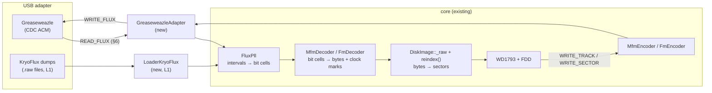

# Flux Bridge — KryoFlux / Greaseweazle direct integration

> **Date:** 2026-09-16
> **Status:** design draft for review (no implementation)
> **Scope:** the largest remaining item of the universal track model — using real
> floppy drives through USB flux adapters, plus offline import of adapter dumps.
> **Prior art:** WinUAE (FloppyBridge by RobSmithDev; the earlier KryoFlux/DTC era).

---

## 1. Goal and scope

Let the emulator use a **real floppy disk in a real drive** as if it were an image,
and let it **write back** to real media, through a USB flux-level adapter:

1. **L1 — offline import (KryoFlux first):** load stream dumps produced outside the
   emulator (`trackNN.H.raw` sets from DTC, SCP/HFE from `gw`) as regular disk images.
2. **L2 — live device bridge (Greaseweazle first):** the emulated WD1793 reads and
   writes tracks of a physical disk on demand, in real time, while the machine runs.

Out of scope: IPF/CT-Raw analysis containers (SPS Decoder Library — separate licensing
discussion), audio-grade preservation workflows (that is `gw`/DTC's job; we consume
their outputs at L1), non-IBM/Shugart buses (Apple II) at L2.

## 2. Adapter landscape

| | **Greaseweazle** | **KryoFlux** | **DrawBridge** | **SuperCard Pro** |
|---|---|---|---|---|
| Author / project | Keir Fraser | SPS / KryoFlux | RobSmithDev | cbmstuff (Jim Fendt) |
| Interface | USB CDC (serial) | USB (own protocol) | USB serial (FTDI) | USB |
| Host-side protocol | **public domain**, fully documented (`cdc_acm_protocol.h`) | undocumented device protocol; driven by **DTC**, restrictively licensed | documented (RobSmithDev) | documented |
| Read raw flux | yes, index-aligned (`READ_FLUX`) | yes (via DTC → stream files) | yes | yes |
| Write raw flux | yes (`WRITE_FLUX`, index-cued) | yes (DTC ≥ 2.50, stream write-back) | yes | yes |
| DISKCHANGE pin | some boards; others simulated | n/a | with hardware mod | yes |
| Shugart + IBM PC buses | yes (`SET_BUS_TYPE`) | IBM PC | Shugart-oriented | yes |
| FloppyBridge support | yes (FW ≥ 0.27) | **no** | yes (FW ≥ 1.8) | yes (FW 1.3) |
| Fit for in-process integration in unreal-ng | **primary target** | **offline (L1) only** | optional later | optional later |

Licensing boundary (matters for GPL-3.0-only, see §9): the KryoFlux **stream file
format** is explicitly excluded from the DTC licence restrictions and is publicly
documented — importing dumps is clean. The DTC **software** is not; so KryoFlux is
never driven in-process. Greaseweazle's protocol header is public domain — clean-room
implementation is unproblematic. WinUAE's FloppyBridge ships its integration library
(`floppybridge_lib.h` and friends) under Unlicence — studyable and even portable.

## 3. Prior art: how WinUAE does it

Two eras, both relevant:

1. **KryoFlux era (2011–2014):** dumps were made outside the emulator with DTC
   (`dtc -d<drive> stream.raw`), producing per-track stream files; DTC ≥ 2.50 writes
   streams back to media. The emulator only ever saw *files*. This is our L1 exactly.
2. **FloppyBridge era (2021–, v1.6 2024):** a plugin (MPL-2.0/GPL-2+, integration
   lib Unlicence) bridging DrawBridge / Greaseweazle / SuperCard Pro drives into
   WinUAE in real time; built into Amiberry. The engineering decisions worth copying:

| FloppyBridge mechanism | What it solves | unreal-ng counterpart |
|---|---|---|
| Per-track capture on seek, cache, serve from cache | USB/rotation latency (200 ms/rev) vs emulator timing | same: RawTrack cache keyed by (cyl, head) |
| PLL + "Rotation Extractor" to rebuild a clean revolution | multi-revolution jitter, splice points | `FluxPll` + SCP-style majority merge (already shipped in `loader_scp.cpp`) |
| Modes: Normal / More Compatible / Turbo / **Stalling** / Smart Speed / Auto-Cache | accuracy ↔ interactivity trade-off | mode enum on the bridge drive (§7) |
| Write with precompensation, index-cued | reliable write-back | `WRITE_FLUX` with `cue_at_index` (§6) |
| DISKCHANGE via `GET_PIN`, else spin-up probing; `NOCLICK_STEP` | media-change detection without the pin | same commands exist in the GW protocol |
| "Direct Mode" API (1.6): MFM buffer in/out outside WinUAE | reuse by other emulators | our `IFluxAdapter` is the same idea, one level lower (flux, not MFM) |

Neutral wording note: none of the adapters is "wrong" for lacking a pin or a mode —
the differences are documented as capabilities the bridge must adapt to.

## 4. Where it plugs into unreal-ng

The flux pipeline that the SCP/HFE loaders already use is the whole story — the
bridge is a **device-backed producer/consumer of the same flux intervals**:



Two new components, no changes to the pipeline itself:

* **`LoaderKryoFlux`** — a registry loader like `LoaderSCP`: parse ISB/OOB blocks,
  extract flux intervals and index timestamps, feed `FluxPll`, majority-merge
  revolutions (reuse the SCP merge), produce the `DiskImage`. Save policy: re-target
  to SCP/HFE/UDI (KryoFlux streams are a capture format, not a preservation target —
  same reasoning as the TRD→UDI re-target rule in `loader-registry.md` §4).
* **`IFluxAdapter` + `GreaseweazleAdapter`** (new `core/src/emulator/io/fdc/bridge/`)
  — device control and flux I/O, no emulator knowledge:
  ```cpp
  struct FluxCapture {                     // one revolution or more
      std::vector<uint32_t> intervals;     // ns between transitions
      std::vector<uint32_t> indexOffset;   // ns from capture start to each index
      bool writeProtected;                 // from WRPROT / DSKCHG handling
  };
  class IFluxAdapter {
  public:
      virtual ~IFluxAdapter() = default;
      virtual bool open(const std::string& port) = 0;      // "auto" probes
      virtual AdapterInfo info() const = 0;                // fw, sample_freq, buses
      virtual void seek(int cylinder) = 0;                 // signed, like CMD_SEEK
      virtual void motor(bool on) = 0;
      virtual bool diskChanged() = 0;                      // GET_PIN / fallback
      virtual FluxCapture readTrack(unsigned revolutions) = 0;
      virtual bool writeTrack(const FluxCapture& flux, bool cueAtIndex) = 0;
      virtual bool eraseTrack() = 0;
  };
  ```
  Above it, **`BridgeDrive`** — a drive whose `DiskImage` tracks are materialized
  on demand: on seek → capture N revolutions → decode → `reindex()` → cache; on
  WRITE_TRACK/sector writes → dirty flag → re-encode → `writeTrack()`.

## 5. Greaseweazle protocol reference (as of firmware 0.27+)

USB CDC ACM serial, 8-byte command frames (`cmd`, `len`, args), ACK status first;
**commands must not be pipelined**. Public-domain header: `cdc_acm_protocol.h`.

| Command | Use in the bridge |
|---|---|
| `GET_INFO` | probe; `gw_info.sample_freq` sets the tick→ns scale (never hardcode) |
| `SELECT` / `DESELECT` | multi-drive setups (A/B on the cable) |
| `SET_BUS_TYPE` | IBMPC / SHUGART drive cabling |
| `SEEK` (signed cyl) / `HEAD` | track positioning on select/step from the FDD layer |
| `MOTOR` | spindle on/off with the drive |
| `READ_FLUX` (`ticks`, `max_index`, `linger`) | revolution-aligned capture: read 2–3 index pulses, stop after `max_index` + linger |
| `WRITE_FLUX` (`cue_at_index`, `terminate_at_index`) | write one revolution, cued and terminated at index |
| `ERASE_FLUX` | pre-write erase pass (separate, explicit) |
| `GET_FLUX_STATUS` | post-transfer status (overflow/underflow reasons) |
| `GET_PIN` / `SET_PIN` | DISKCHANGE detection where wired |
| `NOCLICK_STEP` | media detection without head clicks |
| `SET_PARAMS` (`gw_delay`) | select/step/settle/motor/pre-write/post-write timing |
| `RESET` | known state after hot-plug recovery |

Flux stream: bytes with the low bit set carry 7-bit tick values (in `sample_freq`
units); `0xFF` prefixes opcodes — `FLUXOP_INDEX` (ticks-to-index, keeps revolution
boundaries), `FLUXOP_SPACE` (gap in the stream), `FLUXOP_ASTABLE` (write-side regular
pulses). Status codes to handle: `NO_INDEX`, `NO_TRK0`, `FLUX_OVERFLOW/UNDERFLOW`,
`WRPROT`, `NO_UNIT`, `BAD_CYLINDER`.

The adapter converts ticks → nanoseconds once, at the `IFluxAdapter` boundary; the
rest of the pipeline is already unit-agnostic (SCP works in ns at 25 ns resolution).

## 6. KryoFlux stream files (L1)

* A dump is a directory of `trackNN.H.raw` files (cyl NN, head H), 20–25 MB per
  1.44 MB disk — the raw USB stream protocol saved to disk.
* Blocks: **ISB** (in-stream buffer: flux transition timings) and **OOB** (out-of-band:
  index signals, hardware info). Meaningful data starts at the first OOB; the loader
  follows the Stream Protocol rev 1.1 document (Jean Louis-Guerin, 2013; LoC
  fdd000610) as normative reference.
* Index OOBs give revolution boundaries → same majority-merge path as SCP.
* **Save policy: read-only.** Streams are a capture format; writes re-target to
  SCP/HFE/UDI exactly like non-TRD-geometry TRD saves do today.

## 7. Bridge drive modes and timing budget

Real drive: 300 RPM = 200 ms/revolution; USB transfer and settle add overhead.

| Mode (FloppyBridge analogue) | Behaviour | When |
|---|---|---|
| Compatible ("More Compatible") | 3 revolutions, majority merge, splice at index | copy-protected/non-uniform tracks |
| Normal | 2 revolutions, merge, splice at index | default |
| Turbo | 1 revolution, no merge | quick catalog browsing |
| Stalling | emulator pauses while the track materializes | worst-case correctness; also the TTD-recording mode (§8) |
| Auto-Cache | idle-time capture of the remaining cylinders into the cache | background fill like FloppyBridge |

Budget: first access to a track ≈ seek (settled by `gw_delay.seek_settle`) +
2 × 200 ms + transfer ≈ 0.5 s; full-disk Auto-Cache ≈ 160 tracks × 0.45 s ≈ 12–25 s
sequential — acceptable as a background task with progress notifications
(`NC_FDD_*` style, one per cylinder).

## 8. Determinism, TTD and automation

* A device-backed disk is nondeterministic by nature. Policy: **materialize, then
  emulate.** Every captured track becomes an ordinary cached `DiskImage` track; TTD
  checkpoints record the materialized image, never the device. Stalling mode is
  forced while a TTD session records (capture happens between checkpoints).
* `Emulator::LoadDisk` gains a device URI form: `gw://<port>` (e.g. `gw://COM3`,
  `gw:///dev/cu.usbmodem2101`, `gw://auto`). The loader registry's content probe
  gains a device branch; `SaveDisk` on a bridge image writes SCP/HFE/UDI files.
* Automation surfaces (WebAPI/MCP/CLI/Lua/Python) get read-only bridge status first
  (adapter, firmware, mode, cache fill), capture/save actions second — per the
  cross-interface parity rule, all five at once.
* Configuration: `[FDD] FluxBridge=NONE|GREASEWEAZLE`, `Port=`, `Mode=`, `Drives=`;
  runtime feature `fluxbridge` (off by default — a device must never be touched
  unless the user asked).

## 9. Licensing analysis (GPL-3.0-only repository)

| Component | Licence | Verdict |
|---|---|---|
| Greaseweazle protocol (`cdc_acm_protocol.h`) | public domain (Unlicence) | implement freely, no attribution burden |
| Greaseweazle firmware / `gw` tool | MIT | we neither link nor distribute it; users flash/run it themselves |
| KryoFlux stream file format | format explicitly excluded from DTC licence restrictions | reader is clean |
| KryoFlux DTC software / SPS Decoder Library | restrictive | **never linked, never bundled**; KryoFlux stays L1 |
| FloppyBridge integration headers | Unlicence (`floppybridge_lib.*`) | may be studied or ported; attribute in THIRD_PARTY_NOTICES if copied |
| DrawBridge / SCP protocols | per their projects | re-evaluate when those adapters are added |

## 10. Safety policy for writing real media

1. Write path is **opt-in twice**: config enables it, per-session UI/automation
   confirmation arms it. Default is read-only (`WRPROT` honoured and surfaced).
2. `eraseTrack()` is never implicit; write = optional explicit erase + `WRITE_FLUX`
   with `cue_at_index`, then read-back verify of the written track (compare decoded
   sector index, offer re-write).
3. HD media detection before any DD write (mismatched media is the classic failure —
   DD writes to HD disks are unreliable); force DD/HD override in config.
4. All destructive ops are logged (path, cylinder range, mode) to the emulator log.

## 11. Test plan

* **No hardware in CI.** `GreaseweazleAdapter` is tested against a **fake serial
  device**: recorded command/response fixtures (bytes) replayed by a loopback
  transport — same convention as the SMUC opt-in testing rule. Hardware runs are
  gated behind `fluxbridge.device-tests` config, skipped by default.
* `LoaderKryoFlux_Test`: synthetic ISB/OOB streams (index placement, overflow words,
  truncated tail), golden decode vs `FluxPll` expectations; round-trip
  KF-stream → image → SCP save vs a reference conversion.
* `BridgeDrive` tests: seek-driven materialization, cache invalidation on
  disk-change, dirty write-back, Stalling-mode TTD determinism (record → seek back →
  identical hashes).
* Fixtures under `testdata/loaders/disk/kryoflux/` (small, synthetic; real dumps
  stay out of git — 20 MB per disk).

## 12. Phases and gates

| Phase | Content | Gate |
|---|---|---|
| **B0** | Wire HFE/SCP into `Emulator::LoadDisk`/`SaveDisk` dispatch (loaders already shipped in `a637bfa7`, currently unreachable), GUI filters, automation format lists | `.hfe`/`.scp` load/save e2e via WebAPI; loaders' suites stay green |
| **B1** | `LoaderKryoFlux` (L1) + save re-target | synthetic dump loads; suite + parity checks |
| **B2** | `IFluxAdapter` + `GreaseweazleAdapter` + fake-device tests + CLI probe (`bridge info`) | adapter suite green offline; optional hardware smoke |
| **B3** | `BridgeDrive` + `gw://` load URI + modes + Auto-Cache + TTD policy | e2e: boot a real TR-DOS disk through the bridge; TTD determinism test |
| **B4** | Write path + erase + verify + safety interlocks + config/UI | write real disk, read back byte-equal sectors; interlock tests |
| **B5** | Automation parity surface, DISKCHANGE polish, second drive, (optional) DrawBridge/SCP adapters | five-interface parity audit |

B0 is a small, independent win even if the bridge itself is deferred.

## 13. Open questions

| # | Question | Default taken |
|---|---|---|
| Q1 | Capture revolutions in Normal mode (2 vs 3) | 2, escalate to 3 on merge disagreement (Compatible fallback per track, as FloppyBridge does) |
| Q2 | Splice point for the merged revolution | at index (FLUXOP_INDEX carries it) |
| Q3 | Tick→ns rounding vs SCP's 25 ns quantisation | keep ns throughout; quantise only at SCP save |
| Q4 | KryoFlux stream timebase constant | read from the Stream Protocol doc at implementation time; encode as a named constant with citation, verified against a real dump fixture |
| Q5 | Bridge images in videowall/screen-viewer contexts | treated like any inserted disk once materialized |
| Q6 | Write precompensation model | start with none (DD media, ≤80 cyl), add FloppyBridge's approach if verify fails |
| Q7 | DrawBridge / SuperCard Pro adapters | design-compatible via `IFluxAdapter`; not planned unless someone owns the hardware |
