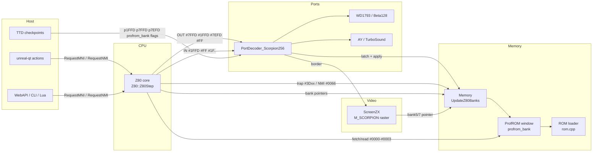
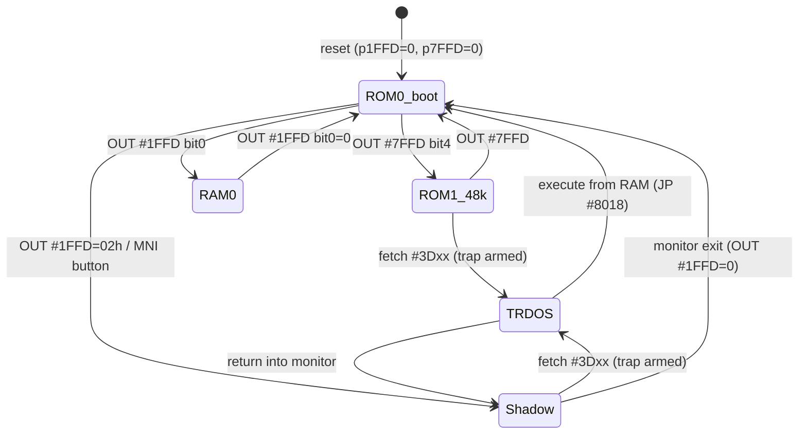
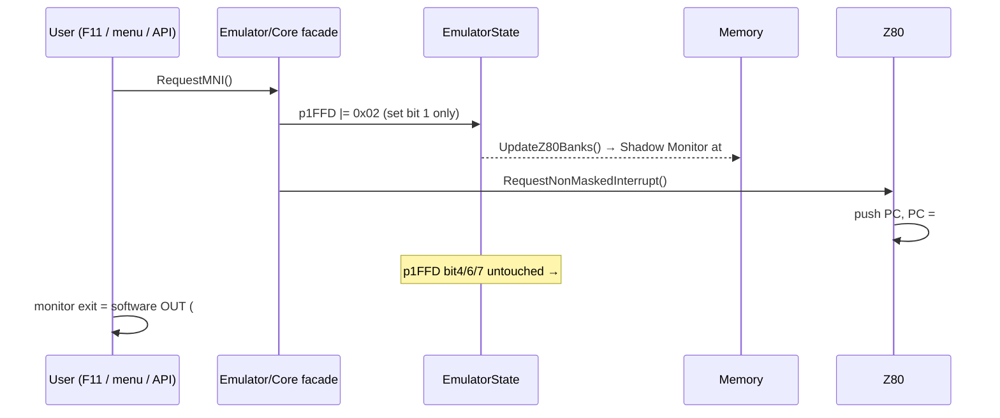

# Scorpion ZS-256 Clone — Architecture & Design

Normative behavior: [hardware-reference.md](hardware-reference.md).
Current-state deltas: [gap-analysis.md](gap-analysis.md).
Executable steps: [implementation-plan.md](implementation-plan.md).

---

## 1. Design principles

1. **Model-gated everywhere.** Every behavioral change keys on
   `config.mem_model ∈ {MM_SCORP, MM_PROFSCORP}`. Machines 0-6 must produce
   bit-identical traces before and after each task (regression rule from the MISTer
   plan, enforced by tests here).
2. **State lives in `EmulatorState`, policy lives in the decoder, application lives in
   `Memory`.** The port decoder latches (`p7FFD`, `p1FFD`, `p7EFD`) and calls
   `Memory::UpdateZ80Banks()`; the memory manager is the single place that translates
   latches → bank pointers. This mirrors the existing 128K/Profi split and keeps TTD
   checkpoints (which already serialize `p1FFD`) coherent.
3. **`MM_PROFSCORP` is `MM_SCORP` + ROM window indirection.** One decoder class serves
   both; the ProfROM quadrant register is an indirection computed *before* the standard
   `base_*_rom` pointers are used.
4. **Verified-behavior first, emulator extension second.** The 2-bit quadrant state
   machine is hardware-verified; the `#7EFD` direct select and the 2 MB ceiling are
   documented emulator extensions consistent with GMX-class hardware. Heritage-only
   behaviors with no hardware backing (`#1FFD` bit 2 → `CF_TRDOS`, service ROM under an
   open session) are **not** carried over — hardware-reference §12 items 9-10.
5. **Path-dependent state is serialized, never recomputed.** The ProfROM quadrant
   (`EmulatorState::profrom_bank`) is written only by the read-strobe state machine and
   depends on read history; it is captured by TTD checkpoints and the divergence hash
   like any port latch, and paging is always *derived from* it (hardware-reference §12
   item 11).

---

## 2. Module interaction



---

## 3. Memory paging — `Memory::UpdateZ80Banks()` Scorpion branch

New private helper `Memory::UpdateScorpionBanks()` (called first from
`UpdateZ80Banks()` when the model matches), implementing:

```text
ram_mask  = (config.ramsize >> 4) - 1                     // 15 (256 KB) or 63 (1024 KB)
                                                          // config.ramsize is in KB
                                                          // (platform.h:315 RAM_256 = 256);
                                                          // a >>14 byte-based shift yields 0
                                                          // and underflows the mask to 0xFF

// --- ProfROM: resolve the four ROM bases from the checkpointed quadrant FIRST ---
if (MM_PROFSCORP) ResolveScorpionRomBases(state.profrom_bank);   // pure pointer math (§4.2)

// --- bank3 (#C000) ---
bank3 = (p7FFD & 0b111)
      | ((p1FFD & 0x10) >> 1)        // bit4 -> bit3
      | ((p1FFD & 0xC0) >> 2);       // bits 7:6 -> bits 5:4
SetRAMPageToBank3(bank3 & ram_mask);

// --- bank0 (#0000) priority chain ---
if (p1FFD & 0x01)       SetRAMPageToBank0(0);
else if (p1FFD & 0x02)  mapRom(base_sys_rom);              // Shadow Monitor
else if (flags & CF_TRDOS) mapRom(base_dos_rom);           // session: ROM3 REGARDLESS of p7FFD[4]
else                    mapRom((p7FFD & 0x10) ? base_sos_rom : base_128_rom);
// p1FFD bit 2 is NOT consulted (RS-232 line on hardware; hardware-reference §12 item 9)

// --- session flags (Scorpion specifics) ---
arm CF_SETDOSROM iff  !(p1FFD & 0x01) && (p1FFD & 0x02 || p7FFD & 0x10)
                      && config.trdos_present && dosAvailable;
dosflags = CF_LEAVEDOSRAM;                                  // unpage on RAM execution
if (flags & CF_TRDOS) flags |= CF_DOSPORTS | CF_LEAVEDOSRAM;

// --- ProfROM variant only ---
if (MM_PROFSCORP) CF_PROFROM = (bank0 == base_sys_rom);
```

**Deliberate divergence from the generic path.** The generic body of `UpdateZ80Banks()`
(ported from the original `set_banks()`) maps the *service* ROM when `CF_TRDOS` is set
with `p7FFD[4] = 0` (`SetROMSystem()`). The Scorpion branch maps ROM3 in that state, as
MISTer and Fuse do — otherwise the Shadow-monitor "128 TR-DOS" boot-menu path lands in
the monitor instead of TR-DOS (hardware-reference §4.4 rule 3, §12 item 10). The early
return keeps the generic path byte-identical for every other model.

`SetROMMode()` (RESET= boot-mode entry) gets a Scorpion guard: it must not clobber
`p1FFD` bits 0/1/2 (the current `state.p1FFD &= ~7` runs unconditionally) — for
Scorpion models, ROM-mode switches only drive `CF_TRDOS`/`p7FFD[4]` as the chain above
prescribes.



---

## 4. ROM subsystem architecture

### 4.1 Layout constants

| Constant | Value | Change |
|---|---|---|
| `MAX_ROM_PAGES` | 128 (2 MB) | was 64 |
| `ROM_QUADRANT_PAGES` | 4 (64 KB) | new |
| Quadrant count (per image) | `loadedBanks / 4` | derived |
| `profrom_mask` (state machine bits) | by size: 64K→0, 128K→1, 256K→3 | new |
| window mask (`#7EFD[5:4]` bits) | by size: ≤256K→0, 512K→1, 1M/2M→3 | new |

Total emulator linear block grows to 4 MB RAM + 32 KB cache/misc + 2 MB ROM ≈ 6.1 MB
(plus GS ROM/RAM when that module is enabled) — no consumer assumes the old size
(`_memorySize` is computed from `MAX_PAGES`).

### 4.2 ProfROM window object

New small class `ScorpionRomWindow` (owned by `Memory`, header next to `memory.h`). It
is a **stateless policy object**: every byte of quadrant state lives in the existing
`EmulatorState` / `TEMP` fields so that TTD checkpoints, the divergence hash and any
future serializer see it without special cases (design principle 5).

```text
state (NOT in the class — already present, currently dormant):
    EmulatorState::profrom_bank   // effective quadrant 0..31: (p7EFD[5:4] << 2) | GAL 2-bit state
    EmulatorState::p7EFD          // window latch (bits 5:4 used; extension bit 6 = debug/API only)
    TEMP::profrom_mask            // GAL state mask by image size: 64K→0, 128K→1, 256K+→3
    TEMP (new) profrom_window_mask// #7EFD select mask by image size: ≤256K→0, 512K→1, 1M/2M→3
class ScorpionRomWindow (all methods take EmulatorState&/TEMP&):
    Configure(imageBanks)        // sets both masks from the loaded ROM size
    OnRomRead(addr)              // addr < 4: profrom_bank = (profrom_bank & ~3)
                                 //   | (switch_table[addr][profrom_bank & 3] & profrom_mask)
    OnWindowPortWrite(value)     // p7EFD = value; profrom_bank = (profrom_bank & 3)
                                 //   | (((value >> 4) & profrom_window_mask) << 2) | ext bit
    Quadrant() -> 0..31          // = profrom_bank (clamped by image size)
    Base() -> ROMPageHostAddress(Quadrant() * 4)
    Reset()                      // profrom_bank = 0, p7EFD = 0
```

`Memory::ResolveScorpionRomBases(quadrant)` re-points the four ROM bases in the
verified bundle order (hardware-reference §5.1, identical to the original
`set_scorp_profrom()`): `base_128_rom = Base()`, `base_sos_rom = Base() + 1 page`,
`base_sys_rom = + 2 pages`, `base_dos_rom = + 3 pages` — pure pointer math, no
allocation. Quadrant 0 therefore equals the plain 64 KB mapping once the Task 2 loader
fix lands. It is called at the
top of `UpdateScorpionBanks()` (§3), so **every** path that rebuilds banking — port
writes, the read-strobe hook, snapshot load, TTD restore (`RestoreChipsetState()` +
`UpdateZ80Banks()`, `timetravelmanager.cpp:1052-1058`) — lands in the right quadrant
with no extra code.

Quadrant-internal page offsets (pinned to the verified file order, hardware-reference
§5.1 — identical to original-US `set_scorp_profrom` and to the corrected Task 2 loader
mapping): `base_128_rom = GetBase() + 0*PAGE`, `base_sos_rom = +1*PAGE` (48K),
`base_sys_rom = +2*PAGE` (Service), `base_dos_rom = +3*PAGE` (TR-DOS).

Transition table (hardware-verified, from original UnrealSpeccy):

```text
switch_table[read_addr][quadrant] =
        { {0,1,2,3}, {3,3,3,2}, {2,2,0,1}, {1,0,1,0} }   [row=read #00..#03]
effective quadrant = (windowQuadrant << 2 | stateQuadrant) clamped by image size
```

### 4.3 Read-strobe hook

`Memory::MemoryReadFast/Debug` gain one model-gated fast-path check **before** the bank
pointer dereference:

```text
if (_scorpProfromActive && addr < 4) [[unlikely]]
    _romWindow.OnRomRead(addr);
```

where `_scorpProfromActive` is a cached bool (= `MM_PROFSCORP && CF_PROFROM`), updated
in `UpdateZ80Banks()`. Cost when inactive: one cached-bool test on 4 addresses'
worth of reads — only those 4 addresses reach the call, so the check is
`_scorpProfromActive && addr < 4` and the branch predictor handles the rest.
`OnRomRead` only rewrites `state.profrom_bank`; if the value changed the hook calls
`UpdateZ80Banks()` (which resolves the bases, §4.2) and the current access then re-reads
the bank-0 pointer (the state machine's no-op from Q0-on-`#0000` keeps reset fetches
stable). `MemoryReadFast` is the only CPU read path (`Z80::rd` → `MemIf`); debugger
reads use `DirectRead`/`MapZ80AddressToPhysicalAddress` and therefore never advance
the state machine — required, otherwise inspecting `#0000` in the debugger would page
the ROM.

### 4.4 ROM loader changes (`rom.cpp`)

| Model | Accepted sizes | Quadrants | Effect |
|---|---|---|---|
| `MM_SCORP` | exactly 64 KB | 1 | current behavior, plus hard validation error |
| `MM_PROFSCORP` | 64/128/256/512/1024/2048 KB | 1/2/4/8/16/32 | load full image; set masks; quadrant 0 active |

Warning (not error) + clamp for non-power-of-two or over-2 MB files, keeping the
existing error style (`MLOGERROR` + `result = false`).

---

## 5. Port decoder design (`PortDecoder_Scorpion256`)

Dispatch changes:

- `GetPortDecoderForModel`: `MM_PROFSCORP` → `new PortDecoder_Scorpion256(context)`
  (same class; ProfROM is a Memory concern).

Decode-order contract for `DecodePortIn` (top wins):

```text
1. (port & 0xC002)==0xC000 -> AY #FFFD mirror        (existing - keep first)
2. (port & 0xC002)==0x8000 -> AY #BFFD mirror        (existing - keep second)
3. IsPort_FE               -> keyboard/ear/mic       (existing)
4. IsPort_1FFD             -> return 0xFF (open bus on register)     NEW
5. IsPort_7EFD             -> return 0xFF (write-only window latch)  NEW
6. else                    -> PeripheralPortIn(port) (FDC when session active, etc.)
```

**This is the order the code already has** (`portdecoder_scorpion256.cpp:77-95`: AY
mirrors, then `IsPort_FE`, then the generic fallback) and the existing arms must not be
reordered — the file carries a comment explaining why mirrors resolve before `#FE`. The
new arms 4 and 5 are inserted ahead of the generic fallback only. (On this decoder the
three existing arms are in fact mutually exclusive: the Scorpion `#FE` pattern requires
`A1 = 1` while both AY mirror masks require `A1 = 0` — so the order is safe either way,
but there is no reason to move working code.)

`DecodePortOut` additions (after existing `#7FFD`/`#1FFD`/AY arms):

```text
if IsPort_1FFD: state.p1FFD = value; memory.UpdateZ80Banks();
if IsPort_7EFD (MM_PROFSCORP only): state.p7EFD = value; romWindow.OnWindowPortWrite(value);
if (port & 0x00FF) == 0x00FF and FDC not on the bus: screen->SetBorderColor(value & 0x07);
```

The `#FF` arm must match the **low byte only**, not the whole 16-bit port. `OUT (#FF),A`
places `A` on address lines 15-8, so the port seen by the decoder is `#nnFF` for whatever
happens to be in `A`; an exact `port == 0x00FF` comparison would miss every such write
while still passing a test written as `LD BC,#00FF` / `OUT (C),A`. Low-byte `#FF` does
not collide with any other arm (`#FFFD`/`#7FFD` end in `#FD`, and both AY masks need
`A1 = 0` whereas `#FF` has `A1 = 1`).

`Port_7FFD` rewrite:

```text
if (_7FFD_Locked) { apply screen bit only if spec'd — no: hardware applies whole byte on
                    the locking write, so: } 
// full-byte application, then latch:
if (!_7FFD_Locked) {
    state.p7FFD = value;                    // latch first (locking write applies)
    memory.UpdateZ80Banks();                // single application point (chain in §3)
    screen switch per bit3 (existing SetActiveScreen path);
    _7FFD_Locked = value & 0x20;            // subsequent writes ignored
}
```

`Port_1FFD` (new body): latch `state.p1FFD = value`, then
`memory.UpdateZ80Banks()` — which handles bits 0/1/4/6/7 per §3 (bit 2 is latched but
has no effect). Not gated by `_7FFD_Locked`.

Beta128 gating (both `DecodePortIn` and `DecodePortOut`), modelled on
`PortDecoder_Pentagon128` (`portdecoder_pentagon128.cpp:99` and `:167`) plus the
Scorpion-only monitor-paged exception (hardware-reference §12 item 3): when
`IsBeta128Port(decodedPort) && !(state.flags & CF_TRDOS) && !(state.p1FFD & 0x02)` the
port is left undecoded (`disp.wasBeta128Gated = true`), so reads fall to the
floating-bus path and `#FF` writes reach the border arm instead of the FDC system port.
While the Shadow Monitor is paged (`p1FFD[1]`) the FDC keeps answering even with the
session closed. `WD1793` is not changed.

**`IsBeta128Port` is currently a private member of `PortDecoder_Pentagon128`**
(`portdecoder_pentagon128.h:57`), so it cannot simply be called from the Scorpion
decoder. Hoist it into the base `PortDecoder` as a protected helper (preferred — the
port set is identical for every Beta-128 machine) rather than duplicating the predicate.
The `wasBeta128Gated` flag is already on the shared dispatch struct
(`portdiagrecorder.h:112`) and consumed by the base decoder (`portdecoder.cpp:390`), so
trace attribution needs no change.

`reset()`: `p1FFD = 0`, `p7EFD = 0`, `_7FFD_Locked = false`, screen NORMAL,
border **black** (`COLOR_BLACK` — deviation from the generic white, see
hardware-reference §8), `romWindow.Reset()`, then one clean
`memory.UpdateZ80Banks()`.

Debug sync: `SetRAMPage`/`SetROMPage` map debugger-forced pages onto the same latch
model (write the corresponding `p7FFD`/`p1FFD` bits + reapply) instead of stubs.

---

## 6. TR-DOS session & trap

- Trap arm: Scorpion-specific rule (§3) replaces the generic `p7FFD[4]`-only arm for
  these models; `z80.cpp` machinery (`CF_SETDOSROM` → `#3Dxx` fetch → `CF_TRDOS`) is
  reused unchanged.
- ROM while the session is open: ROM3 regardless of `p7FFD[4]` (§3) — the one place the
  Scorpion branch intentionally contradicts the generic path.
- No `#1FFD` force bit: sessions open only through the trap (hardware-reference §12
  item 9).
- Unpage: keep `CF_LEAVEDOSRAM` (existing default for this model class) — the
  `JP #8018`-from-RAM close matches the reference.
- FDC port gating: decoder-level, per §5 (session **or** monitor paged) —
  `CF_DOSPORTS` is produced by `UpdateZ80Banks()` but consumed nowhere in the codebase,
  and the Pentagon decoder already gates on `CF_TRDOS` inline. Nothing model-agnostic
  changes, so Pentagon TR-DOS behavior is untouched by construction.
- Kempston note (future-proofing, from MISTer bug 2): when a Kempston peripheral is
  later registered on `#1F`, arbitration must give the FDC the `#xx1F` range while the
  Shadow Monitor is paged (`p1FFD[1]`) even if the session already closed — encode as
  a documented contract + test now, implement when Kempston lands.

---

## 7. MNI / NMI

### 7.1 Z80 core

Implement `RequestNonMaskedInterrupt()` (set `_nmi_pending_count = 1`) and the accept
path at instruction boundary:

```text
if (_nmi_pending_count > 0 && at instruction boundary):
    _nmi_pending_count = 0;
    nmi_in_progress = true;
    IFF2 = IFF1; IFF1 = 0;
    push PC; PC = 0x0066;
on RETN: IFF1 = IFF2; nmi_in_progress = false;   (hook into existing RETN decode)
```

Model-agnostic (ATM3 will reuse it later); no Scorpion behavior leaks into the core.

### 7.2 Magic-button orchestration



Entry point: `Emulator::RequestMNI()` — model-gated to Scorpion models; on other
models it degenerates to a plain NMI (`RequestNMI()` public wrapper).

Surfaces: unreal-qt `Machine → MNI (NMI + Service Monitor)` action in
`unreal-qt/src/menumanager.cpp` (where all actions live; `mainwindow.cpp` only wires
slots), default shortcut F11 with `Qt::WindowShortcut` context — Full Screen moved to
Ctrl+F in commit ced71710 so F11 is free at main-window level, but the stale Help text
`"F11 - Full Screen"` at `menumanager.cpp:834` must be updated, and the debugger window
binds F11 to Step In (`debuggerwindow.cpp:85`, window-scoped) so the two must not share
an application-wide context; WebAPI
`POST /api/v1/emulator/{id}/nmi {"magic": true}`; CLI/Python/Lua automation call.
TTD: no new checkpoint fields needed — `p1FFD` is in `TTDChipsetState` and
`nmi_in_progress` already in `TTDCpuState` (`ttd_checkpoint.cpp:65,109,151`,
`machine_state_hash.cpp:95`); Task 6 only adds a restore assertion. `Z80::retn()` is an
empty stub already called from the `ED45` handler (`op_ed.cpp:161`), and
`ProcessInterrupts()` runs before every `Z80Step()` (`z80.cpp:409`), so both hook sites
exist.

---

## 8. Video & timing

- New `VideoModeEnum M_SCORPION` + raster descriptor cloned from `M_ZX48`
  (`{352, 288, 256, 192, 48, 48, 448, 64, 32, 8, 16}`).
- `Screen::InitRaster` model switch: `case MM_SCORP: case MM_PROFSCORP:
  video.mode = M_SCORPION;`.
- Contention switch (`screen.cpp:445`): add `M_SCORPION` to the discrete-logic arm
  (border 1T, `contentionEnabled = false`, `fetchType = ULA_DISCRETE_LOGIC`).
- `config.cpp` canonical geometry + INI-defaults switch: `MM_SCORP`/`MM_PROFSCORP` →
  `frame = 69888, t_line = 224, intstart = 1794, intlen = 32`.
- `#FF` border port write → `Screen::SetBorderColor` (1T visibility follows the
  discrete-logic `borderUpdateTStates = 1` already used for Pentagon-class modes).
- `io_contention_test.cpp` expectation "Scorpion → ULA_DISCRETE_LOGIC" becomes real.

---

## 9. Snapshots

### Load (`.z80` hw=10 / `Z80_256K`)

- v2 extended header: `p7FFD` = byte 35, `p1FFD` = byte 36 (per z80 v2 spec for
  machines carrying `#1FFD`); memory blocks use the `.z80` page-number convention.
- Page numbering (v2 and v3): `.z80` page `n` ≥ 3 → RAM bank `n − 3`, exactly as the
  existing `Z80_128K` arm does for pages 3-10 (`loader_z80.cpp:1374-1388`); Scorpion
  extends the range to pages 3-18 (256 KB) or 3-66 (1024 KB). Pages 0-2 stay ROM images
  and are ignored on load.
- After CPU/memory restore: latch both ports through the decoder
  (`Port_1FFD`, `Port_7FFD` semantics — via the privileged `UnlockPaging()` +
  direct latch path already used for snapshots), then `UpdateZ80Banks()`.
- Model handling (**resolved**): hw=9 Pentagon snapshots map to `Z80_128K` and load
  **in place** — the loader has no model-switch path (`loader_z80.cpp:1005-1019`). A
  model switch does exist one level up (`EmulatorAPI::switchModel`,
  `POST /api/v1/emulator/{id}/model`), but it *stops, removes and recreates* the
  instance via `CreateEmulatorWithModelAndRAM` (`lifecycle_api.cpp:689`); a loader owned
  by that instance cannot invoke it on itself. In-emulator model change has no
  implementation: `_preferredModel` is applied only inside `Emulator::Init()`
  (`emulator.cpp:148`).
  Scorpion follows suit: load in place; if the running model is not a Scorpion, load
  what fits (`ram_mask` of the current model) and log a warning naming the mismatch. No
  emulator identity churn mid-session; WebAPI clients create a `SCORPION` instance
  first.
- ProfROM quadrant: the format has no slot for `profrom_bank`; load resets it to 0
  (`ScorpionRomWindow::Reset()`), save logs a warning when the quadrant is non-zero
  (hardware-reference §12 item 11).

### Save

- The `.z80` writer already exists (`Emulator::SaveSnapshot` → `LoaderZ80::save()` →
  `saveV3FromStaging()`); it needs a Scorpion arm in `getModelCodeV3()` (currently
  returns only 48K/128K codes, `loader_z80.cpp:277-281`), staging for 16 (64) RAM pages
  with page numbers `bank + 3`, and bytes 35/36 carrying `p7FFD`/`p1FFD`.
- `.sna` save for Scorpion models returns a clear error naming the format ceiling
  (`loader_sna.cpp` is 128K-only by design).

---

## 10. State additions

| Field | Where | Notes |
|---|---|---|
| `p7EFD` | already in `EmulatorState` (`platform.h`) | becomes live for ProfROM |
| `profrom_bank` (effective quadrant 0-31) | already in `EmulatorState` (`platform.h:877`) | **new consumer**; path-dependent (§4.2) — added to `TTDChipsetState` (+ capture/restore), `MachineStateHash`, and the `chipset_state` block of `ttd.ksy`. `sizeof(TTDChipsetState)` is written to `.ttd` files and checked on load, so pre-change sessions are rejected; v1 promises no compatibility (`ttd_checkpoint.h` header comment) |
| `profrom_mask` | already in `TEMP` (`platform.h:665`) | set by `Configure()` from ROM size; not serialized (config-derived) |
| `profrom_window_mask` | new in `TEMP` | `#7EFD` select mask from ROM size; config-derived |
| `nmi_in_progress` | already in `Z80State` and `TTDCpuState` | now actually used |
| `ram_mask` | computed in `Memory` from `config.ramsize` | no new stored state |

Port-trace attribution: `#7EFD` gets a new `PortDeviceId::Memory_7EFD` entry;
`#00FF` border writes attribute to `Ula_FE`-adjacent new id `Border_FF` (recorder
table already has the pattern to extend).

---

## 11. Test architecture

- **Unit**: port decode truth tables (existing pattern), paging truth tests via a new
  `ScorpionPaging_Test` fixture that instantiates a real `EmulatorContext` +
  `Memory` + `PortDecoder_Scorpion256` (no full Emulator), writes latches through
  `DecodePortOut`, and asserts bank pointers via `MemoryCUT`.
- **State-machine tests**: `ScorpionRomWindow` fed read sequences — every
  (quadrant, read) transition; quadrant clamping for each image size; `#7EFD` select.
- **Integration**: synthetic ROM bundle (patterned pages) + scripted Z80 programs
  (tiny OUT sequences) driven through `Core::RunFrames` — boot-to-TR-DOS script,
  MNI script, monitor-exit script.
- **Boot verification**: real `scorpion.rom` from `data/rom/`; pass criteria in
  [testing-plan.md](testing-plan.md).
- **Regression**: full `core-tests` suite + a new
  `Models_Regression_Test` sweeping paging writes on all pre-existing models before
  and after (golden bank-map dumps).

---

## 12. Risks & mitigations

| Risk | Mitigation |
|---|---|
| `MAX_ROM_PAGES` growth shifts host offsets (mmap/shared-memory consumers, symbol maps) | `MigratePointersAfterReallocation` + offset math all derive from `ROM_OFFSET`; grep audit + shared-memory test in task; bump any on-disk offset assumptions guarded by version checks |
| Read-strobe hook cost / re-entrancy in `MemoryReadFast` | single cached-bool + `addr < 4` guard; window remap never allocates, only pointer swap; benchmark task includes a paging-storm micro-benchmark |
| `UpdateZ80Banks()` refactor destabilizes existing models | model-gated early return keeps the generic path byte-identical; golden regression test lands **before** the first behavioral commit |
| NMI implementation interacts with INT pipeline (`ProcessInterrupts`) | NMI checked at instruction boundary before INT; dedicated NMI unit tests incl. NMI-during-INT and NMI-in-HALT |
| z80 snapshot model switch changes WebAPI emulator identity | resolved: no switch path exists for hw=9; Scorpion loads in place with a warning (§9) |
| `TTDChipsetState` layout change rejects existing `.ttd` sessions | v1 format explicitly has no compatibility promise; the size check gives a clear error rather than a silent misread; `ttd.ksy` updated in the same commit |
| Heritage bit-2 / service-ROM semantics expected by old UnrealSpeccy users | documented in hardware-reference §12 items 9-10 with the exact original code, so re-adding as an option is a one-line change if ever needed |
| ProfROM quadrant switch mid-fetch corrupts debugger/disassembler caches | window changes only remap ROM base; disassembler re-reads through `MapZ80AddressToPhysicalAddress` per access — add cache-invalidation audit step |
