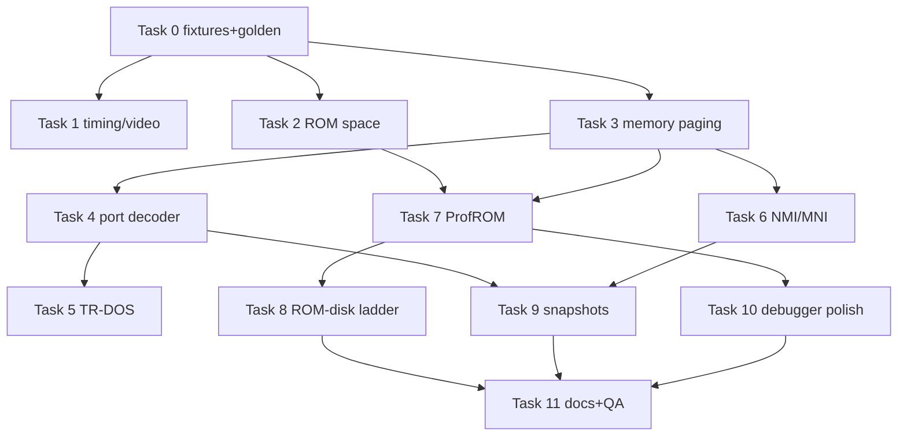

# Scorpion ZS-256 Clone — Implementation Plan

> For executing agents: work task-by-task, in order. Steps use checkbox (`- [ ]`)
> syntax for tracking. Normative behavior: [hardware-reference.md](hardware-reference.md);
> module design: [design.md](design.md); verification strategy: [testing-plan.md](testing-plan.md).

**Goal:** complete `MM_SCORP` (and first-class `MM_PROFSCORP`) — full `#1FFD` paging,
256 KB/1 MB RAM, ROM ladder from minimal 64 KB through ProfROM quadrants to 2 MB
ROM-disk images, Shadow Service Monitor with MNI, Scorpion-accurate TR-DOS traps,
Sinclair-matching contention-free video, and `.z80` hw=10 snapshots.

**Tech stack:** C++20, CMake+Ninja, GoogleTest (`core-tests`), Google Benchmark
(`core-benchmarks`) — all existing.

## Global constraints

- **No behavior change for existing models** (`48K/128K/+3/Pentagon/Profi`): every
  decode/paging change is gated on `MM_SCORP`/`MM_PROFSCORP`. The golden regression
  test (Task 0) must diff clean after **every** task.
- **Zero compiler warnings** (gcc/clang/msvc/mingw) — project policy.
- **Commit discipline:** commits happen only on explicit user instruction; each task
  lists a suggested commit message for that moment. Run quality gates before asking:
  `ninja -C cmake-build-release && ./cmake-build-release/bin/core-tests`.
- **New files ⇒ CMake re-glob:** after creating any source file, re-run
  `cmake -S . -B cmake-build-release` (GLOB_RECURSE) or new files won't build.
- **Naming:** no underscores in new file/class/method names (`scorpionromwindow.h`,
  `ScorpionRomWindow`, `OnRomRead`); test files use the `*_test.cpp` exception.
- Test artifacts go to `scratch/` (`TestPathHelper::GetTestScratchPath()`).
- **Clean baseline:** Task 0 goldens must be captured on a clean tree. Commit or branch
  the in-flight HUD / feature-manager work (25 modified files as of 2026-09-08) before
  starting; do not interleave the two efforts in one working tree.
- **Decisions already made (do not re-open):** `#1FFD` bit 2 is ignored; ROM3 is mapped
  while a DOS session is open regardless of `p7FFD[4]`; the ProfROM quadrant lives in
  `EmulatorState::profrom_bank` and is checkpointed; Beta128 gating is decoder-level;
  snapshots load in place without model switch. Sources and rationale:
  hardware-reference.md §12 items 9-11, design.md §3/§4.2/§6/§9, README decisions log.
- Test file layout mirrors `core/src/emulator/…` under `core/tests/emulator/…`.

---

### Task 0: Baseline regression harness + Scorpion test fixture

**Files:**
- Create: `core/tests/emulator/memory/modelsregression_test.cpp` + `.h`
- Create: `core/tests/emulator/ports/models/scorpionfixture.h` (shared fixture header)
- Reference: `core/tests/emulator/emulator_test.h` (existing full-context pattern),
  `core/tests/emulator/ports/models/portdecoder_scorpion256_test.cpp` (decoder-only pattern)

**Interfaces produced (all later tasks consume):**
- `ScorpionMachineFixture` — builds a real `EmulatorContext` with `Memory`,
  `ScreenZX`, `Keyboard`, `PortDecoder_Scorpion256` wired, `config.mem_model = MM_SCORP`,
  `config.ramsize = 256`, ROM loaded from a synthetic 4-page patterned bundle
  (`ROM_<page>` byte-tagged pages); helpers `WritePort(port, value)`,
  `ReadPort(port)`, `BankPointer(bank)`, `RunFrames(n)`.
- `Models_Regression_Test` — for each model in {48K,128K,+3,Pentagon128,Profi} runs a
  scripted sequence of `#7FFD`(+#1FFD/#DFFD where applicable) writes and dumps
  `{model, sequence-step, bank0..3 target page IDs}` to a golden structure; asserts
  against golden values committed in the test file.

**Steps:**
- [ ] Extract the context-building pattern from `emulator_test.h` into the fixture (no production code changes).
- [ ] Implement the golden dump for the five existing models; commit goldens **in-test** (not filesystem) so they travel with the code.
- [ ] Verify: `./cmake-build-release/bin/core-tests --gtest_filter="*ModelsRegression*"` green before any production change.

**Verification:** new tests green; full suite unchanged.

**Suggested commit:** `tests: golden model regression + Scorpion machine fixture`

---

### Task 1: Machine configuration and video timing

**Files:**
- Modify: `core/src/emulator/video/screen.h` — `VideoModeEnum` lives here (`screen.h:36`, **not** in `platform.h`): append `M_SCORPION` **after `M_BRD`, immediately before `M_MAX`**
- **Append, never insert.** Three tables are sized `[M_MAX]` and initialized *positionally*, so putting `M_SCORPION` next to `M_PENTAGON128K` silently shifts every later mode: `rasterDescriptors` (`screen.h:370`), `videoModeName` (`screen.cpp:1300`, guarded by a `static_assert` on `M_MAX` — this one fails the build if you forget it), and `_drawCallbacks` (`screen.h:435`). Add each new entry at the **end** of its initializer list
- Note on `_drawCallbacks`: it sits in an `/// region <Obsolete>` block and is already under-filled (17 initializers for 19 slots, so `_borderCallback = _drawCallbacks[M_BRD]` is `nullptr` today — `screen.cpp:363`). Appending one more slot changes nothing; do **not** "fix" the array in this task, just record the finding
- Modify: `core/src/emulator/video/screen.h` (raster descriptor row for `M_SCORPION`, cloned from `M_ZX48` — `{352, 288, 256, 192, 48, 48, 448, 64, 32, 8, 16}`, the 312-line geometry; Pentagon's row differs only in the vBlank field 16 vs 8)
- Modify: `core/src/emulator/video/screen.cpp` — `InitRaster` model switch: `case MM_SCORP: case MM_PROFSCORP: video.mode = M_SCORPION;`; contention switch (~line 445): add `M_SCORPION` to the discrete-logic arm; `videoModeName` entry "Scorpion 256k"
- Modify: `core/src/emulator/config.cpp` — `ApplyModelTimingDefaults`: `case MM_SCORP: case MM_PROFSCORP: frame = 69888; t_line = 224; intstart = 1794; intlen = 32;` in both the INI-defaults switch (~line 560) and `canonicalGeometry` switch (~line 601)
- Modify: `core/src/emulator/ports/models/portdecoder_scorpion256.cpp` (`reset()`: border black — `COLOR_BLACK`, `border_attr = 0`)
- Modify: `core/tests/emulator/video/io_contention_test.cpp` (add executable Scorpion `ULA_DISCRETE_LOGIC` cases — the mode is documented in the file's header comment but has no test today; see testing-plan §3.3)
- Create: `core/tests/emulator/video/scorpionraster_test.cpp` — asserts frame 69888, t_line 224, intstart 1794, intlen 32, `contentionEnabled == false`, `fetchType == ULA_DISCRETE_LOGIC`, `borderUpdateTStates == 1` for both Scorpion models

**Steps:**
- [ ] Append `M_SCORPION` after `M_BRD` + descriptor + name + draw-callback slot, each at the end of its list; keep `M_PENTAGON128K`-class modes untouched (verify by diffing `GetVideoModeName()` output for every pre-existing mode before/after).
- [ ] Wire model→mode mapping and contention arm.
- [ ] Add config timing cases (both switches).
- [ ] Border power-on black in Scorpion `reset()` only (other models keep white).
- [ ] Re-glob CMake (new test file), build, run new + contention + regression tests.

**Verification:** `--gtest_filter="*Scorpion*:*Contention*:*ModelsRegression*"` green; manual: WebAPI `POST /emulator/start {"model":"SCORPION"}` then `GET /emulator` shows 69888T frame.

**Suggested commit:** `scorpion: machine timing, video mode and contention profile`

---

### Task 2: ROM space expansion and loader validation

**Files:**
- Modify: `core/src/emulator/platform.h` — `MAX_ROM_PAGES` 64 → 128 (2 MB)
- Modify: `core/src/emulator/memory/rom.cpp` — **fix the ROM-role page mapping** for `MM_SCORP`/`MM_PROFSCORP` (hardware-reference §5.1 verification): the current `page0→base_sys_rom, page1→base_dos_rom, page2→base_128_rom, page3→base_sos_rom` scrambles all four roles for the signature-validated `scorpion.rom` (actual page order BASIC128/48K/Service/TR-DOS). Correct to `page0→base_128_rom, page1→base_sos_rom, page2→base_sys_rom, page3→base_dos_rom` — the same order original-US `set_scorp_profrom()` uses inside every ProfROM quadrant
- Modify: `core/src/emulator/memory/rom.cpp` — validation matrix:
  `MM_SCORP`: `loadedBanks == 4` else `MLOGERROR` + fail; `MM_PROFSCORP`: `loadedBanks ∈ {4,8,16,32,64,128}` else fail; non-power-of-two → clamp to next lower power + warning
- Modify: `core/src/emulator/memory/memory.cpp` — audit only: all `ROM_OFFSET`/`ROMPageHostAddress` consumers (grep `ROMBase`, `ROM_OFFSET`, `MAX_ROM_PAGES`) for hard-coded 64/1MB assumptions; update `DumpAllMemoryRegions` sizes
- Known consumers (2026-09-08 audit): `tools/python/emulator_discovery.py:37` and `tools/python/monitor_mmap_file.py:73` hard-code `MAX_ROM_PAGES = 64` for the mmap layout — **must** change or they misread shared memory silently; `core/src/loaders/snapshot/loader_z80.h:169` staging array grows automatically; `labelmanager.cpp:576` and `memory.cpp:1117` are comments to refresh
- Modify: `core/src/emulator/config.cpp:261` — verify how the heritage `PROFROM=<file>:<n>` suffix (shipped in `data/configs/spectrum3/unreal.ini:526` as `rom\scorp_prof401.ROM:0`) is handled by `CopyStringValue`; strip it (quadrant 0 is always the boot quadrant) or fail loudly — today the path is probably broken
- Modify (if audit finds users): shared-memory mapping size derivation (`AllocateAndExportMemoryToMmap`), symbol-file loaders
- Create: `core/tests/emulator/memory/romspace_test.cpp` — synthetic 2 MB ROM bundle loads for `MM_PROFSCORP`; `MM_SCORP` rejects 128 KB bundle; page host addresses `0..127` distinct; `base_*_rom` inside quadrant 0 for a 256 KB image; the real shipped `data/rom/scorp_prof401.rom` (**512 KB**, 8 quadrants) loads for `MM_PROFSCORP` (skip with a logged reason if absent); **role-mapping regression**: `base_128_rom`=page0, `base_sos_rom`=page1, `base_sys_rom`=page2, `base_dos_rom`=page3 (goldens: the per-page SHA-1 prefixes of the signed `scorpion.rom` from hardware-reference §5.1)

**Steps:**
- [x] **DONE 2026-09-08 (landed ahead of the plan, uncommitted).** `MM_SCORP`/`MM_PROFSCORP` pointer mapping corrected in `rom.cpp`; locked by `core/tests/emulator/memory/scorpionrommapping_test.cpp` (3 tests, verified to fail against the old mapping). Full suite green at 2188 tests.
- [ ] Bump constant; grep-audit consumers (`rg "MAX_ROM_PAGES|ROM_OFFSET|ROMBase" core unreal-qt tools`).
- [ ] Implement validation matrix with the existing error style.
- [ ] Shared-memory test still green (`sharedmemory_test.cpp`) — mmap size grows.
- [ ] Re-glob, build, full test suite (catches offset assumptions in TTD/recording paths).

**Verification:** `--gtest_filter="*RomSpace*:*SharedMemory*:*ModelsRegression*"` green; full suite green.

**Suggested commit:** `scorpion: ROM space 2 MB + per-model ROM size validation`

---

### Task 3: Memory manager — Scorpion paging branch

**Files:**
- Modify: `core/src/emulator/memory/memory.h` — declare `void UpdateScorpionBanks();`, `uint8_t GetRamMask() const;`, friend/test hooks if needed via `MemoryCUT`
- Modify: `core/src/emulator/memory/memory.cpp`:
  - `UpdateZ80Banks()`: `if (config.mem_model == MM_SCORP || config.mem_model == MM_PROFSCORP) { UpdateScorpionBanks(); return; }` before the generic body
  - Implement `UpdateScorpionBanks()` per design §3: bank3 assembly + `ram_mask` (**`(config.ramsize >> 4) - 1`** — `config.ramsize` is in KB, `platform.h:315` `RAM_256 = 256`; a byte-based `>> 14` yields 0 and underflows the mask to 0xFF, unmasking every bank bit), `#0000` chain with **ROM3 while `CF_TRDOS` is set regardless of `p7FFD[4]`** (deliberate divergence from the generic `SetROMSystem()` arm — design §3), `CF_SETDOSROM` arm rule `!(p1FFD&1) && ((p1FFD&2) || (p7FFD&0x10)) && trdos_present && dosAvailable`, `dosflags = CF_LEAVEDOSRAM|CF_DOSPORTS` in session, **`p1FFD` bit 2 ignored**, ProfROM `CF_PROFROM` maintained inline (`state.flags = (bank0==service) ? flags|CF_PROFROM : flags&~CF_PROFROM`)
  - Add `Memory::ResolveScorpionRomBases(uint8_t quadrant)` (pure pointer math in the verified bundle order: `base_128_rom = ROMPageHostAddress(quadrant*4+0)`, `base_sos_rom = +1`, `base_sys_rom = +2`, `base_dos_rom = +3` — hardware-reference §5.1) and call it first thing in `UpdateScorpionBanks()` for `MM_PROFSCORP` with `state.profrom_bank` — the byte stays 0 until Task 7 writes it, so this is a no-op now but fixes the single call site that TTD restore and snapshot load rely on
  - `SetROMMode()`: for Scorpion models do **not** touch `p1FFD` bits (guard the `state.p1FFD &= ~7` line); derive `CF_TRDOS`/`p7FFD[4]` as the chain prescribes
- Modify: `core/src/emulator/ports/models/portdecoder_scorpion256.cpp` — `Port_7FFD` body reduced to: latch `state.p7FFD`, screen select, lock latch, `memory.UpdateZ80Banks()` (bank math moves to Memory; keeps `_7FFD_Locked` semantics: locking write applies)
- Create: `core/tests/emulator/memory/scorpionpaging_test.cpp` — truth table:
  - all 16 `#C000` banks via `#7FFD[2:0]`+`#1FFD[4]` (and 64 with `ramsize=1024`, bits 6/7)
  - `ram_mask` clamp: `ramsize=256`, write bank 20 → clamps to `(20 & 15)`
  - `#0000` chain: default ROM0; `p7FFD bit4` → ROM1; `p1FFD bit1` → service ROM; `p1FFD bit0` → RAM bank 0 (write-read roundtrip at `#0000`); `CF_TRDOS` set directly with `p7FFD bit4 = 0` → **ROM3, not service** (HW §4.4 rule 3); `p1FFD bit2` set → no change (bit ignored)
  - `#7FFD` lock: bit5 write applies then blocks further `#7FFD`, `#1FFD` still live
  - fixed windows: `#4000`→5, `#8000`→2 under all settings

**Steps:**
- [ ] Implement branch + helper; keep generic path byte-identical (early return).
- [ ] Guard `SetROMMode` for Scorpion models.
- [ ] Slim `Port_7FFD` to latch+apply (this task; `#1FFD` still stub — Task 4 completes the pair, so paging tests drive latches via `EmulatorState` directly here).
- [ ] Write paging truth tests (drive `state.p1FFD/p7FFD` + `UpdateZ80Banks()` directly — decoder integration covered in Task 4 tests).
- [ ] Full suite + golden regression.

**Verification:** `--gtest_filter="*ScorpionPaging*:*ModelsRegression*"` green.

**Suggested commit:** `scorpion: full #1FFD/#7FFD paging in memory manager`

---

### Task 4: Port decoder completion

**Files:**
- Modify: `core/src/emulator/ports/models/portdecoder_scorpion256.cpp` / `.h`:
  - `Port_1FFD` body: `state.p1FFD = value; memory.UpdateZ80Banks();` (+ debug logging region matching `Port_7FFD` style)
  - `DecodePortIn`: insert the new arms **without moving the existing ones** — the live order is AY `#FFFD` mirror → AY `#BFFD` mirror → `IsPort_FE` → generic fallback (`portdecoder_scorpion256.cpp:77-95`, with a comment explaining why mirrors precede `#FE`); the `#1FFD` and `#7EFD` arms go after `IsPort_FE` and before the generic fallback, returning `0xFF` with `disp.decodedPort = 0x1FFD`, `wasDecoded = true`, `wasHandledInline = true` — silences the "no peripheral" warning path
  - `DecodePortIn` / `DecodePortOut`: Beta128 gating arm modelled on `PortDecoder_Pentagon128` (`portdecoder_pentagon128.cpp:99` for IN, `:167` for OUT), with the monitor-paged exception from HW §12.3. **First hoist `IsBeta128Port` from `portdecoder_pentagon128.h:57` (currently private) into the base `PortDecoder` as a protected helper** — the Scorpion decoder cannot call it otherwise; `wasBeta128Gated` is already shared (`portdiagrecorder.h:112`, consumed at `portdecoder.cpp:390`). Arm: `if (IsBeta128Port(decodedPort) && !(state.flags & CF_TRDOS) && !(state.p1FFD & 0x02)) { decodedPort = 0; disp.wasBeta128Gated = true; }` — reads then take the floating-bus path, writes fall through to the model arms below (Task 5 adds the scripted tests)
  - `DecodePortOut`: `#7EFD` arm (ProfROM model only — body calls `Memory` window hook, stub until Task 7: latch `state.p7EFD` only); `(port & 0x00FF) == 0x00FF` arm (**low byte only** — `OUT (#FF),A` puts `A` on A15-A8, so the port is `#nnFF`; an exact 16-bit compare misses real software while still passing a `LD BC,#00FF` / `OUT (C),A` test) → `screen->SetBorderColor(value & 0x07)` — reached only when the gating arm above has undecoded the FDC system port; inside a session (or with the monitor paged) the byte still goes to the FDC via `PeripheralPortOut`
  - `reset()`: add `state.p1FFD = 0x00; state.p7EFD = 0x00;`
  - `SetRAMPage(page)` / `SetROMPage(page)`: real bodies — derive `p7FFD`/`p1FFD` bits from the requested page (`p7FFD[2:0]`, `p1FFD[4]`, bits 6/7) and reapply via latches; ROM page → set `CF_TRDOS`/`p1FFD[1]`/`p7FFD[4]` by which base pointer the page belongs to (query `Memory::GetROMPageForBank`)
- Modify: `core/src/emulator/ports/portdiagrecorder.cpp` — `PortDeviceId`: add `Memory_7EFD`, `Border_FF` + table rows (follow `Memory_1FFD` pattern)
- Modify tests: extend `portdecoder_scorpion256_test.cpp` or create `core/tests/emulator/ports/models/scorpionports_test.cpp`:
  - `OUT #1FFD,02h` → service ROM at `#0000`; `OUT #1FFD,10h` → bank 8 at `#C000`
  - `IN (#1FFD)` returns `0xFF` and produces no "no peripheral" warning (assert via injected log sink or `_lastPortDecoded`)
  - `OUT (#FF),02h` → border color 2 (assert `Screen::GetBorderColor`)
  - lock interplay: `OUT #7FFD,30h` (48K+lock) then `OUT #7FFD,01h` ignored, `OUT #1FFD,10h` still applies
  - decode-order regression: `#FF05` still selects AY (existing behavior preserved)
  - gating: `IN (#1F)` with `CF_TRDOS` clear and `p1FFD[1]` clear → `wasBeta128Gated`, floating-bus value; with `CF_TRDOS` set → FDC status byte

**Steps:**
- [ ] Implement decoder changes; keep mask helpers (`IsPort_7FFD/1FFD/FE`) untouched.
- [ ] Port-trace ids + tests.
- [ ] Full suite + golden regression.

**Verification:** `--gtest_filter="*Scorpion*:*ModelsRegression*:*PortTrace*"` green.

**Suggested commit:** `scorpion: complete port decoder (#1FFD, #FF border, #7EFD latch)`

---

### Task 5: TR-DOS session integration

**Files:**
- Modify: `core/src/emulator/ports/models/portdecoder_scorpion256.cpp` (resolved design — **no `wd1793.cpp` change**): mirror the existing Pentagon decode-time gate (`portdecoder_pentagon128.cpp:99-102`, which cites original-US `io.cpp`): `if (IsBeta128Port(port) && !(flags & CF_TRDOS) && !(state.p1FFD & 0x02))` → leave the port undecoded (floating bus). The `p1FFD[1]` term implements the hardware-reference §12.3 monitor-paged exception (FDC keeps answering `#xx1F` while the Shadow Monitor is paged, even with the session closed). `CF_DOSPORTS` is already raised on session by the memory manager (`memory.cpp:827`); `wd1793.cpp` stays untouched so its unit tests and all other models are unaffected — Pentagon TR-DOS behavior is byte-identical by construction
- Modify (if needed): `core/src/emulator/memory/memory.cpp` — nothing further; trap-arm rule already in Task 3
- Create: `core/tests/emulator/io/scorpiontrdos_test.cpp` — scripted Z80 programs (hand-assembled bytes) run via fixture `RunFrames`:
  1. arm-from-ROM1: `p7FFD=0x10` (ROM1) → code at `#3D00` (RAM) → session opens, `#0000` = DOS ROM
  2. arm-from-Shadow: `p1FFD=0x02` → `#3D00` fetch → session opens
  3. no-arm-from-ROM0: `p7FFD=0x00`, plain calls into `#3D9D` area → **no** session
  4. no-arm-with-RAM0: `p1FFD=0x01` → `#3Dxx` fetch → no session
  5. unpage: session open, `JP #8018` (RAM bank 2) → session closes, `#0000` back per `p7FFD`
  6. ROM3-under-session: open a session from ROM1 (script 1), then `OUT (#7FFD),00h` (select ROM0) while the session is open → `#0000` **still ROM3** (HW §4.4 rule 3; the generic path would show the service ROM); and 6b: `OUT (#1FFD),04h` outside a session → no session, `#0000` unchanged (bit 2 ignored)
  7. FDC visibility: `IN (#1F)` returns FDC status only while session active; `#FF` outside session writes border (Task 4 interplay)
  8. FDC gating contract (S12): outside session `IN (#1F)` undecoded (floating bus, FDC off the bus); with `p1FFD[1]` set (monitor paged, session closed) `IN (#1F)` **still answers FDC status** (§12.3 arbitration); `OUT (#FF)` colors border only outside session

**Steps:**
- [ ] Write tests 1-6 first (they exercise Tasks 3-4 output; any failure = bug found early).
- [ ] Confirm the decoder-level gating from Task 4 covers all five FDC ports (`#1F/#3F/#5F/#7F/#FF`) and the monitor-paged exception; Pentagon goldens stay green (no shared code changed).
- [ ] Mount a real TRD via `Emulator::LoadDisk` in an integration smoke (uses `data/testrom` or a generated TRD in `scratch/`).

**Verification:** `--gtest_filter="*ScorpionTrdos*:*ModelsRegression*"` green; manual WebAPI boot-to-TR-DOS per testing-plan §E2E-2.

**Suggested commit:** `scorpion: TR-DOS trap semantics + FDC session gating`

---

### Task 6: NMI core + MNI orchestration + host surfaces

**Files:**
- Modify: `core/src/emulator/cpu/z80.cpp` / `z80.h`:
  - `RequestNonMaskedInterrupt()`: `_nmi_pending_count = 1;`
  - instruction-boundary accept: push PC, `PC = 0x0066`, `IFF2 = IFF1`, `IFF1 = 0`, `state.nmi_in_progress = true`, clear pending
  - `RETN` decode: `IFF1 = IFF2; nmi_in_progress = false` (audit existing RETN/ED-4D path)
  - remove the dead commented block (`z80.cpp:668-692`) — replaced by the real path; keep `pc > 0x4000` Scorpion guard **out** (MNI latch handles ROM selection; the original guard applied to a different NMI source — note in commit)
  - `Z80::retn()` is already an empty stub called by the `ED45` handler after `iff1 = iff2` (`op_ed.cpp:146-161`): fill it with `nmi_in_progress = false` (audit that the other `RETN` aliases `ED55/5D/65/6D/75/7D` call the same helper)
- Modify: `core/src/emulator/cpu/core.cpp` or `emulator.cpp` — `Emulator::RequestNMI()` (plain) and `Emulator::RequestMNI()` (Scorpion models: `state.p1FFD |= 0x02; memory.UpdateZ80Banks(); z80->RequestNonMaskedInterrupt();`)
- Verify only (no change): `nmi_in_progress` is already in `TTDCpuState` (`ttd_checkpoint.cpp:65,109`) and `MachineStateHash` (`machine_state_hash.cpp:95`) — add a checkpoint-restore assertion to `nmi_test.cpp`
- Modify: `unreal-qt/src/menumanager.cpp` / `.h` (all actions live here; `unreal-qt/src/mainwindow.cpp` only wires the slot) — `Machine → MNI (NMI + Service Monitor)`, default `F11` with `Qt::WindowShortcut` context (the debugger window binds F11 to Step In at `unreal-qt/src/debugger/debuggerwindow.cpp:85`; Full Screen moved to Ctrl+F in commit ced71710, so F11 is free at main-window level); fix the stale Help text `"F11 - Full Screen"` at `menumanager.cpp:834`; disabled for non-Scorpion models (or plain NMI semantics with tooltip)
- Modify: `core/automation/webapi/src/api/lifecycle_api.cpp` (+ openapi spec `core/automation/webapi/src/openapi/`) — `POST /api/v1/emulator/{id}/nmi` body `{"magic": true|false}`, registered next to the existing `POST …/reset`; plain NMI for other models
- Modify: `core/automation/` CLI/Python/Lua bindings — expose `request_mni()` (follow the existing command registration pattern)
- Create: `core/tests/emulator/cpu/nmi_test.cpp` — NMI accept cycle (PC→#0066, IFF handling, RETN restore, NMI-during-HALT, NMI-during-INT, double-request coalescing)
- Create: `core/tests/emulator/ports/models/scorpionmni_test.cpp` — MNI: set bank 8 at `#C000`, trigger MNI, assert `p1FFD bit1` set, bit4 preserved, `#0000` = service ROM, PC path executes monitor code (patterned synthetic ROM), `OUT (#1FFD),0` exits back to ROM0 with bank 8 intact

**Steps:**
- [ ] Z80 core NMI + tests (model-agnostic).
- [ ] MNI orchestration + tests.
- [ ] TTD restore assertion (state already captured — no format change).
- [ ] GUI action + WebAPI endpoint + openapi docs + automation bindings.
- [ ] WebAPI live smoke per AGENTS.md WebAPI sequence (fresh instance, model SCORPION, POST /nmi {"magic":true}, GET /memory or /state to observe p1FFD=0x02).

**Verification:** `--gtest_filter="*Nmi*:*Mni*:*ModelsRegression*"` green; WebAPI smoke documented output.

**Suggested commit:** `scorpion: NMI core + MNI magic button (GUI/WebAPI/automation)`

---

### Task 7: ProfROM quadrant state machine

**Files:**
- Create: `core/src/emulator/memory/scorpionromwindow.h` + `scorpionromwindow.cpp` — **stateless policy** class per design §4.2 operating on `EmulatorState::profrom_bank` / `p7EFD` and `TEMP::profrom_mask` / new `TEMP::profrom_window_mask`; methods `Configure(imageBanks)`, `OnRomRead(addr)`, `OnWindowPortWrite(value)`, `Quadrant()`, `Base()`, `Reset()`
- Modify: `core/src/emulator/platform.h` — add `uint8_t profrom_window_mask` next to `TEMP::profrom_mask` (`platform.h:665`); `EmulatorState::profrom_bank` (`platform.h:877`) is reused as-is
- Modify: `core/src/debugger/ttd/ttd_checkpoint.h` / `.cpp` — `TTDChipsetState::profrom_bank` + `CaptureChipsetState` / `RestoreChipsetState` lines; `core/src/debugger/ttd/machine_state_hash.h` / `.cpp` — `MachineStateHash::profrom_bank`; `core/src/debugger/ttd/ttd.ksy` — `chipset_state` block. `sizeof(TTDChipsetState)` is written to `.ttd` files and compared on load (`timetravelmanager.cpp:2068,2401`), so earlier sessions are rejected with a size-mismatch error; v1 format promises no compatibility (header comment in `ttd_checkpoint.h`) — say so in the commit message
- Modify: `core/src/emulator/memory/memory.h/.cpp`:
  - own `ScorpionRomWindow _scorpionRomWindow;` + `ConfigureScorpionRomWindow()` called from ROM load completion (`rom.cpp` after size validation — needs a small hook: `Memory::OnRomLoaded(banks)` or extend the existing `ROM` completion path); `Reset()` from the decoder's `reset()`
  - read-strobe hook in `MemoryReadFast`/`MemoryReadDebug`: `if (_scorpProfromActive && addr < 4) [[unlikely]] { if (_scorpionRomWindow.OnRomRead(addr)) UpdateZ80Banks(); }` — `OnRomRead` returns whether `profrom_bank` changed; `UpdateScorpionBanks()` already calls `ResolveScorpionRomBases(state.profrom_bank)` first (Task 3), so there is no separate refresh path and TTD restore / snapshot load get the right quadrant for free
  - `UpdateScorpionBanks()`: replace inline `CF_PROFROM` maintenance with `_scorpProfromActive` cache update (`= MM_PROFSCORP && bank0==service`)
- Modify: `core/src/emulator/ports/models/portdecoder_scorpion256.cpp` — `#7EFD` OUT arm now calls `memory.GetScorpionRomWindow().OnWindowPortWrite(value)` (replacing Task 4's latch-only stub; keep `state.p7EFD` latch)
- Modify: `core/src/emulator/ports/portdecoder.cpp` — `GetPortDecoderForModel`: `case MM_PROFSCORP: result = new PortDecoder_Scorpion256(context); break;`
- Create: `core/tests/emulator/memory/scorpionromwindow_test.cpp`:
  - full 4×4 transition table verification
  - `profrom_mask` per size: 128 KB image wraps Q2→Q0; 256 KB reaches Q3
  - boot stability: reset fetch sequence `#0000` (Q0) is a no-op across 1000 fetches
  - `#7EFD` select: 1 MB image — `OUT (#7EFD),10h` → quadrant base = page 16; state machine low bits still live inside the window
  - `MM_SCORP` (non-prof): `#0000-#0003` reads never remap
  - state residency: after every transition `state.profrom_bank == Quadrant()`; the window object holds no quadrant of its own
  - TTD: walk Q0→Q2, take a checkpoint, walk on to Q3, seek back → `#0000` shows the Q2 tag (`ttd_checkpoint_test.cpp` / `timetravelmanager` seek); `MachineStateHash` differs between Q0 and Q2 with identical port latches
- Create: `core/benchmarks/emulator/memory/scorpionpagingbenchmark.cpp` — `BM_ScorpionPagingStorm` (paging-write storm) + `BM_ScorpionRomReadPath` (guard cost on `MemoryReadFast`) per testing-plan §7; this task records the performance baseline
- Modify: `core/tests/emulator/emulator_savedisk_test.cpp`-style integration — optional: synthetic 128 KB ProfROM image where quadrant 1's service page differs by pattern; script reads `#0003` then `#0001` and verifies code executes quadrant-1 service bytes

**Steps:**
- [ ] Window class + unit tests (pure logic, no context needed).
- [ ] Memory integration: ownership, hook, base refresh, cache flag.
- [ ] Decoder `#7EFD` wiring + `MM_PROFSCORP` dispatch.
- [ ] ROM-load configuration hook (`Configure(imageBanks)`).
- [ ] Benchmark file + baseline recorded per testing-plan §7.
- [ ] Golden regression + full suite.

**Verification:** `--gtest_filter="*RomWindow*:*Scorpion*:*ModelsRegression*:*Ttd*"` green; benchmarks run per testing-plan §7. Optional smoke if `data/rom/scorp_prof401.rom` present (512 KB, 8 quadrants): boot `PROFSCORP` (E2E-4 style) — the read-strobe path was never live-exercised in the original UnrealSpeccy (`set_scorp_profrom` was only called from the config path), and the image's own 15 strobe-read sites + reset-vector walks (hardware-reference §5.2) are the strongest available ground truth.

**Suggested commit:** `scorpion: ProfROM quadrant state machine + #7EFD window`

---

### Task 8: Extended ROM ladder end-to-end (ROM-disk)

**Files:**
- Modify: `core/src/emulator/memory/rom.cpp` — final validation matrix text (already sized in Task 2; here verify error messages name the accepted ladder `64|128|256|512|1024|2048 KB`)
- Create: `tools/python/makeromdisk.py` — builds synthetic test ROM-disk images: any size 64 KB-2 MB, quadrant-tagged patterned pages + valid-looking first quadrant (copies `data/rom/scorpion.rom` when `--base` given) — artifact outputs to `scratch/`
- Create: `core/tests/emulator/memory/romdisk_test.cpp` — for each size class {64K,128K,256K,512K,1M,2M}: load, boot (fixture `RunFrames`), quadrant reachability assertions (window select + state machine), write-protection (`#0000` ROM writes go to trash page)
- Modify: `data/rom/README-ROMS.md` — document the ladder, accepted sizes per model, where to place ROM-disk images
- Modify: `unreal-qt` ROM-open dialog filters (verify `.rom` already accepted for the model; no change expected — audit only)

**Steps:**
- [ ] Generator script + committed tiny fixtures under `testdata/romdisk/` (64K + 128K patterns; larger sizes generated at test time into `scratch/`).
- [ ] Ladder test matrix.
- [ ] Docs update.
- [ ] Full suite.

**Verification:** `--gtest_filter="*RomDisk*:*RomWindow*:*ModelsRegression*"` green.

**Suggested commit:** `scorpion: extended ROM-disk ladder 64K-2MB + tooling`

---

### Task 9: Snapshots — `.z80` hw=10 round-trip

**Files:**
- Modify: `core/src/loaders/snapshot/loader_z80.cpp`:
  - `Z80_256K` load case (`loader_z80.cpp:474`): mirror the `Z80_128K` arm above it — `UnlockPaging()`, fixed banks 5/2, then `DecodePortOut(0x7FFD)` **and** `DecodePortOut(0x1FFD)` with bytes 35/36, `DecodePortOut(0xFFFD)`, explicit `state.p7FFD/p1FFD` assignment, `UpdateZ80Banks()`; `ScorpionRomWindow::Reset()` (quadrant 0 — no slot in the format)
  - `getMemoryPage` `case Z80_256K` (`loader_z80.cpp:1390`): same shape as `Z80_128K` — page `< 3` → ROM (ignored), page `3..18` (`3..66` at 1024 KB) → RAM `page − 3`; anything above → `BANK_INVALID` + warning. **Not** 0-based
  - model decision (**resolved**, gap-analysis §7): hw=9 Pentagon loads in place; there is no in-place model-switch path (`_preferredModel` is applied only in `Emulator::Init()`, `emulator.cpp:148`; the WebAPI creates a fresh instance per model). Do the same: load in place; if `config.mem_model` is not a Scorpion, clamp page numbers with the current model's RAM size and `MLOGWARNING` the mismatch. An in-place switch is a separate feature, not part of this plan
  - `applyPeripheralState`: apply `p7FFD/p1FFD` for hw=10
- Modify: snapshot save path (resolved: `Emulator::SaveSnapshot` already dispatches `.z80` → `LoaderZ80::save()`, a v3 writer with `header.p7FFD` staged — `loader_z80.cpp:146-191`): add Scorpion to `getModelCodeV3()` (currently a 48K/128K-only stub, `loader_z80.cpp:271-283`) → emit hw=10; stage `p1FFD` into header byte 36; stage all present RAM pages (16/64) as `.z80` pages `bank + 3`; `MLOGWARNING` when `profrom_bank != 0` (quadrant not representable in the format); `.sna` request for Scorpion → explicit error message naming the format ceiling
- Create: `core/tests/loaders/snapshot/z80scorpion_test.cpp` — round-trip: build state (bank 11 at `#C000`, shadow screen, `p1FFD=0x12`), save, new context, load, assert banks/ports/CPU; plus loading a real-world Scorpion `.z80` fixture if one can be sourced into `testdata/z80/` (license check) else synthetic v2/v3 fixtures generated by a small builder test helper
- Modify: `core/tests/debugger/ttd/ttd_checkpoint_test.cpp` — checkpoint restore replays `p1FFD`-driven paging (MNI-state checkpoint)

**Steps:**
- [ ] hw=9 precedent resolved in-plan (no in-task investigation needed).
- [ ] Implement load (v2 + v3), model handling, peripheral state.
- [ ] Implement save; SNA guard.
- [ ] Round-trip + TTD tests.
- [ ] Full suite.

**Verification:** `--gtest_filter="*Z80Scorpion*:*ModelsRegression*:*Ttd*"` green.

**Suggested commit:** `scorpion: .z80 hw=10 snapshot load/save round-trip`

---

### Task 10: Debugger & tooling polish

**Files:**
- Modify: `core/src/emulator/memory/memory.cpp` — `DumpMemoryBankInfo`/`GetCurrentBankName`: Scorpion-aware names ("ROM0 BASIC128", "ROM1 48K", "ROM2 Service (Q{n})", "TR-DOS", "RAM bank {n}"); `GetPCAddressLocator` gains the same vocabulary (feeds port/debug logs)
- Modify: `unreal-qt/src/debugger/*` (memory viewer): page list enumerates RAM 0-15/63 + ROM pages for Scorpion models; Alt-M heritage action — debugger "write extended memory port" dialog offering `#1FFD`/`#7EFD` for Scorpion (follow existing Alt-B `#7FFD` dialog implementation)
- Modify: disassembler/bank-cache audit — confirm `MapZ80AddressToPhysicalAddress` consumers re-resolve after quadrant switch (add `Memory::OnRomWindowChanged` notification if any cache holds ROM base pointers — audit `GetROMPageFromAddress` users)
- Create: `core/tests/emulator/memory/scorpionbanknames_test.cpp` — naming truth table

**Steps:**
- [ ] Naming + viewer + Alt-M dialog.
- [ ] Cache audit (fix or prove-clean; note finding in commit).
- [ ] Tests + full suite.

**Suggested commit:** `scorpion: debugger bank naming + extended-port debug write`

---

### Task 11: Documentation + final QA

**Files:**
- Modify: `README.md` — features list (Scorpion ZS-256 + ProfROM + ROM-disk ladder table), model table note
- Create: `docs/features/scorpion-zs256.md` (permanent doc — port the hardware-reference content, trimmed to user-facing accuracy notes + ROM ladder + MNI usage; follow kebab-case rule)
- Modify: `data/rom/README-ROMS.md` (if not already in Task 8)
- Modify: WebAPI openapi spec — `/nmi` endpoint + model notes (Task 6 leftover if not committed there)

**Steps:**
- [ ] Docs.
- [ ] Quality gates: `ninja -C cmake-build-release` (zero warnings), `./cmake-build-release/bin/core-tests` full pass (sequential + `test-parallel`), `core-benchmarks` gates per testing-plan §7 (`BM_ScorpionPagingStorm` baseline present, `BM_ScorpionRomReadPath` ≤ +5% vs `MM_128K`, `BM_FrameCost*` within ±5%).
- [ ] Live boot verification per testing-plan §E2E (real `scorpion.rom`, real TRD, MNI, ProfROM image) — record transcripts under `scratch/`.
- [ ] Update this directory's README execution-status table; propose moving finalized docs to permanent locations per `docs/inprogress/README.md` lifecycle.

**Suggested commit:** `scorpion: documentation and release QA`

---

## Task dependency graph

Parallelizable: (1‖2‖3), (5‖6) after 4, (9‖10) after 7.

## Self-review checklist (run before execution)

1. **Spec coverage**: HW-ref §3→T1/T3; §4→T3/T4; §5→T2/T7/T8; §6→T3/T5; §7→T4; §8→T1/T4; §9→T6; §9 snapshots→T9; §12 items 1,3,4,6,8,10,11 addressed in-tasks (3 in T4/T5, 10 in T3/T5, 11 in T7/T9); 2,7,9 documented limitations / decisions.
2. **No-regression rule** enforced by Task 0 goldens running in every task's verification line.
3. **Naming/consistency**: new identifiers (`UpdateScorpionBanks`, `ScorpionRomWindow`, `OnRomRead`, `M_SCORPION`) used identically across tasks; no underscores in new file names; test files follow `*_test.cpp`.
4. **Every step has an executable form** — code, command, or named test; open questions are scoped as in-task investigations with a documented default (snapshot model-switch; FDC gating).
