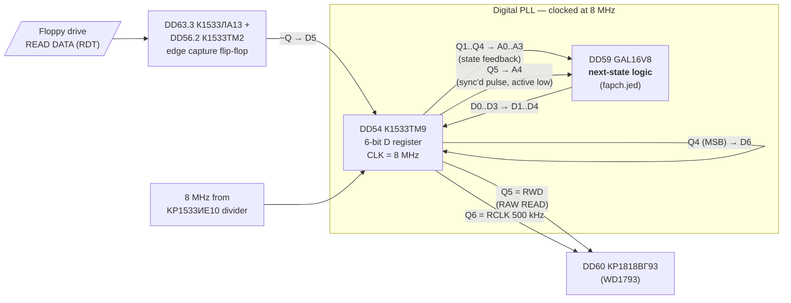
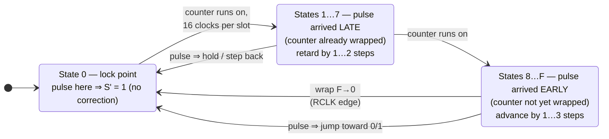
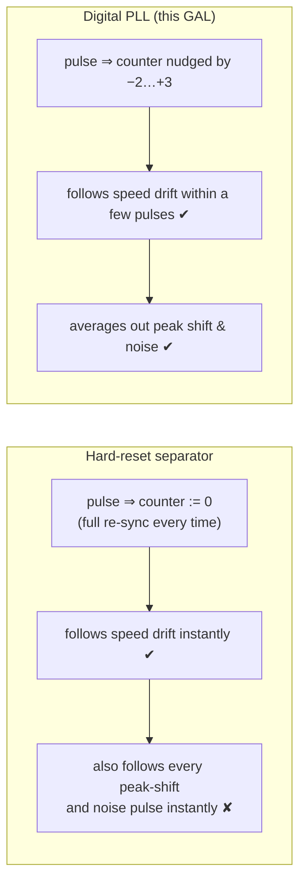

# The Floppy Data Separator PLL in Scorpion ZS‑256 Turbo+ (`fapch.jed`)

`FAPCH` is the transliteration of **ФАПЧ** — *фазовая автоподстройка частоты*, i.e. a phase‑locked loop.
The GAL16V8 at **DD59** is the next‑state logic of a small **digital PLL** that recovers the bit clock from
the raw MFM pulse stream coming off the floppy drive and hands the WD1793‑compatible controller
(КР1818ВГ93, DD60) a phase‑aligned `RCLK`. This document explains what the circuit does, why the
controller cannot work without it, how the 16‑state machine encoded in the GAL behaves, and what the
alternatives were.

All logic below is decoded from the fuse map (`jed16v8.py`), the wiring is read from
`Schematic_Scorpion-256-Turbo_v16.2.8a.pdf`, and the state table is computed from the decoded terms.

---

## 1. The problem: a floppy has no clock line

A floppy disk stores **flux transitions**, not bits. The drive's read amplifier turns each transition into a
short pulse on `READ DATA`. In MFM (the 250 kbit/s "double density" format used by TR‑DOS) pulses may only
occur at multiples of a 2 µs half‑cell, and a byte is encoded as a specific pattern of present/absent
pulses in 16 consecutive half‑cells.

```
MFM, 250 kbit/s:   bit cell = 4 µs, half‑cell (pulse slot) = 2 µs

slot:       |  0  |  1  |  2  |  3  |  4  |  5  |  6  |  7  |
pulses:     |  ▲  |     |     |  ▲  |     |  ▲  |     |     |
              data       clock      data
```

To decode, the controller must know **where the 2 µs slots are**. That timing reference is not on the
disk; it has to be reconstructed from the pulses themselves. Three things make this hard:

| Disturbance | Magnitude | Effect |
|---|---|---|
| Spindle speed error (drive‑to‑drive, temperature, belt wear) | ±1…2 % | slow drift: slot boundaries move by one full slot every ~50…100 slots |
| Instantaneous speed variation (wow/flutter) | ~0.5 % | slow wander around the mean |
| **Peak shift** — neighbouring transitions repel each other magnetically | up to ±20…25 % of a slot (≈ ±400 ns) | fast, data‑dependent jitter; does *not* accumulate |
| Read‑channel noise, PLL start‑up | random | isolated jitter |

The slot reference therefore has to **track the slow drift** (speed) while **ignoring the fast jitter**
(peak shift). That is exactly a PLL with a low‑pass loop filter.

## 2. What the WD1793 needs from the outside

The WD1793 family does *not* contain a data separator. It expects two inputs:

- **`RAW READ`** (pin 27, `RWD`) — the pulse train, one narrow active‑low pulse per flux transition;
- **`RCLK`** (pin 26, `S` on this schematic) — a square wave at the slot rate (500 kHz for MFM‑DD) that is
  **phase‑locked** to the pulses. The datasheet: *"Phasing (i.e. RCLK transitions) relative to RAW READ is
  important but polarity is not."* The FDC uses `RCLK` to decide which slot each pulse belongs to.

If `RCLK` drifts relative to the pulses, pulses are assigned to the wrong slot, the MFM decoder loses
clock/data framing, and the sector CRC fails.

## 3. Circuit overview



Signal roles, matching the `NOTE PINS` block of the JED:

| GAL pin | JED name | Connected to | Role |
|---|---|---|---|
| 7, 8, 9, 6 | A0, A1, A2, A3 | DD54 Q1…Q4 | current phase‑counter state (feedback) |
| 5 | A4 | DD54 Q5 | synchronised data pulse, **0 = transition present** |
| 14, 13, 12 | D0, D1, D2 | DD54 D1…D3 | next state, bits 0…2 (inverted OLMCs) |
| 15 | D3 | DD54 D4 | next state, bit 3 (MSB, non‑inverted OLMC) |

The GAL is purely combinational (simple mode, `SYN=1 AC0=0`); all the memory lives in the ТМ9 register.
Together they form a 4‑bit synchronous state machine stepped at 8 MHz, i.e. **16 states per 2 µs slot**
(125 ns resolution).

The pulse path: a flux transition clocks DD56.2 (`D=1`), its `~Q` goes low, the ТМ9 samples it on the next
8 MHz edge (`Q5`), and `Q5` both feeds the GAL (`A4`) and drives the FDC's `RAW READ`; the same signal
resets DD56.2 so the pulse lasts exactly one 8 MHz period. Feeding the FDC and the PLL from the *same*
register output guarantees the pulse and the recovered clock go through identical pipeline delay.
`Q6` re‑registers the counter MSB (`Q4`) and delivers it as `RCLK`, again matching that delay.

## 4. The state machine encoded in the GAL

### 4.1 Decoded equations

Outputs D0…D2 are inverted OLMCs (XOR fuse = 0), D3 is non‑inverted (XOR = 1):

```
 D3 = A3·!A1 + A3·!A2 + A4·A3·!A0 + A4·!A3·A0·A1·A2

!D0 = !A4·A3·A1·!A2 + !A3·A0·A2 + A4·A0 + !A4·!A0·A1·!A2 + !A4·A3·!A0·A1

!D1 = A4·A0·A1 + A4·!A0·!A1 + !A4·!A0·A1·A2 + !A4·A0·!A1·!A2
    + !A4·A3·!A0·A1 + !A4·A3·A1·A2 + !A4·!A3·A0·!A1 + !A4·!A3·!A1·!A2

!D2 = !A0·!A1·!A2 + A4·A0·A1·A2 + A4·!A0·!A2 + A4·!A1·!A2
    + !A4·A3·A1·A2 + !A4·!A3·!A0·!A1 + !A4·!A3·!A2
```

### 4.2 Transition table (evaluated from the equations)

`S` = current state `A3..A0`, `S'` = next state `D3..D0`.

**No pulse (A4 = 1): free‑running counter**

```
S' = (S + 1) mod 16
```

**Pulse present (A4 = 0): phase correction**

| S | S' | S' − (S+1) | | S | S' | S' − (S+1) |
|---|---|---|---|---|---|---|
| 0 | 1 | 0 | | 8 | B | +2 |
| 1 | 1 | −1 | | 9 | D | +3 |
| 2 | 2 | −1 | | A | C | +1 |
| 3 | 3 | −1 | | B | E | +2 |
| 4 | 3 | −2 | | C | F | +2 |
| 5 | 4 | −2 | | D | F | +1 |
| 6 | 5 | −2 | | E | 0 | +1 |
| 7 | 6 | −2 | | F | 1 | +1 |

The third column is the **phase correction** applied in units of 125 ns, relative to what the counter would
have done anyway.

### 4.3 Reading the table as a PLL



- The **lock point** is the counter wrap `F → 0`, which is also the transition of the MSB, i.e. an
  **`RCLK` edge**. In lock, every flux transition arrives exactly when the counter is at 0, and the counter
  simply continues: `0 → 1`. The fixed point is unique: `f(0, S) = S + 1` holds only for `S = 0`.
- If the disk runs **slow**, pulses arrive after the wrap (states 1…7). The counter is held or stepped back,
  so the next wrap comes later — `RCLK` slows down to follow.
- If the disk runs **fast**, pulses arrive before the wrap (states 8…F). The counter jumps ahead toward 0/1,
  so the next wrap comes sooner — `RCLK` speeds up.

The correction is **non‑linear**: ±1 step (125 ns) near the lock point, up to −2/+3 steps far from it. This
is the loop filter. Small phase errors — which is what peak‑shift jitter looks like — are answered with
the smallest possible nudge, so a single shifted pulse cannot drag the window far away. Large errors —
which only occur on start‑up or on a genuine speed change — are corrected in a few pulses:

```
capture example (pulse first seen at state 8, nominal 16‑clock spacing):
   8 → B  … next pulse at A → C … at B → E … at D → F … at E → 0 … at F → 1 … at 0  (locked)
   six pulses ≈ 12 µs, i.e. inside the 12‑byte preamble of every ID/data field
```

Because a correction can never exceed 3 of 16 steps (≈19 % of a slot) per pulse, one wildly displaced pulse
(noise, a dropout) moves the window by at most 375 ns and the loop returns to lock on the following pulses.

### 4.4 Timing picture

```
8 MHz clk   ┐┌┐┌┐┌┐┌┐┌┐┌┐┌┐┌┐┌┐┌┐┌┐┌┐┌┐┌┐┌┐┌┐┌┐┌┐┌┐┌┐┌┐┌┐┌┐┌┐┌┐┌┐┌┐┌┐┌┐┌┐┌┐┌
state       F 0 1 2 3 4 5 6 7 8 9 A B C D E F 0 1 2 3 4 5 6 7 8 9 A B C D E F 0
RCLK (Q4)   ‾|_______________|‾‾‾‾‾‾‾‾‾‾‾‾‾‾‾|_______________|‾‾‾‾‾‾‾‾‾‾‾‾‾‾‾|__
RWD pulse    ▼ (in lock: at the wrap)                          ▼
              ← 2 µs slot →

late pulse:  state 3 →  held at 3          ⇒ wrap delayed by 125 ns
early pulse: state D →  jumps to F         ⇒ wrap advanced by 125 ns
```

## 5. What would happen without the PLL

### 5.1 Free‑running crystal `RCLK`

Simply feeding a fixed 500 kHz clock to `RCLK` cannot work. With a 1 % speed error the pulse train slips
against the fixed slots by one full slot every 100 slots — about every 6 bytes. Even a perfectly nominal
disk is unreadable because the phase at the start of each sector is arbitrary and peak shift alone pushes
pulses across window boundaries. This is why every 179x design has *some* separator.

### 5.2 "Hard‑reset" separator (resettable counter)

The cheapest classic solution (used in many early Spectrum clones, e.g. Pentagon's ИЕ7‑based circuit):
a counter that is **reset to a fixed value by every pulse** and free‑runs in between. In the vocabulary of
§4 it is a table where every pulse forces `S' = const`, i.e. an infinite‑gain phase detector with no filter.



The hard‑reset scheme works on clean disks and good drives, but it has no jitter tolerance: a pulse
shifted by 20 % of a slot moves the *entire* window by 20 %, so the next pulse — shifted the other way, as
peak shift does — lands near the boundary. Marginal media and worn drives produce CRC errors.

### 5.3 Analogue PLL (VCO + charge pump)

The original Beta Disk and PC controllers of the era (FDC9216, 765‑based boards) used an analogue PLL:
phase detector → RC loop filter → VCO. It gives a true proportional/integral response but needs trimming
(the classic "adjust the pot until the disk reads") and is sensitive to temperature and part tolerance.
The 8 MHz digital loop here needs no adjustment and is fully reproducible — which is exactly why the
schematic's authors replaced the old ROM‑table separator with a GAL.

### 5.4 Integrated separator

Later controllers (WD1772, 37C65, the Scorpion GMX's own logic) put the DPLL on‑chip; the external PLL
disappears. The WD1793 used in the ZS‑256 has none, hence DD54/DD59.

## 6. Why 8 MHz and 16 states

- MFM‑DD slot = 2 µs; 16 states → 125 ns phase resolution (≈6 % of a slot), fine enough that a ±1 step
  correction is below the peak‑shift amplitude, so the loop does not "hunt".
- 8 MHz is already available from the system divider chain (`8M` / `4M` / `2M` / `1M` on KP1533ИЕ10, the
  same chain that gives the FDC its 1 MHz `CLK`).
- The MSB of the counter *is* the 500 kHz `RCLK`, no extra divider needed.
- A 4‑bit state plus a 1‑bit input fits a GAL16V8 with room to spare (4–8 product terms per output).

## 7. Summary

| | |
|---|---|
| Function | Digital PLL data separator for WD1793: recovers `RCLK` from `RAW READ` |
| Topology | 4‑bit synchronous phase counter, 8 MHz, GAL = next‑state ROM, ТМ9 = state register |
| Phase detector | pulse sampled into state 0 = lock; states 1…7 late, 8…F early |
| Loop gain | non‑linear: ±1 step near lock, up to −2/+3 steps far from lock |
| Outputs | `Q5` → `RAW READ` (sync'd pulse), `Q6` → `RCLK` (counter MSB, 500 kHz) |
| Capture | ≤ ~6 pulses from worst case; fits in the sync preamble |
| Jitter tolerance | ≥ ±3 steps (≈ ±19 % of slot) per pulse without losing the window |
| Without it | fixed clock: unreadable; reset‑counter: works but no peak‑shift immunity |
