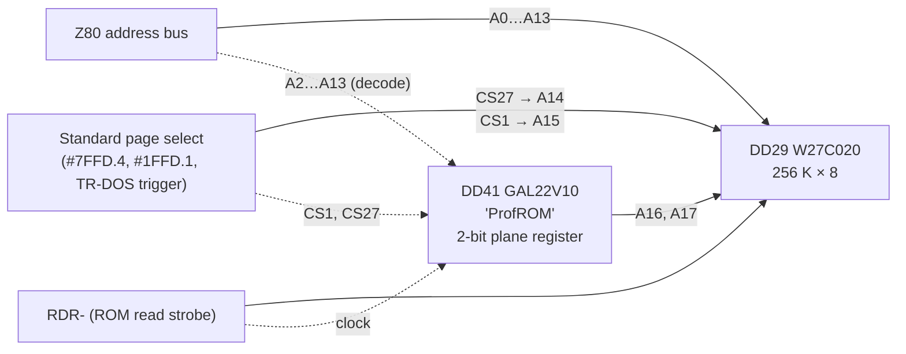
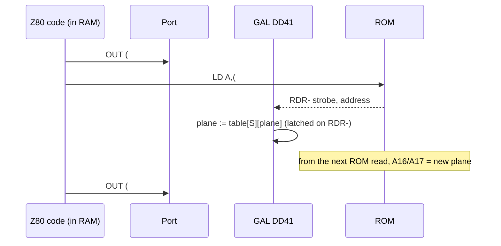
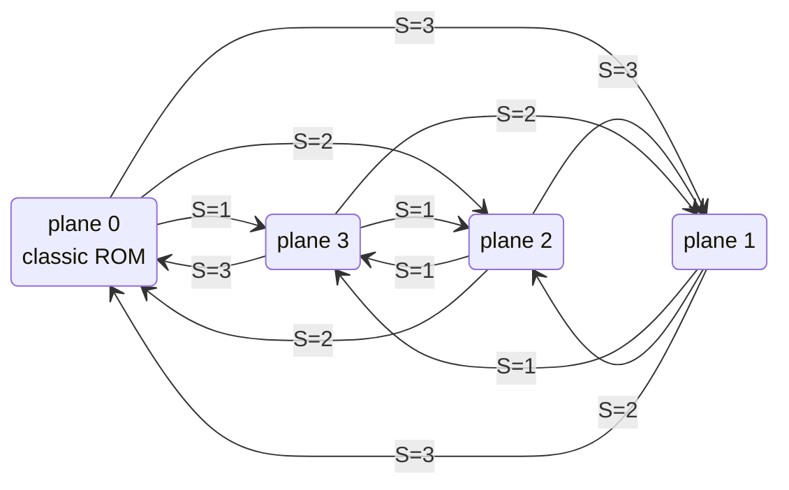

# ProfROM on the Scorpion ZS‑256 Turbo+ — how the 256 KB ROM is paged

The stock Scorpion ZS‑256 has a 64 KB ROM: four 16 KB pages (BASIC 128, BASIC 48, Service Monitor,
TR‑DOS). **ProfROM** replaces it with a 256 KB EPROM/flash (27C020 / W27C020) holding four such 64 KB
sets — called **planes** — and a small piece of logic (GAL22V10 DD41) that supplies the two extra
address lines. This document explains the hardware view, the switching protocol (there is **no I/O
port**), and how software has to be written to use it.

Sources: schematic `Schematic_Scorpion-256-Turbo_v16.2.8a.pdf`, ROM images `scorp401-*.rom`,
`ProfRomZS256_v4*.rom`, MAME `sinclair/scorpion.cpp` (`prof_plane_map`). The transition table and the
switching stub were verified against the ROM images by disassembly.

---

## 1. Address composition



| ROM address bit | Source | Meaning |
|---|---|---|
| A0…A13 | Z80 A0…A13 | offset inside the 16 KB page |
| A14 | `CS27` | 0 = BASIC128/Service, 1 = BASIC48/TR‑DOS (the usual #7FFD bit 4 / DOS logic) |
| A15 | `CS1` | 0 = BASIC pages, 1 = Service Monitor / TR‑DOS |
| A16, A17 | GAL plane register | **plane 0…3** |

So the 256 KB image is laid out as 4 planes × 4 pages × 16 KB:

```
offset    plane  page  content (v4.01 image)
00000     0      0     BASIC 128          ┐
04000     0      1     BASIC 48           │ plane 0 = the classic 64 KB Scorpion ROM
08000     0      2     Service Monitor    │
0C000     0      3     TR‑DOS             ┘
10000     1      0     ProfROM tool set 1 (page 0 starts with the "return to plane 0" stub)
14000     1      1     …
18000     1      2     … (the plane's own "service" page — see §3)
1C000     1      3     …
20000–2FFFF   plane 2
30000–3FFFF   plane 3
```

Important consequence: **the plane applies to all four pages at once**. When plane 1 is selected, the
`RST 0` vector, BASIC, the NMI monitor and the TR‑DOS page are all read from plane 1. Every plane must
therefore be self‑sufficient for whatever can happen while it is mapped (interrupts, NMI, RST vectors).

## 2. Why there is no port

Switching is done by **reading** ROM at `#0100…#010F` while the Service Monitor page is mapped:

- no I/O address is consumed, so nothing in the Spectrum port map changes;
- ordinary programs cannot switch planes accidentally — they never run with the Service page mapped
  (`#1FFD` bit 1 is a system‑only feature) and never read `#0100` there;
- the trigger is a plain memory read, which costs nothing in hardware: the GAL already sees the address
  bus and the ROM read strobe.



Conditions checked by the decoder (as emulated in MAME and as the ROM code assumes):

| Condition | Value |
|---|---|
| ROM is mapped at 0000–3FFF (`#1FFD` bit 0 = 0) | required |
| Service Monitor page mapped (`#1FFD` bit 1 = 1) | required |
| Address | `#0100`, `#0104`, `#0108`, `#010C` (A3:A2 = selector `S`) |
| Access | memory **read** (opcode fetch also counts) |

## 3. The transition table

The selector `S` does not name the target plane directly; the new plane is a function of `S` **and the
current plane**:

| `S` | read address | from 0 | from 1 | from 2 | from 3 |
|---|---|---|---|---|---|
| 0 | `#0100` | 0 | 1 | 2 | 3 |
| 1 | `#0104` | 3 | 3 | 3 | 2 |
| 2 | `#0108` | 2 | 2 | 0 | 1 |
| 3 | `#010C` | 1 | 0 | 1 | 0 |



Reading `#0100` (`S = 0`) is a no‑op — that address is safe to fetch from and is used as padding.
Every plane is reachable from every other in one step, and from any plane `S = 3` or `S = 2` gets back
to plane 0 (1→0 and 3→0 with `S = 3`, 2→0 with `S = 2`).

### 3.1 Plane identification

Because the read at `#0100` is harmless, the ROM images keep a signature there in every plane's
Service page:

```
plane 0, #0100:  E5 02 …     (#0101 = 02 → bits 3:2 = 00)
plane 1, #0100:  01 06 …     (#0101 = 06 → bits 3:2 = 01)
plane 2, #0100:  01 0A …     (#0101 = 0A → bits 3:2 = 10)
plane 3, #0100:  01 0E …     (#0101 = 0E → bits 3:2 = 11)
```

`(#0101 >> 2) & 3` is the current plane number. `#0102…#010F` are zero, so `#0104/#0108/#010C` decode as
`NOP` if ever executed.

## 4. Rules for software

1. **Run the switch from RAM.** The instant the plane changes, the ROM you were executing from is gone.
   The stub must live at `#4000` or above (the ROM images copy it to `#5BEE`, just above the system
   variables area used by TR‑DOS).
2. **Disable interrupts.** In IM1 the `#0038` vector is in ROM — of the plane that happens to be
   mapped. IM2 with a vector table in RAM is the only way to keep interrupts on across a switch.
3. **Stack in RAM** (it always is, but not in `#4000–#57FF` if you also want the screen intact).
4. **Do not touch `#0100…#010F`** while the Service page is mapped unless you mean it: `LDIR` over the
   ROM, a disassembler, a "ROM checksum" utility — all of them switch planes. Note `S = 0` is safe.
5. **Restore plane 0 before returning to BASIC/TR‑DOS.** They live in plane 0; other planes only carry
   the extension tools plus enough vectors to survive.
6. **NMI (the "Magic Button")** forces page 3 (TR‑DOS) of the *current* plane — the Beta‑128 DOS‑trigger
   mechanism (DD50.1), not a `#1FFD` write; the plane register is not involved. The TR‑DOS `#0066`
   handler chains into the Service page itself (`OUT (#1FFD),#12` at `#0033` — the pages carry
   compatible code there). In planes 1–3 the `#0066` of pages 2 **and** 3 is a deliberate park loop
   (border stripes, no exit): the monitor would clobber the running tool's `#DDxx` RAM. The trigger
   releases on the first CPU read from `#4000+`. See `../profrom-nmi-boot-analysis.md`.

## 5. Z80 examples

### 5.1 Minimal stub: switch with a given selector

```z80
; In: A = selector S (0..3)
; Must be executed from RAM, DI, stack in RAM.
; Clobbers: A, BC, HL
switch_plane:
        and     3
        add     a,a
        add     a,a                 ; S*4
        ld      l,a
        ld      h,#01               ; HL = #0100 + 4*S
        ld      bc,#1FFD
        ld      a,2
        out     (c),a               ; Service page in, RAM0 off
        ld      a,(hl)              ; <-- the switch happens on this read
        xor     a
        out     (c),a               ; Service page out (new plane's BASIC/DOS pages visible)
        ret
```

This is functionally what the ROM stub at `#0111` in planes 1–3 does (`LD HL,#010C / LD L,(HL)` — it
reads through `L` only to save a byte; the effect is the same).

### 5.2 Read the current plane number

```z80
; Out: A = current plane 0..3. DI, run from RAM.
get_plane:
        ld      bc,#1FFD
        ld      a,2
        out     (c),a
        ld      a,(#0101)           ; signature byte; #0101 is not a trigger address
        rrca
        rrca
        and     3
        push    af
        xor     a
        out     (c),a
        pop     af
        ret
```

### 5.3 Go to an absolute plane

The selector depends on the current plane, so use a 4×4 table indexed by `current*4 + target`:

```z80
; In: A = target plane 0..3. DI, run from RAM. Clobbers A,BC,DE,HL.
goto_plane:
        ld      e,a
        call    get_plane           ; A = current
        add     a,a
        add     a,a
        add     a,e                 ; current*4 + target
        ld      hl,sel_tab
        add     a,l
        ld      l,a
        jr      nc,$+3
        inc     h
        ld      a,(hl)              ; selector S
        jp      switch_plane

; selector to use:      target 0  1  2  3
sel_tab:        db              0, 3, 2, 1      ; from plane 0
                db              3, 0, 2, 1      ; from plane 1
                db              2, 3, 0, 1      ; from plane 2
                db              3, 2, 1, 0      ; from plane 3
```

(Each row is the inverse of the transition table: for `from 2`, `S=2` gives 0, `S=3` gives 1, `S=1`
gives 3.)

### 5.4 Complete example: call a routine that lives in plane 1

Scenario: a tool in plane 1, page 0 (`#0000–#3FFF`) exports an entry point at `#0200` that expects a
buffer in `HL` and returns with `A` = status. The caller is an ordinary program in RAM.

```z80
        org     #8000

call_plane1:
        di
        ld      (save_sp),sp
        ld      sp,local_stack
        ld      hl,stub
        ld      de,#5BEE            ; RAM area free while BASIC/TR‑DOS are idle
        ld      bc,stub_len
        ldir
        ld      hl,buffer
        call    #5BEE
        ld      sp,(save_sp)
        ei
        ret

; --- copied to #5BEE ---
stub:
        push    hl
        ld      a,1
        call    goto_plane          ; plane 1 (uses get_plane + switch_plane, all in RAM)
        pop     hl
        call    #0200               ; runs from plane 1, page 0
        push    af
        ld      a,0
        call    goto_plane          ; back to plane 0 before anyone else touches ROM
        pop     af
        ret
stub_len equ    $-stub
```

Notes on the example:

- `goto_plane`, `get_plane`, `switch_plane` and `sel_tab` must be inside the copied block or otherwise in
  RAM; the listing assumes they are assembled after `stub` and included in `stub_len`.
- While plane 1 is mapped, `#3D00` (TR‑DOS entry), `RST` vectors and `#0038` are plane‑1 addresses.
  Nothing in plane 0 can be called until `goto_plane 0` has run.
- If the routine in plane 1 needs BASIC 48 vs BASIC 128 selection it uses `#7FFD` bit 4 exactly as
  before — that only changes `CS27`, the plane stays.

### 5.5 What the ROM itself does at reset

Plane 0 comes up at power‑on. The monitor's menu (plane 0, Service page) selects a tool by switching to
plane 1–3 and jumping to its page 0. Every extension plane starts with:

```z80
        org     #0000
        di
        jp      #0103
        ...
#0100:  db      #01,#06             ; signature: plane 1
#0103:  ld      de,#5BEE            ; copy return stub to RAM
        ld      hl,#0111
        ld      bc,#11
        ldir
        jp      #5BEE
#0111:  ld      bc,#1FFD            ; the return stub itself
        ld      a,2
        out     (c),a
        ld      hl,#010C            ; S=3 → plane 0 (planes 1 and 3); plane 2 uses #0108 (S=2)
        ld      l,(hl)
        xor     a
        out     (c),a
        jp      #0000               ; cold start of plane 0
```

i.e. a `RST 0` / reset while an extension plane is mapped is safe: it just returns to plane 0 and boots
normally. That is the reason each plane begins with this 34‑byte stub instead of a real reset vector.

## 6. Emulator model

```c
static const uint8_t plane_map[4][4] = {   // [S][current]
    {0, 1, 2, 3},
    {3, 3, 3, 2},
    {2, 2, 0, 1},
    {1, 0, 1, 0},
};

uint8_t rom_read(uint16_t addr)
{
    if (addr < 0x4000 && !ram0_mapped && service_page_mapped
        && (addr & 0xFFF0) == 0x0100 && (addr & 3) == 0)
    {
        plane = plane_map[(addr >> 2) & 3][plane];
    }
    uint32_t page = service_page_mapped ? 2 : (dos_active << 1) | rom48;   // CS1:CS27
    return rom[(plane << 16) | (page << 14) | (addr & 0x3FFF)];
}
```

The check `(addr & 3) == 0` mirrors MAME; the real GAL does not see A0/A1, so on hardware `#0101`
triggers exactly like `#0100` (which is why the signature read in §5.2 is harmless — `S = 0`).

## 7. Beyond 256 KB

The 2‑bit plane register is the limit of this design. Larger ROMs on later machines (Scorpion GMX,
ZS‑1024 boards) use a different mechanism: port `#7EFD`, bits D4–D6 → A16–A18 of a 512 KB 28F400, with a
"fixrom" latch that blocks further changes. That scheme *is* port‑based and is not compatible with the
read‑triggered ProfROM protocol described here.

## 8. Summary

| | |
|---|---|
| ROM | 256 KB = 4 planes × (BASIC128, BASIC48, Service, TR‑DOS) |
| Plane register | 2 bits in GAL DD41 → ROM A16/A17, clocked by the ROM read strobe |
| Trigger | read of `#0100 + 4·S` with Service page mapped (`#1FFD` bit 1 = 1), ROM on |
| Next plane | `plane_map[S][current]` (§3); `S = 0` is a no‑op |
| Identify plane | `(#0101 >> 2) & 3` in the Service page |
| Software rules | run from RAM, DI (or IM2 with RAM vectors), return to plane 0 before BASIC/TR‑DOS |
| Return stub | present at `#0111` of every extension plane; `RST 0` there is safe |
