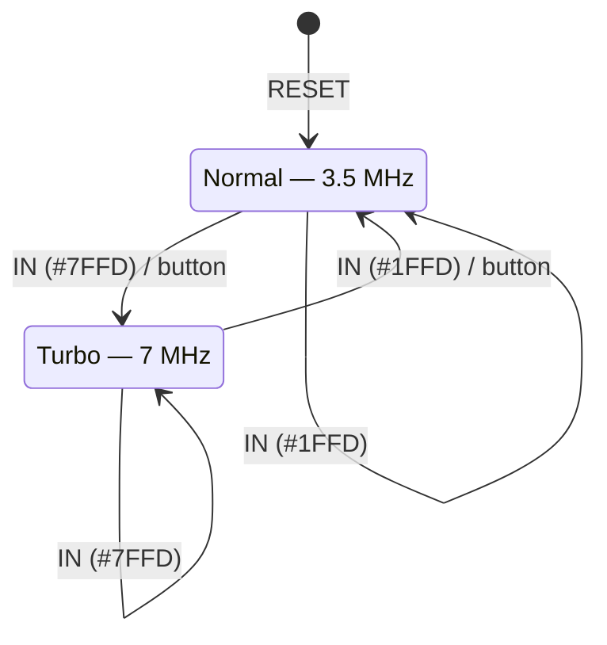
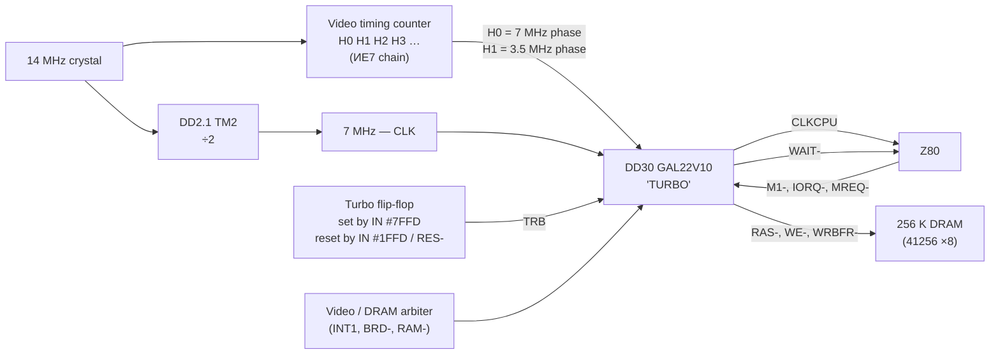
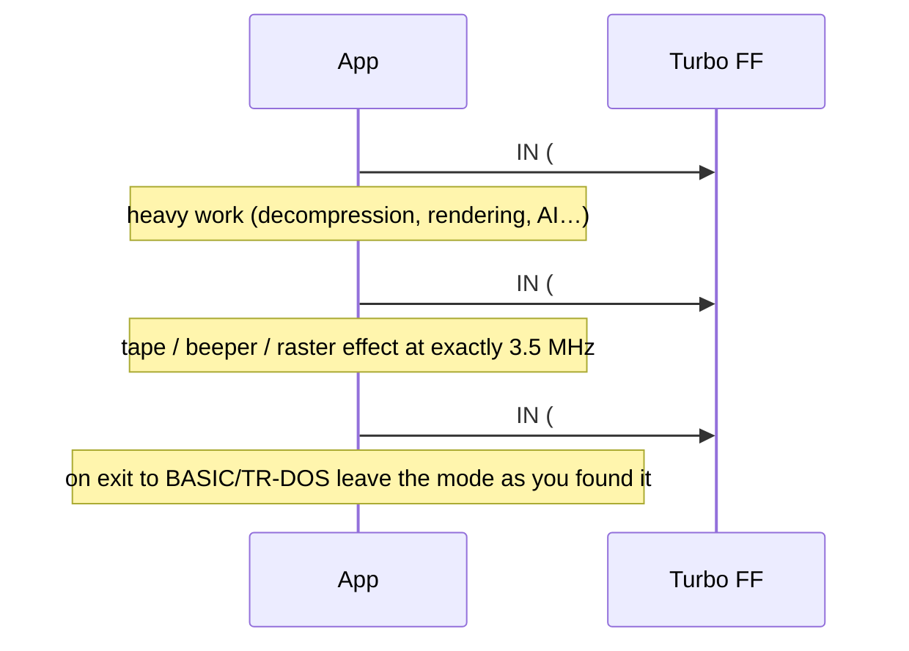

# Turbo mode on the Scorpion ZS‑256 Turbo+ — 7 MHz clocking and how software uses it

The "Turbo+" in the machine's name is a second CPU clock: the Z80B can run at **7 MHz** instead of the
Spectrum‑standard 3.5 MHz. The mode is selected by software, survives until changed, and is implemented by
a clock generator around GAL22V10 **DD30** (`turbo.jed`, "TURBO 15.3"). This document describes the
software interface (verified against the ROM/MAME model), the clocking architecture, what the GAL
actually contains, and how programs should handle the mode.

Sources: schematic `Schematic_Scorpion-256-Turbo_v16.2.8a.pdf`, `GAL/turbo.jed` decoded with `jed22v10.py`,
MAME `sinclair/scorpion.cpp` (`scorpiontb_state`).

---

## 1. Software interface

Turbo is controlled by **reading** two ports that are otherwise write‑only paging registers. The port
decoder only looks at the address bits marked, so any address with that pattern works; the canonical
addresses are `#7FFD` and `#1FFD`.

| Action | Instruction | Address decode (bits that matter) |
|---|---|---|
| Turbo **on** (7 MHz) | `IN A,(C)` with `BC = #7FFD` | `01xxxxxxxx1xxx01` |
| Turbo **off** (3.5 MHz) | `IN A,(C)` with `BC = #1FFD` | `00xxxxxxxx1xxx01` |

The value returned by the read is undefined (bus float / `#FF`) and must be ignored. Writing to these
ports keeps its normal paging meaning and does not affect turbo.

Other facts:

- **Reset** puts the machine into normal (3.5 MHz) mode.
- The front‑panel **Turbo button** (where fitted) toggles the same flip‑flop.
- There is **no status bit** readable on the ZS‑256. (The AY register 14 read‑back that Scorpion provides
  returns the `#7FFD`/`#1FFD` paging bits only; the GMX adds a turbo bit in `#7EFD`, the ZS‑256 does not.)
  Programs that need to know the mode measure it — §5.3.
- The interrupt rate stays **50 Hz**; the AY, the FDC and the video are on their own clocks. Only the
  Z80 and everything it times by instruction counting run 2× faster.



## 2. Clocking architecture



Why a GAL is needed at all: the Spectrum design shares one DRAM array between the CPU and the video
generator. At 3.5 MHz the Scorpion interleaves the two so the CPU never waits (the Scorpion has no ULA
contention). At 7 MHz a CPU memory cycle is as short as the DRAM cycle itself, so the two users collide.
DD30 solves this by generating the CPU clock from the 7 MHz source and, when a collision is imminent,
**stretching the clock / asserting WAIT** for the CPU and buffering the write (`WRBFR‑`, a posted‑write
latch) so the CPU can carry on while the DRAM finishes. The practical result: turbo is a real 2× on
code that does not touch memory during video fetches, and somewhat less on screen‑heavy loops.

### 2.1 The two speeds

```
14 MHz  ┐┌┐┌┐┌┐┌┐┌┐┌┐┌┐┌┐┌┐┌┐┌┐┌┐┌┐┌┐┌┐┌┐┌┐┌┐┌┐┌┐┌┐┌┐┌┐┌┐┌┐┌┐┌┐┌┐┌┐┌┐┌┐┌
7 MHz   ‾‾|__|‾‾|__|‾‾|__|‾‾|__|‾‾|__|‾‾|__|‾‾|__|‾‾|__|‾‾|__|‾‾|__|‾‾|__|
H1      ‾‾‾‾‾|____|‾‾‾‾‾|____|‾‾‾‾‾|____|‾‾‾‾‾|____|‾‾‾‾‾|____|‾‾‾‾‾|____|    (3.5 MHz)

CLKCPU, normal:   follows H1  (3.5 MHz, 286 ns per T‑state)
CLKCPU, turbo:    follows 7 MHz (143 ns per T‑state), individual periods stretched on collision
```

A stretched clock is invisible to the program; it is just a T‑state that lasts longer. `WAIT‑` is used
where the Z80 samples it (T2 of memory/I/O cycles) — the two mechanisms together cover every cycle type.

### 2.2 What the GAL contains

Decoded from `turbo.jed` (names from the JED, physical nets in brackets where they differ):

| Pin | JED name | Net | Direction |
|---|---|---|---|
| 1 | CLK_7MHZ | CLK (7 MHz) | in / clock |
| 4 | IORQ_ | IORQ‑ | in — *unused by this revision* |
| 5 | WR_EN | WR_EN | in — *unused* |
| 6 | RAM_ | RAM‑ | in — *unused* |
| 7 | INT | INT1 | in |
| 8 | TRB_IN | TRB (turbo flip‑flop) | in |
| 9 | BORDER_ | BRD‑ | in — *unused* |
| 10 | M1_ | M1‑ | in |
| 11 | H0 | H0 | in — *unused* |
| 13 | H1 | H1 | in |
| 14 | H1M | H1M | out |
| 15 | Pin13 | n/c | registered node |
| 16 | WR_BUFF | WRBFR‑ | out |
| 17 | RAS_ | RAS‑ | out |
| 18 | TRB | n/c | internal node |
| 19 | WE | WE‑ | out |
| 20 | CLK_CPU | CLKCPU | out |
| 21 | WAIT_ | WAIT‑ | out |

```
WAIT_   = INT + TRB_IN·!M1_·!H1 + TRB_IN·!WR_BUFF·!M1_ + !CLK_CPU·WE·!M1_
CLK_CPU = CLK_7MHZ·!INT + INT·!TRB_IN
!WE     = INT·H1 + WR_BUFF·H1 + TRB_IN + !CLK_CPU
!TRB    = !INT·H1 + !INT·!TRB_IN + CLK_CPU·!INT + !WE·!INT
        + !CLK_CPU·WE·TRB·TRB_IN·!RAS_·!H1
!RAS_   = H1M
WR_BUFF = H1M·!H1 + !INT·!WR_BUFF·H1M
!Pin13 := M1_ + WAIT_                       (only flip‑flop, clocked by 7 MHz)
H1M     = INT·H1 + WR_BUFF·H1
```

What can be read off the equations with confidence:

- `CLK_CPU` is the 7 MHz clock **gated by `INT1`**: while `INT1 = 1` the CPU clock is frozen at the level
  `!TRB` — this is the clock‑stretch path. `INT1` therefore is the "hold the CPU" request coming from the
  DRAM/video arbiter, not the Z80 interrupt.
- `WAIT‑` is released (high) by the same `INT1` and by opcode‑fetch (`M1‑ = 0`) conditions in turbo; the
  registered node `Pin13` remembers `M1‑ + WAIT‑` for one 7 MHz period to shape the wait pulse.
- `WR_BUFF`/`H1M`/`RAS‑` form the posted‑write sequencer tied to the 3.5 MHz phase `H1`: a write is
  latched, `RAS‑` is generated from `H1M`, and the buffer releases itself on the next `H1M·!H1`.
- `TRB` (internal node) is a set/reset latch built from feedback terms; it aligns the turbo flag to
  cycle boundaries so the speed never changes in the middle of a memory cycle.

What should be treated with caution: five inputs (`IORQ‑`, `WR_EN`, `RAM‑`, `BRD‑`, `H0`) are wired on
the board but do not appear in any product term of this JED. Either the board's actual GAL is a later
revision than "15.3", or those inputs were reserved. The timing narrative above is the design intent as
visible from the schematic; the exact cycle‑by‑cycle behaviour of this JED revision has not been
simulated.

## 3. What turbo changes for software

| Affected | Not affected |
|---|---|
| All instruction timing (delay loops, `DJNZ` waits) | Frame interrupt (50 Hz) |
| Tape `LOAD`/`SAVE` (ROM edge‑timing loops) | AY‑3‑8910 pitch/envelopes (own 1.75 MHz) |
| Beeper music (bit‑banged `OUT (#FE)`) | FDC data rate (ВГ93 has its own 1 MHz clock and PLL) |
| Border effects, raster tricks, multicolour | Screen refresh, `HALT` synchronisation |
| Any "cycles per scanline" assumption | Keyboard, joystick, printer |
| TR‑DOS step/settle delays implemented in software | |

Two classes of code need care:

1. **Timing‑critical routines** (tape, beeper, raster): must run at 3.5 MHz. Switch turbo off around
   them and restore it afterwards.
2. **Turbo‑aware routines** (music players with delay loops, games with frame pacing): either sync to
   `HALT`/interrupt instead of counting cycles, or measure the speed once (§5.3) and scale delays.

Disk I/O is the least critical: the controller is asynchronous, and the ROM's TR‑DOS/ProfROM routines
already handle their own delays. Still, third‑party sector loaders that poll the FDC with software
timeouts should be tested in turbo.

## 4. Recommended usage pattern



Because the mode cannot be read back, a program that wants to be polite has to **measure** the speed on
entry, remember the result, and restore that state on exit.

## 5. Z80 examples

### 5.1 Switching

```z80
turbo_on:
        ld      bc,#7FFD
        in      a,(c)               ; value is garbage — discard
        ret

turbo_off:
        ld      bc,#1FFD
        in      a,(c)
        ret
```

Both are safe with interrupts enabled; the flip‑flop changes on the read strobe and the GAL re‑aligns
the clock at the next cycle boundary.

### 5.2 Wrapping a timing‑critical section

```z80
; Run a beeper tune (which counts cycles) at guaranteed 3.5 MHz,
; then return to whatever speed was active before.
play_tune_safe:
        call    measure_speed       ; A = 1 if turbo was on (see 5.3)
        push    af
        call    turbo_off
        call    beeper_player       ; timing‑exact code
        pop     af
        or      a
        ret     z                   ; was normal → stay normal
        jp      turbo_on            ; was turbo → restore
```

### 5.3 Measuring the current speed

Count how many iterations of a fixed loop fit between two frame interrupts. The loop cannot notice an
interrupt on its own, so a tiny IM2 handler sets a flag (an IM1 handler at `#0038` in RAM works the same
way if the ROM is paged out).

```z80
; IM2 handler (vector table in RAM, all 257 bytes = #FE → handler at #FEFE for example)
im2_isr:
        push    af
        ld      a,1
        ld      (frame_flag),a
        pop     af
        ei
        reti

; Out: A = 1 turbo / 0 normal, HL = iterations per frame
measure_speed:
        xor     a
        ld      (frame_flag),a
.wait0: ld      a,(frame_flag)
        or      a
        jr      z,.wait0            ; frame start
        xor     a
        ld      (frame_flag),a
        ld      hl,0
.count: inc     hl                  ;  6 T
        ld      a,(frame_flag)      ; 13 T
        or      a                   ;  4 T
        jr      z,.count            ; 12 T  → 35 T per iteration
        ; 3.5 MHz: 69,888 T / 35 ≈ 1,997 iterations
        ; 7 MHz:   ≈ 3,994 (slightly less on real hardware because of stretched cycles)
        ld      a,h
        cp      #0B                 ; threshold ≈ 2,800 (#0AF0)
        ld      a,0
        ret     c
        inc     a
        ret
```

Threshold 2,800 sits half‑way between the two expected values with margin for the memory‑arbitration
losses in turbo (real machines typically report 3,600–3,900 rather than the ideal 3,994).

### 5.4 Scaling a delay to the current speed

```z80
; delay_ms: A = milliseconds, uses speed_flag set by measure_speed
delay_ms:
        ld      b,a
.ms:    ld      a,(speed_flag)
        or      a
        ld      de,#0135            ; 309 inner iterations ≈ 1 ms at 3.5 MHz (11.3 T each)
        jr      z,.go
        ld      de,#026A            ; ×2 for 7 MHz
.go:    dec     de                  ;  6 T
        ld      a,d                 ;  4 T
        or      e                   ;  4 T
        jr      nz,.go              ; 12 T  → 26 T; recompute constants for your exact loop
        djnz    .ms
        ret
```

(The constants are illustrative — derive them from the real T‑state count of the loop you write.)

## 6. Emulator model

```c
// port read hook
uint8_t io_read(uint16_t port)
{
    if ((port & 0xC023) == 0x4021) { turbo = 1; cpu_clock = 7000000; }   // #7FFD
    if ((port & 0xC023) == 0x0021) { turbo = 0; cpu_clock = 3500000; }   // #1FFD
    ...
    return 0xFF;
}
// on reset: turbo = 0
```

For cycle‑accurate work the 7 MHz mode should additionally model the memory arbitration: a CPU access
to DRAM that coincides with a video fetch (paper area, `BRD‑ = 1`) is delayed by one 7 MHz period; writes
are posted and do not stall unless a second write arrives before the first completes. Exact numbers per
JED revision would have to come from simulation of `turbo.jed`, which — as noted in §2.2 — does not use
the `BRD‑` input at all, so the board's real GAL may differ.

## 7. Summary

| | |
|---|---|
| Speeds | 3.5 MHz (reset default) / 7 MHz |
| On / off | `IN` from `#7FFD` / `IN` from `#1FFD` (returned value meaningless) |
| Read‑back | none — measure with an interrupt‑bounded loop |
| Hardware | DD30 GAL22V10 generates CLKCPU, WAIT‑, RAS‑/WE‑/WRBFR‑ from 7 MHz, H1 and the turbo flag |
| Mechanism | clock stretching + WAIT on DRAM/video collision, posted writes |
| Unaffected | 50 Hz INT, AY, FDC, video |
| Must be off | tape, beeper, raster‑timed effects |
| Politeness | measure on entry, restore on exit |
