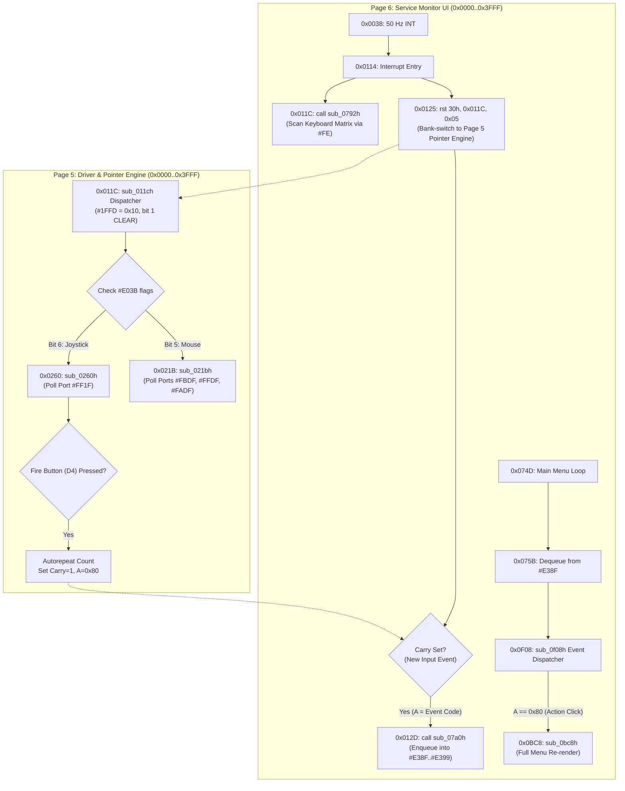

# Scorpion ProfROM Input Subsystem & Driver Disassembly

> **Status:** Verified primary-source documentation and static disassembly analysis of Scorpion ProfROM v4.01 (`data/rom/scorp_prof401.rom`, Pages 5 and 6).  
> **Topic:** Service Monitor input architecture, Kempston joystick and mouse driver disassembly, the `#1FFD` cross-plane paging model, and the 50 Hz menu redraw storm.  
> **Date:** 2026-09-12  
> **Author:** Antigravity (Advanced Agentic Pair Programmer)

---

## 1. Architectural Overview

The Scorpion ZS-256 ProfROM v4.01 firmware splits its Service Monitor implementation across multiple 16 KB ROM pages:
- **Page 2 (Monitor Kernel):** Primary NMI entry vector, core monitor initialization, and high-level menu definitions. Runs with `#1FFD = 0x12` (Shadow Monitor active, bit 1 = 1).
- **Page 5 (Driver & Pointer Engine):** Low-level peripheral drivers, pointer geometry math, Kempston mouse and joystick polling, and software cursor sprite blitting. Runs via inter-bank calls (`RST 30h`) with **`#1FFD = 0x10` (Service latch bit 1 is CLEAR)**.
- **Page 6 (Service Monitor UI & Event Loop):** Window rendering, 50 Hz frame interrupt dispatcher, keyboard matrix scanner, circular event ring buffer, and menu state machine.



---

## 2. The Paging Reality: Page 2 vs. Page 5

Understanding the exact bank-switching mechanism is critical to properly implementing port decoders for the Scorpion architecture:

### 2.1 Paging Latch States Across Planes

| ROM Page | Subsystem | Entry Mechanism | Latched `#1FFD` | Latched `#7FFD` | Active Bank at `#0000` |
|:---:|:---|:---|:---:|:---:|:---:|
| **Page 2** | Service Monitor Kernel | NMI / Magic Button (`OUT (#1FFD), 0x12`) | **`0x12`** (Bit 1 = 1) | `0x10` | ROM Page 2 (Service) |
| **Page 5** | Driver & Pointer Engine | `RST 30h, 0x011C, 0x05` from Page 6 | **`0x10`** (Bit 1 = 0) | `0x10` | ROM Page 5 (Drivers) |
| **Page 6** | UI & Windowing System | `RST 30h, target, 0x06` | **`0x10`** (Bit 1 = 0) | `0x10` | ROM Page 6 (UI) |

### 2.2 The Trap: Why Paging Gating Broke Peripheral Stubs

The Scorpion architecture defines `#1FFD` bit 1 as the Shadow Monitor latch:
- When bit 1 is set (`0x12`), ROM Page 2 is mapped at `#0000..#3FFF`.
- When the Service Monitor invokes subsidiary routines in Pages 5 and 6 via the `RST 30h` firmware dispatcher, it switches `#1FFD` to `0x10` (selecting RAM bank 8 at `#C000`, but **clearing bit 1**).

> [!CAUTION]
> **The Root Cause Defect:**
> If a peripheral decoder (e.g. Kempston Joystick port `#FF1F` or Kempston Mouse port `#DF`) gates its activation on `(_state->p1FFD & 0x02)`, **it will be active ONLY in Page 2, but DISABLED in Page 5**.
> Because the input polling loop (`sub_0260h` / `sub_021bh`) physically executes in Page 5, requiring `p1FFD & 0x02` caused every joystick poll to fall through to the floating bus, reading `0xFF` and triggering a perpetual Fire button press (`0x80`).

---

## 3. Page 5: Low-Level Input Driver Disassembly

### 3.1 Pointer Dispatcher (`Page 5: 0x011C..0x0168`)

The frame interrupt in Page 6 calls `0x011C` in Page 5 on every frame:

```z80
; ===========================================================================
; sub_011ch: Master Pointer & Game Controller Dispatcher
; Input:  None
; Output: Carry = 1 if an input event occurred, A = Event Code (e.g. 0x80)
; ===========================================================================
sub_011ch:
    or   a                      ; Clear carry
    ld   hl, 0e03bh             ; HL -> Pointer control variable (#E03B)
    bit  7, (hl)                ; Bit 7: Is pointer subsystem enabled?
    ret  z                      ; If not, exit immediately (Carry = 0)

    ld   c, 000h
    bit  6, (hl)                ; Bit 6: Kempston Joystick enabled as pointer?
    call nz, sub_0260h          ; Poll Kempston Joystick on port #FF1F

    bit  4, c                   ; Test Bit 4 (Fire button state returned in C)
    jr   nz, l0149h             ; If Fire button pressed, branch to click handler!

    bit  5, (hl)                ; Bit 5: Kempston Mouse enabled as pointer?
    jr   z, l0145h              ; If not enabled, skip mouse poll
    call sub_021bh              ; Poll Kempston Mouse (X, Y, Buttons)
    jr   z, l015eh              ; If no button pressed (Z=1), check cursor move

    push hl
    call sub_0344h              ; Handle mouse button click
    ld   (0e008h), hl
    pop  hl
    ld   a, c
    or   090h                   ; Construct mouse click event (0x90 | buttons)
    scf                         ; Set Carry = 1 (event ready)
    bit  2, (hl)
    ret  z
    set  3, a
    ret

l0145h:
    ret  z

; --- Joystick Fire Click Generation ---
l0149h:
    push hl
    call sub_02a1h              ; Fire autorepeat timing check
    pop  hl
    scf                         ; Carry = 1 (signal event to interrupt handler)
    ld   a, 080h                ; A = 0x80 (Action / Select Click Scancode!)
    bit  0, (hl)
    res  0, (hl)
    jr   nz, l015fh
    inc  a                      ; A = 0x81 (Alternative action)
    bit  1, (hl)
    res  1, (hl)
    jr   nz, l015fh
    call sub_0169h              ; Redraw mouse/joystick cursor sprite
    or   a                      ; Clear carry (event suppressed by autorepeat)
    ret

l015fh:
    ret
```

### 3.2 Kempston Joystick Driver (`Page 5: 0x0260..0x02A0`)

```z80
; ===========================================================================
; sub_0260h: Read Kempston Joystick and Update Pointer Coordinates
; Output: C = port #FF1F raw reading, (#E03C) updated with new (X, Y)
; ===========================================================================
sub_0260h:
    ld   bc, 0ff1fh             ; B = 0xFF, C = 0x1F (Kempston Joystick Port)
    in   c, (c)                 ; IN C, (C): Read joystick data into register C
    ld   d, (iy+02eh)           ; D = Pointer speed / step multiplier
    push hl
    ld   hl, (0e03ch)           ; HL = Current pointer coordinates: L = X, H = Y

    ; Test D1 (Left)
    bit  1, c
    jr   z, l0276h
    ld   a, l
    sub  d                      ; X = X - step
    jr   nc, l0275h
    xor  a                      ; Clamp X to 0
l0275h:
    ld   l, a

l0276h:
    ; Test D0 (Right)
    bit  0, c
    jr   z, l0285h
    ld   a, l
    add  a, d                   ; X = X + step
    cp   0ffh                   ; Clamp X to 255
    jr   c, l0284h
    ld   a, 0ffh
l0284h:
    ld   l, a

l0285h:
    ; Test D3 (Up)
    bit  3, c
    jr   z, l028fh
    ld   a, h
    sub  d                      ; Y = Y - step
    jr   nc, l028eh
    xor  a                      ; Clamp Y to 0
l028eh:
    ld   h, a

l028fh:
    ; Test D2 (Down)
    bit  2, c
    jr   z, l029ch
    ld   a, h
    add  a, d                      ; Y = Y + step
    cp   0bfh                   ; Clamp Y to 191 (bottom of screen)
    jr   c, l029bh
    ld   a, 0bfh
l029bh:
    ld   h, a

l029ch:
    ld   (0e03ch), hl           ; Store updated coordinates back to RAM
    pop  hl
    ret
```

### 3.3 Kempston Mouse Driver (`Page 5: 0x021B..0x025F`)

```z80
; ===========================================================================
; sub_021bh: Read Kempston Mouse Ports (#FBDF, #FFDF, #FADF)
; Output: (#E03C) updated with mouse deltas, C = Button State (D0=R, D1=L, D2=M)
;         Z flag = 1 if no buttons are pressed, Z = 0 if any button pressed
; ===========================================================================
sub_021bh:
    push hl
    ; 1. Read X coordinate from Port #FBDF
    ld   bc, 0fbdfh
    in   a, (c)                 ; A = Current raw X coordinate
    ld   b, 0ffh
    ld   hl, 0e12ch             ; HL -> Previous X coordinate latch
    ld   de, 0e03ch             ; DE -> Target pointer X coordinate
    call sub_0244h              ; Compute delta and apply to DE

    ; 2. Read Y coordinate from Port #FFDF
    ld   b, 0ffh
    in   a, (c)                 ; A = Current raw Y coordinate (BC = #FFDF)
    neg                         ; Y is inverted on standard mice
    ld   b, 0bfh                ; Y screen limit (191)
    ex   de, hl
    inc  hl                     ; Advance to target Y coordinate
    inc  de                     ; Advance to previous Y coordinate latch
    call sub_0244h              ; Compute delta and apply to DE

    ; 3. Read Button states from Port #FADF
    ld   b, 0fah                ; BC = #FADF (Mouse Buttons)
    in   a, (c)                 ; Hardware returns active-low buttons
    cpl                         ; Invert to active-high (1 = pressed)
    and  007h                   ; Mask bits 0-2 (Right, Left, Middle)
    ld   c, a                   ; C = active button mask
    pop  hl
    ret                         ; Returns with Z flag set from (AND 0x07)

; --- Delta Integrator Routine ---
sub_0244h:
    push bc
    ld   b, (hl)                ; B = Previous raw coordinate
    ld   (hl), a                ; Save new raw coordinate to latch
    sub  b                      ; A = Delta (New - Previous)
    ex   de, hl
    pop  bc
    ret  z                      ; If delta == 0, no movement!
    jp   m, l0256h              ; If negative delta, handle decrement

    ; Positive Delta: Add to coordinate and clamp to B
    add  a, (hl)
    jr   c, l0254h
    cp   b
    ld   (hl), a
    ret  c
l0254h:
    ld   (hl), b
    ret

    ; Negative Delta: Subtract from coordinate and clamp to 0
l0256h:
    neg
    ld   b, a
    ld   a, (hl)
    sub  b
    ld   (hl), a
    ret  nc
    ld   (hl), 000h
    ret
```

---

## 4. Page 6: UI, Interrupt Dispatcher & Redraw Storm

### 4.1 Interrupt Handler (`Page 6: 0x0114..0x0144`)

```z80
l0114h:
    push af
    push hl
    push de
    push bc
    ld   ix, (0e3b7h)

    ; 1. Scan Keyboard Matrix via Port #FE
    call sub_0792h

    ; 2. Poll Pointer Subsystem in Page 5
    push ix
    rst  30h, 0x011C, 0x05      ; Inter-bank call to Page 5: 0x011C

    ; 3. If Carry=1, enqueue returned event into ring buffer
    call c, sub_07a0h           ; Enqueue byte A into circular buffer (#E38F..#E399)

    pop  ix
    pop  bc
    pop  de
    pop  hl
    pop  af
    ei
    reti
```

### 4.2 Circular Ring Buffer Architecture (`0xE38F..0xE399`)

The firmware maintains a 10-byte circular queue in RAM:
- Head pointer: `(#E116)`
- Tail pointer: `(#E118)`
- Buffer extent: `0xE38F` to `0xE399`

```z80
; ===========================================================================
; sub_07a0h: Enqueue byte A into circular queue
; ===========================================================================
sub_07a0h:
    ld   de, (0e116h)           ; DE -> Current write head
    ld   (de), a                ; Store event scancode
    inc  de
    call sub_0780h              ; Wrap pointer if DE > 0xE399
    call sub_0777h              ; Check for buffer overflow
    ret  z                      ; If queue full, drop event
    ld   (0e116h), de           ; Commit new write head
    ret
```

### 4.3 The Menu Event Loop (`Page 6: 0x074D..0x0760`)

```z80
l074dh:
    ld   hl, 0e02eh
    bit  0, (hl)
    jr   z, l075bh
    di
    res  0, (hl)
l075bh:
    ei
    call sub_0773h              ; Check if ring buffer has pending events
    jr   z, l074dh              ; Buffer empty -> spin in idle loop

    ; Dequeue Event Byte
    di
    ex   de, hl
    ld   a, (de)                ; A = Dequeued event scancode
    inc  de
    call sub_0780h              ; Advance read tail pointer
    ld   (0e118h), de
    push af
    rst  30h                    ; Restore bank mapping
    ret                         ; Return to caller / dispatcher
```

### 4.4 Event Dispatcher & Redraw Storm (`Page 6: 0x0F08..0x0F18`)

```z80
sub_0f08h:
    call sub_0d01h
    bit  7, (iy+013h)
    jr   z, l0f38h
    ld   a, (de)
    ld   (0e33bh), a
    ld   a, h
    sub  080h                   ; Is event scancode == 0x80?
    jp   z, sub_0bc8h           ; YES: Trigger full menu redraw and action!
```

---

## 5. Mathematical Mechanics of the 5-Frame Redraw Storm

When port `#FF1F` returned floating bus noise (`0xFF`), `sub_011ch` interpreted Bit 4 as held:

1. **Autorepeat Timing:** Routine `sub_02a1h` reloaded counter `(#E00A)` with **`5`**. Every 5th frame, it returned `Carry = 1` and `A = 0x80`.
2. **CPU Execution Cost of Redraw (`sub_0bc8h`):**
   - Clears work surface buffer in RAM page 8 (`0x8000..0xBFFF`).
   - Iterates through 5 menu items, formatting Cyrillic/Latin strings and drawing borders.
   - Clears attribute rows with inactive color **`0x29`** (Cyan ink on Blue paper).
   - Block-copies buffer to screen VRAM `0x4000..0x5AFF`.
   - Highlights the active item row with **`0x31`** (Yellow ink on Blue paper).
   - Total execution duration: **~280,000 T-states = ~3.9 frames of CPU execution**.
3. **The Visual Result:**
   - **4 frames:** Menu is unhighlighted (`0x29`) while executing the slow redraw pass.
   - **1 frame:** Menu completes redraw and sets active highlight (`0x31`).
   - **Frame 5:** Next periodic `0x80` event is dequeued from the ring buffer, immediately restarting `sub_0bc8h`.
   - **User Observation:** The active menu item blinked off for 4 frames, on for 1 frame (80% OFF duty cycle).

---

## 6. Correct Port Decoder Implementation

In `core/src/emulator/ports/models/portdecoder_scorpion256.cpp`:

```cpp
bool PortDecoder_Scorpion256::IsPort_KempstonJoystick(uint16_t port)
{
    // Kempston Joystick stub:
    // In the Service Monitor, sub_0260h reads port #FF1F (LD BC,#FF1F; IN C,(C))
    // to read the on-board Kempston joystick interface.
    //
    // Outside TR-DOS, #FF1F addresses the Kempston joystick rather than the FDC.
    //
    // CRITICAL: Deliberately NOT gated on the Shadow Monitor bit (#1FFD bit 1)!
    // sub_0260h lives in ROM page 5 and is reached by RST 30h. Page 5 executes
    // with #1FFD = 0x10 (bit 1 CLEAR) - only page 2 carries 0x12.
    return !(_state->flags & CF_TRDOS) && !_state->scorpionDosTrigger
           && (port == 0xFF1F);
}

bool PortDecoder_Scorpion256::IsPort_KempstonMouse(uint16_t port)
{
    // Kempston Mouse stub:
    // In Page 5 sub_021bh, the firmware polls #FBDF (X coord), #FFDF (Y coord),
    // and #FADF (buttons). All Kempston mouse ports share the low byte #DF.
    return (port & 0x00FF) == 0x00DF;
}
```

---

## 7. Verification & Regression Tests

The fix is permanently guarded by three complementary tests in `core/tests/emulator/ports/models/scorpionports_test.cpp`:

1. **`KempstonJoystick_Port1F_ReadsZeroWhateverThePagingLatch`:**
   - Verifies `#FF1F` returns `0x00` from the driver plane (`#1FFD = 0x10`, service bit clear).
   - Verifies `#FF1F` returns `0x00` from the monitor plane (`#1FFD = 0x12`, service bit set).
2. **`KempstonJoystick_DoesNotStealPort1FFromBeta128InTrdos`:**
   - Verifies that inside TR-DOS sessions (`CF_TRDOS`), `#1F` routes to the WD1793 status register and is not captured by the joystick stub.
3. **`ProfRomServiceMonitorHighlightDoesNotBlink`:**
   - Boots `PROFSCORP` with `EnableTurboMode()`.
   - Arms a hardware memory write breakpoint on `0x58C1`.
   - Asserts that no writes occur mid-frame and that row 6 remains steadily highlighted (`0x31`) across 30 consecutive frames.
   - Executes in **45 ms** (well under the 50 ms test budget).
