# Scorpion ProfROM Service Monitor Menu Flashing Analysis

> **Status:** FIXED and verified end-to-end. Root cause identified via primary-source ROM disassembly (Pages 5 and 6) and TTD execution trace (`scratch/scorpion-menu-flashing.ttd`); a second, distinct defect in the *gating condition* of the first fix was then found on the live instance and corrected — see 9.
> **Date:** 2026-09-11 (round 1), 2026-09-12 (round 2 — gating defect)
> **Author:** Antigravity (Advanced Agentic Pair Programmer)

---

## 1. Executive Summary & Problem Description

### 1.1 The Observed Symptom
When navigating the Scorpion Service Monitor (entered via NMI "Magic" button), the active menu item's highlight blinks periodically. 
On Time Travel Debugging (TTD) recording playback (`scratch/scorpion-menu-flashing.ttd`), the active menu row physically alternates attributes in VRAM:
- **~3 to 4 consecutive frames:** Drawn with **no highlight** (standard menu item attribute `0x29` — Cyan ink on Blue paper).
- **1 frame:** Drawn with **active highlight** (`0x31` — Yellow ink on Blue paper).
- **Repeat:** This 5-frame cycle repeats infinitely without any keyboard input from the user.

### 1.2 Initial Hypothesis vs. Ground Truth
- *Initial hypothesis:* A firmware software blink timer or attribute flashing routine (like the standard ZX Spectrum `FLASH` attribute bit or a cursor blink counter) toggles the highlight on and off.
- *Physical Ground Truth:* **The firmware does NOT have an active item blink timer.** The menu is stuck in an infinite **continuous redraw loop** driven by phantom **Kempston Joystick Fire button click events (`0x80`)** injected by the 50 Hz frame interrupt handler every 5 frames.
  - A full menu redraw takes **~4 frames** of Z80 CPU execution time at 3.5 MHz. During this redraw, items are drawn in inactive colors (`0x29`).
  - At the very end of the redraw, the active row is highlighted (`0x31`) for the remainder of that frame (~1 frame).
  - Immediately upon completion, the next periodic `0x80` event is dequeued, immediately triggering another full redraw.

---

## 2. TTD Trace Forensics

### 2.1 Attribute Row Alternation in VRAM
The active menu item attribute row 20 spans addresses `0x5A81..0x5A9E`.
Inspecting VRAM attributes across frames in `scratch/scorpion-menu-flashing.ttd`:

| Frame Range | VRAM Attribute Value | Meaning | Duration |
|:---|:---:|:---|:---:|
| Frame 657 | `0x31` | Highlight ON (Yellow ink on Blue paper) | 1 frame |
| Frames 658–661 | `0x29` | Highlight OFF (Cyan ink on Blue paper) | 4 frames |
| Frame 662 | `0x31` | Highlight ON (Yellow ink on Blue paper) | 1 frame |
| Frames 663–666 | `0x29` | Highlight OFF (Cyan ink on Blue paper) | 4 frames |
| Frame 667 | `0x31` | Highlight ON (Yellow ink on Blue paper) | 1 frame |

The period is exactly **5 frames** (1 frame ON, 4 frames OFF).

### 2.2 Pinpointing Attribute Writers via TTD WebAPI
Searching backwards for writes to `0x5A81` using `/ttd/find-last`:
- **Highlight ON (`0x31`):** Written by routine at `0x0EA9` (called from `0x0E8C` in ROM Page 5). This routine runs at the conclusion of the menu rendering pass.
- **Highlight OFF (`0x29`):** Written by routine at `0x0EA9` (called from `0x0E6F`, invoked by `0x0DDA` in ROM Page 5). This routine runs during the menu rebuild pass when clearing previous item highlights.

---

## 3. Firmware Architecture Disassembly (ProfROM Pages 5 & 6)

Disassembly of ProfROM Page 6 (Service Monitor UI) and Page 5 (NMI Utilities & Drivers) reveals the complete input and rendering architecture.

```mermaid
flowchart TD
    subgraph INT_Handler["50 Hz Frame Interrupt (Page 6: 0x0038 -> 0x0114)"]
        A["0x011C: call sub_0792h"] --> B["Keyboard Scan via Port #FE"]
        B --> C{"Any Key Pressed?"}
        C -- "No (All half-rows return 0xFF)" --> D["0x0129: rst 30h (Inter-bank call to Page 5: 0x011C)"]
        D --> E["Pointer & Joystick Handler (Page 5: 0x011C)"]
        E --> F["0x0260: Read Port #FF1F (Kempston Joystick)"]
        F --> G{"Bit 4 of Port #FF1F (Fire Button)?"}
        G -- "1 (Pressed)" --> H["Autorepeat Timer: dec (#E00A); reload 5"]
        H -- "Hits 0 every 5 frames" --> I["Set A = 0x80, Carry = 1; RET"]
        I --> J["Page 6: 0x012D call c, sub_07A0h"]
        J --> K["Enqueue 0x80 into Ring Buffer (#E38F..#E399)"]
    end

    subgraph Main_Menu_Loop["Main Menu Event Loop (Page 6: 0x074D)"]
        L["0x074D: Poll Ring Buffer (#E38F..#E399)"] --> M{"Event in Buffer?"}
        M -- "Yes: A = 0x80" --> N["0x0F16: SUB 0x80; JP Z, sub_0bc8h"]
        N --> O["Clear & Redraw Menu Items (Attribute 0x29)"]
        O --> P["Execution takes ~4 frames of CPU time"]
        P --> Q["0x0E8C: Paint Active Row Highlight (Attribute 0x31)"]
        Q --> R["Frame 5: Next 0x80 arrives!"]
        R --> O
    end
```



### 3.1 Main Menu Polling Loop (`Page 6: 0x074D..0x0772`)
```z80
l074dh:
    ld hl, 0e02eh
    bit 0, (hl)
    jr z, l075bh
    di
    res 0, (hl)
l075bh:
    ei
    call sub_0773h          ; Check if circular input queue has events
    jr z, l074dh            ; Queue empty: wait in idle loop
    di
    ex de, hl
    ld a, (de)              ; Dequeue event byte into A
    inc de
    call sub_0780h          ; Advance ring pointer (buffer #E38F..#E399)
    ld (0e118h), de         ; Update head pointer
    push af
    rst 30h                 ; Restore state
    ret                     ; Return to event dispatcher
```

### 3.2 Event Dispatcher (`Page 6: 0x0F08..0x0F18`)
When `A = 0x80` is returned from the input queue:
```z80
sub_0f08h:
    call sub_0d01h
    bit 7, (iy+013h)
    jr z, l0f38h
    ld a, (de)
    ld (0e33bh), a
    ld a, h
    sub 080h                ; Is event == 0x80?
    jp z, sub_0bc8h         ; YES: Jump to full menu redraw / action routine!
```
- `sub_0bc8h` fills the shadow screen work buffer (`0x8000..0xBFFF`) with `0x00`, iterates through all 16 menu entries, formats strings, draws icons, unhighlights all rows (`0x29`), copies to VRAM, and finally highlights the active entry (`0x31`).
- This redraw routine executes millions of T-states, spanning **~4 full video frames**.

---

## 4. The Source of Phantom Event `0x80`: Port `#FF1F`

### 4.1 Interrupt Polling (`Page 6: 0x0114..0x0140`)
Every 50 Hz frame interrupt vectors to `0x0038 -> 0x0114`:
```z80
l0114h:
    push af
    push hl
    push de
    push bc
    ld ix, (0e3b7h)
    call sub_0792h          ; 1. Keyboard matrix scan
    rst 30h, 0x0176, 0x05   ; (Inter-bank call)
    push ix
    rst 30h, 0x011C, 0x05   ; 2. Call Pointer / Kempston handler in Page 5
    call c, sub_07a0h       ; 3. If Carry=1, enqueue returned event A into ring buffer!
    pop ix
    pop bc
    pop de
    pop hl
    pop af
    ei
    reti
```

### 4.2 Keyboard Scanner (`Page 6: 0x0845`)
During the TTD recording, `sub_0845h` scans all 8 keyboard half-rows via port `#FE` (`#FEFE`, `#FDFE`, `#FBFE`, `#F7FE`, `#EFFE`, `#DFFE`, `#BFFE`, `#7FFE`).
- All reads return `A = 0xFF` (no keys physically pressed).
- `sub_0845h` returns `Z = 1`.
- `sub_0792h` clears repeat bits and enqueues **nothing**.

### 4.3 Pointer / Joystick Handler (`Page 5: 0x011C..0x0165`)
The interrupt handler then calls `0x011C` in Page 5:
```z80
    or a
    ld hl, 0e03bh
    bit 7, (hl)             ; Pointer subsystem enabled?
    ret z
    ld c, 000h
    bit 6, (hl)             ; Kempston Joystick enabled as pointer?
    call nz, sub_0260h      ; Poll Kempston Joystick on port #FF1F!
    bit 4, c                ; Check Bit 4 (Fire button)
    jr nz, l0149h           ; If Fire button pressed, handle click!
```

### 4.4 Kempston Joystick Reader (`Page 5: 0x0260`)
```z80
sub_0260h:
    ld bc, 0ff1fh           ; Port #FF1F
    in c, (c)               ; Read Kempston Joystick
    ld d, (iy+02eh)
    push hl
    ld hl, (0e03ch)         ; Pointer (X, Y) coordinates
    bit 1, c                ; Left?
    jr z, l0276h
    ld a, l
    sub d
    jr nc, l0275h
    xor a
l0275h:
    ld l, a
l0276h:
    bit 0, c                ; Right?
    jr z, l0285h
    ...
l0285h:
    bit 3, c                ; Up?
    ...
l028fh:
    bit 2, c                ; Down?
    ...
l029ch:
    ld (0e03ch), hl         ; Update pointer coordinates
    pop hl
    ret
```

### 4.5 Kempston Hardware Contract
On the ZX Spectrum and Scorpion ZS-256:
- The Kempston Joystick port `#1F` (accessed with `BC = 0xFF1F` where `A0=1, A5=0`) is **ACTIVE HIGH**:
  - `D0` = Right (1 = pressed, 0 = released)
  - `D1` = Left (1 = pressed, 0 = released)
  - `D2` = Down (1 = pressed, 0 = released)
  - `D3` = Up (1 = pressed, 0 = released)
  - `D4` = **Fire** (1 = pressed, 0 = released)
- When no joystick is connected, hardware pulldowns ensure port `#1F` reads as **`0x00`**.

---

## 5. The Root Cause Bug in `PortDecoder_Scorpion256`

### 5.1 FDC Alias Collision & Flawed Gating
In `core/src/emulator/ports/models/portdecoder_scorpion256.cpp`:
```cpp
// Line 160:
const bool isBeta128 = TryBeta128MirrorPort(port, beta128Port);

// Line 212-221:
else if (isBeta128 && !(_state->flags & CF_TRDOS) && !(_state->p1FFD & 0x02)
         && !_state->scorpionDosTrigger)
{
    disp.wasBeta128Gated = true;
}
else
{
    const uint16_t dispatchPort = isBeta128 ? beta128Port : port;
    result = PeripheralPortIn(dispatchPort);
    if (_lastPortDecoded)
        disp.decodedPort = dispatchPort;
}
```

Two cascading bugs occur here:
1. **The Beta128 Gating Expression:**
   `TryBeta128MirrorPort` matches on `port & 0x00FF == 0x001F`.
   Because the Service Monitor is running, `#1FFD` bit 1 is set (`_state->p1FFD & 0x02 != 0`).
   Therefore, `!(_state->p1FFD & 0x02)` evaluates to `false`!
   Port `0xFF1F` is NOT gated off; it is treated as a valid Beta128 access and dispatched to `PeripheralPortIn(0x001F)` (`WD1793` status register).
2. **Missing Kempston Joystick Decode:**
   Unreal has no Kempston Joystick port decoder implemented for Scorpion.
   Even if Beta128 was gated off, `_lastPortDecoded` remains `false`, falling through to:
   ```cpp
   if (!_lastPortDecoded && _context->pUlaContention)
       result = _context->pUlaContention->GetFloatingBusAttribute();
   ```
   During screen border and blanking intervals, `GetFloatingBusAttribute()` returns **`0xFF`**.

### 5.2 The Fatal Consequence: `C = 0xFF`
Because port `0xFF1F` returns `0xFF`:
- `bit 4, c` (Fire button) is evaluated as **`1` (PRESSED)** on every single frame!
- `bit 0..3` (Right, Left, Down, Up) are also evaluated as `1` (all pressed simultaneously).

### 5.3 Autorepeat Countdown (`sub_02a1h`)
Because `bit 4, c` is `1`:
- At `0x012A`, `bit 4, c; jr nz, l0149h` jumps to the fire handler.
- In `sub_02a1h`:
  ```z80
  l02eah:
      dec (hl)            ; Decrement repeat countdown in #E00A
      ld a, (hl)
      and 01fh
      ret nz              ; Count > 0: return without event
      set 6, (hl)
      ld a, (iy+02bh)     ; Reload repeat counter: #E050 = 5!
      call l02d0h
  ```
- Every **5 frames**, the counter hits 0:
  ```z80
  0x014F: ld a, 080h      ; Load Event 0x80 (Fire button click)
  0x0151: bit 0, (hl)
  0x0155: jr nz, 0163h
  ...
  ret                     ; Returns with Carry = 1, A = 0x80
  ```
- Page 6 receives `Carry = 1` and executes:
  ```z80
  0x012D: call c, sub_07A0h
  ```
  which pushes `0x80` into the ring buffer `#E38F..#E399`.

---

## 6. Verification Against TTD Execution Trace

In `scratch/trace_7000_8550.log` (captured during frame 677 of `scratch/scorpion-menu-flashing.ttd`):

```text
t= 7094 0x0260: ld bc,#FF1F              AF=0010 BC=FF00 DE=0527 HL=E03B
t= 7104 0x0263: in c,(c)                 AF=0010 BC=FF1F DE=0527 HL=E03B  <-- Port #FF1F read
t= 7116 0x0265: ld d,(iy+#2E)            AF=00AC BC=FFFF DE=0527 HL=E03B  <-- Returns C=0xFF!
...
t= 7375 0x012A: bit 4,c                  AF=1C3B BC=FFFF DE=0127 HL=E03B  <-- Fire bit tested
t= 7383 0x012C: jr nz,#0149              AF=1C39 BC=FFFF DE=0127 HL=E03B  <-- Branch taken (Fire held!)
...
t= 7979 0x014E: scf                      AF=2120 BC=06FF DE=0127 HL=0302
t= 7983 0x014F: ld a,#80                 AF=2121 BC=06FF DE=0127 HL=E03B  <-- A = 0x80
t= 7990 0x0151: bit 0,(hl)               AF=8021 BC=06FF DE=0127 HL=E03B
t= 8002 0x0153: res 0,(hl)               AF=8011 BC=06FF DE=0127 HL=E03B
...
t= 8411 0x012D: call c,#07A0             AF=8055 BC=06FF DE=0127 HL=E03B  <-- Enqueues 0x80!
t= 8448 0x07A4: ld (de),a                AF=8055 BC=06FF DE=E399 HL=E03B  <-- Ring buffer write
```

### Trace Walkthrough if Port `#1F` Returns `0x00`:
1. `in c, (c)` at `0x0263` returns `C = 0x00`.
2. Bits 0..3 are 0: pointer coordinates `(#E03C)` do not move.
3. Bit 4 is 0: branch at `0x012C` (`bit 4, c; jr nz, #0149`) is **not taken**.
4. Autorepeat countdown is **not decremented**.
5. Routine `0x015E` executes `OR A; RET` (clears Carry flag).
6. `0x012D: call c, sub_07A0h` is **skipped**.
7. Input ring buffer remains empty.
8. Main menu loop rests indefinitely at `0x074D`.
9. Menu is **not redrawn**.
10. Active item highlight remains **solidly illuminated (100% duty cycle, no blinking)**.

---

## 7. Required Fix Specification

### 7.1 Port Decoder Kempston Joystick Handling
In `PortDecoder_Scorpion256::DecodePortIn`:
1. **Isolate Kempston Joystick from Beta128:**
   Beta128 ports (`#1F/#3F/#5F/#7F/#FF`) must only claim the bus when a TR-DOS session is open (`flags & CF_TRDOS`) or the MNI DOS trigger is armed (`scorpionDosTrigger`).
   The Shadow Monitor (`p1FFD & 0x02`) does NOT give Beta128 priority over Kempston Joystick on `#1F`.
2. **Kempston Joystick Port Decoding:**
   When TR-DOS is inactive, reads from port `#1F` (matching `(port & 0x00FF) == 0x001F` or standard Spectrum Kempston pattern `(port & 0x0020) == 0 && (port & 0x0001) != 0`) must decode as Kempston Joystick.
   In the absence of an active joystick device or pressed button, the return value must be **`0x00`** (all switches open/pulled down).
3. **Kempston Mouse Isolation:**
   Reads to unmapped Kempston Mouse ports (`#FBDF`, `#FFDF`, `#FADF`) should return open bus / neutral values (`0xFF` for buttons, so that `CPL` produces `0x00`).

---

## 8. Verification Strategy

1. **Unit Test:**
   Add `PortDecoder_Scorpion256_Test.KempstonJoystick_Port1F_ReturnsZeroWhenIdle`:
   - Assert `DecodePortIn(0xFF1F)` returns `0x00` when `CF_TRDOS` is clear, even with `p1FFD = 0x02` (Shadow Monitor paged).
2. **Regression Test:**
   Assert that inside a TR-DOS session (`flags |= CF_TRDOS`), `DecodePortIn(0x001F)` still reaches `WD1793`.
3. **E2E / Live Verification:**
   - Launch `unreal-qt` with `MM_PROFSCORP` or `MM_SCORP`.
   - Press MNI button -> enter Service Monitor menu.
   - Verify active menu item ("Disk utility" / "Computer speed") stays solidly highlighted on every frame without disappearing or blinking.

---

## 9. Round 2: The Fix That Did Not Fire (2026-09-12)

The 7.1 fix was implemented, and the symptom changed but did not disappear: instead
of **1 frame highlighted / 4 unhighlighted**, the menu settled into roughly
**5 frames highlighted / 1 unhighlighted**. Same 5-frame period, inverted duty cycle.

### 9.1 Why every headless test said the bug was gone

Three separate checks reported "fixed" while the UI still blinked:

| Check | Result | Why it was blind |
|:---|:---|:---|
| `ProfRomServiceMonitorHighlightDoesNotBlink` (VRAM attribute, 30 frames) | PASS | Samples `0x58C1` **at frame boundaries**. The redraw now completes inside one frame, so the boundary sample always catches the post-redraw `0x31`. |
| Long-window watch (600 frames, `0x58C1` + `0x5A85`) | 0 changes | Same frame-boundary blindness. |
| Memory-write breakpoint on `0x58C1` via WebAPI | never fired | `/run_frame` calls `RunNFrames(frames, skipBreakpoints = true)` — the default. Breakpoints cannot fire on a frame-stepped run. |

The lesson: **a frame-boundary VRAM assertion cannot prove absence of an
intra-frame redraw.** The attribute is written `0x29` and back to `0x31` within
the same frame; only the raster sees the intermediate state.

### 9.2 What actually detected it

Frame-stepping the live instance and diffing the *rendered* output:

```
frame : sha1(render)
  0    15d53725
  1    56797261  <-- CHANGED
  2..4 15d53725
  5    56797261  <-- CHANGED     period = 5 frames
```

Pixel diff of the two images (after discarding GIF palette-quantisation noise,
which accounts for ~340 pixels differing by <= 1 unit):

```
pixels differing by >2 (real content): 2104
char rows: [6, 16]
colour: (204,200,42) yellow  ->  (0,199,201) cyan     i.e. 0x31 -> 0x29
```

So the highlight *did* drop — visibly — while attribute RAM read `0x31` at every
frame boundary and the attribute area showed **zero** changes across 12 samples.

### 9.3 Confirming the write with the TTD write journal

`/ttd/find-last` searches the write journal and is immune to both problems
(no frame-boundary sampling, no breakpoint gating):

```
find-last write 0x58C1 -> { found: true, frame: 11545, tinframe: 57777,
                            pc: 0x0EA9, value: 0x31, phys_page: 5 }
```

`pc = 0x0EA9` is the attribute writer identified in 2.2. The redraw was still
running. Walking the rest of the chain:

| Address | Written by | Value | Meaning |
|:---|:---|:---|:---|
| `0xE391` (ring buffer) | `pc = 0x07A4` | `0x80` | phantom click still enqueued |
| `0xE03B` (pointer status) | `pc = 0x0154` | `0xE8` | `res 0,(hl)` inside the Page 5 fire handler `l0149h` |
| `0xE03C/D` (cursor) | `pc = 0x029C` | `0x0C/0x1C` | `ld (0e03ch),hl` at the end of `sub_0260h` |

Seeking to the `0xE03B` write and stepping back gave the decisive register:

```
  PC=0x0163  BC=0x06FF   (C = 0xFF)
```

`C` is the value `sub_0260h` read from `#FF1F`. It was **still `0xFF`** — the
7.1 fix was compiled in (binary newer than source) but was not taking effect.

### 9.4 Root cause: the guard excluded the only caller that matters

```cpp
// WRONG
return !(_state->flags & CF_TRDOS) && !_state->scorpionDosTrigger
       && (_state->p1FFD & 0x02)          // <-- requires Shadow Monitor paged
       && (port == 0xFF1F);
```

`sub_0260h` — the routine that polls `#FF1F` — **lives in ROM page 5** and is
reached by `RST 30h` from page 6. The ProfROM TTD blob timeline shows the paging
latch per plane unambiguously:

| Executing plane | ROM page | `#1FFD` |
|:---|:---:|:---:|
| Shadow Monitor | 2 | `0x12` (bit 1 **set**) |
| Driver plane (`sub_0260h`) | 5 | `0x10` (bit 1 **clear**) |
| Monitor UI | 6 | `0x12` |

So at the exact instant of the poll the guard was **false**, the joystick arm was
skipped, the read fell through to the floating bus and returned `0xFF` — Fire
asserted. The condition disabled the arm for precisely the read it existed to
serve. Note this contradicts 7.1 item 1, which already said the Shadow Monitor
bit must not participate; the implementation simply did not follow the spec.

### 9.5 The correction

```cpp
// RIGHT - no paging-latch condition
return !(_state->flags & CF_TRDOS) && !_state->scorpionDosTrigger
       && (port == 0xFF1F);
```

TR-DOS ownership of `#1F` is still respected; nothing else may claim it.

### 9.6 Tests

`ProfRomServiceMonitorHighlightDoesNotBlink` passes with **and without** the fix,
so it cannot guard this. The contract is pinned at the port level instead:

- `ScorpionPorts_Test.KempstonJoystick_Port1F_ReadsZeroWhateverThePagingLatch` —
  asserts `#FF1F` reads `0x00` with `p1FFD = 0x10` (driver plane) *and*
  `p1FFD = 0x12` (monitor plane). Reverting the guard makes it fail with
  `0xFF` vs `0x00`, exactly the live symptom.
- `ScorpionPorts_Test.KempstonJoystick_DoesNotStealPort1FFromBeta128InTrdos` —
  asserts `#1F` still reaches the WD1793 inside a TR-DOS session.

### 9.7 Corrections to this guide's own tooling instructions

- The breakpoint examples in `service-monitor-debugging-guide.md` 3.2 pass
  `"address": "0x58C1"` as a **string**. The handler parses it with
  `asUInt()`, so a string silently becomes address 0 and the breakpoint is
  created but never fires. Use a decimal number (`22721`).
- `/run_frame` frame-steps with `skipBreakpoints = true`, so breakpoints never
  fire during frame-stepped runs. Use the TTD write journal (`/ttd/find-last`)
  to attribute writes instead.

### 9.8 Method note

Two dead ends worth recording, both caused by measuring the wrong surface:

1. **ProfROM plane oscillation is normal.** The plane flipping 0↔1 on ~23% of
   frames (plane 1 pages 1-2 = absolute ROM pages 5 and 6) is just the `RST 30h`
   inter-bank traffic. It is a symptom of the redraw storm, not a paging bug.
2. **VRAM stability proves nothing.** Bitmap and attribute memory were byte-identical
   across every frame-boundary sample while the screen was visibly blinking.
   Only a rendered-frame diff, or the write journal, exposes an intra-frame redraw.

## 10. Round 3: the regression test was order-dependent (2026-09-12)

`ScorpionServiceMonitor_Test.ProfRomServiceMonitorHighlightDoesNotBlink`
started failing in the full Release suite while passing on its own — at frame
29, with attribute `0x71` (the highlight plus BRIGHT) instead of `0x31`, and
with no write breakpoint hit on `0x58C1`.

### 10.1 It was not a phantom write

Instrumenting the 30-frame window showed the machine was not sitting in the
monitor at all. In the failing order it bounced every frame or two between
`flags = 0x84` (`CF_PROFROM | CF_SETDOSROM`) and `flags = 0x04` with the ProfROM
unpaged, executing at `0x11AD` in ROM and once at `0xACA3` in RAM; in the
passing order it idled steadily at `PC 0x0066-0x006D`. The state *before* MNI
was byte-identical between the two (`p7FFD = 0x00`, `p1FFD = 0x12`,
`flags = 0x84`, `PC = 0x315D`), and both settled the highlight in exactly 16
frames. The only differing input was the power-on contents of RAM pages 5 and 7.

### 10.2 Why the order mattered

`Memory::RandomizeMemoryContent()` fills pages 5 and 7 from the **global
`rand()`**. Nothing seeds it, so the pattern a given emulator gets depends
purely on how many `rand()` calls the preceding tests in the same process made.
Speeding up unrelated boot tests changed that count, and this test changed
behaviour. Both orders were individually reproducible — this was never flake in
the "timing" sense, it was a hidden input.

### 10.3 The RAM sensitivity is real, and separate

Sampling twelve fixed patterns, ten booted a stable monitor and two did not. In
the failing ones the CPU ended up executing page 5 itself (`PC = 0x52FC`, inside
the `0x4000-0x7FFF` window) and the screen was cleared — a crash on resuming the
interrupted program into uninitialized RAM, not a redraw storm.

Ruled out along the way: the Scorpion floating bus. Undecoded port reads return
the screen attribute byte, which *is* RAM-dependent, so it was the obvious
suspect — but logging every undecoded read during the window found four, all of
port `#7FFD`. Not the mechanism.

**Open:** whether that crash is faithful (real hardware with the same garbage
would do the same) or an emulation defect in the monitor-resume path. It needs
its own investigation and its own test; it is not what the blink test asserts.

### 10.4 What was changed

The test now zeroes pages 5 and 7 after creating the emulator, before the boot
run. Zero rather than a fixed seed on purpose: two of twelve patterns fail, so
choosing whichever seed survives would be picking a green one rather than
removing an input. Zero is also what `Memory` already gives every other page
("zero-init: deterministic power-on RAM").

Note that this end-to-end test does not, on its own, catch the Round 2
regression: re-adding the `(_state->p1FFD & 0x02)` gate leaves it green. The
mutation is caught by `ScorpionPorts_Test.KempstonJoystick_Port1F_ReadsZero-`
`WhateverThePagingLatch` and `ScorpionPorts_Test.FdcMirrorPortsGatedOutside-`
`Session`, which is where that coverage belongs. The blink test guards the
higher-level property (no mid-frame rewrite of `0x58C1`, highlight steady).
