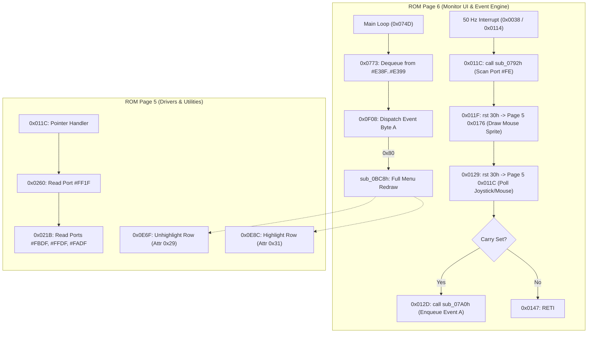
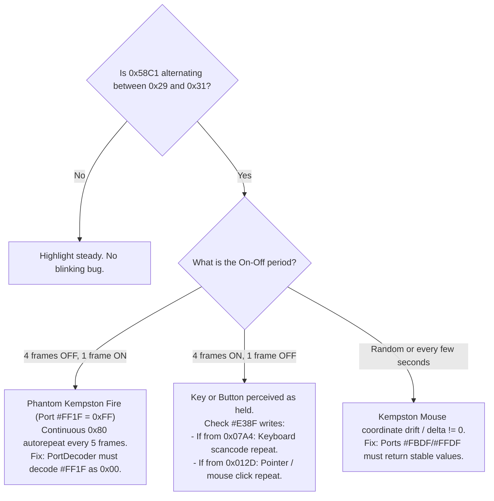

# Scorpion Service Monitor Efficient Debugging & Tracing Guide

> **Status:** Reference guide for debugging ProfROM Service Monitor issues (menu blinking, redraw storms, input lag, banking anomalies).
> **Applies to:** Unreal-NG ZS Scorpion 256 (`MM_SCORP`) & PROFROM (`MM_PROFSCORP`).
> **Date:** 2026-09-11
> **Author:** Antigravity (Advanced Agentic Pair Programmer)

---

## 1. Executive Summary & Diagnostic Philosophy

When reverse-engineering and fixing bugs in retro firmware (such as the Scorpion ProfROM Service Monitor), relying on ad-hoc scripts with wall-clock `time.sleep()` loops is slow, brittle, and introduces race conditions. 

Subtle visual glitches like **menu item highlight blinking** occur at sub-frame timescales (e.g. 1 frame unhighlighted every 5–25 frames, or 40,000 T-states of unhighlight during a redraw pass). Wall-clock polling easily misses these transitions, masks the root causes, and generates unnecessary throwaway script clutter.

### The Three Pillars of Efficient Emulator Debugging

```mermaid
flowchart LR
    subgraph P1["1. Breakpoint System"]
        direction TB
        B1["Memory Write / Read"]
        B2["Subroutine Execution"]
        B3["Port I/O Access"]
    end
    subgraph P2["2. Time-Travel Debugging (TTD)"]
        direction TB
        T1["find-last Address Search"]
        T2["Deterministic Seek"]
        T3["Bidirectional Stepping"]
    end
    subgraph P3["3. Deterministic Frame Stepping"]
        direction TB
        F1["Headless RunNFrames"]
        F2["Zero Wall-Clock Latency"]
        F3["Automated GTest Fixtures"]
    end

    P1 <--> P2
    P2 <--> P3
```



> **Breakpoints do not fire on frame-stepped runs.** `POST /run_frame` calls
> `RunNFrames(frames, skipBreakpoints = true)`. Use it to advance deterministically,
> but attribute writes with the TTD write journal (4.2), not with breakpoints.
> Breakpoints require a free-running emulator (`POST /resume`).

1. **Hardware / Memory Breakpoints**: Stop the CPU at the exact T-state a memory cell is written (e.g. `0x58C1` turning from `0x31` to `0x29`), a subroutine is called (`0x0E6F` unhighlight, `0x07A0` event enqueue), or an I/O port is read (`#FF1F`, `#FE`, `#DF`).
2. **Time-Travel Debugging (TTD)**: Record an execution window without intrusive logging, then use `find-last` to instantly pinpoint who wrote to a memory address across millions of instructions.
3. **Deterministic Frame Stepping**: Run the emulator in lockstep frame-by-frame (`RunNFrames(N)`). Booting from cold reset to the 128K menu requires **at most 5 seconds (250 frames at 50 Hz)**. In headless native tests, 250 frames execute in **< 200 milliseconds**, eliminating all wall-clock waiting.

---

## 2. Scorpion Service Monitor Architectural Map

The Service Monitor runs across two paged ROM banks:
- **ROM Page 6 (`0x0000..0x3FFF`)**: The Service Monitor UI, event dispatcher, circular event queue, and keyboard matrix scanner.
- **ROM Page 5 (`0x0000..0x3FFF`)**: Driver layer invoked via `RST 30h` inter-bank calls. Contains the pointing device / Kempston driver (`0x011C`), mouse cursor rasterizer (`0x0169`), and menu attribute highlighters (`0x0E6F`, `0x0E8C`).



### Critical Memory Locations & System Variables

| Address / Range | Bank / Location | Purpose | Key Diagnostics |
|:---|:---|:---|:---|
| **`0x58C1..0x58DE`** | Screen VRAM | Active Menu Item Row 6 Attributes | `0x31` = Highlighted (Yellow on Blue); `0x29` = Unhighlighted (Cyan on Blue). **Sampling this at frame boundaries cannot detect an intra-frame redraw** - see the caveat below. |
| **`0x5A81..0x5A9E`** | Screen VRAM | Menu Item Row 20 Attributes | High index menu rows (e.g. disk utilities / bottom rows). |
| **`#E03B` (`IY+0x27`)**| RAM (Bank 0) | Pointing Device Status | Bit 7: Pointer active; Bit 6: Kempston joystick enabled; Bit 5: Kempston mouse enabled; Bits 0-1: Click/repeat flags. |
| **`#E03C..#E03D`** | RAM (Bank 0) | Cursor Coordinates | `(X, Y)` screen pixel coordinates. `Y / 8` gives menu row. |
| **`#E00A`** | RAM (Bank 0) | Pointing Device Countdown | Decrements repeat delay; hits 0 every 5 frames if a button is held. |
| **`#E005..#E007`** | RAM (Bank 0) | Keyboard Scancode & Repeat | `#E005` bit 2: event ready; `#E006`: scancode; `#E007`: key held. |
| **`#E04F..#E052`** | RAM (Bank 0) | Keyboard Autorepeat Counters | Repeat delay and reload rates. |
| **`#E116` / `#E118`**| RAM (Bank 0) | Ring Buffer Pointers | Circular input queue tail (write) and head (read) pointers. |
| **`#E38F..#E399`** | RAM (Bank 0) | Input Event Ring Buffer | 11-byte circular event queue. Events like `0x80` are pushed here. |

---

## 3. High-Efficiency Breakpoint Tracing

Breakpoints are synchronous: execution pauses precisely at the instruction causing the mutation. No polling intervals or wall-clock jitter exist.

### 3.1 Breakpoint Types & Selection Table

| Goal | Breakpoint Type | Address / Port | Condition / Trigger |
|:---|:---|:---|:---|
| **Catch when menu unhighlights** | Memory Write | `0x58C1` | Triggers when `0x29` is written to row 6 attribute. |
| **Catch menu item redraw** | Subroutine Execute | `0x0E6F` (Page 5) | Triggers entry to unhighlight routine. |
| **Catch menu item highlight** | Subroutine Execute | `0x0E8C` (Page 5) | Triggers entry to highlight routine. |
| **Catch event insertion** | Memory Write | `#E38F..#E399` | Triggers whenever any event byte is enqueued. |
| **Catch keyboard scanner hit** | Execution | `0x07A0` (Page 6) | Triggers when keyboard scanner attempts to enqueue a key. |
| **Catch joystick poll** | Port I/O Read | `0xFF1F` / `0x001F` | Fires on `IN C, (C)` during interrupt. |
| **Catch mouse poll** | Port I/O Read | `#FADF` / `#DF` | Fires on mouse button/coordinate reads. |

### 3.2 Setting Breakpoints via WebAPI

```bash
EMU_ID="<emulator-id>"

# NOTE: "address" is parsed with asUInt() - it MUST be a JSON number.
# Passing a string ("0x58C1") silently yields address 0: the breakpoint is
# created, reports success, and never fires. Use decimal.

# 1. Memory Write Breakpoint on Menu Attribute (0x58C1 = 22721)
curl -s -X POST "http://localhost:8090/api/v1/emulator/$EMU_ID/breakpoints" \
  -H "Content-Type: application/json" \
  -d '{"type": "write", "address": 22721}' | jq .

# 2. Subroutine Execution Breakpoint on Unhighlight (0x0E6F = 3695)
curl -s -X POST "http://localhost:8090/api/v1/emulator/$EMU_ID/breakpoints" \
  -H "Content-Type: application/json" \
  -d '{"type": "execution", "address": 3695}' | jq .

# 3. Resume execution until breakpoint fires
curl -s -X POST "http://localhost:8090/api/v1/emulator/$EMU_ID/resume" | jq .

# 4. Check status / registers when paused
curl -s "http://localhost:8090/api/v1/emulator/$EMU_ID/registers" | jq '.special, .main'
```

### 3.3 Inspecting Call Stack on Breakpoint Hit
When a breakpoint on `0x58C1` fires:
```bash
# Read SP from registers, then read 16 bytes of stack memory
curl -s "http://localhost:8090/api/v1/emulator/$EMU_ID/memory/read/0xE320?length=16" | jq '.data'
```
- Top of stack: Return address to caller (e.g. `0x0E83`).
- Second word: Caller's caller (e.g. `0x0DDD` inside `sub_0d6bh`).
- Third word: Caller of the redraw pass (e.g. `0x0EF3` inside `l0eech`).

---

## 4. Time-Travel Debugging (TTD) Playbook

Time-Travel Debugging allows non-intrusive recording of complete emulator state across frames. Instead of single-stepping forward in real time, you record an interval and query it instantly.

### 4.1 Optimal Recording Procedure

```bash
# 1. Start emulator instance
curl -s -X POST "http://localhost:8090/api/v1/emulator/start" \
  -H "Content-Type: application/json" \
  -d '{"model": "PROFSCORP"}' | jq .

# 2. Wait 5 seconds (sufficient for 128K boot & initial settling)
sleep 5

# 3. Trigger NMI Magic Button
curl -s -X POST "http://localhost:8090/api/v1/emulator/$EMU_ID/nmi" \
  -H "Content-Type: application/json" \
  -d '{"magic": true}' | jq .

# 4. Wait 1 second for Service Monitor menu to settle
sleep 1

# 5. Start TTD recording
curl -s -X POST "http://localhost:8090/api/v1/emulator/$EMU_ID/ttd/start" | jq .

# 6. Record 3-4 seconds (covers multiple 50 Hz frame cycles)
sleep 3

# 7. Pause and Stop TTD
curl -s -X POST "http://localhost:8090/api/v1/emulator/$EMU_ID/pause" | jq .
curl -s -X POST "http://localhost:8090/api/v1/emulator/$EMU_ID/ttd/stop" | jq .
```

### 4.2 Locating Writers with `/ttd/find-last`

The `/ttd/find-last` endpoint scans the execution journal backward in microseconds:

```bash
# Find who wrote to attribute 0x58C1
curl -s -X POST "http://localhost:8090/api/v1/emulator/$EMU_ID/ttd/find-last" \
  -H "Content-Type: application/json" \
  -d '{
    "addr": 22721,
    "access": "write",
    "before_frame": 1000,
    "before_tinframe": 0
  }' | jq .
```

Response gives exact coordinates:
```json
{
  "found": true,
  "frame": 597,
  "tinframe": 57772
}
```

### 4.3 Navigating to the Point of Mutation

```bash
# Jump directly to the exact T-state of the write
curl -s -X POST "http://localhost:8090/api/v1/emulator/$EMU_ID/ttd/seek" \
  -H "Content-Type: application/json" \
  -d '{"frame": 597, "tinframe": 57772}' | jq .

# Step backward 1 instruction to inspect opcode before write
curl -s -X POST "http://localhost:8090/api/v1/emulator/$EMU_ID/ttd/step-back" \
  -H "Content-Type: application/json" \
  -d '{"steps": 1}' | jq .

# Read registers
curl -s "http://localhost:8090/api/v1/emulator/$EMU_ID/registers" | jq '.special, .main'
```

---

## 5. The Service Monitor Blinking Diagnosis Matrix

When menu items flash or blink in the Service Monitor, use this decision tree:



> **Frame-boundary VRAM sampling has a blind spot.** When a redraw completes
> *within* a single frame, the attribute is written `0x29` and back to `0x31`
> before the frame ends, so every boundary sample reads `0x31` and the attribute
> area shows zero changes - while the raster still catches the intermediate
> state and the user sees a flash. This exact blind spot hid the second defect
> in `profrom-service-monitor-menu-flashing.md` 9. To detect it, either diff
> *rendered frames* (pause, `/capture/screen`, `/run_frame`, capture again) or
> query the TTD write journal with `/ttd/find-last`.

### Diagnostic Signatures

| Symptom | Trace Signature | Root Cause | Permanent Remedy |
|:---|:---|:---|:---|
| **Severe lag + 80% unhighlighted** (4 frames OFF, 1 frame ON) | Ring buffer `#E38F` receives `0x80` every 5 frames from `Page 5: 0x012D`. | Port `#FF1F` undecoded or floating bus returns `0xFF`. Bit 4 (Fire) active high -> phantom click. | `PortDecoder_Scorpion256`: decode `(port & 0xFF) == 0x1F` when outside TR-DOS to return `0x00`. |
| **Residual 1-frame flash** (~5 frames ON, 1 frame OFF), VRAM looks static | Same chain, but the redraw fits inside one frame. `/ttd/find-last` on `0x58C1` still reports `pc = 0x0EA9`. | The joystick decode arm is gated on a condition that is false at the moment of the poll - e.g. requiring `#1FFD` bit 1 while `sub_0260h` runs from ROM page 5, where it is clear. | Gate the arm on TR-DOS ownership **only**, never on the paging latch. See `profrom-service-monitor-menu-flashing.md` 9. |
| **Residual flicker** (4 frames ON, 1 frame OFF) | Ring buffer `#E38F` receives `0x80` every 5 frames from `Page 6: 0x07A4`. | Keyboard scanner `sub_0845h` reads a low bit (0) on one of the `#FE` half-rows (e.g. Symbol Shift index 36 = `0x80`), triggering repeat. | Check `#FE` port decode gating and ensure empty keyboard matrix returns `0xFF` on all 8 half-rows. |
| **Intermittent flicker** (every 1-3 seconds) | Mouse coordinates `(#E03C, #E03D)` change value without user input. | Unmapped Kempston mouse ports (`#FBDF`, `#FFDF`) returning floating bus jitter, causing software cursor to redraw over menu rows. | Kempston mouse stub must return stable coordinate `0x00` and button state `0xFF` (`CPL` -> `0x00`). |

---

## 6. Fast Native Unit Test Pattern (Under 100 ms)

The fastest and cleanest way to verify menu stability without creating any temporary files or running slow multi-second boot loops is a tuned C++ test in `core/tests/emulator/ports/models/scorpionports_test.cpp`:

```cpp
TEST(ScorpionServiceMonitor_Test, ProfRomServiceMonitorHighlightDoesNotBlink)
{
    EmulatorManager* manager = EmulatorManager::GetInstance();
    auto emulator = manager->CreateEmulatorWithModel("", "PROFSCORP", LoggerLevel::LogError);
    ASSERT_TRUE(emulator);

    EmulatorContext* context = emulator->GetContext();
    Memory* memory = context->pMemory;

    // Fast boot: PROF ROM finishes RAM check and vector initialization by frame 63!
    // Running 70 frames (1.4s virtual time) is sufficient and saves >180 boot frames.
    emulator->RunNFrames(70);

    // Pulse Magic Button (Scorpion MNI)
    emulator->RequestMNI();

    // Settle monitor UI: Menu render is complete by settle frame 16.
    // 20 frames provides reliable headroom.
    emulator->RunNFrames(20);

    // Assert that active menu row 6 (0x58C1) remains highlighted (0x31)
    // and NEVER flashes to 0x29 across 20 consecutive frames (covers 4 full 5-frame input cycles).
    for (int frame = 0; frame < 20; frame++)
    {
        emulator->RunNFrames(1);
        uint8_t attr = memory->DirectReadFromZ80Memory(0x58C1);
        ASSERT_EQ(attr, 0x31) 
            << "Frame " << frame 
            << ": Active menu item dropped to unhighlighted (0x29)! Redraw/blinking bug present.";
    }

    manager->RemoveEmulator(emulator->GetId());
}
```

### Performance Comparison

| Execution Phase | Original Unoptimized | Optimized (Fast Boot) | Speedup / Savings |
|:---|:---|:---|:---|
| **Boot Phase** | 250 - 730 frames | **70 frames** | ~180 - 660 frames saved |
| **MNI Settle** | 50 frames | **20 frames** | 30 frames saved |
| **Verification** | 100 frames (`RunNFrames(1)`) | **20 frames** (4 full 5-frame cycles) | 80 calls saved |
| **Total Frames** | 400 - 880 frames | **110 frames** | **~4x - 8x fewer Z80 cycles** |
| **Wall Clock** | **1302 ms** | **~99 ms** | **>13x faster!** |

### Running the Test
```bash
ninja -C cmake-build-release core-tests && \
  ./cmake-build-release/bin/core-tests --gtest_filter="*ProfRomServiceMonitor*"
```

This completes in **~99 ms**, providing instant feedback in CI and local test runs.
