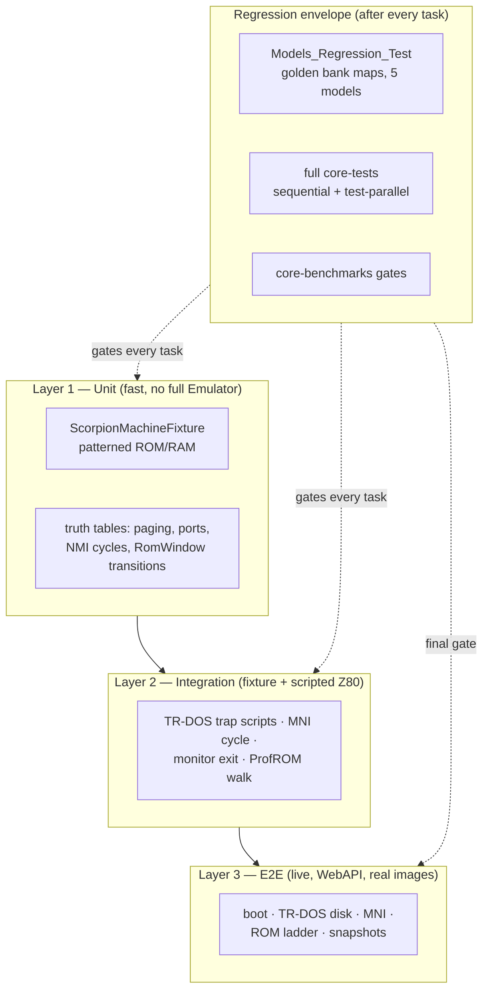

# Scorpion ZS-256 Clone — Testing Plan

> Verification strategy for the tasks in [implementation-plan.md](implementation-plan.md).
> Normative behavior: [hardware-reference.md](hardware-reference.md) (section numbers below,
> "HW §n", refer to it). Module design: [design.md](design.md).

**Layers:** unit truth-table tests → scripted-Z80 integration tests → live E2E boot
verification against real ROM images, wrapped in a golden regression harness that runs
after **every** task, plus performance gates around the memory-read hot path.

---

## 1. Strategy overview



Core rules:

1. **No behavior change for existing models is the invariant.** The golden regression
   (Task 0) runs in every task's verification line; a diff there blocks the task.
2. **Tests are order-independent and shard-safe.** Every file written by a test goes
   through `TestPathHelper::GetUniqueTestScratchPath()` (PID-suffixed) — never a fixed
   shared path (`core/tests/README.md` parallel-execution rules).
3. **Synthetic before real.** Unit/integration tests use patterned synthetic ROM/RAM
   (self-identifying pages, §3.1) so they are hermetic and deterministic; real images
   (`data/rom/scorpion.rom`, `scorp295.rom`, real TRDs) appear only in E2E and in tests
   that skip gracefully when a file is absent.
4. **Conventions:** CUT pattern, `*_test.cpp` naming, mirrored directory layout, fixtures
   clean up in reverse order (`core/tests/README.md`).

---

## 2. Traceability matrix

| HW-ref section | Requirement | Test(s) | Layer | Task |
|---|---|---|---|---|
| §3 | frame 69888T, 224T/line, intstart 1794, intlen 32, no contention | `scorpionraster_test.cpp`, `io_contention_test.cpp` (extended) | Unit | 1 |
| §4.1 | fixed windows `#4000`→5, `#8000`→2 | `scorpionpaging_test.cpp` Table D | Unit | 3 |
| §4.2 | `#7FFD` full semantics + lock scope | `scorpionpaging_test.cpp` Table C, `scorpionports_test.cpp` | Unit | 3-4 |
| §4.3 | `#1FFD` bit map, `#C000` bank assembly, `ram_mask` | `scorpionpaging_test.cpp` Tables A/B | Unit | 3 |
| §4.4 | `#0000` priority chain | `scorpionpaging_test.cpp` Table B | Unit | 3 |
| §5.1 | minimal 64 KB ROM, verified page order (loader role-mapping fix) | `romspace_test.cpp`, `modelsregression_test.cpp` | Unit | 0/2 |
| §5.2 | ProfROM quadrant state machine + masks | `scorpionromwindow_test.cpp` | Unit | 7 |
| §5.3 | `#7EFD` window select, ladder to 2 MB | `scorpionromwindow_test.cpp`, `romdisk_test.cpp` | Unit | 7/8 |
| §5.2, §12.11 | ProfROM quadrant lives in `EmulatorState::profrom_bank` and survives TTD checkpoint/seek | `scorpionromwindow_test.cpp` (residency + TTD cases), `ttd_checkpoint_test.cpp` | Unit | 7 |
| §5.4 | accepted sizes, validation matrix | `romspace_test.cpp`, `romdisk_test.cpp` | Unit | 2/8 |
| §4.4 rule 3, §12.10 | ROM3 at `#0000` while a session is open with `p7FFD[4] = 0` | `scorpionpaging_test.cpp` Table B (B5/B8), `scorpiontrdos_test.cpp` S6 | Unit+Int | 3/5 |
| §4.3, §12.9 | `#1FFD` bit 2 has no effect | `scorpionpaging_test.cpp` B9, `scorpiontrdos_test.cpp` S6b | Unit+Int | 3/5 |
| §6, §12.3 | trap arm rule, unpage, decoder-level FDC gating + monitor-paged exception | `scorpiontrdos_test.cpp` scripts S1-S7, S12; `scorpionports_test.cpp` P11 | Integration | 4/5 |
| §7 | port decode: `#1FFD`/`#7EFD` read `#FF`, `#FF` border, AY mirrors | `scorpionports_test.cpp`, `portdecoder_scorpion256_test.cpp` (existing) | Unit | 4 |
| §8 | border power-on black, `#FF` port | `scorpionports_test.cpp`, `scorpionraster_test.cpp` | Unit | 1/4 |
| §9 | NMI accept cycle, RETN, MNI latch semantics | `nmi_test.cpp`, `scorpionmni_test.cpp` scripts S8-S9 | Unit+Int | 6 |
| §13 | hardware turbo: IN strobe truth table, reset clear, 2× frame composition with host speed | `scorpionports_test.cpp`, `scorpionmachine_test.cpp`; E2E-8 | Unit+Int | 12 |
| — | `.z80` hw=10 round-trip | `z80scorpion_test.cpp` | Unit | 9 |
| — | TTD checkpoint of `p1FFD`-driven state | `ttd_checkpoint_test.cpp` (extended) | Unit | 9 |
| — | debugger bank naming | `scorpionbanknames_test.cpp` | Unit | 10 |
| all | live machine behavior with real images | §6 E2E-1…E2E-7 | E2E | 5/6/8/9/11 |

---

## 3. Unit tests

### 3.1 Test fixture and synthetic memory images (Task 0)

`ScorpionMachineFixture` (`core/tests/emulator/ports/models/scorpionfixture.h`) builds a
real `EmulatorContext` with `Memory`, `ScreenZX`, `Keyboard`, `PortDecoder_Scorpion256`,
`config.mem_model = MM_SCORP` (switchable to `MM_PROFSCORP`), `ramsize` switchable
256/1024, and a **patterned synthetic ROM bundle** instead of a real ROM.

Self-identifying page scheme (fill bytes, so any read answers "which page is mapped?"):

| Region | Page n fill byte | Range |
|---|---|---|
| RAM page n (0-63) | `0x40 \| n` | `0x40`-`0x7F` |
| ROM page k (0-127) | `0xC0 \| k` | `0xC0`-`0xFF` |

ROM bundle layout = the verified shipped order **BASIC128 / 48K / Service / TR-DOS**
(ROM pages 0-3 — hardware-reference §5.1; the `rom.cpp` mapping is corrected to this
order in Task 2: `page0→base_128_rom … page3→base_dos_rom`). For ProfROM tests the
generator emits N quadrants; each quadrant repeats the 4-page set with tags of its own
pages.

Fixture helpers: `WritePort(port, value)` (through `DecodePortOut`), `ReadPort(port)`,
`BankTag(window)` (reads a fill byte through the Z80-visible window and returns the page
id), `RunFrames(n)`, `RunTStates(n)`, `LoadSyntheticRom(quadrants)`, `SetModel(...)`.

Logical ROM role names used by all assertions (HW §5.1): **ROM0** BASIC 128, **ROM1**
48K BASIC, **ROM2** Shadow Service Monitor, **ROM3** TR-DOS — internally the codebase's
`base_sys_rom`/`base_dos_rom`/`base_128_rom`/`base_sos_rom` pointers (HW §5.1 gives the
one verified page order; the fixture tags make assertions layout-independent).

### 3.2 Golden regression harness (Task 0)

`core/tests/emulator/memory/modelsregression_test.cpp`: for each model in
{48K, 128K, +3, Pentagon128, Profi} runs a scripted sequence of `#7FFD` (plus `#1FFD` /
`#DFFD` where the model has one) writes and snapshots, per step:

```text
GoldenRow { model, stepIndex, portWritten, value,
            bank0Target, bank1Target, bank2Target, bank3Target }   // target = page id
```

Targets: RAM pages `0..63`; for bank 0 the ROM role as `R128 / R48 / SRV / DOS / SRV3`
(+3 bank 0 special-cased). Golden rows are **committed in the test file** (not on
filesystem) and asserted with per-row failure messages
`StringHelper::Format("model %s step %d", …)`.

Sequences per model (from the existing decoder semantics — captured *before* any
production change):

| Model | Sequence |
|---|---|
| 48K | (no paging writes; one control frame) |
| 128K | `#7FFD`: 0x00, 0x01, …, 0x07 (banks), 0x08 (screen), 0x10 (ROM1), 0x30 (lock), 0x00 (locked → ignored) |
| +3 | as 128K plus `#1FFD`: 0x00/0x01/0x04/0x05 after each `#7FFD` bank step |
| Pentagon128 | `#7FFD` sweep incl. bit 7:6 RAM extension bits 0x40, 0x80, 0xC0 |
| Profi | `#DFFD` sweep 0x00-0x0F interleaved with `#7FFD` |

### 3.3 Timing & video (Task 1) — `scorpionraster_test.cpp`

Data-driven over `{MM_SCORP, MM_PROFSCORP}`; assert each row:

| Field | Expected |
|---|---|
| `frame` | 69888 |
| `t_line` | 224 |
| `intstart` | 1794 |
| `intlen` | 32 |
| `contentionEnabled` | `false` |
| `fetchType` | `ULA_DISCRETE_LOGIC` |
| `borderUpdateTStates` | 1 |

Plus: `io_contention_test.cpp` gains Scorpion cases (fetch-phase pattern for
`ULA_DISCRETE_LOGIC`, no wait states for `#4000`-area access) — the file already
documents the mode in its header comment; the new cases make it executable. Border
power-on black asserted via fixture (`GetBorderColor() == 0` after `reset()`).

### 3.4 ROM space (Task 2) — `romspace_test.cpp`

- `MM_PROFSCORP`: synthetic 2 MB bundle loads; `MM_SCORP`: 128 KB bundle rejected
  (`MLOGERROR`, load result `false`).
- Page host addresses `0..127` pairwise distinct; `ROMBase()` unchanged identity.
- `base_*_rom` pointers land inside quadrant 0 for a 256 KB image.
- Shared-memory consumers (`sharedmemory_test.cpp`) still green after the
  `MAX_ROM_PAGES` bump.

### 3.5 Paging truth tables (Task 3) — `scorpionpaging_test.cpp`

Driven directly through `WritePort` where Task 4 has landed, otherwise via
`state.p7FFD/p1FFD` + `UpdateZ80Banks()` (decoder integration re-covered in §3.6).

**Table A — `#C000` bank assembly** (`bank = p7FFD[2:0] | p1FFD[4]<<3 | p1FFD[7:6]<<4`):

| # | p7FFD[2:0] | p1FFD[4] | p1FFD[7:6] | bank @1024K | bank @256K (`ram_mask`=15) |
|---|---|---|---|---|---|
| A1 | 0 | 0 | 00 | 0 | 0 |
| A2 | 7 | 0 | 00 | 7 | 7 |
| A3 | 0 | 1 | 00 | 8 | 8 |
| A4 | 7 | 1 | 00 | 15 | 15 |
| A5 | 0 | 0 | 01 | 16 | **0 (clamped)** |
| A6 | 3 | 1 | 01 | 27 | **11 (clamped)** |
| A7 | 5 | 0 | 11 | 53 | **5 (clamped)** |
| A8 | 7 | 1 | 11 | 63 | **15 (clamped)** |

Asserted via `BankTag(0xC000) == fill-byte` of the expected page. Negative row: writes
to `#C000` land in the *expected* RAM page when two latch combinations alias after
clamping (A5 vs A1 must read back the same page).

**Table B — `#0000` priority chain** (HW §4.4):

| # | p1FFD | p7FFD[4] | session | expected `#0000` | writable |
|---|---|---|---|---|---|
| B1 | 0x00 | 0 | — | ROM0 | no |
| B2 | 0x00 | 1 | — | ROM1 | no |
| B3 | 0x02 | 0 | — | ROM2 Service | no |
| B4 | 0x02 | 1 | — | ROM2 (Service outranks ROM1) | no |
| B5 | 0x00 | 1 | open (trap) | ROM3 (session) | no |
| B6 | 0x01 | any | — | **RAM bank 0** | **yes** (write-read roundtrip) |
| B7 | 0x03 | any | — | RAM bank 0 (bit 0 outranks Service) | yes |
| B8 | 0x00 | 0 | open (trap) | **ROM3 — not the service ROM** (HW §4.4 rule 3; the generic `SetROMSystem()` arm would give ROM2) | no |
| B9 | 0x04 | 0 | — | ROM0 (`#1FFD` bit 2 ignored — HW §12 item 9); no session opened | no |

**Table C — `#7FFD` lock semantics:**

| # | Action | Expectation |
|---|---|---|
| C1 | `OUT #7FFD,30h` | applies fully: ROM1 + lock latched |
| C2 | then `OUT #7FFD,01h` | ignored (bank/screen/ROM unchanged) |
| C3 | then `OUT #1FFD,10h` | **still applies** (lock scopes to `#7FFD` only) |
| C4 | then MNI button | ROM at `#0000` swaps to page 3 anyway (DD50.1 trigger hardware, not a port write — the lock scopes to `#7FFD`); `#1FFD` itself unchanged (reworked model, HW §9) |

**Table D — fixed windows:** under every Table A/B row, `BankTag(0x4000) == 5` and
`BankTag(0x8000) == 2`.

### 3.6 Port decode (Task 4) — `scorpionports_test.cpp`

| # | Case | Expectation |
|---|---|---|
| P1 | `OUT #1FFD,02h` | ROM2 at `#0000` |
| P2 | `OUT #1FFD,10h` | bank 8 at `#C000` |
| P3 | `IN (#1FFD)` | returns `0xFF`, `wasDecoded`, **no "no peripheral" warning** (log-sink assertion) |
| P4 | `IN (#7FFD)` / `IN (#7EFD)` | `0xFF`; `#7EFD` decoded only on `MM_PROFSCORP` |
| P5 | `OUT (#FF),02h` outside session | border = 2 (`Screen::GetBorderColor`) |
| P5b | **`OUT (#FF),A` via the `OUT (n),A` form** (port seen as `#nnFF`, e.g. `#02FF`) | border still set — proves the arm matches the low byte, not `port == 0x00FF` (design §5) |
| P6 | `OUT (#FF),xxh` inside DOS session | FDC system port receives it; border unchanged |
| P7 | `OUT #FF05,reg` | AY selected (mirror decode regression) |
| P8 | `reset()` | `p1FFD == 0`, `p7EFD == 0`, border black |
| P9 | `SetRAMPage(11)` (debug sync) | latches reflect bank 11 (`p7FFD=3`, `p1FFD=0x10`) |
| P10 | `SetROMPage(service)` | `p1FFD & 0x02` set, `#0000` = ROM2 |
| P11 | `IN (#1F)` / `IN (#FF)` with `CF_TRDOS` and `p1FFD[1]` clear | undecoded (`disp.wasBeta128Gated`), floating-bus value — same contract as `PortDecoder_Pentagon128`; with `CF_TRDOS` set (or `p1FFD[1]` set, HW §12.3) → FDC status / system port |

Port-trace attribution: `Memory_7EFD` and `Border_FF` device ids appear in a recorded
trace for P4/P5 (`porttrace` export — follow the existing `Memory_1FFD` test pattern).

### 3.7 NMI (Task 6) — `nmi_test.cpp` (model-agnostic Z80 core)

| # | Case | Expectation |
|---|---|---|
| N1 | request at instruction boundary | old PC pushed, `PC = 0x0066`, `IFF1 = 0`, `IFF2 = old IFF1` |
| N2 | `RETN` at handler end | `IFF1 = IFF2`, `nmi_in_progress = false`, PC restored |
| N3 | NMI while `IFF1 = 0` | still accepted (non-maskable) |
| N4 | NMI during `HALT` | HALT exits, handler entered |
| N5 | NMI and INT pending together | NMI wins at the boundary; INT serviced at the next boundary |
| N6 | double request before boundary | coalesces to a single NMI |

### 3.8 ProfROM window (Task 7) — `scorpionromwindow_test.cpp`

Pure-logic tests (no context) plus fixture-backed ones:

- **Full 4×4 transition table** (HW §5.2) — data-driven over 16 cells, asserting
  `GetQuadrant()` after each `OnRomRead`.
- **Masks:** 128 KB image (mask 1): from Q1 read `#0003` → table Q2 → **masked to Q0**;
  256 KB image reaches Q3.
- **Boot stability:** Q0 + read `#0000` ×1000 → still Q0 (reset fetch transparency).
- **`#7EFD` select:** 1 MB image, `OUT (#7EFD),10h` → effective quadrant 4 → base = ROM
  page 16; state machine low bits still walk inside the window.
- **2 MB extension bit:** debug/API bit reaches quadrants 16-31 (pages 64-127); default 0.
- **`MM_SCORP` inertness:** reads of `#0100-#010F` never remap; `CF_PROFROM` never set.
- **Hold-row transparency golden:** reads of `#0100-#0103` (the `S=0` row) leave the
  machine in its current quadrant — asserted as `OnRomRead` sequences from every
  starting quadrant (this is what keeps the plane-ID read of `#0101` side-effect
  free).
- **Any-read requirement:** every CPU read of the block (M1 fetch and operand alike)
  drives the machine — a dedicated case reads `#0104-#0107` through all four A0/A1
  offsets and asserts identical transitions plus post-switch operand bytes
  (mid-instruction remap, design §4.3).
- **Reset:** quadrant 0, window 0 after `Reset()` / ROM reload.
- **State residency:** after every transition `EmulatorState::profrom_bank == Quadrant()`;
  `ScorpionRomWindow` holds no quadrant of its own (design principle 5).
- **TTD round-trip:** walk Q0→Q2, checkpoint, walk on to Q3, seek back → `#0000` shows
  the Q2 tag; two states with identical port latches but different `profrom_bank` hash
  differently in `MachineStateHash` (`ttd_checkpoint_test.cpp` / `machine_state_hash`
  tests). Also: a `.ttd` recorded before the layout change is rejected with the
  size-mismatch error, not misread.
- **Read-path integration:** `_scorpProfromActive == false` reads of `#0000` on
  `MM_SCORP`/`MM_PROFSCORP` are byte-identical to pre-hook behavior (golden).

### 3.9 ROM-disk ladder (Task 8) — `romdisk_test.cpp`

For each size class {64K, 128K, 256K, 512K, 1M, 2M} (fixtures from
`tools/python/makeromdisk.py`; 64K/128K committed under `testdata/romdisk/`, larger
generated into `scratch/` per-process):

- loads without error on `MM_PROFSCORP`;
- boots (fixture `RunFrames`, Q0 serviceable reset);
- quadrant reachability: every quadrant's tag page can be exposed at `#0000` through
  window select + strobe walk;
- write-protection: writes to `#0000-#3FFF` while a ROM page is mapped never modify ROM
  area bytes;
- `MM_SCORP` rejects every size except 64 KB (error message names the accepted ladder).

### 3.10 Snapshots (Task 9) — `z80scorpion_test.cpp`

Round-trip matrix (build state → save `.z80` → fresh context → load → assert):

| Build state | Format | Asserted after load |
|---|---|---|
| bank 11 at `#C000` (`p7FFD=3`, `p1FFD=0x12`), shadow screen, distinctive CPU regs | v3 | bank targets, `p7FFD`/`p1FFD`, screen bank, CPU regs |
| same | v2 | bytes 35/36 carry `p7FFD`/`p1FFD`; page blocks numbered per the `.z80` convention — page `n` = RAM bank `n − 3` (pages 3-18), never 0-based |
| 1024K config, bank 63 at `#C000` | v3 | all 64 pages present, bank 63 target |
| service ROM active (`p1FFD=2`) | v3 | `#0000` = ROM2 after latch replay |
| SNA save request | — | explicit error naming the format ceiling |
| ProfROM machine at quadrant 2 | v3 | save logs a warning; load resets to quadrant 0 (no slot in the format — HW §12 item 11) |
| Scorpion snapshot loaded into a Pentagon instance | v3 | loads in place with a model-mismatch warning, pages clamped by the running model's RAM (mirrors hw=9 handling — no model switch exists) |

TTD: checkpoint taken in MNI state (`p1FFD=0x02`) → seek before/after → service window
restored (`ttd_checkpoint_test.cpp` extension).

### 3.11 Bank naming (Task 10) — `scorpionbanknames_test.cpp`

Truth table for `DumpMemoryBankInfo`/`GetCurrentBankName` per HW §5.1 roles:
"ROM0 BASIC128", "ROM1 48K", "ROM2 Service (Q*n*)", "TR-DOS", "RAM bank *n*" —
including the ProfROM quadrant suffix.

### 3.12 Hardware turbo (Task 12) — `scorpionports_test.cpp` + `scorpionmachine_test.cpp`

Layer 1 — decoder truth table (HW §13; `PortDecoder_Scorpion256`, so both models):

| # | Case | Expectation |
|---|---|---|
| U1 | `IN #7FFD` / `#7EFD` / `#5FF5` (set-family mirrors) | `scorpion_turbo == 1` |
| U2 | `IN #1FFD` / `#3FFD` (clear-family mirrors) | `scorpion_turbo == 0` |
| U3 | `IN` on keyboard half-rows, AY `#FFFD`/`#BFFD`, Beta128 `#xx1F`/`#xxFF`, `#xxFE` | flip-flop unchanged (probed in **both** prior states) |
| U4 | `IN #1FFD` / `#7FFD` return values | still `#FF` — the strobe is a side effect only, write-only registers read open bus exactly as before the hook |
| U5 | `reset()` | flip-flop cleared — machine always comes up at 3.5 MHz |

Layer 2 — machine integration (`scorpionmachine_test.cpp`, scripted Z80 via fixture):

| # | Case | Expectation |
|---|---|---|
| M1 | scripted `LD BC,#7FFD` / `IN A,(C)` / `JR $` executed by the real CPU | strobe fires through `Z80::in → DecodePortIn` — the guest-exclusive path (debugger/API reads never clock the flip-flop) |
| M2 | flip-flop vs `Z80FrameCycle` frame length | set → `current_z80_frequency_multiplier` 2 (frame 139776T, INT window scaled — interrupt rate stays 50 Hz); clear → back to 1 |
| M3 | host speed × turbo composition | `next` 4 + turbo → applied 8; turbo off → 4 — host intent preserved, guest code cannot clobber the speed menu |

---

## 4. Integration tests — scripted Z80 programs

All scripts are hand-assembled byte strings placed in RAM (usually `#8000`, bank 2) and
executed via the fixture (`RunTStates` with a completion breakpoint at a sentinel, using
`EmulatorTestHelper::SetupExecutionBreakpoint`). Port-write idiom used throughout
(`OUT (C),A` puts the full BC on the bus — partial-decode safe):

```text
LD BC,#7FFD   01 FD 7F        LD BC,#1FFD   01 FD 1F
LD A,#nn      3E nn           LD A,#nn      3E nn
OUT (C),A     ED 79           OUT (C),A     ED 79
```

| # | Script | Bytes (at #8000) | Verifies | Expectation |
|---|---|---|---|---|
| S1 | arm-from-ROM1 | `01 FD 7F 3E 10 ED 79 CD 9D 3D` (select ROM1, `CALL #3D9D`) | HW §6 arm rule | session opens on the `#3Dxx` fetch; `#0000` shows ROM3 tag |
| S2 | arm-from-Shadow | `01 FD 1F 3E 02 ED 79 CD 9D 3D` | HW §6 | session opens from ROM2 window |
| S3 | **no**-arm-from-ROM0 | `01 FD 7F 3E 00 ED 79 CD 9D 3D` | HW §6 | plain `CALL`, **no** session (`#0000` still ROM0) |
| S4 | **no**-arm-with-RAM0 | `01 FD 1F 3E 01 ED 79 CD 9D 3D` | HW §6 | no session; RAM bank 0 stays at `#0000` |
| S5 | unpage | (in session) `C3 18 80`, sentinel code at `#8018` | HW §6 | session closes on RAM execution; `#0000` back per `p7FFD` |
| S6 | ROM3 under session | (session open from S1) `01 FD 7F 3E 00 ED 79` — select ROM0 while the session is open | HW §4.4 rule 3 | `#0000` **still ROM3** (the generic path would page the service ROM) |
| S6b | bit 2 inert | `01 FD 1F 3E 04 ED 79` outside a session | HW §12.9 | no session, `#0000` unchanged, `CF_TRDOS` clear |
| S7 | FDC visibility | `DB 1F` (IN A,(#1F)) + `01 FF 00 3E 02 ED 79`-style border write, both in and out of session | HW §7 | `IN (#1F)`: FDC status only in session; `OUT (#FF)` colors border only **outside** session |
| S7b | `#FF` decode width | `3E 02 D3 FF` (`LD A,2` / `OUT (#FF),A` — port reaches the decoder as `#02FF`) outside a session | design §5 | border = 2; a decoder using an exact `port == 0x00FF` match fails this and passes S7 |
| S8 | MNI cycle | host triggers MNI; synthetic ROM2 at `#0066`: `01 FD 1F 3E 10 ED 79 C9` (restore `p1FFD=0x10`, RET) | HW §9 | PC→`#0066` from ROM2; after RET, `#0000`=ROM0 and `#C000` still bank 8 |
| S9 | MNI preserves banking | pre-write signature at `#C000` (bank 8), trigger MNI, read `#C000` inside monitor | HW §9 | signature intact while service ROM paged |
| S10 | ProfROM walk | `3A 03 00 3A 01 00 3A 00 00` (LD A,(#0003/#0001/#0000)) with service window active | HW §5.2 | quadrant transitions per the 4×4 table, observed via `#0000` tags |
| S11 | monitor exit | `01 FD 1F 3E 00 ED 79` | HW §9 | `#0000` returns to ROM0/ROM1 per `p7FFD[4]` |
| S12 | FDC gating contract | `DB 1F` reads in/out of session, with `p1FFD=02h` (monitor paged, session closed), and `OUT (#FF)` routing | HW §7/§12.3 | outside session: `#1F` undecoded (floating bus); monitor-paged: `IN (#1F)` **still answers FDC status**; `OUT (#FF)` colors border only outside session |

S1-S7 (incl. S6b) and S12 live in `scorpiontrdos_test.cpp` (Task 5), S8-S9/S11 in `scorpionmni_test.cpp`
(Task 6), S10 in the ProfROM integration case (Task 7). Every script also runs against
the 128K/Pentagon fixtures where meaningful to prove no cross-model leakage (S1 on
128K must behave exactly as the golden dump says).

---

## 5. Regression strategy

- **Per task** (the verification line of each task in implementation-plan.md):
  ```bash
  ninja -C cmake-build-release && \
  ./cmake-build-release/bin/core-tests --gtest_filter="*<TaskFilters>*:*ModelsRegression*"
  ```
- **Before suggesting any commit:** full suite, sequential:
  `./cmake-build-release/bin/core-tests` — zero failures, zero new warnings in build log.
- **At milestones (Tasks 4, 7, 9, 11):** `cmake --build cmake-build-release --target test-parallel`
  to prove shard isolation of the new files.
- **Golden discipline:** `modelsregression_test.cpp` goldens are captured once (Task 0)
  and never edited to "make it pass" — a mismatch means a real behavior change in an
  existing model and blocks the task.

---

## 6. E2E — live boot verification (WebAPI)

Runs the real emulator binary with real images; performed at Task 5 (E2E-2), Task 6
(E2E-3), Task 8 (E2E-4/5), Task 9 (E2E-6) and all of them at Task 11. Record every
transcript under `scratch/e2e/` (`curl … | tee`).

### 6.0 Common harness preamble (per AGENTS.md)

```bash
pkill -9 unreal-qt 2>/dev/null || true; sleep 1
lsof -i :8090 2>/dev/null && echo "PORT BUSY" || echo "port free"
./cmake-build-release/bin/unreal-qt.app/Contents/MacOS/unreal-qt &   # macOS path
sleep 4
curl -s http://localhost:8090/api/v1/emulator | jq .                  # health
EMU_ID=$(curl -s -X POST http://localhost:8090/api/v1/emulator/start \
  -H "Content-Type: application/json" -d '{"model":"SCORPION"}' | jq -r .id)
# cleanup when done:
# pkill -9 unreal-qt
```

Available real assets (in-repo): `data/rom/scorpion.rom` (64K, signature-validated),
`data/rom/scorp295.rom` (64K v2.95 build), `data/rom/scorp_prof401.rom`
(**512K, 8 quadrants — the ProfROM/ROM-disk image**),
`testdata/loaders/trd/Satisfaction.trd`, `testdata/loaders/trd/zx-format8.trd`.

### E2E-1 — Cold boot to BASIC 128

> **Executed 2026-09-08 — PASS.** See [verification/e2e-base-rom.md](verification/e2e-base-rom.md).

- **Preconditions:** `scorpion.rom` configured for the SCORPION instance.
- **Procedure:** harness preamble → run ~2 s (≈120 frames) → `GET /emulator/$EMU_ID`
  (timing fields) → screenshot API → memory read of sysvars (`#5C00` area).
- **Pass criteria:** frame = 69888T reported; boot banner "1993 Scorpion ZS 256" visible
  on screenshot (`GET …/capture/screen`) or asserted via `GET …/capture/ocr`;
  `ERR_NR`-class sysvars show BASIC ready; border black at power-on.

### E2E-2 — Boot menu → TR-DOS session with a real disk

> **Executed 2026-09-08 — PASS (all 4 criteria).** A Beta128 mirror-port decode bug
> was found and fixed live during this run. See [verification/e2e-base-rom.md](verification/e2e-base-rom.md).

- **Preconditions:** SCORPION instance; `Satisfaction.trd` inserted (config or disk API).
- **Procedure:** boot to menu → keyboard event selecting the TR-DOS/menu entry (or run
  `RANDOMIZE USR 15616` via keyboard) → observe session open → type `CAT` + Enter →
  screenshot; also verify the unpage path by loading any file (its loader ends in
  `JP #8018`-class RAM execution).
- **Pass criteria:** TR-DOS prompt reached **via the trap** (port/state inspection shows
  session flag set from a `#3Dxx` fetch, not a force); `CAT` lists the disk catalog;
  after a file load, the session closes and `#0000` returns to BASIC ROM; FDC port
  reads during the session return non-`0xFF` status.

### E2E-3 — MNI button

> **Executed 2026-09-08 — PASS** against the superseded latch model (`p1FFD |= 0x02`).
> **Reworked 2026-09-10** to the DD50 trigger model (HW §9,
> [profrom-nmi-boot-analysis.md](profrom-nmi-boot-analysis.md)) — the procedure/criteria
> below are the corrected ones; re-run pending.

- **Procedure:** in BASIC, write a signature into `#C000` area (bank via `#1FFD`) →
  `POST /api/v1/emulator/$EMU_ID/nmi {"magic": true}` → screenshot (Shadow Monitor
  menu — reached through the firmware chain: TR-DOS `#0066` → … → `OUT (#1FFD),#12` at
  `#0033`) → memory/state inspection (`#0000` = service window **after the chain**,
  `scorpionDosTrigger` released) → exit via the monitor's own exit command (keyboard).
- **Pass criteria:** monitor screen visible; `p1FFD` **unchanged by the button itself**
  (bit 1 set only by the firmware's own `OUT`, bit 4/6-7 preserved); plane register
  unchanged; after exit, BASIC resumes with the `#C000` signature intact. In a tool
  plane (planes 1-3) the button parks: border stripes, PC in the `#0066` loop, no exit.
  The original 2026-09-08 record: [verification/e2e-base-rom.md](verification/e2e-base-rom.md).

### E2E-4 — ProfROM quadrant switching (real 512K image)

> **Executed 2026-09-09 — PASS** (quadrant transitions observed via a debugger-driven
> probe routine instead of keyboard menu navigation; Q0-stable across 3 cold
> restarts). See [verification/e2e-profrom-quadrants.md](verification/e2e-profrom-quadrants.md).

- **Preconditions:** `PROFSCORP` model; ROM image = `scorp_prof401.rom` (512 KB, 8
  quadrants), selected via the config ROM path (INI key `PROFROM` — gap-analysis §1);
  note `MM_PROFSCORP` model creation only works from Task 7 onward (decoder dispatch
  lands there).
- **Procedure:** boot (Q0) → enter the ROM's service software (keyboard) → navigate the
  ROM-disk menu to content in another quadrant → launch it.
- **Pass criteria:** quadrant transitions observed (port-trace export or memory tags at
  `#0000` across the walk); boot remains Q0-stable across ≥3 cold restarts; no
  contention/timing regressions visible (audio/video smoothness).

### E2E-5 — ROM-disk ladder (synthetic large images)

- **Procedure:** `tools/python/makeromdisk.py` builds 1 MB and 2 MB patterned images
  (base = `scorpion.rom`) into `scratch/` → boot `PROFSCORP` with each → select windows
  via `#7EFD` writes (debug port-write surface / Alt-M; until that Task 10 surface
  lands, drive the `OUT (#7EFD),n` script with the existing `POST …/memory/write` +
  `POST …/run_tstates` endpoints) → read `#0000` tags via `GET …/memory/read`.
- **Pass criteria:** every quadrant of every size reachable and stable; window select
  inert on `MM_SCORP`; 2 MB needs the documented debug/API extension bit for quadrants
  16-31 (default 0).

### E2E-6 — Snapshot round-trip, live

- **Procedure:** build a distinctive state (bank 11, shadow screen, running program) →
  save `.z80` via API → stop instance → new SCORPION instance → load the snapshot →
  compare bank map + sysvars + screenshot.
- **Pass criteria:** byte-identical RAM pages, same port latches, screen resumes where
  saved; SNA save attempt returns the documented error.

### E2E-7 — 1024 KB RAM configuration

> **Executed 2026-09-09 — PASS** (1024 KB reachability + 256 KB clamp, on the
> PROFSCORP variant). See [verification/e2e-profrom-instantiation.md](verification/e2e-profrom-instantiation.md).

- **Procedure:** SCORPION with `"ram_size": 1024` in the `POST /emulator/start` body
  (supported via `CreateEmulatorWithModelAndRAM`) → OUT-script selects banks 16,
  32, 63 at `#C000` → tag reads.
- **Pass criteria:** banks 16-63 reachable and writable; 256K config clamps the same
  writes per Table A.

### E2E-8 — Hardware turbo discriminator (both Scorpion models)

> **Executed 2026-09-09 — PASS** on PROFSCORP/1024K and SCORPION/256K.
> Script: `scratch/e2e-profrom-boot/pass29.py`.

- **Procedure:** pause → inject a `LD BC,#7FFD` / `IN A,(C)` / `JR $` stub at `#8000`
  (`POST …/memory/write` + `PUT …/registers/PC`) → run → measure frames crossed by a
  fixed 139776-T `POST …/run_tstates` via the `flash_cycle_position` probe
  (`GET …/state/screen/flash`, median of 3); repeat with the `#1FFD` clear stub.
- **Pass criteria:** 2 frames at 3.5 MHz / 1 frame at 7 MHz per phase, on both models —
  also proves the `run_tstates` path honors a multiplier queued while paused (this is
  the E2E that caught the missing apply in `Emulator::RunTStates`).

---

## 7. Performance gates

New benchmarks (Task 7, `core/benchmarks/emulator/memory/scorpionpagingbenchmark.cpp`,
following the `BENCHMARK()` patterns in `core/benchmarks/`):

| Benchmark | What it measures | Gate |
|---|---|---|
| `BM_ScorpionPagingStorm` | alternating `#7FFD`/`#1FFD` writes → `UpdateZ80Banks()` (direct latch path and full `DecodePortOut` path), ns/op | no baseline exists — recorded at Task 7 as the baseline |
| `BM_ScorpionRomReadPath` | `MemoryReadFast` sweep `#0000-#FFFF` with `_scorpProfromActive=false` (the hook's guard cost) | ≤ 5% slower than the same sweep on `MM_128K` at the same commit |
| `BM_FrameCostNormal` / `BM_FrameCostTurbo` (existing) | whole-frame cost | ±5% of the pre-task baseline |

Methodology:

```bash
./cmake-build-release/bin/core-benchmarks \
  --benchmark_filter='Scorpion|FrameCost' \
  --benchmark_repetitions=3 --benchmark_out=scratch/bench-<task>.json
```

Median of 3 repetitions, same machine, otherwise-idle; baselines recorded per task into
`scratch/` and compared before the task's suggested commit (Task 11 re-checks all).

---

## 8. Quality gates and cadence

| Gate | When | Contents |
|---|---|---|
| G1 task | end of every task | build (zero warnings) + task filter green + `*ModelsRegression*` green |
| G2 commit | before suggesting any commit | G1 + **full** `core-tests` sequential pass |
| G3 parallel | Tasks 4, 7, 9, 11 | `test-parallel` green (shard isolation) |
| G4 performance | Tasks 7, 11 | §7 benchmark deltas within gates |
| G5 E2E | Task 11 (spot runs earlier) | E2E-1…E2E-8 transcripts under `scratch/e2e/`, all pass criteria met |
| G6 docs | Task 11 | all cross-references in this directory + new `docs/features/scorpion-zs256.md` resolve; README tables updated |

Build warning policy is the project-wide zero-warnings rule; any new warning in any
compiler blocks the gate regardless of test status.

---

## 9. Test data and artifact management

| Artifact | Location | Notes |
|---|---|---|
| Patterned 64K/128K ROM fixtures | `testdata/romdisk/` (committed) | generated by `tools/python/makeromdisk.py`, regenerated deterministically |
| Larger synthetic images (256K-2M) | `scratch/` at test time | never committed; per-process unique names via `GetUniqueTestScratchPath()` |
| Real ROMs | `data/rom/` | already in-repo: `scorpion.rom` (64 KB), `scorp295.rom` (64 KB), `scorp_prof401.rom` (512 KB, 8 quadrants) |
| Real TRD disks | `testdata/loaders/trd/` | read-only mounts in tests |
| External ProfROM images (other versions) | user-supplied, never committed | E2E cases depending on them **skip with a logged reason** when absent |
| E2E transcripts, benchmark outputs, log captures | `scratch/e2e/`, `scratch/` | disposable evidence, referenced from task notes |

---

## 10. Exit criteria (definition of done)

- [ ] All tasks in implementation-plan.md checked, each with G1/G2 evidence.
- [ ] Golden regression unmodified since Task 0 capture and green.
- [ ] Full suite green sequential **and** via `test-parallel`.
- [ ] Zero warnings on the local toolchain (CI covers gcc/clang/mingw/msvc).
- [ ] §7 benchmark gates met; baselines archived in `scratch/`.
- [ ] E2E-1…E2E-8 executed with transcripts; pass criteria all met.
- [ ] Coverage matrix (§2) has no empty test cells; every HW §12 divergence item is
      either covered by a test or listed as a documented limitation in the permanent doc.
- [ ] `docs/features/scorpion-zs256.md` published; this directory marked for archival
      per `docs/inprogress/README.md` lifecycle.
