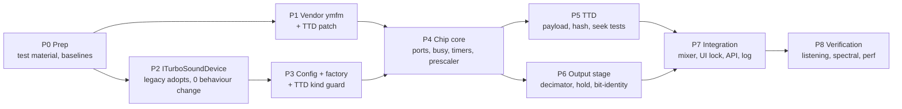

# TSFM — Implementation Plan

**Design:** [tsfm-tdd.md](tsfm-tdd.md) rev. 2. **Behaviour:** [hardware-reference.md](hardware-reference.md).

**Rules for every phase:**
- Each phase is a self-contained change.
- The full core test suite stays green at the end of each phase (~5.5 min, 996+ tests).
- The phase **gate** must pass before the next phase starts.
- No commits without an explicit ask.

P1 and P2 can run in parallel.

---

## P0 — Preparation (no production code)

| Task | Detail |
|---|---|
| Test material | **Done 2026-09-12** (user approved). `testdata/sound/tsfm/`: `TFMWORKS.SCL`, `TSFM-EL.TAP` (~100 TFC tunes + player), `AYtest_v0.2.{scl,tap}` (TurboSound-only test, no FM: a regression check that TSFM behaves as TurboSound), plus five zxart TSFM releases: DiHalt 2007 compo pack, Sonic 3D #13 (RE_TFD player with source), Husmann 2010, Happy New Year (smallest single-tune case), Black-White Demo. Links, hashes and how FM use was verified are in `SOURCES.md`. Every TFM player tried stalls in its busy-wait loop on the current TurboSound, so these double as busy-flag regression tests. |
| Player harness | **Done 2026-09-12.** `core/tests/_helpers/tsfmplayerharness.{h,cpp}` pokes `_tsfmplaye`@25000 + `lnxdata`@31000 + a tune@32768 into Pentagon RAM and runs the player's own main loop; entry points and port protocol recorded in [verification/player-entry-points.md](verification/player-entry-points.md). Validated by `core/tests/emulator/sound/tsfm/tsfm_player_harness_test.cpp` (on the legacy device the player deterministically parks in the WaitStatus poll during init's chip-reset — expected; full playback assertions belong to P4). Used by P4, P5 and P8. |
| Baselines | **Done 2026-09-12.** `core/benchmarks/emulator/sound/turbosound_frame_benchmark.cpp`: idle 826 µs, player-load 1035 µs, player-load turbo 123 µs per frame — recorded in [verification/perf-baseline.md](verification/perf-baseline.md). |
| Scratch | All temporary outputs go in `scratch/` and are cleaned up. |

**Gate:** material and harness exist; baseline numbers recorded.

## P1 — Vendor ymfm with the TTD patch

**Done 2026-09-12** — all tasks below landed; gate green.

| Task | Files |
|---|---|
| Copy upstream `ymfm.h`, `ymfm_fm.h`, `ymfm_fm.ipp`, `ymfm_opn.{h,cpp}`, `ymfm_ssg.{h,cpp}`, `ymfm_adpcm.{h,cpp}`, `LICENSE` | `core/src/3rdparty/ymfm/` |
| Apply `verification/ymfm-ttd.patch`; write `VERSION` (upstream URL + `81aec25c…`) and `PATCHES.md` (what, why, evidence, how to re-apply on upgrade) | same |
| CMake: `SKIP_PRECOMPILE_HEADERS ON` and `-Wno-unused-parameter` on the ymfm `.cpp` files; ymfm dir as `SYSTEM` include; make sure `ymfm_fm.ipp` is not compiled on its own | `core/src/CMakeLists.txt` |
| Third-party notice | `THIRD_PARTY_NOTICES.md` |
| Port `verification/stress.cpp` to gtest, CI-sized (1 seed × 400 k steps + seed "every step" × 50 k) | `core/tests/emulator/sound/tsfm/ymfm_ttd_patch_test.cpp` |

Deviations/notes:

* The provenance file is `VERSION.txt`, not `VERSION` — the ymfm dir is a
  SYSTEM include path, and on case-insensitive filesystems a file named
  `VERSION` shadows the C++ `<version>` header (found by a full-tree build;
  recorded in `PATCHES.md`).
* Patch applies with `patch -p1` from the vendored dir (git-style `a/`/`b/`
  headers).

**Gate:**
- `YmfmTtdPatch.*` green: no save side effect, exact restore continuation, state size 494;
- the same test **fails** if the patch is reverted (checked by hand in-tree 2026-09-12: both tests fail on reverted upstream — `sideEffectFree=false`, `restoreMismatches>0`, `stateSize!=494`; recorded in `PATCHES.md`);
- clean `-Werror` build on macOS clang (full tree, 2026-09-12); Linux gcc not available on this host — left to CI.

## P2 — `ITurboSoundDevice`, legacy adopts it

**Done 2026-09-12** — all tasks below landed; gate green.

| Task | Files |
|---|---|
| Interface per design §3.3 | `core/src/emulator/sound/chips/iturbosounddevice.h` |
| `SoundChip_TurboSound : ITurboSoundDevice` | `soundchip_turbosound.{h,cpp}` |
| `SoundManager::_turboSound` → `ITurboSoundDevice*`; `getTurboSound()` returns the interface | `soundmanager.{h,cpp}` |
| **Suppression plumbing (design §6.1):** `setSynthesisSuppressed` on the device; `handleFrameStart` and `handleStep` always reach the device; the device early-returns internally | `soundmanager.cpp:368-414`, `soundchip_turbosound.cpp` |
| New `handleFrameEnd` call site (empty for legacy) | `soundmanager.cpp` |
| TTD registration by `getTurboSound()->TTDPeripheralId()` | `timetravelmanager.cpp:1042` |
| Fix `ttdserializable.h` "ids not persisted" comment | `ttdserializable.h` |
| Update consumers: `ayloganalyzer`, `videorecordingwidget`, tests (`ttdayserializer_test`, `ttdsubsystemrestore_test`, `ttdmanager_test`, `sound_adaptivity_test`, `multirate_test`, `device_registry_test`) | as listed |

**Gate:**
- **zero behaviour change**: full suite green;
- turbo-mode frame cost unchanged within noise, compared with the P0 baseline;
- a recorded TurboSound audio capture is bit-identical before and after.

Deviations/notes:

* Suppressed-mode buffer clears: the device's `handleFrameStart` clears run
  in **every** mode (the sound-off output path mixes chip buffers
  unconditionally and relies on them being zeroed). Net delta vs pre-P2: in
  turbo the legacy chip buffers are now zero each frame instead of stale —
  unobservable (never consumed in turbo; a recording forces the full path).
* Sound feature off reaches the device too: `_turboSound->handleStep()` runs
  in every mode per design §6.1 (TSFM advances its core there); the legacy
  device's whole cost in suppressed modes is one early return inside.
* `ayloganalyzer.cpp` and `timetravelmanager.cpp` includes switched to
  `iturbosounddevice.h` (they only use the interface now).
  `videorecordingwidget.cpp` needed no change (`getNativeTap` is on the
  interface); `ttdayserializer_test` constructs the concrete chip directly
  and stays as-is.
* The bit-identity gate was measured with a throwaway benchmark (300 frames,
  8 LCG register writes per frame, FNV-1a over the AY1/AY2/MasterMix device
  buffers), deleted after the gate; digest `0xb956f09f07b0d480` before and
  after. Its removal needed a manual cmake re-run — the benchmark glob has
  no `CONFIGURE_DEPENDS`, so a deleted source leaves a stale object behind.

**Gate evidence (2026-09-12):**
- suite: 2681 passed (`--gtest_filter=-ScorpionSMUC_Test.*` — that suite's
  failures are the concurrent mouse session's WIP, previously proven
  pre-existing at pristine HEAD);
- bit-identity: digest `0xb956f09f07b0d480`, identical pre/post, stable
  across repetitions;
- turbo perf A/B under identical (noisy) conditions — always-call form
  211/215 µs mean/median vs pre-P2 early-return form 204/207 µs; both show
  the same bimodal spread whose fast cluster (123–130 µs) matches the P0
  baseline. The per-instruction virtual `handleStep()` is free within noise;
  the documented fast-path fallback was **not** needed.

## P3 — Config, factory, session kind guard

**Done 2026-09-12** — all tasks below landed; gate green.

| Task | Files |
|---|---|
| `enum class TurboSoundKind { AY, FM }`, `CONFIG::sound.turboSoundKind`, `TSFM_FmTrimDb` | `platform.h` |
| Parse `[SOUND] TurboSound`, `TSFM_FmTrimDb`; unknown → warning + AY | `config.cpp` |
| Factory switch in the `SoundManager` constructor. Until P4 lands, `FM` logs "not yet available" and builds the legacy device. | `soundmanager.cpp` |
| TTD: refuse loading a session whose TurboSound-slot blob id differs from the live device's id | `timetravelmanager.cpp` (session load), `ttdperipheralregistry.cpp` |
| Shipped inis: add `TurboSound = AY` + comment; add a comment that `[AY] Chip/Scheme` are not honoured | `data/configs/*/unreal.ini` |

**Gate:**
- `Config_Test.TurboSoundKind*` (parse AY / FM / case-insensitive / garbage /
  missing / stale-FM reset; `FmTrimDb` parse + default);
- `Config_Test.ShippedConfigsProduceLegacyTurboSound` — loads 7 real shipped
  inis;
- `TtdTsfm_Test.Kind*` decision core (both directions, no-slot-blob ignored,
  both-ids defensive refusal) + `TtdTsfm_Test.SessionKindMismatchRefused` E2E:
  a real recorded legacy session is byte-forged into a TSFM session (map key
  + blob header id) and `DeserializeSession` refuses it with the documented
  message while leaving the live device untouched;
- all shipped configs still produce TurboSound.

Deviations/notes:

* Fixtures are named `Config_Test` / `TtdTsfm_Test` (repo `_Test` convention),
  not `ConfigTest` / `TtdTsfm` as sketched above.
* The guard lives as a public static
  `TimeTravelManager::TurboSoundSessionKindMatches(blobs, device)` (pure
  decision, unit-testable without a session) and is wired into
  `DeserializeSession` right after the page-store refcount correction — the
  earliest point where the baseline checkpoint's blob map is available. No
  `ttdperipheralregistry.cpp` change was needed: `RestoreAll` semantics stay
  untouched, the guard runs before any restore can happen.
* The parse block assigns the AY default **before** reading the key: `Config`
  repopulates the shared `CONFIG` struct in place, so a second parse without
  the key must not leak a stale FM (covered by
  `TurboSoundKindMissingResetsStaleFm`).
* **Latent config crash fixed en route:** `config.romSetName =
  inimanager.GetValue(rom, "ROMSET")` assigned a possibly-null `const char*`
  straight into a `std::string` — with any ini lacking `[ROM]` (the new
  `[SOUND]`-only test ini was the first such caller; every shipped ini carries
  `[ROM] ROMSET=`, so boot never hit it) `GetValue` returns NULL and the
  assignment is UB (crash inside libc++'s vectorized `strlen`). Fixed with an
  explicit null→empty mapping.
* Shipped-ini edits were done byte-mode (the blobs carry CRLF literally);
  a plain `git add` under the local `core.autocrlf=input` rewrites whole
  files — at commit time use
  `git -c core.autocrlf=false add data/configs/*/unreal.ini` (verified to
  produce the exact 9-line diff per file).

**Gate evidence (2026-09-12):**
- new tests: `Config_Test` 9/9, `TtdTsfm_Test` 7/7 green;
- full suite: 2698 passed, 0 failed (`--gtest_filter=-ScorpionSMUC_Test.*`;
  SMUC excluded per P2 note);
- full-tree build clean (only the pre-existing homebrew c-ares/openssl
  linker version notes).

## P4 — Chip core

**Done 2026-09-12** — all tasks below landed; gate green.

| Task | Files |
|---|---|
| `Ym2203Engine`, `Ym2203Interface`, `SsgOverrideAdapter` (design §9) | `core/src/emulator/sound/chips/tsfm/ym2203_engine.h` |
| `FmWordQueue` (fixed 4096, `(t, int16)`, rebase by delta) | `tsfm/fm_word_queue.h` |
| `SoundChip_TurboSoundFM` — board latches, `TsfmChip`, construction/reset (§5.4), `syncTo`/`advanceChip` (§5.2), frame rebase in `handleFrameStart`, ports (§5.3). No output stage yet: buffers stay silent. | `soundchip_turbosoundfm.{h,cpp}` |
| Factory: `FM` builds the real device | `soundmanager.cpp` |
| Unit tests, design §12.1, full table | `core/tests/emulator/sound/tsfm/tsfm_core_test.cpp` |

Key checks inside the table:
- `TsfmBusy.ExactTiming`
- `TsfmTimer.APeriod` / `BPeriod` / `CsmKeyOnSampleAligned`
- `TsfmCore.WordCountPerFrame`
- `TsfmCore.IndependentOfOutputStage`
- `TsfmBusy.PlayerWaitLoop` — runs the TFM Compiler `WaitStatus` loop on a real Z80 instance and checks it terminates in a fixed instruction count

**Gate:**
- all §12.1 tests green;
- with `TurboSound = FM`, the P0 player harness runs to the end of a tune without hanging (silent output is expected);
- the core hash is identical in normal, turbo and sound-off runs of 300 frames.

Deviations/notes:

* Two tests beyond the §12.1 table live in the same file:
  `TsfmPlayer_Test.PlayerCompletesInitAndKeepsPlaying` (the second gate
  bullet, over the P0 harness) and `TsfmPlayer_Test.CoreHashSameInTurboAndSoundOff`
  (the third bullet): three 300-frame sessions of the real player; per-frame
  core-hash equality, plus a suppressed-queue check (below). The suite count
  is 17: 5 port + 2 busy + 3 timer + 2 prescaler + 3 core + 2 player (the
  extras over the §12.1 table are split port/prescaler/core cases).
* **ymfm save nondeterminism found and fixed — new vendor patch #3**
  (`ymfm_ssg.h`, `ssg_registers() { reset(); }`): with the SSG override
  installed (§9.3) the `ssg_engine::reset()` delegation never initialises
  `ssg_registers::m_regdata`, so `save_restore` serialised 16 indeterminate
  bytes (offsets 422–437 of the 494-byte state) — two chips fed identical
  traffic saved differently, which is what broke the cross-mode hash gate.
  Canonical patch file and `PATCHES.md` updated (patch now spans three
  files; state size unchanged at 494).
* **OPN register-slot mapping** (encoded in the CSM test): ch2's operators
  are engine ops {2,5,8,11} — the `operator_map(2,8,5,11)` tuple — whose
  register slots are opoffs 2/6/10/14 (ymfm remaps engine opnum through
  `operator_offset` = `opnum + opnum/3`). TL/AR therefore live at
  0x42/0x46/0x4A/0x4E and 0x52/0x56/0x5A/0x5E, not the contiguous
  0x48–0x4B block (that configures channels 0/1 plus dead slots; algorithm
  0's output carrier O4 is engine op 11 behind TL 0x4E / AR 0x5E).
* **Suppressed-mode drains in the gate test:** a suppressed frame drains a
  few straggler words — the queue clear lands on `OnFrameStart`, but
  `RunNFrames` keeps stepping the CPU until its own T-state accumulator
  reaches the frame target, and that exit overshoot grows a few T per frame
  as the call-boundary phase slides. The assertion is timestamp-based: on
  the rebased T axis (§5.2) every drained word must carry an intra-frame
  timestamp (< 8192 T), which a clear that failed to run would violate by
  leaving a full frame (≤ 71680 T) queued; both suppressed modes must also
  drain identical counts.
* 0xA0-region latched pairs: the upper write only latches, the lower write
  commits both halves — the CSM test writes 0xA6 before 0xA2 (else the
  commit pairs with a stale 0 and the channel stays at phase step 0).

**Gate evidence (2026-09-12):**
- §12.1 + player tests: `TsfmPort/TsfmBusy/TsfmTimer/TsfmPrescaler/TsfmCore/TsfmPlayer`
  — **17/17 green**;
- `CoreHashSameInTurboAndSoundOff`: core hash identical across normal /
  turbo / sound-off for **all 300 frames** per session, suppressed queues
  clean (intra-frame timestamps only, both modes draining identically);
- regressions: `YmfmTtdPatch_*` + `TtdTsfm_*` 10/10;
- full suite: **2834 passed, 0 failed** (2 pre-existing model-parameter
  skips in `KempstonMouseModelDecode_Test`); no new compiler warnings
  (only the pre-existing test-binary duplicate-library linker note).

## P5 — TTD

| Task | Files |
|---|---|
| `TTDStateSize` / `TTDSaveState` / `TTDLoadState` per design §8.2 (1 142 B, version byte, reserved scratch vectors, `mutable` engines, `_adoptCpuClock` on restore) | `soundchip_turbosoundfm.cpp` |
| `TTDHashState` over the payload | same |
| Construction-time asserts: ymfm state size == 494, total == 1 142 | same |
| Tests, design §12.3 | `core/tests/debugger/ttd/ttdtsfm_test.cpp` |

The §12.3 tests are: `PayloadRoundtrip`, `CheckpointingIsInvisible`, `SeekAnyPoint` (50 random frame + tInFrame targets on the player harness), `ReplayWithSoundOff`, `NoAllocationInSave`.

**Gate:**
- all §12.3 tests green;
- `SeekAnyPoint` also passes with checkpoint cadence 1 and the default cadence;
- a TSFM TTD session saves to disk and loads back in a fresh instance with an identical core hash per frame.

## P6 — Output stage and bit-identity

| Task | Files |
|---|---|
| `FilterDecimator`: `inputRate` parameter (default `INPUT_RATE`), taps scale with it, `MAX_TAPS` 384, slave mode | `core/src/common/sound/filters/filter_decimator.h` |
| HQ loop: legacy SSG tick + 2 FM half-ticks per tick + hold from word queue + mute at hold input (§6.2); FM decimators as slaves | `soundchip_turbosoundfm.cpp` |
| LQ path: boxcar of the held value | same |
| FM gain `0.30 × trim`, centre pan, `_fm0Buffer`/`_fm1Buffer`, native FM taps | same |
| Tests, design §12.4 | `core/tests/emulator/sound/tsfm/tsfm_output_test.cpp`, `core/tests/common/filter_decimator_test.cpp` |

The §12.4 tests are: `TsfmBitIdentity.*`, `FilterDecimator.InputRateEquivalence` / `AllSupportedCoreRates` / `SlaveLockstep`, `TsfmOutput.HoldNoJitter` / `MuteAtHoldInput`, `TsfmGain.Reference`.

**Gate:**
- `TsfmBitIdentity` is `memcmp`-clean across HQ/LQ at every supported core rate (44.1 k – 192 k; the filters are designed per rate like the legacy device's, never pinned to one frequency) — seed 1 sweeps all six rates, seeds 2–3 keep three-rate depth;
- `TsfmGain.Reference` holds the ±5 % FM band at the rate extremes (88.2 k, 192 k) too;
- `FirDesigner_Test.*` is unchanged and green.

**Done 2026-09-12** — all tasks landed; gate green. Evidence:
- §12.4 + FilterDecimator: **13 tests green** (4.1 s) + the all-rates extension below;
- identity matrix widened per the full-rate requirement: 24 sessions (seed 1 × HQ/LQ × all six rates, seeds 2–3 × the original three), 6.2 s, `memcmp` = 0 at 88.2 k / 176.4 k / 192 k on the first run — the design was already per-rate (`configure()` designs taps for the configured rate on both the SSG and FM input sides), so the extension is pure pinning;
- the one real P6 fix: the LQ per-chip split mirrors the legacy floating-point ratio under the §11 chip swap (TSFM's chip 1 takes the r0 share), keeping the per-chip buffers bit-identical;
- `FilterDecimator.AllSupportedCoreRates` pins every (44.1 k–192 k × SSG/FM input) design: tap scaling, decimating ratio, unity DC, alias-band stopband.

## P7 — Integration

| Task | Files |
|---|---|
| `AudioSourceType::FM1/FM2` (appended); registry entries when `hasFm()`; `deviceBuffer()` and mixer switch arms; FM chains with punch and room Off | `soundmanager.{h,cpp}` |
| Recording source names, multitrack dialog, audio settings source list | `recordingmanager.cpp`, `multitrackdialog.cpp`, `audiosettingswidget.cpp` |
| Disable the chip-model combo when the device is TSFM; chip loop via `getChipCount()` | `audiosettingswidget.cpp` |
| Prescaler warning at frame start | `soundchip_turbosoundfm.cpp` |
| `AYLogRecord.flags` (padding byte); fill it in TSFM; analyzers and API classify FM addresses and control words correctly | `soundchip_ay8910.h`, `ayloganalyzer`, `analyzers_api.cpp`, `cli-processor-analysis.cpp`, Lua/Python bindings |
| Read-only reporting: `turbo_sound.kind`, board latches, prescaler, busy | `state_audio_api.cpp`, `cli-processor-state.cpp`, Lua/Python, OpenAPI spec |
| Video recording native tap: SSG unchanged; FM taps exposed for archival capture | `videorecordingwidget.cpp` (optional) |

**Gate:**
- the Qt app launches with `TurboSound = FM` on Pentagon 128, Scorpion and 128K;
- FM1/FM2 appear in the mixer, and mute/solo work;
- WebAPI reports `kind: "FM"`;
- the AY log analyzer shows FM writes as FM, not "switch".

**Done 2026-09-12 (partial)** — the user-requested scope landed; full suite **2 844 passed / 0 failed**:
- `AudioSourceType::FM1/FM2`, registry entries when `hasFm()`, `deviceBuffer()` arms, FM chains (punch/room Off) — `soundmanager.{h,cpp}`; recording/multitrack names; Audio Settings TSFM/TS block switching with chip-model lock + FM trim — `audiosettingswidget.{h,cpp}`; prescaler warning was already in from P4;
- `TsfmMixer_Test` (3 tests, `tsfm_soundmanager_test.cpp`): TurboSound = FM registers "FM 1"/"FM 2" beside the SSG pair, TurboSound = AY registers none and `deviceBuffer(FM1)` is null, mute/solo/volume reach the registry entries the mixer loop reads, FM buffers distinct per chip;
- Qt app launched with `TurboSound = FM`; WebAPI instances ran on Pentagon 128, Scorpion and 128K and were adopted by the GUI; the Audio Settings dialog shows the FM 1 / FM 2 sources (user-confirmed 2026-09-13);
- deferred (read-only reporting rows): `turbo_sound.kind` in WebAPI/CLI/Lua/Python + OpenAPI, `AYLogRecord.flags` + analyzer FM classification, video-recording FM taps.

## P8 — Verification and tuning

| Task | Detail |
|---|---|
| Listening | `TFMWORKS.SCL` plus collection tunes on Pentagon 128, Scorpion and 128K. Check balance, init, no hangs, no clicks on the `0xFA`↔`0xFE` mute toggle. Adjust the `TSFM_FmTrimDb` default only with a written reason. |
| Spectral scripts | `verification/tools/`: jitter guard, hold droop, image rejection at 44.1 k / 48 k (design §12.5) |
| Performance | Benchmark §12.6; core ≤ 130 µs/frame, output stage ≤ 60 µs/frame. If the core is over budget: quiet-chip fast path in ymfm (a second local patch), proven by `YmfmTtdPatch` plus a new "fast path state-identical" stress mode. |
| Optional co-simulation | jt03 (MiSTer) vs ymfm word stream on captured player traffic. Pin the prescaler state first; ymfm and jt12 differ on when a prescaler write takes effect (hardware-reference H6). Differences are findings, not failures. |
| Close-out | Move the folder out of `inprogress`, update the README status, list the remaining open hardware questions. |

**Gate:** listening sign-off by the user; performance within budget or an accepted exception.

---

## Tracked separately (found during verification, not part of TSFM)

| Item | Where |
|---|---|
| Legacy TurboSound resets to the `0xFF` chip; NedoPC boards reset to `0xFE` | `soundchip_turbosound.h:132,159` |
| Legacy keeps the previous SSG register after selecting `0x10–0xF7`; real chips deselect | `soundchip_ay8910.cpp:451-456` |
| Suspected host² over-render: AY T-states scaled by host multiplier on top of `z80->t` | `soundchip_turbosound.cpp:50-54` |
| `AYLogRecord.tacts` is u16; frames are up to 71 680 T | `soundchip_ay8910.h:84-93` |
| Unclamped int16 casts in legacy buffer stores | `soundchip_turbosound.cpp:108-115` |
| `pFF77` labelled "TurboSound chip select" in hash/checkpoint structs (it is the ATM video port); pBFFD/pFFFD comments swapped | `machinestatehash.h:95`, `ttdcheckpoint.h:158` |
| Pentagon and 48K decoders never update `pFFFD`/`pBFFD` | `pentagon128.cpp`, `spectrum48.cpp` |
| Wide mix + soft limiter (TSFM makes int16 saturation likely) | separate design |
