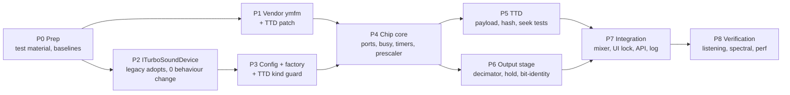

# TSFM — Implementation Plan

**Design:** [tsfm-tdd.md](tsfm-tdd.md) rev. 2. **Behaviour:** [hardware-reference.md](hardware-reference.md).

**Rules for every phase:**
- Each phase is a self-contained change.
- The full core test suite stays green at the end of each phase (~5.5 min, 996+ tests).
- The phase **gate** must pass before the next phase starts.
- No commits without an explicit ask.

P1 and P2 can run in parallel.

---

## P0 — Preparation (no production code)

| Task | Detail |
|---|---|
| Test material | **Done 2026-09-12** (user approved). `testdata/sound/tsfm/`: `TFMWORKS.SCL`, `TSFM-EL.TAP` (~100 TFC tunes + player), `AYtest_v0.2.{scl,tap}` (TurboSound-only test, no FM: a regression check that TSFM behaves as TurboSound); origins and hashes in `SOURCES.md`. |
| Player harness | Build a test fixture that pokes `TSFM-EL.TAP`'s player (block `_tsfmplaye`, code at 25000, plus `lnxdata` at 31000) and one tune (at 32768) into Pentagon 128 RAM, then calls the player's init and per-frame entry points. Find the entry points by disassembling the player, and record them in `verification/`. Used by P4, P5 and P8. |
| Baselines | Run a Google Benchmark per-frame baseline of the current TurboSound at 44.1 k HQ, and record it in `verification/`. |
| Scratch | All temporary outputs go in `scratch/` and are cleaned up. |

**Gate:** material and harness exist; baseline numbers recorded.

## P1 — Vendor ymfm with the TTD patch

| Task | Files |
|---|---|
| Copy upstream `ymfm.h`, `ymfm_fm.h`, `ymfm_fm.ipp`, `ymfm_opn.{h,cpp}`, `ymfm_ssg.{h,cpp}`, `ymfm_adpcm.{h,cpp}`, `LICENSE` | `core/src/3rdparty/ymfm/` |
| Apply `verification/ymfm-ttd.patch`; write `VERSION` (upstream URL + `81aec25c…`) and `PATCHES.md` (what, why, evidence, how to re-apply on upgrade) | same |
| CMake: `SKIP_PRECOMPILE_HEADERS ON` and `-Wno-unused-parameter` on the ymfm `.cpp` files; ymfm dir as `SYSTEM` include; make sure `ymfm_fm.ipp` is not compiled on its own | `core/src/CMakeLists.txt` |
| Third-party notice | `THIRD_PARTY_NOTICES.md` |
| Port `verification/stress.cpp` to gtest, CI-sized (1 seed × 400 k steps + seed "every step" × 50 k) | `core/tests/emulator/sound/tsfm/ymfm_ttd_patch_test.cpp` |

**Gate:**
- `YmfmTtdPatch.*` green: no save side effect, exact restore continuation, state size 494;
- the same test **fails** if the patch is reverted (check once by hand; record in `PATCHES.md`);
- clean `-Werror` build on macOS clang, and on Linux gcc if available.

## P2 — `ITurboSoundDevice`, legacy adopts it

| Task | Files |
|---|---|
| Interface per design §3.3 | `core/src/emulator/sound/chips/iturbosounddevice.h` |
| `SoundChip_TurboSound : ITurboSoundDevice` | `soundchip_turbosound.{h,cpp}` |
| `SoundManager::_turboSound` → `ITurboSoundDevice*`; `getTurboSound()` returns the interface | `soundmanager.{h,cpp}` |
| **Suppression plumbing (design §6.1):** `setSynthesisSuppressed` on the device; `handleFrameStart` and `handleStep` always reach the device; the device early-returns internally | `soundmanager.cpp:368-414`, `soundchip_turbosound.cpp` |
| New `handleFrameEnd` call site (empty for legacy) | `soundmanager.cpp` |
| TTD registration by `getTurboSound()->TTDPeripheralId()` | `timetravelmanager.cpp:1042` |
| Fix `ttdserializable.h` "ids not persisted" comment | `ttdserializable.h` |
| Update consumers: `ayloganalyzer`, `videorecordingwidget`, tests (`ttdayserializer_test`, `ttdsubsystemrestore_test`, `ttdmanager_test`, `sound_adaptivity_test`, `multirate_test`, `device_registry_test`) | as listed |

**Gate:**
- **zero behaviour change**: full suite green;
- turbo-mode frame cost unchanged within noise, compared with the P0 baseline;
- a recorded TurboSound audio capture is bit-identical before and after.

## P3 — Config, factory, session kind guard

| Task | Files |
|---|---|
| `enum class TurboSoundKind { AY, FM }`, `CONFIG::sound.turboSoundKind`, `TSFM_FmTrimDb` | `platform.h` |
| Parse `[SOUND] TurboSound`, `TSFM_FmTrimDb`; unknown → warning + AY | `config.cpp` |
| Factory switch in the `SoundManager` constructor. Until P4 lands, `FM` logs "not yet available" and builds the legacy device. | `soundmanager.cpp` |
| TTD: refuse loading a session whose TurboSound-slot blob id differs from the live device's id | `timetravelmanager.cpp` (session load), `ttdperipheralregistry.cpp` |
| Shipped inis: add `TurboSound = AY` + comment; add a comment that `[AY] Chip/Scheme` are not honoured | `data/configs/*/unreal.ini` |

**Gate:**
- `ConfigTest.TurboSoundKind*` (parse AY / FM / garbage / missing);
- `TtdTsfm.SessionKindMismatchRefused`, using a fake id-4 device;
- all shipped configs still produce TurboSound.

## P4 — Chip core

| Task | Files |
|---|---|
| `Ym2203Engine`, `Ym2203Interface`, `SsgOverrideAdapter` (design §9) | `core/src/emulator/sound/chips/tsfm/ym2203_engine.h` |
| `FmWordQueue` (fixed 4096, `(t, int16)`, rebase by delta) | `tsfm/fm_word_queue.h` |
| `SoundChip_TurboSoundFM` — board latches, `TsfmChip`, construction/reset (§5.4), `syncTo`/`advanceChip` (§5.2), frame rebase in `handleFrameStart`, ports (§5.3). No output stage yet: buffers stay silent. | `soundchip_turbosoundfm.{h,cpp}` |
| Factory: `FM` builds the real device | `soundmanager.cpp` |
| Unit tests, design §12.1, full table | `core/tests/emulator/sound/tsfm/tsfm_core_test.cpp` |

Key checks inside the table:
- `TsfmBusy.ExactTiming`
- `TsfmTimer.APeriod` / `BPeriod` / `CsmKeyOnSampleAligned`
- `TsfmCore.WordCountPerFrame`
- `TsfmCore.IndependentOfOutputStage`
- `TsfmBusy.PlayerWaitLoop` — runs the TFM Compiler `WaitStatus` loop on a real Z80 instance and checks it terminates in a fixed instruction count

**Gate:**
- all §12.1 tests green;
- with `TurboSound = FM`, the P0 player harness runs to the end of a tune without hanging (silent output is expected);
- the core hash is identical in normal, turbo and sound-off runs of 300 frames.

## P5 — TTD

| Task | Files |
|---|---|
| `TTDStateSize` / `TTDSaveState` / `TTDLoadState` per design §8.2 (1 142 B, version byte, reserved scratch vectors, `mutable` engines, `_adoptCpuClock` on restore) | `soundchip_turbosoundfm.cpp` |
| `TTDHashState` over the payload | same |
| Construction-time asserts: ymfm state size == 494, total == 1 142 | same |
| Tests, design §12.3 | `core/tests/debugger/ttd/ttdtsfm_test.cpp` |

The §12.3 tests are: `PayloadRoundtrip`, `CheckpointingIsInvisible`, `SeekAnyPoint` (50 random frame + tInFrame targets on the player harness), `ReplayWithSoundOff`, `NoAllocationInSave`.

**Gate:**
- all §12.3 tests green;
- `SeekAnyPoint` also passes with checkpoint cadence 1 and the default cadence;
- a TSFM TTD session saves to disk and loads back in a fresh instance with an identical core hash per frame.

## P6 — Output stage and bit-identity

| Task | Files |
|---|---|
| `FilterDecimator`: `inputRate` parameter (default `INPUT_RATE`), taps scale with it, `MAX_TAPS` 384, slave mode | `core/src/common/sound/filters/filter_decimator.h` |
| HQ loop: legacy SSG tick + 2 FM half-ticks per tick + hold from word queue + mute at hold input (§6.2); FM decimators as slaves | `soundchip_turbosoundfm.cpp` |
| LQ path: boxcar of the held value | same |
| FM gain `0.30 × trim`, centre pan, `_fm0Buffer`/`_fm1Buffer`, native FM taps | same |
| Tests, design §12.4 | `core/tests/emulator/sound/tsfm/tsfm_output_test.cpp`, `core/tests/common/filter_decimator_test.cpp` |

The §12.4 tests are: `TsfmBitIdentity.*`, `FilterDecimator.InputRateEquivalence` / `SlaveLockstep`, `TsfmOutput.HoldNoJitter` / `MuteAtHoldInput`, `TsfmGain.Reference`.

**Gate:**
- `TsfmBitIdentity` is `memcmp`-clean across HQ/LQ × 44.1 k / 48 k / 96 k × 3 seeds;
- `FirDesigner_Test.*` is unchanged and green.

## P7 — Integration

| Task | Files |
|---|---|
| `AudioSourceType::FM1/FM2` (appended); registry entries when `hasFm()`; `deviceBuffer()` and mixer switch arms; FM chains with punch and room Off | `soundmanager.{h,cpp}` |
| Recording source names, multitrack dialog, audio settings source list | `recordingmanager.cpp`, `multitrackdialog.cpp`, `audiosettingswidget.cpp` |
| Disable the chip-model combo when the device is TSFM; chip loop via `getChipCount()` | `audiosettingswidget.cpp` |
| Prescaler warning at frame start | `soundchip_turbosoundfm.cpp` |
| `AYLogRecord.flags` (padding byte); fill it in TSFM; analyzers and API classify FM addresses and control words correctly | `soundchip_ay8910.h`, `ayloganalyzer`, `analyzers_api.cpp`, `cli-processor-analysis.cpp`, Lua/Python bindings |
| Read-only reporting: `turbo_sound.kind`, board latches, prescaler, busy | `state_audio_api.cpp`, `cli-processor-state.cpp`, Lua/Python, OpenAPI spec |
| Video recording native tap: SSG unchanged; FM taps exposed for archival capture | `videorecordingwidget.cpp` (optional) |

**Gate:**
- the Qt app launches with `TurboSound = FM` on Pentagon 128, Scorpion and 128K;
- FM1/FM2 appear in the mixer, and mute/solo work;
- WebAPI reports `kind: "FM"`;
- the AY log analyzer shows FM writes as FM, not "switch".

## P8 — Verification and tuning

| Task | Detail |
|---|---|
| Listening | `TFMWORKS.SCL` plus collection tunes on Pentagon 128, Scorpion and 128K. Check balance, init, no hangs, no clicks on the `0xFA`↔`0xFE` mute toggle. Adjust the `TSFM_FmTrimDb` default only with a written reason. |
| Spectral scripts | `verification/tools/`: jitter guard, hold droop, image rejection at 44.1 k / 48 k (design §12.5) |
| Performance | Benchmark §12.6; core ≤ 130 µs/frame, output stage ≤ 60 µs/frame. If the core is over budget: quiet-chip fast path in ymfm (a second local patch), proven by `YmfmTtdPatch` plus a new "fast path state-identical" stress mode. |
| Optional co-simulation | jt03 (MiSTer) vs ymfm word stream on captured player traffic. Pin the prescaler state first; ymfm and jt12 differ on when a prescaler write takes effect (hardware-reference H6). Differences are findings, not failures. |
| Close-out | Move the folder out of `inprogress`, update the README status, list the remaining open hardware questions. |

**Gate:** listening sign-off by the user; performance within budget or an accepted exception.

---

## Tracked separately (found during verification, not part of TSFM)

| Item | Where |
|---|---|
| Legacy TurboSound resets to the `0xFF` chip; NedoPC boards reset to `0xFE` | `soundchip_turbosound.h:132,159` |
| Legacy keeps the previous SSG register after selecting `0x10–0xF7`; real chips deselect | `soundchip_ay8910.cpp:451-456` |
| Suspected host² over-render: AY T-states scaled by host multiplier on top of `z80->t` | `soundchip_turbosound.cpp:50-54` |
| `AYLogRecord.tacts` is u16; frames are up to 71 680 T | `soundchip_ay8910.h:84-93` |
| Unclamped int16 casts in legacy buffer stores | `soundchip_turbosound.cpp:108-115` |
| `pFF77` labelled "TurboSound chip select" in hash/checkpoint structs (it is the ATM video port); pBFFD/pFFFD comments swapped | `machinestatehash.h:95`, `ttdcheckpoint.h:158` |
| Pentagon and 48K decoders never update `pFFFD`/`pBFFD` | `pentagon128.cpp`, `spectrum48.cpp` |
| Wide mix + soft limiter (TSFM makes int16 saturation likely) | separate design |
