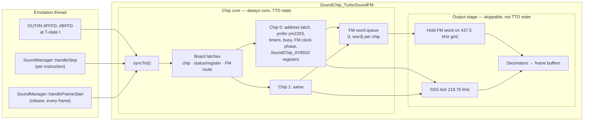

# TurboSound FM (2×YM2203) — Technical Design

**Revision 2** (2026-09-12). This revision replaces revision 1 (2026-09-10, in git history). What changed and why: [verification/verification-report.md](verification/verification-report.md).
**Status:** verified design, ready for implementation — plan in [implementation-plan.md](implementation-plan.md).
**Behaviour source of truth:** [hardware-reference.md](hardware-reference.md) (board logic source, schematic, player code).
**Out of scope:** wide mix + soft limiter in `SoundManager`; TSFM Pro (SAA1099); snapshot formats (.z80/.sna) carrying FM state.

Glossary at the end (§15).

---

## 0. Requirements

| # | Requirement | Source |
|---|---|---|
| R1 | TSFM is an **in-place replacement** for TurboSound. An emulator instance has **exactly one** of them, never both. | user |
| R2 | Selected in the **machine config** (per-model `unreal.ini`). **Not switchable at runtime.** Default: TurboSound. | user |
| R3 | **Any model** can have it: every model that has TurboSound today. | user |
| R4 | **Full TTD support.** Complete chip state can be saved and restored at any point in time, and replay from a checkpoint reproduces the original run exactly. | user |
| R5 | Guest-visible behaviour matches the board: port protocol, reset state, busy flag timing, timers. | hardware-reference |
| R6 | ymfm is the FM chip model. | user |

## 1. Decisions

| # | Decision | Why |
|---|---|---|
| D1 | FM core is **ymfm `ym2203`**, vendored with a **38-line local patch** that makes save side-effect free and restore exact (§9.5). | An upstream save changes the chip's later output, so a run that captures checkpoints differs from one that doesn't, and a replay (which doesn't re-save) diverges from the recording it replays. Measured; see verification. R4 cannot be met without the patch. |
| D2 | `SoundManager` owns one `ITurboSoundDevice*`. The concrete class is chosen **once, in the `SoundManager` constructor**, from `[SOUND] TurboSound = AY \| FM`. | There is no sound-stack rebuild today, and none is needed. Config is loaded per emulator instance. This is the same pattern as Covox. |
| D3 | The device is split into a **chip core** and an **output stage**. The core is never skipped. The output stage is skipped whenever audio is not needed (sound off, turbo). | The busy flag and timers are visible to the program. Players poll busy. Turbo or sound-off must not change what the program sees, or TTD replay would diverge. |
| D4 | The chip core runs on the **T-state axis**: one YM2203 master clock = one CPU T-state (hardware-reference §2). It is advanced lazily to "now" on every port access and every `handleStep` (after each instruction), and rebased at frame start. | Exact on every model and every prescaler setting, with no rate conversion in guest-visible state. |
| D5 | Port protocol follows the **board's logic source**, not the MiSTer RTL. That means: reset selects the `0xFE` chip, all addresses latch in both modes, control words never touch the chip, and FM registers are writable while FM is muted. | hardware-reference §3 |
| D6 | The SSG half of each YM2203 is the existing **`SoundChip_AY8910`**, forced to model `YM2149`. ymfm's own SSG never runs. | Keeps the native AY tick, DAC tables, per-channel controls, TTD payload and AY log. |
| D7 | FM audio is rendered as a sample-and-hold of the FM word stream on a **437.5 kHz grid** (8 T-states), then a **192-tap Kaiser β=5, fc = 20 kHz** decimator. | Same response shape as the shipped 96-tap AY filter. At the default prescaler the FM sample is exactly 9 grid steps, so there is no jitter. |
| D8 | FM enters the mixer as sources **`FM1` / `FM2`**, with their own character chains (punch and room both Off). | Independent mute, solo, meters and recording. Punch is a tilt designed for square waves. |
| D9 | Regression gate: with FM never enabled and only AY-legal traffic, TSFM SSG output is **bit-identical** to TurboSound. The envelope of that guarantee is defined in §11. | Safe swap. |

---

## 2. The device in one picture



Worked example, in plain terms. A player at T-state 10 000 of a frame does `OUT #FFFD,#F8`, then `IN #FFFD`:
1. The `OUT` calls `syncTo(10 000)`. The core clocks the FM engine for every 72-T-state boundary it has not yet reached, and counts down busy and the timers. Then it latches chip 0 and status mode.
2. The `IN` at T-state 10 011 calls `syncTo(10 011)`. If the last data write happened at T-state 9 900, busy ends at 9 900 + 192 = 10 092, so bit 7 is still set.
3. Whether the output stage ran during those T-states has no effect on any of this.

---

## 3. Configuration and selection (R1, R2, R3)

### 3.1 Config key

```ini
[SOUND]
; TurboSound device fitted in the AY socket:
;   AY = TurboSound, 2×AY/YM (default)
;   FM = TurboSound FM, 2×YM2203 (NedoPC)
TurboSound = AY
; FM loudness relative to the hardware-derived default, in dB (hardware-reference §5.2)
TSFM_FmTrimDb = 0
```

- **New key in `[SOUND]`.** Parsed in `Config::ParseConfig` next to `CovoxFB` (`core/src/emulator/config.cpp:314`), into `CONFIG::sound.turboSoundKind` (`enum class TurboSoundKind : uint8_t { AY, FM }`).
- **Do not reuse `[AY] Chip=YM2203`.** Every shipped `data/configs/*/unreal.ini` already says `Chip=YM2203` and `Scheme=AYX32` (e.g. `pentagon128k/unreal.ini:396,409`). Nothing parses those keys today. Honouring them would switch TSFM on for every machine. They stay unparsed, and a comment in each shipped ini points to the new key.
- **Unknown values** log a warning and fall back to `AY`.
- **No runtime path.** No WebAPI/CLI settings write, no feature flag, no UI toggle. Read-only reporting only (§10.3). To change the device, edit the ini and create a new emulator instance.

### 3.2 Construction

`SoundManager::_turboSound` becomes `ITurboSoundDevice*` (`soundmanager.h:96`; the `// SoundChip_TurboSoundFM;` placeholder at `:98` goes away).

```cpp
// SoundManager::SoundManager (soundmanager.cpp:61)
switch (_context->config.sound.turboSoundKind)
{
    case TurboSoundKind::FM: _turboSound = new SoundChip_TurboSoundFM(_context); break;
    default:                 _turboSound = new SoundChip_TurboSound(_context);   break;
}
_turboSound->setCoreRate(_coreRate);
```

- Ports: `SoundManager::attachToPorts` registers `#FFFD/#BFFD` for whichever device exists. That happens on every supported model, so R3 is met with no per-model code: 48K, 128K, +3, Pentagon 128/512, Profi, Scorpion/ProfScorp.
- 48K note: TurboSound is attached on 48K today, although a real 48K needs an AY interface. TSFM inherits exactly that.

### 3.3 Interface

```cpp
// core/src/emulator/sound/chips/iturbosounddevice.h
class ITurboSoundDevice : public PortDecoder, public PortDevice, public ttd::TTDSerializable
{
public:
    // Lifecycle (emulation thread)
    virtual void handleFrameStart() = 0;        // runs every frame, even in turbo; TSFM rebases the core clock here (§5.2)
    virtual void handleStep() = 0;              // advances the core; renders unless suppressed (§6.1)
    virtual void handleFrameEnd() = 0;          // NEW call site in SoundManager::handleFrameEnd; skipped in turbo, output stage only
    virtual void setSynthesisSuppressed(bool) {}    // output stage on/off; core unaffected

    // Rate / quality
    virtual void   setCoreRate(size_t rate) = 0;
    virtual size_t getCoreRate() const = 0;
    virtual void   setHQEnabled(bool enabled) = 0;

    // Frame buffers (interleaved int16 stereo)
    virtual size_t   getRenderedSamplesThisFrame() const = 0;
    virtual int16_t* getChipBuffer(int chip) = 0;
    virtual int16_t* getFmBuffer(int /*chip*/) { return nullptr; }
    virtual bool     hasFm() const { return false; }

    // Chips, taps, log
    virtual SoundChip_AY8910* getChip(int chip) const = 0;
    virtual int  getChipCount() const = 0;
    virtual std::shared_ptr<NativeAudioTap> getNativeTap() const = 0;
    virtual std::shared_ptr<NativeAudioTap> getFmNativeTap(int /*chip*/) const { return nullptr; }
    virtual void setLogSink(AYLogSink sink, void* context) = 0;

    // Ports
    virtual bool attachToPorts(PortDecoder* decoder) = 0;
    virtual void detachFromPorts() = 0;

    // Identity: TTDSerializable::TTDPeripheralId() — TurboSound (0) or TSFM (4)
};
```

This matches the consumers found in the code survey:
- `soundmanager.cpp`: construct, rate, reset, chips, buffers, frame hooks, attach
- `timetravelmanager.cpp:1042`: TTD registration
- `ayloganalyzer.cpp`: log sink
- `videorecordingwidget.cpp:1224-1226`: native tap
- tests

`SoundChip_TurboSound` adopts the interface with **no behaviour change** (implementation plan phase 1).

Differences from revision 1:
- `peripheralId()` is dropped; `TTDPeripheralId()` already exists.
- `reset()` is inherited from `PortDecoder`, where it is pure virtual.

---

## 4. Timing (R5)

All guest-visible timing is in T-states, from ymfm's formulas with 1 master clock = 1 T-state:

| Quantity | Formula | Prescaler /6 (default) | /3 | /2 |
|---|---|---|---|---|
| FM sample period | 12 · p | **72 T** | 36 T | 24 T |
| Busy after any data write | 32 · p | **192 T** | 96 T | 64 T |
| Timer A period | (1024 − TA) · 12 · p, TA = `reg24<<2 \| reg25&3` | 72 T per step | | |
| Timer B period | (256 − TB) · 16 · 12 · p, TB = `reg26` | 1152 T per step | | |
| SSG clock (not modelled) | host AY clock × 1 / 2 / 4 | 1.75 MHz | ×2 | ×4 |

**Which T-state.** The core uses `EmulatorState::AudioTstate(z80->t)` (`platform.h:851-860`). That value already undoes the Scorpion hardware turbo: the YM2203 is clocked from the AY socket, not from the CPU.

The **host** speed multiplier is not applied. The legacy AY render multiplies by it; that is suspected to be a bug and is tracked separately (verification report, item C10). For the output stage, TSFM uses the same sample-count rule as the legacy device, so the two stay in lockstep.

---

## 5. Chip core

### 5.1 State

```cpp
struct TsfmBoard                               // the logic chip's three latches
{
    uint8_t chip       = 0;                    // 0 = first chip (D1), selected by bit0 = 0
    bool    statusRead = false;                // bit1 = 0
    bool    fmEnabled  = false;                // bit2 = 0
};

class TsfmChip                                  // one YM2203; not copyable or movable (ymfm holds references)
{
public:
    SoundChip_AY8910   ssg;                    // SSG half, model YM2149
    Ym2203Interface    intf;                   // timers + busy, in T-states
    Ym2203Engine       fm{intf};               // ymfm::ym2203 subclass, patched
    SsgOverrideAdapter ssgAdapter{ssg, fm};

    uint8_t  address       = 0;                // YM2203 address latch (8-bit)
    int32_t  fmClockPhase  = 0;                // T-states since the last FM sample, 0 .. 12·p−1
    // output-side hand-off (not TTD state, §6)
    FmWordQueue words;                         // fixed capacity 4096 (t, int16)
};

class SoundChip_TurboSoundFM : public ITurboSoundDevice
{
    TsfmBoard _board;
    std::unique_ptr<TsfmChip> _chips[2];
    uint64_t  _syncedT = 0;                    // core has been advanced to this frame-relative T-state (§5.2); not TTD state
    bool      _adoptCpuClock = true;           // set by reset/restore: next sync adopts the CPU's T-state without advancing
    ...
};
```

### 5.2 Advancing the core

```cpp
void SoundChip_TurboSoundFM::syncTo(uint64_t t)          // t = AudioTstate(z80->t)
{
    if (_adoptCpuClock) { _syncedT = t; _adoptCpuClock = false; return; }
    if (t <= _syncedT) return;
    int32_t delta = int32_t(t - _syncedT);
    for (auto& c : _chips) advanceChip(*c, delta, _syncedT);
    _syncedT = t;
}

void SoundChip_TurboSoundFM::advanceChip(TsfmChip& c, int32_t delta, uint64_t t0)
{
    // Walk FM sample boundaries and timer expiries in time order, so that a
    // CSM key-on from timer A lands on the right FM sample.
    while (delta > 0)
    {
        const int32_t period  = 12 * int32_t(c.fm.fmClockPrescale());
        const int32_t toClock = period - c.fmClockPhase;
        const int32_t toTimer = c.intf.clocksToNextExpiry();          // INT32_MAX when both timers stopped
        const int32_t n = std::min({delta, toClock, toTimer});

        c.intf.advance(n);                      // counts down busy; fires expired timers (carries overshoot)
        c.fmClockPhase += n; delta -= n; t0 += n;

        if (c.fmClockPhase == period)
        {
            c.fmClockPhase = 0;
            const int16_t word = c.fm.clockFmOnce();
            c.words.push(t0, word);             // the output stage drops these when suppressed
        }
    }
}
```

- **Invariant: the core is in step with the CPU at every instruction boundary.**
  - `MainLoop::OnCPUStep` calls `SoundManager::handleStep` after every instruction, in every mode (`mainloop.cpp:356-379`).
  - `handleStep` always calls `syncTo` (§6.1).
  - So at any instruction boundary, including the moment TTD captures a checkpoint, `_syncedT == AudioTstate(z80->t)`, and the pending position lives entirely in `fmClockPhase` and the timer and busy counters.
- **Frame rollover.** `Core::AdjustFrameCounters` subtracts the frame length from `z80->t` (keeping the overrun, `cpu/core.cpp:698-713`) before the frame hooks run.
  - The device rebases in `handleFrameStart`, which runs unconditionally (`mainloop.cpp:311-318`): `delta = _syncedT − AudioTstate(z80->t); _syncedT −= delta;` and every queued word's timestamp moves by `−delta`.
  - No CPU instruction runs between the adjust and the hook, so no time is lost or double-counted.
  - **Do not use `handleFrameEnd` for this.** `MainLoop::OnFrameEnd` skips `SoundManager::handleFrameEnd` in turbo mode (`mainloop.cpp:464-480`).
- **Ordering rule.** At the same T-state, timer expiry is processed before the FM sample. That matches ymfm, where the timer callback runs before the next `clock_fm`. The rule is fixed and is covered by a test.
- **A prescaler write** (address `0x2D–0x2F`) takes effect in the next loop iteration. `fmClockPhase` is clamped to `period − 1`, so a shrinking period cannot skip a sample.
- **Cost, measured** (M1 Ultra, `-O2`, [verification/bench.cpp](verification/bench.cpp)):
  - `clock_fm` takes 29 ns when silent and 63 ns with 3 channels × 4 operators playing;
  - two chips need 1 992 calls per Pentagon frame, so **58–126 µs per frame, always**, including turbo;
  - this replaces revision 1's "≤ +60 µs" estimate, which was too low;
  - a quiet-chip fast path is a later optimisation, and must be proven state-identical by the stress harness (plan phase 8).

### 5.3 Port behaviour

```cpp
void SoundChip_TurboSoundFM::portDeviceOutMethod(uint16_t port, uint8_t value)
{
    syncTo(nowT());
    TsfmChip& c = *_chips[_board.chip];
    uint8_t flags = 0;

    switch (port)
    {
    case PORT_FFFD:
        if ((value & 0xF8) == 0xF8)                         // control word: board latches only
        {
            _board.chip       = (value & 0x01) ? 1 : 0;
            _board.statusRead = !(value & 0x02);
            _board.fmEnabled  = !(value & 0x04);
            flags |= AYLOG_CONTROL;
        }
        else                                                // address: latched in BOTH modes
        {
            c.address = value;
            c.fm.write_address(value);                      // ymfm address + prescaler side effect (0x2D-0x2F)
            c.ssg.setRegister(value);                       // SSG: <0x10 selects; >=0x10 is ignored by setRegister
        }
        break;

    case PORT_BFFD:
        if (c.address < 0x10)
        {
            c.ssg.writeCurrentRegister(value);              // legacy SSG path, byte-for-byte
            c.intf.ymfm_set_busy_end(c.fm.busyClocks());    // busy is set by SSG writes too (ymfm write_data)
        }
        else
        {
            c.fm.write_data(value);                         // FM register; sets busy itself; allowed while muted
        }
        break;

    default:
        return;
    }
    logWrite(port, value, flags);
}

uint8_t SoundChip_TurboSoundFM::portDeviceInMethod(uint16_t port)
{
    syncTo(nowT());
    TsfmChip& c = *_chips[_board.chip];
    if (_board.statusRead && port == PORT_FFFD)
        return c.fm.read_status();                           // busy | timer B | timer A
    if (c.address < 0x10)
        return c.ssg.readCurrentRegister();
    return 0xFF;                                             // FM address latched (hardware-reference H2)
}
```

Notes:
- **What `nowT()` is.** `AudioTstate(z80->t)` read inside the port callback. The Z80 core advances `t` cycle-by-cycle through the instruction (`cputact(1)` before the IORQ dispatch in `out (c),a`, `op_ed.cpp:609-616`; contention first, `z80.cpp:717-740`), so the value seen is the T-state of the IORQ itself, not the instruction end. `handleStep` then advances the core to the instruction end. Record and replay observe identical values, so TTD determinism is unaffected.
- **SSG selection with an FM address latched.** `SoundChip_AY8910::setRegister` keeps the previous SSG register when given a value ≥ `0x10`. That is harmless here: the `#BFFD` branch tests `c.address`, not the SSG's own selection, so SSG data is only written while an SSG address is latched.
- **`IN #BFFD`.** Legacy TurboSound ignores the port number, and several models route `IN #BFFD` to it (code survey item 1). TSFM keeps that routing for register mode, for regression parity. Status mode applies to `#FFFD` only.
- **Busy never blocks a write.** It is only reported (hardware-reference §4.1, H3).

### 5.4 Reset

Machine reset:
1. Clock: `_adoptCpuClock = true`, word queues cleared.
2. `_board = {chip 0, register read, FM muted}`, the CPLD reset state. Equivalent to `OUT #FFFD,#FE`.
3. For each chip:
   - `ssg.reset()`;
   - `fm.reset()` — ymfm resets FM registers, operators and status. The adapter's `ssg_reset()` is a no-op, so the AY is not reset twice;
   - `fm.write_address(0x2D)` — ymfm's reset leaves the prescaler as it was; a real YM2203 reset returns to /6;
   - `address = 0`, `fmClockPhase = 0`, `intf.reset()` — timers stopped, not busy.
4. `ssg.setChipModel(AYChipModel::YM2149)`.

Construction does the same, after `fm.ssg_override(ssgAdapter)`. ymfm's constructor does **not** call `reset()`, and its register array is uninitialised until it does.

**Legacy polarity difference.** `SoundChip_TurboSound` resets to its `_chip0`, which is the `0xFF` chip (AYX32 numbering, `soundchip_turbosound.cpp:221-231`). TSFM resets to the `0xFE` chip, as the board does. This is not changed in the legacy device (verification report, item C12), and the bit-identity test accounts for it (§11).

---

## 6. Output stage

### 6.1 When it runs

`handleStep()` always calls `syncTo(now)`. It renders only if synthesis is not suppressed.

Two `SoundManager` early returns today skip the TurboSound device entirely, and both must change:

| Where | Today | Change |
|---|---|---|
| `handleFrameStart` (`soundmanager.cpp:368-383`) | In turbo without audio: sets the suppressed flag on Beeper/Covox, then `return` **before** `_turboSound->handleFrameStart()` | Also call `_turboSound->setSynthesisSuppressed(suppressed)`, and call `_turboSound->handleFrameStart()` **before** the early return. The device skips its own buffer clears when suppressed. |
| `handleStep` (`:397-414`) | Returns on `!_feature_sound_enabled` and on `_synthesisSuppressed` | Call `_turboSound->handleStep()` in both cases; the device renders only when not suppressed. Sound feature off counts as suppressed. |

The legacy device gets the same checks, so its per-frame and per-step cost stays as it is today: an early return inside the device instead of in `SoundManager`.

When the output stage is off, the word queues are cleared in `handleFrameStart`, which also runs in turbo mode.

**Frame-end axis trap.** `MainLoop::RunFrame` ends `ExecuteCPUFrameCycle` with `AdjustFrameCounters` (which rebases `z80->t`) *before* `OnFrameEnd` (`mainloop.cpp:288-294`, `cpu/core.cpp:691`). So inside `handleFrameEnd` the word queue is still on the old frame's axis while `z80->t` already reads into the new frame. The output stage must drain to its own end-of-frame position (`_syncedT`, captured before the adjust), never to `AudioTstate(z80->t)`. The rebase that shifts the queue onto the new axis happens afterwards, in `handleFrameStart` (§5.2).

### 6.2 Sample-and-hold on the 437.5 kHz grid

The legacy HQ loop ticks the SSG at 218.75 kHz (every 16 T-states). The FM output stage adds two half-ticks per SSG tick, 8 T-states each. On each half-tick at T-state `h`, it takes the newest word with timestamp ≤ `h`, holds it, and feeds it to the FM decimator.

```cpp
inline void SoundChip_TurboSoundFM::fmHalfTick(TsfmChip& c, OutputState& o, uint64_t h)
{
    while (!c.words.empty() && c.words.front().t <= h)
    {
        o.hold = c.words.front().word / 32768.0;
        if (o.tap->isActive()) o.tap->push(float(o.hold), float(o.hold));   // raw DAC stream
        c.words.pop();
    }
    o.decimator.feedSample(_board.fmEnabled ? o.hold : 0.0);     // board mute gates the DAC input
}
```

Worked example at /6:
- words arrive every 72 T-states and half-ticks every 8 T-states;
- so each word is held for exactly 9 half-ticks, with no jitter;
- at /3 (36 T-states = 4.5 half-ticks) the hold alternates 4/5 half-ticks. No known software stays at /3.

Why not hold on the 16-T-state SSG grid? The FM period would be 4.5 ticks there, too. That gives ±1.14 µs of periodic jitter, which puts a −31 dB sideband at 16.3 kHz for an 8 kHz tone.

**Muting.** Mute is applied at the hold input (the DAC data line), not after decimation. That is where the board applies it, and it avoids a click from the filter's step response being cut off.

### 6.3 Decimator

`FilterDecimator` (`core/src/common/sound/filters/filter_decimator.h`) gains an input-rate parameter and a slave mode:
- The tap count scales with input rate, so 96 taps at 218.75 kHz becomes 192 taps at 437.5 kHz: the same transition width in Hz, the same "gentle" response.
- `MAX_TAPS` goes from 192 to 384.
- The constant keeps its name `INPUT_RATE`; the new parameter defaults to it.
- `FirDesigner_Test.ReproducesShippedDecimatorTable` and `DecimatorRateMatrix` (`core/tests/common/fir_designer_test.cpp`) must stay green unchanged.
- In **slave mode** the FM decimator has no phase accumulator. It produces output exactly when the chip-0 SSG left decimator (the master) does, so the FM and AY sample counts are equal by construction.

Instances: 4 AY decimators (2 per chip) plus 2 FM decimators.

LQ path: a boxcar average of the held value over the half-ticks of each output sample, mirroring the legacy LQ path.

### 6.4 Native FM tap

One `NativeAudioTap` per chip carries the exact DAC words at the FM sample rate (48 611 Hz at /6). This is the lossless archival stream. It is separate from the 218.75 kHz SSG tap, whose rate it does not share.

---

## 7. Gain

### 7.1 Default

- **Hardware basis:** the schematic gives FM and SSG channel A the same mixer weight. MiSTer's ratio is FM full scale = **2.0 ×** the AC amplitude of one SSG channel at full volume. hardware-reference §5.2 estimates 2–2.5 × from the part values, which is consistent.
- **unreal-ng SSG scale:** channel A at full volume in the left output is `dac 0..1 × pan 0.9 / 3` = 0..0.30, which after the DC blocker is **±0.15** (`soundchip_ay8910.cpp:375-424, 570-606`).

```
_fmGain = 2.0 × 0.15 × 10^(TSFM_FmTrimDb / 20) = 0.30 × trim          // FM word ±32768 → ±0.30
```

Worked example:

| Case | Level before chains |
|---|---|
| One carrier operator at TL=0 (word ±8168, §5.2 of the hardware reference) | ±8168/32768 × 0.30 = **±0.075**, half an SSG channel |
| One four-carrier channel | ≈ ±0.30, twice an SSG channel |
| Worst case, all four sources flat out | exceeds int16 in the current saturating mixer |

The worst case is the known prerequisite for the wide-mix + limiter work (§14). FM1/FM2 registry volumes default to 1.0.

Pan: FM goes centre on both channels (hardware). Stereo split is not offered, because it is not a board property.

### 7.2 Chains

- FM1/FM2 get their own `AudioCharacterChain`, with punch Off and room Off.
- AY chains keep today's defaults.
- No DC blocker on FM: the ymfm output is symmetric around zero.

---

## 8. TTD (R4)

### 8.1 What "any point in time" means here

TTD takes full checkpoints at **frame boundaries** (`TimeTravelManager::CaptureNow`, `tInFrame = 0`, `timetravelmanager.cpp:621-646`). A mid-frame target is reached by restoring the nearest earlier checkpoint and replaying the CPU up to the target, with host audio muted. `handleStep` keeps running during that replay (`EnterReplayMode`, `:1245-1276`).

So the requirement breaks down into three properties, each tested (§12.3):

| # | Property | How the design guarantees it |
|---|---|---|
| P1 | **Save is invisible.** A run that captures checkpoints is identical to one that doesn't. | Patched ymfm save has no side effects (§9.5). Device save is a pure read. |
| P2 | **Restore is exact.** Restoring a checkpoint and running on is identical to never having stopped. | Every piece of core state is serialized, including ymfm's prepare scheduling (patch). |
| P3 | **Replay is deterministic, whatever the audio settings.** The core is a pure function of state at the checkpoint and port events at T-states. | D3/D4. The core never depends on the output stage, sound on/off, turbo, host speed or core rate. |

Because of the §5.2 invariant, the core's position in time is fully described by its phase counters (`fmClockPhase`, timers, busy). Two consequences:
- **No absolute T-state in the payload.** On restore the device sets `_adoptCpuClock`, and the next `syncTo` takes whatever `z80->t` the TTD framework restored — today 0 at a frame boundary (`timetravelmanager.cpp:1612-1614`). The device follows the framework's time convention automatically, like every other peripheral.
- **Valid at any instruction boundary.** The payload is equally valid mid-frame. If TTD ever adds mid-frame checkpoints, they need no pre-save sync.

### 8.2 Serialized layout — `PeripheralId::TSFM = 4`

Fixed size, computed in the constructor. Little-endian and packed, like the other payloads.

```
u8   version = 1
u8   board: chip | statusRead<<1 | fmEnabled<<2
per chip × 2:
  u8   address
  i32  fmClockPhase
  i32  timerRemaining[2]                  −1 = stopped
  i32  busyRemaining
  u16  ymfmSize                            = 494 (measured, patched ymfm; asserted at construction)
  u8[494] ymfm ym2203 state               FM engine, operators, channels, regs, prepare scheduling, m_address, m_last_fm
  u8[57]  SoundChip_AY8910 payload         existing serializer (soundchip_ay8910.cpp:994), incl. SSG register select
```

Total: 2 + 2 × (1 + 4 + 8 + 4 + 2 + 494 + 57) = **1 142 bytes**.

- **Not serialized** (output stage): decimator histories, the hold value, word queues, DC blockers, chains, `_ayPLL`. This is the same policy as the legacy device: none of it is guest-visible or part of the chip. After a restore the output stage is reset, and audio resumes within one filter length (192 taps ≈ 0.4 ms).
- **No allocation in `TTDSaveState`.** Each chip keeps a scratch `std::vector<uint8_t>` reserved to 1 024 bytes at construction. `ymfm_saved_state` does `resize(0)` and then `push_back`s within that capacity. `save_restore` is non-const, so the engine is `mutable`; the patch makes saving non-mutating in fact.
- **`TTDHashState`** is overridden (the legacy device does not override it): FNV-1a over the whole payload above. Divergence detection then covers FM state.
- **Registration.** `timetravelmanager.cpp:1042` registers `getTurboSound()` under `device->TTDPeripheralId()`, not a hard-coded `TurboSound`.
- **Session kind guard.** A session recorded with TurboSound (blob 0) loaded into a TSFM instance, or the reverse, is **refused** with a clear message. Today it would silently leave the other device stale via `missingBlobs` (`ttdperipheralregistry.cpp:113-148`). Refusal follows the existing model-state-id check.
- **Id 4 is frozen.** It is written into session files (`ttd.ksy:421`). The header comment claiming ids are not persisted is corrected.

### 8.3 Chip model

TSFM forces `YM2149` at construction and reset. The Qt audio settings chip-model combo (`audiosettingswidget.cpp:609`) is disabled while the device is TSFM. Chip model is therefore constant for the instance, and not TTD state.

---

## 9. ymfm integration

### 9.1 Engine subclass

```cpp
// core/src/emulator/sound/chips/tsfm/ym2203_engine.h
class Ym2203Engine final : public ymfm::ym2203
{
public:
    explicit Ym2203Engine(ymfm::ymfm_interface& intf) : ymfm::ym2203(intf) {}
    Ym2203Engine(const Ym2203Engine&) = delete;
    Ym2203Engine& operator=(const Ym2203Engine&) = delete;

    /// One FM sample: engine clock, channel sum, YM3014 10.3 floating-point quantisation.
    int16_t  clockFmOnce()            { clock_fm(); return int16_t(m_last_fm.data[0]); }   // protected in ymfm
    uint32_t fmClockPrescale() const  { return m_fm.clock_prescale(); }                    // 6 / 3 / 2
    uint32_t busyClocks() const       { return 32u * m_fm.clock_prescale(); }
};
```

- `clock_fm()` is exactly: `m_fm.clock(ALL_CHANNELS); m_fm.output(m_last_fm.clear(), 0, 32767, ALL_CHANNELS); m_last_fm.roundtrip_fp();` (`ymfm_opn.cpp:951-961`).
- `generate()` and ymfm's SSG resampler are never called. The code check found that safe: `generate()` only schedules `clock_fm` and resamples the SSG.
- Word range: one operator is 14-bit, but channels sum in int32, and `roundtrip_fp` clamps to int16 and truncates to the DAC step.

### 9.2 Interface — timers and busy in T-states

```cpp
class Ym2203Interface final : public ymfm::ymfm_interface
{
public:
    void reset() { _timer[0] = _timer[1] = -1; _busy = 0; }

    int32_t clocksToNextExpiry() const
    {
        int32_t n = INT32_MAX;
        for (int32_t r : _timer) if (r > 0) n = std::min(n, r);
        return n;
    }

    void advance(int32_t clocks)                 // clocks <= clocksToNextExpiry() by construction
    {
        if (_busy > 0) _busy = std::max(0, _busy - clocks);
        for (uint32_t t = 0; t < 2; t++)
            if (_timer[t] > 0 && (_timer[t] -= clocks) == 0)
            {
                _timer[t] = -1;
                m_engine->engine_timer_expired(t);   // sets flag, CSM key-on, reloads via ymfm_set_timer
            }
    }

    void ymfm_set_timer(uint32_t tnum, int32_t durationClocks) override { _timer[tnum] = durationClocks; } // <0 = stop
    void ymfm_set_busy_end(uint32_t clocks) override { _busy = int32_t(clocks); }
    bool ymfm_is_busy() override { return _busy > 0; }
    void ymfm_update_irq(bool) override {}       // IRQ pin not connected

    int32_t _timer[2] = {-1, -1};                // TTD
    int32_t _busy = 0;                           // TTD
};
```

The core loop never steps past an expiry (§5.2), so there is no overshoot and nothing to carry. Revision 1's 16-clock step lost 8 clocks per timer-A period.

`ymfm_sync_mode_write` and `ymfm_sync_check_interrupts` keep their defaults, which call the engine immediately. That is correct on a single thread.

### 9.3 SSG override adapter

```cpp
class SsgOverrideAdapter final : public ymfm::ssg_override
{
public:
    SsgOverrideAdapter(SoundChip_AY8910& ssg, const Ym2203Engine& fm) : _ssg(ssg), _fm(fm) {}
    void    ssg_reset() override {}                                        // the device owns AY reset (§5.4)
    uint8_t ssg_read(uint32_t reg) override { return _ssg.readRegister(uint8_t(reg & 0x0F)); }
    void    ssg_write(uint32_t reg, uint8_t v) override { _ssg.writeRegister(uint8_t(reg & 0x0F), v); }
    void    ssg_prescale_changed() override {}                             // polled at frame end instead (§9.4)
private:
    SoundChip_AY8910& _ssg;
    const Ym2203Engine& _fm;
};
```

The device never calls ymfm's `read_data`/`write_data` for SSG addresses (§5.3), so `ssg_read`/`ssg_write` are a safety net only.

### 9.4 Prescaler

- **FM:** fully modelled by the core loop (§5.2) at every prescaler value.
- **SSG:** the SSG clock change (×2 at /3, ×4 at /2) is **not modelled**. `SoundChip_AY8910` keeps ticking at the host AY rate.
- **Warning:** in `handleFrameStart` (it runs in turbo too), if a chip's prescaler is not 6, log one warning per instance.
- Players' `0x2F` → `0x2D` init sequence ends at /6 within the same frame, so it never warns. That makes revision 1's "warning on every write" moot.

### 9.5 Vendoring and the local patch

Location and files:
- `core/src/3rdparty/ymfm/`: `ymfm.h`, `ymfm_fm.h`, `ymfm_fm.ipp`, `ymfm_opn.h`, `ymfm_opn.cpp`, `ymfm_ssg.h`, `ymfm_ssg.cpp`, `ymfm_adpcm.h`, `ymfm_adpcm.cpp`, `LICENSE` (BSD-3, © 2021 Aaron Giles).
- `ymfm_adpcm.cpp` **is** required to link: `ymfm_opn.cpp` also defines the 2608/2610 classes. `ymfm_misc.*` is not needed.
- `ymfm_fm.ipp` is included by `ymfm_opn.cpp` and must not be compiled on its own.
- `VERSION`: upstream `https://github.com/aaronsgiles/ymfm.git` @ `81aec25ccbb98f4873a255f7551ac4dadac59b4a`.
- `PATCHES.md` plus [verification/ymfm-ttd.patch](verification/ymfm-ttd.patch).

Build:
- Every `.cpp` under `core/src` is globbed into core with the `stdafx.h` precompiled header and `-Wall -Wextra -Werror` (`core/src/CMakeLists.txt:27,36,71`).
- ymfm sources get `SKIP_PRECOMPILE_HEADERS ON` and `-Wno-unused-parameter`.
- The ymfm directory is a `SYSTEM` include, so warnings in its headers don't break our files.
- `THIRD_PARTY_NOTICES.md` gets a ymfm entry.

**The local patch** (`ymfm_fm.ipp` `fm_engine_base::save_restore`, `ymfm_opn.cpp` `ym2203::save_restore`):
1. **Save and restore `m_active_channels`, `m_modified_channels`, `m_prepare_count`.** ymfm refreshes its operator caches in `prepare()`, and `prepare()` is not a pure refresh: it advances each operator's key state and clears the CSM key-on bit. Its timing is driven by these three counters, so they are chip state.
2. **Remove the unconditional `invalidate_caches()`.** On restore, rebuild each operator's cache directly with `cache_operator_data()`, without calling `prepare()`. This is safe because every register write marks all channels modified (`ymfm_fm.ipp:1412, 1563`): when nothing is marked modified, the live cache equals a fresh computation from the registers.
3. **Call `update_prescale()` only on restore**, so saving never calls back into the SSG override.

Evidence ([verification/stress.cpp](verification/stress.cpp)):
- Setup: 6 seeds × 4 M steps of 8 clocks (≈ 9 s of chip time each), about 19 k random writes per seed covering key-on/off, all operator registers, 3-slot, CSM, timers and prescaler.
- Checkpoints every 1 to 4 596 steps; seed 1 saves and restores at **every** step.

| | Upstream | Patched |
|---|---|---|
| P1: chip that saves vs chip that never saves (output + status) | differs on all 6 seeds | identical |
| P2: fresh chip restored at each checkpoint vs never-saved chip, per segment | 54 – 100 374 mismatching segments | 0 |
| Restored chip vs the chip that produced the save | identical | identical |
| State size | 482 bytes | 494 bytes, fixed |

The third row shows where upstream's problem lies. Restore itself is faithful; **saving** is not invisible. In TTD terms, the recording saves a checkpoint at every frame boundary but a seek replay does not re-save. The replay therefore diverges from the recording once it crosses a boundary, and a recorded session also plays differently from the same session run without TTD. The patch has to cover restore too: if save simply skipped the cache invalidation, restore would still force a `prepare()` and diverge.

---

## 10. Observability

### 10.1 AY log

`AYLogRecord` (`soundchip_ay8910.h:84-93`) is 13 bytes of fields padded to 16. A `flags` byte fits in the padding with no size change:

| Bit | Meaning |
|---|---|
| 0 | FM enabled at the time of the write |
| 1 | control word |
| 2 | reserved |

Consumers that must learn the new flag:
- `ayloganalyzer`
- WebAPI `analyzers_api.cpp:1630-1650`, which today labels any `#FFFD` value > `0x0F` as a chip "switch" and would mislabel FM addresses
- CLI `cli-processor-analysis.cpp:552`
- Lua and Python bindings

### 10.2 Mixer registry

`AudioSourceType` gains `FM1, FM2`, appended before `Custom`. The values are not persisted, so appending is safe.

Places that must learn them:
- `SoundManager::deviceBuffer()` (`soundmanager.cpp:217-231`)
- the mixer switch (`:542-558`)
- source names in `recordingmanager.cpp:38-76`
- `multitrackdialog.cpp:81-132`
- `audiosettingswidget.cpp:548-569`

### 10.3 Read-only reporting

- WebAPI `state_audio_api.cpp`, CLI `cli-processor-state.cpp`, Lua and Python: report `turbo_sound.kind = "AY" | "FM"`. For FM, also report the board latches (chip, status/register, FM enabled), per-chip prescaler and busy.
- No write endpoints.
- MCP picks these up through the WebAPI router.

---

## 11. Bit-identity with TurboSound (D9)

**Setup:** the same port-write stream is fed to both devices, with both chips at `YM2149`, HQ and LQ, core rates 44.1 k / 48 k / 96 k.

**Envelope** — the stream:
- starts with an explicit chip select;
- selects chips only with `0xFE`/`0xFF`;
- latches register addresses `< 0x10` only;
- never enables FM.

**Guaranteed identical:**
- summed SSG output;
- the native 218.75 kHz tap;
- per-chip SSG buffers **with chip indices swapped**. TSFM's chip 0 is the `0xFE` chip; legacy's `_chip0` is the `0xFF` chip;
- `IN #FFFD` and `IN #BFFD` results in register mode;
- AY log records, with chip swapped and `flags = 0`.

**Outside the envelope — deliberate differences, all hardware-driven:**
- Reset chip (hardware-reference §3.3).
- Selecting `0x10–0xF7`: legacy keeps writing the previous SSG register; TSFM sends data to the FM half.
- `0xF8–0xFD`: legacy ignores them; TSFM interprets them.
- Status reads: legacy has none.
- Busy is set by SSG writes in TSFM. It is not audible and only visible in status mode.

---

## 12. Tests

Test locations: `core/tests/emulator/sound/tsfm/`, `core/tests/debugger/ttd/`, `core/tests/common/` (globbed recursively).

### 12.1 Chip core (unit, no CPU)

| Test | Asserts |
|---|---|
| `TsfmPort.ControlWordTable` | All 8 control words set (chip, statusRead, fmEnabled) per hardware-reference §3.2, and never change either chip's address latch |
| `TsfmPort.ResetState` | After reset: chip 0 = the `0xFE` chip, register read, FM muted, prescaler /6, timers stopped, not busy |
| `TsfmPort.AddressLatchedWhileMuted` | FM muted, `OUT #FFFD,#A0` / `OUT #BFFD,#55` → ymfm reg `0xA0` = `0x55`; SSG registers unchanged |
| `TsfmPort.SsgIgnoresDataWithFmAddress` | Select `0x07`, select `0x28`, write data → SSG R7 unchanged |
| `TsfmPort.ReadWithFmAddress` | Register mode + FM address → `0xFF` |
| `TsfmBusy.ExactTiming` | Data write at T → status bit 7 set at T+191, clear at T+192 (/6); 96 at /3; SSG data writes too |
| `TsfmBusy.PlayerWaitLoop` | Z80 program running TFM Compiler's `WaitStatus` sequence completes, with a fixed instruction count |
| `TsfmTimer.APeriod` | `0x24=0x80, 0x25=0`, enable+load → flag at (1024 − 512) · 72 T exactly; reloads without drift over 1 000 periods |
| `TsfmTimer.BPeriod` | `0x26=0x80` → flag at 128 · 1152 T, minus ymfm's first-load `m_total_clocks & 15` term (asserted separately) |
| `TsfmTimer.CsmKeyOnSampleAligned` | CSM key-on lands on the FM sample at or after expiry; expiry-before-sample ordering rule |
| `TsfmPrescaler.PeriodFollows` | `0x2F` → words every 24 T; `0x2E` from /6 → 36 T; `0x2D` → 72 T; `0x2F` then `0x2D` in one frame → no warning |
| `TsfmCore.WordCountPerFrame` | Pentagon frame (71 680 T) at /6 → 995 or 996 words, and exactly 71 680 / 72 on average over 72 frames |
| `TsfmCore.IndependentOfOutputStage` | Same stream with synthesis on / suppressed / sound feature off / host speed 1× and 4× / core rate 44.1 k and 192 k → identical core hash and word stream |

### 12.2 ymfm patch

| Test | Asserts |
|---|---|
| `YmfmTtdPatch.SaveHasNoSideEffects` | Port of `verification/stress.cpp`, 1 seed × 400 k steps (CI-sized): saving every step vs never saving → identical |
| `YmfmTtdPatch.RestoreContinuesExactly` | Restore at random steps → identical to the never-saved run |
| `YmfmTtdPatch.StateSizeFixed` | 494 bytes, constant over the run |

### 12.3 TTD (full emulator)

| Test | Asserts |
|---|---|
| `TtdTsfm.PayloadRoundtrip` | `TTDSaveState` → `TTDLoadState` into a fresh device → byte-equal re-save, equal hash |
| `TtdTsfm.CheckpointingIsInvisible` (P1) | 300 frames of a TFM player: recording with checkpoints vs plain run → identical core hash per frame and identical FM word stream |
| `TtdTsfm.SeekAnyPoint` (P2, P3) | Record 300 frames; seek to 50 random (frame, tInFrame) including mid-instruction-dense player loops; compare core hash and next 5 frames of words against the original run |
| `TtdTsfm.ReplayWithSoundOff` (P3) | Seek with sound feature off and with turbo on → same arrival state |
| `TtdTsfm.SessionKindMismatchRefused` | TurboSound session → TSFM instance, and the reverse → load refused, state untouched |
| `TtdTsfm.NoAllocationInSave` | Allocation counter around `TTDSaveState` = 0 |

### 12.4 Output stage and regression

| Test | Asserts |
|---|---|
| `TsfmBitIdentity.*` | §11, 10 000 writes × 200 frames × 3 seeds × HQ/LQ × 3 rates → `memcmp` = 0 |
| `FilterDecimator.InputRateEquivalence` | `kaiser(192, 20 k, 437.5 k, 5)` vs `kaiser(96, 20 k, 218.75 k, 5)` magnitude within 0.05 dB in the passband |
| `FilterDecimator.SlaveLockstep` | 1 M ticks: slave output count equals master count |
| `TsfmOutput.HoldNoJitter` | At /6, every word is held for exactly 9 half-ticks |
| `TsfmOutput.MuteAtHoldInput` | Toggling `0xFA`↔`0xFE` mid-note: no sample exceeds the steady-state peak |
| `TsfmGain.Reference` | One carrier, TL=0 → peak ±0.075 ± 5 % pre-chain; SSG A vol 15 → ±0.15 |

### 12.5 Spectral and listening (scripts in `verification/tools/`, manual)

- **Jitter guard:** an 8 kHz FM sine at 44.1 k → no spur between 4 and 20 kHz above −80 dBFS, apart from the ymfm sine-table harmonics.
- **Hold droop:** within 0.2 dB of `sinc(f / 48 611)` × Kaiser response.
- **Listening:** `TFMWORKS.SCL` (NedoPC `tfm.zip`, first TFM tunes) plus the TurboSound FM Tunes Collection (zxart), on Pentagon 128, Scorpion and 128K. Check balance, player init, and no hangs.

### 12.6 Performance

Google Benchmark in `core/benchmarks/emulator/sound/`, per frame at 44.1 k HQ:
- TurboSound vs TSFM, with FM silent and with FM playing;
- and TSFM with synthesis suppressed, which is the core only.

Budget: core ≤ 130 µs per frame on the reference machine (measured 58–126 µs), and the output stage ≤ 60 µs per frame.

---

## 13. File map

```
core/src/3rdparty/ymfm/                          vendored ymfm + LICENSE + VERSION + PATCHES.md
core/src/emulator/sound/chips/iturbosounddevice.h
core/src/emulator/sound/chips/soundchip_turbosound.{h,cpp}      adopts interface (no behaviour change)
core/src/emulator/sound/chips/soundchip_turbosoundfm.{h,cpp}    device: board, core loop, ports, output stage, TTD
core/src/emulator/sound/chips/tsfm/ym2203_engine.h              Ym2203Engine, Ym2203Interface, SsgOverrideAdapter
core/src/emulator/sound/chips/tsfm/fm_word_queue.h              fixed-capacity (t, word) ring
core/src/common/sound/filters/filter_decimator.h                inputRate, slave mode, MAX_TAPS 384
core/src/emulator/sound/soundmanager.{h,cpp}                    factory, FM1/FM2, chains, handleFrameEnd call, suppression via device
core/src/emulator/platform.h, config.cpp                        CONFIG::sound.turboSoundKind, TSFM_FmTrimDb
core/src/debugger/ttd/timetravelmanager.cpp                     register by TTDPeripheralId(); session kind guard
core/src/debugger/ttd/ttdserializable.h                         fix "not persisted" comment
core/src/emulator/sound/chips/soundchip_ay8910.h                AYLogRecord.flags
core/src/emulator/recording/recordingmanager.cpp, unreal-qt/…    FM1/FM2 names, chip-model lock
core/automation/webapi, cli, lua, python                        read-only kind/latch reporting, log flag
data/configs/*/unreal.ini                                       [SOUND] TurboSound = AY + comment on [AY] keys
THIRD_PARTY_NOTICES.md                                          ymfm
```

---

## 14. Known limitations

1. **SSG prescaler** (×2 / ×4 SSG clock at /3 and /2) is not modelled. It warns when a frame ends on a non-default prescaler. FM is exact.
2. **Gain** is derived from the MiSTer ratio and part values, not measured (H1). Adjust with `TSFM_FmTrimDb`.
3. **Mixer headroom:** loud TFM material can saturate the current int16 mixer. Addressed by the wide-mix + limiter work.
4. **Output-stage write timing:** the core is exact to the T-state. The audio hold resolves writes to 8 T-states (437.5 kHz), which is finer than any audible effect.
5. **Output-stage state is not in TTD:** filters restart after a restore, so up to about 0.4 ms of audio differs from the original. This is the same policy as TurboSound.
6. **Snapshots** (.z80/.sna) do not carry FM state. They do not carry full TurboSound state today either.
7. **Unsupported models** (KAY, ATM, TSL) have no port decoder on master. TSFM is available wherever TurboSound is.
8. **TSFM Pro / ZX MultiSound** are out of scope.

---

## 15. Glossary

| Term | Meaning |
|---|---|
| **T-state** | The Z80's smallest time unit; 3.5 MHz nominal. All emulated time is counted in T-states. |
| **SSG** | The AY-compatible square-wave half of the YM2203 (registers `0x00–0x0F`). |
| **FM operator** | One sine oscillator with its own volume envelope. Four of them per channel, in one of 8 wiring patterns (algorithms), make one FM voice. |
| **Carrier** | An operator whose output is heard directly; the others (modulators) only bend the carriers' pitch. |
| **TL** | "Total level", an operator's volume register; 0 = loudest. |
| **Prescaler** | Divider between the chip clock and its internal sample rate; set by writing address `0x2D`/`0x2E`/`0x2F`. |
| **Busy flag** | Status bit 7. It is set for 192 T-states after each data write; software waits for it to clear. |
| **CSM** | A mode in which timer A overflow presses "key on" on channel 3. It was intended for speech. |
| **YM3014** | The DAC chip that turns the YM2203's serial 13-bit floating-point sample into a voltage. |
| **Sample-and-hold** | Output a value and keep it constant until the next one arrives, like a DAC does. |
| **Decimator** | A low-pass filter plus rate reduction, taking a high-rate stream down to the audio device rate. |
| **Chip core / output stage** | This design's split: everything the program can observe or TTD must restore (core), versus audio production (output stage). |
| **Checkpoint** | A full saved state at a frame boundary, used by TTD to jump back in time. |
| **Seek replay** | Restoring a checkpoint and re-running the CPU up to a mid-frame target. |
| **Control word** | An `OUT #FFFD` value `0xF8–0xFF`. The board intercepts it to select a chip, the read mode and FM mute. |
