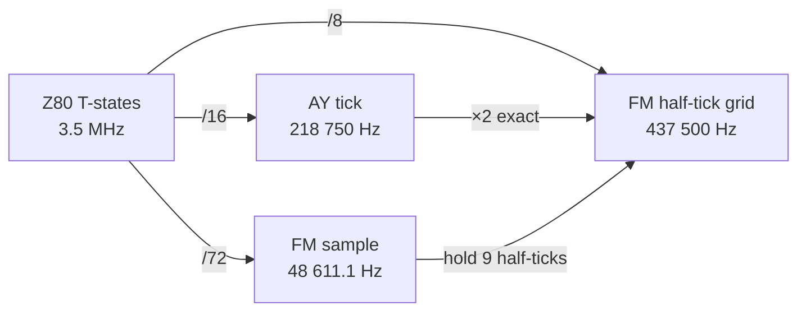
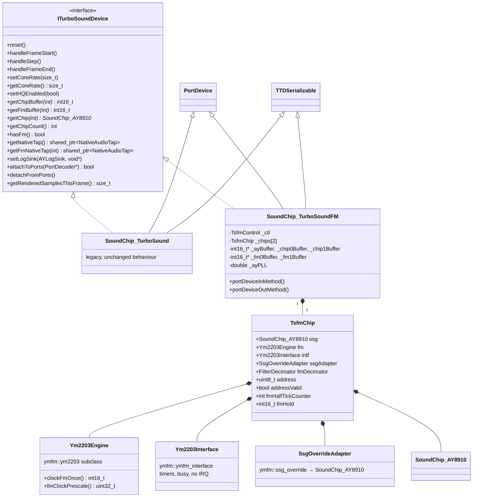
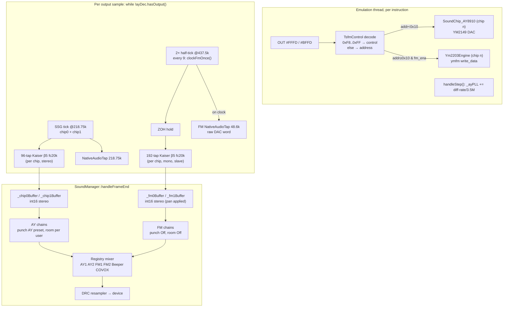
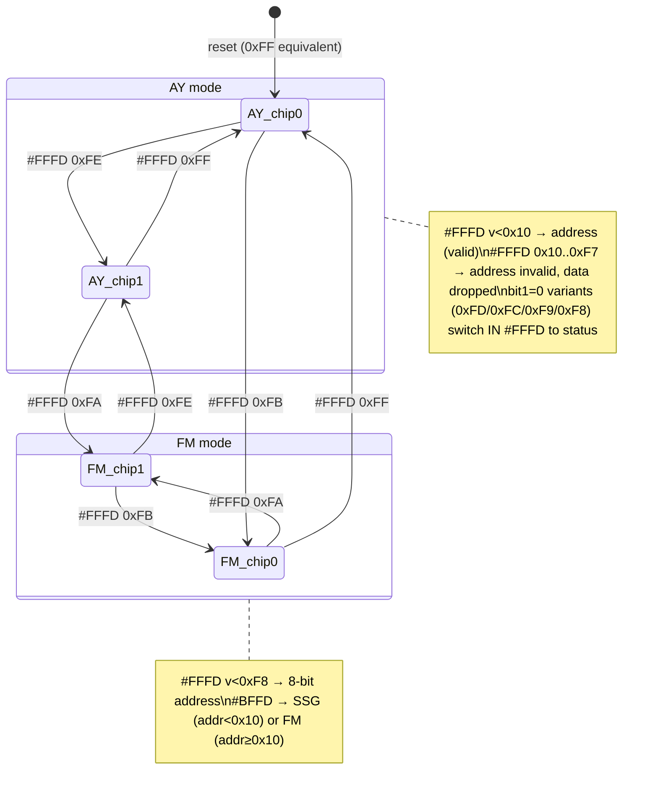

# TurboSound FM (2×YM2203) — Technical Design

**Status:** design, ready for implementation
**Scope:** `SoundChip_TurboSoundFM` — an autonomous, in-place replaceable TurboSound device with FM synthesis
**Out of scope (separate documents):** wide-mix + soft limiter in `SoundManager` (`docs/…/mixer-wide-limiter.md`, TBD), T-state-stamped port write queue (`docs/…/port-write-queue.md`, TBD)
**Ground truth used:** `core/src/emulator/sound/chips/soundchip_turbosound.{h,cpp}`, `soundchip_ay8910.{h,cpp}`, `common/sound/filters/filter_decimator.h`, `fir_designer.h`, `audio_character_chain.{h,cpp}`, `soundmanager.{h,cpp}`, `debugger/ttd/ttdserializable.h`; ymfm `src/ymfm_opn.{h,cpp}`, `ymfm_ssg.h`, `ymfm.h`; MiSTer `rtl/turbosound.sv` + `ZX-Spectrum.sv` (alfishe fork)

---

## 0. Decisions already taken

| # | Decision | Rationale |
|---|---|---|
| D1 | The chip is **YM2203 (OPN)**, not OPL2. FM core = **ymfm** (`ymfm::ym2203`, BSD-3). Nuked-OPN2 is YM2612 and does not apply. | Register map, timers, prescaler, SSG-EG, CSM all match the board. jt03 in the MiSTer fork is the RTL twin → co-sim oracle. |
| D2 | `SoundChip_TurboSoundFM` is a **fully autonomous device** behind a new `ITurboSoundDevice` interface. Selected by config; switch happens **only at sound-stack rebuild / reset**. | In-place replacement; no runtime dual-object juggling. |
| D3 | FM enters the `SoundManager` registry as **separate sources `FM1` / `FM2`**; per-chip AY buffers are unchanged. | Independent mute/solo/meters/recording; AY-only captures stay possible. |
| D4 | FM renders on a **437.5 kHz grid** (2 half-ticks per 218.75 kHz AY tick) as a zero-order-hold of the 48 611.1 Hz DAC stream, then a **192-tap Kaiser β=5, fc=20 kHz** decimator — the same response shape as the shipped 96-tap AY filter. | Exact ratio 4.5 → 9 half-ticks; identical "gentle" character for AY and FM. |
| D5 | SSG side of each YM2203 is the **existing `SoundChip_AY8910`** (model `YM2149`) via ymfm's `ssg_override`. ymfm's own SSG never runs. | Keeps native tick, DAC tables, per-channel controls, TTD, AY log tap. |
| D6 | FM output bypasses **punch and room** by default (own `AudioCharacterChain` instances, both stages Off). | Punch is a +6 dB/oct tilt for square waves; room is a comb filter on mono-centred material. |
| D7 | Acceptance criterion for in-place replacement: with `fm_ena = 0` and only AY-legal register traffic, `SoundChip_TurboSoundFM` output is **bit-identical** to `SoundChip_TurboSound`. | Regression-safe swap. |

---

## 1. Hardware ground truth

### 1.1 Board

TurboSound FM (NedoPC, LVD/CHRV/JTN, 2005): two YM2203 wired TurboSound-style, plugged into the AY socket through an adapter. Software support: Shiru (TFM Music Maker), ALCO (TFM programming manual). Emulated in Unreal Speccy since 2005 (Dexus).

### 1.2 Clock

YM2203 master clock **3.5 MHz** (MiSTer: `ce_ym` = 56 MHz / 16). With the default prescaler (/6 FM, /4 SSG):

| Path | Formula | Value |
|---|---|---|
| SSG effective clock (YM2149-equivalent) | `3.5 MHz · 2 / 4` | **1.75 MHz** = existing AY clock, tone/noise tick 218 750 Hz |
| FM sample rate | `3.5 MHz / (6 · 12)` | **48 611.1 Hz** (period 20.571 µs = 72 T-states) |
| FM period in AY ticks | `218 750 / 48 611.1` | **4.5** → 9 half-ticks at 437.5 kHz |
| Busy after data write (ymfm) | `32 · 6 = 192` clocks | 54.9 µs |
| Timer A/B resolution | 12 · prescale clocks | 20.571 µs |

### 1.3 Port protocol (from `rtl/turbosound.sv`)

Port `#FFFD` write with `value & 0xF8 == 0xF8` is a **control word**, never forwarded to a chip:

```
bit 0  chip select        1 = chip 0 ("first", legacy 0xFF)   0 = chip 1 (legacy 0xFE)
bit 1  stat_sel           1 = IN #FFFD returns selected register (AY behaviour, default)
                          0 = IN #FFFD returns YM2203 status (busy | timer B | timer A)
bit 2  ~fm_ena            1 = AY mode (default)   0 = FM mode
```

Reset state: chip 0 selected, `stat_sel = 1`, `fm_ena = 0` — i.e. a plain TurboSound.

Port `#FFFD` write with `value < 0xF8` is a **register address**:

- FM mode: full 8-bit address latched (`0x00–0x0F` SSG, `0x10–0xF7` FM).
- AY mode: latched **only if `value < 0x10`**; otherwise **no register is selected** and subsequent `#BFFD` data writes are **dropped** until a valid address arrives (`ym_acc` in RTL). *Legacy `SoundChip_AY8910::setRegister` keeps the previous register instead — see §11 for the bit-identity implication.*

Port `#BFFD` write: data to the latched address of the selected chip.

Port `#FFFD` read: `stat_sel ? read_register(addr) : read_status()`. Register reads above `0x0F` return `0x00` (ymfm `read_data`), the AY path returns whatever `SoundChip_AY8910::readCurrentRegister` returns today.

Chip index naming: this document and unreal-ng use **chip 0 = bit0 = 1** (legacy `0xFF → _chip0`). The RTL instance names are inverted (`ym2203_0` has `cs_n(ay_select)`); that is naming only.

### 1.4 Analog mix (RTL model, `turbosound.sv`)

```
psg_l = 2·A + B        psg_r = 2·C + B        (ABC; ACB swaps B/C)     A,B,C: 0..255 unipolar, both chips summed & saturated
opn_s = opn0[15:6] + opn1[15:6]               (±512 per chip, mono)
L = psg_l + (fm_ena ? opn_s : 0)              R = psg_r + (fm_ena ? opn_s : 0)
```

Consequences used below: FM is **mono, centred, both chips summed**; FM full scale per chip ≈ peak-to-peak of one SSG channel at full volume; FM audio is **gated by `fm_ena`** (kept as the default behaviour, configurable).

---

## 2. YM2203 vs AY-3-8910 / YM2149 — what actually differs

### 2.1 SSG part (registers 0x00–0x0F) — what the emulator must change

| Aspect | AY-3-8910 | YM2149 | YM2203 SSG | unreal-ng consequence |
|---|---|---|---|---|
| Register map R0–R15 | identical | identical | identical | none |
| Volume DAC curve | 16 steps (pairs of 5-bit) | 32-step, smoother log | **YM2149 curve** | `setChipModel(AYChipModel::YM2149)` on both chips when TSFM |
| Envelope resolution | 16 effective levels | 32 levels | 32 levels | already handled by `YM_DAC_TABLE` (32 entries) |
| Clock divider | /16 for tone, /256 env | /16 (or /8 with SEL pin) | internal SSG prescaler /4 then /8 ⇒ **behaves as YM2149 at master/2** | with 3.5 MHz master this equals 1.75 MHz — no change to tick rate |
| Prescaler runtime change | n/a | n/a | regs `0x2D/0x2E/0x2F` change SSG clock (×2 / ×3 relative) | not supported; log warning (§9.4) |
| Noise LFSR | 17-bit, taps 0,3 | same | same | none |
| I/O ports R14/R15 | present (8912: A only) | present | present, pins unused on TSFM | reads return existing behaviour |
| Invalid register select (≥16) | chip deselected, writes ignored | same | address latch is 8-bit; in AY mode the **board** blocks it | TSFM implements "no register selected"; see §11 |
| Analog outputs | 3 separate current outputs | 3 separate | 3 separate | same ABC/ACB panning as today |

Net: the SSG is **already emulated** — only the DAC model flag and the address-latch semantics differ.

### 2.2 FM part — what is new

| Feature | YM2203 |
|---|---|
| Channels / operators | 3 channels × 4 operators, 8 algorithms, feedback on operator 1 |
| Frequency | F-number (11-bit) + block (3-bit) per channel; channel 3 has per-operator F-num/block in "3-slot mode" (reg `0x27`) |
| Envelope | per operator: AR, D1R, D2R, RR, D1L (sustain level), TL, key-scale (KS/RS), **SSG-EG** (regs `0x90–0x9E`) |
| Detune / multiple | DT (3-bit signed) and MUL (4-bit) per operator |
| LFO | **none** (unlike YM2612/YM2608) → no AMS/PMS/FMS |
| Stereo | **none**, single mono output |
| Key on/off | reg `0x28`: channel + per-operator key bits; ymfm handles the internal key-on delay |
| CSM mode | reg `0x27` mode bits: timer A can key channel 3 (speech synthesis mode) |
| Timers | timer A (10-bit), timer B (8-bit): regs `0x24–0x27`; flags in status; IRQ pin **not connected** on TSFM |
| Status byte | bit 7 busy, bit 1 timer B, bit 0 timer A (readable via `IN #FFFD` when `stat_sel = 0`) |
| Prescaler | regs `0x2D` (/6), `0x2E` (/3, only from /6), `0x2F` (/2) — address write alone, no data |
| Output DAC | serial to external **YM3014**: 10-bit mantissa + 3-bit exponent floating point, sample-and-hold (ZOH) at 48 611 Hz |
| Internal accumulator | 14-bit summed FM, no intermediate clipping (ymfm comment) |
| Write timing | address write then data write; datasheet asks ~12 / ~83 master clocks between writes; **real chips accept faster writes** — TFM players write pairs every ~7 µs. **Do not drop writes during busy**; only report the status bit. |

---

## 3. Rate arithmetic and why the 437.5 kHz grid



- On the AY tick grid the FM period is 4.5 ticks. Alternating 4/5-tick holds create a ±1.14 µs periodic jitter at 24.3 kHz; for an 8 kHz tone that is a sideband at 16.3 kHz at ≈ π·f·Δt ≈ **−31 dB**, inside the passband. Rejected.
- On the 437.5 kHz grid the FM period is exactly 9 half-ticks. Zero jitter.
- ZOH droop of a 48.6 kHz hold: −0.6 dB @ 10 kHz, −2.6 dB @ 20 kHz. This is the hardware's response; it is **not** compensated.
- ZOH images sit at 48.6 kHz ± f (≥ 28.6 kHz for f ≤ 20 kHz): removed by the 20 kHz decimator at every core rate ≤ 48 kHz; partially audible (authentically) at 96/192 kHz core rates with `extendedBandwidth`.

Decimator equivalence: `kaiser(96, 20000, 218750, 5)` and `kaiser(192, 20000, 437500, 5)` have the same normalised transition width (`Δf ≈ (A−8)/(2.285·N)·fs`) and stopband → identical magnitude response shape. FM gets "the same gentle filter", not a second character.

Lockstep: per output sample the AY decimator consumes `218750/rate` ticks and the FM decimator consumes `437500/rate` half-ticks. Structurally the FM decimator is driven as a **slave** (2 feeds per AY tick, output taken when the AY decimator fires), so equality is by construction, not by IEEE coincidence.

---

## 4. Component architecture

### 4.1 Class diagram



### 4.2 Files

```
core/src/3rdparty/ymfm/                      vendored: ymfm.h ymfm_fm.h ymfm_fm.ipp ymfm_opn.{h,cpp}
                                              ymfm_ssg.{h,cpp} ymfm_misc.{h,cpp} ymfm_adpcm.{h,cpp}  (+ LICENSE)
                                              (opn.cpp pulls adpcm/misc for 2608/2610 — keep them, or trim under a local patch note)
core/src/emulator/sound/chips/iturbosounddevice.h
core/src/emulator/sound/chips/soundchip_turbosoundfm.{h,cpp}
core/src/emulator/sound/chips/tsfm/ym2203_engine.h          Ym2203Engine (ymfm subclass), Ym2203Interface
core/src/emulator/sound/chips/tsfm/tsfm_ssg_override.h      SsgOverrideAdapter
core/src/common/sound/filters/filter_decimator.h            + inputRate parameter, slave mode
core/src/emulator/sound/soundmanager.{h,cpp}                factory, FM1/FM2 sources, FM chains
core/src/emulator/config.{h,cpp}                            [SOUND] TurboSound = AY | FM
core/src/debugger/ttd/timetravelmanager.cpp                 capture via ITurboSoundDevice (slot TurboSound or TSFM)
THIRD_PARTY_NOTICES.md                                      ymfm BSD-3 entry
tests: core/tests/sound/tsfm_*.cpp                          see §12
```

### 4.3 Interface

```cpp
// core/src/emulator/sound/chips/iturbosounddevice.h
#pragma once
#include <cstdint>
#include <memory>
#include "emulator/sound/chips/soundchip_ay8910.h"   // SoundChip_AY8910, AYLogSink
#include "emulator/sound/native_audio_tap.h"
#include "debugger/ttd/ttdserializable.h"

class PortDecoder;

/// Common contract of the TurboSound-class devices owned by SoundManager.
/// SoundManager, TTD and the analyzers talk only to this; the concrete device
/// is chosen once, at sound-stack construction ([SOUND] TurboSound = AY | FM).
class ITurboSoundDevice : public ttd::TTDSerializable
{
public:
    ~ITurboSoundDevice() override = default;

    // Lifecycle (emulation thread)
    virtual void reset() = 0;
    virtual void handleFrameStart() = 0;
    virtual void handleStep() = 0;
    virtual void handleFrameEnd() = 0;

    // Rate / quality — construction / rebuild only
    virtual void setCoreRate(size_t rate) = 0;
    virtual size_t getCoreRate() const = 0;
    virtual void setHQEnabled(bool enabled) = 0;

    // Frame buffers, interleaved int16 stereo, rendered so far this frame
    virtual size_t getRenderedSamplesThisFrame() const = 0;
    virtual int16_t* getChipBuffer(int chip) = 0;          // SSG per chip (existing semantics)
    virtual int16_t* getFmBuffer(int chip) { return nullptr; }   // FM per chip; nullptr when !hasFm()
    virtual bool hasFm() const { return false; }

    // Chip access for monitors / debugger
    virtual SoundChip_AY8910* getChip(int chip) const = 0;
    virtual int getChipCount() const = 0;

    // Taps
    virtual std::shared_ptr<NativeAudioTap> getNativeTap() const = 0;               // 218.75 kHz SSG, both chips summed
    virtual std::shared_ptr<NativeAudioTap> getFmNativeTap(int chip) const { return nullptr; } // 48 611 Hz raw DAC words
    virtual void setLogSink(AYLogSink sink, void* context) = 0;

    // Ports
    virtual bool attachToPorts(PortDecoder* decoder) = 0;
    virtual void detachFromPorts() = 0;

    // Identity for TTD slot selection and UI
    virtual ttd::PeripheralId peripheralId() const = 0;   // TurboSound or TSFM
};
```

`SoundChip_TurboSound` gets `: public ITurboSoundDevice` and `peripheralId()` — no behavioural change. `SoundManager::_turboSound` becomes `ITurboSoundDevice*`; `getTurboSound()` returns the interface. TTD `CapturePeripheral` already works on `TTDSerializable`; the checkpoint slot is chosen from `peripheralId()`.

### 4.4 Selection

```ini
[SOUND]
; AY  = TurboSound (2×AY/YM, legacy device, default)
; FM  = TurboSound FM (2×YM2203)
TurboSound = FM
; FM audio audible only while FM mode is enabled on the board (RTL behaviour). 1 = gate (default), 0 = always pass
TSFM_GateFmByMode = 1
; FM level relative to SSG, dB (0 = calibrated hardware ratio, §7)
TSFM_FmTrimDb = 0
; FM chip panning: center (default, hardware) | split (chip0 L, chip1 R) | mono
TSFM_FmPan = center
```

```cpp
// soundmanager.cpp (constructor)
switch (_context->config.sound.turboSound)
{
    case TurboSoundKind::FM: _turboSound = new SoundChip_TurboSoundFM(_context); break;
    default:                 _turboSound = new SoundChip_TurboSound(_context);   break;
}
_turboSound->setCoreRate(_coreRate);

_devices.push_back({AudioSourceType::AY1_All, "AY 1", ...});
if (_turboSound->getChipCount() > 1) _devices.push_back({AudioSourceType::AY2_All, "AY 2", ...});
if (_turboSound->hasFm())
{
    _devices.push_back({AudioSourceType::FM1, "FM 1", false, false, 1.0f, 0.0f, false});
    _devices.push_back({AudioSourceType::FM2, "FM 2", false, false, 1.0f, 0.0f, false});
}
```

`AudioSourceType` gains `FM1, FM2` (append before `Custom`; the enum is shared with recording, so append, do not reorder).

---

## 5. Data flow



---

## 6. Rendering

### 6.1 `FilterDecimator` extension

Keep `(218750, Reference)` bit-identical (asserted by `fir_designer_test.cpp`). Add an input-rate parameter and a slave mode.

```cpp
class FilterDecimator
{
public:
    enum class Quality { Reference, HighFidelity };
    static constexpr double DEFAULT_INPUT_RATE = 218750.0;
    static constexpr size_t MAX_TAPS = 384;     // 192 taps × HighFidelity at 437.5 kHz

    /// inputRate: generator rate the FIR is designed for. Tap count scales with
    /// inputRate/218750 so that the transition width in Hz is identical at any
    /// input rate (96 @218.75k ≡ 192 @437.5k).
    void configure(double outputRate, Quality quality = Quality::Reference,
                   bool extendedBandwidth = false, double inputRate = DEFAULT_INPUT_RATE)
    {
        double fc = 20000.0;
        if (extendedBandwidth) { if (outputRate >= 176400.0) fc = 80000.0; else if (outputRate >= 88200.0) fc = 40000.0; }
        if (fc >= outputRate / 2.0) fc = 0.45 * outputRate;

        const size_t baseTaps = (quality == Quality::HighFidelity) ? 192 : 96;
        const double beta     = (quality == Quality::HighFidelity) ? 9.0 : 5.0;
        _taps = static_cast<size_t>(std::lround(baseTaps * inputRate / DEFAULT_INPUT_RATE));
        _inputRate = inputRate;
        _coeffs = FirDesigner::kaiser(_taps, fc, inputRate, beta);
        _samplesPerOutput = inputRate / outputRate;
        reset();
    }

    /// Slave mode: no phase accumulator. The owner feeds samples and calls
    /// getOutput() exactly when the master decimator fires.
    void setSlave(bool slave) { _slave = slave; }

    void feedSample(double s)
    {
        _buffer[_bufferIndex] = s;
        _bufferIndex = (_bufferIndex + 1) % MAX_TAPS;
        if (!_slave) _phase += 1.0;
    }
    bool hasOutput() const { return _slave ? true : _phase >= _samplesPerOutput; }
    double getOutput()
    {
        if (!_slave) _phase -= _samplesPerOutput;
        double sum = 0.0; size_t idx = _bufferIndex;
        for (size_t i = 0; i < _taps; i++) { idx = idx ? idx - 1 : MAX_TAPS - 1; sum += _buffer[idx] * _coeffs[i]; }
        return sum;
    }
};
```

`MAX_TAPS` grows from 192 to 384 (`double[384]` = 3 KB per instance, 6 AY instances + 2 FM instances — fine). The modulo in `feedSample` with a non-power-of-two `MAX_TAPS` was already the case (192).

### 6.2 Per-chip state

```cpp
struct TsfmChip
{
    SoundChip_AY8910      ssg;              // existing PSG, model YM2149
    Ym2203Interface       intf;             // timers / busy
    Ym2203Engine          fm{intf};         // ymfm::ym2203 subclass
    SsgOverrideAdapter    ssgAdapter{ssg};  // registers 0x00-0x0F → ssg
    FilterDecimator       fmDecimator;      // 437.5k → core, slave, mono
    std::shared_ptr<NativeAudioTap> fmTap = std::make_shared<NativeAudioTap>();

    uint8_t  address      = 0;              // latched register address (8-bit)
    bool     addressValid = true;           // false after an out-of-range select in AY mode
    int      fmHalfTicks  = 0;              // 0..fmPeriodHalfTicks-1
    int      fmPeriodHalfTicks = 9;         // 12·prescale / 8  (prescale 6 → 9)
    double   fmHold       = 0.0;            // current DAC value, ±1.0
};
```

### 6.3 Tick loop (HQ path)

Structure mirrors `SoundChip_TurboSound::handleStep`: `_ayPLL` free-running across frames (audio-sync Fix 1), speed multiplier applied to T-states, buffers bounded by `MAX_SAMPLES_PER_FRAME`.

```cpp
void SoundChip_TurboSoundFM::renderOneSampleHQ(bool tapActive)
{
    TsfmChip& c0 = _chips[0];
    TsfmChip& c1 = _chips[1];

    // Master: chip 0 SSG left decimator (as in the legacy device)
    while (!c0.ssg.decimatorLeft().hasOutput())
    {
        // ---- SSG tick @ 218.75 kHz (both chips, bypass internal /8 prescaler)
        c0.ssg.updateState(true);
        c1.ssg.updateState(true);
        if (tapActive)
            _nativeTap->push(float(c0.ssg.mixedLeft() + c1.ssg.mixedLeft()),
                             float(c0.ssg.mixedRight() + c1.ssg.mixedRight()));
        c0.ssg.decimatorLeft().feedSample(c0.ssg.mixedLeft());
        c0.ssg.decimatorRight().feedSample(c0.ssg.mixedRight());
        c1.ssg.decimatorLeft().feedSample(c1.ssg.mixedLeft());
        c1.ssg.decimatorRight().feedSample(c1.ssg.mixedRight());

        // ---- FM: two half-ticks @ 437.5 kHz per SSG tick, both chips
        for (int h = 0; h < 2; h++)
        {
            fmHalfTick(c0);
            fmHalfTick(c1);
        }

        // ---- Timers / busy advance by 16 chip clocks (3.5 MHz / 218.75 kHz)
        c0.intf.advanceClocks(16);
        c1.intf.advanceClocks(16);
    }

    const float a0L = c0.ssg.decimatorLeft().getOutput(),  a0R = c0.ssg.decimatorRight().getOutput();
    const float a1L = c1.ssg.decimatorLeft().getOutput(),  a1R = c1.ssg.decimatorRight().getOutput();
    const float f0  = c0.fmDecimator.getOutput() * _fmGain;   // slave: taken at the same instant
    const float f1  = c1.fmDecimator.getOutput() * _fmGain;

    storeStereo(_chip0Buffer, a0L, a0R);
    storeStereo(_chip1Buffer, a1L, a1R);
    storeFm(_fm0Buffer, f0, _ctl.fmEnabled);
    storeFm(_fm1Buffer, f1, _ctl.fmEnabled);
    storeStereo(_ayBuffer, a0L + a1L, a0R + a1R);      // legacy combined SSG buffer (getAudioBuffer)
    _ayBufferIndex += AUDIO_CHANNELS;
}

inline void SoundChip_TurboSoundFM::fmHalfTick(TsfmChip& c)
{
    if (c.fmHalfTicks == 0)
    {
        const int16_t word = c.fm.clockFmOnce();     // 14-bit sum → YM3014 10.3 fp roundtrip → int16
        c.fmHold = word / 32768.0;
        if (c.fmTap->isActive()) c.fmTap->push(float(c.fmHold), float(c.fmHold));   // raw DAC stream, 48 611 Hz
    }
    c.fmDecimator.feedSample(c.fmHold);              // ZOH: same value for all 9 half-ticks
    if (++c.fmHalfTicks >= c.fmPeriodHalfTicks) c.fmHalfTicks = 0;
}

inline void SoundChip_TurboSoundFM::storeFm(int16_t* buf, float mono, bool audible)
{
    const float v = audible || !_gateFmByMode ? mono : 0.0f;
    buf[_ayBufferIndex]     = static_cast<int16_t>(std::clamp(v * _fmPanL, -1.0f, 1.0f) * INT16_MAX);
    buf[_ayBufferIndex + 1] = static_cast<int16_t>(std::clamp(v * _fmPanR, -1.0f, 1.0f) * INT16_MAX);
}
```

Order inside a tick is fixed: SSG generators, then FM half-ticks, then timers. The FM clock happens on half-tick 0 of every 9, so it is phase-locked to the SSG tick grid at T-state 0 of the frame after `reset()`; that also matches how the RTL shares one `ce_ym`.

### 6.4 LQ path

Same boxcar structure as the legacy LQ path. FM in LQ mode: average `fmHold` over the half-ticks of the output period (a 437.5 kHz boxcar of ~9.9 samples), i.e. no FIR. Per-chip attribution is exact here (separate accumulators), unlike the legacy LQ path's ratio approximation for SSG, which is kept as-is for bit-identity of the AY buffers.

### 6.5 Native tap for FM

The FM tap is **not** merged into the 218.75 kHz SSG tap (that would need a 437.5→218.75 halfband and would mislabel the rate). It is a separate `NativeAudioTap` per chip at **48 611.1 Hz**, carrying the exact DAC words (post `roundtrip_fp`) — the lossless archival form of the FM stream. Consumers reconstruct the ZOH offline.

---

## 7. Gain staging

Reference: RTL mix (§1.4). One SSG channel at full volume: 0..255 → `2·A` = 0..510 into L. One FM chip: ±512. Hence **FM full-scale amplitude ≈ one SSG channel's full peak-to-peak**.

unreal-ng SSG domain: `mixedLeft = Σ dac·pan / 3` then DC-blocked → one channel at full volume contributes ±1/6 (pan 1.0). Therefore:

```
_fmGain = (1/3) · 10^(TSFM_FmTrimDb / 20)        // FM word ±32767 → ±1/3 in the pre-int16 domain
```

Sums: 2 SSG chips up to ±1.0 + 2 FM chips ±0.67 → the current saturating-int16 registry mix **will clip** on loud TFM material. This is the documented prerequisite: **wide mix + soft limiter** (separate document, port of `audio_mix.sv`). Until it lands, FM1/FM2 registry volumes default to `1.0` and the operator can trim; the design does not silently lower FM to fit.

Panning: `center` → `_fmPanL = _fmPanR = 1.0` (hardware: both chips summed to both channels). `split` (chip0 → L, chip1 → R, a listening option, not hardware) and `mono` are UI choices.

No DC blocker on FM: ymfm output is symmetric around 0; the YM3014 DC offset is removed by the board's coupling capacitors.

---

## 8. Port state machine



```cpp
struct TsfmControl
{
    uint8_t chip      = 0;      // 0 = bit0 set
    bool    statusRead = false; // bit1 == 0
    bool    fmEnabled  = false; // bit2 == 0
};

void SoundChip_TurboSoundFM::portDeviceOutMethod(uint16_t port, uint8_t value)
{
    switch (port)
    {
        case PORT_FFFD:
            if ((value & 0xF8) == 0xF8)
            {
                _ctl.chip       = (value & 0x01) ? 0 : 1;
                _ctl.statusRead = !(value & 0x02);
                _ctl.fmEnabled  = !(value & 0x04);
                // RTL: control word also clears the address accept latch
                _chips[_ctl.chip].addressValid = false;
            }
            else
            {
                TsfmChip& c = _chips[_ctl.chip];
                if (_ctl.fmEnabled || value < 0x10)
                {
                    c.address = value;
                    c.addressValid = true;
                    if (value < 0x10)  c.ssg.setRegister(value);
                    else               c.fm.write_address(value);   // also handles 0x2D-0x2F prescaler side effect
                }
                else
                {
                    c.addressValid = false;   // AY mode, address ≥ 0x10: nothing selected
                }
            }
            break;

        case PORT_BFFD:
        {
            TsfmChip& c = _chips[_ctl.chip];
            if (!c.addressValid) break;                 // dropped, as on the board
            if (c.address < 0x10) c.ssg.writeCurrentRegister(value);
            else                  c.fm.write_data(value); // ymfm routes ≥0x10 to the FM engine; SSG path unreachable here
            break;
        }
        default:
            return;
    }
    logWrite(port, value);   // §10
}

uint8_t SoundChip_TurboSoundFM::portDeviceInMethod(uint16_t port)
{
    if (port != PORT_FFFD) return 0xFF;
    TsfmChip& c = _chips[_ctl.chip];
    if (_ctl.statusRead) return c.fm.read_status();            // busy | timer B | timer A
    if (!c.addressValid) return 0xFF;
    if (c.address < 0x10) return c.ssg.readCurrentRegister();
    return 0x00;                                               // ymfm read_data semantics for FM registers
}
```

Note on `write_data` routing: ymfm's `ym2203::write_data` would forward `addr < 0x10` to `m_ssg` (the overridden SSG → our adapter). The code above short-circuits SSG writes directly to `SoundChip_AY8910` so the SSG path is byte-for-byte the legacy path (bit-identity, D7). The adapter still exists because ymfm's engine itself may touch SSG state on `reset()`.

---

## 9. ymfm integration

### 9.1 Engine subclass

```cpp
// tsfm/ym2203_engine.h
#include "ymfm_opn.h"

class Ym2203Engine : public ymfm::ym2203
{
public:
    explicit Ym2203Engine(ymfm::ymfm_interface& intf) : ymfm::ym2203(intf)
    {
        set_fidelity(ymfm::OPN_FIDELITY_MAX);   // irrelevant for clock_fm(), kept explicit
    }

    /// One FM sample: fm_engine clock + 14-bit sum + YM3014 10.3 fp round trip.
    int16_t clockFmOnce()
    {
        clock_fm();                              // protected in ymfm, accessible here
        return static_cast<int16_t>(m_last_fm.data[0]);
    }

    uint32_t fmClockPrescale() const { return m_fm.clock_prescale(); }   // 6 / 3 / 2
};
```

`clock_fm()` (ymfm): `m_fm.clock(ALL_CHANNELS); m_fm.output(m_last_fm.clear(), 0, 32767, ALL_CHANNELS); m_last_fm.roundtrip_fp();` — exactly the per-sample hardware pipeline; `generate()` and `m_ssg_resampler` are never called.

### 9.2 Interface: timers, busy, no IRQ

```cpp
class Ym2203Interface : public ymfm::ymfm_interface
{
public:
    // Called by the tick loop: 16 chip clocks per SSG tick
    void advanceClocks(int32_t clocks)
    {
        for (int t = 0; t < 2; t++)
            if (_timerRemaining[t] > 0 && (_timerRemaining[t] -= clocks) <= 0)
            {
                _timerRemaining[t] = 0;
                m_engine->engine_timer_expired(t);   // sets status flag; CSM key-on for ch3 if enabled
            }
        if (_busyRemaining > 0) _busyRemaining -= clocks;
    }

    void ymfm_set_timer(uint32_t tnum, int32_t duration_in_clocks) override
    {
        _timerRemaining[tnum] = duration_in_clocks;  // <0 = stop, per ymfm contract
    }
    void ymfm_set_busy_end(uint32_t clocks) override { _busyRemaining = clocks; }
    bool ymfm_is_busy() override { return _busyRemaining > 0; }
    void ymfm_update_irq(bool) override {}          // IRQ pin not wired on TSFM

    // TTD
    int32_t _timerRemaining[2] = {0, 0};
    int32_t _busyRemaining = 0;
};
```

Busy resolution is one SSG tick (16 clocks = 4.57 µs), finer than any Z80 OUT sequence can resolve. Writes are **never dropped** while busy (§2.2).

### 9.3 SSG override adapter

```cpp
class SsgOverrideAdapter : public ymfm::ssg_override
{
public:
    explicit SsgOverrideAdapter(SoundChip_AY8910& ssg) : _ssg(ssg) {}
    void    ssg_reset() override { _ssg.reset(); }
    uint8_t ssg_read(uint32_t reg) override { return _ssg.readRegister(uint8_t(reg & 0x0F)); }
    void    ssg_write(uint32_t reg, uint8_t data) override { _ssg.writeRegister(uint8_t(reg & 0x0F), data); }
    void    ssg_prescale_changed() override;   // §9.4
private:
    SoundChip_AY8910& _ssg;
};
// construction: fm.ssg_override(ssgAdapter);
```

### 9.4 Prescaler registers `0x2D/0x2E/0x2F`

ymfm updates `m_fm.clock_prescale()` on the **address write** and calls `ssg_prescale_changed()`. Effects on this design:

| Prescale | FM period (chip clocks) | half-ticks | SSG effective clock |
|---|---|---|---|
| 6 (default) | 72 | 9 | 1.75 MHz ✔ |
| 3 | 36 | 4.5 ✘ | 3.5 MHz |
| 2 | 24 | 3 | 5.25 MHz |

Policy: after any prescaler write recompute `fmPeriodHalfTicks = lround(12·prescale/8)` (6→9, 3→5 approximate, 2→3) and **log a warning once**; SSG clock changes are **not** modelled (would require re-ticking `SoundChip_AY8910` at 2×/3×). No known ZX software uses non-default prescalers; the RTL behaves identically only for /6. Tracked as a known limitation.

### 9.5 Vendoring

Copy `ymfm/src/*` to `core/src/3rdparty/ymfm/` (same layout as `blip_buf`), keep upstream `LICENSE`, add to `THIRD_PARTY_NOTICES.md`, record the upstream commit hash in a `VERSION` file. Compile `ymfm_opn.cpp`, `ymfm_ssg.cpp`, `ymfm_misc.cpp`, `ymfm_adpcm.cpp` (the last two are required by `ymfm_opn.cpp` for the 2608/2610 classes; not worth patching upstream). C++14 minimum — the core is already C++17/20.

---

## 10. Observability and state

### 10.1 AY log tap (MCP automation)

`AYLogRecord` already has 8-bit `reg`; add a mode flag so analyzers can separate streams:

```cpp
struct AYLogRecord
{
    ...
    uint8_t chip = 0;
    uint8_t reg  = 0;     // 0x00-0x0F SSG, 0x10-0xFF FM (TSFM)
    uint8_t value = 0;
    uint8_t flags = 0;    // bit0: FM mode active at the write; bit1: control word; bit2: dropped (no valid address)
};
```

Fired after the write, from `SoundChip_TurboSoundFM::logWrite`, same PC/tacts/frame fields as today.

### 10.2 TTD serialization (`PeripheralId::TSFM = 4`, already reserved)

Layout (fixed size, computed once in the constructor):

```
u8   control (chip | statusRead<<1 | fmEnabled<<2)
u8   gateFmByMode (config echo, for sanity)
per chip ×2:
  u8   address, u8 addressValid
  i32  fmHalfTicks, i32 fmPeriodHalfTicks, f64 fmHold
  i32  timerRemaining[2], i32 busyRemaining
  u32  ymfmStateSize, u8[ymfmStateSize]   ← ymfm::ymfm_saved_state (fixed for ym2203; size measured at construction by a dry save)
  <SoundChip_AY8910 TTD payload>            ← existing serializer
```

`ymfm_saved_state` writes into a `std::vector<uint8_t>`; keep one scratch vector per chip **reserved at construction** so `TTDSaveState` performs no allocation (TTD contract). Decimator/FIR state is not serialized — same policy as the AY decimators today. `_ayPLL` is not serialized either (same as legacy); after restore the sample PLL continues free-running.

### 10.3 Turbo / synthesis suppression

`SoundManager::_synthesisSuppressed` skips `handleStep()`. Port writes still hit registers immediately (both SSG and ymfm), so state stays coherent; timers and busy simply do not advance in that mode — identical to the AY envelope not advancing today. Acceptable and documented.

---

## 11. Bit-identity with the legacy device (D7)

Guaranteed identical, given `TurboSound = FM`, `fm_ena` never enabled, and register selects `< 0x10` or `∈ {0xFE, 0xFF}`:

- `_chip0Buffer`, `_chip1Buffer`, `_ayBuffer` (SSG tick loop, decimators, DC blockers, storage casts are the same code path);
- native 218.75 kHz tap; AY log records (`flags = 0`);
- **except** `AYChipModel`: TSFM forces `YM2149` on both chips. The identity test therefore sets the legacy device to `YM2149` too (the DAC table is a per-chip setting, not a rendering difference).

Deliberate differences (outside the identity envelope):
- register select `0x10–0xF7` in AY mode: legacy keeps the previous register and accepts following data; TSFM drops data until a valid select. The legacy behaviour is a candidate bug fix (real AY deselects), tracked separately; not changed here.
- `0xF8–0xFD` control words: legacy ignores them as chip switches (only `0xFE/0xFF`) and passes them to `setRegister`, which ignores them; TSFM interprets all eight.

---

## 12. Test plan

### 12.1 Unit (gtest, `core/tests/sound/`)

| Test | Asserts |
|---|---|
| `tsfm_port_decode` | Table-driven: every `0xF8–0xFF` sets (chip, statusRead, fmEnabled) per §1.3; `0x10–0xF7` in AY mode → `addressValid=false` and `#BFFD` dropped; in FM mode → 8-bit address latched and ymfm receives the data (spy on `m_fm.regs()` via a test subclass) |
| `tsfm_status_read` | after data write `read_status() & 0x80` for 192 clocks (12 ticks) then 0; timer A programmed with N → flag after `(1024−N)·72` clocks ±16; `stat_sel=1` returns SSG register |
| `tsfm_bit_identity` | Same random AY-legal port stream (10 000 writes, 200 frames, seeds fixed) into `SoundChip_TurboSound` and `SoundChip_TurboSoundFM`, both `YM2149`, HQ and LQ, core 44100/48000/96000: `memcmp` of chip0/chip1/ay buffers and native tap == 0 |
| `filter_decimator_equivalence` | `kaiser(192,20k,437500,5)` vs `kaiser(96,20k,218750,5)`: magnitude response sampled at 0..40 kHz differs < 0.05 dB in passband, < 1 dB in transition; existing golden test for (218750, Reference) unchanged |
| `filter_decimator_slave_lockstep` | 1 M ticks: slave `getOutput()` count == master count, and a 437.5 kHz impulse train vs 218.75 kHz impulse train yield time-aligned peaks |
| `tsfm_fm_period` | With prescale 6, `clockFmOnce()` call count over 1 s of ticks == 48 611 ± 1 |
| `tsfm_ttd_roundtrip` | Save state mid-note, play 5 frames, restore, play 5 frames → buffers identical to uninterrupted run |
| `tsfm_gain_reference` | Full-scale FM square (TL=0, algorithm 7 single carrier, F-num for ~1 kHz) vs SSG channel A vol 15 tone: peak ratio 1.0 ± 5 % before chains |

### 12.2 Spectral (numpy/scipy scripts in `docs/inprogress/…/tools/`)

- **Jitter guard:** 8 kHz FM sine at 44.1k core → FFT (Blackman-Harris, 2^18): no spur within 4–20 kHz above **−80 dBFS** except harmonics of the OPN sine table. This is the test that would have caught the 4/5-tick alternative (−31 dB spur at 16.3 kHz).
- **ZOH droop:** swept sine 100 Hz–20 kHz → level curve within 0.2 dB of `sinc(f/48611)` × Kaiser response.
- **Image rejection at 44.1k/48k:** 20 kHz FM sine → content 22–24 kHz (aliased into 20–22 kHz) below −50 dBFS (the "gentle" filter's known figure).

### 12.3 Oracle: jt03 co-simulation (Verilator, existing debug_hub harness)

Feed identical timestamped register streams (from `AYLogRecord` capture of `ts_my.trd` and TFM modules) to the MiSTer `turbosound.sv` under Verilator and to `SoundChip_TurboSoundFM`; compare the raw 48 611 Hz FM DAC tap word-for-word against `fm_snd` sampled at the jt03 sample strobe. Expected: bit-exact for the main path; document any per-sample differences (jt03 and ymfm are independent reverse-engineerings — divergences are findings, not necessarily bugs on our side). Same for the SSG tap vs `psg_A/B/C`.

### 12.4 Integration / listening

- `testdata/sound/turbosound/ts_my.trd` — must sound identical in AY mode (regression).
- TFM modules + Shiru's TFM player (`.tfc`) on Pentagon 128: key-on timing, SSG+FM balance, no clipping with FM1/FM2 at 1.0 once the limiter lands; before that, trim −6 dB and document.
- Mode switching mid-tune (`0xFF` ↔ `0xFB`): FM gating with `TSFM_GateFmByMode = 1` must not click (the gate is applied to the decimated buffer; if a click is audible, gate at the ZOH input instead — decide by measurement).
- Core rates 44.1/48/96/192: no rate-dependent level or timbre change beyond the documented ZOH images at ≥ 88.2k with extended bandwidth.

### 12.5 Performance

Benchmark (existing `benchmark` submodule): per-frame cost with TSFM vs legacy TurboSound at 44.1k HQ. Budget: **≤ +60 µs/frame** (2 × 48.6k `clock_fm` + 2 × 192-tap FIR at 44.1k + 875 k `feedSample`s/s). Reference: frame ≈ 821 µs today.

---

## 13. Implementation plan

```mermaid
gantt
    dateFormat  X
    axisFormat  %s
    section Foundations
    Vendor ymfm, THIRD_PARTY_NOTICES, build            :a1, 0, 1
    ITurboSoundDevice + legacy adopts it (no behaviour change) :a2, 1, 2
    FilterDecimator inputRate + slave + tests          :a3, 2, 3
    section Device
    TsfmControl + port decode + unit tests             :b1, 3, 4
    TsfmChip: SSG override, Ym2203Engine, Interface    :b2, 4, 5
    Tick loop HQ/LQ, FM buffers, native FM tap         :b3, 5, 7
    Bit-identity test green                            :b4, 7, 8
    section Integration
    SoundManager: config, FM1/FM2 sources, FM chains   :c1, 8, 9
    TTD serialization + roundtrip test                 :c2, 9, 10
    AY log flags, analyzer update                      :c3, 10, 11
    section Verification
    Spectral scripts                                   :d1, 11, 12
    jt03 co-sim                                        :d2, 12, 14
    Listening + gain calibration                       :d3, 14, 15
```

Each step ends with `ctest` green; step b4 is the gate before any SoundManager change.

---

## 14. Known limitations and open items

1. **Non-default prescaler** (§9.4): FM period approximated, SSG clock not modelled. Warning logged.
2. **Write timing**: register writes land immediately; generators catch up per output sample (≤ 22.7 µs at 44.1k, ≤ 1 FM sample). Inherited from the legacy device; addressed by the port-write-queue document.
3. **Mixer headroom**: FM1+FM2+AY1+AY2 exceeds int16 saturating mix; addressed by the wide-mix + soft-limiter document. Until then FM registry volume is a manual trim.
4. **Analog output stage** (YM3014 → op-amp → RC): not modelled, matching the RTL. If a measurement of the real board becomes available, a single one-pole at 437.5 kHz before the decimator is the only addition needed.
5. **FM gating semantics**: RTL gates FM audio by `fm_ena`; whether the physical board does so is unverified. Configurable (`TSFM_GateFmByMode`), default follows the RTL.
6. **TSFM Pro / ZX MultiSound variants** (YM2203 + SAA1099 on the same `#FFFD` control space, `0xF7`/`0xFF` toggles for SAA): out of scope; the control decode leaves room (`0xF0–0xF7` currently treated as plain addresses, which is also what the board does when SAA is absent).
7. **Status read while `addressValid = false` in AY mode**: returns `0xFF`; real AY returns `0xFF` on an unselected chip — consistent, but unverified against the board's bus buffering.
