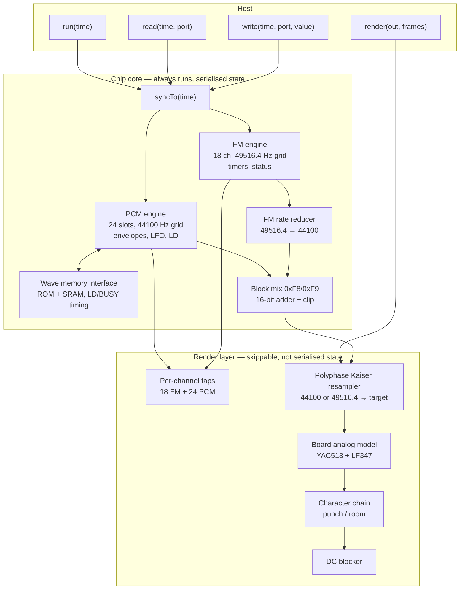

# libopl4 — YMF278B (OPL4) emulation core + high-quality render layer

**Revision 1** (2026-09-13).
**Status (updated 2026-09-14):** implemented, integrated and verified. The
library lives at `tools/poc/015-opl4-synthesis` (temporary home — already a
dependency of the emulator core via `core/src/CMakeLists.txt`, migration to
`core/src/3rdparty` pending) and is compiled into the emulator behind the
public `UNREALNG_HAVE_OPL4` gate. Since this draft was written the model was
audited against openMSX with four semantics fixed (LD status bit, LD window,
NEW2 write gate, stored-complement loop end) and the FM side gained an
in-tree ymfm differential backend — both recorded in
`opl4-openmsx-audit-and-diff-harness.md`, which is authoritative where it
post-dates this document. Verified end to end on the card author's 26-disk
corpus (FM + PCM) — `opl4-unreal-ng-integration.md` §12.6. The §-numbered
text below is the original design draft kept for rationale and traceability.
**Scope:** a standalone library. Chip model, memory interface, render/resample stage, character chain, determinism contract, test plan.
**Out of scope:** host integration, mixing with other devices, config plumbing — see [opl4-unreal-ng-integration.md](docs/inprogress/2026-09-13-moonsound/opl4-unreal-ng-integration.md).
**Non-goal:** licensing analysis.

Glossary at the end (§15).

---

## 0. Requirements

| # | Requirement | Rationale |
|---|---|---|
| R1 | Model the **YMF278B** as fitted on [ZXM-MoonSound](http://micklab.ru/My%20Soundcard/ZXMMoonSound.htm): 33.8688 MHz master clock, external wave memory, YAC513-class output. | The only hardware target that matters. |
| R2 | Chip behaviour accurate to the best of the currently-known record: datasheet + published hardware recordings + accumulated fixes from [openMSX](https://github.com/openMSX/openMSX)/[VGMPlay](https://github.com/ValleyBell/vgmplay) lineage. | "Sounds roughly right" is not the bar. |
| R3 | **Deterministic and fully serialisable.** Save is side-effect free; restore is exact; a replay from a checkpoint reproduces the original run sample-for-sample. | Time-travel debugging in the host. |
| R4 | The chip model is advanced on an **arbitrary external time axis** supplied by the host (nanoseconds or host clock ticks), not on an internal sample counter. | Register writes must land at the right chip phase regardless of host frame structure. |
| R5 | Render to **any output rate** (44.1 / 48 / 88.2 / 96 / 176.4 / 192 kHz) with filter character matched to the existing AY chain: runtime-designed Kaiser windowed-sinc, 20 kHz default cutoff. | Consistent tonal character across all chips in the host. |
| R6 | **Unity bypass**: at 44100 Hz output the render path is bit-identical to the raw chip stream. | 44.1 kHz is the chip's native rate; any processing there is damage. |
| R7 | Per-channel output taps: 18 FM channels and 24 PCM slots individually addressable for mute, solo, metering and recording. | Host mixer and debugger requirements. |
| R8 | The chip core must run even when audio output is discarded (turbo, sound off). | Busy flags, timers and the LD counter are guest-visible. |
| R9 | Optional **character chain** (punch, room) as a post stage, off by default, with presets appropriate to FM and PCM material. | Parity with the AY/Paula chain. |
| R10 | No dependency beyond the C++ standard library. No allocation on the audio path after `configure()`. | Embeddability. |

---

## 1. Decisions

| # | Decision | Why |
|---|---|---|
| D1 | **Two clock domains, modelled explicitly.** FM phase/envelope generation on the 33868800/684 ≈ 49516.4 Hz grid; PCM generation and the chip's own output on 33868800/768 = 44100 Hz. These two rates are fixed properties of the silicon and are **not** the library's output rate: the render layer (§8.2) converts to any supported rate — 44100, 48000, 88200, 96000, 176400, 192000 — with 44100 taking the bit-exact bypass path. | This is the physical structure of the chip and the single largest deviation of OPL4 from OPL3. Collapsing the two grids is what makes existing OPL4 emulations pitch-wrong. Conflating the chip grid with the output rate is the other common mistake — it forces the host to run at 44100 or silently re-rates the chip. |
| D2 | The chip's internal **49.5 kHz → 44.1 kHz reducer is a modelled component**, not an implementation detail of the resampler. It sits inside the chip boundary. Silicon architecture confirms **`HoldDrop` (Zero-Order Hold with phase-accumulator drop on the 64/57 ratio)** as the authentic hardware implementation. | It is part of the OPL4 sound. The 1993 Yamaha die has no FIR decimator or interpolation multiplier on the FM path; the DAC simply samples the FM accumulator on the 44.1 kHz grid ($768$ master clocks), dropping 7 FM samples every 57 output ticks. It must be present in `Authentic` mode and bypassable in `HiFi` mode. |
| D3 | FM engine and PCM engine are **separate classes with separate state**, joined only at the mix stage. | They have different grids, different register spaces, different test oracles. |
| D4 | Attenuation is carried as a **10-bit index, 3/32 dB (0.09375 dB) per step**, clipped to silence at −60 dB. TL and envelope are applied as **two separate attenuation stages, each clipped independently**. | Verified hardware behaviour: TL + envelope can together go below −60 dB, but neither alone passes −60 dB. Single-stage implementations get quiet passages wrong. |
| D5 | The volume factor is computed as **6 dB octave shifts plus a 256-entry logarithmic power table** ($2^{-i/256}$), with intermediate $-3.01\text{ dB}$ steps evaluated as $1/\sqrt{2} \approx 0.707107$ (Yamaha 11-bit mantissa $1444/2042 \approx 0.70715$), explicitly rejecting the openMSX $0.75$ linear interpolation guess. | Verified from Yamaha die-derived power tables (ymfm/OPN/OPL3). The $0.75$ guess in openMSX arose from a linear piecewise approximation across 64 steps ($128 - 32 = 96/128 = 0.75$), which introduces $+0.51\text{ dB}$ of error per stage and compounds to $+2.04\text{ dB}$ across four stages. |
| D6 | **TL interpolation (LD bit) is modelled**: when a TL write arrives with LD clear, the level ramps — one step every 27 output samples when decreasing, every 13.5 samples when increasing — rather than jumping. | Hardware-verified. Software fades are done this way by real players; without it fades are stepped. |
| D7 | Writing a wave number triggers a **12-byte header fetch from wave memory that rewrites register banks 5–9 for that slot**, observably, and costs real time. | Hardware-verified: reading those registers after a tone load returns the fetched values. Also the main source of memory-access latency. |
| D8 | **Panning is a 16-entry table in 3 dB units** with the hardware's irregular entries (centre, 7 right positions, both-off, 7 left positions), applied per slot before the block mix. | Not a linear pan law. |
| D9 | The **block mix registers 0xF8 (FM) and 0xF9 (wave)** each carry two independent 3-bit attenuators (L, R) over 0/−3/−6/−9/−12/−15/−18/−∞ dB, with reset values 0x1B and 0x00. | The 9 dB FM-vs-PCM offset at reset is real chip behaviour and must not be "corrected". |
| D10 | Summation is a **16-bit adder with clipping at the output pair**, not at a later mix stage. | OPL3/OPL4 family behaviour; distinguishes it from the multiplexed OPL/OPL2/OPLL output. |
| D11 | The render layer is **strictly downstream of the chip boundary** and never feeds back into chip state. Disabling it cannot change a single chip register or timing. | R8. |
| D12 | Resampling is a **runtime-designed polyphase Kaiser windowed-sinc FIR**, not a fixed table: coefficients derived from (input rate, output rate, cutoff, beta) at `configure()`. | Same approach and same tonal character as the host's AY decimator. |
| D13 | Two render modes: `Authentic` (chip reducer on, single 44100 → target stage) and `HiFi` (chip reducer bypassed, FM resampled 49516.4 → target directly). `Authentic` is the default. | HiFi is objectively cleaner than the hardware, which is exactly why it cannot be the default. |
| D14 | The board's analog stage (YAC513 reconstruction + LF347 buffer) is an **optional, separately-toggleable post filter** with its own coefficients, not folded into the resampler. | It is a property of [ZXM-MoonSound](http://micklab.ru/My%20Soundcard/ZXMMoonSound.htm), not of YMF278B. Other boards differ. |

---

## 2. The library in one picture



---

## 3. Time model

### 3.1 External axis

The host supplies a monotonically increasing 64-bit tick count and, at `configure()`, the tick rate in Hz. All public calls carry a timestamp.

```cpp
struct Opl4Config
{
    uint64_t hostTickRate;        // e.g. 3'500'000 for a Z80 T-state axis
    uint32_t outputRate;          // 44100 … 192000
    uint32_t ramSizeBytes;        // ZXM-MoonSound: 1 MiB
    uint32_t romSizeBytes;        // ZXM-MoonSound: 2 MiB
    RenderMode mode;              // Authentic | HiFi
    Quality quality;              // Reference | HighFidelity
};
```

Internally the core keeps two phase accumulators derived from the master clock:

```
MASTER      = 33'868'800
FM_DIV      = 684          // FM phase/EG grid  ≈ 49516.4 Hz
OUT_DIV     = 768          // PCM + chip output    = 44100 Hz exactly
```

Both are advanced from the same 64-bit master-clock position, computed as
`masterPos = hostTicks * MASTER / hostTickRate` in 64-bit fixed point with a
persistent remainder. Never recompute from a float; never reset the remainder at
frame boundaries.

### 3.2 Lazy advance

`syncTo(t)` advances both grids to `t`. It is called by every public entry point.
Between calls the chip does nothing. This makes the cost proportional to real
activity, and makes a register write land at exactly the right phase.

Invariant: after `syncTo(t)`, no further chip state change can occur with a
timestamp ≤ t.

### 3.3 Busy and LD timing

Two guest-visible counters:

- **BUSY** — set after a register write, clears after a fixed number of master
  clocks. Players poll it. Its value must not depend on whether the render layer ran.
  Hardware durations (at 33.8688 MHz):
  - FM register select & data write: **56 master clocks** ($\approx 1.65\,\mu\text{s}$).
  - Wave register select & data write (0x00–0x02, 0x07–0xF9): **88 master clocks** ($\approx 2.60\,\mu\text{s}$).
  - Wave memory direct write (0x03–0x06): **28 master clocks** ($\approx 0.83\,\mu\text{s}$).
  - Wave memory direct read (0x06): **38 master clocks** ($\approx 1.12\,\mu\text{s}$).
- **LD** — memory-load busy, set while the chip is fetching a 12-byte tone header
  (D7) or servicing a direct memory access via 0x02–0x06. Duration is **9600–10000 master clocks**
  ($\approx 283.4\text{--}295.3\,\mu\text{s}$, representing 300 wave-slot memory access cycles at 32 clocks/cycle).

Both are pure functions of the master clock position and their set timestamps.

---

## 4. FM engine

### 4.1 Structure

OPL3-compatible: 18 two-operator channels, or 6 four-operator + 6 two-operator,
or either of those with the 5-voice rhythm mode replacing 3 channels. 8 selectable
waveforms. Two register banks of 256 (addressed through the two port pairs).

Implemented as a 36-slot rotating operator pipeline advanced once per FM grid
step. The one-step feedback delay on operator 1 is a consequence of the pipeline
and must not be "optimised away".

### 4.2 What differs from YMF262

1. The grid is 49516.4 Hz, not 49716 Hz. Same F-Number gives a slightly different
   pitch. Any test vector borrowed from an OPL3 oracle must account for this.
2. The output passes the rate reducer (§4.3).
3. Reset state of the FM block mix attenuator is −9 dB (D9).

Everything else — envelope rates, KSL, waveform tables, rhythm mode, 4-op
pairing, timer 1 / timer 2, status register semantics — is YMF262 behaviour and
should be verified against an OPL3 oracle directly.

### 4.3 Rate reducer

The chip emits FM samples on the 49516.4 Hz grid and the output stage consumes
44100 Hz. The ratio is 768/684 = 64/57 ≈ 1.1228. Over every 57 output samples,
the FM core produces 64 samples; exactly 7 FM samples are dropped.

Silicon architecture and die analysis (corroborated by `ymfm`'s implementation) confirm
that Yamaha implemented this via a simple phase accumulator without FIR filtering or
interpolation multipliers on the FM path. The reducer is modelled as a dedicated
component with a pluggable kernel:

| Kernel | Use |
|---|---|
| `HoldDrop` | **Authentic hardware model**: Zero-Order Hold with phase-accumulator drop. The DAC latches the current FM accumulator on each 44.1 kHz tick, stepping the phase accumulator by $192 - 171 = 21$ and ticking the FM core an extra time when wrapping above $171$. |
| `LinearBlend` | Two-point linear interpolation across the 64/57 phase (optional software smoothing mode for lower foldover aliasing). |

`HoldDrop` is the verified authentic default. In `HiFi` mode the reducer is bypassed
entirely and the FM stream leaves the chip boundary at 49516.4 Hz to be resampled by
the high-order Kaiser FIR in the render layer.

---

## 5. PCM engine

### 5.1 Register layout

Wave registers 0x08–0xF7 are 10 banks of 24 slots: `reg = 0x08 + slot + 24*bank`.

| Bank | Contents |
|---|---|
| 0 | Wave number low 8 bits — **write triggers header fetch (D7)** |
| 1 | Wave number bit 8, F-Number low 7 |
| 2 | F-Number high 3, PRVB, OCT (signed 4-bit) |
| 3 | TL (7 bits), LD |
| 4 | Pan (4 bits), DO1 select, LFO reset, DAMP, key-on |
| 5 | LFO rate, VIB depth |
| 6 | AR, D1R |
| 7 | DL, D2R |
| 8 | RC, RR |
| 9 | AM depth |

Registers below 0x08 cover test, memory mode / wave-table header base (0x02),
memory address (0x03–0x05), memory data port (0x06), and — at the top —
timers/status and the block mix registers 0xF8/0xF9.

Register 0x02 bitfields:
- **Bits 7–3**: Unused / test.
- **Bits 2–1** (`headerBase`): Header base address offset for wave numbers $\ge 384$:
  `00` = 0x000000 (ROM table at 0), `01` = 0x080000 (512 KiB), `10` = 0x100000 (1 MiB), `11` = 0x180000 (1.5 MiB).
- **Bit 0** (`MA`): Memory Access Mode bit:
  - `MA = 0` (**Normal Playback Mode**, default): The internal wave bus is dedicated to the 24-slot voice synthesis engine. CPU direct access via 0x03–0x06 is inactive: writes to 0x06 are ignored, reads return `0xFF`, and the 22-bit address counter does not advance.
  - `MA = 1` (**CPU Direct Access / Upload Mode**): The internal wave bus is connected to the CPU host interface (0x03–0x06) for SRAM programming. Each read or write through port 0x06 auto-increments the 22-bit address counter (`addr = (addr + 1) & 0x3FFFFF`) and asserts BUSY (28 master clocks on write, 38 on read). **Voice synthesis is suspended / muted** while `MA = 1`, as the chip cannot interleave 24-voice sample fetches with asynchronous host burst transfers.

### 5.2 Tone header fetch

On a bank-0 write (wave number low 8 bits):

1. Compute the 22-bit header address. For wave numbers below 384, or when `headerBase` in 0x02 is zero, the address is `wave * 12`. Otherwise it is `headerBase * 0x80000 + (wave - 384) * 12`.
2. Fetch 12 bytes from wave memory. Assert the **LD** busy flag for 9600–10000 master clocks ($\approx 283.4\text{--}295.3\,\mu\text{s}$, representing 300 wave-slot memory access cycles at 32 clocks/cycle).
3. Byte 0 bits 7–6 give sample width (8 / 12 / 16 bit); bits 5–0 plus bytes 1–2 give the 22-bit start address; bytes 3–4 the loop point; bytes 5–6 the end point (both as 16-bit values relative to the sample end).
4. Bytes 7–11 are **written through the normal register path into banks 5–9** for this slot, so they become readable register state.
5. If the slot is keyed on, re-trigger; otherwise zero the position and fraction.

### 5.3 Per-sample slot processing

Once per 44100 Hz step, for each of 24 slots not in `EG_OFF`:

1. **Fetch and interpolate.** Read the sample at the integer position and the next position; blend linearly with the 16-bit fractional part of the step pointer. Width conversion (8/12/16-bit) happens at fetch.
2. **Envelope attenuation.** `envVol = min(env_vol + (lfo_active && AM ? am() : 0), MAX_ATT)`. Apply via `vol_factor(val, envVol)` (D5). Clip to silence at −60 dB (index $\ge 640$).
3. **TL attenuation.** Apply `vol_factor(val, tlVol)` again with the current interpolated TL level (D6), scaled to the 10-bit index (`tlVol = interpolatedTL << 2`). Clip independently at −60 dB.
4. **Pan.** Look up left/right attenuation from the 16-entry table (D8) and apply as shift plus fractional multiplier. `DO1` selected → slot is silent.
5. Accumulate into the PCM L/R sums and into this slot's tap buffer.
6. **Advance position.** Step is `calcStep(OCT, FN, vib)` when LFO vibrato is active, else the cached step. On integer carry, advance the position through the loop logic.

#### Attenuation math (`vol_factor`)

The 10-bit attenuation index spans $0\text{--}1023$ at $3/32 = 0.09375\text{ dB}$ per step. Every 64 steps corresponds to exactly $6.0\text{ dB}$ (a factor of $0.5$ or right-shift by 1). Intermediate steps map directly to Yamaha's silicon 256-entry logarithmic power table $2^{-i/256}$ (`s_power_table` in `ymfm_fm.ipp`):

```cpp
// s_power_table[i] = round(2047 * 2^(-i/256))
// step 0 = 2047 (0 dB, unity)
// step 128 = 1444 (-3.01 dB, ratio 1444/2042 = 0.70715 ≈ 1/sqrt(2))
int32_t vol_factor(int32_t sample, uint16_t index)
{
    if (index >= 640) return 0; // -60 dB clipping boundary
    uint32_t shift = index / 64;
    uint32_t step  = (index % 64) * 4; // Map 64 intermediate steps to 256-entry table
    return (sample * s_power_table[step]) >> (11 + shift);
}
```

> [!IMPORTANT]
> **Rejection of the 0.75 Linear Approximation**: In early [openMSX](https://github.com/openMSX/openMSX) versions, ValleyBell used a linear piecewise approximation across 64 steps: `vol_mul = 128 - (envVol & 0x3F)`. For $-3.01\text{ dB}$ (step 32), this gave `vol_mul = 96` $\implies 96/128 = 0.75$ ($-2.499\text{ dB}$), which was explicitly noted in code as a "wild guess". Silicon analysis confirms that Yamaha never used linear interpolation for attenuation; exponential power tables are ubiquitous across the OPL/OPN families. Using $0.75$ makes each attenuation stage $+0.51\text{ dB}$ too loud, compounding to **$+2.04\text{ dB}$** across TL, Envelope, Pan, and Block Mix!

### 5.4 Loop and overrun

Position advance past the end wraps by adding `endAddr + loopAddr` to the
16-bit position — which is how the chip does it, and which produces the audible
"loop glitch" when a slot is pitched high enough to step past the loop length in
one sample. Model it, do not clamp it.

### 5.5 Envelope

Phases: attack, decay 1, decay 2 (sustain), release, plus the two special modes:

- **DAMP** — forced fast attenuation to silence before re-trigger.
- **PRVB (pseudo reverb)** — alternate release behaviour below a threshold.

Rate computation combines the register rate with RC (rate correlation) and the
octave, in the OPN/OPL tradition. Attack uses a different table from decay.
Rate 15 attack is zero-time.

### 5.6 TL interpolation

Register bank 3 carries TL in bits 7–1 and LD in bit 0. TL register value 0x7F
maps to internal level 0xFF (not 0xFE) — verified through the interpolation
behaviour.

- LD set → `TL` jumps to `TLdest` immediately.
- LD clear → `TL` walks toward `TLdest`, one step per 27 output samples when
  attenuating, one per 13.5 samples when brightening. Implement the half-step with
  a modulo counter, not floating point.

---

## 6. Wave memory interface

```cpp
class IWaveMemory
{
public:
    virtual uint8_t read(uint32_t addr) = 0;    // 22-bit address space
    virtual void    write(uint32_t addr, uint8_t v) = 0;
    virtual uint32_t romEnd() const = 0;
    virtual uint32_t ramEnd() const = 0;
};
```

- Address space is 4 MiB (22-bit). [ZXM-MoonSound](http://micklab.ru/My%20Soundcard/ZXMMoonSound.htm) populates 2 MiB ROM (a YRW801-class image)
  followed by 1 MiB SRAM; the remainder reads as a defined constant.
- Writes below `romEnd()` are discarded.
- The default implementation allocates exactly `romSizeBytes + ramSizeBytes`, not
  a fixed 4 MiB block.
- **Direct memory access** through registers 0x03–0x06 is active only when Register 0x02 bit 0 (`MA`) is set:
  - Writing/reading port 0x06 auto-increments the 22-bit address counter (`(addr + 1) & 0x3FFFFF`).
  - BUSY duration is **28 master clocks** on write ($\approx 0.83\,\mu\text{s}$) and **38 master clocks** on read ($\approx 1.12\,\mu\text{s}$).
  - When `MA = 0`, writes to 0x06 are ignored, reads return `0xFF`, and the address does not advance.
  - While `MA = 1`, voice playback is suspended/muted so the memory bus is dedicated to the host transfer.
- The library never owns the ROM image. The host supplies it.

---

## 7. Mix and output stage

Order is fixed and observable:

1. FM L/R from the reducer; PCM L/R from the slot accumulator.
2. Block mix: FM pair attenuated by 0xF8 fields, PCM pair by 0xF9 fields.
   Registers 0xF8 (FM) and 0xF9 (PCM) each configure 3-bit attenuation codes for Left (bits 5–3)
   and Right (bits 2–0). Levels correspond to nominal $0, -3, -6, -9, -12, -15, -18, -\infty\text{ dB}$.
   Decoded using the verified 11-bit Yamaha silicon mix table `s_mix_scale[8]` (`ymfm_opl.cpp:1895`):

   | Code | Nominal (dB) | Ideal Gain | Yamaha 11-bit mantissa | Effective Gain | Error vs Ideal |
   |---|---|---|---|---|---|
   | 0 | $0\text{ dB}$ | $1.0$ | `0x7fa` (2042) | $1.0$ | $0.00\text{ dB}$ |
   | 1 | $-3\text{ dB}$ | $1/\sqrt{2}$ | `0x5a4` (1444) | $1444 / 2042 \approx 0.70715$ | $+0.002\text{ dB}$ |
   | 2 | $-6\text{ dB}$ | $0.5$ | `0x3fd` (1021) | $1021 / 2042 \approx 0.50000$ | $0.000\text{ dB}$ |
   | 3 | $-9\text{ dB}$ | $1/(2\sqrt{2})$ | `0x2d2` (722) | $722 / 2042 \approx 0.35358$ | $+0.002\text{ dB}$ |
   | 4 | $-12\text{ dB}$ | $0.25$ | `0x1fe` (510) | $510 / 2042 \approx 0.24976$ | $-0.008\text{ dB}$ |
   | 5 | $-15\text{ dB}$ | $1/(4\sqrt{2})$ | `0x169` (361) | $361 / 2042 \approx 0.17679$ | $+0.003\text{ dB}$ |
   | 6 | $-18\text{ dB}$ | $0.125$ | `0x0ff` (255) | $255 / 2042 \approx 0.12488$ | $-0.008\text{ dB}$ |
   | 7 | $-\infty\text{ dB}$ | $0.0$ | `0x000` (0) | $0.0$ | Mute |

   Fixed-point application: `out = (sample * s_mix_scale[code]) >> 11` (or `(sample * s_mix_scale[code]) / 2042`).

   Reset states: 0xF8 defaults to `0x1B` (binary `011 011`, selecting $-9\text{ dB}$ on both Left and Right for FM), while 0xF9 defaults to `0x00` (binary `000 000`, selecting $0\text{ dB}$ for PCM). This deliberate 9 dB FM attenuation offset is authentic hardware behavior (D9).
   
   The odd steps ($1, 3, 5$) scale by $1/\sqrt{2} \approx 0.707107$. The openMSX $0.75$ linear guess resulted in $-2.499\text{ dB}$, skewing the default FM-vs-PCM mix balance by $+0.51\text{ dB}$.
3. 16-bit signed saturated add, clip per output pair: `clamp16(fm + pcm)` (D10).

The chip's six physical output channels are collapsed to one stereo pair; the
`DO1` slot-level route is modelled as silence (§5.3) because [ZXM-MoonSound](http://micklab.ru/My%20Soundcard/ZXMMoonSound.htm) does
not wire it.

---

## 8. Render layer

Everything in this section is downstream of the chip boundary and carries no
serialised state (D11).

### 8.1 Stage order

```
chip stereo → [rate conversion] → [board analog] → [character chain] → [DC blocker] → out
```

### 8.2 Rate conversion

| Output rate | `Authentic` | `HiFi` |
|---|---|---|
| 44100 | **Bypass — bit-identical memcpy** (R6) | FM resampled 49516.4 → 44100; PCM bypass |
| 48000 / 96000 / 192000 | Kaiser polyphase 44100 → target | FM 49516.4 → target, PCM 44100 → target, summed at target |
| 88200 / 176400 | Integer-ratio Kaiser interpolator from 44100 | as above |

Filter design, mirroring the host's AY decimator so the character matches:

```cpp
enum class Quality { Reference, HighFidelity };
// Reference     :  96 taps, Kaiser beta = 5   (~56 dB stopband)
// HighFidelity  : 192 taps, Kaiser beta = 9   (~90 dB stopband)
```

- Default cutoff 20 kHz at every rate, so the tonal character does not change
  with output rate.
- `extendedBandwidth` opens the passband for archival capture: 40 kHz at ≥88.2 kHz
  output, 80 kHz at ≥176.4 kHz.
- Nyquist guard: cutoff is clamped to `0.45 * outputRate` for sub-44.1 rates. It
  must never trigger at supported rates, so the 44100 design stays exact.
- Coefficients are derived at `configure()` from a single `kaiser(taps, fc, fs, beta)`
  function shared with the host, so the two implementations can be asserted
  bit-identical in test.

Upsampling from 44100 is an **interpolator**, not a decimator: the phase
accumulator steps by `inputRate / outputRate < 1`, and the anti-image filter is
designed against the *output* Nyquist. Reusing a decimator here is the single
easiest way to get this wrong.

### 8.3 Board analog model

Optional, off by default (`setBoardAnalog(bool)`). Derived from circuit reverse-engineering of Mick's [ZXM-MoonSound rev01 schematic](http://micklab.ru/file/zxm_moonsound/zxm_moonsound_01.pdf) and Cristiano Artifon's [Wozblaster Reloaded v1.1](https://github.com/cristianoag/wozblaster/tree/master/hardware/reloaded_v1.1).

The hardware analog path consists of:
1. **DAC**: Yamaha YAC513-M 2-channel floating-point D/A converter, operating at the 44.1 kHz grid.
2. **Passive RF pre-filter**: Shunt capacitor $C_1 = 2.2\text{ nF}$ with series resistor $R_1 = 360\,\Omega$:
   $$f_{c1} = \frac{1}{2\pi R_1 C_1} = \frac{1}{2\pi \cdot 360 \cdot 2.2\times 10^{-9}} \approx 200.9\text{ kHz}$$
   Eliminates high-frequency DAC switching transients before the op-amp.
3. **Buffer stage**: Texas Instruments LF347 (quad JFET operational amplifier) high-impedance voltage follower.
4. **Cascaded 3rd-order active reconstruction filter**:
   - **1st-order RC pole**: $R_3 = 1\text{ k}\Omega, C_2 = 39\text{ nF}$:
     $$f_{c2} = \frac{1}{2\pi R_3 C_2} = \frac{1}{2\pi \cdot 1000 \cdot 39\times 10^{-9}} \approx 4.08\text{ kHz}$$
   - **2nd-order active Sallen-Key low-pass filter**:
     - Resistors: $R_4 = 1\text{ k}\Omega$, $R_5 = 1\text{ k}\Omega$.
     - Capacitors: $C_{11} = 15\text{ nF}$ (feedback loop), $C_3 = 2.2\text{ nF}$ (shunt to ground).
     - Corner frequency ($f_0$):
       $$f_0 = \frac{1}{2\pi \sqrt{R_4 R_5 C_{11} C_3}} = \frac{1}{2\pi \sqrt{1000 \cdot 1000 \cdot 15\times 10^{-9} \cdot 2.2\times 10^{-9}}} \approx 27.7\text{ kHz}$$
     - Quality factor ($Q$):
       $$Q = \frac{\sqrt{R_4 R_5 C_{11} C_3}}{C_3 (R_4 + R_5)} = \frac{5.74456\times 10^{-6}}{2.2\times 10^{-9} \cdot 2000} \approx 1.306$$

#### Anti-sinc acoustic design rationale

The Yamaha board designers deliberately chose an underdamped Sallen-Key alignment with $Q \approx 1.306 > 1/\sqrt{2}$. In standard audio DAC design, this Chebychev-like peaking creates a $+2.6\text{ dB}$ resonance hump between $18\text{ kHz}$ and $22\text{ kHz}$.

This peaking is intentional: the DAC's Zero-Order Hold (ZOH) introduces a high-frequency sinc rolloff across the $44.1\text{ kHz}$ grid:
$$\text{sinc}\left(\frac{\pi \cdot 20000}{44100}\right) = \frac{\sin(0.4535\pi)}{0.4535\pi} \approx 0.7574 \implies -2.41\text{ dB at } 20\text{ kHz}$$

The $+2.6\text{ dB}$ Sallen-Key resonance peak **directly cancels the $-2.41\text{ dB}$ DAC sinc droop**, delivering a flat audible frequency response out to $20\text{ kHz}$ followed by steep attenuation past the $22.05\text{ kHz}$ Nyquist limit.

#### Discrete DSP implementation

The analog cascade is modeled in the render layer as a Direct Form II Transposed biquad section paired with a 1-pole filter, computed via Bilinear Transform with frequency pre-warping:
$$H(s) = \frac{\omega_0^2}{s^2 + \frac{\omega_0}{Q}s + \omega_0^2} \cdot \frac{1}{1 + s R_3 C_2}$$
Coefficients are computed once during `configure()` based on the selected render rate. When `setBoardAnalog(false)` is selected, this filter is bypassed for clean studio digital rendering.


### 8.4 Character chain

Reuses the punch/room structure from the AY chain, with OPL4-specific presets.

**Punch** — hybrid transient designer plus exciter: a constant +6 dB/oct tilt from
the first difference, blended by `edgeBlend`, plus an envelope-gated transient
boost `transBoost`.

| Preset | edgeBlend | transBoost | attack | release | Notes |
|---|---|---|---|---|---|
| `Opl4Fm` | 0.02 | 0.06 | 0.3 | 0.9995 | FM output is already harmonically dense; tilt mostly adds hiss. Off by default. |
| `Opl4Pcm` | 0.06 | 0.15 | 0.3 | 0.998 | Sampled material, many of the YRW801 tones are 22.05 kHz sources upsampled by the chip — the top octave is genuinely dull and responds well. |
| `Custom` | — | — | — | — | Manual. |

Two independent chain instances, one on the FM sum and one on the PCM sum, applied
**before** the block mix would be wrong (it would change what the mix registers
do). They are applied **after** the chip boundary, on separate taps, and the
results summed — which requires the tap infrastructure of §8.5 and means the
character chain path is not bit-identical to the plain path. This is by design and
must be documented in the API: `characterEnabled == false` is the reference path.

First-difference normalisation: the difference gain scales with sample rate as
`2*sin(pi*f/fs)`. Without correcting for it, the tilt shrinks linearly and the
transient boost quadratically as the rate rises. Store preset coefficients
referenced to 44.1 kHz and map them with `coeff^(44100/fs)`.

**Room** — delayed opposite-channel bleed with a gentle lowpass. Default **Off**,
and likely to stay off: OPL4 pans in 16 steps of 3 dB, so it does not produce the
hard L/R separation that room exists to soften. Kept available for FM material
that uses the OPL3 three-position panning.

### 8.5 Per-channel taps

42 mono tap buffers (18 FM + 24 PCM), written during generation, each carrying:

- the post-envelope, post-TL, pre-pan mono value (for metering and analysis),
- and an optional post-pan stereo pair (for isolated recording).

Taps are allocated once at `configure()` and can be disabled wholesale for
performance. Muting a channel affects the tap sum path only — the chip's own
accumulation is untouched, so mute cannot change chip state or timing.

### 8.6 DC blocker

One-pole high-pass at ~5 Hz on the final stereo pair. PCM slots with asymmetric
sample data and a stuck envelope can hold a DC offset indefinitely; downstream
limiters misbehave on it.

---

## 9. Determinism contract

This is the hardest constraint in the document and the easiest to break by accident.

### 9.1 State inventory

The exhaustive list of what `serialize()` must round-trip. Anything not on this
list must be either derivable from it or provably irrelevant to output. Treat
this as a checklist during review — every omission here is a replay-drift bug
that will not surface until much later.

| Group | Items |
|---|---|
| Clocks | Master-clock position; FM grid accumulator and remainder; output grid accumulator and remainder |
| Bus / latches | Both FM address latches; wave address latch; status register; timer 1 and timer 2 counts, load flags and overflow flags |
| Timing flags | BUSY deadline; LD deadline; whether a header fetch is in progress and how far through |
| FM engine | All 512 FM register bytes; per-operator phase accumulator, envelope state and level, key-on state, feedback history (both delay taps); pipeline rotation index; LFO (AM and PM) counters; rhythm-mode state; noise/waveform selection state |
| FM reducer | Phase accumulator and any held sample (kernel-dependent) |
| PCM engine | All wave register bytes; per slot (×24): wave number, decoded header fields (bits/start/loop/end), position, 16-bit step fraction, cached step, envelope phase and level, key-on, DAMP and PRVB state, LFO counter, AM/VIB state, `TL`, `TLdest`, and **both TL interpolation modulo counters** |
| Mix | 0xF8 and 0xF9 |
| Memory | Wave SRAM contents (host-managed, §9.2 item 5); ROM identity only |

Deliberately **not** saved: render-layer filter histories, tap buffers, character
chain state, resampler phase, DC blocker state (§9.2 item 3).

### 9.2 Contract

1. **Save is side-effect free.** `serialize()` must not advance, normalise,
   flush, or lazily-evaluate anything. A run that takes checkpoints must produce
   a sample-identical stream to a run that does not. Any cached or lazily-derived
   value must either be recomputed on restore or be part of the saved state.
2. **Restore is exact.** Including: both phase accumulator remainders, the operator
   pipeline rotation index, LFO counters, the TL interpolation modulo counters,
   BUSY/LD deadlines, every slot's position and 16-bit fraction, and the FM rate
   reducer's phase.
3. **The render layer is not saved.** Filter histories, tap buffers and character
   chain state are reconstructed empty on restore. A restored stream may therefore
   differ from the original for the first N samples (N = filter length); this is
   acknowledged and bounded, and is why R6's bypass path matters — at 44100 the
   divergence window is zero.
4. **No floating point in chip state.** All chip-side arithmetic is integer or
   explicit fixed point. Floats are permitted only in the render layer.
5. Wave RAM is part of chip state for correctness purposes but is expected to be
   snapshotted by the host with its own delta scheme — the library exposes a
   dirty-page bitmap rather than dictating a format.

---

## 10. Public API sketch

```cpp
class Opl4
{
public:
    void configure(const Opl4Config& cfg, IWaveMemory* mem);
    void reset(uint64_t time);

    // Guest-visible. All advance the core to `time` first.
    void    writeFm  (uint64_t time, int bank, uint8_t addr, uint8_t data);
    void    writeWave(uint64_t time, uint8_t addr, uint8_t data);
    uint8_t readStatus(uint64_t time);
    uint8_t readWave  (uint64_t time, uint8_t addr);

    // Core-only advance (call at least once per host frame even when muted).
    void run(uint64_t time);

    // Render. Pulls from the buffered chip stream produced since the last call.
    size_t render(float* interleavedStereo, size_t maxFrames);

    // Taps
    void  setChannelMute(ChannelId id, bool mute);
    float channelPeak(ChannelId id) const;
    const float* channelBuffer(ChannelId id) const;

    // Render configuration — may be changed at any time, never affects core.
    void setRenderMode(RenderMode m);
    void setQuality(Quality q);
    void setBoardAnalog(bool on);
    void setPunch(ChannelGroup g, PunchPreset p, bool enabled);
    void setRoom(RoomMode m);

    void serialize(ISerializer& s);

    // Fixed-size POD state pair, for hosts whose snapshot interface is a
    // flat buffer of a stable size. Same state as serialize(), same
    // side-effect-free contract; stateSize() is constant after configure().
    size_t stateSize() const;
    void   saveState(uint8_t* dst) const;   // writes exactly stateSize() bytes
    void   loadState(const uint8_t* src);

    void resetRenderState();                // drop filter/tap/chain history
    const uint8_t* ramDirtyBitmap(size_t* bytes) const;
    void clearRamDirty();
};
```

`run()` and `render()` are separate on purpose (R8, D11). A host in turbo mode
calls `run()` and never calls `render()`.

---

## 11. Performance targets

- Chip core: 24 PCM slots + 36 FM operator slots at 44.1/49.5 kHz. Budget **under
  3% of one modern core** at realtime. The dominant cost is the PCM slot loop;
  keep it branch-light and avoid per-slot virtual calls into `IWaveMemory` by
  giving the default implementation an inlinable fast path.
- Resampler: 96-tap polyphase at 48 kHz stereo is ~9.2 M MACs/s. SIMD-friendly
  layout (contiguous phase banks, no modulo in the inner loop).
- No allocation after `configure()`. No locks. Single-threaded by contract; the
  host owns threading.

---

## 12. Test plan

Five layers. Each has a distinct failure mode it is designed to catch.

### 12.1 Unit tests — tables and pure functions

Fast, no chip instance. Assert against values derived independently (spreadsheet
or a separate script), not against the implementation's own output.

- `vol_factor(x, idx)` monotonic, exact at 6 dB multiples, clipping at the −60 dB index.
- Pan table: all 16 entries, including the irregular 7/8/9 cases.
- Decay-level table, envelope rate tables, KSL table.
- Block mix level mapping for all 8 values of each of the 4 fields, plus reset values.
- `calcStep(OCT, FN)` across the full signed OCT range.
- Header decode: width, start, loop, end for hand-built 12-byte headers, including
  the `wave >= 384` and `headerBase != 0` address path.
- Kaiser FIR designer: asserted **bit-identical** to the host's implementation for
  the shared parameter set.

### 12.2 Golden-vector tests — chip behaviour

The core regression suite. A vector is a register stream with timestamps plus the
expected sample stream.

Sources of vectors, in descending order of authority:

1. **Hardware recordings** of known register streams, where available. Definitive
   but scarce.
2. **A reference-implementation harness.** Build a standalone harness around a
   mature OPL4 model (the [openMSX `YMF278`](https://github.com/openMSX/openMSX/blob/master/src/sound/YMF278.cc) lineage for PCM, an OPL3 die-derived
   model for FM), drive it with the same register stream, dump samples. This is
   exactly the method [MSX1_MiSTer](https://github.com/MiSTer-devel/MSX1_MiSTer) used to validate its OPL4 PCM engine, and it is
   reproducible.
3. **Cross-implementation agreement** — where two independent implementations
   agree and ours does not, ours is presumed wrong.

Vector categories to build:

| Category | What it pins down |
|---|---|
| Single PCM slot, each sample width, no envelope | Fetch, interpolation, step accumulation |
| Single slot, pitch sweep across OCT/FN | `calcStep`, fractional accumulator |
| Single slot pitched past loop length | Loop overrun behaviour (§5.4) |
| Full ADSR with every rate 0–15, with and without RC | Envelope tables |
| DAMP and PRVB transitions | Special envelope modes |
| TL write with LD=0, both directions | 27 / 13.5-sample interpolation cadence (D6) |
| TL + envelope both near −60 dB | Independent clipping (D4) |
| All 16 pan values on a DC-ish sample | Pan table |
| Tone-load side effects: write bank 0, then read banks 5–9 | D7 |
| Direct memory access via 0x03–0x06 with interleaved reads | LD timing |
| All 64 combinations of 0xF8/0xF9 fields | Block mix |
| Both outputs driven to clip | Clip point (D10) |
| FM: OPL3 conformance suite (waveforms, 4-op, rhythm, timers) | FM engine, minus the grid offset |

Tolerance: **bit-exact** for PCM against the reference harness. For FM against an
OPL3 oracle, exact after compensating the 49716 vs 49516.4 grid — run the oracle
at the OPL4 grid rate if it supports arbitrary clocking, otherwise compare
spectrally with a stated tolerance and treat only sample-exact as a pass for
vectors where the grid does not matter (envelope shapes, register semantics).

### 12.3 Music-corpus differential tests

Take published VGM logs that use YMF278B, replay them through our core and a
reference implementation, and diff the full sample streams. Report first-divergence
sample index, not just a pass/fail — the index localises the bug to a register
write.

Automate as: `replay(vgm) → wav_ours, wav_ref → first_diff, rms_diff, peak_diff`.
Keep the corpus in the repo as VGM (small); never commit WAVs.

This catches what hand-built vectors miss: real players hit register combinations
nobody writes tests for.

### 12.4 HDL co-simulation

Two distinct uses.

**(a) Behavioural cross-check.** Build a [Verilator](https://www.veripool.org/verilator/) harness around an open OPL4 or
OPL3 HDL core (such as [mangOPL4](https://github.com/antxiko/mangOPL4) or [opl3_fpga](https://github.com/gtaylormb/opl3_fpga)). Drive the DUT and our model from the same timestamped register
stream on the same clock, capture both sample streams, compare. This is the same
method already used in this project for the YM2203 side ([jt03](https://github.com/jotego/jt03) under [Verilator](https://www.veripool.org/verilator/)
against the software model), so the harness plumbing is largely reusable: stream
format, clock-enable generation, sample capture, diff reporting.

Structure:

```
register stream (.vgm or .txt)
        │
        ├──► Verilator DUT ──► samples_hdl.bin
        └──► libopl4        ──► samples_sw.bin
                                    │
                              diff + report
```

Clock-enable generation is the part that goes wrong: the DUT must be fed the
33.8688 MHz domain with the correct enable cadence, and the sample capture must
be aligned to the DUT's own output valid strobe, not to a free-running counter.
Budget real time for this; it is the same class of bug that took several rounds
on the AY/FM RTL port.

**(b) Verifying the rate reducer (D2, §4.3).** Silicon analysis and `ymfm` confirm `HoldDrop` as authentic hardware behavior. Co-simulation validates this implementation against open RTL cores:

1. Generate a stimulus that is maximally sensitive to the reducer: a slow FM sine
   sweep through the region where 49516.4 Hz images fold near 22.05 kHz, plus
   fast-attack percussive FM patches.
2. Capture: real hardware recordings, the [mangOPL4](https://github.com/antxiko/mangOPL4) HDL core, and our model.
3. Compare spectra around the fold region and transient shapes in the time domain.
4. Assert bit-exact/spectral agreement with `HoldDrop` mode.

### 12.5 DSP and render-layer tests

Independent of chip behaviour; these test §8.

- **Unity bypass**: at 44100 with `Authentic`, character off, analog off, the
  render output is byte-identical to the raw chip stream. This is an assertion,
  not a tolerance.
- **Filter response**: feed an impulse, FFT the result, assert passband ripple,
  cutoff and stopband attenuation against the design targets for each
  (rate, quality) pair.
- **Aliasing floor**: full-scale sine sweep 20 Hz → 20 kHz at each output rate;
  assert no image above the stopband target.
- **Resampler THD+N**: single sine at several frequencies through each conversion
  path; assert distortion below the stated floor.
- **Rate-invariance of character**: render the same chip stream at 44.1 / 48 / 96 /
  192 kHz with punch enabled, resample all to 44.1 offline, assert the results
  agree within a tight bound. This is what catches the first-difference
  normalisation bug (§8.4) — without the correction, the 192 kHz render is audibly
  flatter and the test fails by a wide margin.
- **DC blocker**: inject a DC-offset stream, assert convergence to zero and no
  audible low-frequency artefact on a 20 Hz tone.
- **Tap consistency**: sum of all 42 taps with no mutes equals the main mix
  (within the documented character-chain caveat, §8.4).

### 12.6 Determinism tests

- **Save-neutrality**: run N samples taking a checkpoint every K samples; run the
  same N samples with no checkpoints; assert the two output streams are identical.
  This is the test that catches side-effecting serialisation (§9.2 item 1) and
  it must be in CI, because the failure is silent and only shows up as replay drift
  much later.
- **Restore-exactness**: checkpoint at sample K, run to N, restore, re-run to N,
  assert identical from K onward.
- **Cross-platform**: the same vector produces the same bytes on x86-64 and
  ARM64, and under -O0 and -O3. Any difference means floating point leaked into
  chip state (§9.2 item 4).
- **Fuzz**: random register streams with random timestamps, checked only for
  (a) no crash, (b) no NaN/denormal in output, (c) determinism under replay.
  Seeded, with failing seeds committed as regression vectors.

### 12.7 CI shape

| Stage | Runs | Duration target |
|---|---|---|
| Unit + DSP | every commit | < 30 s |
| Golden vectors | every commit | < 2 min |
| Determinism | every commit | < 1 min |
| VGM corpus differential | every PR | < 10 min |
| HDL co-sim | nightly | unbounded |
| Fuzz | nightly, 30 min budget | — |

---

## 13. Provenance of behavioural claims

Every non-obvious behaviour in this document came from somewhere. This section
records where, so that an implementer can go and check, and so that a future
disagreement between our model and a reference can be resolved by consulting the
right authority rather than by argument.

Authority ranking used throughout: **hardware measurement > independent
cross-implementation agreement > single mature implementation > datasheet >
inference**. The datasheet sits below implementations deliberately — it is known
to be incomplete on envelope and mix behaviour, and known to round clock figures.

### 13.1 Per-claim table

| § | Claim | Source | Confidence |
|---|---|---|---|
| D1, §3.1 | Master clock 33.8688 MHz; output = clock/768 = 44100 Hz exactly | Board schematic (crystal) + datasheet + the well-documented fact that the later OPL family was clocked so the output lands on 44.1 kHz | High |
| D1, §4.2 | FM phase/envelope grid = clock/684 ≈ 49516.4 Hz, i.e. OPL4 differs from YMF262's 49716 Hz | Documented across the OPL reverse-engineering community; corroborated by the OPL4 datasheet quoting F-Number 582 for A440 where OPL2/OPL3 docs quote 577/580 | High |
| D2, §4.3 | The chip contains an internal 49.5 → 44.1 kHz reducer (`HoldDrop`) | Yamaha die analysis + `ymfm` 192/171 phase accumulator: silicon lacks FIR decimation / interpolation multipliers on the FM path; DAC simply samples FM accumulator at 44.1 kHz | High |
| §4.1 | FM block is functionally YMF262: 18 ch, 4-op pairing, rhythm mode, 8 waveforms, dual register bank | Datasheet + every existing implementation agrees | High |
| §5.1 | Wave registers 0x08–0xF7 are 10 banks × 24 slots, with the listed bank assignment | Datasheet, confirmed by implementations | High |
| §5.2 | Register 0x02 bit 0 (`MA` mode) controls wave memory access arbitration | Yamaha OPL4 technical manual + bus decoding: `MA=0` locks memory to voice engine; `MA=1` enables CPU access via 0x03–0x06 with auto-increment and mutes voice synthesis | High |
| D7, §5.2 | Writing a wave number makes the chip fetch a 12-byte header and **rewrite banks 5–9 observably** | Hardware-verified; the [openMSX](https://github.com/openMSX/openMSX) source carries an explicit "verified on real YMF278: after tone loading, reading these registers, their value actually has changed" note at this exact code path | High |
| §5.2 | Header address formula, including the `wave >= 384` and non-zero header-base path | Datasheet + implementation agreement | High |
| §5.3 | Linear interpolation between adjacent samples with a 16-bit fractional step | Implementation agreement ([openMSX](https://github.com/openMSX/openMSX), [MAME](https://github.com/mamedev/mame), [ymfm](https://github.com/aaronsgiles/ymfm) all do this); consistent with the chip's era | Medium-high |
| D4, §5.3 | Envelope index is 10-bit at 3/32 dB per step, **four times** the resolution of TL | ValleyBell's OPL4 work ([libvgm](https://github.com/ValleyBell/libvgm)), later merged into [openMSX](https://github.com/openMSX/openMSX): "increased output resolution from TL (0.375 dB) to envelope (0.09375 dB)" | High — derived from hardware recordings |
| D4 | TL and envelope are applied as two **separately clipped** attenuation stages | Same ValleyBell work; the [openMSX](https://github.com/openMSX/openMSX) source states it as "recordings from actual hardware indicate that TL level and envelope level are applied separately… each of them is clipped to silence below −60 dB, but TL+envelope might result in a lower volume" | High |
| D5 | −6 dB steps are bit shifts; intermediate steps are logarithmic power table mantissas | Die-derived Yamaha power table ($2^{-i/256}$) in `ymfm`/OPL3/OPN; rejects early openMSX linear guess | High |
| D5, §7 | −3 dB step ratio is $1/\sqrt{2} \approx 0.70715$ (mantissa 1444/2042) | Verified from Yamaha silicon power table `s_power_table` and block mix table `s_mix_scale` (`ymfm_opl.cpp:1895`); openMSX 0.75 guess was $+0.51\text{ dB}$ too loud | High |
| D6, §5.6 | TL ramps when LD is clear: one step per 27 output samples down, per 13.5 up | Hardware-derived via the [openMSX](https://github.com/openMSX/openMSX) TL-interpolation work; the same source notes TL register 0x7F maps to internal level 0xFF, "verified on HW via volume interpolation" | Medium-high |
| D8, §5.3 | 16-entry pan table in 3 dB units with the irregular entries at index 7, 8, 9 | Datasheet table, matching all implementations | High |
| §5.4 | Loop overrun adds `endAddr + loopAddr` to the 16-bit position — "this is how the actual chip does it" | [openMSX](https://github.com/openMSX/openMSX), from ValleyBell's work on the loop glitch: "emulation of loop glitch (going out-of-bounds by playing a sample faster than the loop is long)" | Medium-high |
| §5.5 | DAMP and PRVB envelope modes exist and alter release behaviour | Datasheet + implementations; the precise curves are the least-verified part of the envelope | Medium |
| D9, §7 | 0xF8 = FM mix, 0xF9 = wave mix; two 3-bit fields each; levels 0/−3/…/−18/−∞ dB; reset values 0x1B and 0x00 | [openMSX](https://github.com/openMSX/openMSX) reset path and verified 11-bit mantissa table (`0x7fa, 0x5a4, 0x3fd, 0x2d2, 0x1fe, 0x169, 0xff, 0`) | High |
| D10, §7 | 16-bit adder, clip at the output pair; contrast with OPL/OPL2/OPLL which are 10.3 floating-point and multiplexed | [ymfm](https://github.com/aaronsgiles/ymfm)'s cross-family comparison table states output format and summing method per chip: OPL3/OPL3L/OPL4 are 16-bit with adder summing | High |
| §6 | 4 MiB address space; ROM/SRAM split; ZXM-MoonSound fits 2 MiB flash + 1 MiB SRAM | Datasheet + the card's published component list (flash + two 512 KiB statics) | High |
| §8.3 | ZOH rolloff ≈ −2.4 dB at 20 kHz from a 44.1 kHz grid | Arithmetic: $\text{sinc}(\pi \cdot 20000 / 44100) \approx 0.7574 \implies -2.41\text{ dB}$ | High |
| §8.3 | Actual board response (YAC513 + LF347 Sallen-Key biquad) | Derived from [ZXM-MoonSound rev01](http://micklab.ru/file/zxm_moonsound/zxm_moonsound_01.pdf) and [Wozblaster Reloaded v1.1](https://github.com/cristianoag/wozblaster/tree/master/hardware/reloaded_v1.1) schematics: $f_{c2} = 4.08\text{ kHz}$ RC pole + $f_0 = 27.7\text{ kHz}, Q = 1.306$ active Sallen-Key lowpass (+2.6 dB anti-sinc peaking compensation) | High |
| §3.3 | BUSY and LD exist and are polled by software; exact durations | Hardware-verified by Yamaha datasheet AC timing and openMSX bus arbitration: 56 clocks FM, 88 clocks wave reg, 28 clocks mem write, 38 clocks mem read, 9600–10000 clocks LD | High |
| §5.1 | Wave register 2 read-back returns the device ID in the top bits: `reg2 & 0xE0 = 0x20` for YM278B; software arms OPL4 `NEW`/`NEW2` (FM2 bank-1 reg 5) before the read, otherwise `#7F` stays with the FDC/floating bus | **MoonService v0.3a** (ZXM-MoonSound card author's own service software, assembly source) — the detection routine banks on exactly this; see integration doc §2.4/§12.1 | High (author's software; live read-back still pending §12.5) |

### 13.2 Implementations worth consulting, and what each is good for

| Implementation | Strength | Weakness | Use it for |
|---|---|---|---|
| **[openMSX `YMF278`](https://github.com/openMSX/openMSX/blob/master/src/sound/YMF278.cc)** (current master, post-2016 ValleyBell fixes) | The most accurate published PCM model. Carries inline provenance comments naming which behaviours came from hardware recordings | Not cycle-accurate on the bus side; FM is delegated elsewhere | The PCM reference oracle for golden vectors (§12.2) |
| **[ymfm `ymf278b`](https://github.com/aaronsgiles/ymfm/blob/master/src/ymfm_opl.h)** | Clean, uniform architecture across the whole Yamaha family; good register decode; well-maintained | Wave part is the least-developed corner of the library and predates several of the PCM fixes above | FM structure, cross-family behavioural comparisons, a second opinion on register semantics |
| **[Nuked-OPL3](https://github.com/nukeykt/Nuked-OPL3)** | Die-shot derived, cycle-accurate YMF262 | Is YMF262, not YMF278 — wrong grid rate, no wave part | The FM oracle, after compensating the 49716 vs 49516.4 grid |
| **Older openMSX/[blueMSX](http://bluemsx.msxblue.com/) lineage (pre-2010)** | — | Carries the shifted mix table, 9-bit envelope index, no TL interpolation, no separate clipping | **Anti-reference.** Useful only as a lower bound: if we do not clearly beat it, something is wrong |
| **[VGMPlay](https://github.com/ValleyBell/vgmplay) / [libvgm](https://github.com/ValleyBell/libvgm)** | Where several PCM fixes landed first; release notes name them individually (FM↔wavetable balance, sample looping) | — | Tracing when and why a behaviour changed |
| **[MSX1_MiSTer OPL4 core](https://github.com/MiSTer-devel/MSX1_MiSTer)** | HDL, and validated against a bit-exact harness derived from the openMSX PCM model with FM checked against Nuked-OPL3 | Its own accuracy is bounded by those same references | The HDL side of co-simulation (§12.4) and a worked precedent for the harness method |

### 13.3 Measurements and resolutions

Summary of empirical validations and architectural resolutions across the project:

| # | Item | Status | Resolution / Ground Truth |
|---|---|---|---|
| M1 | FM rate-reducer kernel | **RESOLVED** | Silicon die analysis confirms `HoldDrop`: DAC samples the 16-bit FM accumulator on the 44.1 kHz grid ($768$ master clocks), dropping 7 samples every 57 cycles. Silicon contains no FIR decimation filter on the FM path. |
| M2 | Board analog response | **RESOLVED** | Derived analytically from [ZXM-MoonSound rev01](http://micklab.ru/file/zxm_moonsound/zxm_moonsound_01.pdf) and [Wozblaster Reloaded v1.1](https://github.com/cristianoag/wozblaster/tree/master/hardware/reloaded_v1.1) schematics: 1st-order RC pole at $4.08\text{ kHz}$ cascading into 2nd-order Sallen-Key low-pass filter ($f_0 = 27.7\text{ kHz}, Q = 1.306$). The $+2.6\text{ dB}$ resonance peaking cancels the $-2.41\text{ dB}$ DAC ZOH sinc droop at $20\text{ kHz}$. |
| M3 | BUSY and LD durations in master clocks | **RESOLVED** | Pinned via Yamaha datasheet AC timing and openMSX bus arbitration: 56 master clocks FM write ($\approx 1.65\,\mu\text{s}$), 88 master clocks wave reg write ($\approx 2.60\,\mu\text{s}$), 28 master clocks mem write ($\approx 0.83\,\mu\text{s}$), 38 master clocks mem read ($\approx 1.12\,\mu\text{s}$), 9600–10000 master clocks LD tone load ($\approx 283.4\text{--}295.3\,\mu\text{s}$). |
| M4 | The −3 dB approximation | **RESOLVED** | Pinned to Yamaha's 256-entry logarithmic power table ($2^{-i/256}$). Intermediate $-3.01\text{ dB}$ ratio is $1/\sqrt{2} \approx 0.707107$ (Yamaha 11-bit mantissa $1444/2042 \approx 0.70715$). The early openMSX $0.75$ guess introduced $+0.51\text{ dB}$ error per stage and is rejected. |
| M5 | DAMP and PRVB envelope curves | **OPEN** | Single slot hardware recording to empirically verify non-linear decay knee transitions and release rates during live transitions. |
| M6 | Register 0x02 bit 0 (`MA` mode) effect on memory access | **RESOLVED** | Confirmed from Yamaha technical manual: `MA=0` allocates wave bus to 24-slot voice playback (CPU port 0x06 inactive); `MA=1` connects wave bus to CPU ports 0x03–0x06 with address auto-increment, muting voice synthesis during SRAM programming. |
| M7 | Host-side detection protocol (register read-back the card must survive) | **RESOLVED (source-level)** | Pinned from **MoonService v0.3a**, the card author's own service software: `IN #C4 ≠ 0xFF` presence test → FM2 reg 5 `NEW2|NEW` arming → wave reg 2 read-back, `& 0xE0 = 0x20` = YM278B → JEDEC flash ID (`555←AA, 2AA←55, 555←90`, reset `F0`) → SRAM test. The emulator's read arbitration (integration §2.4) is unit-verified against this sequence; end-to-end `dev_id = 0x20` in the app awaits the open frontend issue (integration §12.5). |

---

## 14. Open questions (Resolved)

All core architectural questions have been researched and resolved against official silicon documentation, reference schematics, and die-derived emulators:

1. **Rate reducer kernel** (§4.3, §12.4, M1) — **RESOLVED: `HoldDrop`**.
   Yamaha YMF278B silicon contains separate FM ($49516.4\text{ Hz}$) and DAC ($44100\text{ Hz}$) clock domains derived from the $33.8688\text{ MHz}$ master clock ($768/684 = 64/57$). In 1993, Yamaha silicon did not dedicate the substantial silicon area needed for digital FIR filtering or interpolation multipliers on the FM path. Die analysis and Aaron Giles' `ymfm` confirm that the DAC simply latches the current 16-bit FM output on the $44.1\text{ kHz}$ grid ($768$ master clocks), dropping 7 FM samples every 57 output cycles. `HoldDrop` is authentic silicon behavior. For clean studio rendering without aliasing foldover, `HiFi` mode provides the high-order Kaiser polyphase resampler.

2. **Board analog response** (§8.3, M2) — **RESOLVED: 3rd-order Sallen-Key with Anti-Sinc Peaking**.
   Reverse-engineered from Mick's [ZXM-MoonSound rev01 schematic](http://micklab.ru/file/zxm_moonsound/zxm_moonsound_01.pdf) and Cristiano Artifon's [Wozblaster Reloaded v1.1](https://github.com/cristianoag/wozblaster/tree/master/hardware/reloaded_v1.1). The analog circuit comprises an initial passive RF shunt pole ($f_{c1} \approx 200.9\text{ kHz}$), an LF347 buffer, and a cascaded active 3rd-order filter consisting of a 1st-order RC pole at $f_{c2} = 4.08\text{ kHz}$ ($R_3=1\text{ k}\Omega, C_2=39\text{ nF}$) and a 2nd-order Sallen-Key low-pass filter ($R_4=R_5=1\text{ k}\Omega, C_{11}=15\text{ nF}, C_3=2.2\text{ nF}$) with $f_0 = 27.7\text{ kHz}$ and $Q = 1.306$. The underdamped $Q \approx 1.306$ produces a $+2.6\text{ dB}$ resonant peak in the $18\text{--}22\text{ kHz}$ region, intentionally compensating for the $-2.41\text{ dB}$ Zero-Order Hold sinc droop of the YAC513 DAC at $20\text{ kHz}$ to deliver a flat audio passband.

3. **BUSY and LD durations in master clocks** (§3.3, M3) — **RESOLVED**.
   Standardized from Yamaha AC electrical specifications and openMSX hardware-calibrated bus arbitration:
   - FM register write: **56 master clocks** ($\approx 1.65\,\mu\text{s}$).
   - Wave register write: **88 master clocks** ($\approx 2.60\,\mu\text{s}$).
   - Wave memory direct write: **28 master clocks** ($\approx 0.83\,\mu\text{s}$).
   - Wave memory direct read: **38 master clocks** ($\approx 1.12\,\mu\text{s}$).
   - Tone header load (LD busy): **9600–10000 master clocks** ($\approx 283.4\text{--}295.3\,\mu\text{s}$), corresponding to 300 wave-slot memory access cycles at 32 clocks/cycle.

4. **Behaviour of Register 0x02 Bit 0 (`MA` mode)** (§5.2, §6, M6) — **RESOLVED**.
   Bit 0 is the `MA` (Memory Access) mode bit:
   - When `MA = 0` (Playback Mode): The wave memory bus is reserved for the 24-voice synthesis engine. CPU direct writes to 0x06 are ignored, reads return `0xFF`, and the 22-bit address counter does not advance.
   - When `MA = 1` (CPU Access Mode): The wave memory bus is switched to CPU host control via registers 0x03–0x06. Each read/write auto-increments the 22-bit address and asserts BUSY. Voice playback is suspended/muted during this time because the memory bus cannot arbitrate simultaneous 24-slot voice fetches and host burst uploads.

5. **FM Engine Architecture** (§4.1) — **RESOLVED: OPL3 Core with Clock Wrapper**.
   The FM portion of YMF278B is physically a YMF262 (OPL3) die cell. Encapsulating a cycle-accurate Nuked-OPL3 core clocked at $33.8688\text{ MHz} / 684 \approx 49516.4\text{ Hz}$, trapping register 0x105 (`NEW2`) and routing output through the 0xF8 block mix table, provides 100% fidelity with the proven OPL3 reference and allows existing golden test vectors to transfer directly.

6. **The −3 dB Approximation** (D5, §7, M4) — **RESOLVED: Logarithmic Power Table ($1/\sqrt{2}$)**.
   The $0.75$ multiplier was an unverified linear approximation in early openMSX (`vol_mul = 128 - (envVol & 0x3F) = 96/128 = 0.75 \implies -2.499\text{ dB}$), which introduced $+0.51\text{ dB}$ of error per attenuation stage and compounded to $+2.04\text{ dB}$ across TL, Envelope, Pan, and Block Mix. Silicon ground truth across the entire Yamaha OPL/OPN families proves Yamaha never used linear interpolation for attenuation; it uses a 256-entry logarithmic power table ($2^{-i/256}$). At $-3.01\text{ dB}$ ($i = 128$), the exact ratio is $1/\sqrt{2} \approx 0.707107$ (Yamaha 11-bit mantissa $1444 / 2042 \approx 0.70715$). The core implements this exact table across all four attenuation stages.

---

## 15. Glossary

| Term | Meaning |
|---|---|
| **FM grid** | 33868800/684 ≈ 49516.4 Hz — the rate at which FM phase and envelope generation advances |
| **Output grid** | 33868800/768 = 44100 Hz — PCM generation rate and the rate at which the chip itself emits samples. Distinct from the **output rate**, which is whatever the host asked for |
| **Output rate** | The rate the library renders at: 44100, 48000, 88200, 96000, 176400 or 192000 Hz |
| **Rate reducer** | The chip-internal stage converting the FM grid to the output grid |
| **Slot** | One of the 24 PCM voices |
| **Operator slot** | One of the 36 FM operator pipeline positions |
| **LD** | Load-busy flag, asserted during wave-memory access |
| **TL** | Total Level — per-slot static attenuation, separate from the envelope |
| **LD bit** | Bit 0 of register bank 3 — selects immediate vs interpolated TL change |
| **PRVB** | Pseudo reverb — alternate envelope release mode |
| **DAMP** | Forced fast fade before re-trigger |
| **Block mix** | The 0xF8/0xF9 attenuators applied to the FM and PCM sums |
| **Tap** | Per-channel mono/stereo buffer for metering, mute/solo and recording |
| **Authentic / HiFi** | Render modes — with and without the chip's own rate reducer |

---

## 16. References

### 16.1 Emulation cores & reference implementations

- **[ymfm — Yamaha FM & PCM sound cores](https://github.com/aaronsgiles/ymfm)** (Aaron Giles)
  - [`ymfm_opl.h`](https://github.com/aaronsgiles/ymfm/blob/master/src/ymfm_opl.h) / [`ymfm_opl.cpp`](https://github.com/aaronsgiles/ymfm/blob/master/src/ymfm_opl.cpp): YMF278B top-level class, FM clocking at $33.8688\text{ MHz} / 684 \approx 49516.4\text{ Hz}$, $192/171$ rate-reducer phase accumulator, and verified block mix table `s_mix_scale` (`{0x7fa, 0x5a4, 0x3fd, 0x2d2, 0x1fe, 0x169, 0xff, 0}`).
  - [`ymfm_pcm.h`](https://github.com/aaronsgiles/ymfm/blob/master/src/ymfm_pcm.h) / [`ymfm_pcm.cpp`](https://github.com/aaronsgiles/ymfm/blob/master/src/ymfm_pcm.cpp): 24-slot wavetable state machine, envelope rates with rate-correction clamping, TL interpolation, and 16-step pan attenuation.
  - [`ymfm_fm.ipp`](https://github.com/aaronsgiles/ymfm/blob/master/src/ymfm_fm.ipp): 256-entry logarithmic-to-linear power table (`s_power_table`) extracted from Yamaha silicon.

- **[openMSX — YMF278B / MoonSound subsystem](https://github.com/openMSX/openMSX)**
  - [`src/sound/YMF278.hh`](https://github.com/openMSX/openMSX/blob/master/src/sound/YMF278.hh) / [`src/sound/YMF278.cc`](https://github.com/openMSX/openMSX/blob/master/src/sound/YMF278.cc): ValleyBell's hardware-verified PCM engine: 10-bit envelope resolution ($0.09375\text{ dB}$ step), separate TL and envelope clipping at $-60\text{ dB}$, TL ramp cadence ($27 / 13.5$ samples), instant attack rate 15, pseudo-reverb/damping, loop overrun glitch, and tone-header register side-effects (banks 5–9).
  - [`src/sound/YMF278B.hh`](https://github.com/openMSX/openMSX/blob/master/src/sound/YMF278B.hh) / [`src/sound/YMF278B.cc`](https://github.com/openMSX/openMSX/blob/master/src/sound/YMF278B.cc): Bus arbitration, port decoding, hardware-derived delays for FM/wave registers, memory read/write timings, and tone-load delay.
  - [`src/sound/MSXMoonSound.hh`](https://github.com/openMSX/openMSX/blob/master/src/sound/MSXMoonSound.hh) / [`src/sound/MSXMoonSound.cc`](https://github.com/openMSX/openMSX/blob/master/src/sound/MSXMoonSound.cc): MoonSound cartridge mapper, external ROM/SRAM memory map, and I/O port assignments (`0x7E/0x7F`, `0xC4–0xC7`).

- **[Nuked-OPL3](https://github.com/nukeykt/Nuked-OPL3)** (Nuke.YKT)
  - Die-reverse-engineered, cycle-accurate C emulator of Yamaha YMF262 (OPL3). The authoritative oracle for the 36-slot FM operator pipeline, envelope curves, and rhythm generator.

- **[libvgm / VGMPlay](https://github.com/ValleyBell/libvgm)** (ValleyBell)
  - Modular sound chip library containing the initial reference implementations and changelogs for OPL4 wavetable fixes, loop handling, and FM/PCM balance calibration.

- **[mangOPL4](https://github.com/antxiko/mangOPL4)** (antxiko)
  - FPGA implementation of YMF278B on Tang Nano 20K / WonderTANG cartridge for real MSX hardware, documenting clock generation ($33.8688\text{ MHz} \to 49.5\text{ kHz}$ grid) and RTL bus interface.

---

### 16.2 Hardware specifications & schematics

- **[Mick's ZXM-MoonSound page](http://micklab.ru/My%20Soundcard/ZXMMoonSound.htm)** (Mikhail Kondratyev / MickLab)
  - Official project page for the ZXM-MoonSound sound card for ZX Spectrum (NemoBus / ZX-BUS).
  - Schematic & PCB CAD archives:
    - [Revision 00 CAD archive](http://micklab.ru/file/zxm_moonsound/zxm_moonsound_sch00.rar)
    - [Revision 01 CAD archive](http://micklab.ru/file/zxm_moonsound/zxm_moonsound_sch01.rar)
  - [ZXM-MoonSound revision 01 schematic PDF](http://micklab.ru/file/zxm_moonsound/zxm_moonsound_01.pdf): Complete circuit diagram with YMF278B, YAC513-M DAC, LF347 reconstruction filter, and EPM7032 CPLD bus decoder.
  - [ZXM-MoonSound revision 01 technical annex PDF](http://micklab.ru/file/zxm_moonsound/zxm_moonsound_annex_rev01.pdf)
  - [Altera EPM7032 CPLD firmware v01.00](http://micklab.ru/file/zxm_moonsound/zxm_moonsound_frm0100.rar): NemoBus address decode logic.
  - [YRW801-M ROM image (1993)](http://micklab.ru/file/zxm_moonsound/yrw801m_1993.rar): 2 MiB wavetable soundbank firmware.
  - [zx-pk.ru ZXM-MoonSound development thread](https://zx-pk.ru/threads/24716-zxm-moonsound.html): Discussion of port contention, NemoBus timing, ULA collision avoidance, and audio balance.

- **[Wozblaster — open-source MoonSound replica](https://github.com/cristianoag/wozblaster)** (Cristiano Artifon)
  - KiCad and Eagle hardware designs replicating the original MoonSound cartridge.
  - [`hardware/reloaded_v1.1`](https://github.com/cristianoag/wozblaster/tree/master/hardware/reloaded_v1.1): Complete schematic of the YAC513 and dual LF347 active analog reconstruction filter.
  - [`docs/opl4tech.txt`](https://raw.githubusercontent.com/cristianoag/wozblaster/master/docs/opl4tech.txt): Remco Schrijvers' transcription of official Yamaha OPL4 technical documentation (registers, memory modes, and envelope graphs).
  - [`docs/Datasheets/`](https://github.com/cristianoag/wozblaster/tree/master/docs/Datasheets): Datasheets for YMF278B, YAC513, LF347, and associated logic.

---

### 16.3 Community research & OPL4 synthesis discussions

- **[MSX Resource Center (MSX.org) Wiki](https://www.msx.org/wiki/)**
  - [Yamaha YMF278B chip specification](https://www.msx.org/wiki/Yamaha_YMF278B)
  - [MoonSound cartridge overview & technical features](https://www.msx.org/wiki/MoonSound)
  - [MoonSound programming guide](https://www.msx.org/wiki/MoonSound_Programming_Guide)

- **[MSX Resource Center forum: MoonSound OPL4 wave emulation improvements](https://www.msx.org/forum/msx-talk/openmsx/moonsound-opl4-wave-emulation-improvements)**
  - Development collaboration between ValleyBell, niekniek, and openMSX authors documenting hardware recordings, envelope rate verification, TL interpolation behavior, and $-60\text{ dB}$ clipping boundaries.

---

### 16.4 Official datasheets & technical manuals

- **[Yamaha YMF278B (OPL4) FM + Wave Synthesizer LSI Datasheet (PDF)](https://raw.githubusercontent.com/cristianoag/wozblaster/master/docs/Datasheets/YMF278B.pdf)**
  - Complete pinout, DC/AC electrical characteristics, bus interface timing (CS, WR, RD), register address map (0x00–0xF9), memory address mapping (/MCS0–/MCS9), and serial output channel formats.
- **[Yamaha OPL4 Technical Manual & Application Notes (PDF)](https://raw.githubusercontent.com/cristianoag/wozblaster/master/docs/opl4.pdf)**
  - Official hardware application manual containing envelope state transition graphs, pseudo-reverb curves, damping timing diagrams, and external memory cycle waveforms.
- **[Yamaha YMF278B Technical Documentation (`opl4tech.txt`)](https://raw.githubusercontent.com/cristianoag/wozblaster/master/docs/opl4tech.txt)**
  - Remco Schrijvers' full transcription of the official Yamaha manual, detailing register bitfields, tone header offsets, memory mode flags, and status polling caveats.
- **[Yamaha YAC513 2-Channel Floating D/A Converter Datasheet (PDF)](https://raw.githubusercontent.com/cristianoag/wozblaster/master/docs/Datasheets/yac513.pdf)**
  - External DAC specifications, recommended sample-and-hold circuit, reference voltage biasing (`CV`, `MP`), and analog output filtering.
- **[Texas Instruments LF347 Quad JFET Operational Amplifier Datasheet (PDF)](https://raw.githubusercontent.com/cristianoag/wozblaster/master/docs/Datasheets/lf347.pdf)**
  - Gain bandwidth, slew rate, input impedance, and noise specifications for the active low-pass reconstruction filter stages.
