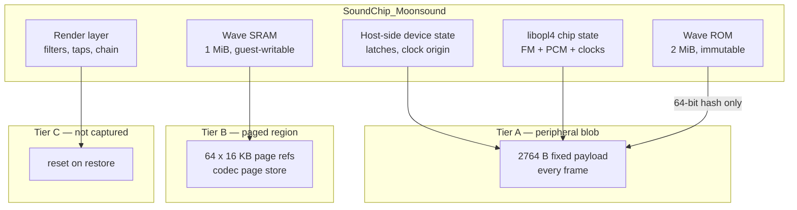
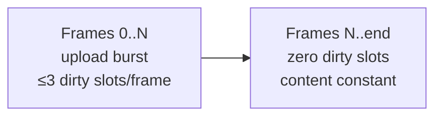
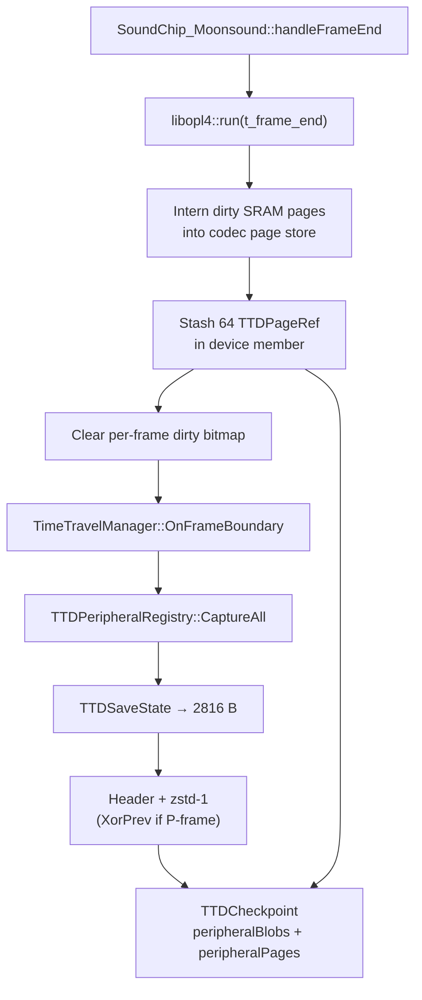
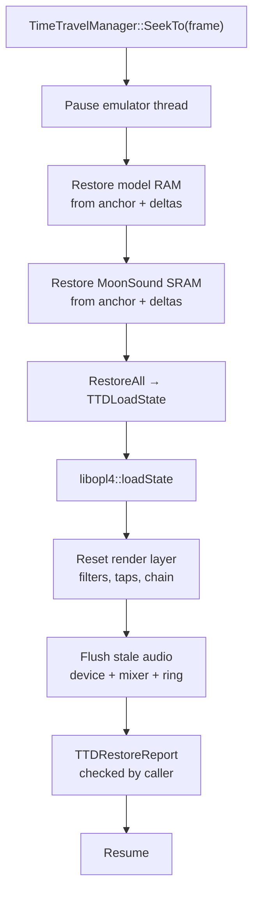

# MoonSound TTD integration — technical design

**Revision 1** (2026-09-13).
**Status (updated 2026-09-14):** Tier A — the fixed POD blob (library chip
state + host-side latches, `MoonSoundTTDHeader`) — is implemented and
test-pinned (save-neutrality / restore-exactness / round-trip in
`moonsound_device_test.cpp`, `TTD_*`; summary in
`opl4-unreal-ng-integration.md` §7.5). Tier B — the wave-SRAM paged region
of §5/§9 — is **not implemented yet**: until it lands, TTD for this device
is explicitly incomplete rather than silently wrong (the device header
carries the same note). The body below is the design for both tiers,
authoritative for the still-open Tier B and the framework change it
requires.
**Companions:** `opl4-core-tdd.md` (chip library), `opl4-unreal-ng-integration.md` (device wiring).
**Supersedes:** §7 of the integration document, which described a device-local dirty-page scheme written before the existing TTD subsystem was examined. The scheme below uses what is already in the tree.
**Scope:** how `SoundChip_Moonsound` participates in time-travel debugging — state partition, blob layout, wave-SRAM capture, capture/restore paths, per-frame size and cost budgets, divergence detection, framework changes required, tests.

Glossary at the end (§14).

---

## 0. Requirements

| # | Requirement | Source |
|---|---|---|
| R1 | Complete MoonSound state — chip, host-side device, and 1 MiB wave SRAM — is captured at every recorded frame boundary and restored exactly on seek. | Project TTD requirement. |
| R2 | A replay from any checkpoint reproduces the original run **sample-for-sample** on the audio path and **bit-for-bit** on every guest-visible register and flag. | R4 of the integration doc. |
| R3 | Capture must fit the existing per-frame budget. The whole peripheral registry targets **under 1 ms capture and under 2 ms restore**; MoonSound must not consume a disproportionate share of it. | `ttdperipheralregistry.h` performance target. |
| R4 | Steady-state storage cost must be comparable to other peripherals, not an order of magnitude above them. A device that quietly burns 180 MB/hour of session budget is not shippable. | §8. |
| R5 | `TTDStateSize()` must be **stable for the lifetime of the device instance**. | `ttdserializable.h` contract. |
| R6 | Capture must be **allocation-free and side-effect free**, running on the emulator thread. | Same contract. |
| R7 | A session recorded with MoonSound must remain loadable on a build without it, and vice versa, with the mismatch visible in `TTDRestoreReport` rather than silent. | Registry design. |
| R8 | The chip library must not take a dependency on emulator TTD types. | `opl4-core-tdd.md` R10. |

---

## 1. Decisions

| # | Decision | Why |
|---|---|---|
| D1 | State is partitioned into **three tiers**: (A) small fixed POD blob through `TTDSerializable`; (B) 1 MiB wave SRAM through the codec page store, the same path main RAM uses; (C) not captured at all. | The interface is a fixed-size blob per frame. 1 MiB through that path costs ~2.5 ms/frame in compression alone — over the entire registry budget by 2.5× and an eighth of a whole frame. |
| D2 | Tier B requires a **new generic framework mechanism**: a peripheral-owned paged region that the framework interns, refcounts and releases exactly as it does `ramPages`. | Page-store slot references cannot live inside an opaque peripheral blob — the timeline-truncation path could not release them, and they would leak. |
| D3 | That mechanism is built **generic, not MoonSound-specific**. GeneralSound (512 KB – 1 MB of its own RAM) is already listed as a future peripheral and has the identical problem; `ttdperipheralregistry.h` even cites GS's 512 KB in its header comment. | One mechanism, two devices, and no second special case later. |
| D4 | The Tier A blob gets **I/P-frame encoding** via the `flags` field already reserved in `PeripheralBlobHeader`, anchored on the checkpoint's existing `keyFrameAnchor`. | Without it MoonSound costs ~50 KB/s stored. With it, ~12 KB/s. The field is reserved, the anchor exists, and TurboSound/TSFM/Covox get the same win for free. |
| D5 | `libopl4` exposes a **POD state pair** (`stateSize()` / `saveState(uint8_t*)` / `loadState(const uint8_t*)`) alongside its streaming serializer, and the device's `TTDSaveState` is a memcpy of that plus a small host-side struct. | Maps 1:1 onto `TTDSerializable` with no adapter, no allocation, no format negotiation. R6, R8. |
| D6 | Wave **ROM** is never captured. Its identity is carried as a 64-bit content hash, verified on restore. | 2 MiB of immutable data. A mismatch means the session was recorded against a different ROM image, which is worth an error, not a silent wrong-sounding replay. |
| D7 | The render layer is **never captured** and is reset on restore. | Core TDD §9.2 item 3. It contains no guest-visible state. |
| D8 | Page interning for Tier B happens in the device's own `handleFrameEnd`, **before** the registry's capture pass, so `TTDSaveState` stays a pure copy. | Interning allocates; the contract forbids allocation inside `TTDSaveState`. |
| D11 | **No audio is ever stored.** The captured state is port-visible chip state plus wave SRAM. Sound on replay is regenerated by running the chip forward from restored state under the guest's own port writes. | Audio is a pure function of state and time. Storing it would be storing a derived quantity, at far higher cost, and would create a second source of truth that can disagree with the first. |
| D10 | Wave SRAM rides the **TTD v2 encoding set** — `RAW` / `XOR_PREV` / `BACKREF` — and I-frames emit `BACKREF` for any page whose content hash matches the anchor slot, instead of unconditionally emitting `RAW`. | SRAM's access profile is write-once-then-read-only (§5.5). Under the current `KeyFrame: all pages stored as Full` rule that costs ~390 KB and ~2.6 ms **every 50th frame**, forever, for data that never changes again. With content-aware I-frames it costs 256 bytes of references and no payload. |
| D9 | `TTDHashState()` returns CRC32C over the Tier A payload, excluding SRAM. SRAM integrity is already covered by the per-slot CRC32C the codec store computes. | Cheap (hardware-accelerated, ~0.3 µs), and hashing 1 MiB per frame for divergence detection would cost more than the capture itself. |

---

## 2. What the existing subsystem provides

Summarised here so the rest of the document can be read without cross-referencing
the headers.

- **Checkpoints are per frame boundary.** Every recorded frame produces a
  `TTDCheckpoint` holding CPU state, chipset state, a `peripheralBlobs` map, a
  `ramPages` vector and journal offsets.
- **I/P structure for RAM.** `kKeyFrameInterval = 50` — every 50th frame is a key
  frame with all pages stored `Full`; intermediate frames store only dirty pages,
  XOR-delta'd against the previous slot. `keyFrameAnchor` records which I-frame a
  P-frame walks from.
- **Codec page store.** 4 KB slots, zstd level 1, encodings `Full` / `XorPrev` /
  `Zero`, CRC32C per slot, refcounted so unchanged pages are shared across
  checkpoints. Measured: ~2.66× ratio, ~10 µs to compress 4 KB.
- **TTD v2 adds `BACKREF`** — a reference to an identical slot carrying no data,
  chosen by content hash. v2 reports roughly 60% of model-RAM pages static across
  a session and credits this optimisation with 2.5× on its own, on top of the
  30× the delta scheme achieves overall. MoonSound's wave SRAM is the extreme
  case of the same pattern (§5.5).
- **Dirty tracking** at 16 KB granularity (matching the emulator's banking and
  write-trap granularity), sub-split to 4 KB at the codec-store level. Two
  bitmaps: per-frame `_dirty`, session-scoped `_everDirty`, the latter giving the
  `kNeverTouched` sentinel that makes untouched pages free.
- **Peripheral registry.** Devices register a `TTDSerializable*` under a
  `PeripheralId`. `CaptureAll` produces one blob per registered device, wrapped in
  a 12-byte `PeripheralBlobHeader` and compressed when that helps. `RestoreAll` is
  driven by registered devices and reports `restored / missingBlobs /
  sizeMismatches / unclaimedBlobs`.
- **`TTDSerializable` contract:** `TTDStateSize()` fixed and stable;
  `TTDSaveState(dst)` writes exactly that many bytes, no allocation, no side
  effects, emulator thread; `TTDLoadState(src)` on the control thread with the
  emulator paused; optional `TTDHashState()` mixed into divergence detection.

What it does **not** provide, and what §9 adds: any way for a peripheral to own a
large memory region that participates in the page store.

---

## 3. State partition



| Tier | Contents | Mechanism | Per-frame cost |
|---|---|---|---|
| **A** | Host latches, clock origin, all chip state, ROM hash | `TTDSerializable` blob | ~2.8 KB raw, ~250 B stored |
| **B** | 1 MiB wave SRAM | Peripheral paged region → codec page store | 0 idle, ≤ 2 KB during upload |
| **C** | Render layer, tap buffers, mixer UI prefs | none | 0 |

Tier C's mixer preferences (mute, solo, volume, per-channel mutes) are saved with
the emulator's own settings, not with TTD. Restoring a checkpoint must not
silently change what the user has muted.

---

## 4. Tier A — the peripheral blob

### 4.1 Registration

```cpp
// ttdserializable.h
enum class PeripheralId : uint8_t
{
    TurboSound = 0,
    BetaDisk   = 1,
    Tape       = 2,
    Covox      = 3,
    TSFM       = 4,
    GeneralSound = 5,
    ScorpionProfROM = 6,
    MoonSound  = 7,      // new
    Count
};
```

The device registers itself at construction, only when the config flag enabled it
(integration doc D1). A machine without MoonSound produces no blob and costs
nothing — which is also how R7 is satisfied: loading such a session on a build
with MoonSound registered yields `missingBlobs = 1`, visible in the report.

### 4.2 Payload layout

`TTDStateSize()` returns a compile-time constant. The payload is a packed POD
struct with explicit field sizes — no `size_t`, no pointers, no bitfields whose
layout is compiler-dependent, no floats (core TDD §9.2 item 4).

| Block | Bytes | Contents |
|---|---:|---|
| Envelope | 16 | magic `'M''S''N''D'`, layout version, payload length, flags |
| Host device | 32 | `fmAddrLatch[2]`, `waveAddrLatch`, T-state origin (u64), last sync timestamp (u64), device flags, ROM hash low word |
| ROM identity | 8 | 64-bit content hash of the loaded wave ROM (D6) |
| Clocks | 48 | master-clock position (u64), FM grid accumulator + remainder, output grid accumulator + remainder, BUSY deadline (u64), LD deadline (u64), header-fetch phase and address |
| FM global | 548 | 512 register bytes, timer 1 / timer 2 counts + load + overflow flags, status byte, AM and PM LFO counters, noise LFSR, pipeline rotation index |
| FM operators | 576 | 36 × 16 B: phase accumulator (u32), envelope level (u16), envelope phase (u8), key-on (u8), feedback history (2 × i16), last output (i16) |
| FM channels | 144 | 18 × 8 B: cached F-Number/block, algorithm and pairing cache, output routing bits, feedback amount |
| FM reducer | 16 | phase accumulator, held L/R sample (kernel-dependent; sized for the widest candidate) |
| PCM registers | 256 | wave register file 0x00–0xF9, including block mix 0xF8/0xF9 |
| PCM slots | 1152 | 24 × 48 B — see §4.3 |
| Padding | 12 | to a 64-byte boundary |
| **Total** | **2816** | `TTDStateSize()` |

Used payload is 2804 bytes; the struct is padded to 2816 so it lands on a cache
line boundary and so small future additions do not change `TTDStateSize()` (R5).
The envelope's layout version is what a future change bumps; a build seeing an
unknown version fails the restore loudly rather than misreading the bytes.

### 4.3 PCM slot record — 48 bytes

| Offset | Size | Field |
|---:|---:|---|
| 0 | 2 | wave number |
| 2 | 1 | sample width (bits field) |
| 3 | 1 | envelope phase (`EG_OFF/REL/SUS/DEC/ATT` + DAMP/PRVB sub-state) |
| 4 | 4 | start address (22-bit, from the decoded header) |
| 8 | 2 | loop address |
| 10 | 2 | end address |
| 12 | 2 | current position |
| 14 | 2 | reserved |
| 16 | 4 | step pointer (16-bit fraction in a 32-bit field) |
| 20 | 4 | cached step |
| 24 | 4 | envelope volume (10-bit index in a 32-bit accumulator) |
| 28 | 4 | envelope step / rate counter |
| 32 | 1 | `TL` (current, possibly mid-interpolation) |
| 33 | 1 | `TLdest` |
| 34 | 1 | pan |
| 35 | 1 | flags: key-on, LD, DAMP, PRVB, LFO active, AM enable, VIB enable |
| 36 | 4 | LFO counter |
| 40 | 2 | TL interpolation down-counter (modulo 27) |
| 42 | 2 | TL interpolation up-counter (modulo 27, half-step phase) |
| 44 | 4 | cached AM/VIB values and rate-correlation cache |

The two TL interpolation counters at offset 40 are the field most likely to be
forgotten. Losing them means a restored checkpoint resumes a software fade from
the wrong sub-step, and the divergence is a fraction of a dB — inaudible, and
therefore invisible until a bit-exact replay test catches it. They are in the
core TDD's inventory for the same reason.

### 4.4 Save and load

```cpp
size_t SoundChip_Moonsound::TTDStateSize() const
{
    return sizeof(MoonSoundTTDState);            // 2816, compile-time constant
}

void SoundChip_Moonsound::TTDSaveState(uint8_t* dst) const
{
    auto* s = reinterpret_cast<MoonSoundTTDState*>(dst);
    s->envelope   = kEnvelope;                    // magic + version + length
    s->fmLatch[0] = _fmLatch[0];
    s->fmLatch[1] = _fmLatch[1];
    s->waveLatch  = _waveLatch;
    s->tstateOrigin  = _tstateOrigin;
    s->lastSyncTime  = _lastSyncTime;
    s->romHash       = _romHash;
    _opl4.saveState(s->chip);                     // POD copy, no allocation (D5)
}

void SoundChip_Moonsound::TTDLoadState(const uint8_t* src)
{
    const auto* s = reinterpret_cast<const MoonSoundTTDState*>(src);
    if (!s->envelope.Valid())   { /* log + abort restore of this device */ }
    if (s->romHash != _romHash) { /* log a hard warning; continue */ }
    _fmLatch[0]   = s->fmLatch[0];
    _fmLatch[1]   = s->fmLatch[1];
    _waveLatch    = s->waveLatch;
    _tstateOrigin = s->tstateOrigin;
    _lastSyncTime = s->lastSyncTime;
    _opl4.loadState(s->chip);
    _opl4.resetRenderState();                     // Tier C (D7)
    _tapsDirty = true;
}
```

`TTDSaveState` is `const` and touches nothing but `dst`. That is the whole of
R6 — and the test in §11.1 is what keeps it true after the third refactor.

---

## 5. Tier B — wave SRAM

### 5.1 Why not a blob

1 MiB through `TTDSerializable` means `TTDStateSize() == 1048576 + 2816` and a
memcpy plus compression of the whole megabyte every frame:

| Step | Cost per frame |
|---|---|
| memcpy 1 MiB | ~40 µs |
| zstd-1 on 1 MiB (256 × 4 KB at ~10 µs) | ~2560 µs |
| **Total** | **~2.6 ms** |

Against a registry budget of 1 ms for all devices and a 20 ms frame. It also
produces roughly 400 KB stored per frame before dedup — 20 MB/s. Not viable.

The registry's own header comment anticipates this, describing xor-delta
compression as the intended answer for "devices with large state". The mechanism
to do it exists; it is just not reachable from a peripheral yet.

### 5.2 Page-region model

Wave SRAM is treated exactly like a model RAM region:

- Region size 1 MiB, divided into **64 pages of 16 KB**, each split into 4 × 4 KB
  codec slots — the same shape as `TTDPageRef`, so the store, the encodings, the
  refcounting and the CRC all apply unchanged.
- Dirty tracking at 16 KB granularity with a per-frame bitmap and a session-scoped
  `everDirty`, mirroring `TTDDirtyTracker`. 64 bits each — a single `uint64_t`
  per bitmap.
- `kNeverTouched` applies: a machine that loads a MoonSound track using only ROM
  tones never dirties a page, and SRAM costs literally nothing for the whole
  session.
- I-frames (every 50th) store all touched pages `Full`; P-frames store only dirty
  pages as `XorPrev`.

### 5.3 Dirty marking

The library already owes a dirty bitmap (core TDD §10, `ramDirtyBitmap`). The
device adapts it:

- The `IWaveMemory` implementation marks dirty on every SRAM write, whether from
  the guest's data port or from a debugger poke.
- Granularity at the library is per 4 KB; the device folds 4 sub-pages into the
  16 KB page bit. Folding up is cheap and keeps the framework interface uniform.
- Marking is one predictable branch plus an OR. SRAM writes come one byte per port
  access, so this is nowhere near a hot path.

### 5.4 The bandwidth bound — why this is cheap

The guest can only write SRAM through the wave data port, one byte per `OUT`.
Best case is a tight `OUTI` loop at 16 T-states per byte. On a Pentagon frame of
71680 T-states that caps the guest at **~4480 bytes per frame**, and real code is
slower because it must respect LD busy between accesses.

4480 bytes touches **at most 2 complete 4 KB slots, 3 if the run straddles both
boundaries**. So:

- Dirty 4 KB slots per frame: **≤ 3**, always, by construction. Not a heuristic —
  a bus bandwidth limit.
- Worst-case capture cost: 3 × (XOR ~1 µs + zstd-1 ~10 µs) ≈ **33 µs**.
- Worst-case stored bytes: the XOR of a page where ~2 KB changed compresses to
  roughly 300–700 B, so **≤ ~2 KB per frame**, and only during an upload burst.

Steady state — music playing from already-uploaded samples — is **zero dirty
pages and zero cost**, because the chip only ever reads wave memory.

This is the single most reassuring number in the design: the worst case is
bounded by the Z80, not by our implementation.

---

### 5.5 Access profile — write once, then read-only

This is the property that makes Tier B nearly free, and it deserves to be stated
as a design input rather than discovered later.

A MoonSound program uploads its sample set once — at track load, or at program
start — and from then on the chip only **reads** wave memory. There is no
streaming, no double-buffering, no per-frame sample swapping: the chip's own
address generation is read-only, and the guest has no reason to rewrite a sample
it is currently playing. Even a music disk that reloads between tracks produces
one burst per track, seconds apart.

So the session profile is:



Consequences, in order of how much they matter:

1. **P-frames cost nothing.** No dirty pages, no deltas, no payload. Already true
   in the previous revision.
2. **I-frames cost nothing either — but only with D10.** The current rule stores
   every page `Full` on a key frame. For 1 MiB of sample data that is ~390 KB
   compressed and ~2.6 ms of zstd, every 50 frames, for the entire session. At
   50 fps that is one I-frame per second: **~1.4 GB/hour and a 2.6 ms periodic
   hitch**, spent re-storing bytes that are provably identical. Content-aware
   I-frames reduce it to 64 page references.
3. **Restore is O(1) per page.** A `BACKREF` page resolves directly to its slot;
   there is no delta chain to walk. The "walk 49 deltas" worst case in §8.3 does
   not apply to a static region at all.
4. **Dedup across reloads is free.** A music disk that loads the same sample bank
   for several tracks produces identical page content each time; content hashing
   turns the second and subsequent loads into `BACKREF` as well.

The earlier revision of this document presented only steady-state P-frame costs
and so understated Tier B by the whole I-frame term. §8 is corrected.

---

## 6. Capture path



Ordering matters in two places:

1. **`run()` before interning.** The core must be advanced to the frame boundary
   before its state is read, or the checkpoint captures a chip that is behind the
   CPU. The library will not advance itself during save (core TDD §9.2 item 1), so
   the host must do it.
2. **Interning before `CaptureAll`.** Interning allocates; `TTDSaveState` may not
   (D8). Doing it in the device's own frame hook keeps both contracts intact and
   requires no new callback in the framework.

---

## 7. Restore path



### 7.1 Ordering constraint

**Memory before chip state.** A restored slot carries a decoded header (start,
loop, end, width) captured in Tier A, and a position pointing into SRAM. Both are
internally consistent by construction, but restoring the chip first and memory
second leaves a window in which the two disagree; if anything in that window reads
a sample — a debugger view, a metering pass, an assertion — it reads garbage. The
order above closes the window. It costs nothing to get right and is unpleasant to
diagnose when wrong.

### 7.2 What the render layer does on restore

Filter histories, resampler phase, tap buffers, character-chain envelopes and the
DC blocker are all zeroed. The audio stream therefore has a transient of at most
one filter length after a seek:

| Core rate | Path | Discontinuity window |
|---|---|---|
| 44100 | bypass (core TDD R6) | **0 samples** |
| 48000 / 96000 / 192000, `Reference` | 96-tap polyphase | ≤ 96 input samples ≈ 2.2 ms |
| any, `HighFidelity` | 192-tap polyphase | ≤ 192 input samples ≈ 4.4 ms |

This is expected, bounded and documented. It is also why a bit-exact audio replay
test must compare from **filter-length samples after** the seek point, not from
the seek point itself — except at 44100, where it can and should compare from
sample zero.

### 7.3 ROM mismatch

If the captured ROM hash differs from the loaded image, the restore proceeds but
logs an error naming both hashes. Refusing would make a session unopenable after a
ROM file was replaced; proceeding silently would produce a replay that sounds
wrong for reasons nobody would connect to the ROM. A loud log is the honest
middle.

### 7.4 Audio flush on seek

Because no audio is stored (D11), everything downstream of the chip holds samples
belonging to the timeline that was just abandoned. Without a flush the user hears
a fragment of the old future — brief, but disconcerting and easy to misread as a
state-restore bug.

`TTDLoadState` is the device's own method and receives the checkpoint's blob for
this device, so everything the device owns is cleared right there:

- the library's render state — filters, resampler phase, tap buffers, character
  chain, DC blocker — via `resetRenderState()`;
- the device's own frame buffers. These belong to the device, in the same pattern
  the existing chips use (`getChipBuffer()`, `getBuffer()`); `SoundManager` only
  reads from them through `deviceBuffer()`.

Two lines on the restore path the device already has. No framework change.

What cannot be cleared from there is the mixer's in-progress master frame and
`SoundManager`'s playback ring. Not for layering reasons — because of threading:
`TTDLoadState` runs on the control thread with the emulator paused, while the ring
is consumed by the audio callback thread. Touching it from a device restore
callback is a data race.

So one `SoundManager::FlushAudioOnSeek()` called once after `RestoreAll`, dropping
the master frame and as much of the ring as the backend allows. Every sound device
benefits; MoonSound is only the one that makes the omission audible.

---

## 8. Size and cost budget

### 8.1 Per-frame storage

Assumes 50 fps, `kKeyFrameInterval = 50`. Tier B figures assume D10
(content-aware I-frames); the cost without it is called out separately in §8.2.

| Component | Raw | Stored, I-frame | Stored, P-frame | Notes |
|---|---:|---:|---:|---|
| Tier A payload | 2816 B | ~950 B | ~220 B | zstd-1; P-frame is XOR against the previous blob (D4) |
| Blob header | 12 B | 12 B | 12 B | `PeripheralBlobHeader` |
| Tier B, after upload | 0 | **0** | 0 | every page `BACKREF` — content constant (§5.5) |
| Tier B, during upload | ≤ 12 KB | ≤ 2 KB | ≤ 2 KB | ≤ 3 dirty 4 KB slots (§5.4) |
| Page refs | 256 B | shared | shared | 64 × `TTDPageRef`; `kNeverTouched` before upload, `BACKREF` after |

### 8.2 Sustained rates

| Scenario | Per frame | Per second | Per hour |
|---|---:|---:|---:|
| Music playing, ROM tones only | ~235 B | ~11.7 KB | **~42 MB** |
| Music playing, SRAM samples, after upload | ~235 B | ~11.7 KB | **~42 MB** |
| Sample upload in progress | ~2.2 KB | ~110 KB | bursty — a few seconds per track load |
| **Without D4** (Tier A stored `Full` every frame) | ~960 B | ~48 KB | ~173 MB |
| **Without D10** (Tier B `RAW` on every I-frame) | +~390 KB per I-frame | +~390 KB | **+~1.4 GB** |

Two rows carry the whole argument of this section.

Without D4, Tier A alone costs 173 MB/hour instead of 42 — bad, but survivable.

Without D10, Tier B adds **~1.4 GB/hour** of re-stored, provably identical sample
data, because one I-frame per second re-emits the full megabyte as `RAW`. That is
not a tuning issue; it makes the device unusable with TTD. The fix is not a new
mechanism — it is applying the encoding set the page store already has to a region
whose content is constant.

### 8.3 Per-frame CPU

| Step | Typical | Worst case |
|---|---:|---:|
| `run()` to frame boundary | already paid by the audio path | — |
| Dirty bitmap scan (64 bits) | < 0.1 µs | < 0.1 µs |
| Intern dirty SRAM slots | 0 µs | ~33 µs (3 slots, during upload) |
| I-frame content hash over 1 MiB (D10) | ~55 µs, once per 50 frames | ~55 µs |
| `TTDSaveState` memcpy 2816 B | ~0.2 µs | ~0.2 µs |
| `TTDHashState` CRC32C over 2804 B | ~0.3 µs | ~0.3 µs |
| XOR + zstd-1 on the blob | ~8 µs | ~8 µs |
| **Total capture, P-frame** | **~9 µs** | **~42 µs** |
| **Total capture, I-frame** | **~64 µs** | **~97 µs** |

The I-frame hash is the one new cost D10 introduces: CRC32C over 1 MiB at
hardware rates is roughly 55 µs. It can be avoided entirely by hashing
incrementally on write — the region is written at most 4480 bytes per frame, so
an incremental hash is free — which is worth doing if the I-frame spike ever
shows up in a frame-time trace. Either way it is two orders of magnitude below
the 2.6 ms it replaces.

Against a 1 ms registry budget, MoonSound takes about 1% on a P-frame and 6-10%
on an I-frame. Against a 20 ms frame, well under 0.5% in every case.

Restore:

| Step | Typical | Worst case |
|---|---:|---:|
| Blob decode + P-frame walk to anchor | ~8 µs | 49 deltas × ~8 µs ≈ 400 µs |
| SRAM page resolve | ~1 µs — `kNeverTouched` or `BACKREF`, O(1) per page | ~250 µs if the seek lands mid-upload |
| `loadState` memcpy | ~0.2 µs | ~0.2 µs |
| Render reset | ~2 µs | ~2 µs |

The previous revision carried a 3.8 ms SRAM worst case built on the assumption
that a restore walks a delta chain across all 64 pages. §5.5 removes it: a
`BACKREF` page resolves directly to its slot with no chain, and the only pages
that ever carry deltas are the ≤ 3 per frame written during an upload burst. The
worst case is therefore a seek landing in the middle of a sample load, which
touches at most a few hundred kilobytes of delta — well inside budget and rare.

## 9. Framework changes required

| # | Change | Size | Notes |
|---|---|---|---|
| F1 | `PeripheralId::MoonSound = 7` | trivial | Enum value is not stored on disk, so insertion order is free. |
| F2 | **Peripheral paged region.** An interface a device implements to expose `{base pointer, size, dirty bitmap, everDirty bitmap, content hash}`; a `peripheralPages` map in `TTDCheckpoint`; interning, refcounting and release in the same code paths that handle `ramPages`, including the timeline-truncation release. | **The real work.** ~2–3 days including tests | Generic (D3). GS is the second consumer. |
| F2a | **Content-aware I-frames** for paged regions: a `BACKREF` encoding alongside `Full` / `XorPrev` / `Zero`, and an I-frame rule that emits `BACKREF` when a page's content hash matches the anchor slot rather than unconditionally emitting `Full`. | ~1 day on top of F2 | D10, §8.2. This is the TTD v2 `BACKREF` encoding; v2 already specifies it and reports ~60% of model-RAM pages static across a session, so model RAM benefits too. Without it MoonSound is not shippable with TTD. |
| F3 | **I/P encoding for peripheral blobs.** `PeripheralBlobHeader::flags` bit 0 = `XorPrev`; the registry keeps the previous blob per device and XORs before compressing; `RestoreAll` walks back to `keyFrameAnchor`. | ~1 day | Uses the reserved field and the existing anchor. Benefits every peripheral. |
| F4 | `TTDRestoreReport` surfaced to the caller on every seek, with a log line when `!Complete()`. | trivial | Probably already wanted; MoonSound just makes it matter. |
| F5 | Library-side: `libopl4` gains `stateSize()` / `saveState(uint8_t*)` / `loadState(const uint8_t*)` alongside the streaming `serialize()`. | small | D5. Amendment to core TDD §10. |

F2 is the item to schedule deliberately. Everything else in the MoonSound project
can proceed in parallel with it; nothing in the MoonSound project can reach
"TTD complete" without it.

---

## 10. Failure modes

Each row is a real way this breaks, and the test that catches it.

| Failure | Symptom | Caught by |
|---|---|---|
| `TTDSaveState` has a side effect (flush, lazy eval, normalisation) | Checkpointed runs diverge from non-checkpointed ones | §11.1 save-neutrality |
| Address latch not saved | Next data byte after a seek goes to the wrong register — one wrong instrument, intermittently | §11.2 register round-trip |
| T-state origin not saved or rebased on restore | Every subsequent access lands at the wrong chip phase; drift accumulates slowly | §11.3 seek-and-replay |
| TL interpolation counters not saved | Software fades resume at the wrong sub-step; sub-dB error | §11.4 bit-exact audio replay |
| Render state leaks into the blob | `TTDStateSize()` grows; restore reproduces stale filter history | §11.5 size assertion + blob-content review |
| Float in chip state | Same vector gives different bytes on ARM64 vs x86-64, or -O0 vs -O3 | §11.6 cross-build determinism |
| Page refs leak on timeline truncation | Page store grows without bound during long sessions with rewinds | §11.7 refcount audit |
| `TTDStateSize()` changes after `configure()` | Registry rejects the blob as a size mismatch; device silently keeps live state | §11.8 stability assertion |
| SRAM restored after chip state | Transient window where slot pointers and memory disagree | §7.1 ordering; asserted in §11.9 |
| ROM image swapped between record and replay | Replay sounds wrong with no explanation | §7.3 hash check |

---

## 11. Test plan

### 11.1 Save neutrality

Run N frames with MoonSound active, capturing every frame. Run the same N frames
with capture disabled. Assert the two audio streams are **byte-identical** and the
final `TTDHashState()` matches.

This is the single most important test in the document. The failure it catches is
silent: a side-effecting save produces a session that looks fine and replays
subtly wrong, and the bug surfaces weeks later as "time travel is flaky". It must
run on every commit.

### 11.2 Register round-trip

For each of the 7 ports, and for a scripted sequence that leaves each latch in a
distinct state: checkpoint, clobber the live device, `TTDLoadState`, then read
back every readable register and both latches. Assert exact equality.

Include the case that specifically exercises the latch: write an address to `#C4`,
checkpoint, restore, write data to `#C5`, assert it landed in the right register.

### 11.3 Seek and replay

Record a session with MoonSound active for ≥ 500 frames (crossing at least 10
I-frames). For a set of seek targets — on an I-frame, one frame after an I-frame,
one frame before the next I-frame, and a random selection — seek back and replay
forward to the original end. Assert:

- every guest-visible register matches at every subsequent frame boundary,
- the audio stream matches from filter-length samples after the seek (§7.2), and
  from sample zero when the core rate is 44100,
- `TTDRestoreReport::Complete()` is true.

### 11.4 Bit-exact audio replay at 44100

The strict form of the above, run only at the core rate where the render path is a
bypass. No tolerance, no warm-up window. This is what catches sub-dB state loss
such as the TL interpolation counters.

### 11.5 Blob size and content

- `TTDStateSize() == 2816` as a static assertion.
- `sizeof(MoonSoundTTDState) == TTDStateSize()`.
- A golden-blob test: a scripted device state produces a byte-identical blob to a
  committed reference. Any accidental field addition, reorder or padding change
  fails it immediately. Regenerate deliberately, never automatically.

### 11.6 Cross-build determinism

The same input vector produces the same blob bytes and the same audio on x86-64
and ARM64, and under -O0 and -O3. Any difference means floating point or
uninitialised padding leaked into the payload — zero the struct before filling it.

### 11.7 Page refcount audit

Record a session with heavy SRAM churn, rewind repeatedly, truncate the timeline
forward, and assert the codec page store's live slot count returns to the expected
value. Run under a long-session soak in the nightly job; a slow leak will not show
in a 10-second test.

### 11.8 Size stability

Construct the device under every supported config permutation (RAM size, ROM
present or absent, render mode, quality) and assert `TTDStateSize()` is identical
in all of them. The interface promises stability for the lifetime of the instance;
this makes it stability across configurations too, which is stronger and cheaper
than reasoning about when it could legitimately differ.

### 11.9 Restore ordering

An assertion in the restore path, enabled in debug builds, that the SRAM region
has been restored before `TTDLoadState` runs for this device. Cheap, and it makes
§7.1 enforced rather than merely documented.

### 11.10 Upload-burst bound

Drive a maximal-rate SRAM upload from the guest (tight `OUTI` loop into the data
port) and assert that no frame produces more than 3 dirty 4 KB slots. This pins
the bound in §5.4 as a tested property rather than an argument, so that a future
change — a DMA path, a debugger bulk-write, a faster clock — fails the test
instead of quietly blowing the budget.

### 11.11 Static-region encoding

After a sample upload completes, record 200 further frames (crossing at least 4
I-frames) and assert:

- no Tier B page is stored as `RAW` or `XorPrev` on any frame after the upload,
- total Tier B bytes stored across those 200 frames is zero,
- a seek to any of them resolves every page in O(1) with no delta walk.

This is the test that keeps §8.2's 1.4 GB/hour term from quietly coming back if
the I-frame rule is ever simplified.

### 11.12 CI placement

| Test | Frequency |
|---|---|
| 11.1, 11.2, 11.5, 11.8 | every commit |
| 11.4, 11.9, 11.10 | every commit |
| 11.3, 11.11 | every PR |
| 11.6 | every PR (matrix build) |
| 11.7 | nightly soak |

---

## 12. Compatibility with the core library TDD

| Core TDD item | How this document satisfies it |
|---|---|
| §9.1 state inventory | Mapped field-by-field onto §4.2 and §4.3. Every inventory group has a home in the payload. |
| §9.2 item 1 — save side-effect free | D5 POD save; §11.1 enforces. |
| §9.2 item 2 — restore exact | §4.2 carries both grid remainders, the pipeline rotation index, the reducer phase and both TL counters. |
| §9.2 item 3 — render layer not saved | D7, Tier C; §7.2 documents the bounded discontinuity. |
| §9.2 item 4 — no float in chip state | §4.2 layout rule; §11.6 enforces. |
| §9.2 item 5 — wave RAM host-managed with a dirty bitmap | Tier B; the library supplies the bitmap, the host supplies the page mechanism. |
| §10 API | Amended by F5: the POD pair is added alongside the streaming serializer. |
| R10 no emulator dependency | The library never sees a TTD type. The device does the bridging in 20 lines. |

---

## 13. Open questions

0. **Whether F2a can be folded into the v2 work already in flight** rather than
   built as a MoonSound-specific addition. `BACKREF` is already in the v2 design
   and v2 already measures the static-page win on model RAM; the only thing
   MoonSound needs beyond it is that paged *peripheral* regions get the same
   treatment. If v2 lands first with the encoding generic, F2a reduces to wiring.
1. **Whether F2 lands before or after the MoonSound device work.** It is a
   framework change with its own review surface, and GS is a second consumer. If
   it slips, MoonSound can ship with Tier A only and SRAM uncaptured — with time
   travel explicitly marked incomplete for that device rather than silently wrong.
2. **Whether F3 should apply to all peripherals at once** or be opt-in per device
   behind the flags bit. Opt-in is safer to land; all-at-once is where the value
   is.
3. **Dirty granularity for SRAM.** 16 KB was chosen for uniformity with model RAM.
   Given the 4480 B/frame bus bound, 4 KB tracking at the device level would mark
   fewer pages and cost nothing, since there is no write-trap path to make fire
   more often. Worth measuring once real workloads exist.
4. **Whether the ROM hash belongs in the blob or in the session header.** In the
   blob it is 8 bytes per frame; in the session header it is 8 bytes per session.
   The blob is simpler and the cost is noise after compression, but the session
   header is where it logically belongs.

---

## 14. Glossary

| Term | Meaning |
|---|---|
| **I-frame / key frame** | Checkpoint storing all touched pages `Full`; every 50th frame |
| **P-frame / delta frame** | Checkpoint storing only dirty pages, XOR'd against the previous slot |
| **`keyFrameAnchor`** | The I-frame a P-frame's delta walk starts from |
| **Codec page store** | The 4 KB, zstd-1, refcounted, CRC32C-checked slot store backing checkpoint memory capture |
| **`kNeverTouched`** | Sentinel page ref for a page never written in the session — free to capture and restore |
| **Peripheral blob** | One device's serialised state, wrapped in a 12-byte header in `peripheralBlobs` |
| **Paged region** | A device-owned memory region participating in the codec page store (F2) |
| **`BACKREF`** | TTD v2 slot encoding: a reference to an identical existing slot, carrying no payload; selected by content hash |
| **Static region** | A paged region whose content stops changing after an initial write phase — wave SRAM is the extreme case |
| **Tier A / B / C** | This document's state partition: blob / paged region / not captured |
| **Upload burst** | The period during which a guest is writing samples into wave SRAM |
