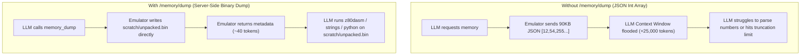
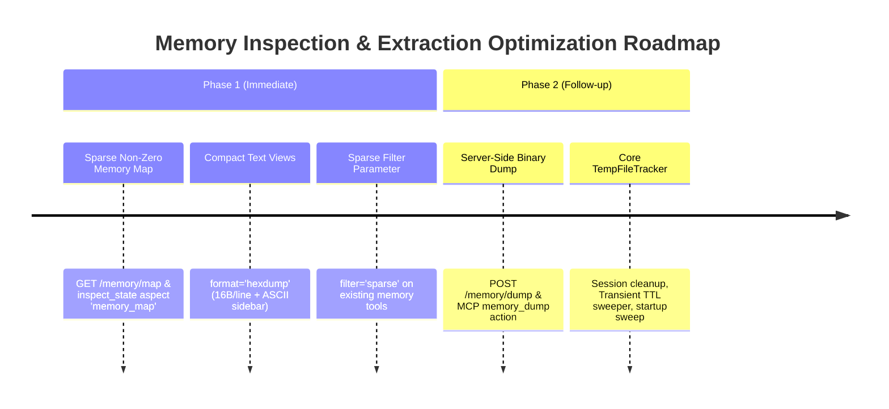

# TTD Coverage Evaluation — Time-Travel Debugging for AI Reverse-Engineering Workflows

**Date:** 2026-09-15
**Trigger:** the umt23x reverse-engineering package
(`docs/disasm/software/umt23x/`) posed the litmus test — could an AI agent
driving the emulator through automation have found "where the MegaLZ unpack
finished" and dumped the clean code binary / an entry-point snapshot by
itself? This file evaluates the TTD (Time-Travel Debugging) automation
surface against that need and proposes the closing work.
**Baseline:** `master` working tree, 2026-09-15. Companion to
[current-state.md](current-state.md) / [gap-analysis.md](gap-analysis.md)
(groups A–F); new findings use group **G** to avoid renumbering.

## Verification method

Every `file:line` citation was verified in this session by full-file or
targeted reads (`ttd_api.cpp`, `timetravelmanager.{h,cpp}`, `ttdprobe.h`,
`ttdexternalevents.h`, `cli-processor-ttd.cpp`, `lua_emulator.h`,
`python_emulator.h`, `mcp-tools.cpp`, `mcp-router.cpp`, `mcp-dispatcher.cpp`,
`state_memory_api.cpp`, `snapshot_api.cpp`, `debug_api.cpp`, `emulator.cpp`,
`tape.cpp`, `openapi_ttd.inc`, the control-interfaces docs). No runtime
behavior was re-executed for this document; claims about behavior cite the
code path that implements them.

---

## 1. Verdict

| Question from the task | Answer | Where it breaks down |
|:--|:--|:--|
| Full TTD coverage in WebAPI? | **Yes** — 16 routes cover the entire engine surface | `find-last` is less expressive than the core query struct (G-3) |
| …in CLI / Lua / Python? | **Yes** — full parity incl. reverse-step / reverse-continue | docs describe a different, older API (G-8) |
| …in MCP? | **Mechanically yes, ergonomically no** — router-only (`search_api`/`invoke_api`) | no first-class tool actions, no `ttd` aspect, no briefing/doc mention (G-1) |
| Start/stop recording | **Yes** — all four endpoint surfaces, gaming/development journal modes | session is invalidated by tape/disk/snapshot load, speed change — ordering constraints are documented only in one design doc (G-9) |
| Scrub to any frame + t-state | **Yes** — checkpoint restore + intra-frame silent replay; halt reasons + marker barriers surfaced | frame-aligned seeks never blocked; intra-frame seeks stop at replay barriers by design |
| Analysis at any restored state | **Yes** — every state endpoint (registers, memory, disasm, digest, OCR, snapshot save) reads the restored state | retrospective queries are limited to `find-last` (single address, single result); no timeline summary, no coverage query (G-3/G-4/G-5) |
| Convenient for an AI RE agent? | **WebAPI/CLI/Lua/Python: workable today**; **MCP: second-class** | extraction ergonomics (JSON int arrays, no dump-to-file) and discovery cost (G-1/G-6) |
| umt23x litmus test | **Achievable today via WebAPI** (§3) — find the entry moment with `reverse-continue`, dump with snapshot save + page reads | needs polling for completion (breakpoints don't fire under `run_frames`), and binary extraction is clumsy |

## 2. What exists today

### 2.1 Engine capabilities (core, verified)

| Capability | Evidence |
|:--|:--|
| Recording lifecycle: Idle/Recording/Detached, baseline checkpoint, stop-retains-history, invalidate | [timetravelmanager.h](../../../core/src/debugger/ttd/timetravelmanager.h) §class doc; `StartRecording` refuses if a declared peripheral lacks a serializer (timetravelmanager.cpp:117-125) |
| Per-frame checkpoints, COW page store, I/P-frame codec (K=50, ~2 ms avg seek) | `kKeyFrameInterval` (timetravelmanager.h:189); TTDSessionInfo codec telemetry fields (140-144) |
| Peripheral state in checkpoints: TurboSound slot (legacy/TSFM guarded), Covox, **Tape**, Kempston mouse, BetaDisk, + per-model decoder serializers | `RegisterModelPeripherals` (timetravelmanager.cpp:1028-1070) |
| Input journals (keyboard, mouse) replayed at recorded timestamps during seek | `RecordInputEvent`/`RecordMouse*` (timetravelmanager.h:458-465) |
| External-event markers (replay barriers): tape control ops, WD1793 writes, API memory writes; seek/find/search stop at them and surface kind+reason | [ttdexternalevents.h](../../../core/src/debugger/ttd/ttdexternalevents.h) kinds 65-72; capture at tape.cpp:43..506, wd1793.cpp:1418/1580, state_memory_api.cpp:545-555 |
| Seek to (frame, tInFrame) with silent intra-frame replay; halt reasons `target/external_event/out_of_range` | `SeekTo` (timetravelmanager.h:606-631, .cpp:1513-1552) |
| Resume-from-past (truncate + re-record) and resume-live (no-gap guard) | `ResumeRecordingFrom` / `ResumeRecordingLive` (timetravelmanager.h:647-690) |
| Reverse search `FindLastAccess`: write/IO via 64 MB write journal (fast path), read/execute via probe replay, coverage-index pruning; filters: address range, value, PC range, physical page, before-time | TTDSearchQuery ([ttdprobe.h](../../../core/src/debugger/ttd/ttdprobe.h):62-91); FindLastAccess (timetravelmanager.cpp:3157-3330) |
| Reverse execution: step-instruction back/forward, reverse-step N instructions / N t-states, reverse-continue to PC set (M1 enumeration, coverage-accelerated) | timetravelmanager.h:824-925, .cpp:3475-4030 |
| Session serialize/deserialize (`.ttd`, schema-versioned, model-id guarded), Kaitai schema + offline analyzer | `SerializeSession`/`DeserializeSession` (timetravelmanager.h:292-311); `core/src/debugger/ttd/ttd.ksy`; `tools/verification/ttd-analyzer/` |
| Session invalidation hooks: speed-multiplier change, snapshot/tape/disk load, ROM reload | emulator.cpp:589, 1218, 1432, 1486, 3030 |
| DebuggerLive mode (DeZog), per-frame decode cache, capture-restore self-test | timetravelmanager.h:100-110, 352-359, 937-951 |

### 2.2 Surface matrix (who can drive what)

| Capability | WebAPI | CLI | Lua | Python | MCP |
|:--|:--:|:--:|:--:|:--:|:--:|
| status / position / markers | ✅ GET routes (ttd_api.cpp:151, 639, 668) | ✅ `ttd status/position/markers` | ✅ `ttd_status/_position/_markers` | ✅ | router only |
| start / stop / invalidate | ✅ (:347, 391, 413) | ✅ | ✅ | ✅ | router only |
| seek / step-back / step-forward / resume | ✅ (:451, 536, 567, 599) | ✅ | ✅ | ✅ | router only |
| find-last (filters: access, value, pc_from/to, phys_page, before) | ✅ (:831-933) | ✅ `ttd find-last` | ✅ (lua_emulator.h:2010) | ✅ (python_emulator.h:2258) | router only |
| step-instruction / reverse-step (count/tstates) / reverse-continue | ✅ (:936-1113) | ✅ (cli-processor-ttd.cpp:115-130) | ✅ (lua_emulator.h:2049-2106) | ✅ (python_emulator.h:2325-2360) | router only |
| dump / load `.ttd` | ✅ (:703, 771) | ✅ | ✅ | ✅ | router only |
| OpenAPI descriptions for all 16 routes | ✅ `openapi_ttd.inc` (464 lines) | — | — | — | inherited via router |

**MCP router reachability.** `search_api` fetches `/api/v1/openapi.json`
(mcp-router.cpp:40) and scores flattened operations; `invoke_api` executes any
`/api/v1/...` path with `{id}` substitution (mcp-router.cpp:375-400). Since
`openapi_ttd.inc` is part of the spec, **every TTD endpoint is callable from
MCP today** — but only through the generic router: the registry's first-class
tools have no TTD actions (`control_execution` covers lifecycle verbs at
mcp-tools.cpp:186-217 and `debug_code` the run/step families at 399-535;
neither mentions TTD; the `inspect_state` aspect enum has no `ttd`,
mcp-tools.cpp:571-572), the server briefing (mcp-dispatcher.cpp:21-26) never
mentions TTD, and `docs/features/mcp/README.md` contains zero TTD references.

### 2.3 What is explicitly NOT a gap

Determinism machinery is ahead of typical implementations: replay barriers
for everything not yet journaled, peripheral serialization including tape
state, the no-unrecorded-gap resume guard, the model-id load refusal, and
coverage-index-accelerated reverse search all exist and are tested
(`core/tests/debugger/ttd/` incl. `ttdautomationcontract_test.cpp`). The
gaps below are about *query expressiveness, ergonomics and agent-facing
documentation*, not engine correctness.

---

## 3. The umt23x litmus test — worked as an agent would run it

Program facts used below (all from the dossier,
[docs/disasm/software/umt23x/](../../disasm/software/umt23x/)): tape loads a
BASIC stub; the stub relocates a MegaLZ depacker to `0xBF00`, which unpacks
a ~24 KiB image to `0x6000..0xBFFF` and jumps to the entry point `0x6000`.
The agent's goal: land exactly at (or one instruction before) that jump and
extract artifacts. WebAPI calls shown; replace with `ttd …` / `ttd_*()` for
CLI/Lua/Python, or `invoke_api` for MCP.

### 3.1 The workflow that works today

```text
1  POST /emulator/create {"model":"PENTAGON"}          -> id
2  POST /{id}/tape/load {"path":"testdata/memory/UMT23X.tap"}
   -- MUST precede ttd/start: tape-load invalidates the session
      (emulator.cpp:1432). Order matters and is agent-invisible (G-9).
3  POST /{id}/ttd/start {"mode":"development"}          -- write journal ON
4  POST /{id}/tape/play                                 -- records a TapeControl
   marker; harmless: everything interesting happens after it
5  wait for the menu: poll GET /{id}/state/screen/digest?mode=active
   (or registers for PC stabilized in 0x6000..0x84F9)
   -- breakpoints do NOT fire under run_frames (RunNFrames defaults
      skipBreakpoints=true, emulator.h:269; debug_api.cpp:718) so live
      "catch the entry" requires resume-mode + bp instead (G-7)
6  POST /{id}/ttd/stop                                  -- history retained
7  POST /{id}/ttd/reverse-continue {"pcs":[24576]}      -- 0x6000
   -> {"matched":true,"pc":24576,"frame":F,"tinframe":T}
   The emulator is NOW positioned at the M1 of the first entry
   instruction - i.e. "unpack finished, about to run".
8  (optional) POST /{id}/ttd/reverse-step {"count":1}   -- sit before the JP
9  Extract artifacts at the restored state:
   a. POST /{id}/snapshot/save {"path":"scratch/umt23x/entry.sna","force":true}
      -- save does NOT invalidate TTD (snapshot_api.cpp:121-207; only
         load does, emulator.cpp:1218)
   b. GET /{id}/memory/page/ram/1?offset=0&length=16384 and page 2
      (bank->page mapping from GET /{id}/state/memory) -> reassemble
      0x6000..0xBFFF locally
   c. POST /{id}/ttd/dump {"path":"scratch/umt23x/session.ttd"}
      -- offline re-analysis via tools/verification/ttd-analyzer
10 Any state endpoint now describes the restored moment: registers, disasm
   (with labels), /state/paging, screen digest, OCR.
```

Why step 7 is the right primitive: `ReverseContinue` enumerates M1 cycles
over `(first-barrier, now]` in one coverage-accelerated silent-replay pass
and positions the emulator at the newest matching PC
(timetravelmanager.cpp:3900-4030). The tape-play marker at session start
crops only the boring pre-play frames. Keyboard events (needed later for the
model menu) are journaled input, not barriers — seeks replay them
faithfully.

### 3.2 Friction points hit along the way (mapped to gaps)

- **Completion detection is polling.** No run-until-PC/condition under the
  frame API (breakpoints skipped, emulator.h:269); the live-resume +
  breakpoint alternative changes the workflow's shape. → G-7
- **"Last write by the depacker" is not directly askable.** The natural
  query — `find-last access=write pc_from=0xBF00 pc_to=0xBFFF` (any address)
  — is impossible: `addr` is required and collapsed to a single address on
  every surface (ttd_api.cpp:842-854, lua_emulator.h:2025,
  python_emulator.h:2270) even though the core query struct carries
  `addrFrom..addrTo` defaults 0..0xFFFF (ttdprobe.h:64-65). The agent must
  fall back to reverse-continue at the known entry — fine when the entry is
  known, useless when it isn't. → G-3
- **Binary extraction is JSON-int arrays (LLM context burden).** `/memory/page` returns
  one JSON number per byte (`state_memory_api.cpp:890-895`): ~90 KB payload (~25,000 tokens)
  per 16 KiB page. While 90 KB is trivial for CPU/network performance, it clogs the LLM context
  window with raw integer sequences, risking message truncation and token overflow over MCP transport.
  No base64/hexdump/sparse option, and no server-side file output endpoint — unlike tape, disk,
  snapshot, and TTD dump, which all write files server-side. → G-6
- **No agent-settable marks.** The agent cannot name "entry found at (F,T)"
  on the timeline; re-finding it after other seeks means re-running the
  reverse query. `ttd bookmark` was designed (command-interface.md:2417,
  Phase 3) but never implemented; `RecordExternalEvent` has no endpoint and
  is a *barrier* anyway — wrong semantics for a bookmark. → G-4
- **MCP ergonomics.** All of the above only via `search_api` discovery +
  `invoke_api` calls; no curated action names, no aspect, nothing in the
  briefing or MCP docs. A capable agent manages; a typical one won't find
  it. → G-1

---

## 4. Gap register (group G)

### G-1. MCP treats TTD as a router-only, undocumented surface

No first-class actions, no `ttd` aspect in `inspect_state`, no mention in
`kServerInstructions` (mcp-dispatcher.cpp:21-26) or
`docs/features/mcp/README.md`. The engine's flagship RE capability is the
only major subsystem without a curated MCP presence — an agent that doesn't
think to `search_api "time travel"` will never use it. Same failure class
as F-1 (knowledge layer), amplified because MCP is the *primary* agent
transport in this project.

### G-2. No timeline summary endpoint

The designed `GET /ttd/timeline?from&to` (webapi-interface.md:1160, Phase 3)
was never built. An agent answering "where did things happen" has only
`/ttd/status` counters and `/ttd/markers`. Per-frame summaries (dirty-page
counts, journal ticks, marker presence) exist inside every `TTDCheckpoint`
but are not exposed.

### G-3. `find-last` expressiveness clamped below the core query

`TTDSearchQuery` supports `addrFrom..addrTo` ranges, value, PC range, phys
page, before-time (ttdprobe.h:62-91). Every surface requires `addr` and sets
`addrFrom = addrTo = addr` (ttd_api.cpp:854, lua_emulator.h:2025,
python_emulator.h:2270). Consequences: no address-range watchpoints ("who
wrote into 0x6000..0xBFFF last"), no PC-only queries ("when did code in
0xBF00..0xBFFF last execute"), no value+PC combinations over ranges. Also
only the *last* match is returned — iterating history requires repeated
calls with `before_*` (works, but undocumented as a pattern).

### G-4. No agent bookmarks / named positions

See §3.2. Designed (`ttd bookmark`, command-interface.md:2417) but
unimplemented; the only timeline annotations are replay barriers, which are
the wrong semantics for a note-to-self mark.

### G-5. Coverage index invisible to queries

The index that accelerates reverse search (executed/read address sets per
frame, status-reported only as `coverage_index_frames/_bytes`) cannot be
queried: "which address ranges executed in frames F1..F2?" — the exact
question that locates a depacker or unpack loop — has no surface. It is
purely internal (timetravelmanager.h:758-763).

### G-6. No memory dump-to-file / binary transfer & LLM payload burden

`/memory/page` returns JSON int-per-byte arrays (`state_memory_api.cpp:890-895`), producing a
~90 KB JSON payload (~25,000 tokens) per 16 KiB memory page. While network performance is unaffected,
this creates a severe **LLM context poisoning hazard** during MCP sessions:
1. **Token Cost:** Tens of thousands of raw number tokens waste context budget without providing usable semantic value to the LLM.
2. **Transport Limits:** High risk of MCP tool response truncation or transport buffer overflow on large reads.
3. **Missing Extraction Primitives:** Every sibling feature (tape render/import, disk image ops, snapshot save, TTD dump) produces server-side binary files. Memory reading is the sole RE extraction path lacking server-side dump and compact format support (`hexdump`/`base64`/`strings`).

#### MCP Data Transfer Options & LLM Context Effectiveness (16 KiB Page Evaluation)

| Representation / Format | Payload Size | Token Cost | LLM Usability | Best Use Case |
|:---|:---|:---|:---|:---|
| **JSON Int Array** (`[0..255]`) | ~90 KB | ~25,000 tokens | ❌ **Unusable** (token waste & context bloat) | Internal machine-to-machine API |
| **Base64 String** | ~21 KB | ~5,200 tokens | ⚠️ Moderate (requires subagent code execution to parse) | Scripted processing / subagents |
| **Formatted Hexdump** (16 B/line + ASCII) | ~70 KB | ~14,000 tokens | ✅ **High** (readable offsets + ASCII sidebar) | Small range inspection (64 B–512 B) |
| **Sparse Non-Zero Map** | ~0.5–2 KB | ~200–500 tokens | ✅ **Very High** (pinpoints data blocks & zero regions) | Locating unpacked code/buffers |
| **ASCII / String Filter** (`strings`) | ~0.2–1 KB | ~50–200 tokens | ✅ **Very High** (locates text/labels) | Finding game texts / headers |
| **Server-Side Binary Dump** (`/memory/dump`) | **0 KB in prompt** | **~40 tokens** (path/metadata only) | 🌟 **Ideal** | Full page & snapshot extractions |

#### Why Server-Side Binary Dumps (`/memory/dump`) Are Ideal for LLM Workflows

1. **Context Window Preservation (Zero Token Cost for Big Data):**  
   Streaming a 16 KiB memory bank as JSON integers sends ~25,000 unparseable tokens into the prompt context. 3 page reads consume ~75,000 tokens (60%+ of standard context limits). With `/memory/dump`, the server saves the file directly to `scratch/` in `< 1 ms` and returns ~40 tokens of metadata (`path`, `bytes_written`, `sha256`).
2. **Enables Off-Context Tool Delegation (CLI / Python / Disassemblers):**  
   LLMs are ineffective at calculating hex offsets over JSON integer arrays in context, but excel at orchestrating CLI tool execution. Once the `.bin` file is saved to `scratch/`:
   - **Disassemble code:** `z80dasm -a -g 0x6000 scratch/umt23x/unpacked.bin`
   - **Extract text strings:** `strings -n 4 scratch/umt23x/unpacked.bin`
   - **Run Python verification:** `python3 tools/verify_unpack.py scratch/umt23x/unpacked.bin`
   - **External RE:** Pass directly to Ghidra, radare2, or Kaitai Struct parsers.
3. **Persistent Workflow Artifacts:**  
   The LLM can produce binary artifacts during multi-step reverse engineering (e.g., TTD reverse-continue → dump payload → generate SNA snapshot) without needing to re-encode, format, or re-transmit raw byte buffers between intermediate subagent/tool turns.
4. **Eliminates Transport Failures & Truncation:**  
   Streaming large JSON arrays over MCP STDIO/WebSocket transports risks buffer overflow or JSON truncation mid-array. Direct server-side disk writes eliminate transport fragility.



### G-7. `run_frames` cannot catch conditions

`RunNFrames` defaults `skipBreakpoints=true` (emulator.h:269); WebAPI
`run_frames` uses the default (debug_api.cpp:718). Polling loops (digest,
registers) are the only completion detection under the frame API; the TTD
record-then-reverse-continue pattern (§3.1 step 7) is the robust
alternative but is not documented as the canonical recipe.

### G-8. Agent-facing TTD docs describe a different API

- [command-interface.md](../../emulator/design/control-interfaces/command-interface.md)
  §8 (2390-2553) rows are stale: `ttd clear` (implemented: `ttd invalidate`),
  `ttd step-back --unit instruction|frame` (implemented: frame-only +
  separate `ttd step-instruction`), `ttd resume-from-here` (implemented:
  `ttd resume`), `find-last --access out` (implemented: `io`,
  ttdprobe.cpp:33), missing rows for `reverse-step`/`reverse-continue`/
  `step-instruction`; several implemented verbs still marked 🔮 Phase N.
- [webapi-interface.md](../../emulator/design/control-interfaces/webapi-interface.md)
  1150-1169 lists planned paths (`/ttd/step`, `/ttd/clear`, `/ttd/bookmarks`)
  that don't exist and omits implemented ones (`/ttd/invalidate`,
  `/ttd/step-back|forward`, `/ttd/step-instruction`, `/ttd/reverse-*`).
- [python-interface.md](../../emulator/design/control-interfaces/python-interface.md)
  626-757 documents methods that were never implemented (`ttd_clear`,
  `ttd_seek_tstate`, `ttd_step_back(unit=…)`, `ttd_resume_from_here`,
  `ttd_timeline`, `ttd_bookmark_*`) and omits the real ones
  (`ttd_invalidate`, `ttd_reverse_step[_tstates]`, `ttd_reverse_continue`,
  `ttd_step_instruction_*`); lua-interface.md §TTD mirrors it.
- `AGENTS.md` and `docs/features/mcp/README.md`: zero TTD content.

This is the A-3 failure class (docs actively misdirect) applied to TTD.

### G-9. Ordering constraints with the invalidation hooks are implicit

`ttd start` before `tape load` silently loses the session (emulator.cpp:1432);
same for disk load, snapshot load, speed-multiplier change. The rules are
correct and documented in command-interface.md §8's lifecycle table
(2455-2465) — the design doc agents are least likely to read. The
observable failure is just `status: idle, 0 checkpoints` after `ttd start →
tape load` — confusing without the map.

### G-10. Marker asymmetry between search paths

`FindLastAccess` write/IO journal fast path ignores markers (ground truth in
the journal — correct), while read/execute replay fallback and M1
enumeration stop at barriers (timetravelmanager.cpp:3306, 3561-3571).
Sound engineering, but the asymmetry means "find last read/execution" can
silently cover a smaller window than "find last write" on the same session.
Nothing surfaces *which* window a query actually covered.

---

## 5. Propositions

Numbered TD-1…TD-8; priorities reuse the folder's scheme (P0 = blocks the
RE workflow, small effort; P1 = makes it efficient; P2 = convenience;
P3 = knowledge layer). Guiding principle unchanged: **extend the WebAPI
first** — MCP, CLI, Lua, Python inherit. Each item states acceptance.

### TD-1 (P0) — MCP first-class TTD surface

Closes G-1.

- New MCP tool `time_travel` (or `ttd` actions on `control_execution`):
  actions `status`, `start`, `stop`, `seek`, `step_back`, `step_forward`,
  `resume`, `position`, `markers`, `find_last`, `reverse_step`,
  `reverse_continue`, `dump`, `load` — each a thin `ForwardCall` to the
  loopback `/ttd/*` route, exactly like the existing action tools.
- `ttd` aspect in `inspect_state`: status + current position + marker count
  in the one-call snapshot.
- One line in `kServerInstructions`; a TTD section + the §3.1 recipe in
  `docs/features/mcp/README.md`.

**Accept:** an MCP-only agent (no WebAPI access) completes the §3.1 litmus
workflow using named tools/actions without `search_api`.

### TD-2 (P0) — `find-last` at full core expressiveness (Zero C++ Engine Rework)

Closes G-3 and fulfills 80% of G-5 (Coverage Query) without requiring engine rework or complex bitset serialization.

#### Core Readiness Verification (Zero C++ Engine Rework)
An audit of the C++ codebase confirms that the underlying TTD engine is **already 100% range-capable and coverage-pruned**:
1. **Query Engine (`TTDSearchQuery` in `ttdprobe.h:62-91`):** Natively defines `addrFrom` (default 0), `addrTo` (default `0xFFFF`), `pcFrom`, `pcTo`, `hasPcFilter`, `hasPhysPageFilter`, and `beforeGlobalT`.
2. **Search Logic (`FindLastAccess` in `timetravelmanager.cpp:3158`):** Already iterates and checks ranges (`addrFrom <= addr && addr <= addrTo`).
3. **Coverage Pruning (`CanPruneByCoverage` in `timetravelmanager.h:784`):** Natively skips unmatching frames using the per-frame coverage index for address/PC ranges up to 16 KiB (`addrTo - addrFrom < 0x4000`).

The artificial limitation exists **only in the surface parser layer** (`ttd_api.cpp:842-854`, `lua_emulator.h:2025`, `python_emulator.h:2270`), which strictly requires `"addr"` and forces `q.addrFrom = q.addrTo = addr`.

#### Proposed Solution across All 5 Automation Modules

To maintain 100% parity across all automation bindings with **zero C++ engine rework**:

1. **WebAPI (`core/automation/webapi/src/api/ttd_api.cpp`):**
   - Make `"addr"` optional in `POST /ttd/find-last`.
   - Parse optional `"addr_from"` and `"addr_to"` fields (defaulting to `0` and `0xFFFF`).
   - If `"addr"` is supplied $\rightarrow$ `q.addrFrom = q.addrTo = addr` (backward compatible).
2. **MCP (`core/automation/mcp/src/mcp-tools.cpp`):**
   - New `time_travel` tool action `find_last` accepts optional `addr`, `addr_from`, `addr_to`, `pc_from`, `pc_to`, `access`, `value`, `phys_page`.
3. **CLI (`core/automation/cli/src/commands/cli-processor-ttd.cpp`):**
   - `ttd find-last` makes `--addr` optional.
   - Accepts `--addr-from <A>` and `--addr-to <B>` flags (defaults `0` / `0xFFFF`).
   - Example: `ttd find-last --pc-from 0xBF00 --pc-to 0xBFFF --access execute`.
4. **Lua (`core/automation/lua/src/emulator/lua_emulator.h`):**
   - `ttd_find_last(opts)` allows `addr` to be omitted or passed via optional table `{addrFrom=0, addrTo=0xFFFF, pcFrom=0xBF00, pcTo=0xBFFF, access="execute"}`.
5. **Python (`core/automation/python/src/emulator/python_emulator.h`):**
   - Python method signature: `ttd_find_last(addr=None, access="write", addr_from=0, addr_to=0xFFFF, pc_from=None, pc_to=None, value=None, phys_page=None, before_frame=None, before_tin=None)`.

#### How TD-2 Supersedes 80% of G-5 (Coverage Index API)
* **The Problem in G-5:** Agents need to know "when did the depacker routine (e.g. `0xBF00..0xBFFF`) execute?"
* **The Naive Fix (TD-7):** Building a complex API that serializes 64 KB bitsets across hundreds of frames.
* **The TD-2 Solution:** Calling `find_last` with `pc_from`/`pc_to` on any of the 5 automation modules uses the *existing* coverage-accelerated `FindLastAccess` search path to instantly return `{"matched": true, "pc": 48922, "frame": 1420, "tinframe": 12500}`.
* This provides the exact moment and frame location the AI agent needs to pinpoint code execution, solving 80% of coverage triage needs with **zero engine rework** and simple ~15-line parser updates across all 5 automation surface wrappers.

> **Status 2026-09-15 — Implemented, Verified & Committed (`212b7098`)**
> Full core expressiveness for `find-last` implemented across all 5 automation interfaces:
>
> - **WebAPI**: `POST /ttd/find-last` accepts optional `addr`, `addr_from`, `addr_to`, `pc_from`, `pc_to`, `access`, `value`, `phys_page`, `before` / `before_frame` / `before_tin`.
> - **MCP**: Exposed dynamically via `search_api` and `invoke_api` with full OpenAPI schema reflecting all range parameters.
> - **CLI**: `ttd find-last` makes `--addr` optional and accepts `--addr-from`, `--addr-to`, `--pc-from`, `--pc-to`, `--access`, `--value`, `--before`.
> - **Lua**: `emu.ttd_find_last{addr=..., addr_from=..., addr_to=..., pc_from=..., pc_to=..., access=..., value=..., before=...}` supports both single-table argument syntax with explicit parameter names and positional arguments for backwards compatibility.
> - **Python**: `emu.ttd_find_last(addr=..., access=..., addr_from=..., addr_to=..., pc_from=..., pc_to=..., value=..., before=...)` supports keyword and positional arguments.
> - **Docs & OpenAPI**: `command-interface.md`, `lua-interface.md`, `python-interface.md`, `openapi_schemas.inc`, and `openapi_ttd.inc` fully updated.
>
> Verified: Clean Ninja release build (0 warnings), 577/577 tests green (including `TTDAutomationContract_Test`), live WebAPI (`http://localhost:8090`) and MCP (`http://localhost:8092/mcp`) end-to-end verification. Committed as `212b7098` and pushed to `origin`.

**Accept:** All 5 automation interfaces (WebAPI, MCP, CLI, Lua, Python) execute range queries (e.g., `pc_from`/`pc_to` without `addr`) and return identical match results; existing single-addr calls remain 100% backward compatible across all surfaces.

### TD-3 (P0) — LLM-optimized memory dump & compact inspection strategy

Closes G-6. Introduces a two-phase implementation roadmap for memory extraction that eliminates LLM context bloat while serving both MCP tools and WebAPI endpoints:

#### Implementation Roadmap & Phased Execution



##### Phase 1 (Immediate): Sparse Non-Zero Map & Compact Format Parameters
Provides immediate, high-value in-context visibility (~200–500 tokens total) to pinpoint unpacked code/data blocks vs zero regions without needing disk IO or prompt context bloat:

1. **Dedicated Endpoint & MCP Aspect (`GET /memory/map` & aspect `"memory_map"`):**
   - Returns a structured block-by-block non-zero allocation overview across the 64 KB address space or physical RAM banks:
   ```json
   {
     "total_size": 65536,
     "non_zero_bytes": 24576,
     "blocks": [
       { "address": "0x0000", "size": 16384, "type": "rom0", "status": "code/data", "non_zero": 16384 },
       { "address": "0x4000", "size": 6912, "type": "ram5", "status": "vram", "non_zero": 6912 },
       { "address": "0x5B00", "size": 1280, "type": "ram5", "status": "zeros", "non_zero": 0 },
       { "address": "0x6000", "size": 24576, "type": "ram2/0", "status": "unpacked_payload", "non_zero": 24010, "sha256": "e3b0..." },
       { "address": "0xC000", "size": 16384, "type": "ram0", "status": "zeros", "non_zero": 0 }
     ]
   }
   ```
2. **Parameter Extensions on Existing Endpoints (`filter` & `format`):**
   - Add `filter="sparse"` to existing `/memory/page` and MCP `read_memory` / `inspect_state` memory aspect to compress consecutive `0x00` / `0xFF` blocks in targeted ranges.
   - Add `format="hexdump"` (16 bytes/line + ASCII sidebar) as the default format for small in-context reads (~80% token reduction vs JSON arrays).

##### Phase 2 (Follow-up): Server-Side Binary Dump & Emulator-Managed `TempFileTracker`
For full-fidelity 16 KiB / 48 KiB binary extractions required by external tools, script execution, or snapshot generation:

1. **Server-Side Dump (`POST /memory/dump` & MCP `memory_dump` action):**
   - Direct-to-disk extraction: `POST /memory/dump {"path": "scratch/umt23x/ram1.bin", "pages": [1], "force": true}`.
   - Metadata-only response (`path`, `bytes_written`, `sha256`) — reducing prompt context cost to **< 50 tokens**.
2. **Core `TempFileTracker` Architecture (Production File Management with TTL):**
   - **`Session` Retention:** Auto-deleted when `EmulatorInstance` is destroyed (`POST /emulator/destroy`) or client disconnects.
   - **`Transient` Retention (TTL Sweeper):** Auto-purged by an LRU background sweeper when TTL (e.g., 1 hour) expires or total temp storage exceeds quota (e.g., 500 MB).
   - **`Pinned` / `Export`:** Preserved permanently when requested with `pin: true` or saved to a user-selected path.
   - **Startup Sweep & Path Security:** Startup scan purges orphaned files from previous crashed runs; strict path canonicalization prevents path-traversal outside approved temp/scratch roots.

**Accept:** 
1. `GET /memory/map` (or aspect `"memory_map"`) returns non-zero block breakdown across 64 KB memory in ~200–500 tokens.
2. Existing memory tools accept `filter="sparse"` and default to `format="hexdump"`.
3. `POST /memory/dump` produces a binary dump file with < 50 tokens returned to LLM, with `TempFileTracker` managing session cleanup and TTL sweeps.

> **Status 2026-09-15 — Phase 1 implemented & verified** (accept #1–2 met; #3
> is Phase 2). Single core source `core/src/emulator/memory/memorymap.{h,cpp}`
> (`BuildMemoryMap`, `FormatHexDump`, `BuildSparseSegments`,
> `CountNonZeroBytes`; a stateless point-in-time renderer, deliberately *not* an
> analyzer — temporal watching is the Phase-2 `MemoryWatchAnalyzer` candidate,
> reusing these per-block hashes). 9 unit tests in
> `core/tests/emulator/memory/memorymap_test.cpp`. Wired to every surface:
>
> - **WebAPI**: `GET /memory/map` (`view=address|ram`, `min_run`, `max_blocks`;
>   route registered before the `/memory/{addr}` wildcard);
>   `format=hexdump|full|sparse` on `/memory/{addr}` + `/memory/read/{address}`
>   (hexdump is the new default; `format=full` stays byte-identical to the
>   legacy array); `filter=sparse` on `/memory/page/{type}/{page}`; one shared
>   renderer (`RenderMemoryWindowFormat`) keeps all three endpoint shapes
>   identical.
> - **MCP**: `inspect_state` aspect `memory_map` (args `view`/`min_run`/
>   `max_blocks`); memory aspect forwards `format`; stack aspect pinned to
>   `format=full` (it machine-parses `data[]` — the default flip shipped
>   atomically with that fix); `mcp-resources.cpp` briefing updated; 3 new
>   FakeApiCaller route tests.
> - **CLI**: `memory map [address|ram] [min_run] [max_blocks]` table view.
> - **Lua**: `memory_map([view[, min_run[, max_blocks]]])`,
>   `mem_hexdump(addr[, len])`.
> - **Python**: same two methods (follows the file's established pybind11
>   patterns; not compile-verified — `ENABLE_PYTHON_AUTOMATION=OFF` in all
>   build dirs because the module builds CPython from source).
> - **OpenAPI**: `/memory/map` path + `format`/`filter` parameters
>   (`openapi_debug.inc`, `openapi_state.inc`).
>
> Deviations from the illustrative JSON above: per-block `hash` is FNV-1a-64
> (`"%016llx"`, not sha256 — sufficient for change detection at a fraction of
> the cost); `status` is `"zeros"|"data"` (semantic labels like
> `"unpacked_payload"`/`"vram"` are not inferable from a stateless scan —
> symbol-aware classification is future work); `bank`/`page`/`rom` are separate
> fields instead of `type: "ram2/0"`.
>
> Verified: full `ninja` build clean (zero project-code diagnostics), 47/47
> targeted tests, 20-shard parallel `core-tests` green, and 9/9 live curl checks
> on a PENTAGON 128K instance (both views, all three formats, both 400 error
> paths; budget escalation `min_run` 64→256 observed live on a busy machine).

### TD-4 (P1) — agent bookmarks

Closes G-4. Implement the designed-but-missing bookmark as an *advisory*
annotation, explicitly not a replay barrier:

- `POST /ttd/bookmarks {"frame":F,"tinframe":T,"label":"umt entry"}` / GET /
  DELETE; `ttd seek --bookmark <label>` on the CLI.
- Stored beside (not inside) `TTDExternalEventJournal`; serialized in the
  `.ttd` session (schema-additive, like the coverage index).

**Accept:** mark → seek elsewhere → return by label; dump/load round-trips
bookmarks; a bookmark never appears as a `halt_reason`.

> **Status 2026-09-15 — implemented & verified** (accept #1–3 met). Core
> journal `core/src/debugger/ttd/ttdbookmarks.{h,cpp}` lives *beside* the
> `TTDExternalEventJournal` (own mutex, zero interaction with replay
> barriers); `TimeTravelManager` gained `AddBookmark` / `GetBookmarks` /
> `FindBookmark` / `RemoveBookmark` / `SeekToBookmark`. Labels are keys:
> non-empty, at most 63 chars (`kMaxBookmarkLabelLength`), unique per
> session — a duplicate add fails naming the existing frame instead of
> truncating. Lifecycle: cleared on `StartRecording` /
> `InvalidateSession` / `DeserializeSession`, `DropAfter` on
> `ResumeRecordingFrom` (boundary kept), kept on `StopRecording`.
>
> - **Serialization** (schema-additive, like the coverage index): flags
>   bit 3 `kFlagsHasBookmarks` (`ttddumpformat.h`), section written last
>   (`u32 count` + per bookmark `u64 frame`, `u32 tInFrame`, `u8 labelLen`,
>   label bytes); a read failure clears bookmarks with a warning and the
>   session still loads. `ttd.ksy` documents bit 3 and the section.
> - **Advisory by construction:** `TTDSeekHaltReason` has no bookmark value;
>   `SeekToBookmark` is a label lookup plus a plain `SeekTo`. A test pins
>   the distinction: seeking to a bookmark placed *behind* a real marker
>   halts at the marker (`external_event`) and never at the bookmark.
> - **WebAPI**: `GET`/`POST /ttd/bookmarks`, `DELETE /ttd/bookmarks/{label}`
>   (path params arrive URL-decoded); `POST /ttd/seek` accepts
>   `{"bookmark": "<label>"}` as the alternative to `frame`;
>   `bookmark_count` in `GET /ttd/status`. Omitting `frame` marks the
>   current position. Status codes: 201 on add; 400 label-contract
>   violations; 409 duplicate label or position beyond the session end;
>   404 unknown label. OpenAPI updated (TTD section now 19 endpoints).
> - **MCP**: new `time_travel` tool (actions `status`, `bookmark_add`,
>   `bookmark_list`, `bookmark_delete`, `seek_bookmark`; the label is
>   percent-encoded into DELETE paths) — the dispatcher now registers 13
>   tools; 8 FakeApiCaller route tests.
> - **CLI**: `ttd bookmark list | add <label> [frame] [tinframe] | del
>   <label>` plus `ttd seek --bookmark <label>`; `ttd status` shows the
>   count ("advisory, never barriers").
> - **Lua**: `ttd_bookmark_add` / `ttd_bookmarks` / `ttd_bookmark_delete` /
>   `ttd_seek_bookmark`. **Python**: same four methods (syntax-checked via
>   `clang++ -fsyntax-only`; `ENABLE_PYTHON_AUTOMATION=OFF` in all build
>   dirs because the module builds CPython from source).
> - **Tests**: 26 in `core/tests/debugger/ttd/ttdbookmarks_test.cpp`
>   (13 pure-journal + 13 manager/API, covering all three accept criteria);
>   dispatcher tool-count test updated to 13.
>
> Verified: full `ninja` build clean (zero project-code diagnostics), full
> `core-tests` 3025/3025 green, and a live curl acceptance run on a 128k
> instance: add @ (2,0) → seek frame 6 → seek `{"bookmark":"umt entry"}`
> back to (2,0) with `halt_reason "target"`; a dump/load round-trip
> preserved both bookmarks (including a space in a label);
> `DELETE /ttd/bookmarks/umt%20entry` removed it; 409 duplicate/beyond-end,
> 400 empty/missing label and 404 unknown-label seek all observed live.

### TD-5 (P1) — timeline summary endpoint

> **Design Specification:** [`designs/ttd-timeline-summary-design.md`](docs/inprogress/2026-09-14-automation-triage-gaps/designs/ttd-timeline-summary-design.md)

Closes G-2. Provides a macro, "bird's-eye view" of an entire TTD recording
session without requiring reverse query enumeration or complex bitset transfers.

> **Status 2026-09-16 — needs redesign** (design review found three
> fundamental flaws in the proposed metrics). The original goal is sound but
> the implementation path is wrong; TD-7 `coverage/summary` (§TD-7 below)
> delivers the same macro-level heatmap using actually-correct data.
>
> #### Design Review Findings
>
> 1. **`dirty_pages` metric is broken.** The design claims
>    `ramPages.size()` gives per-frame dirty page count. It does not.
>    `TTDCheckpoint::ramPages` (`ttdcheckpoint.h:267`) is a vector of
>    `TTDPageRef` with **one entry per physical RAM page of the active
>    model** — it is `_modelRamPages` entries in *every* checkpoint (e.g.,
>    always 8 for a 128K machine). The dirty tracker
>    (`TTDDirtyTracker::CollectAndClear`) is ephemeral: consumed at capture
>    time and not stored. To derive per-frame dirty counts from checkpoints,
>    one would need to compare consecutive `TTDPageRef` slot arrays (O(pages)
>    per frame), or add a new `uint16_t dirtyPageCount` field to
>    `TTDCheckpoint` (a format change, contradicting the "0 bytes overhead"
>    claim).
>
> 2. **`writeJournalOffset` wraps.** The write journal is a 64 MB ring
>    buffer (~5.5M records, ~50 seconds at max intensity;
>    `timetravelmanager.h:1413-1416`). Once it wraps, offset deltas between
>    early and late checkpoints become meaningless — a session longer than
>    ~50 seconds of intense activity silently returns wrong write counts for
>    old frames with no error indication.
>
> 3. **Value proposition for agents is thin.** The summary gives "something
>    was busy around frame N" but the agent still needs `find-last` (TD-2)
>    to learn *what* happened. With TD-2's range queries already available,
>    an agent asking "where did the depacker write to VRAM?" gets an exact
>    answer in ~50 tokens / <1 ms — no orientation step needed. The only
>    scenario where a generic heatmap adds clear value is *completely blind
>    exploration* with zero domain context, which is rare in practice.
>
> #### Salvage Path
>
> TD-5's goal (macro-level session telemetry) is delivered correctly by
> TD-7's `coverage/summary` query (see below), which uses decompressed
> per-frame coverage sets instead of the broken checkpoint metrics. If a
> `GET /ttd/timeline` endpoint is still desired for API symmetry, it should
> be a thin alias for `GET /ttd/coverage/summary` aggregating all three
> coverage kinds — not an independent implementation with different data
> sources.
>
> The only metric TD-5 proposed that `coverage/summary` does not natively
> cover is **external event markers** (`has_marker`). That could be added as
> a per-bucket boolean at negligible cost — scan the `TTDExternalEventJournal`
> for events in the bucket's frame range.

#### Original Motivation (G-2)
When an agent or developer analyzes a TTD recording (which may span 5,000
to 50,000 frames), identifying *where* significant execution or memory
mutation occurred currently requires blind guesswork or iterative `find-last`
probing. A timeline summary gives agents immediate visual and quantitative
telemetry pinpointing unpack bursts, disk I/O routines, and phase transitions
in a single ~200-token response.

**Accept (revised):** Deferred to TD-7 `coverage/summary`. The accept
criterion remains the same: on the `umt23x` session, the depacker burst is
immediately visible as a distinct-address spike without reverse queries.

### TD-6 (P1) — docs truth pass

Closes G-8 (and most of G-9's cost).

- command-interface.md §8: rewrite the table to the implemented surface
  (invalidate, step-instruction, reverse-step, reverse-continue, `io`
  access name), drop 🔮 markers for shipped verbs, keep unimplemented rows
  clearly marked.
- webapi/python/lua interface docs: same pass; delete the never-built
  `ttd_clear`/`ttd_timeline`/`ttd_bookmark_*` variants or move them to a
  clearly-labeled "planned" subsection.
- AGENTS.md: add TTD to the automation inventory (one row: record → stop →
  reverse-continue → seek → dump, plus the invalidation-ordering rule).

**Accept:** every TTD command/method/path documented in the four interface
  docs exists verbatim in code; `rg` finds no 🔮 on implemented verbs.

### TD-7 (P2) — query the coverage index

> **Design Specification:** [`designs/ttd-coverage-query-design.md`](docs/inprogress/2026-09-14-automation-triage-gaps/designs/ttd-coverage-query-design.md)

Closes G-5 (and subsumes G-2 — the corrected version of what TD-5 was trying
to do). Exposes the per-frame coverage index (`TTDCoverageIndex`) that the
TTD engine already captures during recording. The index records, for every
frame, which physical addresses were **executed** (M1 fetches), **written**,
and **read** — ~307 bytes/frame compressed, already measured and budgeted.

#### Why This Is the High-Value Feature for AI Agents

`find-last` (TD-2) answers "**when** did X *last* happen?" — one result.
Coverage queries answer "**where** does X happen?" — all frames. This is the
fundamental difference between backward-point-query and forward-scan-query,
and the latter is what RE orientation actually needs:

| Agent Question | TD-7 Query | Without TD-7 |
|:---|:---|:---|
| "Which frames ran code in 0xBF00..0xBFFF?" | `coverage/scan` → frame list | Replay every frame, O(N)×1.3 ms |
| "Did frame 1420 touch VRAM?" | `coverage/probe` → boolean | Seek + replay + inspect |
| "Where does the depacker start and end?" | Two `scan` calls | 5-10 `find-last` round trips |
| "Show the execution heatmap over the session" | `coverage/summary` → per-bucket distinct counts | Impossible without replay |

The last row is the corrected version of TD-5's heatmap — using
actually-correct per-frame distinct address counts from decompressed coverage
sets, not the broken `ramPages.size()` / `writeJournalOffset` metrics.

#### Three Query Types (Full Details in Design Spec)

1. **`coverage/probe`** — "Did frame F touch address range R?" Boolean point
   query. Wraps existing `FrameMayContain`. Sub-millisecond.

2. **`coverage/scan`** — "Which frames in [F₁, F₂] touched range R?" Returns
   a list of matching frame numbers with first/last match. ~4 ms for 5000
   frames. The agent's primary orientation tool.

3. **`coverage/summary`** — "Activity heatmap over [F₁, F₂]." Per-bucket
   distinct executed/written/read address counts. Reveals depackers, I/O
   bursts, and phase transitions without knowing any addresses. ~10 ms for
   5000 frames. This is the correctly-implemented "timeline summary."

#### Scope & Limitations

- **Loaded sessions serve coverage.** Coverage **is** persisted in `.ttd`
  files (since `4f501d13`, before TD-7 landed) — queries on loaded sessions
  return real data with the covered window echoed as `covered_from`/
  `covered_to`. Unrecorded sessions return `index_available: false`.
- **Addresses, not values.** The index knows *which* addresses were touched,
  not *what* was written. Value-aware queries still need `find-last` replay.
- **Physical keys.** Keys are `(physPage << 14) | offset` — the API accepts
  Z80 addresses and an optional `phys_page` filter for disambiguation.

#### Implementation Cost

Zero new engine methods needed — all primitives exist in `TTDCoverageIndex`
(`FrameMayContain`, `MaterializeBlock`, `DecodeFrameFromCache`). No `.ttd`
format changes. No new capture overhead. Implementation is pure wiring: three
thin methods in `TimeTravelManager`, routes in `ttd_api.cpp`, and parity
bindings on the four other surfaces.

**Accept:**
1. `coverage/probe` for ROM entry (PC=0x0000, executed) → `touched: true` for
   frame 0 and `touched: false` for an address never executed.
2. `coverage/scan` on the `umt23x` session with `kind=executed,
   addr_from=0xBF00, addr_to=0xBFFF` returns a contiguous frame block matching
   the depacker burst, with `first_match`/`last_match` bracketing its window.
3. `coverage/summary` for the full session shows a clear `executed_distinct`
   spike at the depacker frames — matching the scan results without needing
   to know any addresses (this is the corrected TD-5 accept criterion).
4. All five surfaces return equivalent results.

> **Status — 2026-09-17:** Implemented on all five surfaces (WebAPI + OpenAPI,
> MCP `time_travel` coverage actions, CLI `ttd coverage`, Lua/Python
> `ttd_coverage_*`). Verification round 1 (unit tests, full suite 3030/0, live
> WebAPI :8090 + MCP :8092) found one correctness defect and two validation
> gaps; all fixed the same day with regression tests (full suite **3033/0**,
> live re-verified):
>
> - **Per-frame honesty:** probing a frame outside the covered range now
>   returns `index_available: false, touched: false` (was a conservative
>   false positive — `FrameMayContain`'s pruning contract leaking through
>   the exact-query API).
> - **Covered-window echo:** scan/summary clamp the request window to the
>   covered range and echo it as `covered_from`/`covered_to` on all surfaces
>   (MCP carries it in both text and structured content).
> - **Hard validation:** missing `frame`, invalid `kind`, `addr_from >
>   addr_to`, `phys_page > 255`, `limit < 1`, non-numeric values → HTTP 400
>   with a descriptive message instead of silent defaults.
> - **Persisted coverage (better than spec):** the "live sessions only"
>   limitation was outdated — coverage serializes with `.ttd` since
>   `4f501d13`; dump/load round-trips serve identical queries (covered
>   window restored, verified live on a fresh instance).

### TD-8 (P3) — canonical RE recipe + window reporting

Closes G-7's documentation half and G-10.

- Write the §3.1 workflow into the triage-recipes layer (extends F-2):
  "record-then-reverse" as *the* pattern for catch-the-moment problems,
  including the tape-load ordering rule.
- Add `covered_from` (frame the search window actually started at) to
  `find-last`/`reverse-continue` responses so barrier-truncated windows are
  visible instead of implicit.

**Accept:** a fresh agent session reproduces the umt23x entry-point capture
from the recipe doc alone; blocked searches report their true window.

---

## 6. Summary matrix

| # | Gap | Severity for AI RE | Effort | Proposition | Status (2026-09-17) |
|:--|:--|:--|:--|:--|:--|
| G-1 | TTD router-only + undocumented in MCP | **Critical** (agent transport) | Small | TD-1 | Partial — TD-4 seeded the `time_travel` tool (`status` + bookmark actions); full action set, `ttd` aspect, docs pending |
| G-2 | No timeline summary | Medium | Small | TD-5 | Open |
| G-3 | `find-last` single-address clamp | **High** | Small | TD-2 | **Done** 2026-09-15 — verified & committed `212b7098` |
| G-4 | No bookmarks | Medium | Small-Medium | TD-4 | **Done** 2026-09-15 — verified & committed `f4fdcf74` (2026-09-16) |
| G-5 | Coverage index unqueryable | Medium | Medium | TD-7 (80% via TD-2) | **Done** 2026-09-17 — all 5 surfaces, verified live (WebAPI+MCP); verification defects fixed same day (see TD-7 status note) |
| G-6 | No memory dump-to-file | **High** | Small | TD-3 | Phase 1 **done** 2026-09-15 — accept #1–2 met, committed `372c3840` (2026-09-16); Phase 2 dump-to-file + `TempFileTracker` pending |
| G-7 | `run_frames` can't catch conditions | Medium | Docs: Small / code: Medium | TD-8 (docs half) | Open |
| G-8 | Docs describe a different API | **High** (misdirects every doc-reader) | Small | TD-6 | Open |
| G-9 | Invalidation ordering implicit | Medium | Trivial (docs) | TD-6 + TD-8 | Open |
| G-10 | Search-window asymmetry unreported | Low | Small | TD-8 | Open |

## 7. Bottom line

The engine underneath is complete and conservative-correct — recording,
scrubbing to any frame+t-state, barrier-honest replay, reverse search and
reverse execution all exist, are tested, and are fully exposed on WebAPI,
CLI, Lua and Python. The umt23x litmus workflow is **achievable today**
through any of those four surfaces, with `reverse-continue pcs=[entry]` as
the move that finds "unpack finished" and snapshot-save + page-reads as the
extraction. What's missing is the last mile for the *primary* agent path:
MCP has no first-class TTD presence, the reverse-search query is clamped
below what the core can answer, artifact extraction lacks a file-output
endpoint, and the agent-facing docs describe an older, partly imaginary
API. TD-1…TD-3 + TD-6 close all of that at small effort; TD-4/5/7/8 turn
"workable" into "convenient".
